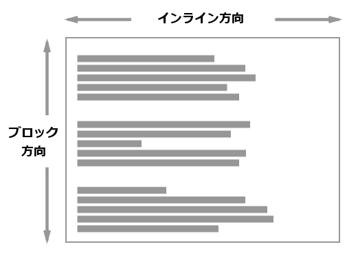
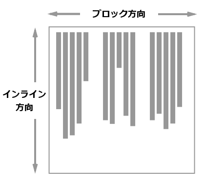

{{CSSRef}}

Logical Properties and Values (論理的プロパティと値) 仕様書では、 CSS のたくさんのプロパティや値のフローに関する対応付けを紹介しています。この記事はこの仕様書を紹介し、フローに関するプロパティと値を説明します。

## なぜ論理的プロパティが必要なのか

CSS は従来、画面の物理的な軸に沿って寸法を取っていました。したがって、ボックスを {{CSSxRef("width")}} および {{CSSxRef("height")}} を用いて記述したり、アイテムを `top` および `left` で配置したり、 left に浮動させたり、境界、マージン、パディングを `top`, `right`, `bottom`, `left` で割り当てたりします。 [Logical Properties and Values 仕様書](https://drafts.csswg.org/css-logical/)はこれらの物理的な値を論理的、またはフローやその反対に関連したものへの対応付けを定義します。例えば `start` と `end` は `left` と `right` または `top` と `bottom` に対応します。

なぜこれらの対応付けが必要なのでしょうか。 CSS グリッドを使用したレイアウトがあり、グリッドコンテナーに幅が設定されていて、アイテムを配置するために {{CSSxRef("align-self")}} および {{CSSxRef("justify-self")}} を使用していたとします。これらのプロパティはフローに相対的です。 `justify-self: start` はインライン軸の先頭にアイテムを配置し、 `align-self: start` はブロック軸の先頭にアイテムを配置します。

この部分の書字方向として `vertical-rl` を {{CSSxRef("writing-mode")}} プロパティに設定すると、配置は同様の方向で動作し続けます。インライン軸は垂直になり、ブロック軸は水平になります。しかし、幅がコンテナーの水平の寸法で割り当てられており、寸法が論理的またはテキストの流れではなく物理的な方向に結び付けられているため、グリッドは同じようには見えません。

`width` プロパティの代わりに論理的プロパティである {{CSSxRef("inline-size")}} を使用すれば、コンポーネントは表示される書字方向が何であっても同じように動作するようになります。

次の実行例を試してみましょう。 `.box` の `writing-mode` を `vertical-rl` から `horizontal-tb` へ変更して、プロパティが変わるとどのようにレイアウトが変わるかを確認することができます。

{{EmbedGHLiveSample("css-examples/logical/intro-grid-example.html", '100%', 700)}}

水平方向、下方向以外の書字方向でサイトを操作する場合や、クリエイティブな理由で書字方向を使用する場合、コンテンツの流れに関連づけることができるのはとても意味のあることです。

## ブロック軸とインライン軸

フローに対して相対的なプロパティや値を扱う上で重要な概念は、ブロックとインラインという 2 つの軸です。前述したように、フレックスボックスやグリッドレイアウトなどの新しい CSS レイアウト手法では、アイテムを配置する際に、 `right` と `left` や `top` と `bottom` ではなく、 `block` と `inline` の概念を使用します。

`inline` 軸は、使用されている書字方向でテキストの行が流れる方向の軸です。したがって、テキストが水平方向に左から右へ流れる英語の文書や、テキストが水平方向に右から左へ流れるアラビア語の文書では、インライン軸は*水平*になります。縦書きの文書 (日本語の文書など) に切り替えると、行が垂直方向に流れるので、縦書きの文書では行が縦に流れるので、インライン軸は*垂直*になります。

ブロック軸はもう一つの軸で、段落などのブロックが次々と表示される方向を示します。英語やアラビア語では垂直方向に表示されますが、縦書きの場合は水平方向に表示されます。

下の図は、横書きモードの場合のインラインとブロックの方向を示しています。

この図は、縦書きモードでのブロックとインラインの方向を示しています。

## 関連情報

- [グリッドレイアウトのボックス配置](/ja/docs/Web/CSS/CSS_Grid_Layout/Box_Alignment_in_CSS_Grid_Layout)
- [フレックスレイアウトのボックス配置](/ja/docs/Web/CSS/CSS_Box_Alignment/Box_Alignment_in_Flexbox)
- [Understanding Logical Properties and Values](https://www.smashingmagazine.com/2018/03/understanding-logical-properties-values/)
- [書字方向](/ja/docs/Web/CSS/CSS_Flow_Layout/Flow_Layout_and_Writing_Modes)
