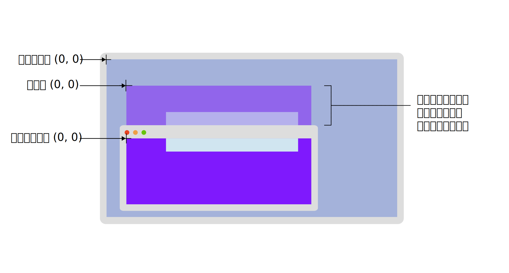

{{CSSRef}}

グラフィックのコンテキストでピクセルの位置を指定する場合（ちょうど[代数学](https://ja.wikipedia.org/wiki/代数学)で座標系を指定する場合と同様）、その位置はコンテキスト内の固定点を基準として定義されます。この固定点は[原点](<https://ja.wikipedia.org/wiki/原点_(数学)>)と呼ばれています。位置は、コンテキストの各次元に沿った原点からのピクセル単位のオフセットで指定されます。

このガイドでは、 CSS オブジェクトモデルで使われる標準的な座標系を説明します。これらは一般に、原点がどこにあるかという点でのみ異なっています。

## 座標軸

ウェブ技術で使われる座標系では、慣例として水平方向のオフセットを *X 座標*と呼び、負の値は原点より左に、正の値は原点より右に位置することを示します。*Y 座標*は垂直方向のオフセットを指定し、負の値は原点より上、正の値は原点より下にあることを示します。

ウェブ上では、既定の原点は与えられたコンテキストの左*上*隅です（正の Y 座標の値は原点より下になります）。これは、ほとんどの数学的モデルが原点を左*下*隅に置いており、正の Y 座標の値が原点よりも上を示すのとは異なることに注意してください。

3つ目の次元を用いてオブジェクトを前から後ろに重ねる場合、 Z 軸を使用します。 Z 軸は、視聴者から画面の表面へと向かいます。CSS の z-index 属性は、位置を指定した要素がこの軸のどこに位置するかに影響し、見る人から遠ざかったり近づいたりする効果を与えます。

> [!NOTE]
> 実際には、これらの座標系の定義や方向は、 {{cssxref("transform")}} などの CSS プロパティを使って変更することができます。しかし、ここでは標準的な座標系についてだけ説明します。

## 標準 CSSOM 座標系

CSS オブジェクトモデルで使用する 4 つの標準座標系があります。
主要な座標系を支援するために、以下の図はビューポートの外にスクロールされたコンテンツを含むブラウザーウィンドウを持つモニターを表示させています。
ビューポートの外にスクロールされたページコンテンツは、「ページ」座標の元がどこにあるかを示すために、ブラウザーウィンドウの上に半透過率で表示されています。
「クライアント」、「ページ」、「ビューポート」座標系の原点が強調表示されています。



### オフセット

「オフセット」モデルを用いて指定される座標は、検査される要素またはイベントが発生した要素の左上隅を使用します。

例えば、{{domxref("MouseEvent", "マウスイベント", "", 1)}}が発生すると、イベントの {{domxref("MouseEvent.offsetX", "offsetX")}} と {{domxref("MouseEvent.offsetY", "offsetY")}} 属性で指定されたマウスの位置は、イベントを配信したノードの左上の角に相対的に示されます。原点は {{cssxref("padding-left")}} と {{cssxref("padding-top")}} によって指定された距離だけ内側に置かれます。

### ビューポート

「ビューポート」（または「クライアント」）座標系は、イベントが発生したビューポートまたは閲覧コンテキストの左上隅を原点として使用します。これは文書が表示される表示領域全体です。

例えばデスクトップコンピューターでは、 {{domxref("MouseEvent.clientX")}} と {{domxref("MouseEvent.clientY")}} プロパティは、イベント発生時のマウスカーソルの位置を、 {{domxref("window")}} の左上角からの相対位置で示します。
スタイラスやポインターを使用している場合、{{domxref("TouchEvent", "タッチイベント", "", 1)}}における {{domxref("Touch.clientX")}} と {{domxref("Touch.clientY")}} の座標は同じ原点からの相対座標です。

ウィンドウの左上隅は、文書の内容やスクロールの有無に関わらず、常に (0, 0) です。言い換えれば、文書をスクロールすると、文書内の任意の位置のビューポート座標が変化します。

### ページ

「ページ」座標系は、レンダリングされた {{domxref("Document")}} 全体の左上隅からの相対ピクセル位置を与えます。
つまり、文書内の要素のこの点は、レイアウト変更によって要素が移動しない限り、ユーザーが文書内を水平または垂直にスクロールしても同じ座標になります。

マウスイベントの {{domxref("MouseEvent.pageX", "pageX")}} と {{domxref("MouseEvent.pageY", "pageY")}} 属性は、イベントが発生した時のマウスの位置を、文書の左上隅を基準として提供するものです。
{{domxref("TouchEvent", "タッチイベント", "", 1)}}における {{domxref("Touch.pageX")}} と {{domxref("Touch.pageY")}} の座標は同じ原点からの相対座標です。

### スクリーン

最後に、「スクリーン」モデルについて説明します。これは、ユーザーの画面空間の左上を原点とするものです。
この座標系の各点は、単一の論理ピクセルを表しますので、値は各軸に沿っ て整数値で増加したり減少したりします。
文書内の指定された点の位置は、例えば格納されているウィンドウが移動された場合や、ユーザーの画面形状が変更された場合（ディスプレイの解像度が変更された場合や、システムにモニターが追加・除去された場合）などに変化します。
{{domxref("MouseEvent.screenX")}} と {{domxref("MouseEvent.screenY")}} プロパティは、画面の原点を基準としたマウスイベントの位置の座標を示します。
{{domxref("TouchEvent", "タッチイベント", "", 1)}}における {{domxref("Touch.screenX")}} と {{domxref("Touch.screenY")}} の座標は同じ原点からの相対座標です。

## 例

要素内のマウス座標をログ出力する例を見ていきましょう。
マウスが内側のボックスに入ったり、内側を移動したり、内側から出たりするたびに、利用できる 4 つのシステムのそれぞれで現在のマウス座標をログ出力することで、イベントが処理されます。

### JavaScript

JavaScript では、コードは {{domxref("EventTarget.addEventListener", "addEventListener()")}} を呼び出して、 inner ボックスに {{domxref("Element/mouseenter_event", "mouseenter")}}、{{domxref("Element/mousemove_event", "mousemove")}}、{{domxref("Element/mouseleave_event", "mouseleave")}} のイベントハンドラーを設定します。
それぞれのイベントに対して `setCoords()` 関数を呼び出して、`<p>` 要素の内部テキストに各システムの座標を設定しています。

```js
const log = document.querySelector(".log");
const inner = document.querySelector(".inner");

function setCoords(e) {
  log.innerText = `
    オフセット X/Y: ${e.screenX}, ${e.screenY}
    ビューポート X/Y: ${e.clientX}, ${e.clientY}
    ページ X/Y: ${e.pageX}, ${e.pageY}
    スクリーン X/Y: ${e.screenX}, ${e.screenY}`;
}

inner.addEventListener("mousemove", setCoords);
inner.addEventListener("mouseenter", setCoords);
inner.addEventListener("mouseleave", setCoords);
```

### HTML

HTML は `"log"` クラスを持つ `<p>` を収めており、マウスイベントのデータを表示します。

```html
<div class="outer">
  <div class="inner">
    <p class="log">この部分にマウスオーバーすると座標が表示されます</p>
  </div>
</div>
```

### CSS

コンテンツを含むボックスのクラス `"outer"` は、コンテンツをスクロールさせたときのマウス座標の影響を見るために、意図的に幅を広くしています。
`"inner"` の段落はマウスイベントを記録する場所です。

```css
.outer {
  width: 1000px;
}

.inner {
  font-family: monospace;
  position: relative;
  width: 500px;
  height: 150px;
  top: 25px;
  left: 100px;
  background-color: darkblue;
  color: white;
  cursor: crosshair;
  user-select: none;
}

.log {
  position: relative;
  width: 100%;
  text-align: center;
}
```

### 結果

この結果を実際に見てみましょう。青いボックスの中をマウスで移動しながら、マウスの X 座標と Y 座標の値がさまざまな座標系で変化する様子をご覧ください。

{{EmbedLiveSample("Example", 600, 250)}}

## 関連情報

- [CSS 座標変換の使用](/ja/docs/Web/CSS/CSS_transforms/Using_CSS_transforms): 座標系を変更する方法
- {{domxref("MouseEvent", "マウスイベント", "", 1)}}の座標:

  - {{domxref("MouseEvent.offsetX")}} と {{domxref("MouseEvent.offsetY")}}
  - {{domxref("MouseEvent.clientX")}} と {{domxref("MouseEvent.clientY")}}
  - {{domxref("MouseEvent.pageX")}} と {{domxref("MouseEvent.pageY")}}
  - {{domxref("MouseEvent.screenX")}} と {{domxref("MouseEvent.screenY")}}

- {{domxref("Touch", "タッチイベント")}}の座標:

  - {{domxref("Touch.clientX")}} と {{domxref("Touch.clientY")}}
  - {{domxref("Touch.pageX")}} と {{domxref("Touch.pageY")}}
  - {{domxref("Touch.screenX")}} と {{domxref("Touch.screenY")}}
