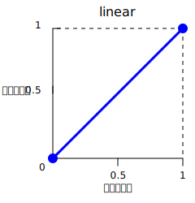
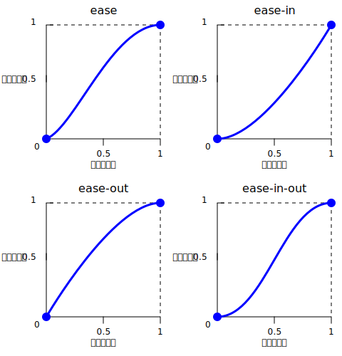
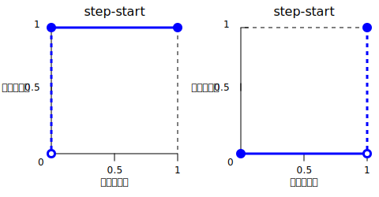
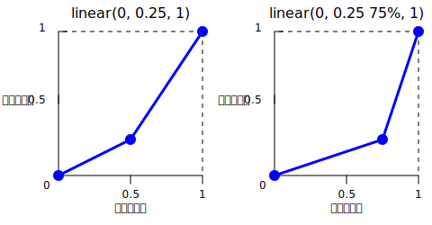
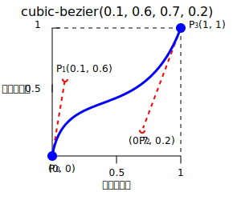
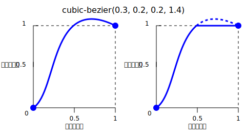

{{CSSRef}}

**`<easing-function>`** は [CSS](/ja/docs/Web/CSS) の[データ型](/ja/docs/Web/CSS/CSS_Types)で、数値が変化する速度を記述する数学的な関数を表します。

この 2 つの値の間の遷移は様々な形で適用される可能性があります。アニメーション中に値が変化する速さを記述するために使用されることがあります。これにより、この間、アニメーションの速度を変化させることができます。イージング関数は、CSS の [transition](/ja/docs/Web/CSS/transition-timing-function) および [animation](/ja/docs/Web/CSS/animation-timing-function) プロパティで指定することができます。

## 構文

```css
/* linear 関数とキーワード */
/* linear(<point-list>) */
linear(1, -0.5, 0)
linear

/* cubic-bezier 関数とキーワード */
/* cubic-bezier(<x1>, <y1>, <x2>, <y2>) */
cubic-bezier(0.42, 0.0, 1.0, 1.0)
ease
ease-in
ease-out
ease-in-out

/* steps 関数とキーワード */
/* steps(<number-of-steps>, <direction>) */
steps(4, end)
step-start
step-end
```

### 値

- `<point-list>`

  - : 線形の停止点のリストです。

- `linear`

  - : 補間が直線的に行われることを示します。このキーワードは、イージング関数 `linear(0, 1)` を表します。



- `<x1>`, `<y1>`, `<x2>`, `<y2>`

  - : {{cssxref("&lt;number&gt;")}} 値で、3 次ベジェ曲線を定義する P1 点と P2 点の横軸と縦軸を表します。 `x1` および `x2` は範囲 `[0, 1]` でなければならず、それ以外の場合は無効です。

- `ease`

  - : 補間がゆっくり始まり、急激に加速し、終わりに向かって徐々に遅くなることを示します。このキーワードは、イージング関数 `cubic-bezier(0.25, 0.1, 0.25, 1.0)` を表します。これは [`ease-in-out`](#ease-in-out) と似ていますが、始めのうちはより急激に加速されます。

- `ease-in`

  - : 補間がゆっくり始まり、その後次第に加速していき、最終状態に達するとアニメーションは突然停止します。このキーワードはイージング関数 `cubic-bezier(0.42, 0.0, 1.0, 1.0)` を表します。

- `ease-out`

  - : 補間が急速に始まり、最終状態にかけて次第に減速していくことを示します。このキーワードはタイミング関数 `cubic-bezier(0.0, 0.0, 0.58, 1.0)` を表します。

- `ease-in-out`

  - : 補間がゆっくり始まり、加速し、終わりに向かって減速することを示します。このキーワードは、イージング関数 `cubic-bezier(0.42, 0.0, 0.58, 1.0)` を表します。始めは [`ease-in`](#ease-in) 関数のように動作し、終わりは [`ease-out`](#ease-out) 関数のように動作します。



- `<number-of-steps>`

  - : 厳密に正の {{cssxref("&lt;integer&gt;")}} で、段階関数を構成する等間隔の段数を表します。

- `<direction>`

  - : ジャンプが発生するタイミングを示す以下のキーワードのいずれかです。
    - `jump-start` は補間の開始時に最初の段階が発生することを指定します。
    - `jump-end` は補間の完了時に最後の段階が発生することを指定します。
    - `jump-both` は 0% と 100% の両方の位置で停止し、補間の繰り返しの間に効果的に段階を入れることを指定します。
    - `jump-none` どちらの端にもジャンプしません。代わりに、それぞれ区間の 1/n ごとに 0% の位置と 100% の位置の両方を保持します。
    - `start` は `jump-start` と同等です。
    - `end` は `jump-end` と同等です。これが既定値です。

- `step-start`

  - : 補間はすぐに最終状態に遷移し、最後までその状態を維持します。このキーワードは、イージング関数 `steps(1, jump-start)` または `steps(1, start)` を表します。

- `step-end`

  - : 補間、終了するまで初期状態のままで、終了時点で直接最終状態にジャンプします。このキーワードは、イージング関数 `steps(1, jump-end)` または `steps(1, end)` を表します。



## 解説

イージング関数は 3 つの種類があります。

- [線形](#線形イージング関数)
- [3 次ベジェ](#3_次ベジェイージング関数)
- [段階](#段階イージング関数)

### 線形イージング関数

`linear()` 関数は、その点間を直線的に補間する区分線形関数を定義します。これにより、跳ね返り効果や弾性効果など、より複雑なアニメーションを近似的に表現することができます。この補間は、始めから終わりまで一定の割合で行われます。典型的な `linear()` 関数の使用法は、多くの点を指定して何らかの曲線に近似させることです。

`linear()` 関数を定義するときには、 `linear(0, 0.25, 1)` のように、_線形イージング点_ をリストで指定します。この `linear()` 関数は、 `0` から `0.25` 、そして `1` へと直線的に移動するイージング関数を生成します。



別の例として、 `linear(0, 0.25%, 1)` という関数を考えてみましょう。これは、 75% の時間で `0` から `.25` へと遷移し、最後の 25% を `.25` から `1` へと遷移する線形イージング関数を生成します。

`linear` キーワードは、 2 つの点を持つ `linear()` 関数を生成します。これは、イージング関数 `cubic-bezier(0.0, 0.0, 1.0, 1.0)` と同じです。

[`linear`](#linear) キーワードはイージング関数 `linear(0, 1)` と等価です。

### 3 次ベジェイージング関数

`cubic-bezier()` 関数記法は、[3 次ベジェ曲線](https://ja.wikipedia.org/wiki/%E3%83%99%E3%82%B8%E3%82%A7%E6%9B%B2%E7%B7%9A)を定義します。イージング関数のサブセットである 3 次ベジェのイージング関数は、{{Glossary("interpolation", "補間")}}の始まりと終わりを滑らかにするために使用できるので、「スムーズな」イージング関数とよく呼ばれます。これらはどちらも {{cssxref("&lt;number&gt;")}} として表される、入力の進行と出力の進行を関連付けます。これらの値について、 `0.0` は初期状態を表し、 `1.0` は最終状態を表します。



3 次ベジェ曲線は 4 個の点 P0, P1, P2, P3 によって定義されます。P0 と P3 は曲線の始点と終点を表します。CSS では、この点は座標の進行（横軸が入力の進行、縦軸が出力の進行）として固定されています。P0 は `(0, 0)` で進行の開始かつ初期状態を示します。P3 は `(1, 1)` で進行の終了かつ最終状態を示します。

すべての 3 次ベジェ曲線が[数学的な関数](https://ja.wikipedia.org/wiki/%E9%96%A2%E6%95%B0_%28%E6%95%B0%E5%AD%A6%29) とは限らないため、どの 3 次ベジェ曲線もイージング関数として適しているわけではありません。すなわち、曲線は横座標で 0 から 1 の値をとります。 P0 および P3 は CSS の定義で固定されているので、P1 および P2 の横座標の値が `[0, 1]` の範囲にある場合のみ、3 次ベジェ曲線は関数であり、それゆえ有効になります。

P1 または P2 の縦軸が `[0, 1]` の範囲外の 3 次ベジェ曲線は、値が最終状態より遠くに行き、その後戻るようになることがあります。アニメーションでは、 {{cssxref("left")}} や {{cssxref("right")}} などのいくつかのプロパティで、これは一種の「跳ね返る」効果を生み出します。



しかし、一部のプロパティでは、許容範囲外になると出力が制限されます。例えば、{{CSSXref("color_value/rgb", "rgb()")}} における色成分が `255` より大きい、あるいは `0` より小さい場合、最も近い許容値（それぞれ `255` と `0`）に丸められます。一部の `cubic-bezier()` 曲線はこのプロパティを示します。

不正な 3 時限ベジェ曲線を指定すると、 CSS はその属性全体を無視します。

[`ease`](#ease)、[`ease-in`](#ease-in)、[`ease-out`](#ease-out)、[`ease-in-out`](#ease-in-out) のそれぞれのキーワードは、それぞれ特定の `cubic-bezier()` 値と同等です。

### 段階イージング関数

`steps()` 関数記法は、出力値の領域を等距離の段階に分割する段階関数を定義するものです。この段階関数のサブクラスは、[階段関数](https://ja.wikipedia.org/wiki/階段関数)とも呼ばれることがあります。

`steps()` 関数を説明するいくつかの例を示します。

```css
steps(2, jump-start) /* Or steps(2, start) */
steps(4, jump-end) /* Or steps(4, end) */
steps(5, jump-none)
steps(3, jump-both)
```

![「入力の進行」と「出力の進行」のグラフで、"steps(2, jump-start)" は、(0, 0.5) と (0.5, 1) からそれぞれ 0.5 単位で伸びる水平線を表示させ、原点と (0.5, 0.5) を中空点としています。"steps(4, jump-end)" は、それぞれ (0, 0)、(0.25, 0.25)、(0.5, 0.5)、(0.75, 0.75) から 0.25 単位で伸びる水平線を表示させ、(0.25, 0)、(0.5, 0.25)、(0.75, 0.5) に中空点があります。"steps(5, jump-none)" は、それぞれ (0, 0)、(0.2, 0.25)、(0.4, 0.5)、(0.6, 0.75)、(0.8, 1) から 0.2 単位で伸びる水平線を表示させ、(0.2, 0)、(0.4, 0.25)、(0.6, 0.5)、(0.8, 0.75) が中空点です。"steps(3, jump-both)" は、(0, 0.25)、(1/3, 0.5)、(2/3, 0.75) からそれぞれ 1/3 単位で伸びる水平線を示し、(1, 1) を点、(1/3, 0.25)、(2/3, 0.5)、(1, 0.75) を中空点とします。](jump.svg)

[`step-start`](#step-start) と [`step-end`](#step-end) の各キーワードは、それぞれ特定の `steps()` の値を表します。

## 形式文法

{{csssyntax}}

## 例

### イージング関数の比較

この例では、提供されているボタンを使ってアニメーションを開始したり停止したりすることができ、メニューを選択してイージング関数を、利用可能なキーワードに加えていくつかの `cubic-bezier()` および `steps()` のオプションの中から選択することができるようになっています。オプションを選択した後、指定されたボタンを使用して、トランジションを始めたり、止めたりすることができます。

#### HTML

```html
<div>
  <div></div>
</div>
<ul>
  <li>
    <button class="animation-button">アニメーションを開始</button>
  </li>
  <li>
    <label for="easing-select">イージング関数を選択:</label>
    <select id="easing-select">
      <option selected>linear</option>
      <option>linear(0, 0.5 50%, 1)</option>
      <option>ease</option>
      <option>ease-in</option>
      <option>ease-in-out</option>
      <option>ease-out</option>
      <option>cubic-bezier(0.1, -0.6, 0.2, 0)</option>
      <option>cubic-bezier(0, 1.1, 0.8, 4)</option>
      <option>steps(5, end)</option>
      <option>steps(3, start)</option>
      <option>steps(4)</option>
    </select>
  </li>
</ul>
```

#### CSS

```css
body > div {
  position: relative;
  height: 100px;
}

div > div {
  position: absolute;
  width: 50px;
  height: 50px;
  background-color: blue;
  background-image: radial-gradient(
    circle at 10px 10px,
    rgba(25, 255, 255, 0.8),
    rgba(25, 255, 255, 0.4)
  );
  border-radius: 50%;
  top: 25px;
  animation: 1.5s infinite alternate;
}

@keyframes move-right {
  from {
    left: 10%;
  }

  to {
    left: 90%;
  }
}

li {
  display: flex;
  align-items: center;
  justify-content: center;
  margin-bottom: 20px;
}
```

#### JavaScript

```js
const selectElem = document.querySelector("select");
const startBtn = document.querySelector("button");
const divElem = document.querySelector("div > div");

startBtn.addEventListener("click", () => {
  if (startBtn.textContent === "アニメーションを開始") {
    divElem.style.animationName = "move-right";
    startBtn.textContent = "アニメーションを停止";
    divElem.style.animationTimingFunction = selectElem.value;
  } else {
    divElem.style.animationName = "unset";
    startBtn.textContent = "アニメーションを開始";
  }
});

selectElem.addEventListener("change", () => {
  divElem.style.animationTimingFunction = selectElem.value;
});
```

#### 結果

{{EmbedLiveSample("comparing_the_easing_functions", "100%", 200)}}

### cubic-bezier() 関数の使用

以下は CSS における正しい 3 次ベジェ曲線の使い方です。

```css example-good
/* 4 つの値が [0, 1] の範囲に含まれる、標準的なベジェ曲線 */
cubic-bezier(0.1, 0.7, 1.0, 0.1)

/* <整数値> は <数量> でもあるので、<整数値> を用いても有効です。 */
cubic-bezier(0, 0, 1, 1)

/* 横軸で負数を用いるのは有効であり、はずむ効果をもたらします。 */
cubic-bezier(0.1, -0.6, 0.2, 0)

/* 横軸において 1.0 を超える値も有効です。 */
cubic-bezier(0, 1.1, 0.8, 4)
```

以下は 3 次ベジェ曲線の定義は不正です。

```css example-bad
/* アニメーションさせるものは色ですが、
   ベジェ曲線に用いるのは割合の数値です。 */
cubic-bezier(0.1, red, 1.0, green)

/* 定義域は [0, 1] の範囲であったり、曲線が時間の
関数でなかったりする場合です。 */
cubic-bezier(2.45, 0.6, 4, 0.1)

/* 2 つの点を定義する必要があり、それらに既定値はありません。 */
cubic-bezier(0.3, 2.1)

/* 縦座標は [0, 1] の範囲にある必要があり、
   さもないと曲線は関数になりません。 */
cubic-bezier(-1.9, 0.3, -0.2, 2.1)
```

### steps() 関数の使用

以下のタイミング関数は妥当です。

```css example-good
/* 5 段階あり、最後の段階は
   アニメーションの完了直前に発生します。 */
steps(5, end)

/* 2 段階の階段で、最初の段階は
   アニメーションの開始時に発生します。 */
steps(2, start)

/* 第 2 の引数は省略可能です。 */
steps(2)
```

> **メモ:** アニメーションに複数の停止点がある場合、 `steps()` 関数で指定した手順がそれぞれの節に適用されます。したがって、3 つの区間と `steps(2)` を持つアニメーションは、区間ごとに 2 つずつ、合計で 6 つの段階を持つことになります。

以下のイージング関数は不正です。

```css example-bad
/* 最初の引数は <integer> でなければならず、
   整数と同じ値であっても実数であってはいけません。 */
steps(2.0, jump-end)

/* 段数は負の値であってはいけません。 */
steps(-3, start)

/* 段数は少なくとも 1 つ必要です。 */
steps(0, jump-none)
```

## 仕様書

{{Specifications}}

## ブラウザーの互換性

{{Compat}}

## 関連情報

- [CSS アニメーション](/ja/docs/Web/CSS/CSS_animations)
- [CSS トランジション](/ja/docs/Web/CSS/CSS_transitions)
- [cubic-bezier](https://cubic-bezier.com/)
