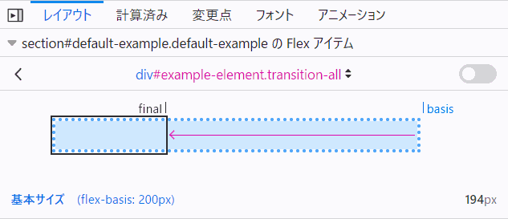

{{CSSRef}}

**`flex-basis`** は [CSS](/ja/docs/Web/CSS) のプロパティで、フレックスアイテムの主要部分の初期の寸法を設定します。 {{Cssxref("box-sizing")}} で設定していない限り、このプロパティはコンテンツボックスの寸法を定義します。

{{EmbedInteractiveExample("pages/css/flex-basis.html")}}

この例では、3 つすべてのアイテムの {{cssxref("flex-grow")}} と {{cssxref("flex-shrink")}} プロパティがともに `1` に設定されており、フレックスアイテムが初期の `flex-basis` から伸長したり縮小したりできることを示しています。

このデモでは、最初のアイテムの `flex-basis` を変更します。そして、その `flex-basis` を基準にして伸長したり縮小したりします。つまり、例えば最初のアイテムの `flex-basis` が `200px` の場合、最初は 200px で表示されますが、他のアイテムが最低でも `min-content` の大きさであることを考慮して、利用可能な空間に合わせて縮小されます。

下記の図は、Firefox の [Flexbox インスペクター](/ja/docs/Tools/Page_Inspector/How_to/Examine_Flexbox_layouts)がアイテムがどのような寸法になるのかを理解するのに役立つことを示しています。



> **メモ:** (`auto` 以外の) `flex-basis` と `width` (または `flex-direction: column` の場合は `height`) の両方が要素に設定されていた場合、 `flex-basis` が優先されます。

## 構文

```css
/* 幅を指定する */
flex-basis: 10em;
flex-basis: 3px;
flex-basis: auto;

/* 固有のサイズ指定キーワード */
flex-basis: fill;
flex-basis: max-content;
flex-basis: min-content;
flex-basis: fit-content;

/* フレックスアイテムの内容物に基づいて自動設定する */
flex-basis: content;

/* グローバル値 */
flex-basis: inherit;
flex-basis: initial;
flex-basis: revert;
flex-basis: unset;
```

`flex-basis` プロパティは、`content` キーワードまたは `<'width'>` で指定します。

### 値

- `<'width'>`
  - : 絶対的な {{cssxref("&lt;length&gt;")}}、親のフレックスコンテナーの主軸方向の寸法に対する {{cssxref("&lt;percentage&gt;")}}、あるいは `auto` キーワードで定義します。負の値は無効です。既定値は `auto` です。
- `content`

  - : フレックスアイテムの内容物に基づいて、自動的に大きさを決めます。

    > **メモ:** この値は Flexible Box Layout の初期リリースでは定義されていませんでしたので、古い実装では対応していない場合があります。主軸方向の寸法 ([width](https://drafts.csswg.org/css2/visudet.html#propdef-width) または [height](https://drafts.csswg.org/css2/visudet.html#propdef-height)) を `auto` にするのと合わせて `auto` を使用することで、同等の効果を得られます。
    >
    > - もともと、`flex-basis:auto` は「自身の `width` または `height` プロパティを参照する」という意味でした。
    > - その後 `flex-basis:auto` の意味が自動拡大縮小設定に変わり、また「自身の `width` または `height` プロパティを参照する」キーワードとして "main-size" を導入しました。これは [Firefox バグ 1032922](https://bugzil.la/1032922) で実装しました。
    > - さらに、この変更が [Firefox バグ 1093316](https://bugzil.la/1093316) で戻されて `auto` が再び「自身の `width` または `height` プロパティを参照する」になり、自動拡大縮小設定を行うための `content` キーワードを新たに導入しました (content キーワードの追加は [Firefox バグ 1105111](https://bugzil.la/1105111) で扱っています)。

## 公式定義

{{cssinfo}}

## 形式文法

{{csssyntax}}

## 例

<h3 id="Setting_flex_item_initial_sizes">フレックスアイテムの初期の寸法の設定</h3>

#### HTML

```html
<ul class="container">
  <li class="flex flex1">1: flex-basis test</li>
  <li class="flex flex2">2: flex-basis test</li>
  <li class="flex flex3">3: flex-basis test</li>
  <li class="flex flex4">4: flex-basis test</li>
  <li class="flex flex5">5: flex-basis test</li>
</ul>

<ul class="container">
  <li class="flex flex6">6: flex-basis test</li>
</ul>
```

#### CSS

```css
.container {
  font-family: arial, sans-serif;
  margin: 0;
  padding: 0;
  list-style-type: none;
  display: flex;
  flex-wrap: wrap;
}

.flex {
  background: #6ab6d8;
  padding: 10px;
  margin-bottom: 50px;
  border: 3px solid #2e86bb;
  color: white;
  font-size: 14px;
  text-align: center;
  position: relative;
}

.flex:after {
  position: absolute;
  z-index: 1;
  left: 0;
  top: 100%;
  margin-top: 10px;
  width: 100%;
  color: #333;
  font-size: 12px;
}

.flex1 {
  flex-basis: auto;
}

.flex1:after {
  content: "auto";
}

.flex2 {
  flex-basis: max-content;
}

.flex2:after {
  content: "max-content";
}

.flex3 {
  flex-basis: min-content;
}

.flex3:after {
  content: "min-content";
}

.flex4 {
  flex-basis: fit-content;
}

.flex4:after {
  content: "fit-content";
}

.flex5 {
  flex-basis: content;
}

.flex5:after {
  content: "content";
}

.flex6 {
  flex-basis: fill;
}

.flex6:after {
  content: "fill";
}
```

#### 結果

{{EmbedLiveSample('Setting_flex_item_initial_sizes', '', '360')}}

## 仕様書

{{Specifications}}

## ブラウザーの互換性

{{Compat}}

## 関連情報

- CSS フレックスボックスガイド: _[フレックスボックスの基本概念](/ja/docs/Web/CSS/CSS_Flexible_Box_Layout/Basic_Concepts_of_Flexbox)_
- CSS フレックスボックスガイド: _[フレックスアイテムの主軸方向における比率の制御](/ja/docs/Web/CSS/CSS_Flexible_Box_Layout/Controlling_Ratios_of_Flex_Items_Along_the_Main_Ax)_
- {{cssxref("width")}}
