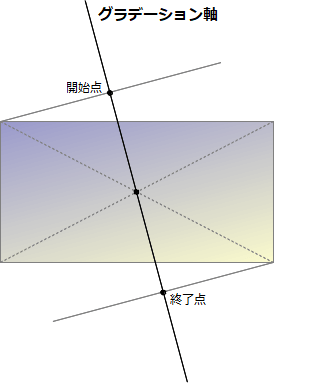

{{CSSRef}}

**`linear-gradient()`** は [CSS](/ja/docs/Web/CSS) の[関数](/ja/docs/Web/CSS/CSS_Functions)で、二つ以上の色の連続的な直線に沿った変化から構成される画像を生成します。結果は {{CSSxRef("&lt;gradient&gt;")}} データ型のオブジェクトであり、これは {{CSSxRef("&lt;image&gt;")}} の特殊型です。

{{EmbedInteractiveExample("pages/css/function-linear-gradient.html")}}

## 構文

```css
/* 45度に傾いたグラデーションで、
   青から始まり赤で終わる */
linear-gradient(45deg, blue, red);

/* 右下から左上に向かうグラデーションで、
   青から始まり赤で終わる */
linear-gradient(to left top, blue, red);

/* 色経由点: 下から上に向かうグラデーションで、
   青から始まり、長さの 40% のところで緑になり、
   赤で終わる */
linear-gradient(0deg, blue, green 40%, red);

/* 色ヒント: 左から右に向かうグラデーションで、
   赤から始まり、グラデーションの長さ全体の
   10% に中間点が来て、残りの 90% の長さをかけて
   青色に変わる */
linear-gradient(.25turn, red, 10%, blue);

/* 複数位置の色経由点: 45 度傾いたグラデーションで、
   左下半分が赤で右上半分が青、
   赤から青への変化は明確な線 */
linear-gradient(45deg, red 0 50%, blue 50% 100%);
```

### 値

- `<side-or-corner>`

  - : グラデーション軸の開始点の位置。指定する場合は、 `to` に続けて 2 つ以下のキーワードから成ります。一つは水平方向の辺 (`left` または `right`)、もう一方は垂直方向の辺 (`top` または `bottom`) です。辺を表すキーワードは順不同です。指定しない場合は、 `to bottom` が既定になります。

    `to top`, `to bottom`, `to left`, `to right` の値は、 `0deg`, `180deg`, `270deg`, `90deg` の角度にそれぞれ対応します。他の値は角度に変換されます。

- {{CSSxRef("&lt;angle&gt;")}}
  - : グラデーション軸の方向を角度で示します。 `0deg` の値は `to top` と等価で、値が増加するとそこから時計回りに回ります。</dd>
- `<linear-color-stop>`
  - : 色経由点の {{CSSxRef("&lt;color&gt;")}} の値であり、任意でその後に停止位置を指定します (グラデーションの軸に沿った {{CSSxRef("&lt;percentage&gt;")}} または {{CSSxRef("&lt;length&gt;")}} の位置)。</dd>
- `<color-hint>`
  - : 隣り合う色経由点の間でどのようにグラデーションが進むかを定義する補間のヒントです。長さによって、どの位置で二つの色経由点のグラデーション色が色の移行の中間点に達するかを定義します。省略された場合、色の移行の中間点は二つの色経由点の中点になります。

> **Note:** [CSS グラデーションにおける色経由点](#gradient_with_multiple_color_stops)の描画は、 [SVG グラデーション](/ja/docs/Web/SVG/Tutorial/Gradients)と同じ規則に従います。
>
> なお、上記の最初の例は、 Mozilla Firefox (特にバージョン 80.0b3) では、正確には図のようには表示されません。描かれているように表示するには、 html の height プロパティを 100% または 100vh に設定する必要があります。

## 解説

他のグラデーションと同様、線形グラデーションは[自身の寸法を持ちません](/ja/docs/Web/CSS/image#description)。つまり、画像本来の寸法や、推奨される縦横比を持たないということです。実際の寸法は、適用先の要素の寸法と一致します。

繰り返して領域を埋め尽くす線形グラデーションを生成するには、代わりに {{cssxref("gradient/repeating-linear-gradient()", "repeating-linear-gradient()")}} 関数を使用してください。

`<gradient>` は CSS の `<image>` データ型に所属しますので、 `<image>` が使用できるところでのみ使用できます。このため、 `linear-gradient` は {{CSSxRef("background-color")}} や、その他の {{CSSxRef("&lt;color&gt;")}} を要求するプロパティでは動作しません。

### 線形グラデーションの構成

線形グラデーションは、グラデーション軸 (Gradient line) と呼ばれる軸によって定義されます。軸上の各点にはそれぞれ違った色が割り当てられます。なめらかなグラデーションを作成するために、 `linear-gradient()` 関数はグラデーション軸と直行する直線を、グラデーション軸上の交点の色で連続して引きます。



グラデーション軸は、グラデーション画像を含むボックスの中心と、角度によって定義されます。グラデーションの色は、開始点 (Starting point)、 終了点 (Ending point) と、省略可能な色経由点 (color-stop point) の各点でそれぞれ定義されます。

開始点は、グラデーション軸の最初の色が始まる点です。終了点は最後の色が終わるところです。これらの点は、グラデーション軸とそれに直交し、ボックスの同一象限にあるコーナーを通る直線との交点によって定義されます。ただ、もっと簡単に、ボックスの中心を原点としたときの開始点の点対称な位置としても定義できます。こうした何だかややこしい開始点と終了点の定義が、*マジックコーナー*と呼ばれる興味深い効果を生みました。開始点と終了点に近いコーナーは、それぞれ開始点と終了点と同じ色を持ちます。

#### グラデーションのカスタマイズ

グラデーション軸に色経由点を追加することで、開始点と終了点の間で高度にカスタマイズした変化を作成することができます。色経由点は {{CSSxRef("&lt;length&gt;")}} や {{CSSxRef("&lt;percentage&gt;")}} データ型を使って、明示的に定義することができます。もし場所を定義しなかったときは、直前の点と直後の点の中間点になります。以下の二つのグラデーションは等価です。

```css
linear-gradient(red, orange, yellow, green, blue);
linear-gradient(red 0%, orange 25%, yellow 50%, green 75%, blue 100%);
```

ある色経由点の色から次の色経由点の色まで滑らかに色が変化し、色と色の中間点は、既定では色の変化の中間の位置になります。色の変化の中間点をどこに置くかを示すために、二つの色の間でラベルのない % の色ヒントを追加することで、色の中間点を二つの色経由点の間の任意の位置に移動することができます。次の例では、純粋な赤を先頭から 10% の位置まで、純粋な青を 90% の位置から末尾までに配置します。 10% から 90％ までの間は、赤から青への色変化ですが、色ヒントがない 30% があるので、変化の中間点は 50% の位置ではなく 30% の位置になります。

```css
linear-gradient(red 10%, 30%, blue 90%);
```

二つ以上の色経由点が同じ位置である場合、その位置で宣言された最初と最後の色の間で明確な線になります。

色経由点は昇順に並べてください。次の色経由点がより小さな値になると、以前の色経由点を上書きすることになり、急な変化になります。以下の例では、赤から始まって 40% の位置で黄色になり、それから 25% にわたって黄色から青への変化になります。

```css
linear-gradient(red 40%, yellow 30%, blue 65%);
```

色経由点には複数の位置が利用できます。 CSS 宣言の中で二つの位置を含めることで、二つの隣り合う色経由点として色を宣言することができます。

```css
linear-gradient(red 0%, orange 10%, orange 30%, yellow 50%, yellow 70%, green 90%, green 100%);
linear-gradient(red, orange 10% 30%, yellow 50% 70%, green 90%);
linear-gradient(red 0%, orange 10% 30%, yellow 50% 70%, green 90% 100%);
```

既定では、 0% の経由点に色がない場合、宣言されている最初の色がその場所の色になります。同様に、最後の色経由点に位置が宣言されていない場合は、最後の色が 100% の位置まで続くか、 100% の位置の色になります。

## 例

<h3 id="Gradient_at_a_45-degree_angle">45 度 のグラデーション</h3>

```css hidden
body {
  width: 100vw;
  height: 100vh;
}
```

```css
body {
  background: linear-gradient(45deg, red, blue);
}
```

{{EmbedLiveSample("Gradient_at_a_45-degree_angle", 120, 120)}}

<h3 id="Gradient_that_starts_at_60_of_the_gradient_line">グラデーション軸の 60% から始まるグラデーション</h3>

```css hidden
body {
  width: 100vw;
  height: 100vh;
}
```

```css
body {
  background: linear-gradient(135deg, orange 60%, cyan);
}
```

{{EmbedLiveSample("Gradient_that_starts_at_60_of_the_gradient_line", 120, 120)}}

<h3 id="Gradient_with_multi-position_color_stops">複数の位置の色経由点があるグラデーション</h3>

この例は複数の位置の色経由点を使用しており、隣り合う色に同じ色経由値があるため、縞模様の効果になります。

```css hidden
body {
  width: 100vw;
  height: 100vh;
}
```

```css
body {
  background: linear-gradient(to right,
     red 20%, orange 20% 40%, yellow 40% 60%, green 60% 80%, blue 80%);
}
```

{{EmbedLiveSample("Gradient_with_multi-position_color_stops", 120, 120)}}

<h3 id="More_linear-gradient_examples">その他のグラデーションの例</h3>

他の例は [CSS グラデーションの使用](/ja/docs/Web/CSS/CSS_Images/Using_CSS_gradients)を参照してください。

## 仕様書

{{Specifications}}

## ブラウザーの互換性

{{Compat}}

## 関連情報

- [CSS グラデーションの使用](/ja/docs/Web/CSS/CSS_Images/Using_CSS_gradients)
- 他のグラデーション関数: {{cssxref("gradient/repeating-linear-gradient()", "repeating-linear-gradient()")}}, {{cssxref("gradient/radial-gradient()", "radial-gradient()")}}, {{cssxref("gradient/repeating-radial-gradient()", "repeating-radial-gradient()")}}, {{cssxref("gradient/conic-gradient()", "conic-gradient()")}}, {{cssxref("gradient/repeating-conic-gradient()", "repeating-conic-gradient()")}}
- {{CSSxRef("&lt;image&gt;")}}
- {{cssxref("element()")}}
- {{cssxref("image/image()","image()")}}
- {{cssxref("image/image-set()","image-set()")}}
- {{cssxref("cross-fade()")}}
