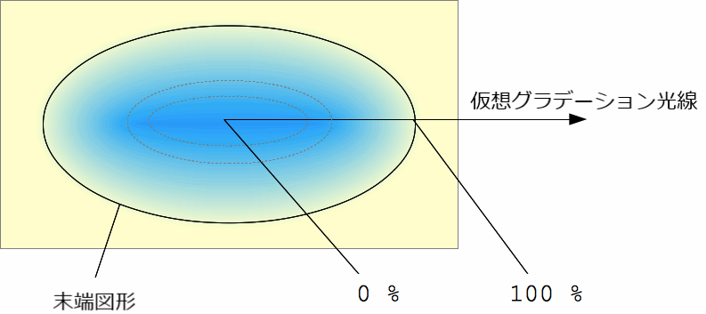

{{CSSRef}}

**`radial-gradient()`** は [CSS](/ja/docs/Web/CSS) の[関数](/ja/docs/Web/CSS/CSS_Functions)で、二つ以上の色の連続的な推移が原点から放射状に広がる画像を生成します。形状は円形または楕円形にになります。関数の結果は {{cssxref("&lt;gradient&gt;")}} データ型のオブジェクトであり、これは {{cssxref("&lt;image&gt;")}} の特殊形です。

{{EmbedInteractiveExample("pages/css/function-radial-gradient.html")}}

## 構文

```css
/* コンテナーの中央にあるグラデーション、
   赤で始まり、青へ変わり、緑で終わる */
radial-gradient(circle at center, red 0, blue, green 100%)
```

放射状のグラデーションは、グラデーションの中心 (0％ の楕円の位置) と、*末端図形* (100％ の楕円) の大きさと形状を示すことで指定します。

## 値

- {{cssxref("&lt;position&gt;")}}
  - : グラデーションの位置で、 {{cssxref("background-position")}} や {{cssxref("transform-origin")}} と同じ方法で解釈されます。指定されなかった場合、既定値は `center` です。
- `<ending-shape>`
  - : グラデーションの末端図形です。値は `circle` (つまり、グラデーションの形状が一定の半径の円) か `ellipse` (つまり、軸に沿った楕円) のいずれかです。指定されなかった場合、既定値は `ellipse` です。
- `<size>`

  - : グラデーションの末端図形の大きさを決定します。省略した場合の既定値は farthest-corner です。これは明示的に指定することも、キーワードで指定することもできます。ここでのキーワード定義では、グラデーションボックスのエッジは有限の線分ではなく、両方向に無限に伸びているものと考えてください。

    グラデーションが円でも楕円でも `<size>` に以下のキーワードを使用することができます。

    | キーワード        | 説明                                                                                                                                          |
    | ----------------- | --------------------------------------------------------------------------------------------------------------------------------------------- |
    | `closest-side`    | グラデーションの末端図形は、ボックスの中心から最も近い辺 (circle の場合) または中心から最も近い縦の辺と横の辺 (ellipse の場合) に内接します。 |
    | `closest-corner`  | グラデーションの末端図形は、ボックスの中心から最も近い頂点に接するように大きさが調整されます。                                                |
    | `farthest-side`   | `closest-side` と同様ですが、末端図形がその中心から最も遠い辺 (または縦と横の辺) に接するように大きさが調整される点が異なります。             |
    | `farthest-corner` | 既定値で、グラデーションの末端図形は、ボックスの中心から最も遠い頂点に接するように大きさが調整されます。                                      |

    `<ending-shape>` を `circle` と指定した場合、大きさを明示的に [`<length>`](/ja/docs/Web/CSS/length) として与えることができ、円形の広がりの大きさを明示的に指定します。負の値は不正です。

    `<ending-shape>` を `ellipse` と指定するか省略した場合、大きさを二つの [`<length-percentage>`](/ja/docs/Web/CSS/length-percentage) で指定して明示的な楕円の大きさを指定することができます。 1 つ目の値は水平の広がり、 2 つ目の値は垂直の広がりです。パーセント値はグラデーションボックスの対応する長さからの相対値です。負の値は不正です。

- `<linear-color-stop>`
  - : 色経由点の {{cssxref("&lt;color&gt;")}} 値と、それに続く 1 つまたは 2 つの省略可能な経由位置 (グラデーション軸沿いの {{cssxref("&lt;percentage&gt;")}} または {{cssxref("&lt;length&gt;")}}) です。 percentage が `0%`、または length が `0` の場合は、グラデーションの中心を表します。 `100%` は末端図形と仮想グラデーション光線の交点を表します。その間のパーセント値はグラデーション光線における直線的な位置です。
- `<color-hint>`
  - : color-hint は、隣り合う色経由点の間でどのようにグラデーションが進むかを定義する補間のヒントです。長さによって、どの位置で二つの色経由点のグラデーション色が色の移行の中間点に達するかを定義します。省略された場合、色の移行の中間点は二つの色経由点の中点になります。

## 解説

<p>他のグラデーションと同様、放射グラデーションは[自身の寸法を持ちません](/ja/docs/Web/CSS/image#description)。つまり、自然な寸法や推奨される寸法、推奨される縦横比もありません。具体的な寸法は、適用先の要素の寸法に一致します。

繰り返してコンテナーを埋める放射グラデーションを生成するには、代わりに {{cssxref("gradient/repeating-radial-gradient()", "repeating-radial-gradient()")}} 関数を使用してください。

`<gradient>` は `<image>` データ型に属するため、 `<image>` が使用できるところでしか使用できません。このため、 `radial-gradient()` は {{cssxref("background-color")}} や、その他の {{cssxref("&lt;color&gt;")}} データ型を使用するプロパティでは動作しません。</p>

### 放射グラデーションの構成

放射グラデーションは*中心点*、*末端図形*、および二つ以上の*色経由点*で定義されます。

滑らかなグラデーションを生成するために、 `radial-gradient()` 関数は中央から*末端図形* (およびその先) に向けて一連の同心円の形状を描きます。図形の端は円または楕円です。

色経由点は、中心から右方向に水平に延びる*仮想グラデーション光線*の上に配置されます。色経由点の位置を決めるパーセント値は、図形の端とこのグラデーション光線の交点を `100%` としたときの相対値です。各形状は単色で、色は交差したグラデーション光線の色によって定義されます。

## 例

<h3 id="Simple_gradient">シンプルなグラデーション</h3>

```html hidden
<div class="radial-gradient"></div>
```

```css hidden
.radial-gradient {
  width: 240px;
  height: 120px;
}
```

```css
.radial-gradient {
  background-image: radial-gradient(cyan 0%, transparent 20%, salmon 40%);
}
```

{{EmbedLiveSample('Simple_gradient', 120, 120)}}

<h3 id="Non-centered_gradient">中央から外れたグラデーション</h3>

```html hidden
<div class="radial-gradient"></div>
```

```css hidden
.radial-gradient {
  width: 240px;
  height: 120px;
}
```

```css
.radial-gradient {
  background-image: radial-gradient(farthest-corner at 40px 40px,
      #f35 0%, #43e 100%);
}
```

{{EmbedLiveSample('Non-centered_gradient', 240, 120)}}

### 他の radial-gradient の例

他の例は [CSS グラデーションの使用](/ja/docs/Web/CSS/CSS_Images/Using_CSS_gradients)を参照してください。

## 仕様書

{{Specifications}}

## ブラウザーの互換性

{{Compat}}

## 関連情報

- [CSS グラデーションの使用](/ja/docs/Web/CSS/CSS_Images/Using_CSS_gradients)
- 他のグラデーション関数: {{cssxref("gradient/repeating-radial-gradient()", "repeating-radial-gradient()")}}, {{cssxref("gradient/linear-gradient()", "linear-gradient()")}}, {{cssxref("gradient/repeating-linear-gradient()", "repeating-linear-gradient()")}}, {{cssxref("gradient/conic-gradient()", "conic-gradient()")}}, {{cssxref("gradient/repeating-conic-gradient()", "repeating-conic-gradient()")}}
- {{cssxref("&lt;image&gt;")}}
- {{cssxref("image/image()","image()")}}
- {{cssxref("element()")}}
- {{cssxref("image/image-set()","image-set()")}}
- {{cssxref("cross-fade()")}}
