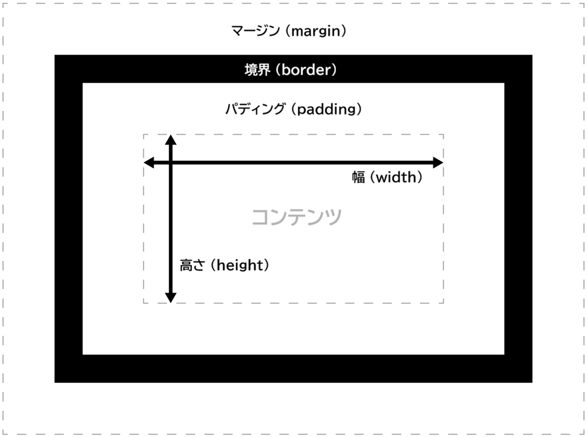

**CSS ボックスモデル** (CSS box model) モジュールはマージン (`margin`) とパディング (`padding`) のプロパティを定義し、それが[高さ](/ja/docs/Web/CSS/Guides/Box_sizing)、[幅](/ja/docs/Web/CSS/Guides/Box_sizing)、[境界のプロパティ](/ja/docs/Web/CSS/Guides/Backgrounds_and_borders)とともに、 CSS の[ボックスモデル](/ja/docs/Web/CSS/Guides/Box_model/Introduction)を構成します。

ウェブページ上のすべての可視要素は、[視覚整形モデル](/ja/docs/Web/CSS/Guides/Display/Visual_formatting_model)に従ってレイアウトされたボックスです。CSSプロパティはそれらのサイズ、位置、重ね合わせレベルを定義し、ボックスモデルプロパティ（およびその他のプロパティ）はそれぞれのボックスの外部サイズと周囲の空間を定義します。

それぞれのボックスには矩形のコンテンツ領域があり、その内部にテキスト、画像、その他のコンテンツが表示されます。コンテンツは、1 つ以上の辺でパディング、境界、マージンに囲まれることがあります。パディングはコンテンツの周囲に、境界線はパディングの周囲に、マージンは境界線の外側に配置されます。ボックスモデルは、これらの機能（コンテンツ、パディング、境界線、マージン）がどのように連携して CSS によって表示されるボックスを生成するのかを記述するものです。

CSS ボックスモデルモジュールは、`margin-top` や `padding-top` などの物理的（または「ページ相対」）プロパティを定義します。`margin-block-start` や `margin-inline-start`などの（テキストの方向に関連した）フロー相対プロパティは、[論理的プロパティと値](/ja/docs/Web/CSS/Guides/Logical_properties_and_values)で定義されています。ボックスモデルモジュールは、[CSS サイズ指定モジュール](/ja/docs/Web/CSS/Guides/Box_sizing)によって拡張されています。このモジュールは{{glossary("intrinsic size", "内在サイズ")}}値を導入し、少なくとも一辺が自動サイズ指定される要素に対して{{glossary("aspect ratio", "アスペクト比")}}を定義することができるようになります。

## リファレンス

### プロパティ

- {{cssxref("margin")}} 一括指定
- {{cssxref("margin-bottom")}}
- {{cssxref("margin-left")}}
- {{cssxref("margin-right")}}
- {{cssxref("margin-top")}}
- {{cssxref("margin-trim")}}
- {{cssxref("padding")}} 一括指定
- {{cssxref("padding-bottom")}}
- {{cssxref("padding-left")}}
- {{cssxref("padding-right")}}
- {{cssxref("padding-top")}}

### データ型

- {{cssxref("box-edge")}}
  - [`<visual-box>`](/ja/docs/Web/CSS/Reference/Values/box-edge#visual-box)
  - [`<layout-box>`](/ja/docs/Web/CSS/Reference/Values/box-edge#layout-box)
  - [`<paint-box>`](/ja/docs/Web/CSS/Reference/Values/box-edge#paint-box)
  - [`<coord-box>`](/ja/docs/Web/CSS/Reference/Values/box-edge#coord-box)
  - [`<geometry-box>`](/ja/docs/Web/CSS/Reference/Values/box-edge#geometry-box)

## ガイド

- [CSS ボックスモデルの紹介](/ja/docs/Web/CSS/Guides/Box_model/Introduction)
  - : CSS の基礎的概念の 1 つである、ボックスモデルを解説します。このモデルは CSS が要素とそのコンテンツ領域、パディング領域、境界領域、マージン領域をどのように配置するかを定義しています。

- [マージンの相殺の理解](/ja/docs/Web/CSS/Guides/Box_model/Margin_collapsing)
  - : 2 つの隣接するマージンが 1 つに相殺されることがあります。この記事ではいつなぜそれが発生し、どのように制御するかを説明します。

- [視覚整形モデル](/ja/docs/Web/CSS/Guides/Display/Visual_formatting_model)
  - : 視覚整形モデルを説明します。

## 関連概念

- [CSS 背景と境界](/ja/docs/Web/CSS/Guides/Backgrounds_and_borders)モジュール
  - {{cssxref("border-width")}} 一括指定
  - {{cssxref("border-bottom-width")}}
  - {{cssxref("border-left-width")}}
  - {{cssxref("border-right-width")}}
  - {{cssxref("border-top-width")}}
- [CSS 論理的プロパティ](/ja/docs/Web/CSS/Guides/Logical_properties_and_values)モジュール
  - {{CSSxRef("block-size")}}
  - {{CSSxRef("inline-size")}}
  - {{CSSxRef("max-block-size")}}
  - {{CSSxRef("max-inline-size")}}
  - {{CSSxRef("min-block-size")}}
  - {{CSSxRef("min-inline-size")}}
  - {{CSSxRef("margin-block")}}
  - {{CSSxRef("margin-block-end")}}
  - {{CSSxRef("margin-block-start")}}
  - {{CSSxRef("margin-inline")}}
  - {{CSSxRef("margin-inline-end")}}
  - {{CSSxRef("margin-inline-start")}}
  - {{CSSxRef("padding-block")}}
  - {{CSSxRef("padding-block-end")}}
  - {{CSSxRef("padding-block-start")}}
  - {{CSSxRef("padding-inline")}}
  - {{CSSxRef("padding-inline-end")}}
  - {{CSSxRef("padding-inline-start")}}
  - {{CSSxRef("border-block")}}
  - {{CSSxRef("border-block-end")}}
  - {{CSSxRef("border-block-end-width")}}
  - {{CSSxRef("border-block-start")}}
  - {{CSSxRef("border-block-start-width")}}
  - {{CSSxRef("border-block-style")}}
  - {{CSSxRef("border-block-width")}}
  - {{CSSxRef("border-inline")}}
  - {{CSSxRef("border-inline-end")}}
  - {{CSSxRef("border-inline-end-width")}}
  - {{CSSxRef("border-inline-start")}}
  - {{CSSxRef("border-inline-start-width")}}
  - {{CSSxRef("border-inline-width")}}
- [CSS ボックスサイズ指定](/ja/docs/Web/CSS/Guides/Box_sizing)モジュール
  - {{cssxref("aspect-ratio")}}
  - {{cssxref("box-sizing")}}
  - {{cssxref("contain-intrinsic-block-size")}}
  - {{cssxref("contain-intrinsic-height")}}
  - {{cssxref("contain-intrinsic-inline-size")}}
  - {{cssxref("contain-intrinsic-size")}}
  - {{cssxref("contain-intrinsic-width")}}
  - {{cssxref("height")}}
  - {{cssxref("max-height")}}
  - {{cssxref("max-width")}}
  - {{cssxref("min-height")}}
  - {{cssxref("min-width")}}
  - {{cssxref("width")}}
- [CSS オーバーフロー](/ja/docs/Web/CSS/Guides/Overflow)モジュール
  - {{CSSxRef("overflow")}} 一括指定
  - {{CSSxRef("overflow-block")}}
  - {{CSSxRef("overflow-clip-margin")}}
  - {{CSSxRef("overflow-inline")}}
  - {{CSSxRef("overflow-x")}}
  - {{CSSxRef("overflow-y")}}
  - {{CSSxRef("text-overflow")}}

## 仕様書

{{Specifications}}

## 関連情報

- [CSS 表示方法](/ja/docs/Web/CSS/Guides/Display)モジュール
- [CSS フレックスボックスレイアウト](/ja/docs/Web/CSS/Guides/Flexible_box_layout)モジュール
- [CSS グリッドレイアウト](/ja/docs/Web/CSS/Guides/Grid_layout)モジュール
- [CSS 表](/ja/docs/Web/CSS/Guides/Table)モジュール
- [CSS 位置指定レイアウト](/ja/docs/Web/CSS/Guides/Positioned_layout)モジュール
- [CSS 断片化](/ja/docs/Web/CSS/Guides/Fragmentation)モジュール
- [アスペクト比の理解](/ja/docs/Web/CSS/Guides/Box_sizing/Aspect_ratios)
