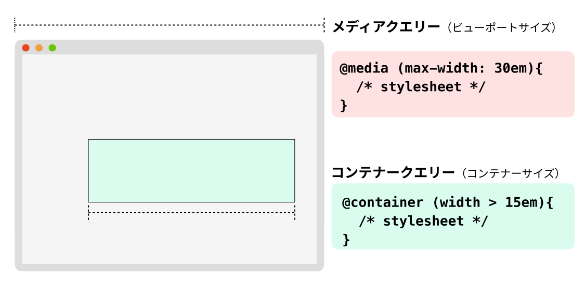

コンテナークエリーを使用すると、特定の要素について、そのコンテナーの次のような属性に基づいてスタイルを設定することができます。

- コンテナー名 ({{cssxref("container-name")}})
- コンテナーのサイズ
- コンテナーに適用されているスタイル
- コンテナーのスクロール状態、またはそのスクロール祖先のスクロール状態
- そのコンテナーが [アンカー位置指定](/ja/docs/Web/CSS/Guides/Anchor_positioning)されており、[position-try の代替オプション](/ja/docs/Web/CSS/Guides/Anchor_positioning/Try_options_hiding)が適用されているかどうか

コンテナークエリーは、[メディアクエリー](/ja/docs/Web/CSS/Guides/Media_queries)の代替となるもので、ビューポートサイズや他の端末の特性に基づいて要素にスタイルを適用します。

この記事では、コンテナークエリーを用いて、特にサイズコンテナークエリーに焦点を当てた使い方の紹介をしています。他にも、[スタイル](/ja/docs/Web/CSS/Guides/Containment/Container_size_and_style_queries#コンテナースタイルクエリー)、[スクロール状態](/ja/docs/Web/CSS/Guides/Conditional_rules/Container_scroll-state_queries)、[アンカー](/ja/docs/Web/CSS/Guides/Anchor_positioning/Anchored_container_queries)のコンテナークエリーについて詳しく解説しているガイドもあります。



## コンテナークエリーの使用

コンテナークエリーはコンテナーの名前または種類に基づいてスタイルを適用するのに対し、コンテナーサイズクエリーはコンテナーの寸法に基づいてスタイルを適用します。コンテナーサイズクエリーを使用するには、要素に[コンテナーコンテキスト](#コンテナーコンテキストの命名)を宣言する必要があります。これにより、ブラウザーは後でこのコンテナーの寸法をクエリする可能性があることを認識します。
これを行うには、 {{cssxref("container-type")}} プロパティに `size`、`inline-size`、`normal` の値を指定して使用します。

これらの値は以下のような効果があります。

- `size`
  - : クエリーは、コンテナーの[インラインおよびブロック](/ja/docs/Web/CSS/Guides/Logical_properties_and_values/Basic_concepts#ブロック軸とインライン軸)軸の寸法に基づきます。
    レイアウト、スタイル設定、サイズ[抑制](/ja/docs/Web/CSS/Guides/Containment/Using)をコンテナーに適用します。
- `inline-size`
  - : クエリーは、コンテナーの[インライン](/ja/docs/Web/CSS/Guides/Logical_properties_and_values/Basic_concepts#ブロック軸とインライン軸)軸の寸法に基づきます。
    その要素にレイアウト、スタイル設定、インラインサイズ抑制を適用します。
- `normal`
  - : デフォルト値。この要素は、コンテナーサイズクエリーのクエリコンテナーとはなりませんが、[名前のみのコンテナークエリー](#名前のみのコンテナークエリー)やコンテナースタイルクエリーについては、クエリーコンテナーとして使用することができます。

次の例では、タイトルとテキストを持つブログ記事用のカード部品を考えてみましょう。

```html
<div class="post">
  <div class="card">
    <h2>カードのタイトル</h2>
    <p>カードのコンテンツ</p>
  </div>
</div>
```

コンテナーコンテキストは `container-type` プロパティを使用して作成することができます。

```css
.post {
  container-type: inline-size;
}
```

次に、 {{cssxref("@container")}} アットルールを使用してコンテナークエリーを定義します。
次の例のクエリーは、コンテナーコンテキストを持つ最も近い祖先のサイズに基づいて要素にスタイルを適用します。
具体的には、このクエリーは、コンテナーの幅が `700px` よりも広い場合、カードのタイトルに大きなフォントサイズを適用します。

```css
/* カードタイトルの既定のスタイルを設定 */
.card h2 {
  font-size: 1em;
}

/* コンテナーが 700px より広い場合 */
@container (width > 700px) {
  .card h2 {
    font-size: 2em;
  }
}
```

コンテナークエリーを使用することで、毎回カードが配置される場所を詳細に知ることなく、ページの複数の領域でカードを再利用することができます。
カードがあるコンテナーが `700px` より狭い場合、カードタイトルのフォントは小さくなり、カードが `700px` より広いコンテナーにある場合、カードタイトルのフォントは大きくなります。

コンテナークエリーの構文の詳細については、 {{cssxref("@container")}} のページを参照してください。

## コンテナーコンテキストの命名

前の節では、コンテナークエリーは、コンテナーコンテキストを持つ最も近い祖先に基づいてスタイル設定を適用しました。
{{Cssxref("container-name")}} プロパティを使用して、コンテナーコンテキストに名前を付けることが可能です。一度名前をつけると、その名前を `@container` クエリーで使用することができ、特定のコンテナーを対象とすることができます。
次の例では、 `sidebar` という名前のコンテナーコンテキストを作成しています：

```css
.post {
  container-type: inline-size;
  container-name: sidebar;
}
```

そして、 `@container` アットルールを用いて、このコンテナーコンテキストを対象とすることができます。

```css
@container sidebar (width > 700px) {
  .card {
    font-size: 2em;
  }
}
```

コンテナーコンテキストの命名に関する詳細情報は、 {{cssxref("container-name")}} ページにあります。

## 名前のみのコンテナークエリー

{{cssxref("container-name")}} を [`<container-query>`](/ja/docs/Web/CSS/Reference/At-rules/@container#container-query) と組み合わせて使用するほか、コンテナの名前だけでクエリーを行うこともできます。このいわゆる**名前のみのコンテナークエリー**を使用すると、特定の `container-name` が設定された祖先要素を持つかどうかに基づいて、要素にスタイルを選択的に適用することができます。

例えば、次の HTML を考えてください。

```html
<div id="container">
  <p>これはコンテナー内にあります。</p>
  <p>これもコンテナー内にあります。</p>
</div>
<p>これはコンテナー内にありません。</p>
```

コンテナーに名前を割り当てると、

```css
#container {
  container-name: my-container;
}
```

これにより、そのコンテナーの中に含まれる要素にのみ、スタイルを選択的に適用することができます。

```css
@container my-container {
  p {
    background-color: lime;
    font-size: 1.3rem;
    width: 50vw;
    padding: 0.5rem;
    font-family: sans-serif;
  }
}
```

この例では、指定されたスタイルは、1 つ目と 2 つ目の {{htmlelement("p")}} 要素にのみ適用され、3 つ目には適用されません。

### コンテナーの一括指定構文

コンテナーを宣言するための一括指定は `container` プロパティを使用します。

```css
.post {
  container: sidebar / inline-size;
}
```

このプロパティの詳細情報については、 {{Cssxref("container")}} のリファレンスを参照してください。

## コンテナークエリーの長さ単位

サイズコンテナークエリーを使用して、コンテナーの子要素にスタイルを適用する場合（つまり、その {{cssxref("container-type")}} が `size` または `inline-size` に設定されている場合）、コンテナークエリーの長さ単位を使用することができます。
この単位は、クエリーするコンテナーの寸法に相対する長さを指定します。
コンテナーに対する相対的な長さの単位を使用する成分は、具体的な長さの値を再計算する必要がなく、様々なコンテナーでより柔軟に使用することができます。

クエリに該当するコンテナーが利用できない場合、コンテナーのクエリー長の単位は、デフォルトでその軸の[小さなビューポート単位](/ja/docs/Web/CSS/Reference/Values/length#小ビューポート単位) (`sv*`) に設定されます。

コンテナークエリーの長さの単位は以下の通りです。

- `cqw`: クエリーコンテナーの幅の 1%
- `cqh`: クエリーコンテナーの高さの 1%
- `cqi`: クエリーコンテナーのインラインサイズの 1%
- `cqb`: クエリーコンテナーのブロックサイズの 1%
- `cqmin`: `cqi` または `cqb` の小さい方
- `cqmax`: `cqi` または `cqb` の大きい方

次の例では、 `cqi` 単位を用いて、コンテナーのインラインサイズに基づいて見出しのフォントサイズを設定しています。

```css
@container (width > 700px) {
  .card h2 {
    font-size: max(1.5em, 1.23em + 2cqi);
  }
}
```

これらの単位の詳細については、[コンテナークエリーの長さの単位](/ja/docs/Web/CSS/Reference/Values/length#コンテナークエリーの長さの単位)を参照してください。

## コンテナークエリーの代替

コンテナークエリーにまだ対応していないブラウザーでは、 {{cssxref("grid")}} と {{cssxref("flex")}} を使用することで、このページで用いたカードコンポーネントに同様の効果を作成することができます。
次の例では、 {{cssxref("grid-template-columns")}} 宣言を使用して、カード部品の 2 列のレイアウトを作成しています。

```css
.card {
  display: grid;
  grid-template-columns: 2fr 1fr;
}
```

ビューポートが小さい端末用に一列のレイアウトを使用したい場合は、メディアクエリーを使用してグリッドテンプレートを変更することができます。

```css
@media (width <= 700px) {
  .card {
    grid-template-columns: 1fr;
  }
}
```

## 関連情報

- [メディアクエリー](/ja/docs/Web/CSS/Guides/Media_queries)
- CSS {{Cssxref("@container")}} アットルール
- CSS {{Cssxref("contain")}} プロパティ
- CSS {{Cssxref("container")}} 一括指定プロパティ
- CSS {{Cssxref("container-name")}} プロパティ
- CSS {{cssxref("content-visibility")}} プロパティ
- [コンテナーのサイズおよびスタイルクエリーの使用](/ja/docs/Web/CSS/Guides/Containment/Container_size_and_style_queries)
- [コンテナースクロール状態クエリーの使用](/ja/docs/Web/CSS/Guides/Conditional_rules/Container_scroll-state_queries)
- [アンカー付きコンテナークエリーの使用](/ja/docs/Web/CSS/Guides/Anchor_positioning/Anchored_container_queries)
- [Say Hello to CSS Container Queries](https://ishadeed.com/article/say-hello-to-css-container-queries/) - Ahmad Shadeed
- [Container Queries: a Quick Start Guide](https://www.oddbird.net/2021/04/05/containerqueries/)
- [Collection of Container Queries articles](https://github.com/sturobson/Awesome-Container-Queries)
