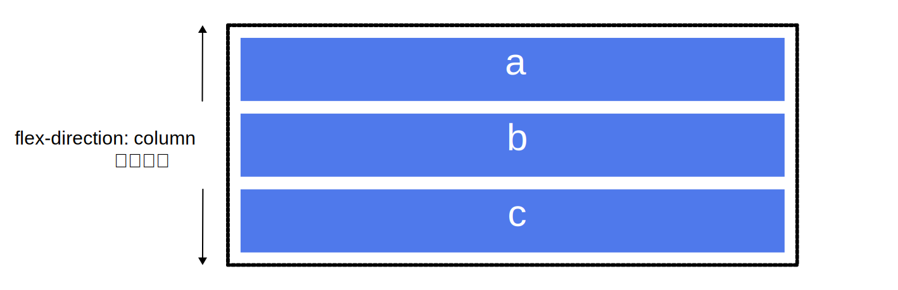
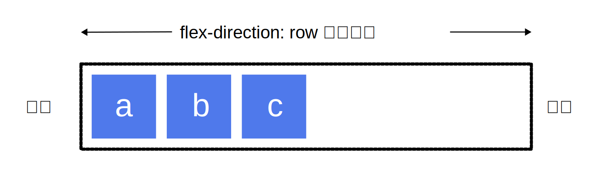
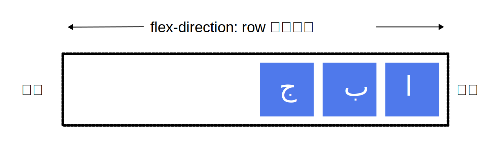

[フレックスボックスレイアウト](/ja/docs/Web/CSS/Guides/Flexible_box_layout)（通常フレックスボックスと呼ばれる）は、アイテム間の余白を分配するための一次元レイアウトモデルで、数多くの配置機能を含んでいます。この記事ではフレックスボックスの主な機能の概要を説明し、このガイドの残りの部分でさらに詳しく説明します。

フレックスボックスが一次元であることは、フレックスボックスが一つの次元、つまり行か列のいずれかの方向にしかレイアウトしないことを述べています。これは [CSS グリッドレイアウト](/ja/docs/Web/CSS/Guides/Grid_layout)が行と列の二次元を同時に制御するモデルであることと対照的です。

## フレックスボックス 2 つの軸

フレックスボックスを使うときは 2 つの軸、つまり主軸 (main axis) と交差軸 (cross axis) の観点から考える必要があります。[主軸](#主軸)は {{cssxref("flex-direction")}} プロパティによって定義され、[交差軸](#交差軸)は主軸に垂直に交わる軸です。フレックスボックスを使った操作では常にこの軸について参照することになるので、最初にその動きを理解しましょう。

### 主軸

{{glossary("main axis","主軸")}}は `flex-direction` によって定義され、4 種類の値をとることができます。

- `row`
- `row-reverse`
- `column`
- `column-reverse`

`row` または `row-reverse` を選択した場合、主軸は**インライン方向**に沿った軸となります。


`column` または `column-reverse` を選んだ場合は、ページの上から下に向かって**ブロック方向**に沿った軸となります。



### 交差軸

{{glossary("cross axis","交差軸")}}は主軸に垂直に交わる軸です。したがって、`flex-direction` (主軸) が `row` または `row-reverse` なら、交差軸は列に沿ったものになります。


主軸が `column` または `column-reverse` であれば、交差軸は行の方向になります。


## 行の先頭と末尾

もう一つの重要な理解点は、フレックスボックスが文書の書字方向について一切の仮定をしないことです。フレックスボックスは、テキストのすべての行が文書の左上から始まり、右側に向かって実行し、新しい行が他の行の下に 1 行ずつ現れることを想定しているわけではありません。むしろ、他の[論理プロパティや値](/ja/docs/Web/CSS/Guides/Logical_properties_and_values)のように、すべての書字方向に対応しています。

後述する[フレックスボックスと書字方向の関係を読む](/ja/docs/Web/CSS/Guides/Flexible_box_layout/Relationship_with_other_layout_methods#書字方向)こともできますが、フレックスアイテムが流れる方向を説明するときに、左右や上下の話をしない理由は、以下の説明で理解できると思います。

もし `flex-direction` が `row` で言語が英語の場合、主軸の先頭は左で末尾は右になります。



一方で言語がもしアラビア語であった場合、主軸の先頭は右で末尾が左になります。



両言語ともに書字方向が横書きであるため、いずれの場合でも、交差軸の先頭側は上で末尾側が下になります。

こうしてみると、左と右ではなく先頭と末尾で考えることが自然なものに思えます。この考え方は CSS グリッドレイアウトのような、同じパターンに従っているレイアウト方法を扱う際にも役立つでしょう。

## フレックスコンテナー

フレックスボックスを使用してレイアウトされた文書の領域を**フレックスコンテナー**と呼びます。{{glossary("flex container","フレックスコンテナー")}}を作成するには、その領域の {{cssxref("display")}} プロパティを `flex` に設定します。そうすると、そのコンテナーの直接の子は**フレックスアイテム**になります。コンテナーそのものをインラインで表示するかブロック整形コンテキストで表示するかは、インラインフレックスコンテナーでは `inline flex` または `inline-flex` を、ブロックレベルフレックスコンテナーでは `block flex` または `flex` を使用して明示的に制御できます。

### 初期値

CSS のすべてのプロパティと同様に、いくつかの初期値が定義されており、新しいフレックスコンテナーのコンテンツは次のように動作します。

- フレックスアイテムは行に沿って並んで表示されます（{{cssxref("flex-direction")}} プロパティの既定値は `row` です）。
- フレックスアイテムは主軸の先頭側を先頭に並びます。
- フレックスアイテムは主軸方向に引き伸ばされませんが、収縮する場合があります（フレックスアイテムの {{cssxref("flex-grow")}} プロパティの既定値は `0`、 {{cssxref("flex-shrink")}} プロパティの既定値は `1` です）。
- フレックスアイテムは、交差軸の大きさを埋めるように引き伸ばされます（{{cssxref("align-items")}} プロパティの既定値は `stretch` です）。
- フレックスアイテムの {{cssxref("flex-basis")}} プロパティの既定値は `auto` です。つまり、横書きの場合はフレックスアイテムの {{cssxref("width")}} と等しくなり、縦書きの場合はフレックスアイテムの {{cssxref("height")}} と等しくなります。対応する `width`/`height` も `auto` に設定されている場合は、代わりに `flex-basis` の `content` の値が使用されます。
- すべてのアイテムは 1 列に並び（{{cssxref("flex-wrap")}} プロパティの既定値は `nowrap` です）、それらの `width`/`height` の合計がコンテナー要素の `width`/`height` を超えると、コンテナーからはみ出します。

その結果、アイテムはすべて一行に並び、コンテンツの寸法が主軸方向の寸法になります。アイテムがコンテナーに収まらない場合は、折り返されずにあふれます。一部のアイテムの高さが他のアイテムより高い場合、すべてのアイテムは交差軸全体の大きさまで引き伸ばされます。

この見え方についての、例を以下に挙げます。 "Play" をクリックすると、この例を MDN Playground で開き、アイテムを編集したり、新しいアイテムを追加して初期のフレックスボックスの動作を試したりすることができます。

```html live-sample___the-flex-container
<div class="box">
  <div>One</div>
  <div>Two</div>
  <div>Three <br />には追加の<br />テキストが<br />あります</div>
</div>
```

```css live-sample___the-flex-container
.box > * {
  border: 2px solid rgb(96 139 168);
  border-radius: 5px;
  background-color: rgb(96 139 168 / 0.2);
}

.box {
  border: 2px dotted rgb(96 139 168);
  display: flex;
}
```

{{EmbedLiveSample("the-flex-container")}}

### flex-direction の変更

フレックスコンテナーに {{cssxref("flex-direction")}} プロパティを設定すると、フレックスアイテムが表示される方向を変更することができます。 `flex-direction: row-reverse` と設定することで、アイテムは行に沿って並ぶ点は変わりませんが、先頭と末尾が入れ替わります。

`flex-direction` を `column` に変更すると、主軸の方向が変わり、フレックスアイテムは列に沿って並んで表示されるようになります。 `column-reverse` では、さらに先頭と末尾が入れ替わります。

ライブサンプルでは、`flex-direction` が `row-reverse` に設定されています。他の値である `row`, `column`, `column-reverse` で何が起こるか確かめてみてください。

```html live-sample___flex-direction
<div class="box">
  <div>One</div>
  <div>Two</div>
  <div>Three</div>
</div>
```

```css live-sample___flex-direction
.box > * {
  border: 2px solid rgb(96 139 168);
  border-radius: 5px;
  background-color: rgb(96 139 168 / 0.2);
}

.box {
  border: 2px dotted rgb(96 139 168);
  display: flex;
  flex-direction: row-reverse;
}
```

{{EmbedLiveSample("flex-direction")}}

## flex-wrap による複数行のフレックスコンテナー

フレックスボックスは 1 次元のモデルですが、フレックスアイテムを複数の行にわたって折り返すことは可能です。その場合、各行を新しいフレックスコンテナーと考えてください。前後の行を参照することなく、各行に余白が分配されます。

折り返し動作を発生させるためには、 {{cssxref("flex-wrap")}} プロパティに `wrap` を追加します。これで、アイテムが大きすぎてすべて 1 行に表示できない場合、別の行に折り返されます。次のライブサンプルは、 `width` が指定されたアイテムを含んでいます。アイテムの合計幅はフレックスコンテナーには広すぎます。 `flex-wrap` を `wrap` に設定すると、アイテムは複数行にまたがって折り返されます。これを初期値である `nowrap` に設定すると、コンテナーに合うように収縮します。アイテムが収縮するのは、 `flex-shrink: 1` を含むフレックスボックスの初期値を使用しているからです。 `nowrap` を使用すると、アイテムが縮小できなかったり、収まるほど小さく縮小できなかった場合に[オーバーフロー](/ja/docs/Learn_web_development/Core/Styling_basics/Overflow)が発生します。

```html live-sample___flex-wrap
<div class="box">
  <div>One</div>
  <div>Two</div>
  <div>Three</div>
</div>
```

```css live-sample___flex-wrap
.box > * {
  border: 2px solid rgb(96 139 168);
  border-radius: 5px;
  background-color: rgb(96 139 168 / 0.2);
  width: 200px;
}

.box {
  width: 500px;
  border: 2px dotted rgb(96 139 168);
  display: flex;
  flex-wrap: wrap;
}
```

{{EmbedLiveSample("flex-wrap")}}

フレックスアイテムの折り返しについての詳細は、[フレックスアイテムの折り返しをマスターする](/ja/docs/Web/CSS/Guides/Flexible_box_layout/Wrapping_items)を参照してください。

## flex-flow 一括指定プロパティ

`flex-direction` と `flex-wrap` の 2 つのプロパティは、{{cssxref("flex-flow")}} 一括指定プロパティにより 2 つ同時に指定することができます。

次の例で、1 つ目の値を `flex-direction` に使える値 (`row`, `row-reverse`, `column`, `column-reverse` のいずれか) に変更してみてください。また、2 つ目の値を `wrap` か `nowrap` に変更してみてください。

```html live-sample___flex-flow
<div class="box">
  <div>One</div>
  <div>Two</div>
  <div>Three</div>
</div>
```

```css live-sample___flex-flow
.box > * {
  border: 2px solid rgb(96 139 168);
  border-radius: 5px;
  background-color: rgb(96 139 168 / 0.2);
  width: 200px;
}

.box {
  width: 500px;
  border: 2px dotted rgb(96 139 168);
  display: flex;
  flex-flow: row wrap;
}
```

{{EmbedLiveSample("flex-flow")}}

## フレックスアイテムに適用されるプロパティ

それぞれのフレックスアイテムのインラインサイズを制御するために、 3 つのプロパティで直接対象にします。

- {{cssxref("flex-grow")}}
- {{cssxref("flex-shrink")}}
- {{cssxref("flex-basis")}}

以下でこれらのプロパティを簡単に見ていきますが、より包括的な情報が必要な場合は、[主軸方向のフレックスアイテムの比率の制御](/ja/docs/Web/CSS/Guides/Flexible_box_layout/Controlling_flex_item_ratios)を参照してください。

上述のプロパティについて理解する前に、**分配可能な余白** (available space) の概念について考える必要があります。上述のプロパティを変更するということは、アイテム間での分配可能な余白の分配のしかたを変えるということです。この分配可能な余白についての考え方は、アイテムの配置について考える時に重要になります。

たとえば、 500 ピクセル幅のコンテナーの中に 100 ピクセル幅のアイテムが 3 つあるとき、アイテムの配置に必要な幅は 300 ピクセルです。このとき 200 ピクセルの分配可能な余白が残っています。初期値を変更しなかった場合フレックスボックスは、余白を最後のアイテムの後ろに配置します。


そうではなく、アイテムを拡大して余白を埋めたいときには、余っている余白をアイテムに分配する方法が必要となります。アイテム自体に適用されるフレックスプロパティは、利用可能な余白をどのように兄弟フレックスアイテムに分配するかを決定します。

### flex-basis プロパティ

`flex-basis` は、そのアイテムの寸法を、使用しない余白は分配可能な余白として残すように定義します。このプロパティの初期値は `auto` で、この設定ではブラウザーはアイテムに寸法が設定されているかを確認します。上述の例では、すべてのアイテムが 100 ピクセルの幅に設定されています。これが `flex-basis` として使われます。

アイテムに寸法が設定されていない場合は、その内容の大きさが `flex-basis` として使われます。`display: flex` を親要素に設定するだけで、すべてのフレックスアイテムがそのアイテムの内容を表示するのに必要な余白のみを使用して行の中に整列していたのは、この挙動のためです。

### flex-grow プロパティ

`flex-grow` プロパティを正の整数に設定すると、分配可能な余白がある場合、フレックスアイテムは `flex-basis` から主軸に沿って伸びることができます。アイテムがその軸の分配可能な余白をすべて占めるように伸びるか、分配可能な余白の一部だけを占めるように伸びるかは、他のアイテムも伸びることが許可されているかどうか、そしてそれらの `flex-grow` プロパティの値によって決まります。

正の値を持つ各アイテムは、 `flex-grow` 値に基づいて分配可能な余白の一部を消費します。先ほどの例で、すべてのアイテムの `flex-grow` に 1 を設定すると、分配可能な余白はアイテム間で均等に分配され、主軸方向にコンテナーを埋めるように引き伸ばされます。最初のアイテムの `flex-grow` に 2 を設定し、ほかのアイテムには 1 を設定した場合、合計が 4 つの部分になります。最初のアイテムに 2 つ分（先ほどの例では 200px 中の 100px）が与えられ、残りの 2 つのアイテムに 1 つ分（200px 中の 50px）ずつが与えられます。

### flex-shrink プロパティ

`flex-grow` プロパティが主軸上の余白の追加を扱う一方で、`flex-shrink` は余白の取りあげ方を制御します。 アイテムを配置するのに十分な余白がコンテナーになく、`flex-shrink` に正の整数が設定されていれば、アイテムは `flex-basis` よりも小さくなります。`flex-grow` と同様に、あるアイテムの収縮するスピードを他のアイテムより早くするために、異なる値を設定することができます。 つまり `flex-shrink` により大きな値が設定されているアイテムは、他のより小さな値が設定されている兄弟要素よりも早く収縮します。

アイテムは {{cssxref("min-content")}} のサイズまで縮小することができます。この最小サイズは、実際に起こる収縮量を計算する際に考慮されるため、 `flex-shrink` は `flex-grow` よりも挙動が安定しないように見えてしまう可能性があります。そのため、そのアルゴリズムがどのように動くかについての詳細は、[主軸方向のフレックスアイテムの比率の制御](/ja/docs/Web/CSS/Guides/Flexible_box_layout/Controlling_flex_item_ratios)の記事に書かれています。

> [!NOTE]
> `flex-grow` や `flex-shrink` に指定する値は比率です。一般的には、たとえばあるアイテムを他の `flex: 1 1 200px` に設定したアイテムより 2 倍の比率で拡大させたいときには、 `flex: 2 1 200px` を設定します。しかし、望むならば `flex: 10 1 200px` と `flex: 20 1 200px` という書き方もできます。

### flex プロパティの一括指定の値

`flex-grow`、`flex-shrink`、`flex-basis` の各プロパティを個別に使うケースは稀であり、そのかわりに {{cssxref("flex")}} 一括指定プロパティでまとめて指定されることが多いでしょう。`flex` 一括指定プロパティは、`flex-grow`、`flex-shrink`、`flex-basis` の順に 3 つの値を設定することができます。

以下のライブサンプルでは、`flex` 一括指定プロパティの様々な値を試せるようになっています。 最初の値が `flex-grow` であり、正の値を指定することでアイテムが引き伸ばされるようになります。2 番目の値は `flex-shrink` です。正の値によりアイテムが収縮できるようになりますが、これはアイテムの寸法の合計が主軸をあふれる場合にのみ起こります。最後の値が `flex-basis` となり、アイテムが伸縮する際の基準値となります。

```html live-sample___flex-properties
<div class="box">
  <div class="one">One</div>
  <div class="two">Two</div>
  <div class="three">Three</div>
</div>
```

```css live-sample___flex-properties
.box > * {
  border: 2px solid rgb(96 139 168);
  border-radius: 5px;
  background-color: rgb(96 139 168 / 0.2);
}

.box {
  border: 2px dotted rgb(96 139 168);
  display: flex;
}

.one {
  flex: 1 1 auto;
}

.two {
  flex: 1 1 auto;
}

.three {
  flex: 1 1 auto;
}
```

{{EmbedLiveSample("flex-properties")}}

また、ほとんどの用途をカバーできるいくつかの定義済みの一括指定値があります。 チュートリアル中で使用されているのを度々見かけるでしょうし、ほとんどの場合でこれらの値で十分でしょう。 定義済みの値は以下のとおりです。

- `flex: initial`
- `flex: auto`
- `flex: none`
- `flex: <正の数>`

`initial` のは [CSS 全般の値](/ja/docs/Web/CSS/Reference/Values/Data_types#css_全般の値)で、プロパティの初期値を表します。 `flex: initial` を設定すると、 3 つの個別指定プロパティの[初期値](#初期値)にリセットされ、`flex: 0 1 auto` と同じになります。この場合 `flex-grow` は `0` となるため、アイテムが `flex-basis` よりも大きくなることはありません。`flex-shrink` は `1` なので、必要な場合にははみ出さずに収縮します。 `flex-basis` の値は `auto` です。アイテムに設定されている主軸方向の寸法か、またはアイテムの内容の寸法がフレックスアイテムの寸法として使用されます。

`flex: auto` を使用すると、 `flex: 1 1 auto` を使用することと同等になります。これは `flex: initial` と似ていますが、アイテムがコンテナーを埋めるように引き伸ばされる点を除きます。

`flex: none` を使用すると、全く伸縮性のないフレックスアイテムを作成します。これは `flex: 0 0 auto` と同じです。アイテムは伸び縮みせずに、`flex-basis` が `auto` のフレックスボックスとして配置されます。

チュートリアル内では、`flex: 1` や `flex: 2` のような設定をよく目にするでしょう。これはそれぞれ `flex: 1 1 0` または `flex: 2 1 0` と書くのと同様です。アイテムは `flex-basis: 0` によって最小サイズになり、その後利用可能な余白を埋めるように比例して拡大します。この場合、アイテムは最小サイズから始まるため、`flex-shrink` の値 `1` は冗長です。アイテムにはフレックスコンテナーから溢れ出る可能性のあるサイズが与えられていないからです。

これらの一括指定値について、以下の例で試してみてください。

```html live-sample___flex-shorthands
<div class="box">
  <div class="one">One</div>
  <div class="two">Two</div>
  <div class="three">Three</div>
</div>
```

```css live-sample___flex-shorthands
.box > * {
  border: 2px solid rgb(96 139 168);
  border-radius: 5px;
  background-color: rgb(96 139 168 / 0.2);
}

.box {
  border: 2px dotted rgb(96 139 168);
  display: flex;
}

.one {
  flex: 1;
}

.two {
  flex: 1;
}

.three {
  flex: 1;
}
```

{{EmbedLiveSample("flex-shorthands")}}

## 配置、位置揃え、アイテム間の自由余白の分配

フレックスボックスの主な機能は、主軸と交差軸のアイテムの配置と位置揃え、そしてフレックスアイテム間の余白の分配です。これらのプロパティはアイテムそのものではなく、フレックスコンテナーに設定することに注意してください。

### align-items

{{cssxref("align-items")}} プロパティは、交差軸におけるアイテムの配置を行います。

このプロパティの既定値は `stretch` であり、フレックスアイテムは既定ではフレックスコンテナーの高さ（`flex-direction` が `column` または `column-reverse` に設定されている場合は幅）に引き伸ばされます。この高さはコンテナー内で最も背の高いアイテムか、フレックスコンテナーそのものに設定されているサイズから決まります。

アイテムをフレックスコンテナーの先頭側に揃えるためには `align-items` に `flex-start` または単に `start` を設定し、末尾側に揃えるためには `flex-end` または単に `end` を、中央揃えにするには `center` を設定します。 以下の例で試してみましょう。この例では、コンテナー内でアイテムがどのように移動するかわかりやすくするためフレックスコンテナーに高さを設定しています。`align-items` に以下の値を設定したときにそれぞれ何が起こるか確認してください。

- `stretch`
- `flex-start`
- `flex-end`
- `start`
- `end`
- `center`
- `baseline`
- `last baseline`

```html live-sample___align-items
<div class="box">
  <div>One</div>
  <div>Two</div>
  <div>Three <br />には追加の<br />テキストが<br />あります</div>
</div>
```

```css live-sample___align-items
.box > * {
  border: 2px solid rgb(96 139 168);
  border-radius: 5px;
  background-color: rgb(96 139 168 / 0.2);
}

.box {
  width: 500px;
  height: 130px;
  border: 2px dotted rgb(96 139 168);
  display: flex;
  align-items: flex-start;
}
```

{{EmbedLiveSample("align-items")}}

`align-items` はフレックスコンテナーに設定し、すべてのフレックスアイテムに影響します。あるフレックスアイテムを他と異なる配置にしたい場合は、 {{cssxref("align-self")}} を設定してください。

### justify-content

{{cssxref("justify-content")}} プロパティは、主軸におけるアイテムの配置、つまり `flex-direction` で設定された方向における配置を行います。初期値は `flex-start` で、コンテナーの先頭側からアイテムが並べられます。`flex-end` を設定することで末尾から、`center` を設定することで中央に並べることもできます。

また、`space-between` を使用して、アイテムを配置したあとの残りの余白のすべてをアイテム間で均等に振り分けられ、これによって同じ幅の空白がそれぞれアイテムの間に挿入されます。各アイテムの左右に同じだけの余白を空けるには、`space-around` を使用します。`space-around` では、コンテナーの両端には、アイテムの間隔の半分の大きさの余白が設けられます。両端にも同じだけの余白を設けるには、`space-evenly` を使用します。この場合はコンテナーの両端にフルサイズ (アイテムの間隔と同じ大きさ) の余白が設けられます。

ライブサンプルで、以下の `justify-content` の値を試してみましょう。

- `start`
- `end`
- `left`
- `right`
- `normal`
- `flex-start`
- `flex-end`
- `center`
- `space-around`
- `space-between`
- `space-evenly`
- `stretch`

```html live-sample___justify-content
<div class="box">
  <div>One</div>
  <div>Two</div>
  <div>Three</div>
</div>
```

```css live-sample___justify-content
.box > * {
  border: 2px solid rgb(96 139 168);
  border-radius: 5px;
  background-color: rgb(96 139 168 / 0.2);
}

.box {
  border: 2px dotted rgb(96 139 168);
  display: flex;
  justify-content: flex-start;
}
```

{{EmbedLiveSample("justify-content")}}

[フレックスコンテナー内のアイテムの配置](/ja/docs/Web/CSS/Guides/Flexible_box_layout/Aligning_items)の記事では、これらのプロパティがどのように動作するのか深く理解するために、より詳細に述べています。しかし上述の簡潔な例でもほとんどの用途で役に立つでしょう。

### justify-items

[`justify-items`](/ja/docs/Web/CSS/Reference/Properties/justify-items) プロパティは、フレックスボックスレイアウトでは無視されます。

### place-items と place-content

[`place-items`](/ja/docs/Web/CSS/Reference/Properties/place-items) プロパティは `align-items` と `justify-items` の一括指定プロパティです。フレックスコンテナーに設定すると、配置は設定されますが位置ぞろえは設定されず、 `justify-items` はフレックスボックスでは無視されます。

別な一括指定プロパティとして [`place-content`](/ja/docs/Web/CSS/Reference/Properties/place-content) があり、これは {{cssxref("align-content")}} プロパティと `justify-content` プロパティを定義します。 `align-content` プロパティは折り返しのあるフレックスコンテナーにのみ効果があり、[フレックスコンテナー内のアイテムの配置](/ja/docs/Web/CSS/Guides/Flexible_box_layout/Aligning_items)で解説しています。

## 次のステップ

この記事で、フレックスボックスの基本的な特徴についての理解ができたと思います。次の記事では[フレックスボックスと他のレイアウト方法の関係](/ja/docs/Web/CSS/Guides/Flexible_box_layout/Relationship_with_other_layout_methods)を見ていきます。
