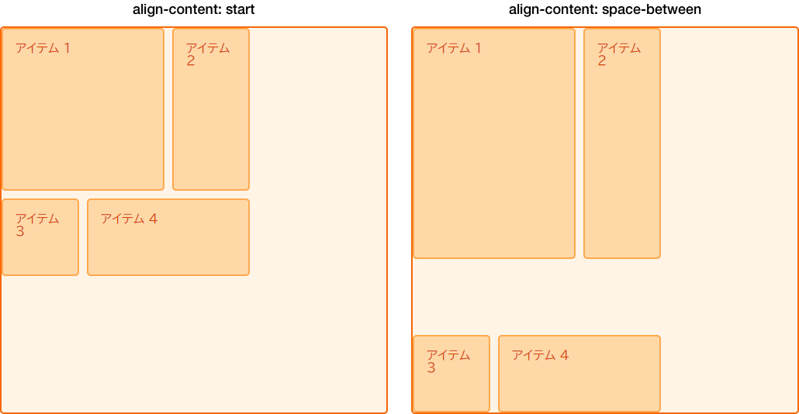
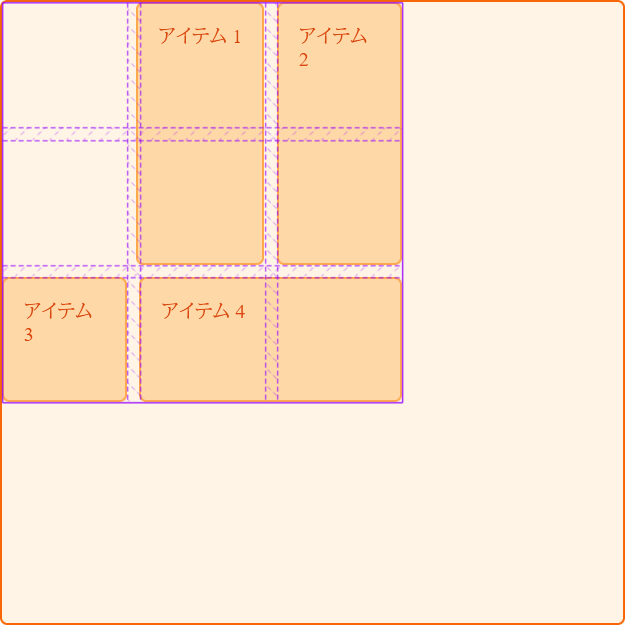

[CSS グリッドレイアウト](/ja/docs/Web/CSS/Guides/Grid_layout)は、[CSS ボックス配置](/ja/docs/Web/CSS/Guides/Box_alignment)を実装しています。これは、フレックスコンテナー内のアイテムの配置に使用される[フレックスボックス](/ja/docs/Web/CSS/Guides/Flexible_box_layout)と同じ標準です。配置モジュールでは、すべてのレイアウトメソッドで配置がどのように動作すべきかを詳しく説明しています。

このガイドでは、ボックス配置プロパティを使用して、グリッドレイアウト内のアイテムを配置する方法を見ていきます。

これらのプロパティと値がフレックスボックスで動作する方法と類似点があることにお気づきかもしれません。グリッドは 2 次元であり、フレックスボックスは 1 次元であるため、注意すべきいくつかの小さな違いがあります。このため、グリッド内で配置を行う際に扱う 2 つの軸について見ていくことから始めましょう。

## グリッドレイアウトの 2 つの軸

グリッドレイアウトでは、「ブロック軸」と「インライン軸」という 2 つの軸が利用できます。[ブロック軸](/ja/docs/Glossary/Flow_relative_values#block_direction)は、ブロックレイアウトでブロックが配置される軸です。ページ内に 2 つの段落がある場合、上から下に向かって並べられますので、この方向がブロック軸となります。


[インライン軸](/ja/docs/Glossary/Flow_relative_values#inline_direction)は，ブロック軸に直交する軸であり、通常、テキストはインライン方向に向かって流れます。


中身はグリッド領域の中に並べることができ、グリッドトラック自体が 2 つの軸の上にあります。

## ブロック軸上でのアイテムの配置

{{cssxref("align-self")}} と {{cssxref("align-items")}} プロパティは、ブロック軸上の配置を制御します。これらのプロパティを使用すると、配置したグリッド領域内でアイテムの配置を変更することができます。

### align-items の使用

次の例では、グリッド内に 4 つの{{glossary("grid areas", "グリッド領域")}}があります。 {{cssxref("align-items")}} プロパティを{{glossary("grid container", "グリッドコンテナー")}}に使用して、`normal`、`stretch`、または {{cssxref("self-position")}} や {{cssxref("baseline-position")}} 値を使用して、アイテムを配置することができます。

- `normal`
- `stretch`
- `start`
- `end`
- `center`
- `baseline`
- `first baseline`
- `last baseline`
- `auto` （`align-self` のみ）

既定値は `normal` であり、グリッドコンテナーでは `stretch` に解決されます。

```css hidden
* {
  box-sizing: border-box;
}

.wrapper {
  border: 2px solid #f76707;
  border-radius: 5px;
  background-color: #fff4e6;
}

.wrapper > div {
  border: 2px solid #ffa94d;
  border-radius: 5px;
  background-color: #ffd8a8;
  padding: 1em;
  color: #d9480f;
}
```

```css
.wrapper {
  display: grid;
  grid-template-columns: repeat(8, 1fr);
  gap: 10px;
  grid-auto-rows: 100px;
  grid-template-areas:
    "a a a a b b b b"
    "a a a a b b b b"
    "c c c c d d d d"
    "c c c c d d d d";
  align-items: start;
}
.item1 {
  grid-area: a;
}
.item2 {
  grid-area: b;
}
.item3 {
  grid-area: c;
}
.item4 {
  grid-area: d;
}
```

```html
<div class="wrapper">
  <div class="item1">アイテム 1</div>
  <div class="item2">アイテム 2</div>
  <div class="item3">アイテム 3</div>
  <div class="item4">アイテム 4</div>
</div>
```

{{ EmbedLiveSample('Using_align-items', '500', '500') }}

`align-items: start` を設定すると、それぞれの子である `<div>` の高さはコンテンツの `<div>` によって決定されることを覚えておいてください。また、 {{cssxref("align-items")}} を完全に省略すると、それぞれの子である `<div>` の高さはグリッド領域を満たすように広がります。

`align-items` プロパティはすべての子グリッドアイテムに {{cssxref("align-self")}} プロパティを設定します。これは、グリッドアイテム上で直接 `align-self` を使えばプロパティを個別に設定できるということです。

### align-self の使用

次の例では、`align-self` プロパティを使い、様々な配置の値を実験します。最初の領域は、`align-self` の既定の動作であり、この場合は `stretch` に解決されます。2 つ目のアイテムは `align-self` が `start` 値を持っており、3 つ目は `end` 、4 つ目は `center` です。

```css hidden
* {
  box-sizing: border-box;
}

.wrapper {
  border: 2px solid #f76707;
  border-radius: 5px;
  background-color: #fff4e6;
}

.wrapper > div {
  border: 2px solid #ffa94d;
  border-radius: 5px;
  background-color: #ffd8a8;
  padding: 1em;
  color: #d9480f;
}
```

```css
.wrapper {
  display: grid;
  grid-template-columns: repeat(8, 1fr);
  gap: 10px;
  grid-auto-rows: 100px;
  grid-template-areas:
    "a a a a b b b b"
    "a a a a b b b b"
    "c c c c d d d d"
    "c c c c d d d d";
}
.item1 {
  grid-area: a;
}
.item2 {
  grid-area: b;
  align-self: start;
}
.item3 {
  grid-area: c;
  align-self: end;
}
.item4 {
  grid-area: d;
  align-self: center;
}
```

```html
<div class="wrapper">
  <div class="item1">アイテム 1</div>
  <div class="item2">アイテム 2</div>
  <div class="item3">アイテム 3</div>
  <div class="item4">アイテム 4</div>
</div>
```

{{ EmbedLiveSample('Using_align-self', '500', '500') }}

### アイテムと固有のアスペクト比

{{cssxref("align-self")}} の既定の動作は、グリッドコンテナーの `align-items` プロパティを継承することです。このプロパティの既定値は `normal` で、内在的な{{glossary("aspect ratio", "アスペクト比")}}を持つアイテムを除き、アイテムを伸縮させます。アスペクト比を持つアイテムを伸縮させると、アイテムが歪んでしまうためです。

## インライン軸上のアイテムの位置揃え

`align-items` と `align-self` はブロック軸上でアイテムを揃えるのに対し、{{cssxref("justify-items")}} と {{cssxref("justify-self")}} はインライン軸上でアイテムを揃えます。選択できる値は、`align-self` プロパティの `normal`、`stretch`、{{cssxref("self-position")}}、{{cssxref("baseline-position")}} の値と同様で、`left` および `right` もあります。値には、以下のものがあります。

- `normal`
- `start`
- `end`
- `left`
- `right`
- `center`
- `stretch`
- `baseline`
- `first baseline`
- `last baseline`
- `auto` （`justify-self` のみ）

以下では、{{cssxref("align-items")}} と同様の例を見ることができます。今回は {{cssxref("justify-self")}} を適用しています。

繰り返しになりますが、内在的なアスペクト比を持つアイテム以外は、既定値は `stretch` です。これは、配置を変更しない限り、グリッドアイテムは既定でグリッド領域全体を覆うということです。この例では、最初のアイテムが配置において既定の `stretch` の値を示しています。

```css hidden
* {
  box-sizing: border-box;
}

.wrapper {
  border: 2px solid #f76707;
  border-radius: 5px;
  background-color: #fff4e6;
}

.wrapper > div {
  border: 2px solid #ffa94d;
  border-radius: 5px;
  background-color: #ffd8a8;
  padding: 1em;
  color: #d9480f;
}
```

```css
.wrapper {
  display: grid;
  grid-template-columns: repeat(8, 1fr);
  gap: 10px;
  grid-auto-rows: 100px;
  grid-template-areas:
    "a a a a b b b b"
    "a a a a b b b b"
    "c c c c d d d d"
    "c c c c d d d d";
}
.item1 {
  grid-area: a;
}
.item2 {
  grid-area: b;
  justify-self: start;
}
.item3 {
  grid-area: c;
  justify-self: end;
}
.item4 {
  grid-area: d;
  justify-self: center;
}
```

```html
<div class="wrapper">
  <div class="item1">アイテム 1</div>
  <div class="item2">アイテム 2</div>
  <div class="item3">アイテム 3</div>
  <div class="item4">アイテム 4</div>
</div>
```

{{ EmbedLiveSample('Justifying_Items_on_the_Inline_Axis', '500', '500') }}

`align-self` と `align-items` と同様に、グリッドコンテナーに `justify-items` を適用することで、すべてのアイテムに `justify-self` の値を設定することができます。

> [!NOTE]
> `justify-self` および `justify-items` プロパティはフレックスボックスには実装されていません。これは[フレックスボックス](/ja/docs/Web/CSS/Guides/Flexible_box_layout)が 1 次元であるという性質によるもの、軸に沿って複数のアイテムがあるかもしれず、単一のアイテムを揃えることができないことによります。フレックスボックスの主軸・インライン軸に沿って配置するには、 {{cssxref("justify-content")}} プロパティを使用します。

### 一括指定プロパティ

{{CSSxRef("place-items")}} プロパティは `align-items` と `justify-items` の一括指定です。

{{CSSxRef("place-self")}} プロパティは `align-self` と `justify-self` の一括指定です。

## 領域内のアイテムを中央に揃える

align プロパティと justify プロパティを組み合わせると、グリッド領域の中でアイテムを簡単に中央揃えすることができます。

```css hidden
* {
  box-sizing: border-box;
}

.wrapper {
  border: 2px solid #f76707;
  border-radius: 5px;
  background-color: #fff4e6;
}

.wrapper > div {
  border: 2px solid #ffa94d;
  border-radius: 5px;
  background-color: #ffd8a8;
  padding: 1em;
  color: #d9480f;
}
```

```css
.wrapper {
  display: grid;
  grid-template-columns: repeat(4, 1fr);
  gap: 10px;
  grid-auto-rows: 200px;
  grid-template-areas:
    ". a a ."
    ". a a .";
}
.item1 {
  grid-area: a;
  align-self: center;
  justify-self: center;
}
```

```html
<div class="wrapper">
  <div class="item1">アイテム 1</div>
</div>
```

{{ EmbedLiveSample('Center_an_item_in_the_area', '500', '500') }}

## ブロック軸上のグリッドトラックの配置

グリッドトラックが使う領域がグリッドコンテナーより小さい場合、そのコンテナー内でグリッドトラック自体を配置することができます。 {{cssxref("align-content")}} はブロック軸方向でトラックを配置し、{{cssxref("justify-content")}} はインライン軸方向の配置を行います。 `*-items` および `*-item` プロパティと同様に、 {{CSSxRef("place-content")}} プロパティは `align-content` および `justify-content` の一括指定です。

`align-content`、`justify-content`、`place-content` の値には、すべて {{cssxref("content-distribution")}} および {{cssxref("content-position")}} の値が含まれます。 `align-content` プロパティは、 {{cssxref("baseline-position")}} 値も受け入れます。また、他の `justify-*` プロパティと同様に、`justify-content` も `left` および `right` を受け入れます。

`place-content` の有効なキーワードには、次のものがあります。

- `normal`
- `start`
- `end`
- `center`
- `stretch`
- `space-around`
- `space-between`
- `space-evenly`
- `baseline`
- `first baseline`
- `last baseline`
- `left`
- `right`

`align-content` プロパティはグリッドコンテナーに適用され、グリッド全体に作用します。

### 既定の配置

この例では 500px × 500px のグリッドコンテナーがあります。3 つの行トラックと列トラックがあり、それぞれ、幅 100px、溝 10px です。これはグリッドコンテナー内でブロックとインラインどちらの方向にも隙間があることを意味します。

グリッドレイアウトの既定の動作は `start` です。そのため、グリッドトラックはグリッドの左上にあり、開始グリッド線に対して整列しています。

```css
* {
  box-sizing: border-box;
}

.wrapper {
  border: 2px solid #f76707;
  border-radius: 5px;
  background-color: #fff4e6;
}

.wrapper > div {
  border: 2px solid #ffa94d;
  border-radius: 5px;
  background-color: #ffd8a8;
  padding: 1em;
  color: #d9480f;
}
```

```css
.wrapper {
  display: grid;
  grid-template-columns: repeat(3, 100px);
  grid-template-rows: repeat(3, 100px);
  height: 500px;
  width: 500px;
  gap: 10px;
  grid-template-areas:
    "a a b"
    "a a b"
    "c d d";
}
.item1 {
  grid-area: a;
}
.item2 {
  grid-area: b;
}
.item3 {
  grid-area: c;
}
.item4 {
  grid-area: d;
}
```

```html
<div class="wrapper">
  <div class="item1">アイテム 1</div>
  <div class="item2">アイテム 2</div>
  <div class="item3">アイテム 3</div>
  <div class="item4">アイテム 4</div>
</div>
```

{{ EmbedLiveSample('Default_alignment', '500', '550') }}

### align-content: end を設定

同じ CSS と HTML を使用して、この例では、コンテナーに `align-content` を値 `end` で追加します。これにより、トラックはすべて、ブロック次元に沿ってグリッドコンテナーの末尾の線に移動します。

```css
.wrapper {
  align-content: end;
}
```

```css hidden
* {
  box-sizing: border-box;
}

.wrapper {
  border: 2px solid #f76707;
  border-radius: 5px;
  background-color: #fff4e6;
}

.wrapper > div {
  border: 2px solid #ffa94d;
  border-radius: 5px;
  background-color: #ffd8a8;
  padding: 1em;
  color: #d9480f;
}

.wrapper {
  display: grid;
  grid-template-columns: repeat(3, 100px);
  grid-template-rows: repeat(3, 100px);
  height: 500px;
  width: 500px;
  gap: 10px;
  grid-template-areas:
    "a a b"
    "a a b"
    "c d d";
}
.item1 {
  grid-area: a;
}
.item2 {
  grid-area: b;
}
.item3 {
  grid-area: c;
}
.item4 {
  grid-area: d;
}
```

```html hidden
<div class="wrapper">
  <div class="item1">アイテム 1</div>
  <div class="item2">アイテム 2</div>
  <div class="item3">アイテム 3</div>
  <div class="item4">アイテム 4</div>
</div>
```

{{ EmbedLiveSample('Setting_align-content_end', '500', '550') }}

### align-content: space-between の設定

また、 {{cssxref("content-distribution")}} の空間分配値 `space-between`、`space-around`、`space-evenly`、`stretch` を適用することもできます。この例では、ブロック軸上のトラックを配置する {{cssxref("align-content")}} を、トラックの間隔を空ける `space-between` に設定しています。

```css
.wrapper {
  align-content: space-between;
}
```

```css hidden
* {
  box-sizing: border-box;
}

.wrapper {
  border: 2px solid #f76707;
  border-radius: 5px;
  background-color: #fff4e6;
}

.wrapper > div {
  border: 2px solid #ffa94d;
  border-radius: 5px;
  background-color: #ffd8a8;
  padding: 1em;
  color: #d9480f;
}

.wrapper {
  display: grid;
  grid-template-columns: repeat(3, 100px);
  grid-template-rows: repeat(3, 100px);
  height: 500px;
  width: 500px;
  gap: 10px;
  grid-template-areas:
    "a a b"
    "a a b"
    "c d d";
}
.item1 {
  grid-area: a;
}
.item2 {
  grid-area: b;
}
.item3 {
  grid-area: c;
}
.item4 {
  grid-area: d;
}
```

```html hidden
<div class="wrapper">
  <div class="item1">アイテム 1</div>
  <div class="item2">アイテム 2</div>
  <div class="item3">アイテム 3</div>
  <div class="item4">アイテム 4</div>
</div>
```

{{ EmbedLiveSample('Setting_align-content_space-between', '500', '600') }}

アイテムが複数のグリッドトラックにまたがる場合、空間分配値を使用すると、またがるアイテムに、トラック間に追加された空間が追加されるため、グリッド上のアイテムがもっと大きくなる可能性があります。したがって、これらの値を使用する場合は、余分な空間があってもトラックのコンテンツが対応できることを確認するか、アイテムに配置プロパティを使用して、アイテムが伸縮するのではなく、先頭または末尾に移動するようにしてください。

以下の画像では、 2 つの異なる `align-content` 値を使用してグリッドを配置し、 `start` と `space-between` を比較しています。 2 行にまたがる最初の 2 つのアイテムは、 3 行の間に配分された余白によって生じた空間を割り当てられたため、 `space-between` の例では高さが余分に増えていることがわかります。



## インライン軸上のグリッドトラックの位置揃え

ブロック軸で `align-content` を使うのと同様に、インライン軸では `justify-content` を使うことができます。

同じ例を使って、{{cssxref("justify-content")}} に `space-around` を設定してみましょう。やはり、複数の列トラックにまたがるトラックが余分な空間を得ることになります。

```css
.wrapper {
  align-content: space-between;
  justify-content: space-around;
}
```

```css hidden
* {
  box-sizing: border-box;
}

.wrapper {
  border: 2px solid #f76707;
  border-radius: 5px;
  background-color: #fff4e6;
}

.wrapper > div {
  border: 2px solid #ffa94d;
  border-radius: 5px;
  background-color: #ffd8a8;
  padding: 1em;
  color: #d9480f;
}

.wrapper {
  display: grid;
  grid-template-columns: repeat(3, 100px);
  grid-template-rows: repeat(3, 100px);
  height: 500px;
  width: 500px;
  gap: 10px;
  grid-template-areas:
    "a a b"
    "a a b"
    "c d d";
}
.item1 {
  grid-area: a;
}
.item2 {
  grid-area: b;
}
.item3 {
  grid-area: c;
}
.item4 {
  grid-area: d;
}
```

```html hidden
<div class="wrapper">
  <div class="item1">アイテム 1</div>
  <div class="item2">アイテム 2</div>
  <div class="item3">アイテム 3</div>
  <div class="item4">アイテム 4</div>
</div>
```

{{ EmbedLiveSample('Justifying_the_grid_tracks_on_the_inline_axis', '500', '550') }}

## 配置と auto マージン

領域内のアイテムを揃えるもう 1 つの方法は、 auto マージンを使用することです。ビューポート、またはその親内のブロックレベル要素を中央に配置したことがある場合は、中央に配置したい要素の右マージンと左マージンを `auto` に設定して行ったかもしれません。 auto マージンは、利用可能な空間をすべて吸収します。両側のマージンを `auto` に設定すると、両方のマージンがすべての空間を取り込もうとするため、ブロックレベル要素が中央に押しやられます。

次の例では、アイテム 1 の {{cssxref("margin-left")}} プロパティが `auto` に設定されています。これにより、コンテンツは領域の右側に押し出されます。これは、コンテンツに必要な空間が割り当てられた後、利用可能な空間が auto マージンとして確保されるためです。

```css hidden
* {
  box-sizing: border-box;
}

.wrapper {
  border: 2px solid #f76707;
  border-radius: 5px;
  background-color: #fff4e6;
}

.wrapper > div {
  border: 2px solid #ffa94d;
  border-radius: 5px;
  background-color: #ffd8a8;
  padding: 1em;
  color: #d9480f;
}
```

```css
.wrapper {
  display: grid;
  grid-template-columns: repeat(3, 100px);
  grid-template-rows: repeat(3, 100px);
  height: 500px;
  width: 500px;
  gap: 10px;
  grid-template-areas:
    "a a b"
    "a a b"
    "c d d";
}
.item1 {
  grid-area: a;
  margin-left: auto;
}
.item2 {
  grid-area: b;
}
.item3 {
  grid-area: c;
}
.item4 {
  grid-area: d;
}
```

```html
<div class="wrapper">
  <div class="item1">アイテム 1</div>
  <div class="item2">アイテム 2</div>
  <div class="item3">アイテム 3</div>
  <div class="item4">アイテム 4</div>
</div>
```

{{ EmbedLiveSample('Alignment_and_auto_margins', '500', '550') }}

ブラウザーの開発者ツールにあるグリッドインスペクターを使用して、アイテムがどのように配置されているかを確認してみましょう。



## 整列と書字方向

これらの例はすべて、左書きの言語である英語です。これは、物理的な方向で考えると、先頭の線はグリッドの左上にあるということです。

CSS グリッドレイアウトと CSS ボックス配置は、CSS の書字方向と連動しています。アラビア語などの右書きの言語を表示する場合、グリッドの開始位置は右上になるため、`justify-content: start` の既定では、グリッドトラックはグリッドの右側から始まります。

{{glossary("physical properties", "物理的プロパティ")}}を設定した場合、例えば {{cssxref("margin-right")}} や {{cssxref("margin-left")}} を使用して auto マージンを設定したり、{{cssxref("top")}}、{{cssxref("right")}}、{{cssxref("bottom")}}、{{cssxref("left")}} オフセットを使用してアイテムを絶対位置指定したりしても、書字方向は反映されません。[グリッド、論理的な値、書字方向](/ja/docs/Web/CSS/Guides/Grid_layout/Logical_values_and_writing_modes) ガイドでは、CSS グリッドレイアウト、ボックスの配置、および書字方向の間の相互作用についてさらに詳しく見ていきます。これは、複数の言語で表示されるサイトを開発する場合、またはデザインで言語や書字方向を混在させる場合、理解しておくことが重要です。

## 関連情報

- [グリッドレイアウトの基本概念](/ja/docs/Web/CSS/Guides/Grid_layout/Basic_concepts)
- [グリッドレイアウトと他のレイアウト方法との関係](/ja/docs/Web/CSS/Guides/Grid_layout/Relationship_with_other_layout_methods)
- [線に基づく配置を使用したグリッドレイアウト](/ja/docs/Web/CSS/Guides/Grid_layout/Line-based_placement)
- [グリッドテンプレート領域](/ja/docs/Web/CSS/Guides/Grid_layout/Grid_template_areas)
- [名前付きグリッド線を使用したレイアウト](/ja/docs/Web/CSS/Guides/Grid_layout/Named_grid_lines)
- [グリッドレイアウトでの自動配置](/ja/docs/Web/CSS/Guides/Grid_layout/Auto-placement)
- [グリッドレイアウトでのボックス配置](/ja/docs/Web/CSS/Guides/Box_alignment/In_grid_layout)
