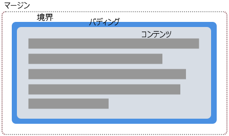

シェイプを作るのに直接的な方法が、[CSS ボックスモデル](/ja/docs/Web/CSS/Guides/Box_model)モジュールの値を使用することです。この記事では、これを行う方法を説明します。

{{cssxref("box-edge")}} ボックスのシェイプ値として有効な値は、次の通りです。

- `content-box`
- `padding-box`
- `border-box`
- `margin-box`

{{cssxref("border-radius")}} の値にも対応しています。これは、要素に曲線のある枠線を設定し、作成されたシェイプに沿ってコンテンツを配置することが可能であることを意味します。

## CSS ボックスモデル

上に挙げた値は CSS ボックスモデルの様々な部分に対応します。 CSS のボックスにはコンテンツ、パディング、境界、マージンがあります。



シェイプにボックス値を使用することで、これらの値で定義された辺でコンテンツを折り返すことができます。以下の例で、コンテンツの様々な流れ方が分かるように、パディング、境界、マージンを持つ要素を使用しています。

### margin-box

`margin-box` は外側のマージンの縁と、要素の定義で {{cssxref("border-radius")}} を使用することで、シェイプの角の半径によって定義されます。

以下の例では、高さ、幅、背景色を設定した {{htmlelement("div")}} である紫色の丸いアイテムが表示されます。 `border-radius` プロパティを使用して丸を作成しており、 `border-radius: 50%` と設定しています。要素にマージンがあるので、コンテンツは丸いシェイプに回り込み、マージンが適用されています。

```html-nolint live-sample___margin-box
<div class="box">
  <div class="shape"></div>
  <p>
    1782 年 11 月のある夜、伝えられるところによれば、フランスの小さな町アノネーで 2 人の兄弟が冬の暖炉のそばに座り、炉から立ち上る灰色の煙の渦が広い煙突をくねくねと登っていくのを見ていた。 2 人の名前はステファンおよびジョセフ・モンゴルフィエ、職業は紙漉き職人で、思慮深く、あらゆる科学的知識や新しい発見に深い関心を持っていた。
  </p>
</div>
```

```css live-sample___margin-box
body {
  font: 1.2em sans-serif;
}

.shape {
  background-color: rebeccapurple;
  height: 80px;
  width: 80px;
  padding: 20px;
  margin: 20px;
  border: 10px solid black;
  border-radius: 50%;
  float: left;
  shape-outside: margin-box;
}
```

{{EmbedLiveSample("margin-box", "", "200px")}}

### border-box

`border-box` の値は、境界の外側の縁で定義されるシェイプです。このシェイプは通常の、境界の外側におけるすべての角の丸め規則に従います。 CSS の {{cssxref("border")}} プロパティを使用していなくても、境界は存在します。この場合、境界は `padding-box` と同じになり、シェイプはパディングの縁の外側として定義されます。

次の例では、テキストが境界線によって作成された線に従うようになったのが分かります。境界の寸法を変更すると、コンテンツがそれに従います。

```html-nolint hidden live-sample___border-box
<div class="box">
  <div class="shape"></div>
  <p>
    1782 年 11 月のある夜、伝えられるところによれば、フランスの小さな町アノネーで 2 人の兄弟が冬の暖炉のそばに座り、炉から立ち上る灰色の煙の渦が広い煙突をくねくねと登っていくのを見ていた。 2 人の名前はステファンおよびジョセフ・モンゴルフィエ、職業は紙漉き職人で、思慮深く、あらゆる科学的知識や新しい発見に深い関心を持っていた。
  </p>
</div>
```

```css live-sample___border-box
body {
  font: 1.2em sans-serif;
}
.box {
  width: 70%;
}

.shape {
  background-color: rebeccapurple;
  height: 80px;
  width: 80px;
  padding: 20px;
  margin: 20px;
  border: 10px solid black;
  border-radius: 50%;
  float: left;
  shape-outside: border-box;
}
```

{{EmbedLiveSample("border-box", "", "240px")}}

### padding-box

`padding-box` の値は、パディングの縁に囲まれたシェイプを定義します。このシェイプは境界の内側におけるすべての角の丸め規則に従います。パディングがない場合、 `padding-box` は `content-box` と同じです。

```html-nolint hidden live-sample___padding-box
<div class="box">
  <div class="shape"></div>
  <p>
    1782 年 11 月のある夜、伝えられるところによれば、フランスの小さな町アノネーで 2 人の兄弟が冬の暖炉のそばに座り、炉から立ち上る灰色の煙の渦が広い煙突をくねくねと登っていくのを見ていた。 2 人の名前はステファンおよびジョセフ・モンゴルフィエ、職業は紙漉き職人で、思慮深く、あらゆる科学的知識や新しい発見に深い関心を持っていた。
  </p>
</div>
```

```css live-sample___padding-box
body {
  font: 1.2em / 1.2 sans-serif;
}
.box {
  width: 70%;
}

.shape {
  background-color: rebeccapurple;
  height: 80px;
  width: 80px;
  padding: 20px;
  margin: 20px;
  border: 10px solid black;
  border-radius: 50%;
  float: left;
  shape-outside: padding-box;
}
```

{{EmbedLiveSample("padding-box", "", "260px")}}

### content-box

このボックスのそれぞれの角の半径は、`border-radius` から `border-width` と `padding` を引いた値、または `0` のいずれか大きい方となります。つまり、ここでは負の数を取ることはありません。

```html-nolint hidden live-sample___content-box
<div class="box">
  <div class="shape"></div>
  <p>
    1782 年 11 月のある夜、伝えられるところによれば、フランスの小さな町アノネーで 2 人の兄弟が冬の暖炉のそばに座り、炉から立ち上る灰色の煙の渦が広い煙突をくねくねと登っていくのを見ていた。 2 人の名前はステファンおよびジョセフ・モンゴルフィエ、職業は紙漉き職人で、思慮深く、あらゆる科学的知識や新しい発見に深い関心を持っていた。
  </p>
</div>
```

```css live-sample___content-box
body {
  font: 1.2em / 1.2 sans-serif;
}
.box {
  width: 70%;
}

.shape {
  background-color: rebeccapurple;
  height: 80px;
  width: 80px;
  padding: 20px;
  margin: 20px;
  border: 10px solid black;
  border-radius: 50%;
  float: left;
  shape-outside: content-box;
}
```

{{EmbedLiveSample("content-box", "", "250px")}}

## ボックス値を使用する場面

シェイプを作成するのに、ボックス値を使用すると簡単ですが、これはよく対応されている `border-radius` プロパティを使用して定義することができる簡単なシェイプしか実現することができません。上記の使用例にあるような使い方の一つです。`border-radius` を使用して円形のシェイプを作成し、それに沿って文字列をカーブさせます。

いくらかの面白い効果を作成することができますが、単純なテクニックしか使っていません。この章の最後の例で、左右に 2 つの浮動状態の要素を作成し、それぞれの文字列寄りの方向に対して、 border-radius を 100% に設定しています。

```html-nolint live-sample___bottom-margin-box
<div class="box">
  <div class="shape-left"></div>
  <div class="shape-right"></div>
  <p>
    1782 年 11 月のある夜、伝えられるところによれば、フランスの小さな町アノネーで 2 人の兄弟が冬の暖炉のそばに座り、炉から立ち上る灰色の煙の渦が広い煙突をくねくねと登っていくのを見ていた。 2 人の名前はステファンおよびジョセフ・モンゴルフィエ、職業は紙漉き職人で、思慮深く、あらゆる科学的知識や新しい発見に深い関心を持っていた。
  </p>
</div>
```

```css live-sample___bottom-margin-box
body {
  font: 1.2em / 1.5 sans-serif;
}

.box {
  text-align: justify;
}

.shape-left,
.shape-right {
  height: 100px;
  width: 100px;
}

.shape-left {
  margin: 0 20px 20px 0;
  border-bottom-right-radius: 100%;
  float: left;
  shape-outside: margin-box;
}
.shape-right {
  margin: 0 20px 20px;
  border-bottom-left-radius: 100%;
  float: right;
  shape-outside: margin-box;
}
```

{{EmbedLiveSample("bottom-margin-box", "", "240px")}}

もっと複雑なシェイプについては、この章の他のガイドにあるように、[基本シェイプ](/ja/docs/Web/CSS/Guides/Shapes/Using_shape-outside)のいずれかを値として使用するか、画像からシェイプを定義するかする必要があります。
