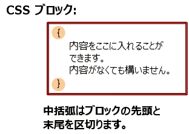

カスケーディングスタイルシート ([CSS](/ja/docs/Web/CSS)) 言語の基本的な狙いは、ブラウザーのエンジンがページの要素を、色、位置、装飾などの特定の特性をもって描けるようにすることです。 CSS の構文は、この目的を反映し、以下のような基本的な構成要素があります。

- 識別子である**プロパティ**。人間が読むことができ、人間が読むことができる名前であり、どの機能が考慮されるかを定義します。
- 特性がどのようにエンジンに処理されるべきであるかを表す**値**。どのプロパティも、形式文法および意味論的に定義され、ブラウザーに実装された妥当な値を対として持ちます。

## CSS の宣言

CSS のプロパティを特定の値に設定することは、 CSS 言語の核となる仕組みです。プロパティと値の組は**宣言**と呼ばれ、どの CSS エンジンも、 1 つ 1 つのページの要素を適切に配置し、形作るために、どの宣言を要素に適用するかを計算します。

CSS では、プロパティと値の両方とも、既定で大文字と小文字を区別しません。組はコロン `:` (U+003A COLON) で分割され、プロパティと値の前、間、後のホワイトスペースは (内部のものを除き) 無視されます。

CSS には[数百種類のプロパティ](/ja/docs/Web/CSS/Reference)と、無限に近い種類の値があります。すべてのプロパティと値の組み合わせが許されるわけではなく、どのプロパティも、何が妥当な値であるか定義されています。与えられたプロパティの値が妥当ではなかったとき、その宣言は妥当ではないと見なされ、 CSS エンジンから完全に無視されます。

## CSS の宣言ブロック

宣言は、左中括弧 `{` (U+007B LEFT CURLY BRACKET) と右中括弧 `}` (U+007D RIGHT CURLY BRACKET) で区切られた構造の中で、**ブロック**にグループ化されます。ブロックは入れ子になることがあるため、左中括弧と右中括弧が対応していなければなりません。

このようなブロックは必然的に**宣言ブロック**と呼ばれ、その中の宣言はセミコロン `;` (U+003B SEMICOLON) で区切ります。宣言ブロックは宣言を持たず、空になることもあります。宣言の周囲のホワイトスペースは無視されます。ブロックの最後の宣言は、セミコロンで終わらせる必要はありませんが、セミコロンで終わらせればブロックを他の宣言で拡張するときにセミコロンを付け忘れることを防げるため、良い書き方とみなされています。

CSS 宣言ブロックは以下の図のように表すことができます。

> [!NOTE]
> 左中括弧と右中括弧を除いた、セミコロンで分割された宣言のリストである CSS 宣言ブロックの内容は、 HTML の [`style`](/ja/docs/Web/HTML/Reference/Global_attributes/style) 属性の中に置くことができます。

## CSS のルールセット

もしスタイルシートが、1 つの宣言をウェブページのどの要素にも適用するとしたら、それはひどく使えないものになるでしょう。本当の目的は、それぞれの宣言を文書のそれぞれの部品に適用することです。

CSS ではこれを、宣言ブロックと条件を関連付けることで実現します。それぞれの（妥当な）宣言ブロックの前に、ページの要素を選択する条件である[**セレクター**](/ja/docs/Web/CSS/Guides/Selectors)を置きます。[セレクターのグループ](/ja/docs/Web/CSS/Reference/Selectors/Selector_list)と宣言ブロックの組を**ルールセット**、またはしばしば単に**ルール**と呼びます。

CSS のルールセット（またはルール）は下記の図のように表現することができます。

ページの要素は複数のセレクターに一致する可能性があり、あるプロパティが複数のルールで異なる値で複数回現れる可能性があるため、 CSS 標準ではあるプロパティが他のプロパティより優先され、適用しなければならないことを定義しています。これをカスケードアルゴリズムと呼びます（[競合の解決](/ja/docs/Learn_web_development/Core/Styling_basics/Handling_conflicts)を参照）。

> [!NOTE]
> 単一のセレクターで構成されるルールセットを複数まとめて表記する方法の一つとして、ルールセットをセレクターの集合で記述することが挙げられますが、各ルールセットの妥当性を上手くまとめるものではない点に注意しましょう。
>
> これには重要な結果が伴います。基本セレクターが 1 つでも不正な場合、たとえば未知の擬似要素や擬似クラスを使用している場合、セレクター全体が不正となり、ルール全体が（不正として）無視されます。

## CSS の文

ルールセットはスタイルシートの主な構成要素であり、よく大きな一連のルールセットのみから成ります。しかし、ウェブ制作者がスタイルシートで伝えたい情報としては、他にも文字セット、インポートする他の外部スタイルシート、フォントフェイス、リストカウンターの記述などがあります。このためには別の、特定の種類の文を使用します。

**文**は、空白ではないすべての文字で始まり、（文字列の外にあり、エスケープされておらず、別の {} または () または [] の対の中に含まれていない）最初の右中括弧またはセミコロンで終わる構成要素です。

文には 2 種類があります。

- **ルールセット** （またはルール）。ここまで見てきたように、 CSS の宣言の集合を、[セレクター](/ja/docs/Web/CSS/Guides/Selectors)によって記述された条件に関連付けています。
- **アットルール**。アットマーク `@` (U+0040 COMMERCIAL AT) で始まり、識別子が後続し、ブロックの外のセミコロンまたは次のブロックの終わりに至るまで続きます。それぞれの種類の [アットルール](/ja/docs/Web/CSS/Guides/Syntax/At-rules)は、識別子によって定義され、当然ながら独自の内部構文や意味を持つことがあります。アットルールはメタデータ情報（{{ cssxref("@layer") }} や {{ cssxref("@import") }} など）を伝えたり、条件情報（{{ cssxref("@media") }} や {{ cssxref("@document") }} など）を伝えたり、記述的情報（{{ cssxref("@font-face") }} など）を伝えたりするために使用します。

ルールまたはアットルールではない文は、すべて妥当ではなく、無視されます。

## 入れ子の文

他にも文のグループとして、**入れ子の文**があります。これらはアットルール特有のサブセットである*条件付きグループルール*の中で使用することができます。これらの文は、特定の条件が一致した場合にのみ適用されます。例えば、 `@media` アットルールの内容は、示された条件に一致するブラウザーが実行されている端末でのみ適用されるなどです。 CSS1 と CSS2.1 では、条件付きグループルール内では*ルールセット*のみが利用できました。それではあまりに厳しかったので、 [_CSS Conditionals Level 3_](/ja/docs/Web/CSS/Guides/Conditional_rules) では、この制約は撤廃されました。現在、それは今でも試験的でどのブラウザーでも対応しているわけではないものの、条件付きグループルールはより広い範囲の内容を持つことができ、ルールセットだけではなく、すべてではないものの、一部のアットルールを含むこともできます。

## 関連情報

- [CSS 構文](/ja/docs/Web/CSS/Guides/Syntax)モジュール
- [セレクターと結合子](/ja/docs/Web/CSS/Guides/Selectors/Selectors_and_combinators)
- [セレクター構造](/ja/docs/Web/CSS/Guides/Selectors/Selector_structure)
- [エラー処理](/ja/docs/Web/CSS/Guides/Syntax/Error_handling)
- [詳細度](/ja/docs/Web/CSS/Guides/Cascade/Specificity)
- [継承](/ja/docs/Web/CSS/Guides/Cascade/Inheritance)
- [カスケード](/ja/docs/Web/CSS/Guides/Cascade/Introduction)
- [値の定義構文](/ja/docs/Web/CSS/Guides/Values_and_units/Value_definition_syntax)
- 値
  - [初期値](/ja/docs/Web/CSS/Guides/Cascade/Property_value_processing#初期値)
  - [計算値](/ja/docs/Web/CSS/Guides/Cascade/Property_value_processing#計算値)
  - [使用値](/ja/docs/Web/CSS/Guides/Cascade/Property_value_processing#使用値)
  - [実効値](/ja/docs/Web/CSS/Guides/Cascade/Property_value_processing#実効値)
- [一括指定プロパティ](/ja/docs/Web/CSS/Guides/Cascade/Shorthand_properties)
