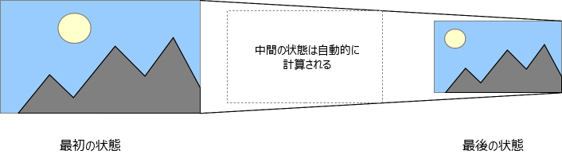

**CSS トランジション**は、 CSS プロパティが変化する際のアニメーションの速度を操作する手段を提供します。プロパティの変更を直ちに有効にするのではなく、プロパティの変更を一定期間にわたって発生させることを可能にします。例えば、ある要素の前景色を白色から黒色に変更した場合、通常は即座に前景色が替わります。 CSS トランジションを有効にすると、加速カーブに従った時間間隔で変更が行われ、その変化のすべてをカスタマイズすることができます。

2 つの状態間のトランジションを含むアニメーションは、開始状態と最終状態の間の状態がブラウザーによって暗黙的に定義されるため、*暗黙的なトランジション*と呼ばれることがあります。



CSS トランジションでは、どのプロパティをアニメーションさせるか（[_明示的に列挙する_](/ja/docs/Web/CSS/Reference/Properties/transition-property)ことで）、いつアニメーションを始めるか（[_delay_](/ja/docs/Web/CSS/Reference/Properties/transition-delay) を設定することで）、どれくらいの時間でトランジションさせるか（[_duration_](/ja/docs/Web/CSS/Reference/Properties/transition-duration) を設定することで）、どのようにトランジションさせるか、例えば、直線的に実行するか、始めはすばやく、終わりはゆっくりと実行するか（[_イージング関数_](/ja/docs/Web/CSS/Reference/Properties/transition-duration)を定義することで）を決めることができます。

## どの CSS プロパティがトランジション可能か

ウェブの作者は、どのプロパティをどのようにアニメーションさせるかを定義することができます。これにより、複雑なトランジションを作成することができます。しかし、いくつかのプロパティはアニメーションさせる意味がないため、[アニメーション不可](/ja/docs/Web/CSS/Guides/Animations/Animatable_properties)となっています。

> [!NOTE]
> `auto` の値はしばしばとても複雑になります。仕様書では開始値および終了値が `auto` の場合はアニメーションしないよう推奨しています。 Gecko を利用したものなど、一部のユーザーエージェントはこの要件を実装しており、 WebKit を利用したものなどではより制約が少なくなります。 `auto` でアニメーションを利用すると、ブラウザーやそのバージョンによって予測できない結果になる可能性があるため、避けるべきです。

## トランジションの定義

CSS トランジションは一括指定の {{cssxref("transition")}} プロパティを使用して制御されます。トランジションを設定する上で最も良い方法で、パラメーターを列挙する数がずれてしまって、とってもイライラしながら CSS のデバッグを多大な時間を使って行うことを防いでくれます。

それぞれのトランジションコンポーネントに対しては以下のサブプロパティを用いてコントロールできます。

- {{cssxref("transition-property")}}
  - : トランジションを適用する CSS プロパティの名前を指定します。ここに指定したプロパティだけが、トランジションによりアニメーションします。通常、それ以外のプロパティの変更は即座に反映されます。
- {{cssxref("transition-duration")}}
  - : トランジションの実行にかかる再生時間を指定します。単一の値を指定すると、すべてのプロパティのトランジションの再生時間として適用されます。または複数の値を指定すると、プロパティごとにトランジションの再生時間として異なる値を指定することができます。
- {{cssxref("transition-timing-function")}}
  - : プロパティの中間の値を計算する方法を定義する関数を指定します。*イージング関数*はトランジションの中間の値がどのように計算されるかを定義します。多くの[イージング関数](/ja/docs/Web/CSS/Reference/Values/easing-function)は対応する関数のグラフを提供することで指定され、これは三次ベジェ関数を定義する 4 つの点で定義されます。 [Easing functions cheat sheet](https://easings.net/) からイージングを選択することもできます。
- {{cssxref("transition-delay")}}
  - : プロパティが変化した時点から、トランジションが実際に始まるまでの待ち時間を定義します。

`transition` の一括指定 CSS の構文は以下のように書きます。

```css
div {
  transition: <property> <duration> <timing-function> <delay>;
}
```

## 例

### 基本的な例

この例では 4 秒間のフォントの大きさのトランジションを行い、ユーザーがマウスを要素上に移動してからアニメーション効果が始まるまで 2 秒間の遅延を行います。

```css
#delay {
  font-size: 14px;
  transition-property: font-size;
  transition-duration: 4s;
  transition-delay: 2s;
}

#delay:hover {
  font-size: 36px;
}
```

### 複数のアニメーションするプロパティの例

```html hidden
<body>
  <p>
    下記のボックスは、幅、高さ、背景色、回転のトランジションを組み合わせています。ボックスに当てると、これらのプロパティがアニメーションします。
  </p>
  <div class="box">例</div>
</body>
```

#### CSS

```css
.box {
  border-style: solid;
  border-width: 1px;
  display: block;
  width: 100px;
  height: 100px;
  background-color: #0000ff;
  transition:
    width 2s,
    height 2s,
    background-color 2s,
    rotate 2s;
}

.box:hover {
  background-color: #ffcccc;
  width: 200px;
  height: 200px;
  rotate: 180deg;
}
```

{{EmbedLiveSample('Multiple_animated_properties_example', 600, 300)}}

### プロパティ値のリストの長さが異なる場合

何れかのプロパティで、値のリストが他よりも短い場合、以下のように、他と一致するまで繰り返されます。

```css
div {
  transition-property: opacity, left, top, height;
  transition-duration: 3s, 5s;
}
```

これは次のように指定されたかのように扱われます。

```css
div {
  transition-property: opacity, left, top, height;
  transition-duration: 3s, 5s, 3s, 5s;
}
```

同様に、何れかのプロパティで値のリストが {{cssxref("transition-property")}} のリストよりも長い場合は切り詰められますので、以下の CSS のようになります。

```css
div {
  transition-property: opacity, left;
  transition-duration: 3s, 5s, 2s, 1s;
}
```

これは次のように解釈されます。

```css
div {
  transition-property: opacity, left;
  transition-duration: 3s, 5s;
}
```

### メニューのハイライトにトランジションを用いる

CSS の一般的な使い方として、メニューのアイテムにマウスポインターを乗せたときに、そのアイテムをハイライトさせることがあります。トランジションを使ってより魅力的な効果を出すのは簡単です。

まずは、 HTML でメニューを作成します。

```html
<nav>
  <a href="#">ホーム</a>
  <a href="#">概要</a>
  <a href="#">お問い合わせ</a>
  <a href="#">リンク集</a>
</nav>
```

そして、メニューのルック＆フィールを実装するために、次のように CSS を作成します。

```css
nav {
  display: flex;
  gap: 0.5rem;
}

a {
  flex: 1;
  background-color: #333;
  color: #fff;
  border: 1px solid;
  padding: 0.5rem;
  text-align: center;
  text-decoration: none;
  transition: all 0.5s ease-out;
}

a:hover,
a:focus {
  background-color: #fff;
  color: #333;
}
```

この CSS は、メニューの外見を決めています。また、要素が {{cssxref(":hover")}} および {{cssxref(":focus")}} の状態であるときに、背景色と前景色を変化させています。

{{EmbedLiveSample("Using transitions when highlighting menus")}}

### display と content-visibility のトランジション

この例では、 [`display`](/ja/docs/Web/CSS/Reference/Properties/display) と [`content-visibility`](/ja/docs/Web/CSS/Reference/Properties/content-visibility) がどのように遷移するかを示します。この動作は、例えば `display: none` でコンテナーを DOM から除去するものの、すぐに消えるのではなく、[`opacity`](/ja/docs/Web/CSS/Reference/Properties/opacity) でフェードアウトさせるような出現・消滅アニメーションを作成する場合に便利です。

対応しているブラウザーは、 `display` と `content-visibility` を[離散アニメーション値](/ja/docs/Web/CSS/Guides/Animations/Animatable_properties#離散)の一種としてトランジションさせます。これは一般的に、プロパティが 2 つの値の間をアニメーションの 50% で切り替えるという意味になります。

ただし例外があり、それは `display: none` または `content-visibility: hidden` との間でアニメーションする場合です。この場合、ブラウザーはアニメーションの間中、トランジションしたコンテンツが表示されるように、 2 つの値を切り替えます。

従って、例えば次のようになります。

- `display` を `none` から `block` （または他の表示可能な `display` 値）にアニメーションさせるときは、値が `block` に切り替わるのはアニメーションの `0%` であり、期間中ずっと表示されます。
- `display` を `block` （または他の表示可能な `display` 値）から `none` にアニメーションさせるときは、値は `none` に切り替わるのはアニメーションの `100%` です。

これらのプロパティをトランジションさせる場合は、 [`transition-behavior: allow-discrete`](/ja/docs/Web/CSS/Reference/Properties/transition-behavior) をトランジションに設定する必要があります。これにより、効果的に `display`/`content-visibility` トランジションを行うことができます。

`display` をトランジションさせる場合、その要素が最初のスタイル更新を受けたときに、そのプロパティからトランジションさせるために要素に設定するプロパティ群の開始値を提供するために [`@starting-style`](/ja/docs/Web/CSS/Reference/At-rules/@starting-style) が必要です。これは予期しない動作を避けるために必要です。既定では、CSS のトランジションは、要素が最初に DOM に現れたとき、つまり `display` が `none` から他の状態に変わったときを含め、要素の最初のスタイル更新では発生しません。 `content-visibility` のアニメーションは `@starting-style` ブロックで開始値を指定する必要はありません。これは `content-visibility` が `display` のように DOM から要素を隠すのではなく、要素のコンテンツのレンダリングをスキップするだけだからです。

#### HTML

HTML は 2 つの {{htmlelement("p")}} 要素を持っており、その間に {{htmlelement("div")}} を挟んで、 `display` を `none` から `block` までアニメーションさせます。

```html-nolint
<p>
  画面上のどこかをクリックするか、いずれかのキーを押すと、 <code>&lt;div&gt;</code> の表示・非表示が切り替わります。
</p>

<div>
  これは <code>&lt;div&gt;</code> 要素で、 <code>display: none; opacity: 0</code> と <code>display: block; opacity: 1</code> の間をトランジションします。うまくいったでしょう?
</div>

<p>
  これは、上記の <code>&lt;div&gt;</code> に <code>display: none; </code> が適用され、除去されていることを示すための別の段落です。 <code>opacity</code> が変更されるだけなら、常に DOM に空間が取られるでしょう。
</p>
```

#### CSS

```css
html {
  height: 100vh;
}

div {
  font-size: 1.6rem;
  padding: 20px;
  border: 3px solid red;
  border-radius: 20px;
  width: 480px;

  display: none;
  opacity: 0;
  transition:
    opacity 1s,
    display 1s allow-discrete;
  /* transition: all 1s allow-discrete; と同等 */
}

.showing {
  opacity: 1;
  display: block;
}

@starting-style {
  .showing {
    opacity: 0;
  }
}
```

トランジションの開始スタイルを指定するために使用する `@starting-style` ブロックと、トランジションリストに `display` プロパティが含まれており、 `allow-discrete` が設定されていることに注意してください。

#### JavaScript

最後に、若干の JavaScript を記述して、（`showing` クラスを介して）トランジションを発生させるイベントリスナーを設定します。

```js
const divElem = document.querySelector("div");
const htmlElem = document.querySelector(":root");

htmlElem.addEventListener("click", showHide);
document.addEventListener("keydown", showHide);

function showHide() {
  divElem.classList.toggle("showing");
}
```

#### 結果

このコードは次のように表示されます。

{{ EmbedLiveSample("Transitioning display and content-visibility", "100%", "350") }}

## JavaScript の例

> [!NOTE]
> 次のような場合の直後にトランジションを使用する場合は注意してください。
>
> - `.appendChild()` を使用して DOM に要素を追加したとき
> - 要素の `display: none;` プロパティを外したとき
>
> この場合、初期の状態が発生せず、要素が常に最後の状態であるかのように扱われます。この制限を解決する簡単な方法は、トランジションを行いたい CSS プロパティを変更する前に、数ミリ秒の `setTimeout()` を適用することです。

### JavaScript の機能をスムーズにするためのトランジション

トランジションは、 JavaScript による機能に対して何も行うことなしに、よりスムーズにさせることができる素晴らしいツールです。以下の例をご覧ください。

```html
<p>どこかをクリックするとボールを移動します</p>
<div id="foo" class="ball"></div>
```

JavaScript を使用して、ある場所にボールを移動させる効果を作ることができます。

```js
const f = document.getElementById("foo");
document.addEventListener(
  "click",
  (ev) => {
    f.style.transform = `translateY(${ev.clientY - 25}px)`;
    f.style.transform += `translateX(${ev.clientX - 25}px)`;
  },
  false,
);
```

CSS により余分な努力をせずに、上記の効果をスムーズにさせることができます。単に要素へトランジションを追加すると、変化がスムーズに発生するようになります。

```css
.ball {
  border-radius: 25px;
  width: 50px;
  height: 50px;
  background: #c00;
  position: absolute;
  top: 0;
  left: 0;
  transition: transform 1s;
}
```

{{EmbedGHLiveSample("css-examples/transitions/js-transitions.html", '100%', 500)}}

### トランジションの開始と完了の検出

{{domxref("Element/transitionend_event", "transitionend")}} イベントを使用することでで、アニメーションの実行が終了したことを検出することができます。これは {{domxref("TransitionEvent")}} オブジェクトで、通常の {{domxref("Event")}} オブジェクトに 2 つのプロパティを追加したものです。

- `propertyName`
  - : 文字列で、トランジションが完了した CSS プロパティの名前を示します。
- `elapsedTime`
  - : 浮動小数点値で、イベントが発行されてからトランジションが実行された時間を示します。この値は {{cssxref("transition-delay")}} の値に影響されません。

通常は、 {{domxref("EventTarget.addEventListener", "addEventListener()")}} メソッドを使用してこのイベントを監視することができます。

```js
el.addEventListener("transitionend", updateTransition, true);
```

トランジションの開始は {{domxref("Element/transitionrun_event", "transitionrun")}} (遅延の前に発行) および {{domxref("Element/transitionstart_event", "transitionstart")}} (遅延の後に発行) を使用して、同じ形で検出することができます。

```js
el.addEventListener("transitionrun", signalStart, true);
el.addEventListener("transitionstart", signalStart, true);
```

> [!NOTE]
> `transitionend` イベントは、要素に {{cssxref("display")}}`: none` が適用されたりアニメーション中のプロパティの値が変更されたりして、トランジションが完了する前に中止された場合は発行されません。

## 仕様書

{{Specifications}}

## 関連情報

- {{domxref("TransitionEvent")}} インターフェイスと {{domxref("Element/transitionend_event", "transitionend")}} イベント
- [CSS アニメーションの使い方](/ja/docs/Web/CSS/Guides/Animations/Using)
