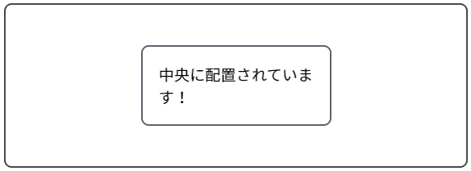

このレシピでは、[フレックスボックス](#フレックスボックスを使用)と[グリッド](#グリッドを使用)を使用して、1 つのボックスを別のボックスの中央に配置し、コンテンツを水平方向と垂直方向の両方で中央揃えにする方法をご紹介します。



## 要件

あるボックス内のアイテムを、別のボックスの中心に水平方向および垂直方向に配置します。

## レシピ

以下のコードブロックの "Play" をクリックすると、この例を MDN Playground で開きます。

```html live-sample___center-example
<div class="container">
  <div class="item">中央に配置されています！</div>
</div>
```

```css live-sample___center-example
.item {
  border: 2px solid rgb(95 97 110);
  border-radius: 0.5em;
  padding: 20px;
  width: 10em;
}

.container {
  border: 2px solid rgb(75 70 74);
  border-radius: 0.5em;
  font: 1.2em sans-serif;

  height: 200px;
  display: flex;
  align-items: center;
  justify-content: center;
}
```

{{EmbedLiveSample("center-example", "", "250px")}}

## フレックスボックスを使用

あるボックスを別のボックスの中央に配置するには、まず、親ボックスを[フレックスコンテナー](/ja/docs/Web/CSS/Guides/Flexible_box_layout/Basic_concepts#フレックスコンテナー)にするため、その {{cssxref("display")}} プロパティを `flex` に設定します。次に、垂直方向（ブロック軸）の中央揃えにするために {{cssxref("align-items")}} を `center` に、水平方向（インライン軸）の中央揃えにするために {{cssxref("justify-content")}} を `center` に設定します。それだけです！

### HTML

```html
<div class="container">
  <div class="item">中央に配置されています！</div>
</div>
</div>
```

### CSS

```css
div {
  border: solid 3px;
  padding: 1em;
  max-width: 75%;
}

.item {
  border: 2px solid rgb(95 97 110);
  border-radius: 0.5em;
  padding: 20px;
  width: 10em;
}

.container {
  height: 8em;
  border: 2px solid rgb(75 70 74);
  border-radius: 0.5em;
  font: 1.2em sans-serif;

  display: flex;
  align-items: center;
  justify-content: center;
}
```

コンテナーの高さを設定し、内部のアイテムがコンテナー内で確かに垂直方向に中央揃えになっていることを示します。

### 結果

{{EmbedLiveSample("Using_flexbox", "", "200px")}}

コンテナーに `align-items: center;` を適用する代わりに、内部のアイテム自体で {{cssxref("align-self")}} を `center` に設定することで、内部のアイテムを垂直方向に中央揃えにすることも可能です。

## グリッドを使用

あるボックスを別のボックスの中央に配置するもう一つの方法は、まず外側のボックスを[グリッドコンテナー](/ja/docs/Web/CSS/Guides/Grid_layout/Basic_concepts#グリッドコンテナー)にし、その {{cssxref("place-items")}} プロパティを `center` に設定して、ブロック軸とインライン軸の両方でアイテムを中央揃えにすることです。

### HTML

```html
<div class="container">
  <div class="item">中央に配置されています！</div>
</div>
```

### CSS

```css
div {
  border: solid 3px;
  padding: 1em;
  max-width: 75%;
}

.item {
  border: 2px solid rgb(95 97 110);
  border-radius: 0.5em;
  padding: 20px;
  width: 10em;
}

.container {
  height: 8em;
  border: 2px solid rgb(75 70 74);
  border-radius: 0.5em;
  font: 1.2em sans-serif;

  display: grid;
  place-items: center;
}
```

### 結果

{{EmbedLiveSample("Using_grid", "", "200px")}}

コンテナーに `place-items: center;` を適用する代わりに、コンテナーに {{cssxref("place-content", "place-content: center;")}} を設定するか、内部のアイテム自体に {{cssxref("place-self", "place-self: center")}} または {{cssxref("margin", "margin: auto;")}} を適用することで、同じ中央揃えを実現できます。

## MDN のリソース

- [フレックスボックスでのボックス配置](/ja/docs/Web/CSS/Guides/Box_alignment/In_flexbox)
- [CSS ボックス配置のガイド](/ja/docs/Web/CSS/Guides/Box_alignment)
