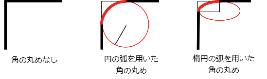

**`border-top-left-radius`** は [CSS](/ja/docs/Web/CSS) のプロパティは、角の曲率を定義する楕円の半径 (または半長軸と半短軸の半径) を指定することで、要素の左上の角を丸くします。

{{InteractiveExample("CSS デモ: border-top-left-radius")}}

```css interactive-example-choice
border-top-left-radius: 80px 80px;
```

```css interactive-example-choice
border-top-left-radius: 250px 100px;
```

```css interactive-example-choice
border-top-left-radius: 50%;
```

```css interactive-example-choice
border-top-left-radius: 50%;
border: black 10px double;
background-clip: content-box;
```

```html interactive-example
<section class="default-example" id="default-example">
  <div class="transition-all" id="example-element">
    This is a box with a top left rounded corner.
  </div>
</section>
```

```css interactive-example
#example-element {
  width: 80%;
  height: 80%;
  display: flex;
  justify-content: center;
  flex-direction: column;
  background-color: #5b6dcd;
  color: white;
  padding: 10px;
}
```

丸みは円または楕円にすることができ、値のうちの一つが `0` であれば、丸めは行われずに角は四角くなります。



背景は、画像または単色ですが、丸みがあっても境界で切り取られます。切り取られる正確な位置は、 {{cssxref("background-clip")}} プロパティの値で定義されます。

> [!NOTE]
> このプロパティの値が `border-top-left-radius` プロパティの後の {{cssxref("border-radius")}} 一括指定プロパティで設定されなかった場合、このプロパティは[一括指定プロパティ](/ja/docs/Web/CSS/Guides/Cascade/Shorthand_properties)によって初期値にリセットされます。

## 構文

```css
/* 角を円にする */
/* border-top-left-radius: radius */
border-top-left-radius: 3px;

/* 角を楕円にする */
/* border-top-left-radius: horizontal vertical */
border-top-left-radius: 0.5em 1em;

border-top-left-radius: inherit;

/* グローバル値 */
border-top-left-radius: inherit;
border-top-left-radius: initial;
border-top-left-radius: revert;
border-top-left-radius: revert-layer;
border-top-left-radius: unset;
```

値 1 つで指定する場合:

- 値は {{cssxref("&lt;length&gt;")}} または {{cssxref("&lt;percentage&gt;")}} であり、境界の角に使用する円の半径を示します。

値 2 つで指定する場合:

- 最初の値は {{cssxref("&lt;length&gt;")}} または {{cssxref("&lt;percentage&gt;")}} であり、境界の角に使用する楕円の水平の軌道長半径を示します。
- 最初の値は {{cssxref("&lt;length&gt;")}} または {{cssxref("&lt;percentage&gt;")}} であり、境界の角に使用する楕円の垂直の軌道長半径を示します。

### 値

- `<length-percentage>`
  - : 円の半径または楕円の長半径および短半径を示します。絶対的な長さの場合は、 CSS の {{cssxref("&lt;length&gt;")}} データ型で表現することができます。水平軸のパーセント値はボックスの幅、垂直軸のパーセント軸はボックスの高さに対する値です。負の数は無効です。

## 公式定義

{{CSSInfo}}

## 形式文法

{{csssyntax}}

## 例

### 円弧

単一の `<length>` 値は円弧を生成します。

```html hidden
<div></div>
```

```css
div {
  border-top-left-radius: 40px;
  background-color: lightgreen;
  border: solid 1px black;
  width: 100px;
  height: 100px;
}
```

{{EmbedLiveSample("Arc_of_a_circle")}}

### 楕円弧

2 つの異なる `<length>` 値は楕円弧を生成します。

```html hidden
<div></div>
```

```css
div {
  border-top-left-radius: 40px 20px;
  background-color: lightgreen;
  border: solid 1px black;
  width: 100px;
  height: 100px;
}
```

{{EmbedLiveSample("Arc_of_an_ellipse")}}

### パーセント値で丸みをつけた正方形の要素

正方形の要素に単一の `<percentage>` 値を指定すると、円弧を生成します。

```html hidden
<div></div>
```

```css
div {
  border-top-left-radius: 40%;
  background-color: lightgreen;
  border: solid 1px black;
  width: 100px;
  height: 100px;
}
```

{{EmbedLiveSample("Square_element_with_percentage_radius")}}

### パーセント値で丸みをつけた長方形の要素

正方形ではない要素に単一の `<percentage>` 値を指定すると、楕円弧を生成します。

```html hidden
<div></div>
```

```css
div {
  border-top-left-radius: 40%;
  background-color: lightgreen;
  border: solid 1px black;
  width: 200px;
  height: 100px;
}
```

{{EmbedLiveSample("Non-square_element_with_percentage_radius")}}

## 仕様書

{{Specifications}}

## ブラウザーの互換性

{{Compat}}

## 関連情報

- 一括指定の {{cssxref("border-radius")}} プロパティ
- {{cssxref("border-top-right-radius")}}, {{cssxref("border-bottom-right-radius")}}, {{cssxref("border-bottom-left-radius")}}
