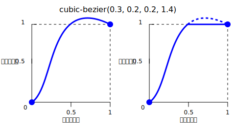

**`cubic-bezier()`** は [CSS](/ja/docs/Web/CSS) [関数](/ja/docs/Web/CSS/Reference/Values/Functions)で、 3 次[ベジェ](/ja/docs/Glossary/Bezier_curve)曲線を使用してスムーズな遷移を作成します。 [`<easing-function>`](/ja/docs/Web/CSS/Reference/Values/easing-function) として、{{Glossary("Interpolation", "補間")}}の始まりと終わりをスムーズにすることができます。

## 構文

```css
cubic-bezier(0.25, 0.1, 0.25, 1)
cubic-bezier(0.1, -0.6, 0.2, 0)
cubic-bezier(0, 0, 1, 1)
```

### 引数

この関数は以下の 4 つの引数を受け取り、これが 2 つの制御点の座標を表します。

- `<x1>`
  - : {{cssxref("&lt;number&gt;")}} で、 1 つ目の制御点の X 軸座標を表します。
    `[0, 1]` の範囲である必要があります。
- `<y1>`
  - : {{cssxref("&lt;number&gt;")}} で、 1 つ目の制御点の Y 軸座標を表します。
- `<x2>`
  - : {{cssxref("&lt;number&gt;")}} で、 2 つ目の制御点の X 軸座標を表します。
    `[0, 1]` の範囲である必要があります。
- `<y2>`
  - : {{cssxref("&lt;number&gt;")}} で、 2 つ目の制御点の Y 軸座標を表します。

## 解説

3 次べジェ関数 (cubic Bézier function) は、しばしば「スムーズ」イージング関数と呼ばれるもので、入力の進行状況を出力の進行状況に割り当てます。両方とも {{cssxref("&lt;number&gt;")}} として表現され、 `0.0` は初期状態を、 `1.0` は最終状態を表します。
3 次ベジェ曲線が無効な場合、 CSS はプロパティ全体を無視します。

3 次べジェ曲線は、P0、P1、P2、P3 の 4 点で定義されます。 P0 と P3 は、曲線の始点と終点を表します。 CSS では、開始点 P0 は `(0, 0)` に、終了点 P3 は `(1, 1)` に固定されています。一方、中間点 P1 と P2 は、関数の引数 `(<x1>, <y1>)` および `(<x2>, <y2>)` によってそれぞれ定義されます。 X 軸は入力の進行状況を表し、 Y 軸は出力の進行状況を表します。


すべての 3 次ベジェ曲線がイージング関数として適切であるわけではありません。すべての曲線が[数学関数](<https://ja.wikipedia.org/wiki/関数_(数学)>)である、すなわち指定された X 軸座標に対して 0 個または 1 個の値があるとは限らないからです。 P0 と P3 が CSS の定義通りに固定されている場合、 3 次ベジェ曲線は関数になりますので、有効です。ただし、 P1 と P2 の x 軸座標がどちらも `[0, 1]` の範囲内にある場合に限ります。

3 次ベジェ曲線の P1 または P2 の座標が `[0, 1]` の範囲外になった場合は、最終状態よりもさらに遠くまで値が移動し、その後元に戻る可能性があります。アニメーションでは、これは一種の「跳ね返り」効果を生み出します。



ただし、プロパティによっては、出力が許容範囲外になると制限がかかるものもあります。例えば、 {{CSSXref("color_value/rgb", "rgb()")}} で色成分が `255` より大きくなったり `0` より小さくなったりすると、最も近い許容値（それぞれ `255` と `0`）にクリップされます。 `cubic-bezier()` の値の中には、この性質を示すものがあります。

## 形式文法

{{csssyntax}}

## 例

### 跳ね返り効果

この例では、最初の位置からトランジションが行われると、赤いボールがボックスから飛び出します。これは、 P2 値の 1 つである `2.3` が `[0, 1]` の範囲を超えているためです。

```html hidden
<div tabindex="0">
  <span></span>
</div>
```

```css hidden
div {
  margin: 8px auto;
  padding: 8px;
  width: 256px;
  border-radius: 40px;
  background-color: wheat;
}

span {
  display: block;
  width: 64px;
  height: 64px;
  border-radius: 50%;
  background: tomato;
}

div:hover span,
div:focus span {
  translate: 192px 0;
}
```

```css
span {
  transition: translate 0.3s cubic-bezier(0.3, 0.8, 0.3, 2.3);
}
```

{{EmbedLiveSample("Bouncing effect")}}

### cubic-bezier() 関数の使用

以下の 3 次ベジェ曲線は CSS で使用できます。

```css example-good
/* [0,1] の範囲の 4 つの <number> を持つ正規のベジェ曲線 */
cubic-bezier(0.1, 0.7, 1.0, 0.1)

/* <integer> は <number> でもあるため、 <integer> も有効 */
cubic-bezier(0, 0, 1, 1)

/* 縦軸では負の値も有効で、跳ね返り効果を生み出す */
cubic-bezier(0.1, -0.6, 0.2, 0)

/* 縦軸では 1.0 より大きな値も有効 */
cubic-bezier(0, 1.1, 0.8, 4)
```

以下の 3 次ベジェ曲線は無効です。

```css example-bad
/* 引数は数値でなければならない */
cubic-bezier(0.1, red, 1.0, green)

/* X 座標は [0, 1] の範囲でなければならない */
cubic-bezier(2.45, 0.6, 4, 0.1)

/* ちょうど 4 つの引数がなければならない */
cubic-bezier(0.3, 2.1)

/* X 座標は [0, 1] の範囲でなければならない */
cubic-bezier(-1.9, 0.3, -0.2, 2.1)
```

## 仕様書

{{Specifications}}

## ブラウザーの互換性

{{Compat}}

## 関連情報

- その他のイージング関数: {{cssxref("easing-function/linear", "linear()")}} と {{cssxref("easing-function/steps", "steps()")}}
- [cubic-bezier.com](https://cubic-bezier.com/) by Lea Verou (2011)
