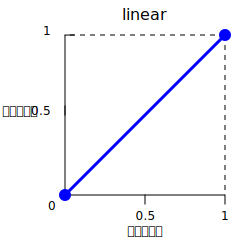
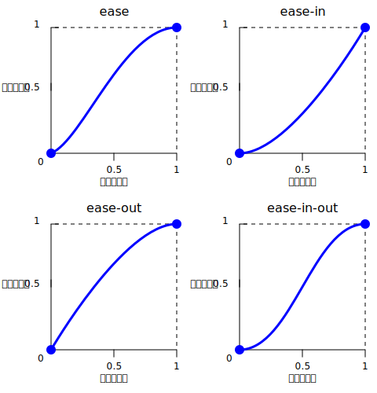

**`<easing-function>`** は [CSS](/ja/docs/Web/CSS) の[データ型](/ja/docs/Web/CSS/Reference/Values/Data_types)で、値が変化する割合を記述する数学的な関数を表します。

この 2 つの値の間の遷移は様々な形で適用される可能性があります。アニメーション中に値が変化する速さを記述するために使用されることがあります。これにより、この間、アニメーションの速度を変化させることができます。イージング関数は、CSS の [transition](/ja/docs/Web/CSS/Reference/Properties/transition-timing-function) および [animation](/ja/docs/Web/CSS/Reference/Properties/animation-timing-function) プロパティで指定することができます。

## 構文

```css
/* キーワードによる線形イージング関数 */
linear                /* linear(0, 1) */

/* カスタム線形イージング関数 */
linear(0, 0.25, 1)
linear(0, 0.25 75%, 1)

/* キーワード 3 次ベジェイージング関数 */
ease                  /* cubic-bezier(0.25, 0.1, 0.25, 1) */
ease-in               /* cubic-bezier(0.42, 0, 1, 1) */
ease-out              /* cubic-bezier(0, 0, 0.58, 1) */
ease-in-out           /* cubic-bezier(0.42, 0, 0.58, 1) */

/* カスタム 3 次ベジェイージング関数 */
cubic-bezier(0.25, 0.1, 0.25, 1)

/* キーワード段階イージング関数 */
step-start            /* steps(1, jump-start) */
step-end              /* steps(1, jump-end) */

/* カスタム段階イージング関数 */
steps(4, end)
steps(10, jump-both)
```

### 値

`<easing-function>` は以下の型のうちのいずれかです。

- `<linear-easing-function>`
  - : 一定の速度で進行する遷移を作成します。この関数は、次のいずれかを使用して指定することができます。
    - `linear`
      - : 一定の補間率で、期間を通して進行率に変化のないものを指定します（つまり、加速や減速はありません）。
        このキーワード値は `linear(0, 1)` と同等です。
        これは `cubic-bezier(0, 0, 1, 1)` と表すこともできます。

        

        > [!NOTE]
        > `linear` キーワードは常に `linear(0, 1)` として解釈されます。ここで関数 `linear(0, 1)` は `linear(0 0%, 1 100%)` と解釈されます。

    - {{cssxref("easing-function/linear", "linear()")}}
      - : 複数の進行の点を {{cssxref("&lt;number&gt;")}} 値で定義し、オプションの {{cssxref("&lt;percentage&gt;")}} 値でそのタイミングを制御します。

- `<cubic-bezier-easing-function>`
  - : 変化を可変の割合で行うスムーズな繊維を作成します。この関数は次のいずれかで指定することができます。
    - `ease`
      - : イージング関数 `cubic-bezier(0.25, 0.1, 0.25, 1)` を表します。
        これは補間がゆっくり始まり、急激に加速し、終わりに向かって徐々に遅くなることを示します。
        これは `ease-in-out` と似ていますが、始めのうちはより急激に加速されます。

    - `ease-in`
      - : イージング関数 `cubic-bezier(0.42, 0, 1, 1)` を表します。
        これは補間がゆっくり始まり、その後次第に加速していき、最終状態に達するとアニメーションは突然停止します。

    - `ease-out`
      - : イージング関数 `cubic-bezier(0, 0, 0.58, 1)` を表します。
        補間が急速に始まり、最終状態にかけて次第に減速していくことを示します。

    - `ease-in-out`
      - : イージング関数 `cubic-bezier(0.42, 0.0, 0.58, 1.0)` を表します。
        これは補間がゆっくり始まり、加速し、終わりに向かって減速することを示します。
        始めは `ease-in` キーワードのように動作し、終わりは `ease-out` キーワードのように動作します。

        

    - {{cssxref("easing-function/cubic-bezier", "cubic-bezier()")}}
      - : 2 つの制御点を指定する 4 つの {{cssxref("&lt;number&gt;")}} を用いて、カスタム曲線を定義します。
        X 座標は `[0, 1]` の範囲でなければなりません。

- `<step-easing-function>`
  - : アニメーションを等間隔の数値に分割し、段階的な遷移を作成します。これにより、アニメーションは滑らかに遷移するのではなく、段階から次の段階へとジャンプするようになります。
    この関数は、次のいずれかを指定することで使用できます。
    - `step-start`
      - : イージング関数 `steps(1, jump-start)` または `steps(1, start)` を表します。
        補間はすぐに最終状態に遷移し、最後までその状態を維持します。

    - `step-end`
      - : イージング関数 `steps(1, jump-end)` または `steps(1, end)` を表します。
        補間は、終了するまで初期状態のままで、終了時点で直接最終状態にジャンプします。

    
    - {{cssxref("easing-function/steps", "steps()")}}
      - : 間隔の数を指定する {{cssxref("&lt;integer&gt;")}} と、ジャンプのタイミングを制御するオプションのキーワードを使用して、階段状の曲線を作成します。

## 形式文法

{{csssyntax}}

## 例

### イージング関数の比較

この例では、提供されているボタンを使ってアニメーションを開始したり停止したりすることができ、メニューを選択してイージング関数を、利用可能なキーワードに加えていくつかの `cubic-bezier()` および `steps()` のオプションの中から選択することができるようになっています。オプションを選択した後、指定されたボタンを使用して、トランジションを始めたり、止めたりすることができます。

#### HTML

```html
<div>
  <div></div>
</div>
<ul>
  <li>
    <button class="animation-button">アニメーションを開始</button>
  </li>
  <li>
    <label for="easing-select">イージング関数を選択:</label>
    <select id="easing-select">
      <option selected>linear</option>
      <option>linear(0, 0.5 50%, 1)</option>
      <option>ease</option>
      <option>ease-in</option>
      <option>ease-in-out</option>
      <option>ease-out</option>
      <option>cubic-bezier(0.1, -0.6, 0.2, 0)</option>
      <option>cubic-bezier(0, 1.1, 0.8, 4)</option>
      <option>steps(5, end)</option>
      <option>steps(3, start)</option>
      <option>steps(4)</option>
    </select>
  </li>
</ul>
```

#### CSS

```css
body > div {
  position: relative;
  height: 100px;
}

div > div {
  position: absolute;
  width: 50px;
  height: 50px;
  background-color: blue;
  background-image: radial-gradient(
    circle at 10px 10px,
    rgb(25 255 255 / 80%),
    rgb(25 255 255 / 40%)
  );
  border-radius: 50%;
  top: 25px;
  animation: 1.5s infinite alternate;
}

@keyframes move-right {
  from {
    left: 10%;
  }

  to {
    left: 90%;
  }
}

li {
  display: flex;
  align-items: center;
  justify-content: center;
  margin-bottom: 20px;
}
```

#### JavaScript

```js
const selectElem = document.querySelector("select");
const startBtn = document.querySelector("button");
const divElem = document.querySelector("div > div");

startBtn.addEventListener("click", () => {
  if (startBtn.textContent === "アニメーションを開始") {
    divElem.style.animationName = "move-right";
    startBtn.textContent = "アニメーションを停止";
    divElem.style.animationTimingFunction = selectElem.value;
  } else {
    divElem.style.animationName = "unset";
    startBtn.textContent = "アニメーションを開始";
  }
});

selectElem.addEventListener("change", () => {
  divElem.style.animationTimingFunction = selectElem.value;
});
```

#### 結果

{{EmbedLiveSample("comparing_the_easing_functions", "100%", 200)}}

## 仕様書

{{Specifications}}

## ブラウザーの互換性

{{Compat}}

## 関連情報

- [CSS アニメーション](/ja/docs/Web/CSS/Guides/Animations)
- [CSS トランジション](/ja/docs/Web/CSS/Guides/Transitions)
- [cubic-bezier.com](https://cubic-bezier.com/) - Lea Verou (2011)
- [`linear()` easing generator](https://linear-easing-generator.netlify.app/) - Jake Archibald
