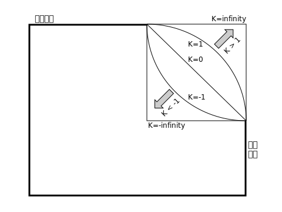

{{SeeCompatTable}}

**`superellipse()`** は [CSS](/ja/docs/Web/CSS) の[関数](/ja/docs/Web/CSS/Reference/Values/Functions)で、楕円の曲率を定義するプロパティであり、[角の形状](/ja/docs/Web/CSS/Reference/Properties/corner-shape)を直接、または {{cssxref("&lt;corner-shape-value>")}} キーワードを介して指定します。

## 構文

```css
superellipse(infinity)
superellipse(4)
superellipse(1.7)
superellipse(0)
superellipse(-2.8)
superellipse(-3)
superellipse(-infinity)
```

### 引数

- {{cssxref("&lt;number>")}}
  - : 数値で、 `-infinity` 以上 `infinity` 以下です。

### 返値

超楕円図形です。

## 解説

`superellipse()` 関数は、{{cssxref("corner-shape")}} の値を指定するために使用する超楕円図形を返します。超楕円とは、矩形と楕円の中間にある閉じられた曲線対称図形です。これは、2 つの軸の幾何学的機能を保持した楕円に似ています。

超楕円図形は変更された楕円を使用して計算されます。次の式は原点を中心とする楕円を定義します。

<math display="block">
  <mfrac>
    <msup>
      <mi>x</mi>
      <mn>2</mn>
    </msup>
    <msup>
      <mi>a</mi>
      <mn>2</mn>
    </msup>
  </mfrac>
  <mo>+</mo>
  <mfrac>
    <msup>
      <mi>y</mi>
      <mn>2</mn>
    </msup>
    <msup>
      <mi>b</mi>
      <mn>2</mn>
    </msup>
  </mfrac>
    <mo>=</mo>
    <mn>1</mn>
  </math>

変数 `a` と `b` は楕円の半径を参照しており、`x` 座標と `y` 座標は楕円の円周上の点を表します。

円は、半径（前の式における `a` と `b`）が等しい長さの楕円です。`a` と `b` がともに `r` に等しい場合、円の式は次のように表されます。

<math display="block">
  <mrow>
    <msup>
      <mi>x</mi>
      <mn>2</mn>
    </msup>
    <mo>+</mo>
    <msup>
      <mi>y</mi>
      <mn>2</mn>
    </msup>
    <mo>=</mo>
    <msup>
      <mi>r</mi>
      <mn>2</mn>
    </msup>
  </mrow>
</math>

この数式において、`x` と `y` は円の円周上の点の座標であり、`r` は円の半径で、円の中心は `(0, 0)` です。楕円は、円の図形を `x` 軸や `y` 軸に沿って変倍することで生成されます。

それぞれの場合、指数 `2` を 2<sup>K</sup> に置き換えることで超楕円図形が作成されます。ここで `K` は `superellipse()` 関数に渡される引数であり、楕円の曲率を変更します。

<math display="block">
  <mrow>
    <msup>
      <mi>x</mi>
      <msup>
        <mn>2</mn>
        <mi>K</mi>
      </msup>
    </msup>
    <mo>+</mo>
    <msup>
      <mi>y</mi>
      <msup>
        <mn>2</mn>
        <mi>K</mi>
      </msup>
    </msup>
    <mo>=</mo>
    <mn>1</mn>
  </mrow>
</math>

次の図は、コンテナーの右上角に対する異なる `superellipse()` の値（`infinity`、`1`、`0`、`-1`、`-infinity`）を示しています。



- `K` の値が `0` の場合は、直線を生成します。この値は面取りされた角を作成するために使用でき、{{cssxref("&lt;corner-shape-value>")}} の `bevel` キーワードに相当します。
- `K` の値が `1` の場合は、通常の楕円を生成します。`round` キーワードに相当します。
- `K` の値が `>1` の場合は、もっと正方形に近い楕円図形を生成します。`2` は `squircle` キーワードに相当します。
- `K` の値が `infinity` の場合は、完全な正方形を生成します（`square` キーワードに相当します）が、`K` の値が `10` 以上であれば、正方形とほとんど見分けがつきません。
- `K` が負の値であれば、 凹曲線を生み出し、結果として角の形状は内側に湾曲した、あるいは「くり抜かれた」図形になります。`K` 値が `-1` の場合、`scoop` キーワードに対応し、`-infinity` の場合、`notch` キーワードに対応します。

負または正の値を持つ超楕円は、その反対の値を持つる超楕円に対して対称に現れます。

> [!NOTE]
> 引数 `K` にどのような値が渡されても、`superellipse()` 関数の返値はその `K` 値に対して常に同じになります。この値を 2 つの要素に適用した場合、ボックスサイズや {{cssxref("border-radius")}} の値が異なると、角の形状の外観が異なる可能性ががあります。

## 形式文法

{{CSSSyntax}}

## 例

### `superellipse()` 値の比較

この例では、2 つの [`<input type="range">`](/ja/docs/Web/HTML/Reference/Elements/input/range) スライダーにより、多数の異なる `corner-shape` の `superellipse()` 値と {{cssxref("border-radius")}} 値を切り替え、それぞれの値がコンテナーに与える効果を比較できます。簡潔化のためコードは省略してありますが、[superellipse 値の比較](/ja/docs/Web/CSS/Reference/Properties/corner-shape#superellipse_値の比較)に関する完全な説明は、{{cssxref("corner-shape")}} のリファレンスページで提供されています。

```html hidden live-sample___value-comparison
<form>
  <div>
    <label for="superellipse-slider">superellipse() 値を選択:</label>
    <input
      type="range"
      id="superellipse-slider"
      min="-5"
      value="0"
      max="5"
      step="0.1" />
  </div>
  <div>
    <label for="radius-slider">border-radius 値を選択:</label>
    <input type="range" id="radius-slider" min="0" value="45" max="90" />
  </div>
</form>
<section></section>
```

```css hidden live-sample___value-comparison
html {
  font-family: "Helvetica", "Arial", sans-serif;
}

body {
  width: fit-content;
  margin: 20px auto;
}

section {
  display: flex;
  justify-content: center;
  align-items: center;
  flex: 100%;
  margin-top: 20px;
}

form div {
  margin-top: 5px;
  display: flex;
}

section {
  width: 100%;
  height: 180px;
  background-color: orange;
  background-image: linear-gradient(
    to bottom,
    rgb(255 255 255 / 0),
    rgb(255 255 255 / 0.5)
  );
}

section {
  box-shadow: 1px 1px 3px gray;
}
```

```js hidden live-sample___value-comparison
const rectangle = document.querySelector("section");
const superEllipseRange = document.getElementById("superellipse-slider");
const borderRadiusRange = document.getElementById("radius-slider");

function setCorners() {
  const seValue = `superellipse(${superEllipseRange.value})`;
  rectangle.style.cornerShape = seValue;
  const brValue = `${borderRadiusRange.value}px`;
  rectangle.style.borderRadius = brValue;
  rectangle.innerHTML = `<div><code>corner-shape: ${seValue};</code><br><code>border-radius: ${brValue};</code></div>`;
}

superEllipseRange.addEventListener("input", setCorners);
borderRadiusRange.addEventListener("input", setCorners);
setCorners();
```

{{EmbedLiveSample("value-comparison", "100%", "300")}}

> [!NOTE]
> [`<corner-shape-value>` 値の比較](/ja/docs/Web/CSS/Reference/Values/corner-shape-value#corner-shape-value_値の比較)の例も参照してください。

## 仕様書

{{Specifications}}

## ブラウザーの互換性

{{Compat}}

## 関連情報

- {{cssxref("corner-shape")}}
- {{cssxref("&lt;corner-shape-value>")}}
- [CSS 境界とボックス装飾](/ja/docs/Web/CSS/Guides/Borders_and_box_decorations)モジュール
