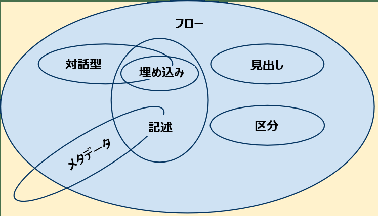

ほとんどの [HTML](/ja/docs/Web/HTML) 要素は 1 つ以上の**コンテンツカテゴリー**に属していて、カテゴリーごとに共通した特徴を持つ要素を分類しています。これは緩やかなグループ分けです（実際にはこれらのカテゴリーの要素間の関係を作成していません）。しかし、これらは、特にその複雑な詳細に遭遇したときに、カテゴリーの共有動作とその関連ルールを定義し記述するのに役立ちます。*どの*カテゴリーにも属さない要素も存在します。

コンテンツカテゴリーは 3 種類あります。

- 主要コンテンツカテゴリー。これは多くの要素で共通のルールを定義します。
- フォーム関連コンテンツカテゴリー。これはフォーム関連の要素に共通のルールを定義します。
- 固有のコンテンツカテゴリー。これはいくつかの要素だけ、場合によっては特定の文脈でだけ使われる、稀なカテゴリーです。

> **メモ:** コンテンツカテゴリーとその機能比較についての詳細な説明は、この記事の範囲外です。詳しく知りたければ、 [HTML 仕様書の関連部分](https://html.spec.whatwg.org/multipage/dom.html#kinds-of-content)を読みましょう。

[](content_categories_venn.png)

## 主要コンテンツカテゴリー

### メタデータコンテンツ

*メタデータコンテンツ*のカテゴリーに属する要素は、表示方法や文書のその他の部分の挙動を変化させたり、他の文書へのリンクを確立させたり、その他の*本文外*の情報を伝えたりします。

このカテゴリーに属する要素は、{{HTMLElement("base")}}, {{HTMLElement("command")}} {{deprecated_inline}}, {{HTMLElement("link")}}, {{HTMLElement("meta")}}, {{HTMLElement("noscript")}}, {{HTMLElement("script")}}, {{HTMLElement("style")}}, {{HTMLElement("title")}} です。

### フローコンテンツ

フローコンテンツは、 {{HTMLElement("body")}} 要素の中に入ることができるほとんどの要素を含む広いカテゴリーで、見出し要素、区分要素、記述要素、埋め込み要素、対話的要素、フォーム関連要素などが含まれます。また、テキストノードも含まれます（ただし、ホワイトスペースのみで構成されるものは除きます）。

フローコンテンツは、 {{HTMLElement("a")}}, {{HTMLElement("abbr")}}, {{HTMLElement("address")}}, {{HTMLElement("article")}}, {{HTMLElement("aside")}}, {{HTMLElement("audio")}}, {{HTMLElement("b")}}, {{HTMLElement("bdo")}}, {{HTMLElement("bdi")}}, {{HTMLElement("blockquote")}}, {{HTMLElement("br")}}, {{HTMLElement("button")}}, {{HTMLElement("canvas")}}, {{HTMLElement("cite")}}, {{HTMLElement("code")}}, {{HTMLElement("command")}} {{deprecated_inline}}, {{HTMLElement("data")}}, {{HTMLElement("datalist")}}, {{HTMLElement("del")}}, {{HTMLElement("details")}}, {{HTMLElement("dfn")}}, {{HTMLElement("div")}}, {{HTMLElement("dl")}}, {{HTMLElement("em")}}, {{HTMLElement("embed")}}, {{HTMLElement("fieldset")}}, {{HTMLElement("figure")}}, {{HTMLElement("footer")}}, {{HTMLElement("form")}}, {{HTMLElement("h1")}}, {{HTMLElement("h2")}}, {{HTMLElement("h3")}}, {{HTMLElement("h4")}}, {{HTMLElement("h5")}}, {{HTMLElement("h6")}}, {{HTMLElement("header")}}, {{HTMLElement("hgroup")}}, {{HTMLElement("hr")}}, {{HTMLElement("i")}}, {{HTMLElement("iframe")}}, {{HTMLElement("img")}}, {{HTMLElement("input")}}, {{HTMLElement("ins")}}, {{HTMLElement("kbd")}}, {{HTMLElement("keygen")}} {{deprecated_inline}}, {{HTMLElement("label")}}, {{HTMLElement("main")}}, {{HTMLElement("map")}}, {{HTMLElement("mark")}}, {{MathMLElement("math")}}, {{HTMLElement("menu")}}, {{HTMLElement("meter")}}, {{HTMLElement("nav")}}, {{HTMLElement("noscript")}}, {{HTMLElement("object")}}, {{HTMLElement("ol")}}, {{HTMLElement("output")}}, {{HTMLElement("p")}}, {{HTMLElement("picture")}}, {{HTMLElement("pre")}}, {{HTMLElement("progress")}}, {{HTMLElement("q")}}, {{HTMLElement("ruby")}}, {{HTMLElement("s")}}, {{HTMLElement("samp")}}, {{HTMLElement("script")}}, {{HTMLElement("section")}}, {{HTMLElement("select")}}, {{HTMLElement("small")}}, {{HTMLElement("span")}}, {{HTMLElement("strong")}}, {{HTMLElement("sub")}}, {{HTMLElement("sup")}}, {{SVGElement("svg")}}, {{HTMLElement("table")}}, {{HTMLElement("template")}}, {{HTMLElement("textarea")}}, {{HTMLElement("time")}}, {{HTMLElement("u")}}, {{HTMLElement("ul")}}, {{HTMLElement("var")}}, {{HTMLElement("video")}}, {{HTMLElement("wbr")}} です。

特定の条件が満たされている場合のみ、このカテゴリーに属する要素がいくつか存在します。

- {{HTMLElement("area")}}: {{HTMLElement("map")}} 要素の子孫の場合
- {{HTMLElement("link")}}: [itemprop](/ja/docs/Web/HTML/Global_attributes/itemprop) 属性がある場合
- {{HTMLElement("meta")}}: [itemprop](/ja/docs/Web/HTML/Global_attributes/itemprop) 属性がある場合
- {{HTMLElement("style")}}: [`scoped`](/ja/docs/Web/HTML/Element/style#scoped) {{deprecated_inline}} 属性がある場合

### 区分コンテンツ

区分コンテンツ (sectioning content) のモデルに属する要素は {{HTMLElement("header")}} 要素、 {{HTMLElement("footer")}} 要素、そして[見出しコンテンツ](#見出しコンテンツ)のスコープを定義する[現在のアウトライン内のセクション](/ja/docs/Web/HTML/Element/Heading_Elements)を作成します。

このカテゴリーに属する要素は、 {{HTMLElement("article")}}, {{HTMLElement("aside")}}, {{HTMLElement("nav")}}, {{HTMLElement("section")}} です。

> **メモ:** このコンテンツモデルを[区分化ルート](/ja/docs/Web/HTML/Element/Heading_Elements#sectioning_roots)カテゴリーと混同しないでください。区分化ルートは、通常のアウトラインからそれ自身のコンテンツを分離させるものです。

### 見出しコンテンツ

見出しコンテンツ (heading content) は明示的に[区分コンテンツ](#区分コンテンツ)要素によってマークアップされたか、もしくは、見出しコンテンツ自身によって明示的に定義されたセクションの見出しを定義します。

このカテゴリーに属する要素は、 {{HTMLElement("h1")}}, {{HTMLElement("h2")}}, {{HTMLElement("h3")}}, {{HTMLElement("h4")}}, {{HTMLElement("h5")}}, {{HTMLElement("h6")}}, {{HTMLElement("hgroup")}} です。

> **メモ:** {{HTMLElement("header")}} 要素は見出しを含む可能性がありますが、それ自身は見出しコンテンツではありません。

> **メモ:** {{HTMLElement("hgroup")}} 要素は、支援技術で適切に動作しないため、推奨されません。 HTML 5 が完成する前に W3C の HTML 仕様書から削除されましたが、 WHATWG の仕様書の一部として残っており、ほとんどのブラウザーは最低限部分的に対応しています。

### 記述コンテンツ

記述コンテンツ (phrasing content) は、文章とその中に含まれるマークアップを定義します。記述コンテンツの集まりで段落を構成します。

このカテゴリーに属する要素は、 {{HTMLElement("abbr")}}, {{HTMLElement("audio")}}, {{HTMLElement("b")}}, {{HTMLElement("bdo")}}, {{HTMLElement("br")}}, {{HTMLElement("button")}}, {{HTMLElement("canvas")}}, {{HTMLElement("cite")}}, {{HTMLElement("code")}}, {{HTMLElement("command")}} {{deprecated_inline}}, {{HTMLElement("data")}}, {{HTMLElement("datalist")}}, {{HTMLElement("dfn")}}, {{HTMLElement("em")}}, {{HTMLElement("embed")}}, {{HTMLElement("i")}}, {{HTMLElement("iframe")}}, {{HTMLElement("img")}}, {{HTMLElement("input")}}, {{HTMLElement("kbd")}}, {{HTMLElement("keygen")}} {{deprecated_inline}}, {{HTMLElement("label")}}, {{HTMLElement("mark")}}, {{MathMLElement("math")}}, {{HTMLElement("meter")}}, {{HTMLElement("noscript")}}, {{HTMLElement("object")}}, {{HTMLElement("output")}}, {{HTMLElement("picture")}}, {{HTMLElement("progress")}}, {{HTMLElement("q")}}, {{HTMLElement("ruby")}}, {{HTMLElement("samp")}}, {{HTMLElement("script")}}, {{HTMLElement("select")}}, {{HTMLElement("small")}}, {{HTMLElement("span")}}, {{HTMLElement("strong")}}, {{HTMLElement("sub")}}, {{HTMLElement("sup")}}, {{SVGElement("svg")}}, {{HTMLElement("textarea")}}, {{HTMLElement("time")}}, {{HTMLElement("u")}}, {{HTMLElement("var")}}, {{HTMLElement("video")}}, {{HTMLElement("wbr")}} および通常の文字列です（ホワイトスペースだけで構成されたものを除く）。

他にも特定の条件が満たされたときのみ、このカテゴリーに属する要素がいくつかあります。

- {{HTMLElement("a")}}: 記述コンテンツだけを含む場合
- {{HTMLElement("area")}}: {{HTMLElement("map")}} 要素の子孫である場合
- {{HTMLElement("del")}}: 記述コンテンツだけを含む場合
- {{HTMLElement("ins")}}: 記述コンテンツだけを含む場合
- {{HTMLElement("link")}}: [itemprop](/ja/docs/Web/HTML/Global_attributes/itemprop) 属性がある場合
- {{HTMLElement("map")}}: 記述コンテンツだけを含む場合
- {{HTMLElement("meta")}}: [itemprop](/ja/docs/Web/HTML/Global_attributes/itemprop) 属性がある場合

### 埋め込みコンテンツ

埋め込みコンテンツ (Embedded content) は、文書に他のリソースを取り込んだり、他のマークアップ言語や名前空間を挿入したりするものです。このカテゴリーに属する要素は、 {{HTMLElement("audio")}}, {{HTMLElement("canvas")}}, {{HTMLElement("embed")}}, {{HTMLElement("iframe")}}, {{HTMLElement("img")}}, {{MathMLElement("math")}}, {{HTMLElement("object")}}, {{SVGElement("svg")}}, {{HTMLElement("video")}} です。

### 対話型コンテンツ

対話型コンテンツ (interactive content) にはユーザとのやり取りのために固有にデザインされた要素が含まれます。このカテゴリーに属する要素は、 {{HTMLElement("a")}}, {{HTMLElement("button")}}, {{HTMLElement("details")}}, {{HTMLElement("embed")}}, {{HTMLElement("iframe")}}, {{HTMLElement("keygen")}} {{deprecated_inline}}, {{HTMLElement("label")}}, {{HTMLElement("select")}}, {{HTMLElement("textarea")}} です。
要素によっては、特定の条件下にある場合にのみこのカテゴリーに所属します。

- {{HTMLElement("audio")}}: [`controls`](/ja/docs/Web/HTML/Element/audio#controls) 属性がある場合
- {{HTMLElement("img")}}: [`usemap`](/ja/docs/Web/HTML/Element/img#usemap) 属性がある場合
- {{HTMLElement("input")}}: [`type`](/ja/docs/Web/HTML/Element/input#type) 属性が hidden 状態ではない場合
- {{HTMLElement("menu")}}: [`type`](/ja/docs/Web/HTML/Element/menu#type) 属性が toolbar 状態ではない場合
- {{HTMLElement("object")}}: [`usemap`](/ja/docs/Web/HTML/Element/object#usemap) 属性がある場合
- {{HTMLElement("video")}}: [`controls`](/ja/docs/Web/HTML/Element/video#controls) 属性がある場合

### 知覚可能コンテンツ

コンテンツが空でも非表示でもない時は知覚可能 (palpable) です。これは描画され実在するコンテンツです。フローコンテンツまたは記述コンテンツの要素には、知覚可能なノードが少なくとも 1 つあります。

### フォーム関連コンテンツ

フォーム関連コンテンツ (form-associated content) は **form** 属性によって表される、フォームオーナーを持つ要素を含みます。フォームオーナーは、このカテゴリーの要素を内包する {{HTMLElement("form")}} 要素か **form** 属性で id が指定された要素です。

- {{HTMLElement("button")}}
- {{HTMLElement("fieldset")}}
- {{HTMLElement("input")}}
- {{HTMLElement("keygen")}} {{deprecated_inline}}
- {{HTMLElement("label")}}
- {{HTMLElement("meter")}}
- {{HTMLElement("object")}}
- {{HTMLElement("output")}}
- {{HTMLElement("progress")}}
- {{HTMLElement("select")}}
- {{HTMLElement("textarea")}}

このカテゴリーにはいくつかのサブカテゴリーが含まれています。

- リスト化
  - : IDL コレクションの {{domxref("HTMLFormElement.elements", "form.elements")}} と fieldset.elements によってリスト化された要素です。 {{HTMLElement("button")}}, {{HTMLElement("fieldset")}}, {{HTMLElement("input")}}, {{HTMLElement("keygen")}} {{deprecated_inline}}, {{HTMLElement("object")}}, {{HTMLElement("output")}}, {{HTMLElement("select")}}, {{HTMLElement("textarea")}} を含みます。
- ラベル付け可能
  - : {{HTMLElement("label")}} に関連付けできる要素です。 {{HTMLElement("button")}}, {{HTMLElement("input")}}, {{HTMLElement("keygen")}} {{deprecated_inline}}, {{HTMLElement("meter")}}, {{HTMLElement("output")}}, {{HTMLElement("progress")}}, {{HTMLElement("select")}}, {{HTMLElement("textarea")}} を含みます。
- 送信可能
  - : フォームが送信 (submit) されるときにフォームデータセットを構築するために用いることができる要素です。 {{HTMLElement("button")}}, {{HTMLElement("input")}}, {{HTMLElement("keygen")}} {{deprecated_inline}}, {{HTMLElement("object")}}, {{HTMLElement("select")}}, {{HTMLElement("textarea")}} を含みます。
- リセット可能
  - : フォームがリセットされるときに影響を受けることがある要素です。 {{HTMLElement("input")}}, {{HTMLElement("keygen")}}, {{HTMLElement("output")}}, {{HTMLElement("select")}} {{HTMLElement("textarea")}} を含みます。

## 二次カテゴリー

要素の二次分類がいくつかあり、知っておくと便利です。

### スクリプト対応要素

**スクリプト対応要素 (Script-supporting elements)** は、文書の出力に直接貢献はしない要素です。代わりに、スクリプトコードを直接含んだり、スクリプトで使われるデータを定義したりして、スクリプトへの対応のために働きます。

スクリプト対応要素は以下の通りです。

- {{HTMLElement("script")}}
- {{HTMLElement("template")}}

## 透過的コンテンツモデル

要素が透過的コンテンツモデル (transparent content model) を持っている場合、透過的な要素が削除されたり、子要素で置き換えられたりしても、それ自身のコンテンツが必ず妥当な HTML 5 として構造化されているものです。

例えば、 {{HTMLElement("del")}} と {{HTMLELement("ins")}} 要素は透過的です。

```html
<p>私たちはこれらの真実を<del><em>不可侵なものでありかつ否定できない</em></del><ins>自明の</ins>ものであるとし続けた。</p>
```

これらの要素が削除されたとしても、この断片は（文章としては正しくありませんが）妥当な HTML です。

```html
<p>私たちはこれらの真実を<em>不可侵なものでありかつ否定できない</em>自明のものであるとし続けた。</p>
```

## その他のコンテンツモデル

区分化ルート (sectioning root)。
