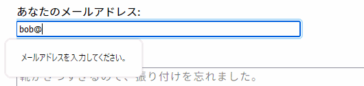

{{HTMLRef("Input_types")}}

{{HTMLElement("input")}} 要素の **`email`** 型は、ユーザーに一つのメールアドレス、または、 [`multiple`](/ja/docs/Web/HTML/Attributes/multiple) 属性が設定されていた場合は、メールアドレスのリストを入力および編集させるために使用します。

{{EmbedInteractiveExample("pages/tabbed/input-email.html", "tabbed-shorter")}}

入力値はフォームの送信前に自動的に検証され、空欄または正しい形式のメールアドレス (またはメールアドレスのリスト) のどちらかであることが確認されます。 CSS の {{cssxref(":valid")}} および {{cssxref(":invalid")}} 擬似クラスが自動的に適用され、フィールド上の現在の値が妥当なメールアドレスであるかどうかを視覚的に示します。

`email` 型に対応していないブラウザーでは、 `email` 入力欄は標準の {{HTMLElement("input/text", "text")}} 入力欄で代替されます。

<table class="properties">
  <tbody>
    <tr>
      <td><strong>{{anch("値")}}</strong></td>
      <td>
        メールアドレスを表す {{domxref("DOMString")}}、または空欄
      </td>
    </tr>
    <tr>
      <td><strong>イベント</strong></td>
      <td>
        {{domxref("HTMLElement/change_event", "change")}} および
        {{domxref("HTMLElement/input_event", "input")}}
      </td>
    </tr>
    <tr>
      <td><strong>対応している共通属性</strong></td>
      <td>
        {{htmlattrxref("autocomplete", "input")}},
        {{htmlattrxref("list", "input")}},
        {{htmlattrxref("maxlength", "input")}},
        {{htmlattrxref("minlength", "input")}},
        {{htmlattrxref("multiple", "input")}},
        {{htmlattrxref("name", "input")}},{{htmlattrxref("pattern", "input")}},
        {{htmlattrxref("placeholder", "input")}},
        {{htmlattrxref("readonly", "input")}},
        {{htmlattrxref("required", "input")}},
        {{htmlattrxref("size", "input")}},
        {{htmlattrxref("type", "input")}}
      </td>
    </tr>
    <tr>
      <td><strong>IDL 属性</strong></td>
      <td><code>list</code> および <code>value</code></td>
    </tr>
    <tr>
      <td><strong>メソッド</strong></td>
      <td>
        {{domxref("HTMLInputElement.select", "select()")}}
      </td>
    </tr>
  </tbody>
</table>

## 値

{{HTMLElement("input")}} 要素の {{htmlattrxref("value", "input")}} 属性には {{domxref("DOMString")}} が入り、メールアドレスの構文に合うかどうかが自動的に検証されます。具体的には、検証に通ることができる値の書式には3種類があります。

1. 空文字列 ("")。ユーザーが値を入力しないか、または値が削除されたことを表します。
2. 単一の正しい形式のメールアドレス。メールアドレスが実在する必要はありませんが、少なくとも正しい書式です。簡単に言えば、 `username@domain` または `username@domain.tld` の形です。もちろんそれ以上のものもあります。{{anch("検証")}}の節で、メールアドレスの検証アルゴリズムで一致する{{Glossary("regular expression", "正規表現")}}について参照してください。
3. {{htmlattrxref("multiple", "input")}} 属性が指定されたとき（のみ）、値はカンマ区切りで複数の正しい形式のメールアドレスを入れることができます。それぞれのメールアドレスの前後にある空白は除去されます。

{{anch("検証")}}の節で、どのようなメールアドレスが正しい形式であると検証されるかの詳細を参照してください。

## 追加の属性

型に関係なくすべての {{HTMLElement("input")}} 要素を操作する属性に加え、 `email` 型の入力欄は次の属性にも対応しています。

### list

list 属性の値は、同じ文書内にある {{HTMLElement("datalist")}} 要素の {{domxref("Element.id", "id")}} です。 {{HTMLElement("datalist")}} は、この入力欄でユーザーに提案するための事前定義された値のリストを提供します。リストの中の値のうち {{htmlattrxref("type", "input")}} と互換性のないものは、提案されるオプションには含まれません。提供される値は提案であり、要件ではありません。ユーザーはこの定義済みリストから選択することも、異なる値を提供することもできます。

### maxlength

ユーザーが `email` 入力欄に入力することができる (UTF-16 コード単位での) 最大文字数です。 0 以上の整数値である必要があります。 `maxlength` が指定されていないか、無効な値が指定されていると、 `email` 入力欄には最大文字数が設定されません。この値は `minlength` の値以上である必要もあります。

フィールドのメールアドレスの長さが UTF-16 コード単位で `maxlength` の長さを超えていると、その入力欄は[制約検証](/ja/docs/Web/Guide/HTML/Constraint_validation)に失敗します。制約検証はユーザーが値を変更した場合にのみ適用されます。

### minlength

ユーザーが `email` 入力欄に入力することができる (UTF-16 コード単位での) 最小文字数です。これは非負の整数値で、 `maxlength` で指定された値以下である必要があります。 `minlength` が指定されていないか、無効な値が指定されていると、 `email` 入力欄には最小文字数が設定されません。

入力欄のメールアドレスの長さが UTF-16 コード単位で `minlength` の長さよりも短いと、その入力欄は[制約検証](/ja/docs/Web/Guide/HTML/Constraint_validation)に失敗します。制約検証はユーザーが値を変更した場合にのみ適用されます。

### multiple

論理属性で、存在する場合、ユーザーが複数のメールアドレスを、カンマと任意のホワイトスペースで区切ったリストを入力できることを示します。詳しくは{{anch("複数のメールアドレスの許可")}}または [HTML 属性: multiple](/ja/docs/Web/HTML/Attributes/multiple) を参照してください。

> **Note:** 通常、 {{htmlattrxref("required", "input")}} 属性を指定すると、ユーザーは入力欄に妥当なメールアドレスを入力しなければなりません。しかし、 `multiple` 属性を追加すると、ゼロ個のメールアドレス (空文字列、またはホワイトスペースのみの文字列) が妥当な値になります。言い換えれば、 `multiple` が指定されていると、 `required` の値に関係なく、ユーザーはメールアドレスを一つも入力する必要がありません。

### pattern

`pattern` 属性は、指定する場合は正規表現であり、入力欄の {{htmlattrxref("value")}} が[制約検証](/ja/docs/Web/Guide/HTML/Constraint_validation)に合格するためにはこれと一致しなければなりません。これは {{jsxref("RegExp")}} 型で使用される JavaScript の妥当な正規表現である必要があり、これは[正規表現のガイド](/ja/docs/Web/JavaScript/Guide/Regular_Expressions)で記述されています。正規表現がコンパイルされるときに `'u'` フラグが指定されるので、パターンは ASCII ではなく Unicode コードポイントの並びとして扱われます。パターンのテキストをスラッシュで囲んではいけません。

指定されたパターンがないかか無効である場合は、正規表現は適用されず、この属性は完全に無視されます。

> **Note:** {{htmlattrxref("title", "input")}} 属性を使用してテキストを指定すると、多くのブラウザーでパターンに一致する要件が何であるかを説明するツールチップを表示することができます。近くに他の説明テキストを配置する必要があります。

詳細と例については{{anch("Pattern validation", "パターン検証")}}の節を参照してください。

### placeholder

`placeholder` 属性は文字列で、その欄にどのような種類の情報が求められるかについてのユーザーに対する短いヒントを提供します。これは求められるデータの種類を紹介する一語または短い句であり、説明的なメッセージではありません。テキストには改行を含めることは<em>できません</em>。

コントロールの内容がある書字方向 ({{Glossary("LTR")}} または {{Glossary("RTL")}}) であるものの、プレイスホルダーを逆の方向に表示する必要がある場合、 Unicode 双方向アルゴリズム書式文字を使用してプレイスホルダーの中で書字方向を上書きすることができます。詳しくは、[双方向テキストでの Unicode コードの使い方（英語）](https://www.w3.org/International/questions/qa-bidi-unicode-controls)を参照してください。

> **Note:** 可能であれば `placeholder` を使用することは避けてください。フォームを説明する他の方法ほど意味論的に有益ではなく、コンテンツに予期しない技術的な問題を引き起こす可能性があります。詳しくは、[\<input>: 入力欄 (フォーム入力) 要素](/ja/docs/Web/HTML/Element/input)の[プレイスホルダーはアクセシブルではない](/ja/docs/Web/HTML/Element/input#プレイスホルダーはアクセシブルではない)を参照してください。

### readonly

論理属性で、存在すれば、ユーザーが編集することができないことを表します。しかし、 `value` は、 JavaScript コードから直接 {{domxref("HTMLInputElement")}} の `value` プロパティを設定することで変更することができます。

> **Note:** 読み取り専用フィールドは値を持てないため、 `required` は `readonly` 属性も指定されている入力欄には効果がありません。

### size

`size` 属性は数値であり、入力欄の幅を何文字分とするかを示します。値はゼロより大きな数値である必要があり、既定値は 20 です。文字の幅は様々であるため、これは正確ではない可能性もあり、依存することはできません。結果の入力欄は文字数やフォント（使用中の {{cssxref("font")}} 設定）によって、指定された文字数より狭くなったり広くなったりすることがあります。

これはユーザーがフィールドに入力することができる文字数の制限を設定するものではありません。これは一度に見える文字数をおよそ指定するだけです。入力データの長さの上限を設定するには、 `{{anch("maxlength")}}` 属性を使用してください。

## email 入力欄の使用

メールアドレスはウェブで最も頻繁に入力される文字列データです。ウェブサイトにログインするときに使われたり、情報をリクエストしたり、注文の確認をできるようにしたり、ウェブメールでつかったりなどです。そのような場合、 `email` 入力型は、ユーザーインターフェイスやメールアドレスの処理の構築作業を簡略化することができるので、ウェブ開発者の仕事をはるかに楽にすることができます。メールアドレスの入力欄を、 `type` の値を正しく `email` にして作成すれば、入力された文字列が少なくとも合法のメールアドレスである可能性がある但し書式であることを自動的に検証してくれます。これにより、ユーザーがアドレスを打ち間違えたり、無効なアドレスを入力したりすることを防ぐのに役立ちます。

しかし、指定された文字列が、実際に存在するメールアドレスであるかどうか、サイトのユーザーに一致するか、他の方法で利用できるかを保証するには不十分です。単に入力欄の値がメールアドレスの形式に沿っているかを保証するだけです。

> **Note:** ユーザーが HTML をその場面の裏でいじることができることを意識しておくことは極めて重要です。ですから、安全を目的として、サイトでクライアント側の値検証機能のみを使用しては*いけません*。何らかのセキュリティ上の問題を含む可能性がある値が提供されるトランザクションの場合は、いずれもサーバー側で値検証を行う*必要があります*。

### 単純な email 型の入力欄

現在、この要素を実装しているすべてのブラウザーが、これを基本的な検証機能がついた標準のテキスト入力欄として実装しています。しかし、仕様書ではブラウザーに自由度を許容しています。例えば、この要素はユーザーの端末に内蔵されたアドレス帳と統合され、メールアドレスをリストから選ぶことができるようにすることも可能です。多くの基本的なフォームでは、 `email` 入力欄は次のように実装されています。

```html
<input id="emailAddress" type="email">
```

{{ EmbedLiveSample('A_simple_email_input', 600, 40) }}

なお、妥当と判断されるのは空欄の場合と、単一の妥当な書式のメールアドレスが入力されている場合で、それ以外は妥当であるとは判断されません。 {{htmlattrxref("required", "input")}} 属性を追加することで、妥当な書式のメールアドレスのみが許容されるようになり、空欄の場合は妥当であるとは判断されなくなります。

### 複数のメールアドレスの許可

[`multiple`](/ja/docs/Web/HTML/Attributes/multiple) 論理属性を追加することで、入力欄に複数のメールアドレスを受け付けるよう構成することができます。

```html
<input id="emailAddress" type="email" multiple>
```

{{ EmbedLiveSample('Allowing_multiple_e-mail_addresses', 600, 40) }}

入力欄は単一のメールアドレスが入力された時や、任意の数のメールアドレスをカンマ区切りで入力した場合、その中にホワイトスペース文字がある場合も有効として扱われるようになります。

> **Note:** `multiple` が使用されると、値を空欄にすることが許可されます。

`multiple` が指定された場合に有効な文字列の例をいくつか示します。

- `""`
- `"me@example"`
- `"me@example.org"`
- `"me@example.org,you@example.org"`
- `"me@example.org, you@example.org"`
- `"me@example.org,you@example.org, us@example.org"`

無効な文字列の例をいくつか示します。

- `","`
- `"me"`
- `"me@example.org you@example.org"`

### プレイスホルダー

フォームがどのような入力データを取るのかについての行内のヒントを提供すると、有益なことがあります。これはページのデザインでそれぞれの {{HTMLElement("input")}} に説明のラベルを付けることができない場合に特に重要になります。ここで**プレイスホルダー**が登場します。プレイスホルダーは、入力される `value` が取るべき値の形式を、有効な値の例を示すことで表現する値であり、 `value` が "" の時に入力欄の中に表示されます。入力欄にデータが入力されると、プレイスホルダーは非表示になり、入力欄が空欄になると、プレイスホルダーは再度表示されます。

ここで、 `email` 入力欄に `sophie@example.com` というプレイスホルダーを設定します。なお、入力欄の中身を操作すると、プレイスホルダーが非表示になったり再表示されたりします。

```html
<input type="email" placeholder="sophie@example.com">
```

{{ EmbedLiveSample('Placeholders', 600, 40) }}

### 入力欄の寸法の制御

入力ボックスの物理的な長さだけでなく、入力された文字列自身の許容される最小長および最大長も制御することができます。

#### 物理的な入力欄の寸法

入力ボックスの物理的な寸法は、入力ボックスの {{htmlattrxref("size", "input")}} 属性を使用して制御することができます。これにより、入力ボックスが同時に表示することができる文字数を指定することができます。この例では `email` 入力ボックスは 15 文字分の幅になります。

```html
<input type="email" size="15">
```

{{ EmbedLiveSample('Physical_input_element_size', 600, 40) }}

#### 要素の値の長さ

`size` は入力されたメールアドレスの長さ制限からは独立しており、フィールドを小さい空間に収めることができますが、より長いメールアドレス文字列が入力できます。入力されたメールアドレスの最小文字数は {{htmlattrxref("minlength", "input")}} 属性を使用して、同様に入力されたメールアドレスの最大文字数は {{htmlattrxref("maxlength", "input")}} を使用して設定することができます。

以下の例は 32 文字の幅で、内容は 3 文字より短くなったり、64文字より長くなったりしないようにする必要があるメールアドレス入力ボックスを生成します。

```html
<input type="email" size="32" minlength="3" maxlength="64">
```

{{EmbedLiveSample("Element_value_length", 600, 40) }}

### 既定のオプションの提供

#### 単一の既定値を value 属性を使用して提供

これまでどおり、 {{htmlattrxref("value", "input")}} 属性を設定することで `email` 入力欄に既定値を指定することができます。

```html
<input type="email" value="default@example.com">
```

{{EmbedLiveSample("Providing_a_single_default_using_the_value_attribute", 600, 40)}}

#### 提案値の提供

さらに、{{htmlattrxref("list", "input")}} 属性を指定することにより、既定の選択肢のリストを提供し、そこからユーザーが選択できるようにすることができます。これは、ユーザーがこれらの選択肢しか選べないようにするものではありませんが、よく使われるメールアドレスをより迅速に選択できるようになります。これは {{htmlattrxref("autocomplete", "input")}} へのヒントも提供します。 `list` 属性は {{HTMLElement("datalist")}} の ID を指定しており、これが 1 つの提案値あたり 1 つの {{HTMLElement("option")}} 要素を含んでいます。それぞれの `option` の `value` は、 email 入力ボックスに対する対応する提案値です。

```html
<input type="email" size="40" list="defaultEmails">

<datalist id="defaultEmails">
  <option value="jbond007@mi6.defence.gov.uk">
  <option value="jbourne@unknown.net">
  <option value="nfury@shield.org">
  <option value="tony@starkindustries.com">
  <option value="hulk@grrrrrrrr.arg">
</datalist>
```

{{EmbedLiveSample("Offering_suggested_values", 600, 40)}}

{{HTMLElement("datalist")}} 要素とその {{HTMLElement("option")}} が配置されると、ブラウザーはメールアドレスの候補として指定された値を提供します。これは通常、候補を含むポップアップまたはドロップダウン・メニューとして表示されます。具体的な使い勝手はブラウザーによって異なるかもしれませんが、通常、編集ボックスをクリックすると、メールアドレスの候補がドロップダウンで表示されます。その後、ユーザーが文字を入力すると、リストがフィルタリングされ、一致する値のみが表示されます。ユーザーが選択するか、独自の値を入力するまで、文字が入力されるごとにリストが絞り込まれます。

## 検証

`email` 入力欄で利用できる内容の検証には 2 つのレベルがあります。まず、すべての {{HTMLElement("input")}} で提供される標準的なレベルの検証があります。これは、入力内容が有効なメールアドレスであるための要件を満たしているかどうかを自動的に確認するものです。しかし、もし特別なニーズがあるなら、それを満たすために追加のフィルタリングを追加するオプションもあります。

> **Warning:** HTML のフォーム検証は、入力されたデータが正しい形式であることを保証するスクリプトの代用には*なりません*。 HTML を調整して検証をくぐり抜けたり、完全に削除したりすることはとても簡単にできます。 HTML を完全にバイパスし、サーバーに直接データを送信することも可能です。サーバー側のコードが受信したデータの検証に失敗した場合、不適切な形式のデータ（または大きすぎるデータ、間違った種類のデータなど）がデータベースに入力された場合に災害が発生するおそれがあります。

### 基本的な検証

`email` 入力型に対応しているブラウザーは、自動的に検証を行い、インターネットのメールアドレスの標準の書式に一致するテキストのみが入力ボックスに入力されることを保証します。この仕様を実装しているブラウザーは、以下の正規表現に相当するアルゴリズムを使っているはずです。

```js
/^[a-zA-Z0-9.!#$%&'*+\/=?^_`{|}~-]+@[a-zA-Z0-9](?:[a-zA-Z0-9-]{0,61}
[a-zA-Z0-9])?(?:\.[a-zA-Z0-9](?:[a-zA-Z0-9-]{0,61}[a-zA-Z0-9])?)*$/
```

フォーム検証の仕組みと、 {{cssxref(":valid")}} や {{cssxref(":invalid")}} 擬似クラスを使用して、現在の値が有効かどうかに基づいて入力欄のスタイルを設定する方法については、[フォームデータの検証] (/ja/docs/Learn/Forms/Form_validation)を参照してください。

> **Note:** 国際ドメイン名と HTML でのメールアドレスの検証については、仕様上の問題があることが知られています。詳しくは [W3C bug 15489](https://www.w3.org/Bugs/Public/show_bug.cgi?id=15489) を参照してください。

### パターンによる検証

入力されたメールアドレスを「メールアドレスのように見える任意の文字列」以上に制限する必要がある場合、 {{htmlattrxref("pattern", "input")}} 属性を使って、値が一致しなければ有効としない{{Glossary("regular expression", "正規表現")}}を指定することが可能です。 {{htmlattrxref("multiple", "input")}} 属性が指定されていた場合、カンマで区切られた値のリストの個々の項目がその{{Glossary("regular expression", "正規表現")}}に一致しなければなりません。

例えば、 Best Startup Ever 社の従業員が IT 部門に問い合わせるためのページを作るとします。簡単なフォームで、ユーザーが自分のメールアドレスと、助けを必要とする問題を説明するメッセージを入力する必要があります。ユーザーの入力したメールアドレスが有効なものであるばかりでなく、セキュリティ上の理由から、そのアドレスが会社の内部メールアドレスであることを確認する必要があります。

`email` の入力欄は、標準的なメールアドレスの検証に*加え*、指定された {{htmlattrxref("pattern", "input")}} も検証しますので、これは簡単に実装できます。以下の例を参照してください。

```css hidden
body {
  font: 16px sans-serif;
}

.emailBox {
  padding-bottom: 20px;
}

.messageBox {
  padding-bottom: 20px;
}

label {
  line-height: 22px;
}

label::after {
  content: ":";
}
```

```html
<form>
 <div class="emailBox">
   <label for="emailAddress">あなたのメールアドレス</label><br>
   <input id="emailAddress" type="email" size="64" maxLength="64" required
          placeholder="username@beststartupever.com" pattern=".+@beststartupever\.com"
          title="Best Startup Ever 社のメールアドレスのみを入力してください">
 </div>

 <div class="messageBox">
   <label for="message">要望</label><br>
   <textarea id="message" cols="80" rows="8" required
             placeholder="靴がきつすぎるので、振り付けを忘れました。"></textarea>
 </div>
  <input type="submit" value="要望を送信">
</form>
```

{{EmbedLiveSample("Pattern_validation", 700, 300)}}

このフォーム ({{HTMLElement("form")}}) には、ユーザーのメールアドレスを入力する `email` 型の {{HTMLElement("input")}} が 1 つあり、 IT 部門へのメッセージを入力する {{HTMLElement("textarea")}}、そしてフォームの送信ボタンを生成する [`"submit"`](/ja/docs/Web/HTML/Element/input/submit) 型の `<input>` があります。それぞれのテキスト入力ボックスには、ユーザーに入力すべきことを伝える {{HTMLElement("label")}} があります。

メールアドレスの入力欄について詳しく見ていきましょう。 {{htmlattrxref("size", "input")}} および {{htmlattrxref("maxlength", "input")}} 属性は共に 64 に設定されており、64 文字分の電子メールアドレスのスペースを表示して、かつ実際に入力する文字数を最大 64 文字に制限しています。また、{{htmlattrxref("required", "input")}} 属性を指定して、有効なメールアドレスの入力を必須としています。

適切な {{htmlattrxref("placeholder", "input")}} が `username@beststartupever.com` と設定されており、どのような入力が有効であるかを示しています。この文字列は、メールアドレスが入力されるべきであり、それが会社の beststartupever.com のアカウントであるべきであることを示唆しています。これは、 `email` 型を使用すると、テキストがメールアドレスのような書式にすることに対する付加事項です。入力ボックスのテキストがメールアドレスでない場合、次のようなエラーメッセージが表示されます。



このままでは、少なくとも正当な電子メールアドレスを検証していることになります。しかし、もう一歩踏み込んで、メールアドレスが実際に "_username_@beststartupever.com" という形式であることを確認したいのです。そこで {{htmlattrxref("pattern", "input")}} を使用することにします。ここでは、 `pattern` を `.+@beststartupever.com` に設定しました。この正規表現は単純ですが、少なくとも 1 つの任意の文字、そして "@" の後にドメイン名  "beststartupever.com" が続く文字列を要求します。

これは、有効な電子メールアドレスの適切なフィルタリングにはほど遠いことに注意してください。 " @beststartupever.com" （先頭のスペースに注意）や "@@beststartupever.com" のような有効ではない表現も許可してしまいます。しかし、ブラウザーは指定されたテキストに対して、標準のメールアドレスフィルターとカスタムパターンの両方を実行します。その結果、「これが有効な電子メールアドレスに似ていることを確認し、もしそうなら、それが beststartupever.com のアドレスであることも確認する」という検証を行うことになります。

{{htmlattrxref("title")}} 属性を `pattern` と併用することをお勧めします。その場合、 `title` でパターンを説明する必要があります。つまり、他の情報ではなく、データがどのような形式を取るべきかを説明してください。これは、 `title` が検証エラーメッセージの一部として表示されたり、読み上げられたりする可能性があるからです。例えば、ブラウザーが「入力された値がフィールドに指定された書式と異なります。」というメッセージの後に、あなたが指定した `title` を表示するかもしれません。もし `title` が "メールアドレス" のようなものであれば、結果は「入力された値がフィールドに指定された書式と異なります。メールアドレス」というメッセージになり、あまり良いものではなくなります。

そのため、「Best Startup Ever 社のメールアドレスのみを入力してください」という文字列を指定しています。こうすることで、エラーメッセージ全体が「入力された値がフィールドに指定された書式と異なります。Best Startup Ever 社のメールアドレスのみを入力してください。」のようになります。


> **Note:** もし、検証用の正規表現を書いていて、うまく動作しない場合は、ブラウザーのコンソールを確認してください。問題を解決するための有用なエラーメッセージが表示されているかもしれません。

## 例

ここでは、 ID が `emailAddress` のメール入力があり、最大 256 文字までの長さが許可されています。入力ボックス自体は物理的に 64 文字の幅があり、フィールドが空のときは常にプレースホルダーとして `user@example.gov` というテキストが表示されます。さらに、 [`multiple`](/ja/docs/Web/HTML/Attributes/multiple) 属性を使用すると、{{anch("複数のメールアドレスの許可")}}で説明したように、ユーザーがカンマで区切ってゼロ個以上の電子メールアドレスを入力できるようにボックスを構成しています。最後の仕上げとして、 [`list`](/ja/docs/Web/HTML/Attributes/list) 属性は、 {{HTMLElement("datalist")}} その {{HTMLElement("option")}} が、ユーザーが選択できる値の候補を指定する {{HTMLElement("datalist")}} の ID を含んでいます。

それに加えて、 {{HTMLElement("label")}} 要素を使用してメールアドレスの入力ボックスのラベルを作成し、 {{htmlattrxref("for", "label")}} 属性で `emailAddress` という {{HTMLElement("input")}} 要素の ID を参照するようになっています。このように 2 つの要素を関連付けることで、ラベルをクリックすると input 要素にフォーカスが当たります。

```html
<label for="emailAddress">メールアドレス</label><br/>
<input id="emailAddress" type="email" placeholder="user@example.gov"
       list="defaultEmails" size="64" maxlength="256" multiple>

<datalist id="defaultEmails">
  <option value="jbond007@mi6.defence.gov.uk">
  <option value="jbourne@unknown.net">
  <option value="nfury@shield.org">
  <option value="tony@starkindustries.com">
  <option value="hulk@grrrrrrrr.arg">
</datalist>
```

{{EmbedLiveSample('Examples', 600, 80)}}

## 仕様書

{{Specifications}}

## ブラウザーの互換性

{{Compat}}

## 関連情報

- [HTML フォームガイド](/ja/docs/Learn/Forms)
- {{HTMLElement("input")}}
- [`<input type="tel">`](/ja/docs/Web/HTML/Element/input/tel)
- [`<input type="url">`](/ja/docs/Web/HTML/Element/input/url)
- 属性:

  - [`list`](/ja/docs/Web/HTML/Attributes/list)
  - [`minlength`](/ja/docs/Web/HTML/Attributes/minlength)
  - [`maxlength`](/ja/docs/Web/HTML/Attributes/maxlength)
  - [`multiple`](/ja/docs/Web/HTML/Attributes/multiple)
  - [`pattern`](/ja/docs/Web/HTML/Attributes/pattern)
  - [`placeholder`](/ja/docs/Web/HTML/Attributes/placeholder)
  - [`readonly`](/ja/docs/Web/HTML/Attributes/readonly)
  - [`size`](/ja/docs/Web/HTML/Attributes/size)

- [CSS プロパティの互換性](/ja/docs/Learn/Forms/Property_compatibility_table_for_form_controls)
