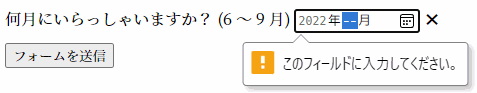

{{HTMLRef("Input_types")}}

{{HTMLElement("input")}} 要素の **`month`** 型は、ユーザーが年と月を入力できるようにする入力フィールドを作成し、年と月を簡単に入力できるようにします。
値は "`YYYY-MM`" の形式の文字列で、 `YYYY` は 4 桁の年、 `MM` は月の番号です。

{{EmbedInteractiveExample("pages/tabbed/input-month.html", "tabbed-shorter")}}

コントロールのユーザーインターフェイスは、一般にブラウザーによって異なります。現時点では対応が不安定であり、デスクトップ版の Chrome/Opera と Edge — および最新のバージョンのモバイルブラウザー — のみに利用可能な実装があります。
`month` 入力欄に対応していないブラウザーでは、コントロールは単純な [`<input type="text">`](/ja/docs/Web/HTML/Element/input/text) に格下げされますが、入力されたテキストが期待されている形式であることを保証するための自動検証が行われることもあります。

`month` に対応していないブラウザーを使用している場合のために、このスクリーンショットで Chrome と Opera でどのように見えるかを示します。
右端にある下向き矢印をクリックすると、年と月を選択できる日付選択が表示されます。


Microsoft Edge では、 `month` コントロールはこのように表示されます。


<table class="properties">
  <tbody>
    <tr>
      <td><strong>{{anch("値")}}</strong></td>
      <td>
        年と月を表す {{domxref("DOMString")}}、または空欄
      </td>
    </tr>
    <tr>
      <td><strong>イベント</strong></td>
      <td>
        {{domxref("HTMLElement/change_event", "change")}} および
        {{domxref("HTMLElement/input_event", "input")}}
      </td>
    </tr>
    <tr>
      <td><strong>対応している共通属性</strong></td>
      <td>
        {{htmlattrxref("autocomplete", "input")}},
        {{htmlattrxref("list", "input")}},
        {{htmlattrxref("readonly", "input")}},
        {{htmlattrxref("step", "input")}}
      </td>
    </tr>
    <tr>
      <td><strong>IDL 属性</strong></td>
      <td><code>value</code></td>
    </tr>
    <tr>
      <td><strong>メソッド</strong></td>
      <td>
        {{domxref("HTMLInputElement.select", "select()")}},
        {{domxref("HTMLInputElement.stepDown", "stepDown()")}},
        {{domxref("HTMLInputElement.stepUp", "stepUp()")}}
      </td>
    </tr>
  </tbody>
</table>

## 値

{{domxref("DOMString")}} で、入力欄に入力された年と月の値を YYYY-MM (4 桁以上の年に続いてハイフン ("`-`")、続いて 2 桁の月) の形式で表します。
この入力型で使用される時刻の値の形式について詳しくは、 [HTML で使われる日付や時刻の形式](/ja/docs/Web/HTML/Date_and_time_formats)の[月の文字列](/ja/docs/Web/HTML/Date_and_time_formats#month_string)をご覧ください。

### 既定値の設定

入力コントロールの既定値は、次のように {{htmlattrxref("value", "input")}} 属性に年と月を入れることで設定することができます。

```html
<label for="bday-month">生まれた月は？</label>
<input id="bday-month" type="month" name="bday-month" value="2001-06">
```

{{EmbedLiveSample('Setting_a_default_value', 600, 60)}}

一点気を付けなければならないことは、表示される日付の書式は実際の `value` とは異なるということです。多くの{{Glossary("user agent", "ユーザーエージェント")}}は、年と月をユーザーのオペレーティングシステムに設定されたロケールに適した形式で表示しますが、日付の `value` は常に `yyyy-MM` の書式です。

上記の値がサーバーへ送信された場合は、例えば、 `bday-month=1978-06` のようになります。

### JavaScript を使用した値の設定

次のように、 JavaScript で {{domxref("HTMLInputElement.value")}} プロパティを使用して、日付の値を取得したり設定したりすることもできます。

```html
<label for="bday-month">生まれた月は？</label>
<input id="bday-month" type="month" name="bday-month">
```

```js
var monthControl = document.querySelector('input[type="month"]');
monthControl.value = '2001-06';
```

{{EmbedLiveSample("Setting_the_value_using_JavaScript", 600, 60)}}

## 追加の属性

すべての {{HTMLElement("input")}} 型で共通する属性に加え、 `month` 型の入力欄は次の属性にも対応しています。

### list

list 属性の値は、同じ文書内にある {{HTMLElement("datalist")}} 要素の {{domxref("Element.id", "id")}} です。
{{HTMLElement("datalist")}} は、この入力欄でユーザーに提案するための事前定義された値のリストを提供します。
リストの中の値のうち、この {{htmlattrxref("type", "input")}} と互換性のないものは、提案されるオプションには含まれません。
提供される値は提案であり、要件ではありません。ユーザーはこの定義済みリストから選択することも、異なる値を提供することもできます。

### max

最新の年月で、上記の{{anch("値")}}で説明した文字列の書式です。
要素に入力された {{htmlattrxref("value", "input")}} がこの日付よりも後の場合、要素は[制約検証](/ja/docs/Web/Guide/HTML/Constraint_validation)に失敗します。
`max` 属性の値が "`yyyy-MM`" の書式に従う妥当な文字列でない場合、要素は最大値を持ちません。

この値は `min` 属性で指定されたものより後か、同じ年月を指定する必要があります。

### min

受け付ける最古の年月で、前述と同じ `yyyy-MM` の書式です。
要素の {{htmlattrxref("value", "input")}} がこれより前の場合、要素は[制約検証](/ja/docs/Web/Guide/HTML/Constraint_validation)に失敗します。
`min` 属性の値が "`yyyy-MM-dd`" の書式に従う妥当な文字列でない場合、要素は最小値を持ちません。

この値は `max` 属性で指定されたものより前か、同じ年月を指定する必要があります。

### readonly

論理属性で、存在すれば、ユーザーが編集することができないことを表します。
しかし、 `value` は、 JavaScript コードから直接 {{domxref("HTMLInputElement.value")}} プロパティを設定することで変更することができます。

> **Note:** 読み取り専用フィールドは値を持てないため、 `required` は `readonly` 属性も指定されている入力欄には効果がありません。

### step

`step` 属性は値が吸着する粒度を指定する数値、または後述する特殊な値 `any` です。
刻みの基準値に等しい値（指定されていれば `{{anch("min")}}`、そうでなければ {{htmlattrxref("value", "input")}}、どちらも設定されていなければ適切な既定値）のみが妥当となります。

文字列値の `any` は、刻みがなく、どの値でも許可されることを意味します（`{{anch("min")}}` や `{{anch("max")}}` など、他の制約には制限されます）。

> **Note:** ユーザーがデータを入力したときには刻みの設定には吸着せず、{{Glossary("user agent", "ユーザーエージェント")}}は直近の妥当な値、同じ距離の値の選択肢が 2 つあった場合は、正の方向の推奨値に丸められます。

`month` 入力欄では、 `step` の値は月数で指定され、倍率は 1 です (数値も月単位であるため)。
`step` の既定値は 1 ヶ月です。

## month 入力欄の使用

日付に関する入力欄は (`month` を含め) 一見すると便利に見えます。日付の選択に簡単なユーザーインターフェイスを提供し、サーバーに送信するデータの書式をユーザーのロケールに関係なく正規化してくれます。
しかし、現時点ではブラウザーの対応が限定されているため、 `<input type="month">` には問題があります。

`<input type="month">` の基本的な使い方と少し複雑な使い方を見てみてから、その後でブラウザーの互換性の問題を緩和するアドバイスを提供しましょう ({{anch("ブラウザーの互換性の扱い")}} を参照してください)。

### 月入力の基本的な使用

もっとも単純な `<input type="month">` の使用方法は、次のように基本的な {{HTMLElement("input")}} と {{htmlelement("label")}} 要素の組み合わせです。

```html
<form>
  <label for="bday-month">生まれた月を入力してください。</label>
  <input id="bday-month" type="month" name="bday-month">
</form>
```

{{EmbedLiveSample('Basic_uses_of_month', 600, 40)}}

### 日付の最大値と最小値の設定

{{htmlattrxref("min", "input")}} および {{htmlattrxref("max", "input")}} 属性を使用して、ユーザーが選択できる日付の範囲を制限することができます。
次の例では、日付の最小値を `1900-01` に、日付の最大値を `1999-12` に指定しています。

```html
<form>
  <label for="bday-month">生まれた月を入力してください。</label>
  <input id="bday-month" type="month" name="bday-month"
         min="1900-01" max="2013-12">
</form>
```

{{EmbedLiveSample('Setting_maximum_and_minimum_dates', 600, 40)}}

次のような結果になります。

- 1900 年 1 月から 1999 年 12 月までの間の月のみが選択できます。この範囲から外れた月は、コントロール内でスクロールできません。
- 使用しているブラウザーによりますが、指定された範囲外の月が月選択で選択できないか (Edge など)、無効になるものの ({{anch("検証")}} を参照) 選択できるか (Chrome など) だということが分かるでしょう。

### 入力欄の寸法の制御

`<input type="month">` は {{htmlattrxref("size", "input")}} のような寸法に関する属性には対応していません。
寸法を変更する必要がある場合は、 [CSS](/ja/docs/Web/CSS) を使用する必要があります。

## 検証

既定で、 `<input type="month">` は入力された値の検証を行いません。
ユーザーインターフェイスの実装は一般的に、日付でないものの入力をさせないからです。これは便利です。しかし、それでも `month` 入力欄を空のまま、または無効な日付 (例えば 4 月 32 日など) を入力してフォームを送信することが可能です。

これを防ぐために、 {{htmlattrxref("min", "input")}} と {{htmlattrxref("max", "input")}} を用いて利用可能な日を制限することができ ({{anch("日付の最大値と最小値の設定")}} を参照)、加えて {{htmlattrxref("required", "input")}} 属性を用いて、日付を入力することを必須にすることができます。
結果として、対応しているブラウザーは、範囲外の日付や空の日付フィールドを送信しようとするとエラーを表示します。

例を見てみましょう。ここで日付の最小値と最大値を設定し、入力欄を必須にしました。

```html
<form>
  <div>
    <label for="month">何月にいらっしゃいますか？ (6 ～ 9 月)</label>
    <input id="month" type="month" name="month"
           min="2022-06" max="2022-09" required>
    <span class="validity"></span>
  </div>
  <div>
      <input type="submit" value="フォームを送信">
  </div>
</form>
```

年と月を指定せずに (または設定した範囲を外れた日付を) 送信しようとすると、ブラウザーはエラーを表示します。
例を実行してみましょう。

{{ EmbedLiveSample('Validation', 600, 120) }}

対応しているブラウザーで入力しなかった場合のスクリーンショットです。



上記の例の CSS です。
CSS の {{cssxref(":valid")}} および {{cssxref(":invalid")}} プロパティを使用して、現在の値が有効かどうかに基づいてスタイルを設定しています。
アイコンは入力欄そのものではなく、入力欄の隣の {{htmlelement("span")}} に置くようにしないと、 Chrome ではコントロールの内側にコンテンツを生成するので、正しく整形したり表示したりすることができません。

```css
div {
  margin-bottom: 10px;
  position: relative;
}

input[type="number"] {
  width: 100px;
}

input + span {
  padding-right: 30px;
}

input:invalid+span:after {
  position: absolute;
  content: '✖';
  padding-left: 5px;
}

input:valid+span:after {
  position: absolute;
  content: '✓';
  padding-left: 5px;
}
```

> **Warning:** HTML のフォーム検証は、入力されたデータが正しい形式であることを保証するスクリプトの代用にはなりません。
> HTML を調整して検証をくぐり抜けたり、完全に削除したりすることはとても簡単にできます。
> HTML を完全にバイパスし、サーバーに直接データを送信することも可能です。
> サーバー側のコードが受信したデータの検証に失敗した場合、不適切な形式のデータ (または大きすぎるデータ、誤った種類のデータなど) が送信された場合に障害が発生するおそれがあります。

## ブラウザーの対応の扱い

前述のように、現時点で日付入力を書く上で一番の問題は、多くの主要なブラウザーがまだすべてを実装している訳ではないということです。デスクトップでは Chrome/Opera と Edge のみが対応しており、モバイルでは多くの最新のブラウザーが対応しています。
例えば、 `month` の選択画面は Android 版 Chrome ではこのように表示されます。


対応していないブラウザーでは、文字列入力欄に安全に格下げされますが、これはユーザーインターフェイスの一貫性 (表示されるコントロールが異なること) とデータの扱いの両方で問題を生みます。

2番目の問題はより深刻です。すでに述べたように、 `month` 入力欄では、実際の値が常に `yyyy-mm` の書式で正規化されます。
一方、既定の設定では、 `text` 入力欄ではどの書式で入力されるかの認識がなく、以下のように人間が日付を書く様々な方法で入力される可能性があります。

- `yyyy/mm` (2018/07)
- `yyyymm` (201807)
- `mmyyyy` (072022)
- `mm/yyyy` (07/2022)
- `mm-yyyy` (07-2022)
- `yyyy-mm` (2022-07)
- `Month yyyy` (July 2022)
- ... などなど。

これを回避する方法の一つは、 `month` 入力欄に {{htmlattrxref("pattern", "input")}} 属性を付けることです。
`month` 入力欄はこれを使用しないので、 `text` 入力欄などとして扱うようフォールバックされたときに、このパターンを使用します。
例えば、次の例を `month` 入力欄に未対応のブラウザーで見てみてください。

```html
<form>
  <div>
    <label for="month">何月にいらっしゃいますか？ (6 ～ 9 月)</label>
    <input id="month" type="month" name="month"
           min="2022-06" max="2022-09" required
           pattern="[0-9]{4}-[0-9]{2}">
    <span class="validity"></span>
  </div>
  <div>
      <input type="submit" value="フォームを送信">
  </div>
</form>
```

{{ EmbedLiveSample('Handling_browser_support', 600, 100) }}

`nnnn-nn` のパターン (`n` は数字の0から9) に一致しない文字列を入力して送信しようとすると、エラーメッセージが表示される (そして入力欄が無効として強調表示される) のが分かるでしょう。
もちろん、これでユーザーが無効な日付を入力したり (`0000-42` など)、パターンに合わない誤った書式の日付が入力されたりすることを止めることはできません。

また、ユーザーが数ある日付形式の中で期待されるものがどれであるかを知らない可能性もあります。
後はその分の作業が残っています。

```css hidden
div {
  margin-bottom: 10px;
  position: relative;
}

input[type="number"] {
  width: 100px;
}

input + span {
  padding-right: 30px;
}

input:invalid+span:after {
  position: absolute;
  content: '✖';
  padding-left: 5px;
}

input:valid+span:after {
  position: absolute;
  content: '✓';
  padding-left: 5px;
}
```

(すべての主要なブラウザーが対応するまでの間) ブラウザーに依存しない方法によってフォームで日付を扱う最善の方法は、ユーザーが年と月を別々なコントロール ({{htmlelement("select")}} 要素が一般的です。以下の実装を見てください) に入力するようにするか、 [jQuery date picker](https://jqueryui.com/datepicker/) のような JavaScript ライブラリを使用することです。

## 例

この例では、ユーザーが都市と月を選択できるよう設計されたユーザーインターフェイスの要素を2組作成します。
一つ目はネイティブの `month` 入力欄であり、もう一つは年と月を個別に選択することができる一組の {{HTMLElement("select")}} 要素で、まだ `<input type="month">` に対応していないブラウザーのためのものです。

### 結果
{{EmbedLiveSample('Examples', 600, 140)}}

### HTML

年と月を入力するフォームはこのようになります。

```html
<form>
  <div class="nativeDatePicker">
    <label for="month-visit">何月にいらっしゃいますか？</label>
    <input type="month" id="month-visit" name="month-visit">
    <span class="validity"></span>
  </div>
  <p class="fallbackLabel">何月にいらっしゃいますか？</p>
  <div class="fallbackDatePicker">
    <div>
      <span>
        <select id="year" name="year">
        </select>
        <label for="year">年</label>
      </span>
      <span>
        <select id="month" name="month">
          <option selected>1</option>
          <option>2</option>
          <option>3</option>
          <option>4</option>
          <option>5</option>
          <option>6</option>
          <option>7</option>
          <option>8</option>
          <option>9</option>
          <option>10</option>
          <option>11</option>
          <option>12</option>
        </select>
        <label for="month">月</label>
      </span>
    </div>
  </div>
</form>
```

`nativeDatePicker` の ID がついた {{HTMLElement("div")}} は、年と月をリクエストするために `month` 入力欄を用いるのに対し、 `fallbackDatePicker` の ID がついた `<div>` は代わりに一組の `<select>` 要素を使用します。一つ目は年を、二つ目は月を入力します。

月を選択する `<select>` は、変化しないので月をハードコーディングしています (ローカライズの問題が残っていますが)。年に利用できる値は、現在の年に応じて動的に生成されます (どのように動作するかについての詳細な説明は、以下のコードのコメントを参照してください)。

```css hidden
div {
  margin-bottom: 10px;
  position: relative;
}

input[type="number"] {
  width: 100px;
}

input + span {
  padding-right: 30px;
}

input:invalid+span:after {
  position: absolute;
  content: '✖';
  padding-left: 5px;
}

input:valid+span:after {
  position: absolute;
  content: '✓';
  padding-left: 5px;
}
```

### JavaScript

どちらの方法を使用するかを選択し、非ネイティブの年の `<select>` に年の一覧を設定する JavaScript コードは以下の通りです。

この例の面白いもう一つの部分は、機能の検出コードです。ブラウザーが `<input type="month">` に対応しているかどうかを検出するために、新たな {{htmlelement("input")}} 要素を生成し、その `type` を `month` に設定して、すぐに type に何が設定されたかをチェックします。対応していないブラウザーでは、 `month` が フォールバックされて `text` が返されます。 `<input type="month">` に対応していない場合は、ネイティブの日付選択を非表示にしてフォールバック用の選択ユーザーインターフェイスを表示します。

```js
// define variables
var nativePicker = document.querySelector('.nativeDatePicker');
var fallbackPicker = document.querySelector('.fallbackDatePicker');
var fallbackLabel = document.querySelector('.fallbackLabel');

var yearSelect = document.querySelector('#year');
var monthSelect = document.querySelector('#month');

// hide fallback initially
fallbackPicker.style.display = 'none';
fallbackLabel.style.display = 'none';

// test whether a new date input falls back to a text input or not
var test = document.createElement('input');

try {
  test.type = 'month';
} catch (e) {
  console.log(e.description);
}

// if it does, run the code inside the if() {} block
if(test.type === 'text') {
  // hide the native picker and show the fallback
  nativePicker.style.display = 'none';
  fallbackPicker.style.display = 'block';
  fallbackLabel.style.display = 'block';

  // populate the years dynamically
  // (the months are always the same, therefore hardcoded)
  populateYears();
}

function populateYears() {
  // get the current year as a number
  var date = new Date();
  var year = date.getFullYear();

  // Make this year, and the 100 years before it available in the year <select>
  for(var i = 0; i <= 100; i++) {
    var option = document.createElement('option');
    option.textContent = year-i;
    yearSelect.appendChild(option);
  }
}
```

> **Note:** 53 週ある年もあることを忘れないでください（[年あたりの週数](https://en.wikipedia.org/wiki/ISO_week_date#Weeks_per_year)を参照）。商品のアプリを開発するときはこれを念頭に置いておく必要があります。

## 仕様書

{{Specifications}}

## ブラウザーの互換性

{{Compat}}

## 関連情報

- 全般的な {{HTMLElement("input")}} およびその操作に使用する{{domxref("HTMLInputElement")}} インターフェイス
- [HTML で使用される日付と時刻の書式](/ja/docs/Web/HTML/Date_and_time_formats)
- [日付と時刻の選択のチュートリアル](/ja/docs/Learn/Forms/Basic_native_form_controls#date_and_time_picker)
- [`<input type="datetime-local">`](/ja/docs/Web/HTML/Element/input/datetime-local), [`<input type="date">`](/ja/docs/Web/HTML/Element/input/date), [`<input type="time">`](/ja/docs/Web/HTML/Element/input/time), [`<input type="week">`](/ja/docs/Web/HTML/Element/input/week)
- [CSS プロパティの互換性](/ja/docs/Learn/Forms/Property_compatibility_table_for_form_controls)
