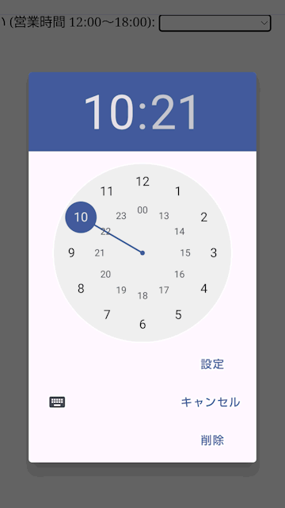

{{HTMLRef("Input_types")}}

{{htmlelement("input")}} 要素の **`time`** 型は、ユーザーが簡単に時刻 (時と分、任意で秒) を入力できるように設計された入力欄を生成します。

コントロールのユーザーインターフェイスは、ブラウザーによってまちまちです。最近のブラウザーは対応が進んでおり、 Safari は有名なブラウザーの中で唯一実装していません。対応していないブラウザーでは、このコントロールは単純な [`<input type="text">`](/ja/docs/Web/HTML/Element/input/text) に格下げされます。

{{EmbedInteractiveExample("pages/tabbed/input-time.html", "tabbed-standard")}}

## 外観

### Chrome と Opera

Chrome/Opera では、 `time` コントロールはシンプルで、時と分をオペレーティングシステムのロケールに従って 12 時制または 24 時制で入力するスロットと、現在選択中の部分を増減するための上下の矢印から成ります。コントロールの値を消去する "X" ボタンが提供されています。

 12 時制

 24 時制

### Firefox

Firefox の `time` コントロールは Chrome のものとよく似ていますが、上下の矢印がありません。これも時刻の入力には、システムのロケールに従って 12 時制または 24 時制の書式を使用します。コントロールの値を消去するための "X" ボタンがあります。

 12 時制

 24 時制

### Edge

Edge の `time` コントロールはいくらかもっと精巧で、時と分を選択するスライドリールが開きます。 Chrome のように、時刻の入力にはシステムのロケールに従って12時制または24時制を使用します。

 12 時制

 24 時制

<table class="properties">
  <tbody>
    <tr>
      <td><strong><a href="#値">値</a></strong></td>
      <td>時刻を表す {{domxref("DOMString")}}、または空欄。</td>
    </tr>
    <tr>
      <td><strong>イベント</strong></td>
      <td>
        {{domxref("HTMLElement/change_event", "change")}} および
        {{domxref("HTMLElement/input_event", "input")}}
      </td>
    </tr>
    <tr>
      <td><strong>対応する共通属性</strong></td>
      <td>
        {{htmlattrxref("autocomplete", "input")}},
        {{htmlattrxref("list", "input")}},
        {{htmlattrxref("readonly", "input")}},
        {{htmlattrxref("step", "input")}}
      </td>
    </tr>
    <tr>
      <td><strong>IDL 属性</strong></td>
      <td>
        <code>value</code>, <code>valueAsDate</code>,
        <code>valueAsNumber</code>, <code>list</code>.
      </td>
    </tr>
    <tr>
      <td><strong>メソッド</strong></td>
      <td>
        {{domxref("HTMLInputElement.select", "select()")}},
        {{domxref("HTMLInputElement.stepDown", "stepDown()")}},
        {{domxref("HTMLInputElement.stepUp", "stepUp()")}}.
      </td>
    </tr>
  </tbody>
</table>

## 値

入力欄に入力された時刻を表す文字列です。

### value 属性の設定

`<input>` 要素が作成されたときに、次のように {{htmlattrxref("value", "input")}} 属性に時刻を指定することで、既定値を設定することができます。

```html
<label for="appt-time">予約時刻を選んでください。</label>
<input id="appt-time" type="time" name="appt-time" value="13:30">
```

{{ EmbedLiveSample('Setting_the_value_attribute', 600, 60) }}

### JavaScript を使用した値の設定

次のように、 {{domxref("HTMLInputElement")}} の `value` プロパティを使って JavaScript の日時の値を取得したり設定したりすることができます。

```js
var timeControl = document.querySelector('input[type="time"]');
timeControl.value = '15:30';
```

### 時刻値の書式

`time` 入力欄の `value` は、常に先頭にゼロを含む 24 時制で `hh:mm` の書式であり、ユーザーのロケール（またはユーザーエージェント）に基づいて選択される入力書式とは関係ありません。時刻が秒を含む場合（[step 属性の使用](#step_属性の使用)を参照）は、書式は常に `hh:mm:ss` です。この入力型で使用される時刻の値の形式について詳しくは、 [HTML で使われる日付や時刻の形式](/ja/docs/Web/HTML/Date_and_time_formats)の[時刻の文字列](/ja/docs/Web/HTML/Date_and_time_formats#time_strings)をご覧ください。

この例では、時刻を入力すると time 入力欄の値が、どのように変化するかを見ることができます。

最初に、 HTML を見てください。これは以前見たラベルと入力欄だけで十分にシンプルですが、 {{HTMLElement("p")}} 要素と、 `time` 入力欄の値を表示する {{HTMLElement("span")}} があります。

```html
<form>
  <label for="startTime">開始時刻: </label>
  <input type="time" id="startTime">
  <p>
    <code>time</code> 入力欄の値: <code>
            "<span id="value">n/a</span>"</code>
  </p>
</form>
```

JavaScript コードは、 time 入力欄に {{domxref("HTMLElement/input_event", "input")}} イベントを監視するコードを追加し、 input 要素の中身が変更されるたびに呼び出されるようにします。これが発生すると、 `<span>` 要素の中身が input 要素の新しい値で置き換えられます。

```js
var startTime = document.getElementById("startTime");
var valueSpan = document.getElementById("value");

startTime.addEventListener("input", function() {
  valueSpan.innerText = startTime.value;
}, false);
```

{{EmbedLiveSample("Time_value_format", 600, 80)}}

`time` 入力欄を含むフォームが送信されると、フォームのデータに含められる前に値がエンコードされます。 time 入力欄のフォームのデータ項目は、常に `name=hh%3Amm` の形式か、秒が含まれる場合は `name=hh%3Amm%3ass` の形式になります（[step 属性の利用](#step_属性の利用)を参照してください）。

## 追加の属性

すべての {{HTMLElement("input")}} 要素で共通する属性に加え、 `time` 型の入力欄は次の属性にも対応しています。

> **Note:** 多くのデータ型とは異なり、時刻値は**周期的範囲**を持ち、値が最大値に達すると、最初の値に折り返します。例えば、 `min` を `14:00` に、 `max` を `2:00` に設定すると、許可される時間の値は午後 2 時から始まり、深夜を経て次の日の午前 2 時で終わります。詳しくは、この記事の[最小値と最大値が真夜中をまたぐようにする](#最小値と最大値が真夜中をまたぐようにする)の節をご覧ください。

### list

list 属性の値は、同じ文書内にある {{HTMLElement("datalist")}} 要素の {{domxref("Element.id", "id")}} です。 {{HTMLElement("datalist")}} は、この入力欄でユーザーに提案するための事前定義された値のリストを提供します。リストの中の値のうち {{htmlattrxref("type", "input")}} と互換性のないものは、提案されるオプションには含まれません。提供される値は提案であり、要件ではありません。ユーザーはこの定義済みリストから選択することも、異なる値を提供することもできます。

### max

文字列で、受け付ける最も遅い時刻を示し、前述の同じ[時刻値の書式](#時刻値の書式)で指定します。指定された文字列が妥当な時刻でなければ、最大値は設定されません。

### min

文字列で、受け付ける最も速い時刻を示し、前述の[時刻値の書式](#時刻値の書式)で与えられます。指定された値が妥当な時刻の文字列でなければ、最小値は設定されません。

### readonly

論理属性で、存在すれば、ユーザーが編集することができないことを表します。しかし、 `value` は、 JavaScript コードから直接 {{domxref("HTMLInputElement")}} の `value`  プロパティを設定することで変更することができます。

### step

`step` 属性は値が吸着する粒度を指定する数値、または後述する特殊な値 `any` です。刻みの基準値に等しい値（指定されていれば [`min`](#min)、そうでなければ {{htmlattrxref("value", "input")}}、どちらも設定されていなければ適切な既定値）のみが妥当となります。

文字列値の `any` は、刻みがなく、どの値でも許可されることを意味します（[`min`](#min) や [`max`](#max) など、他の制約には制限されます）。

> **Note:** ユーザーがデータを入力したときには刻みの設定には吸着せず、{{Glossary("user agent", "ユーザーエージェント")}}は直近の妥当な値、同じ距離の値の選択肢が 2 つあった場合は、正の方向の推奨値に丸められます。

`time` 入力欄では、 `step` の値は秒数で指定され、 1000 が乗じられます (ミリ秒単位の数値であるため)。 `step` の既定値は 60 であり、 60 秒 (1 分、60,000 ミリ秒) を表します。

_現時点で、 `time` 入力欄で `step` に `any` の値が何を意味するかが不明確です。これは情報が決定次第、更新されるでしょう。_

## time 入力欄の利用

### 時刻入力欄の基本的な使用

もっとも単純な `<input type="time">` の使用方法は、次のような基本的な `<input>` と {{htmlelement("label")}} 要素の組み合わせです。

```html
<form>
  <label for="appt-time">予約時刻を選んでください: </label>
  <input id="appt-time" type="time" name="appt-time">
</form>
```

{{EmbedLiveSample('Basic_uses_of_time', 600, 40)}}

### 入力欄の寸法の制御

`<input type="time">` は、 {{htmlattrxref("size", "input")}} のようなコントロールの寸法に関する属性には対応していません。寸法を変更する必要がある場合は、 [CSS](/ja/docs/Web/CSS) を使用する必要があります。

### step 属性の使用

{{htmlattrxref("step", "input")}} 属性を使用して、時刻を上下させるときに加減する時間の大きさを変更することができます（例えば、小さな矢印ウィジェットをクリックしたときに 10 分単位で時刻が動くように）。

> **Note:** このプロパティはブラウザー間で異なる結果になることがあり、完全に信頼できるものではありません。

これは整数の値を取り、増加させたい秒数と同じ値になります。既定値は 60 秒、または 1 分です。 60 秒 (1 分) よりも小さな値を指定した場合は、 `time` 入力欄は時と分の隣に秒の入力領域を表示します。

```html
<form>
  <label for="appt-time">予約時刻を選んでください: </label>
  <input id="appt-time" type="time" name="appt-time" step="2">
</form>
```

{{EmbedLiveSample('Using_the_step_attribute', 600, 40)}}

上下の操作を行う矢印を表示するブラウザーである Chrome と Opera では、矢印をクリックすると秒の値が 2 秒単位で変わりますが、時と分には影響しません。分（または時）の刻みは、分（または時）の数を秒数で指定した場合のみ使用されます（120 で 2 分刻み、 7200 で 2 時間刻みなど）。

Firefox では矢印はなく、 `step` の値は使用されません。しかし、この値を提供すると、秒の入力欄が分の部分の隣に追加されます。

step の値は Edge には効果がないようです。

> **Note:** `step` を使用しても、検証は正しく動作しないようです（次の節にある通り）。

## 検証

既定では、 `<input type="time">` は入力された値の検証を行いません。ユーザーインターフェイスの実装は一般的に、時刻でないものを入力させないからです。 (`time` 入力欄にユーザーエージェントが完全に対応していると仮定すれば) これは便利ですが、値を空文字列 (`""`) にすることが許されているため、値が正しい時刻文字列であることを完全に信頼することはできません。また、およそ妥当な時刻に見えるが正しくない値、例えば `25:05` を入力したりすることが可能です。

### 時刻の最大値と最小値の設定

{{htmlattrxref("min", "input")}} および {{htmlattrxref("max", "input")}} 属性を使用して、ユーザーが選択できる時刻を制限することができます。次の例では、時刻の最小値を `12:00` に、時刻の最大値を `18:00` に設定しています。

```html
<form>
  <label for="appt-time">予約時刻を選んでください (営業時間 12:00～18:00): </label>
  <input id="appt-time" type="time" name="appt-time"
         min="12:00" max="18:00">
  <span class="validity"></span>
</form>
```

{{ EmbedLiveSample('Setting_maximum_and_minimum_times', 600, 40) }}

上記の例の CSS です。 CSS の {{cssxref(":valid")}} および {{cssxref(":invalid")}} プロパティを使用して、現在の値が有効かどうかに基づいてスタイルを設定しています。アイコンは入力欄そのものではなく、入力欄の隣の {{htmlelement("span")}} に置くようにしないと、 Chrome ではコントロールの内側にコンテンツを生成するので、正しく整形したり表示したりすることができません。

```css
div {
  margin-bottom: 10px;
  position: relative;
}

input[type="number"] {
  width: 100px;
}

input + span {
  padding-right: 30px;
}

input:invalid+span:after {
  position: absolute;
  content: '✖';
  padding-left: 5px;
}

input:valid+span:after {
  position: absolute;
  content: '✓';
  padding-left: 5px;
}
```

ここでの結果は次のようになります。

- 12:00 から 18:00 までの時刻だけが有効として表示されます。この範囲を外れた時刻は無効として表示されます。
- 使用しているブラウザーによっては、指定された範囲を外れた時刻が選択できることが分かります (Edge など)。

#### 最小値と最大値が真夜中をまたぐようにする

{{htmlattrxref("min", "input")}} 属性に {{htmlattrxref("max", "input")}} 属性よりも大きな値を設定することで、有効な時間帯が真夜中をまたぐようにするために、有効な時間帯を真夜中で折り返させることができます。この機能は他の入力型では対応していません。この機能は[仕様書内](https://html.spec.whatwg.org/C/#has-a-reversed-range)に存在するものの、まだ全体では対応されていません。 Chrome ベースのブラウザーでは 82 版から対応しており、 Firefox は 76 版から対応しています。 Safari は 14.1 版の時点でまだ対応していません。そうなることを見越して、準備しておきましょう。

```js
const input = document.createElement('input');
input.type = 'time';
input.min = '23:00';
input.max = '01:00';
input.value = '23:59';

if (input.validity.valid && input.type === 'time') {
  // <input type=time> が範囲の折り返しに対応している
} else {
  // <input type=time> が範囲の折り返しに対応していない
}
```

### 時刻を必須にする

加えて、 {{htmlattrxref("required", "input")}} 属性を使用して、時刻の入力を必須にすることができます。結果として、対応するブラウザーでは設定範囲外または空欄の time 入力欄を送信しようとすると、エラーを表示します。

例を見てみましょう。時刻の最小値と最大値を設定し、かつ入力欄を必須に設定しています。

```html
<form>
  <div>
    <label for="appt-time">予約時刻を選んでください (営業時間 12:00～18:00): </label>
    <input id="appt-time" type="time" name="appt-time"
           min="12:00" max="18:00" required>
    <span class="validity"></span>
  </div>
  <div>
      <input type="submit" value="フォームを送信">
  </div>
</form>
```

フォームに不完全な時刻 (または設定された範囲外の時刻) を設定して送信しようとすると、ブラウザーはエラーを表示します。例を実行してみてください。

{{ EmbedLiveSample('Making_times_required', 600, 120) }}

> **Warning:** HTML のフォーム検証は、入力されたデータが正しい形式であることを保証するスクリプトの代用にはなりません。 HTML を調整して検証をくぐり抜けたり、完全に削除したりすることはとても簡単にできます。 HTML を完全にバイパスし、サーバーに直接データを送信することも可能です。サーバー側のコードが受信したデータの検証に失敗した場合、不適切な形式のデータ (または大きすぎるデータ、間違った種類のデータなど) が送信された場合に災害が発生するおそれがあります。

## ブラウザーの対応の扱い

前述の通り、 Safari やその他の少数派のブラウザーは、まだ time 入力欄にネイティブに対応していません。一般に、それ以外では、よく対応されています。 — 特にモバイルプラットフォームでは、時刻の値を指定するのにとても良いユーザーインターフェイスを持つ傾向があります。例えば、 Android 版 Chrome の `time` ピッカーは次のようになっています。



対応していないブラウザーでは、文字列入力欄に安全に格下げされますが、これはユーザーインターフェイスの一貫性 (表示されるコントロールが異なること) とデータの扱いの両方で問題を生みます。

2 番目の問題はより深刻です。すでに述べたように、 `time` 入力欄では、実際の値が常に `hh:mm` または `hh:mm:ss` の書式で正規化されます。一方、文字列入力欄では、既定でブラウザーは時刻がどの書式で入力されるかの認識がなく、以下のように人間が時刻を書く様々な方法で入力される可能性があります。

- `3.00 pm`
- `3:00pm`
- `15:00`
- `午後3時`
- etc.

これを回避する方法の一つとして、 `time` 入力欄に {{htmlattrxref("pattern", "input")}} 属性を付けるという方法があります。 `time` 入力欄はこれを使用しないので、 `text` 入力欄にフォールバックされたときにに使用されます。例えば、次の例を未対応のブラウザーで見てみてください。

```html
<form>
  <div>
    <label for="appt-time">予約時刻を選んでください (営業時間 12:00～18:00): </label>
    <input id="appt-time" type="time" name="appt-time"
           min="12:00" max="18:00" required
           pattern="[0-9]{2}:[0-9]{2}">
    <span class="validity"></span>
  </div>
  <div>
      <input type="submit" value="フォームを送信">
  </div>
</form>
```

{{ EmbedLiveSample('Handling_browser_support', 600, 100) }}

`nn:nn` のパターン（`n` は数字の 0 から 9）に一致しない文字列を入力して送信しようとすると、エラーメッセージが表示される（そして入力欄が無効として強調表示される）のが分かるでしょう。もちろん、これではユーザーが無効な日付を入力したり、誤った形式で日付や時刻を入力したりすることを止めることはできません。

それから、ユーザーからはどの様な時刻の書式が期待されているかが正確にわからないという問題があります。

```css hidden
div {
  margin-bottom: 10px;
  position: relative;
}

input[type="number"] {
  width: 100px;
}

input + span {
  padding-right: 30px;
}

input:invalid+span:after {
  position: absolute;
  content: '✖';
  padding-left: 5px;
}

input:valid+span:after {
  position: absolute;
  content: '✓';
  padding-left: 5px;
}
```

ブラウザーに依存しない方法によってフォームで時刻を扱う最善の方法は、現時点では、時と分（および必要であれば秒) を別々なコントロール ({{htmlelement("select")}} 要素が一般的です。以下の実装を見てください）にするか、 [jQuery timepicker plugin](https://timepicker.co/) のような JavaScript ライブラリを使用することです。

<h2 id="Examples" name="Examples">例</h2>

この例では、時刻を選択するユーザーインターフェイスの要素を2組生成します。ネイティブの `<input type="time">` 入力欄と、ネイティブの入力に対応しない古いブラウザー向けの、2つの {{htmlelement("select")}} 要素による時刻選択です。

{{ EmbedLiveSample('Examples', 600, 140) }}

HTML は次のようになります。

```html
<form>
  <div class="nativeTimePicker">
    <label for="appt-time">予約時刻を選んでください (営業時間 12:00～18:00): </label>
      <input id="appt-time" type="time" name="appt-time"
             min="12:00" max="18:00" required>
      <span class="validity"></span>
    </div>
  <p class="fallbackLabel">予約時刻を選んでください (営業時間 12:00～18:00):</p>
  <div class="fallbackTimePicker">
    <div>
      <span>
        <select id="hour" name="hour">
        <label for="hour">時</label>
        </select>
      </span>
      <span>
        <select id="minute" name="minute">
        <label for="minute">分</label>
        </select>
      </span>
    </div>
  </div>
</form>
```

`<select>` 要素に入れる時と分の値は、動的に生成されます。

```css hidden
div {
  margin-bottom: 10px;
  position: relative;
}

input[type="number"] {
  width: 100px;
}

input + span {
  padding-right: 30px;
}

input:invalid+span:after {
  position: absolute;
  content: '✖';
  padding-left: 5px;
}

input:valid+span:after {
  position: absolute;
  content: '✓';
  padding-left: 5px;
}
```

もう一つの面白い部分は、機能の検出コードです。ブラウザーが `<input type="time">` に対応しているかどうかを検出するために、新たな {{htmlelement("input")}} 要素を生成し、その `type` を `time` に設定してみて、すぐにどの type に設定されたかをチェックします。対応していないブラウザーでは、 `time` 型が `text` 型で代替されるからです。 `<input type="time">` に対応していない場合は、ネイティブの時刻入力欄を非表示にして代替用の ({{htmlelement("select")}}) による選択ユーザーインターフェイスを表示します。

```js
// 変数の宣言
var nativePicker = document.querySelector('.nativeTimePicker');
var fallbackPicker = document.querySelector('.fallbackTimePicker');
var fallbackLabel = document.querySelector('.fallbackLabel');

var hourSelect = document.querySelector('#hour');
var minuteSelect = document.querySelector('#minute');

// 最初はフォールバックを非表示にする
fallbackPicker.style.display = 'none';
fallbackLabel.style.display = 'none';

// 新しい日付入力が文字列入力にフォールバックされるかどうか
var test = document.createElement('input');

try {
  test.type = 'time';
} catch (e) {
  console.log(e.description);
}

// もし文字列入力になるならば、 if() {} ブロックの中のコードを実行する
if(test.type === 'text') {
  // ネイティブの日付選択を隠してフォールバック版を表示
  nativePicker.style.display = 'none';
  fallbackPicker.style.display = 'block';
  fallbackLabel.style.display = 'block';

  // 時と分を動的に生成する
  populateHours();
  populateMinutes();
}

function populateHours() {
  // 時刻の <select> に営業時間の 6 時間分を生成する
  for(var i = 12; i <= 18; i++) {
    var option = document.createElement('option');
    option.textContent = i;
    hourSelect.appendChild(option);
  }
}

function populateMinutes() {
  // 分の <select> に 1 時間内の 60 分を生成する
  for(var i = 0; i <= 59; i++) {
    var option = document.createElement('option');
    option.textContent = (i < 10) ? ("0" + i) : i;
    minuteSelect.appendChild(option);
  }
}

// 時が 18 になったら、分を 00 に設定する
// — 18:00 以降を選択できなくする
 function setMinutesToZero() {
   if(hourSelect.value === '18') {
     minuteSelect.value = '00';
   }
 }

 hourSelect.onchange = setMinutesToZero;
 minuteSelect.onchange = setMinutesToZero;
```

## 仕様書

{{Specifications}}

## ブラウザーの互換性

{{Compat}}

## 関連情報

- 全般的な {{HTMLElement("input")}} およびその操作に使用する {{domxref("HTMLInputElement")}} インターフェイス
- [HTML で使われる日付や時刻の形式](/ja/docs/Web/HTML/Date_and_time_formats)
- [日付と時刻の選択のチュートリアル](/ja/docs/Learn/Forms/Basic_native_form_controls#date_and_time_picker)
- [`<input type="datetime-local">`](/ja/docs/Web/HTML/Element/input/datetime-local), [`<input type="date">`](/ja/docs/Web/HTML/Element/input/date), [`<input type="week">`](/ja/docs/Web/HTML/Element/input/week), [`<input type="month">`](/ja/docs/Web/HTML/Element/input/month)
- [CSS プロパティの互換性](/ja/docs/Learn/Forms/Property_compatibility_table_for_form_controls)
