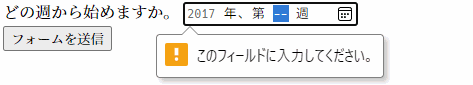

{{HTMLRef("Input_types")}}

{{HTMLElement("input")}} 要素の **`week`** 型は、年と、その年の [ISO 8601 週番号](https://ja.wikipedia.org/wiki/ISO_8601#%E5%B9%B4%E3%81%A8%E9%80%B1%E3%81%A8%E6%9B%9C%E6%97%A5) (つまり、第 1 週から第 [52 または 53](https://ja.wikipedia.org/wiki/ISO_8601#%E5%B9%B4%E3%81%A8%E9%80%B1%E3%81%A8%E6%9B%9C%E6%97%A5) 週) を簡単に入力することができる入力欄を生成します。

{{EmbedInteractiveExample("pages/tabbed/input-week.html", "tabbed-shorter")}}

コントロールのユーザーインターフェイスは、ブラウザーによって様々です。現時点ではブラウザー間の対応は限定的で、 Chrome/Opera と Microsoft Edge のみが対応しています。対応していないブラウザーでは、このコントロールは単純な [`<input type="text">`](/ja/docs/Web/HTML/Element/input/text) に格下げされます。

Chrome/Opera では、 `week` コントロールは週と年の値を埋めるスロット、もっと視覚的に選択するためのポップアップカレンダーインターフェイス、コントロールの値を消去するための "X" ボタンを提供します。


Edge の `week` コントロールはもう少し凝っており、年と週を選ぶスライドするリールが開きます。


<table class="properties">
  <tbody>
    <tr>
      <td><strong>{{anch("値")}}</strong></td>
      <td>
        年と週を表す {{domxref("DOMString")}}、または空欄
      </td>
    </tr>
    <tr>
      <td><strong>イベント</strong></td>
      <td>
        {{domxref("HTMLElement/change_event", "change")}} および
        {{domxref("HTMLElement/input_event", "input")}}
      </td>
    </tr>
    <tr>
      <td><strong>対応している共通属性</strong></td>
      <td>
        {{htmlattrxref("autocomplete", "input")}},
        {{htmlattrxref("list", "input")}},
        {{htmlattrxref("readonly", "input")}},
        {{htmlattrxref("step", "input")}}
      </td>
    </tr>
    <tr>
      <td><strong>IDL 属性</strong></td>
      <td>
        <code>value</code>, <code>valueAsDate</code>,
        <code>valueAsNumber</code>, <code>list</code>
      </td>
    </tr>
    <tr>
      <td><strong>メソッド</strong></td>
      <td>
        {{domxref("HTMLInputElement.select", "select()")}},
        {{domxref("HTMLInputElement.stepDown", "stepDown()")}},
        {{domxref("HTMLInputElement.stepUp", "stepUp()")}}
      </td>
    </tr>
  </tbody>
</table>

## 値

{{domxref("DOMString")}} で、入力欄に入力された年と週を表します。この入力型で使われる日時値の形式は、 [HTML で使われる日付や時刻の形式](/ja/docs/Web/HTML/Date_and_time_formats)の[HTML で使われる日付や時刻の形式](/ja/docs/Web/HTML/Date_and_time_formats#week_strings)で説明しています。

次のように {{htmlattrxref("value", "input")}} 属性に値を入れることで、既定値を設定することができます。

```html
<label for="week">どの週に始めたいですか。</label>
<input id="week" type="week" name="week" value="2017-W01">
```

{{EmbedLiveSample('Value', 600, 60)}}

一点気を付けなければならないことは、実際の `value` は常に `yyyy-Www` の書式であり、表示される書式はこれとは異なる可能性があるということです。例えば、上記の値をサーバーに送信すると、ブラウザーは `Week 01, 2017` のように表示するかもしれませんが、送信される値は常に `week=2017-W01` のようになります。

次のように、 JavaScript から入力要素の {{domxref("HTMLInputElement.value", "value")}} プロパティを使用して、値を取得したり設定したりすることもできます。

```js
var weekControl = document.querySelector('input[type="week"]');
weekControl.value = '2017-W45';
```

## 追加の属性

すべての {{HTMLElement("input")}} 型で共通する属性に加え、 `week` 型の入力欄は次の属性にも対応しています。

### max

受け付ける（時間的に）最も遅い年と週番号で、上記の{{anch("値")}}の節で説明した文字列書式です。要素に入力された {{htmlattrxref("value", "input")}} がこれを超えた場合、要素は[制約検証](/ja/docs/Web/Guide/HTML/Constraint_validation)に失敗します。 `max` 属性の値が妥当な週の文字列ではない場合、要素は最大値を持ちません。

この値は `min` 属性で指定されたものより後か、同じ年と週を指定する必要があります。

### min

受け付ける最も早い年と週です。要素の {{htmlattrxref("value", "input")}} がこれより小さいと、要素は[制約検証](/ja/docs/Web/Guide/HTML/Constraint_validation)に失敗します。属性の値が妥当な週の文字列ではない場合、要素は最小値を持ちません。

この値は `max` 属性で指定されたものより前か、同じ年と週を指定する必要があります。

### readonly

論理属性で、存在すれば、ユーザーが編集することができないことを表します。しかし、 `value` は、 JavaScript コードから直接 {{domxref("HTMLInputElement")}} の `value`  プロパティを設定することで変更することができます。

> **Note:** 読み取り専用フィールドは値を持てないため、 `required` は `readonly` 属性も指定されている入力欄には効果がありません。

### step

`step` 属性は値が吸着する粒度を指定する数値、または後述する特殊な値 `any` です。刻みの基準値に等しい値（指定されていれば `{{anch("min")}}`、そうでなければ {{htmlattrxref("value", "input")}}、どちらも設定されていなければ適切な既定値）のみが妥当となります。

文字列値の `any` は、刻みがなく、どの値でも許可されることを意味します（`{{anch("min")}}` や `{{anch("max")}}` など、他の制約には制限されます）。

> **Note:** ユーザーがデータを入力したときには刻みの設定には吸着せず、{{Glossary("user agent", "ユーザーエージェント")}}は直近の妥当な値、同じ距離の値の選択肢が 2 つあった場合は、正の方向の推奨値に丸められます。

`week` 入力欄では、 `step` の値は週数で指定され、 604,800,000 が乗じられます（ミリ秒単位の数値であるため)。 `step` の既定値は 1 であり、 1 週を表します。既定の刻みの既定値は -259,200,000 で、これは 1970 年の最初の週 (`1970-W01`) です。

<em>現時点で、 `week` 入力欄で `step` に `any` の値が何を意味するかが不明確です。これは情報が決定次第、更新されるでしょう。</em>

## week 入力欄の使用

week 入力欄は一見すると便利に見えます。簡単に週を選択するユーザーインターフェイスを提供し、ユーザーのロケールに関係なく、データ形式を正規化してサーバーに送信するからです。しかし、ブラウザーの互換性が限られているため、 `<input type="week">` には問題があります。

`<input type="week">` の基本的な使い方と少し複雑な使い方を見てみてから、その後でブラウザーの互換性の問題を緩和するアドバイスを提供しましょう ({{anch("ブラウザーの対応の扱い")}}を参照してください)。

### week の基本的な使用

もっとも単純な `<input type="week">` の使用方法は、次のように基本的な `<input>` と {{htmlelement("label")}} 要素の組み合わせです。

```html
<form>
  <label for="week">どの週から始めますか。</label>
  <input id="week" type="week" name="week">
</form>
```

{{EmbedLiveSample('Basic_uses_of_week', 600, 40)}}

### 入力欄の寸法の制御

`<input type="week">` は {{htmlattrxref("size", "input")}} のような寸法に関する属性には対応していません。寸法を変更する必要がある場合は、 [CSS](/ja/docs/Web/CSS) を使用する必要があります。

### step 属性の使用

{{htmlattrxref("step", "input")}} 属性を使用して、週の番号が増加または減少するときに飛ばす番号を変更することができるはずですが、対応しているブラウザーでも何も動作していないようです。

## 検証

既定で、 `<input type="week">` は入力された値の検証を行いません。ユーザーインターフェイスの実装は一般的に、妥当な年と週でないものの入力をさせず、これは便利ですが、それでも入力欄を空のままにすることができ、また選択できる週の範囲を制限したくなるかもしれません。

### 週の最大値と最小値の設定

{{htmlattrxref("min", "input")}} および {{htmlattrxref("max", "input")}} 属性を使用して、ユーザーが選択することができる有効な週を制限することができます。以下の例では、最小値を `2017 年第 1 週` に、最大値を `2017 年第 52 週` に設定しています。

```html
<form>
  <label for="week">どの週から始めますか。</label>
  <input id="week" type="week" name="week"
         min="2017-W01" max="2017-W52">
  <span class="validity"></span>
</form>
```

{{EmbedLiveSample('Setting_maximum_and_minimum_weeks', 600, 40)}}

上記の例の CSS です。 CSS の {{cssxref(":valid")}} および {{cssxref(":invalid")}} プロパティを使用して、現在の値が有効かどうかに基づいてスタイルを設定しています。アイコンは入力欄そのものではなく、入力欄の隣の {{htmlelement("span")}} に置くようにしないと、 Chrome ではコントロールの内側にコンテンツを生成するので、正しく整形したり表示したりすることができません。

```css
div {
  margin-bottom: 10px;
  position: relative;
}

input[type="number"] {
  width: 100px;
}

input + span {
  padding-right: 30px;
}

input:invalid+span:after {
  position: absolute;
  content: '✖';
  padding-left: 5px;
}

input:valid+span:after {
  position: absolute;
  content: '✓';
  padding-left: 5px;
}
```

この結果は、対応するブラウザーでは 2017 年の第 1 週から第 52 週の間が有効に見え、選択することができます。

### 週の値を必須にする

加えて、 {{htmlattrxref("required", "input")}} 属性を使用して、週の入力を必須にすることができます。結果として、対応しているブラウザーでは週の入力欄が空欄の場合にエラーを表示します。

例を見てみましょう。週の最小値と最大値を設定し、かつフィールドを必須に設定しています。

```html
<form>
  <div>
    <label for="week">どの週から始めますか。</label>
    <input id="week" type="week" name="week"
         min="2017-W01" max="2017-W52" required>
    <span class="validity"></span>
  </div>
  <div>
      <input type="submit" value="フォームを送信">
  </div>
</form>
```

フォームに値を設定せずに送信しようとすると、ブラウザーはエラーを表示します。例を実行してみてください。

{{EmbedLiveSample('Making_week_values_required', 600, 120)}}

対応していないブラウザーを使用している方のためのスクリーンショットです。



> **Warning:** HTML のフォーム検証は、入力されたデータが正しい形式であることを保証するスクリプトの代用にはなりません。 HTML を調整して検証をくぐり抜けたり、完全に削除したりすることはとても簡単にできます。 HTML を完全にバイパスし、サーバーに直接データを送信することも可能です。サーバー側のコードが受信したデータの検証に失敗した場合、不適切な形式のデータ (または大きすぎるデータ、間違った種類のデータなど) が送信された場合に災害が発生するおそれがあります。

## ブラウザーの対応の扱い

前述のように、現時点で week 入力欄を利用する上で一番の問題はブラウザーの互換性です。デスクトップでは Safari と Firefox は対応しておらず、 IE の古いバージョンも対応していません。

Android や iOS のようなモバイルプラットフォームは、このような入力型が実に有効であり、タッチスクリーン環境で実に簡単に値を選択できる専用のユーザーインターフェイスコントロールを提供します。例えば、 Android 版 Chrome の `week` 選択は、次のようになっています。


対応していないブラウザーでは安全にテキスト入力欄に格下げされますが、これはユーザーインターフェイスの一貫性（表示されるコントロールが異なること）とデータの扱いの 2 つの問題を生じます。

2 つ目の問題はより深刻です。すでに述べたように、 `week` 入力欄では、実際の値が常に `yyyy-Www` の書式で正規化されます。ブラウザーが一般的なテキスト入力欄にフォールバックした場合、ユーザーが正しい書式で入力するよう案内することができません (そして、おそらく認識できません)。人間が週の値を書くには、次のように色々な方法があります。

- `2017 年第 1 週`
- `Week 1 2017`
- `2017-W01`
- 等

ブラウザーに依存しない方法によってフォームで年と週を扱う最善の方法は、現時点では年と週を別々なコントロール（{{htmlelement("select")}} 要素で入力するものが一般的です。以下の実装を見てください）にするか、 [jQuery date picker](https://jqueryui.com/datepicker/) のような JavaScript ライブラリーを使用することです。

## 例

この例では、週を選択するユーザーインターフェイスの要素を 2 組生成します。ネイティブの `<input type="week">` 入力欄と、 `week` 入力欄に対応しない古いブラウザーで年と週を選択するための、 2 つの {{htmlelement("select")}} 要素です。

{{EmbedLiveSample('Examples', 600, 140)}}

HTML は次のようになります。

```html
<form>
  <div class="nativeWeekPicker">
    <label for="week">どの週から始めますか。</label>
    <input id="week" type="week" name="week"
           min="2017-W01" max="2018-W52" required>
    <span class="validity"></span>
  </div>
  <p class="fallbackLabel">どの週から始めますか。</p>
  <div class="fallbackWeekPicker">
    <div>
      <span>
        <label for="week">Week:</label>
        <select id="fallbackWeek" name="week">
        </select>
      </span>
      <span>
        <label for="year">Year:</label>
        <select id="year" name="year">
          <option value="2017" selected>2017</option>
          <option value="2018">2018</option>
        </select>
      </span>
    </div>
  </div>
</form>
```

週の値は以下の JavaScript のコードで動的に生成されます。

```css hidden
div {
  margin-bottom: 10px;
  position: relative;
}

input[type="number"] {
  width: 100px;
}

input + span {
  padding-right: 30px;
}

input:invalid+span:after {
  position: absolute;
  content: '✖';
  padding-left: 5px;
}

input:valid+span:after {
  position: absolute;
  content: '✓';
  padding-left: 5px;
}
```

もう一つの面白い部分は、機能の検出コードです。ブラウザーが `<input type="week">` に対応しているかどうかを検出するために、新たな {{htmlelement("input")}} 要素を生成し、その `type` を `week` に設定てみて、すぐに `type` に何が設定されたかをチェックします。対応していないブラウザーでは、 `week` 型が `text` 型へ代替されます。 `<input type="week">` に対応していない場合は、ネイティブの日時入力欄を非表示にして代替用の ({{htmlelement("select")}}) による選択ユーザーインターフェイスを表示します。

```js
// 変数を定義
var nativePicker = document.querySelector('.nativeWeekPicker');
var fallbackPicker = document.querySelector('.fallbackWeekPicker');
var fallbackLabel = document.querySelector('.fallbackLabel');

var yearSelect = document.querySelector('#year');
var weekSelect = document.querySelector('#fallbackWeek');

// 最初はフォールバックを非表示にする
fallbackPicker.style.display = 'none';
fallbackLabel.style.display = 'none';

// 新しい日付入力が文字列入力にフォールバックされるかどうか
var test = document.createElement('input');

try {
  test.type = 'week';
} catch (e) {
  console.log(e.description);
}

// もし文字列入力になるならば、 if() {} ブロックの中のコードを実行する
if(test.type === 'text') {
  // ネイティブの日付選択を隠してフォールバック版を表示
  nativePicker.style.display = 'none';
  fallbackPicker.style.display = 'block';
  fallbackLabel.style.display = 'block';

  // 週を動的に生成する
  populateWeeks();
}

function populateWeeks() {
  // 週の選択肢を 52 週で生成
  for(var i = 1; i <= 52; i++) {
    var option = document.createElement('option');
    option.textContent = (i < 10) ? ("0" + i) : i;
    weekSelect.appendChild(option);
  }
}
```

> **Note:** 53 週ある年もあることを忘れないでください（[年あたりの週数](https://en.wikipedia.org/wiki/ISO_week_date#Weeks_per_year)を参照）。商品のアプリを開発するときはこれを念頭に置いておく必要があります。

## 仕様書

{{Specifications}}

## ブラウザーの互換性

{{Compat}}

## 関連情報

- 全般的な {{HTMLElement("input")}} およびその操作に使用する {{domxref("HTMLInputElement")}} インターフェイス
- [HTML で使用される日付と時刻の書式](/ja/docs/Web/HTML/Date_and_time_formats)
- [`<input type="datetime-local">`](/ja/docs/Web/HTML/Element/input/datetime-local), [`<input type="date">`](/ja/docs/Web/HTML/Element/input/date), [`<input type="time">`](/ja/docs/Web/HTML/Element/input/time), [`<input type="month">`](/ja/docs/Web/HTML/Element/input/month)
- [CSS プロパティの互換性](/ja/docs/Learn/Forms/Property_compatibility_table_for_form_controls)
