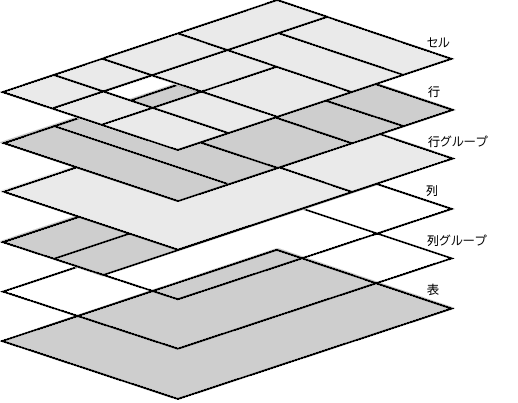

{{HTMLSidebar}}

**`<table>`** は [HTML](/ja/docs/Web/HTML) の要素で、表形式のデータ、つまり、行と列の組み合わせによるセルに含まれたデータによる二次元の表で表現される情報です。

{{EmbedInteractiveExample("pages/tabbed/table.html","tabbed-taller")}}

## 属性

この要素には[グローバル属性](/ja/docs/Web/HTML/Global_attributes)があります。

### 非推奨の属性

以下の属性は非推奨であり、使用すべきではありません。 以下の文書は、既存のコードを更新する際の参考情報として、また歴史的な関心のみを目的として記載されています。

- `align` {{deprecated_inline}}

  - : 親要素内のテーブルの水平方向の配置を指定します。 {{Glossary("enumerated","列挙")}}値として、`left`、`center`、`right` があります。 この属性は非推奨であるため、代わりに CSS の {{cssxref("margin-inline-start")}} および {{cssxref("margin-inline-end")}} プロパティを使用してください。

- `bgcolor` {{deprecated_inline}}

  - : 表の背景色を定義します。値は HTML 色です。値は [6 桁の 16 進 RGB コード](/ja/docs/Web/CSS/hex-color)で、その前に `#` が付きます。定義済みの[色キーワード](/ja/docs/Web/CSS/named-color)のうちの 1 つを使用することもできます。それ以外の CSS の {{cssxref("color_value", "&lt;color&gt")}} 値には対応していません。この属性は非推奨であるため、代わりに CSS の {{cssxref("background-color")}} プロパティを使用してください。

- `border` {{deprecated_inline}}

  - : 表を囲む枠のサイズを非負の整数（ピクセル単位）で定義します。`0` に設定すると、[`frame`](#frame)属性は無効になります。この属性は非推奨であるため、代わりに CSS の プロパティの {{cssxref("border")}} を使用してください。

- `cellpadding` {{deprecated_inline}}

  - : この属性は、セルの内容と境界線の間の空間を定義します。この属性は廃止されているので、これを使用する代わりに、CSS の {{cssxref("padding")}} プロパティを {{HTMLElement("th")}} および {{HTMLElement("td")}} 要素に使用してください。

- `cellspacing` {{deprecated_inline}}

  - : 2 つのセルの間の空間の寸法を定義します。この属性は廃止されているので、これを使用する代わりに、CSS の {{cssxref("border-spacing")}} プロパティを `<table>` 要素に適用してください。なお、`<table>` 要素の {{cssxref("border-collapse")}} が `collapse` に設定されていると何の効果もありません。

- `frame` {{deprecated_inline}}

  - : 表を囲む枠線のどの方向を表示する必要があるかを定義します。{{Glossary("enumerated","列挙値")}}で、有効な値は `void`、`above`、`below`、`hsides`、`vsides`、`lhs`、`rhs`、`box`、`border` です。この属性は非推奨であるため、代わりに {{cssxref("border-style")}} および {{cssxref("border-width")}} プロパティを使用してください。

- `rules` {{deprecated_inline}}

  - : 表の罫線（境界線）のどれを表示するかを定義します。{{Glossary("enumerated","列挙値")}}で、有効な値は `none`（既定値）、`groups`（<thead>、<tbody>、<tfoot> 要素）、`rows`（水平線）、`cols`（垂直線）、`all`（すべてのセルの境界線）です。この属性は非推奨となっているため、代わりに適切な表関連要素、および `<table>` 自体に CSS の {{cssxref("border")}} プロパティを使用してください。

- `summary` {{deprecated_inline}}

  - : この属性は、表の内容の概要を示す代替テキストを定義します。代わりに {{htmlelement("caption")}} 要素を使用してください。

- `width` {{deprecated_inline}}

  - : この属性は表の幅を定義します。代わりに CSS の {{cssxref("width")}} プロパティを使用してください。

    > [!NOTE]
    > HTML の仕様には、`height` を `<table>` 属性として記載しているものはありませんが、一部のブラウザーでは、標準外の `height` の解釈に対応しています。 単位のない値は、最小の絶対高さをピクセルで設定します。 パーセント値として設定された場合、最小のテーブル高さは、親コンテナーの高さに対する相対的な値となります。 この属性は非推奨のため、代わりに CSS の {{cssxref("min-height")}} プロパティを使用してください。

## 表コンテンツの視覚レイアウト

以下の要素は表構造の一部になります。

- {{HTMLElement("caption")}}
- {{HTMLElement("thead")}}
- {{HTMLElement("colgroup")}}
- {{HTMLElement("col")}}
- {{HTMLElement("th")}}
- {{HTMLElement("tbody")}}
- {{HTMLElement("tr")}}
- {{HTMLElement("td")}}
- {{HTMLElement("tfoot")}}

`<table>` ボックスは表の整形コンテキストを確立します。 `<table>` 内の要素は長方形のボックスを生成します。 各ボックスは、次のルールに則り、複数の表セルを占めます。

1. ソースコードの表は、上から下に向かってソースコード順に、行ボックスで埋められます。それぞれの行ボックスは、セルの 1 行分を占めます。
2. 行グループボックスは、1 つ以上の行ボックスを占めます。
3. 列ボックスはソース順に隣り合って配置されます。[`dir`](/ja/docs/Web/HTML/Global_attributes/dir) 属性の値に応じて、列は左から右、または右から左に向けて配置されます。列ボックスは表のセルの 1 つ以上の列を占めます。
4. 列グループボックスは、1 つ以上の列ボックスを占めます。
5. セルボックスは、複数の行と列にまたがる場合があります。ユーザーエージェントは、利用できる行と列の数に合わせてセルをトリミングします。

表のセルにはパディングがあります。表を構成するボックスにはマージンがありません。

### テーブルのレイヤーと透明性

スタイル設定の都合上、表要素は 6 つの重なり合ったレイヤー上に配置されていると考えることができます。



あるレイヤーの要素に背景を設定するには、その要素の上にあるレイヤーの背景が透明である必要があります。欠落したセルは、無名の表セルボックスがその場所を占めているかのようにレンダリングされます。

## アクセシビリティ

### キャプション

{{HTMLElement("caption")}} 要素は明確かつ簡潔に表の目的を示すことに価値があるため、これを提供することで、表の残りの部分を読む必要があるか、飛ばすかを判断するのに役立ちます。

これはスクリーンリーダーのような支援技術を利用して操作している人、弱視の人、認知問題を抱えた人にとって役立ちます。

- [MDN \<caption> を用いて表にタイトルをつける](/ja/docs/Learn/HTML/Tables/Advanced#caption_を用いて表にキャプションを追加する)
- [Caption & Summary • Tables • W3C WAI Web Accessibility Tutorials](https://www.w3.org/WAI/tutorials/tables/caption-summary/)

### 行と列のスコープ

[`scope`](/ja/docs/Web/HTML/Element/th#scope) 属性を見出しセル（{{HTMLElement("th")}} 要素）につけることは、文脈が単純な場合はスコープが推測できるので冗長になります。しかし、支援技術によっては正しく推測することに失敗する事があるため、見出しにスコープを設定すると使い勝手が向上することがあります。複雑な表では、 [`scope`](/ja/docs/Web/HTML/Element/th#scope) を指定することで、セルと見出しの関係に関する必要な情報を提供することができます。

- [MDN 視覚障碍者向けの表](/ja/docs/Learn/HTML/Tables/Advanced#視覚障碍者向けの表)
- [Tables with two headers • Tables • W3C WAI Web Accessibility Tutorials](https://www.w3.org/WAI/tutorials/tables/two-headers/)
- [Tables with irregular headers • Tables • W3C WAI Web Accessibility Tutorials](https://www.w3.org/WAI/tutorials/tables/irregular/)
- [H63: Using the scope attribute to associate header cells and data cells in data tables | W3C Techniques for WCAG 2.0](https://www.w3.org/TR/WCAG20-TECHS/H63.html)

### 複雑な表

スクリーンリーダーのような支援技術は、見出しのセルを厳密に水平または垂直方向に関連付けすることができない表を解析するのが困難な場合があります。これはつまり、 [`colspan`](/ja/docs/Web/HTML/Element/td#colspan) と [`rowspan`](/ja/docs/Web/HTML/Element/td#rowspan) 属性がある場合のことです。

できれば、テーブルの内容を表現するための別な方法、例えばより小さい表の集合に分解するなどで、 [`colspan`](/ja/docs/Web/HTML/Element/td#colspan) と [`rowspan`](/ja/docs/Web/HTML/Element/td#rowspan) 属性に依存する必要がないようにすることを考慮してください。これは支援技術を使用している人が表の内容を理解しやすくするのに加えて、表のレイアウトの関連を理解することが難しい認識障碍を持った人にも利益になります。

表を分割することができないのであれば、 [`id`](/ja/docs/Web/HTML/Global_attributes/id) および [`headers`](/ja/docs/Web/HTML/Element/td#headers) 属性の組み合わせを用いて、表のセルとそのセルに関連した見出し（{{HTMLElement("th")}} 要素）をプログラム的に結び付けてください。

- [MDN 視覚障碍者向けの表](/ja/docs/Learn/HTML/Tables/Advanced#視覚障碍者向けの表)
- [Tables with multi-level headers • Tables • W3C WAI Web Accessibility Tutorials](https://www.w3.org/WAI/tutorials/tables/multi-level/)
- [H43: Using id and headers attributes to associate data cells with header cells in data tables | Techniques for W3C WCAG 2.0](https://www.w3.org/TR/WCAG20-TECHS/H43.html)

## 例

下記の例には、徐々に複雑になる表が記載されています。 さらに詳しい例については、詳細なチュートリアルを含む「[ウェブ開発の学習](/ja/docs/Learn)」領域の「[HTML の表](/ja/docs/Learn/HTML/Tables)」シリーズを参照してください。 ここでは、表要素とその属性を使用して表形式のデータを正しく構造化する方法を学習できます。「[表のスタイル設定](/ja/docs/Learn/CSS/Building_blocks/Styling_tables)ガイド」では、一般的な便利なテクニックを含む表のスタイル設定情報が指定されています。

`<table>` の構造は、いくつかの表関連の HTML 要素と、関連付けられた様々な属性を使用するものであるため、次の例は、基本と一般的な標準をカバーするシンプルな説明を意図したものです。 追加の情報やより詳細な情報は、対応するリンク先のページで得られます。

これらの表の例は、HTML で構造化し、[CSS](/ja/docs/Web/CSS) でスタイル設定した{{Glossary("accessibility", "アクセシビリティ対応")}}の表を作成する方法を示しています。

HTML の表は構造化されているため、{{Glossary("markup", "マークアップ")}}がすぐに増えてしまいます。そのため、適切な構造を作成するには、表の目的と最終的な外観を明確に定義することが重要です。 {{Glossary("semantics", "意味を持った")}}マークアップを使用して開発された論理構造は、スタイルを適用しやすくなるだけでなく、検索エンジンや支援技術のユーザーを含め、誰もが理解し、操作できる有益でアクセシビリティの高い表を作成することができます。

最初の例は基本的なもので、その後の例は複雑になっていきます。まず、表のとても基本的な HTML のテーブル構造を作成します。最初の2つの例には、定義されたヘッダー、本体、フッターなどの表の節グループは記載されておらず、セルの結合や明示的に定義されたセルの関係もありません。キャプションも提供されていません。例を順に見ていくと、複雑なデータテーブルが持つべきすべてのテーブル機能が徐々に追加されていきます。

### 基本的な表

この例では、2 列 3 行のとても基本的な表を提示します。 既定のブラウザーの表スタイル設定を示すため、この例には CSS は記載されていません。

#### HTML

表の行は {{HTMLElement("tr")}} 要素で定義され、列は表の見出しとデータセルで定義されます。 1 行目には、データセル（{{HTMLElement("td")}} 要素）の列見出しとなる見出しセル（{{HTMLElement("th")}}要素）が含まれます。 各行の各要素（{{HTMLElement("th")}} または {{HTMLElement("td")}}）は、それぞれの列に配置されます。つまり、行の最初の要素は最初の列に、2 つ目の要素は 2 つ目の列に配置されます。

```html
<table>
  <tr>
    <th>名前</th>
    <th>年齢</th>
  </tr>
  <tr>
    <td>Maria Sanchez</td>
    <td>28</td>
  </tr>
  <tr>
    <td>Michael Johnson</td>
    <td>34</td>
  </tr>
</table>
```

#### 結果

この表には独自の [CSS](/ja/docs/Web/CSS) や[ユーザースタイルシート](/ja/docs/Web/CSS/Cascade#ユーザースタイルシート)が適用されていません。スタイル設定の結果は純粋に[ユーザーエージェントスタイルシート](/ja/docs/Web/CSS/Cascade#ユーザーエージェントスタイルシート)からのものです。

{{EmbedLiveSample('Basic_table', 650, 80)}}

### 見出しセルで拡張された表

この例では[基本的な表](#基本的な表)を拡張し、内容と基本的な CSS を追加します。

#### HTML

これで表は 4 つの行（{{HTMLElement("tr")}} 要素）と 4 つの列で構成されます。最初の行は見出しセルの行です（1 行目は、{{HTMLElement("th")}} 要素のみがあります）。 それ以降の行は、見出し列（各行の最初の子要素である {{HTMLElement("th")}} 要素）と 3 つのデータ列（{{HTMLElement("td")}} 要素）を含みます。 テーブルのセクション化要素が使用されていないため、ブラウザーは自動的にコンテンツグループの構造を定義します。すなわち、すべての行は暗黙的な {{HTMLElement("tbody")}} 要素のテーブル本体内に包まれます。

```html
<table>
  <tr>
    <th>名前</th>
    <th>ID</th>
    <th>入会日</th>
    <th>残高</th>
  </tr>
  <tr>
    <th>Margaret Nguyen</th>
    <td>427311</td>
    <td><time datetime="2010-06-03">2010/06/03</time></td>
    <td>0.00</td>
  </tr>
  <tr>
    <th>Edvard Galinski</th>
    <td>533175</td>
    <td><time datetime="2011-01-13">2011/01/13</time></td>
    <td>37.00</td>
  </tr>
  <tr>
    <th>Hoshi Nakamura</th>
    <td>601942</td>
    <td><time datetime="2012-07-23">2012/07/23</time></td>
    <td>15.00</td>
  </tr>
</table>
```

#### CSS

CSS を使用して、テーブルの各部分の周囲に行を作成し、データ構造を明確にするための基本的なスタイル設定を指定します。CSS は、表全体と表の各セル（{{HTMLElement("th")}} および {{HTMLElement("td")}} 要素で指定する）の周囲に境界線を追加し、見出しセルとデータセルを区別します。

```css
table {
  border: 2px solid rgb(140 140 140);
}

th,
td {
  border: 1px solid rgb(160 160 160);
}
```

#### 結果

{{EmbedLiveSample("Expanded_table_with_header_cells", 650, 110)}}

### 表セルの関連の指定

より高度な方法で表を拡張する前に、見出しセルとデータセル（{{HTMLElement("th")}} および {{HTMLElement("td")}} 要素）の間の関係を定義して、アクセシビリティを向上させることをお勧めします。

#### HTML

これは、 [`scope`](/ja/docs/Web/HTML/Element/th#scope) 属性を {{HTMLElement("th")}} 要素に導入し、`col`（列）または `row`（行）の対応する値を設定することで実現できます。

```html
<table>
  <tr>
    <th scope="col">名前</th>
    <th scope="col">ID</th>
    <th scope="col">入会日</th>
    <th scope="col">残高</th>
  </tr>
  <tr>
    <th scope="row">Margaret Nguyen</th>
    <td>427311</td>
    <td><time datetime="2010-06-03">2010/06/03</time></td>
    <td>0.00</td>
  </tr>
  <tr>
    <th scope="row">Edvard Galinski</th>
    <td>533175</td>
    <td><time datetime="2011-01-13">2011/01/13</time></td>
    <td>37.00</td>
  </tr>
  <tr>
    <th scope="row">Hoshi Nakamura</th>
    <td>601942</td>
    <td><time datetime="2012-07-23">2012/07/23</time></td>
    <td>15.00</td>
  </tr>
</table>
```

CSS と視覚的な結果の変更はありません。この適応により、スクリーンリーダーなどの支援技術に見出しがどのセルと相対しているかを特定するのに役立つ貴重な文脈情報が指定されます。

> [!NOTE]
> 表の構造がさらに複雑な場合は、[`headers`](/ja/docs/Web/HTML/Element/th#headers) 属性を {{HTMLElement("th")}} および {{HTMLElement("td")}} 要素で（追加で）使用することで、アクセシビリティが向上し、支援技術がセル間の関係を識別するのに役立つ場合があります。[複雑な表](#複雑な表)を参照してください。

### 表の節グループを明示的に指定

[セルの関連を指定](#表セルの関連の指定)することでアクセシビリティを向上させることに加え、表の節グループを導入することで表の{{Glossary("semantics", "意味づけ")}}を向上させることができます。

#### HTML

最初の行（{{HTMLElement("tr")}} 要素）には列見出しセルのみが含まれ、表の残りのコンテンツの見出しが指定されているため、その行を {{HTMLElement("thead")}} 要素で囲むことで、その行が表のヘッダー部分であることを明示的に指定することができます。さらに、ブラウザーによって自動的に行われる処理も、明示的に定義することができます。テーブルの本体部分は、テーブルの主要なデータを含み、対応する行を {{HTMLElement("tbody")}} 要素で囲むことで指定します。 {{HTMLElement("tbody")}} 要素を明示的に使用することで、ブラウザーが意図するテーブル構造を作成する手助けとなり、望ましくない結果を避けることができます。

```html
<table>
  <thead>
    <tr>
      <th scope="col">名前</th>
      <th scope="col">ID</th>
      <th scope="col">入会日</th>
      <th scope="col">残高</th>
    </tr>
  </thead>
  <tbody>
    <tr>
      <th scope="row">Margaret Nguyen</th>
      <td>427311</td>
      <td><time datetime="2010-06-03">2010/06/03</time></td>
      <td>0.00</td>
    </tr>
    <tr>
      <th scope="row">Edvard Galinski</th>
      <td>533175</td>
      <td><time datetime="2011-01-13">2011/01/13</time></td>
      <td>37.00</td>
    </tr>
    <tr>
      <th scope="row">Hoshi Nakamura</th>
      <td>601942</td>
      <td><time datetime="2012-07-23">2012/07/23</time></td>
      <td>15.00</td>
    </tr>
  </tbody>
</table>
```

今回も、CSS と視覚的な結果は変更されません。表の節グループを指定することで、スクリーンリーダーや検索エンジンなどの支援技術や、CSSのスタイル指定（例えば、後述する例を参照）に役立つ文脈情報が指定されます。

### 列や行をまたがる

この例では、表の列を追加し、ヘッダー節を複数行にすることで、表をさらに拡張しています。

#### HTML

これまでに作成した表を基に、新たに「会員有効期限」の列を本文のそれぞれの行に {{HTMLElement("td")}} で追加します。また、新しい行（{{HTMLElement("tr")}} 要素）をヘッダー節（{{HTMLElement("thead")}} 要素）内に追加し、「会員資格期間」の列見出しを「入会日」と「退会日」の列に追加します。

2 つ目のヘッダー行を作成するには、[`colspan`](/ja/docs/Web/HTML/Element/th#colspan) 属性と [`rowspan`](/ja/docs/Web/HTML/Element/th#rowspan) 属性を {{HTMLElement("th")}} 要素に追加して、見出しセルを正しい列と行の数に割り当てます。

```html
<table>
  <thead>
    <tr>
      <th scope="col" rowspan="2">名前</th>
      <th scope="col" rowspan="2">ID</th>
      <th scope="col" colspan="2">会員資格期間</th>
      <th scope="col" rowspan="2">残高</th>
    </tr>
    <tr>
      <th scope="col">入会日</th>
      <th scope="col">退会日</th>
    </tr>
  </thead>
  <tbody>
    <tr>
      <th scope="row">Margaret Nguyen</th>
      <td>427311</td>
      <td><time datetime="2010-06-03">2010/06/03</time></td>
      <td>なし</td>
      <td>0.00</td>
    </tr>
    <tr>
      <th scope="row">Edvard Galinski</th>
      <td>533175</td>
      <td><time datetime="2011-01-13">2011/01/13</time></td>
      <td><time datetime="2017-04-08">2017/04/08</time></td>
      <td>37.00</td>
    </tr>
    <tr>
      <th scope="row">Hoshi Nakamura</th>
      <td>601942</td>
      <td><time datetime="2012-07-23">2012/07/23</time></td>
      <td>なし</td>
      <td>15.00</td>
    </tr>
  </tbody>
</table>
```

```css hidden
table {
  border: 2px solid rgb(140 140 140);
}

th,
td {
  border: 1px solid rgb(160 160 160);
}
```

#### 結果

{{EmbedLiveSample("Column_and_row_spanning", 650, 130)}}

ヘッダー節はこれで 2 行になります。1 行目の見出し（{{HTMLElement("th")}} 要素）は「名前」、「ID」、「会員資格期間」、「残高」となり、2 行目の副見出しは「入会」と「退会」となります。これは、次の手順で実行します。

- 最初の行の「名前」「ID」「残高」の見出しは、 [`rowspan`](/ja/docs/Web/HTML/Element/th#rowspan) 属性によって両方の見出し行にまたがっており、それぞれが 2 行分の高さになります。
- 1 行目の「会員資格期間」の見出しセルは、 [`colspan`](/ja/docs/Web/HTML/Element/th#colspan) 属性によって 2 つの列にまたがっているため、 2 列分の幅になっています。
- 2 行目には、「入会日」と「退会日」という 2 つの見出しセルのみが含まれています。他にも 3 つの列がありますが、これらは 2 行にまたがる 1 行目のセルと統合されているためです。この 2 つの見出しセルは、「会員資格期間」の見出しの下に正しく配置されています。

### 表のキャプションと列の集計

表の概要を指定することは一般的であり、推奨される方法です。これにより、ユーザーは表の関連性をすばやく判断することができます。さらに、「残高」の列は、個々のメンバーの残高の合計を表示することで集計されています。

#### HTML

表の概要を追加するには、表の[キャプション](#キャプション)（{{HTMLElement("caption")}} 要素）を `<table>` の最初の子として使用します。このキャプションは表の{{glossary("accessible description", "アクセシブル説明")}}を提供します。

最後に、表のフッター節（{{HTMLElement("tfoot")}} 要素）を本体の下に追加し、合計を表示して「残高」の列の合計を集計する行を追加します。 先に紹介した要素と属性を適用します。

```html
<table>
  <caption>
    2021 年の会員の状況
  </caption>
  <thead>
    <tr>
      <th scope="col" rowspan="2">名前</th>
      <th scope="col" rowspan="2">ID</th>
      <th scope="col" colspan="2">会員資格期間</th>
      <th scope="col" rowspan="2">残高</th>
    </tr>
    <tr>
      <th scope="col">入会日</th>
      <th scope="col">退会日</th>
    </tr>
  </thead>
  <tbody>
    <tr>
      <th scope="row">Margaret Nguyen</th>
      <td>427311</td>
      <td><time datetime="2010-06-03">2010/06/03</time></td>
      <td>なし</td>
      <td>0.00</td>
    </tr>
    <tr>
      <th scope="row">Edvard Galinski</th>
      <td>533175</td>
      <td><time datetime="2011-01-13">2011/01/13</time></td>
      <td><time datetime="2017-04-08">2017/04/08</time></td>
      <td>37.00</td>
    </tr>
    <tr>
      <th scope="row">Hoshi Nakamura</th>
      <td>601942</td>
      <td><time datetime="2012-07-23">2012/07/23</time></td>
      <td>なし</td>
      <td>15.00</td>
    </tr>
  </tbody>
  <tfoot>
    <tr>
      <th scope="row" colspan="4">合計残高</th>
      <td>52.00</td>
    </tr>
  </tfoot>
</table>
```

```css hidden
table {
  border: 2px solid rgb(140 140 140);
}

th,
td {
  border: 1px solid rgb(160 160 160);
}
```

#### 結果

{{EmbedLiveSample("Table_caption_and_column_summary", 650, 180)}}

### 基本的な表のスタイル設定

表に基本スタイルを適用して、フォントを調整し、見出し行とフッター行に {{cssxref("background-color")}} を追加してみましょう。HTML は今回変更しないので、CSS を正しい方法で掘り下げていきましょう。

```html hidden
<table>
  <caption>
    2021 年の会員の状況
  </caption>
  <thead>
    <tr>
      <th scope="col" rowspan="2">名前</th>
      <th scope="col" rowspan="2">ID</th>
      <th scope="col" colspan="2">会員資格期間</th>
      <th scope="col" rowspan="2">残高</th>
    </tr>
    <tr>
      <th scope="col">入会日</th>
      <th scope="col">退会日</th>
    </tr>
  </thead>
  <tbody>
    <tr>
      <th scope="row">Margaret Nguyen</th>
      <td>427311</td>
      <td><time datetime="2010-06-03">2010/06/03</time></td>
      <td>なし</td>
      <td>0.00</td>
    </tr>
    <tr>
      <th scope="row">Edvard Galinski</th>
      <td>533175</td>
      <td><time datetime="2011-01-13">2011/01/13</time></td>
      <td><time datetime="2017-04-08">2017/04/08</time></td>
      <td>37.00</td>
    </tr>
    <tr>
      <th scope="row">Hoshi Nakamura</th>
      <td>601942</td>
      <td><time datetime="2012-07-23">2012/07/23</time></td>
      <td>なし</td>
      <td>15.00</td>
    </tr>
  </tbody>
  <tfoot>
    <tr>
      <th scope="row" colspan="4">合計残高</th>
      <td>52.00</td>
    </tr>
  </tfoot>
</table>
```

#### CSS

ここでは、 {{cssxref("font")}} プロパティを `<table>` 要素に追加して、より視覚的に魅力的な書体（あるいは、個人的な意見によっては、醜悪なサンセリフ体）を設定していますが、興味深いのは 2 つ目のスタイルで、{{HTMLElement("thead")}} および {{HTMLElement("tfoot")}} 内に配置された {{HTMLElement("tr")}} 要素に水色の {{cssxref("background-color")}} が追加されています。これは、特定の節にあるすべてのセルに背景色をすばやく同時に適用する方法です。

```css
table {
  border: 2px solid rgb(140 140 140);
  font:
    16px "Open Sans",
    Helvetica,
    Arial,
    sans-serif;
}

thead > tr,
tfoot > tr {
  background-color: rgb(228 240 245);
}

th,
td {
  border: 1px solid rgb(160 160 160);
}
```

#### 結果

{{EmbedLiveSample("Basic_table_styling", 650, 180)}}

### 高度な表のスタイル設定

これで、ヘッダーと本体の両方の領域で、スタイル設定された行をすべて使用し、行の色を交互に変えたり、行内の位置指定に応じてセルの色を変えたり、といった具合に、すべてを徹底的に行います。 今回は、まず結果から見ていきましょう。

#### 結果

最終的な表は次のようになります。

{{EmbedLiveSample("Advanced_table_styling", 650, 210)}}

今回も、HTML に変更はありません。HTML 構造を適切に用意すると、どのようなことができるか見てみましょう。

```html hidden
<table>
  <caption>
    2021 年の会員の状況
  </caption>
  <thead>
    <tr>
      <th scope="col" rowspan="2">名前</th>
      <th scope="col" rowspan="2">ID</th>
      <th scope="col" colspan="2">会員資格期間</th>
      <th scope="col" rowspan="2">残高</th>
    </tr>
    <tr>
      <th scope="col">入会日</th>
      <th scope="col">退会日</th>
    </tr>
  </thead>
  <tbody>
    <tr>
      <th scope="row">Margaret Nguyen</th>
      <td>427311</td>
      <td><time datetime="2010-06-03">2010/06/03</time></td>
      <td>なし</td>
      <td>0.00</td>
    </tr>
    <tr>
      <th scope="row">Edvard Galinski</th>
      <td>533175</td>
      <td><time datetime="2011-01-13">2011/01/13</time></td>
      <td><time datetime="2017-04-08">2017/04/08</time></td>
      <td>37.00</td>
    </tr>
    <tr>
      <th scope="row">Hoshi Nakamura</th>
      <td>601942</td>
      <td><time datetime="2012-07-23">2012/07/23</time></td>
      <td>なし</td>
      <td>15.00</td>
    </tr>
  </tbody>
  <tfoot>
    <tr>
      <th scope="row" colspan="4">合計残高</th>
      <td>52.00</td>
    </tr>
  </tfoot>
</table>
```

#### CSS

今回は、CSS　がかなり込み入っています。複雑というほどではありませんが、まだあります。分解してみましょう。

ここでは、 {{CSSxRef("border-collapse")}} および {{CSSxRef("border-spacing")}} プロパティを追加して、セル間の空間をなくし、互いに接している境界線を 1 つにまとめ、二重の境界線にならないようにしています。さらに、`bottom` を {{CSSxRef("caption-side")}} プロパティを使用して、表の一番下にキャプション ({{HTMLElement("caption")}}) を配置しています。

```css
table {
  border-collapse: collapse;
  border-spacing: 0;
  border: 2px solid rgb(140 140 140);
  font:
    16px "Open Sans",
    Helvetica,
    Arial,
    sans-serif;
}

caption {
  caption-side: bottom;
  padding: 10px;
  font-weight: bold;
}
```

次に、 {{CSSxRef("padding")}} プロパティを使用して、表のすべてのセルにコンテンツの周囲に空白を設けます。 {{CSSxRef("vertical-align")}} プロパティは、見出しセルのコンテンツをセルの `bottom` に配置します。これは、2 つの行にまたがる見出しセルで確認できます。

```css
th,
td {
  border: 1px solid rgb(160 160 160);
  padding: 4px 6px;
}

th {
  vertical-align: bottom;
}
```

次の CSS ルールは、 {{cssxref("background-color")}} を表のヘッダー（ {{HTMLElement("thead")}} を用いて指定されるもの）にあるすべての {{HTMLElement("tr")}} 要素に設定します。次に、ヘッダーの下の境界線を 2 ピクセル幅の線に設定します。ただし、 {{CSSxRef(":nth-of-type")}} セレクターを使用して、ヘッダーの 2 番目の行に {{CSSxRef("border-bottom")}} プロパティを適用していることに注意してください。なぜでしょうか？ ヘッダーは 2 行で構成されており、一部のセルが 2 行にまたがっているからです。つまり、実際には 2 行あるということです。最初の行にスタイルを適用しても、期待通りの結果は得られません。

```css
thead > tr {
  background-color: rgb(228 240 245);
}

thead > tr:nth-of-type(2) {
  border-bottom: 2px solid rgb(140 140 140);
}
```

「入会日」と「退会日」という 2 つの見出しセルを、入会者の「良い」と、退会者の「悪い」面を表す緑色と赤色でスタイル設定してみましょう。ここでは、 {{CSSxRef(":last-of-type")}} セレクターを使用して表の見出し部分の最後の行を掘り下げ、その最初の見出しセル（「入会日」の見出し）に緑がかった色を、2 つ目の見出しセル（「退会日」の見出し）に赤みがかった色を指定します。

```css
thead > tr:last-of-type > th:nth-of-type(1) {
  background-color: rgb(225 255 225);
}

thead > tr:last-of-type > th:nth-of-type(2) {
  background-color: rgb(255 225 225);
}
```

最初の列も目立つようにすべきなので、ここにもいくつかの独自のスタイルを追加します。この CSS ルールは、テーブル本体の各行の最初のヘッダーセルを {{CSSxRef("text-align")}} プロパティでスタイルし、メンバーの名前を左揃えにし、 {{cssxref("background-color")}} を少し変えています。

```css
tbody > tr > th:first-of-type {
  text-align: left;
  background-color: rgb(225 229 244);
}
```

表データをもっと読み取りやすくするために、行の色を交互に変えることは一般的です。これは「縞模様」と呼ばれることもあります。偶数行すべてに {{cssxref("background-color")}} を少し追加してみましょう。

```css
tbody > tr:nth-of-type(even) {
  background-color: rgb(237 238 242);
}
```

表では通貨の値を右揃えにするのが標準的な慣習なので、ここではそれを実行します。これは、本体のそれぞれの行の最後の {{HTMLElement("td")}} の {{CSSxRef("text-align")}} プロパティを `right` に設定するだけです。

```css
tbody > tr > td:last-of-type {
  text-align: right;
}
```

最後に、表のフッターの部分にも同様のスタイル設定を適用し、目立つようにします。

```css
tfoot > tr {
  border-top: 2px dashed rgb(140 140 140);
  background-color: rgb(228 240 245);
}

tfoot th,
tfoot td {
  text-align: right;
  font-weight: bold;
}
```

### 巨大な表を小さな空間に表示

ウェブ上の表でよくある問題は、コンテンツの量が多い場合、小さな画面ではネイティブにはあまりうまく動作しないこと、スクロール可能にする方法が明らかではないことです。特にマークアップが CDN からくると、ラッパーを持つように変更することができません。

この例では、小さな空間に表を表示する方法の一つを紹介しています。HTML の内容は非常に大きいので非表示にしていますが、特に目立ったものはありません。この例では CSS の方が検査に便利です。

```html hidden
<table>
  <thead>
    <tr>
      <th>1<sup>3</sup> equals:
      <th>2<sup>3</sup> equals:
      <th>3<sup>3</sup> equals:
      <th>4<sup>3</sup> equals:
      <th>5<sup>3</sup> equals:
      <th>6<sup>3</sup> equals:
      <th>7<sup>3</sup> equals:
  <tbody>
    <tr>
      <td>row 1: 1
      <td>row 1: 8
      <td>row 1: 27
      <td>row 1: 64
      <td>row 1: 125
      <td>row 1: 216
      <td>row 1: 343
    <tr>
      <td>row 2: 1
      <td>row 2: 8
      <td>row 2: 27
      <td>row 2: 64
      <td>row 2: 125
      <td>row 2: 216
      <td>row 2: 343
    <tr>
      <td>row 3: 1
      <td>row 3: 8
      <td>row 3: 27
      <td>row 3: 64
      <td>row 3: 125
      <td>row 3: 216
      <td>row 3: 343
    <tr>
      <td>row 4: 1
      <td>row 4: 8
      <td>row 4: 27
      <td>row 4: 64
      <td>row 4: 125
      <td>row 4: 216
      <td>row 4: 343
    <tr>
      <td>row 5: 1
      <td>row 5: 8
      <td>row 5: 27
      <td>row 5: 64
      <td>row 5: 125
      <td>row 5: 216
      <td>row 5: 343
    <tr>
      <td>row 6: 1
      <td>row 6: 8
      <td>row 6: 27
      <td>row 6: 64
      <td>row 6: 125
      <td>row 6: 216
      <td>row 6: 343
    <tr>
      <td>row 7: 1
      <td>row 7: 8
      <td>row 7: 27
      <td>row 7: 64
      <td>row 7: 125
      <td>row 7: 216
      <td>row 7: 343
    <tr>
      <td>row 8: 1
      <td>row 8: 8
      <td>row 8: 27
      <td>row 8: 64
      <td>row 8: 125
      <td>row 8: 216
      <td>row 8: 343
    <tr>
      <td>row 9: 1
      <td>row 9: 8
      <td>row 9: 27
      <td>row 9: 64
      <td>row 9: 125
      <td>row 9: 216
      <td>row 9: 343
    <tr>
      <td>row 10: 1
      <td>row 10: 8
      <td>row 10: 27
      <td>row 10: 64
      <td>row 10: 125
      <td>row 10: 216
      <td>row 10: 343
    <tr>
      <td>row 11: 1
      <td>row 11: 8
      <td>row 11: 27
      <td>row 11: 64
      <td>row 11: 125
      <td>row 11: 216
      <td>row 11: 343
    <tr>
      <td>row 12: 1
      <td>row 12: 8
      <td>row 12: 27
      <td>row 12: 64
      <td>row 12: 125
      <td>row 12: 216
      <td>row 12: 343
    <tr>
      <td>row 13: 1
      <td>row 13: 8
      <td>row 13: 27
      <td>row 13: 64
      <td>row 13: 125
      <td>row 13: 216
      <td>row 13: 343
    <tr>
      <td>row 14: 1
      <td>row 14: 8
      <td>row 14: 27
      <td>row 14: 64
      <td>row 14: 125
      <td>row 14: 216
      <td>row 14: 343
    <tr>
      <td>row 15: 1
      <td>row 15: 8
      <td>row 15: 27
      <td>row 15: 64
      <td>row 15: 125
      <td>row 15: 216
      <td>row 15: 343
    <tr>
      <td>row 16: 1
      <td>row 16: 8
      <td>row 16: 27
      <td>row 16: 64
      <td>row 16: 125
      <td>row 16: 216
      <td>row 16: 343
    <tr>
      <td>row 17: 1
      <td>row 17: 8
      <td>row 17: 27
      <td>row 17: 64
      <td>row 17: 125
      <td>row 17: 216
      <td>row 17: 343
    <tr>
      <td>row 18: 1
      <td>row 18: 8
      <td>row 18: 27
      <td>row 18: 64
      <td>row 18: 125
      <td>row 18: 216
      <td>row 18: 343
    <tr>
      <td>row 19: 1
      <td>row 19: 8
      <td>row 19: 27
      <td>row 19: 64
      <td>row 19: 125
      <td>row 19: 216
      <td>row 19: 343
    <tr>
      <td>row 20: 1
      <td>row 20: 8
      <td>row 20: 27
      <td>row 20: 64
      <td>row 20: 125
      <td>row 20: 216
      <td>row 20: 343
</table>
```

#### CSS

これらのスタイルを見ると、表の {{cssxref("display")}} プロパティが `block` に設定されていることに気づくでしょう。これによりスクロールが可能になりますが、テーブルはその完全性の一部を失い、テーブルのセルが可能な限り小さくなろうとします。この問題を軽減するために、{{HTMLElement("tbody")}} の {{cssxref("white-space")}} を `nowrap`に設定しました。しかし、{{HTMLElement("thead")}} ではこれを行わないようにしています。これは、長いタイトルで列がデータを表示するために必要以上に広くなるのを避けるためです。

下にスクロールしている間、表の見出しをページ上に保持するために、 {{cssxref("position")}} を `<th>` 要素の上で粘着するように設定しました。 {{cssxref("border-collapse")}} を `collapse` に設定して **いない**ことに注意してください。

指定された `<table>` のサイズが修正されたことを考えると、 {{cssxref("overflow")}} を `auto` に設定することがここで重要な部分となります。

```css
table,
th,
td {
  border: 1px solid black;
}

table {
  overflow: auto;
  width: 100%;
  max-width: 400px;
  height: 240px;
  display: block;
  margin: 0 auto;
  border-spacing: 0;
}

tbody {
  white-space: nowrap;
}

th,
td {
  padding: 5px 10px;
  border-top-width: 0;
  border-left-width: 0;
}

th {
  position: sticky;
  top: 0;
  background: #fff;
  vertical-align: bottom;
}

th:last-child,
td:last-child {
  border-right-width: 0;
}

tr:last-child td {
  border-bottom-width: 0;
}
```

#### 結果

{{EmbedLiveSample('Displaying_large_tables_in_small_spaces', '100%', 240)}}

## 技術的概要

<table class="properties">
  <tbody>
    <tr>
      <th scope="row">
        <a href="/ja/docs/Web/HTML/Content_categories">コンテンツカテゴリー</a>
      </th>
      <td>
        <a href="/ja/docs/Web/HTML/Content_categories#フローコンテンツ"
          >フローコンテンツ</a
        >
      </td>
    </tr>
    <tr>
      <th scope="row">許可されている内容</th>
      <td>
        以下の順となる。
        <ol>
          <li>任意の 1 個の {{HTMLElement("caption")}} 要素</li>
          <li>0 個以上の {{HTMLElement("colgroup")}} 要素</li>
          <li>任意の 1 個の {{HTMLElement("thead")}} 要素</li>
          <li>
            次の 2 つの選択肢から 1 つ:
            <ul>
              <li>0 個以上の {{HTMLElement("tbody")}} 要素</li>
              <li>1 個以上の {{HTMLElement("tr")}} 要素</li>
            </ul>
          </li>
          <li>任意の 1 個の {{HTMLElement("tfoot")}} 要素</li>
        </ol>
      </td>
    </tr>
    <tr>
      <th scope="row">タグの省略</th>
      <td>なし。開始タグと終了タグの両方が必須です。</td>
    </tr>
    <tr>
      <th scope="row">許可されている親要素</th>
      <td>フローコンテンツを受け入れるすべての要素。</td>
    </tr>
    <tr>
      <th scope="row">暗黙の ARIA ロール</th>
      <td>
        <code
          ><a href="/ja/docs/Web/Accessibility/ARIA/Roles/table_role"
            >table</a
          ></code
        >
      </td>
    </tr>
    <tr>
      <th scope="row">許可されている ARIA ロール</th>
      <td>すべて</td>
    </tr>
    <tr>
      <th scope="row">DOM インターフェイス</th>
      <td>{{domxref("HTMLTableElement")}}</td>
    </tr>
  </tbody>
</table>

## 仕様書

{{Specifications}}

## ブラウザーの互換性

{{Compat}}

## 関連情報

- [学習: HTML 表](/ja/docs/Learn/HTML/Tables)
- {{HTMLElement("caption")}}, {{HTMLElement("col")}}, {{HTMLElement("colgroup")}}, {{HTMLElement("tbody")}}, {{HTMLElement("td")}}, {{HTMLElement("tfoot")}}, {{HTMLElement("th")}}, {{HTMLElement("thead")}}, {{HTMLElement("tr")}}: その他の表関連要素
- {{cssxref("background-color")}}: 表の背景色を設定する CSS プロパティ
- {{cssxref("border")}}, {{cssxref("border-collapse")}}, {{cssxref("border-spacing")}}: セルの境界線、罫線、枠線の外観をコントロールする CSS プロパティ
- {{cssxref("margin")}}, {{cssxref("padding")}}: 表の配置とセル内容の空間設定を行う CSS プロパティ
- {{cssxref("text-align")}}: 表セルのコンテンツの水平方向の配置を決定する CSS プロパティ
- {{cssxref("vertical-align")}}: 表セルのコンテンツのを垂直方向の配置を決定する CSS プロパティ
- {{cssxref("width")}}: 表の幅を制御する CSS プロパティ
