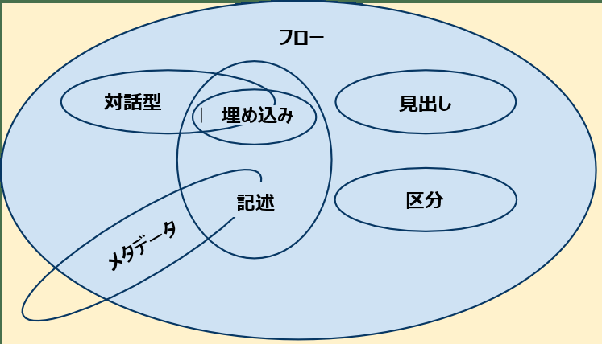

{{HTMLSidebar}}

ほとんどの [HTML](/ja/docs/Web/HTML) 要素は 1 つ以上の**コンテンツカテゴリー**に属していて、カテゴリーごとに共通した特徴を持つ要素を分類しています。これは緩やかなグループ分けです（実際にはこれらのカテゴリーの要素間の関係を作成していません）。しかし、これらは、特にその複雑な詳細に遭遇したときに、カテゴリーの共有動作とその関連ルールを定義し記述するのに役立ちます。*どの*カテゴリーにも属さない要素も存在します（{{HTMLElement("track")}} など）。

コンテンツカテゴリーは、要素のコンテンツモデル、言い換えれば各要素が子要素として取り込むことができるものを定義するために使用されます。例えば、 `<p>` 要素は記述コンテンツしか含めることができませんが、 `<div>` 要素はフローコンテンツを含めることができます。

コンテンツは 7 つのカテゴリーに分類され、以下のベン図で要約できます。



> [!NOTE]
> コンテンツカテゴリーとその機能比較についての詳細な説明は、この記事の範囲外です。詳しく知りたければ、 [HTML 仕様書の関連部分](https://html.spec.whatwg.org/multipage/dom.html#kinds-of-content)を読みましょう。

## メタデータコンテンツ

メタデータコンテンツのカテゴリーに属する要素は、表示方法や文書のその他の部分の挙動を変化させたり、他の文書へのリンクを確立させたり、その他の*本文外*の情報を伝えたりします。 {{htmlelement("head")}} の中のあらゆるものは `<title>`、`<link>`、`<script>`、`<style>`、あと利用が少ない `<base>` などがメタデータコンテンツです。 `<meta>` 要素は、他の要素で表現できないメタデータのためのものです。

メタデータ要素は次の通りです。

- {{HTMLElement("base")}}
- {{HTMLElement("link")}}
- {{HTMLElement("meta")}}
- {{HTMLElement("noscript")}}
- {{HTMLElement("script")}}
- {{HTMLElement("style")}}
- {{HTMLElement("template")}}
- {{HTMLElement("title")}}

これらの要素の一部は、複数のコンテンツカテゴリーに属しています。例えば、 `<script>` はメタデータ、フロー、および記述コンテンツカテゴリーのメンバーであり、スクリプト対応要素です。 `<script>` は、メタデータコンテンツ、記述コンテンツ、またはスクリプト対応要素が期待される場所で使用することができます。

## フローコンテンツ

フローコンテンツは、 {{HTMLElement("body")}} 要素の中に入ることができるほとんどの要素を含む広いカテゴリーで、見出し要素、区分要素、記述要素、埋め込み要素、対話的要素、フォーム関連要素などが含まれます。また、テキストノードも含まれます（ただし、ホワイトスペースのみで構成されるものは除きます）。

フローコンテンツは次の通りです。

- {{HTMLElement("a")}}
- {{HTMLElement("abbr")}}
- {{HTMLElement("address")}}
- {{HTMLElement("article")}}
- {{HTMLElement("aside")}}
- {{HTMLElement("audio")}}
- {{HTMLElement("b")}}
- {{HTMLElement("bdi")}}
- {{HTMLElement("bdo")}}
- {{HTMLElement("blockquote")}}
- {{HTMLElement("br")}}
- {{HTMLElement("button")}}
- {{HTMLElement("canvas")}}
- {{HTMLElement("cite")}}
- {{HTMLElement("code")}}
- {{HTMLElement("data")}}
- {{HTMLElement("datalist")}}
- {{HTMLElement("del")}}
- {{HTMLElement("details")}}
- {{HTMLElement("dfn")}}
- {{HTMLElement("dialog")}}
- {{HTMLElement("div")}}
- {{HTMLElement("dl")}}
- {{HTMLElement("em")}}
- {{HTMLElement("embed")}}
- {{HTMLElement("fieldset")}}
- {{HTMLElement("figure")}}
- {{HTMLElement("footer")}}
- {{HTMLElement("form")}}
- {{HTMLElement("Heading_Elements", "<code>&lt;h1&gt;</code>-<code>&lt;h6&gt;</code>")}}
- {{HTMLElement("header")}}
- {{HTMLElement("hgroup")}}
- {{HTMLElement("hr")}}
- {{HTMLElement("i")}}
- {{HTMLElement("iframe")}}
- {{HTMLElement("img")}}
- {{HTMLElement("input")}}
- {{HTMLElement("ins")}}
- {{HTMLElement("kbd")}}
- {{HTMLElement("label")}}
- {{HTMLElement("main")}}
- {{HTMLElement("map")}}
- {{HTMLElement("mark")}}
- {{MathMLElement("math")}}
- {{HTMLElement("menu")}}
- {{HTMLElement("meter")}}
- {{HTMLElement("nav")}}
- {{HTMLElement("noscript")}}
- {{HTMLElement("object")}}
- {{HTMLElement("ol")}}
- {{HTMLElement("output")}}
- {{HTMLElement("p")}}
- {{HTMLElement("picture")}}
- {{HTMLElement("pre")}}
- {{HTMLElement("progress")}}
- {{HTMLElement("q")}}
- {{HTMLElement("ruby")}}
- {{HTMLElement("s")}}
- {{HTMLElement("samp")}}
- {{HTMLElement("script")}}
- {{HTMLElement("search")}}
- {{HTMLElement("section")}}
- {{HTMLElement("select")}}
- {{HTMLElement("slot")}}
- {{HTMLElement("small")}}
- {{HTMLElement("span")}}
- {{HTMLElement("strong")}}
- {{HTMLElement("sub")}}
- {{HTMLElement("sup")}}
- {{SVGElement("svg")}}
- {{HTMLElement("table")}}
- {{HTMLElement("template")}}
- {{HTMLElement("textarea")}}
- {{HTMLElement("time")}}
- {{HTMLElement("u")}}
- {{HTMLElement("ul")}}
- {{HTMLElement("var")}}
- {{HTMLElement("video")}}
- {{HTMLElement("wbr")}}
- [自律型カスタム要素](/ja/docs/Web/API/Web_components/Using_custom_elements)
- プレーンテキスト

特定の条件が満たされている場合のみ、このカテゴリーに属する要素がいくつか存在します。

- {{HTMLElement("area")}}: {{HTMLElement("map")}} 要素の子孫の場合
- {{HTMLElement("link")}}: [`itemprop`](/ja/docs/Web/HTML/Reference/Global_attributes/itemprop) 属性がある場合
- {{HTMLElement("meta")}}: [`itemprop`](/ja/docs/Web/HTML/Reference/Global_attributes/itemprop) 属性がある場合

## 区分コンテンツ

区分コンテンツ (sectioning content) はフローコンテンツのサブセットであり、[現在のアウトライン内のセクション](/ja/docs/Web/HTML/Reference/Elements/Heading_Elements)を作成し、これが {{HTMLElement("header")}} と {{HTMLElement("footer")}} 要素の範囲を定義します。

区分要素は次の通りです。

- {{HTMLElement("article")}}
- {{HTMLElement("aside")}}
- {{HTMLElement("nav")}}
- {{HTMLElement("section")}}

## 見出しコンテンツ

見出しコンテンツ (heading content) はフローコンテンツのサブセットで、セクションのタイトルを定義します。この定義は、明示的な[区分コンテンツ](#区分コンテンツ)要素によってマークされたセクションと、見出しコンテンツ自体によって暗黙的に定義されたセクションの両方に適用されます。

見出し要素は次の通りです。

- {{HTMLElement("Heading_Elements", "<code>&lt;h1&gt;</code>-<code>&lt;h6&gt;</code>")}}
- {{HTMLElement("hgroup")}}

> [!NOTE]
> {{HTMLElement("header")}} 要素は見出しを含む可能性がありますが、それ自身は見出しコンテンツではありません。

## 記述コンテンツ

記述コンテンツ (phrasing content) は、文章とその中に含まれるマークアップを定義します。記述コンテンツの集まりで段落を構成します。

記述要素は次の通りです。

- {{HTMLElement("abbr")}}
- {{HTMLElement("audio")}}
- {{HTMLElement("b")}}
- {{HTMLElement("bdi")}}
- {{HTMLElement("bdo")}}
- {{HTMLElement("br")}}
- {{HTMLElement("button")}}
- {{HTMLElement("canvas")}}
- {{HTMLElement("cite")}}
- {{HTMLElement("code")}}
- {{HTMLElement("data")}}
- {{HTMLElement("datalist")}}
- {{HTMLElement("dfn")}}
- {{HTMLElement("em")}}
- {{HTMLElement("embed")}}
- {{HTMLElement("i")}}
- {{HTMLElement("iframe")}}
- {{HTMLElement("img")}}
- {{HTMLElement("input")}}
- {{HTMLElement("kbd")}}
- {{HTMLElement("label")}}
- {{HTMLElement("mark")}}
- {{MathMLElement("math")}}
- {{HTMLElement("meter")}}
- {{HTMLElement("noscript")}}
- {{HTMLElement("object")}}
- {{HTMLElement("output")}}
- {{HTMLElement("picture")}}
- {{HTMLElement("progress")}}
- {{HTMLElement("q")}}
- {{HTMLElement("ruby")}}
- {{HTMLElement("s")}}
- {{HTMLElement("samp")}}
- {{HTMLElement("script")}}
- {{HTMLElement("select")}}
- {{HTMLElement("slot")}}
- {{HTMLElement("small")}}
- {{HTMLElement("span")}}
- {{HTMLElement("strong")}}
- {{HTMLElement("sub")}}
- {{HTMLElement("sup")}}
- {{SVGElement("svg")}}
- {{HTMLElement("template")}}
- {{HTMLElement("textarea")}}
- {{HTMLElement("time")}}
- {{HTMLElement("u")}}
- {{HTMLElement("var")}}
- {{HTMLElement("video")}}
- {{HTMLElement("wbr")}}
- [自律型カスタム要素](/ja/docs/Web/API/Web_components/Using_custom_elements)
- プレーンテキスト

他にも特定の条件が満たされたときのみ、このカテゴリーに属する要素がいくつかあります。

- {{HTMLElement("a")}}: 記述コンテンツだけを含む場合
- {{HTMLElement("area")}}: {{HTMLElement("map")}} 要素の子孫である場合
- {{HTMLElement("del")}}: 記述コンテンツだけを含む場合
- {{HTMLElement("ins")}}: 記述コンテンツだけを含む場合
- {{HTMLElement("link")}}: [`itemprop`](/ja/docs/Web/HTML/Reference/Global_attributes/itemprop) 属性がある場合
- {{HTMLElement("map")}}: 記述コンテンツだけを含む場合
- {{HTMLElement("meta")}}: [`itemprop`](/ja/docs/Web/HTML/Reference/Global_attributes/itemprop) 属性がある場合

## 埋め込みコンテンツ

埋め込みコンテンツ (Embedded content) は、文書に他のリソースを取り込んだり、他のマークアップ言語や名前空間を挿入したりするものです。

埋め込みコンテンツの要素は、次の通りです。

- {{HTMLElement("audio")}}
- {{HTMLElement("canvas")}}
- {{HTMLElement("embed")}}
- {{HTMLElement("iframe")}}
- {{HTMLElement("img")}}
- {{MathMLElement("math")}}
- {{HTMLElement("object")}}
- {{HTMLElement("picture")}}
- {{SVGElement("svg")}}
- {{HTMLElement("video")}}

## 対話型コンテンツ

対話型コンテンツ (interactive content) にはユーザーとのやり取りのために固有にデザインされた要素が含まれます。

対話型コンテンツの要素は、次の通りです。

- {{HTMLElement("button")}}
- {{HTMLElement("details")}}
- {{HTMLElement("embed")}}
- {{HTMLElement("iframe")}}
- {{HTMLElement("label")}}
- {{HTMLElement("select")}}
- {{HTMLElement("textarea")}}

要素によっては、特定の条件下にある場合にのみこのカテゴリーに所属します。

- {{HTMLElement("a")}} に [`href`](/ja/docs/Web/HTML/Reference/Elements/a#href) 属性がある場合
- {{HTMLElement("audio")}} に [`controls`](/ja/docs/Web/HTML/Reference/Elements/audio#controls) 属性がある場合
- {{HTMLElement("img")}} に [`usemap`](/ja/docs/Web/HTML/Reference/Elements/img#usemap) 属性がある場合
- {{HTMLElement("input")}} に [`type`](/ja/docs/Web/HTML/Reference/Elements/input#type) 属性が hidden 状態ではない場合
- {{HTMLElement("object")}} に [`usemap`](/ja/docs/Web/HTML/Reference/Elements/object#usemap) 属性がある場合
- {{HTMLElement("video")}} に [`controls`](/ja/docs/Web/HTML/Reference/Elements/video#controls) 属性がある場合

## 知覚可能コンテンツ

**知覚可能コンテンツ** (palpable content) は、空でも非表示でもないコンテンツです。これは、レンダリングされ、実体のあるコンテンツです。知覚可能コンテンツは、コンテンツモデルを定義するために使用されるのではなく、一般的なルールを定義するために使用されます。コンテンツモデルが、任意のフローコンテンツまたは記述コンテンツを許可する要素は、そのコンテンツ内に、知覚可能コンテンツであり、`hidden` 属性が指定されていないノードを少なくとも 1 つ含める必要があります。

知覚可能要素は次の通りです。

- {{HTMLElement("a")}}
- {{HTMLElement("abbr")}}
- {{HTMLElement("address")}}
- {{HTMLElement("article")}}
- {{HTMLElement("aside")}}
- {{HTMLElement("b")}}
- {{HTMLElement("bdi")}}
- {{HTMLElement("bdo")}}
- {{HTMLElement("blockquote")}}
- {{HTMLElement("button")}}
- {{HTMLElement("canvas")}}
- {{HTMLElement("cite")}}
- {{HTMLElement("code")}}
- {{HTMLElement("data")}}
- {{HTMLElement("del")}}
- {{HTMLElement("details")}}
- {{HTMLElement("dfn")}}
- {{HTMLElement("div")}}
- {{HTMLElement("em")}}
- {{HTMLElement("embed")}}
- {{HTMLElement("fieldset")}}
- {{HTMLElement("footer")}}
- {{HTMLElement("figure")}}
- {{HTMLElement("form")}}
- {{HtmlElement("iframe")}}
- {{HtmlElement("img")}}
- {{HtmlElement("ins")}}
- {{HtmlElement("kbd")}}
- {{HtmlElement("label")}}
- {{HtmlElement("main")}}
- {{HtmlElement("map")}}
- {{HtmlElement("mark")}}
- {{MathMLElement("math")}}
- {{HtmlElement("meter")}}
- {{HtmlElement("nav")}}
- {{HtmlElement("object")}}
- {{HtmlElement("p")}}
- {{HtmlElement("picture")}}
- {{HtmlElement("pre")}}
- {{HtmlElement("progress")}}
- {{HtmlElement("q")}}
- {{HtmlElement("ruby")}}
- {{HtmlElement("s")}}
- {{HtmlElement("samp")}}
- {{HtmlElement("search")}}
- {{HtmlElement("section")}}
- {{HtmlElement("select")}}
- {{HtmlElement("small")}}
- {{HtmlElement("span")}}
- {{HtmlElement("strong")}}
- {{HtmlElement("sub")}}
- {{HtmlElement("sup")}}
- {{SVGElement("svg")}}
- {{HtmlElement("table")}}
- {{HtmlElement("textarea")}}
- {{HtmlElement("time")}}
- {{HtmlElement("u")}}
- {{HtmlElement("var")}}
- {{HtmlElement("video")}}
- [自律型カスタム要素](/ja/docs/Web/API/Web_components/Using_custom_elements)
- 要素間の[ホワイトスペース](/ja/docs/Glossary/Whitespace)ではないテキスト

要素によっては、特定の条件を満たした場合のみこのカテゴリーに属します。

- {{HTMLElement("audio")}}: [`controls`](/ja/docs/Web/HTML/Reference/Elements/audio#controls) 属性が存在する場合
- {{HTMLElement("dl")}}: この要素の子に 1 つ以上の名前と値のグループを含む場合
- {{HTMLElement("input")}}: [type](/ja/docs/Web/HTML/Reference/Elements/input#type) 属性が hidden の状態ではない場合
- {{HTMLElement("ol")}}: 子要素に 1 つ以上の {{HTMLElement("li")}} 要素を含む場合
- {{HTMLElement("ul")}}: 子要素に 1 つ以上の {{HTMLElement("li")}} 要素を含む場合

## スクリプト対応要素

**スクリプト対応要素** (Script-supporting elements) は、文書のレンダリング出力に直接寄与しない要素です。その代わりに、スクリプトコードを直接含むか、指定するか、あるいはスクリプトで使用されるデータを指定することにより、スクリプトに対応する役割を果たします。特定の要素のみを受け入れる要素（{{HTMLElement("li")}} 要素を受け入れる {{HTMLElement("ul")}} など）を含め、ほぼすべての要素は、スクリプト対応要素を含めることができます。

スクリプト対応要素は以下の通りです。

- {{HTMLElement("script")}}
- {{HTMLElement("template")}}

## フォーム関連コンテンツ

フォーム関連コンテンツ (form-associated content) は **form** 属性によって表される、フォームオーナーを持つ要素などです。フォームオーナーは、このカテゴリーの要素を内包する {{HTMLElement("form")}} 要素か **form** 属性で id が指定された要素です。

フォーム関連要素は次の通りです。

- {{HTMLElement("button")}}
- {{HTMLElement("fieldset")}}
- {{HTMLElement("input")}}
- {{HTMLElement("object")}}
- {{HTMLElement("output")}}
- {{HTMLElement("select")}}
- {{HTMLElement("textarea")}}
- {{HTMLElement("img")}}

このカテゴリーにはいくつかのサブカテゴリーが含まれています。

- リスト化
  - : {{domxref("HTMLFormElement.elements")}} および {{domxref("HTMLFieldSetElement.elements")}} コレクションによってリスト化される要素です。 {{HTMLElement("button")}}, {{HTMLElement("fieldset")}}, {{HTMLElement("input")}}, {{HTMLElement("object")}}, {{HTMLElement("output")}}, {{HTMLElement("select")}}, {{HTMLElement("textarea")}} などです。
- 送信可能
  - : フォームが送信 (submit) されるときにフォームデータセットを構築するために用いることができる要素です。 {{HTMLElement("button")}}, {{HTMLElement("input")}}, {{HTMLElement("select")}}, {{HTMLElement("textarea")}} などです。
- リセット可能
  - : フォームがリセットされるときに影響を受けることがある要素です。 {{HTMLElement("input")}}, {{HTMLElement("output")}}, {{HTMLElement("select")}} {{HTMLElement("textarea")}} などです。
- autocapitalize および autocorrect を継承するもの
  - : [`autocapitalize`](/ja/docs/Web/HTML/Reference/Global_attributes/autocapitalize) および [`autocorrect`](/ja/docs/Web/HTML/Reference/Global_attributes/autocorrect) 属性をフォームオーナーから継承する要素です。 {{HTMLElement("button")}}, {{HTMLElement("fieldset")}}, {{HTMLElement("input")}}, {{HTMLElement("output")}}, {{HTMLElement("select")}}, {{HTMLElement("textarea")}} などです。
- ラベル付け可能
  - : {{HTMLElement("label")}} に関連付けできる要素です。 {{HTMLElement("button")}}, {{HTMLElement("input")}} (all types other than `hidden`), {{HTMLElement("meter")}}, {{HTMLElement("output")}}, {{HTMLElement("progress")}}, {{HTMLElement("select")}}, {{HTMLElement("textarea")}} などです。

## 透過的コンテンツモデル

要素が透過的コンテンツモデル (transparent content model) を持っている場合、透過的な要素が削除されたり、子要素で置き換えられたりしても、それ自身のコンテンツが必ず妥当な HTML として構造化されているものです。

例えば、 {{HTMLElement("del")}} と {{HTMLELement("ins")}} 要素は透過的です。

```html
<p><del>買い物</del><ins>返品</ins>リスト</p>
<ul>
  <del>
    <li>オレンジ</li>
    <li>トイレットペーパー</li>
  </del>
  <li>歯磨き</li>
</ul>
```

これらの要素が削除されたとしても、この断片は（文章としては正しくありませんが）妥当な HTML です。

```html
<p>買い物返品リスト</p>
<ul>
  <li>オレンジ</li>
  <li>トイレットペーパー</li>
  <li>歯磨き</li>
</ul>
```
