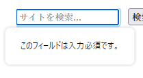

{{HTMLSidebar}}

{{HTMLElement("input")}} 要素の **`search`** 型は、ユーザーが検索クエリーを入力するために設計されたテキスト入力欄です。 [`text`](/ja/docs/Web/HTML/Reference/Elements/input/text) 入力欄と機能的には同じですが、{{Glossary("User agent", "ユーザーエージェント")}}は別なスタイルを適用するかもしれません。

{{InteractiveExample("HTML デモ: &lt;input type=&quot;search&quot;&gt;", "tabbed-standard")}}

```html interactive-example
<label for="site-search">Search the site:</label>
<input type="search" id="site-search" name="q" />

<button>Search</button>
```

```css interactive-example
label {
  display: block;
  font:
    1rem "Fira Sans",
    sans-serif;
}

input,
label {
  margin: 0.4rem 0;
}
```

## 値

[`value`](/ja/docs/Web/HTML/Reference/Elements/input#value) 属性は、テキスト入力欄に入力された現在のテキストの値が入っている文字列です。 JavaScript では [`HTMLInputElement.value`](/ja/docs/Web/API/HTMLInputElement/value) プロパティを使ってこれを受け取ることができます。

```js
searchTerms = mySearch.value;
```

入力欄に検証の制約がない場合（詳しくは[検証](#検証)を参照）、値は任意の文字列又は空文字列 (`""`) になることがあります。

## 追加の属性

[グローバル属性](/ja/docs/Web/HTML/Reference/Global_attributes)および、型に関係なくすべての {{HTMLElement("input")}} 要素を操作する属性に加え、`search` 型の入力欄は次の属性にも対応しています。

### list

list 属性の値は、同じ文書内にある {{HTMLElement("datalist")}} 要素の {{domxref("Element.id", "id")}} です。 {{HTMLElement("datalist")}} は、この入力欄でユーザーに提案するための事前定義された値のリストを提供します。リストの中の値のうち [`type`](/ja/docs/Web/HTML/Reference/Elements/input#type) と互換性のないものは、提案されるオプションには含まれません。提供される値は提案であり、要件ではありません。ユーザーはこの定義済みリストから選択することも、異なる値を提供することもできます。

### maxlength

ユーザーが検索フィールドに入力することができる（UTF-16 コード単位での）最大文字列長です。 0 以上の整数値である必要があります。 `maxlength` が指定されていないか、無効な値が指定されていると、検索フィールドには最大文字数が設定されません。この値は `minlength` の値以上である必要もあります。

フィールドに入力されたテキストの長さが UTF-16 コード単位で `maxlength` の長さを超えていると、その入力欄は[制約検証](/ja/docs/Web/HTML/Guides/Constraint_validation)に失敗します。制約検証はユーザーが値を変更した場合にのみ適用されます。

### minlength

ユーザーが検索フィールドに入力することができる（UTF-16 コード単位での）最小文字列長です。これは非負の整数値で、 `maxlength` で指定された値以下である必要があります。 `minlength` が指定されていないか、無効な値が指定されていると、検索フィールドには最小文字数が設定されません。

入力欄のテキスト値の長さが UTF-16 コード単位で `minlength` の長さよりも短いと、その検索フィールドは[制約検証](/ja/docs/Web/HTML/Guides/Constraint_validation)に失敗します。制約検証はユーザーが値を変更した場合にのみ適用されます。

### pattern

`pattern` 属性は、指定する場合は正規表現であり、入力欄の [`value`](/ja/docs/Web/HTML/Reference/Elements/input#value) が[制約検証](/ja/docs/Web/HTML/Guides/Constraint_validation)に合格するためにはこれと一致しなければなりません。これは {{jsxref("RegExp")}} 型で使用される JavaScript の妥当な正規表現である必要があり、これは[正規表現のガイド](/ja/docs/Web/JavaScript/Guide/Regular_expressions)で記述されています。正規表現がコンパイルされるときに `'u'` フラグが指定されるので、パターンは {{Glossary("ASCII")}} ではなく Unicode コードポイントの並びとして扱われます。パターンのテキストをスラッシュで囲んではいけません。

指定されたパターンがないかか無効である場合は、正規表現は適用されず、この属性は完全に無視されます。

> [!NOTE]
> [`title`](/ja/docs/Web/HTML/Reference/Elements/input#title) 属性を使用してテキストを指定すると、多くのブラウザーでパターンに一致する要件が何であるかを説明するツールチップを表示することができます。近くに他の説明テキストを配置する必要があります。

詳細や例については[パターンの指定](#パターンの指定)を参照してください。

### placeholder

`placeholder` 属性は文字列で、その欄にどのような種類の情報が求められるかについてのユーザーに対する短いヒントを提供します。これは求められるデータの種類を紹介する一語または短い句であり、説明的なメッセージではありません。テキストには改行を含めることは<em>できません</em>。

コントロールの内容がある書字方向（{{Glossary("LTR")}} または {{Glossary("RTL")}}) であるものの、プレイスホルダーを逆の方向に表示する必要がある場合、 Unicode 双方向アルゴリズム書式文字を使用してプレイスホルダーの中で書字方向を上書きすることができます。詳しくは、[双方向テキストでの Unicode コードの使い方（英語）](https://www.w3.org/International/questions/qa-bidi-unicode-controls)を参照してください。

> [!NOTE]
> 可能であれば `placeholder` を使用することは避けてください。フォームを説明する他の方法ほど意味論的に有益ではなく、コンテンツに予期しない技術的な問題を引き起こす可能性があります。詳しくは、[`<input>` のラベル](/ja/docs/Web/HTML/Reference/Elements/input#ラベル)を参照してください。

### readonly

論理属性で、存在すれば、ユーザーが編集することができないことを表します。しかし、 `value` は、 JavaScript コードから直接 {{domxref("HTMLInputElement")}} の `value` プロパティを設定することで変更することができます。

> [!NOTE]
> 読み取り専用フィールドは値を持てないため、 `required` は `readonly` 属性も指定されている入力欄には効果がありません。

### size

`size` 属性は数値であり、入力欄の幅を何文字分とするかを示します。値はゼロより大きな数値である必要があり、既定値は 20 です。文字の幅は様々であるため、これは正確ではない可能性もあり、依存することはできません。結果の入力欄は文字数やフォント（使用中の {{cssxref("font")}} 設定）によって、指定された文字数より狭くなったり広くなったりすることがあります。

これはユーザーがフィールドに入力することができる文字数の制限を設定するものではありません。これは一度に見える文字数をおよそ指定するだけです。入力データの長さの上限を設定するには、 [`maxlength`](#maxlength) 属性を使用してください。

### spellcheck

[`spellcheck`](/ja/docs/Web/HTML/Reference/Global_attributes/spellcheck) はグローバル属性で、要素でスペルチェックを有効にするかどうかを示します。内容が編集可能なものすべてに使用することができますが、ここでは `spellcheck` 属性の {{HTMLElement("input")}} 要素の使用に関して特に考えます。 `spellcheck` で利用できる値は次の通りです。

- `false`
  - : この要素でスペルチェックを無効にします。
- `true`
  - : この要素でスペルチェックを有効にします。
- ""（空文字列) または値なし
  - : スペルチェックについて、要素の既定の動作に従います。これは親の `spellcheck` 設定や、その他の要因に基づくことがあります。

入力欄では、 [readonly](#readonly) 属性が設定されておらず、かつ無効になっていない場合にスペルチェックを有効にすることができます。

`spellcheck` を読み取ることで返される値は、{{Glossary("User agent", "ユーザーエージェント")}}の設定によって上書きされる場合、コントロール内のスペルチェックの実際の状態を反映しない可能性があります。

## 標準外の属性

以下の標準外の属性が検索入力フィールドで利用できます。
できれば使用することを避けてください。

### incremental

論理属性 `incremental` は WebKit および Blink 拡張で（そのため Safari, Opera, Chrome, などが対応）、もし存在すれば、{{Glossary("User agent", "ユーザーエージェント")}}に入力をライブ検索として処理します。ユーザーがフィールドの値を編集すると、ユーザーエージェントは {{domxref("HTMLInputElement/search_event", "search")}} イベントを検索ボックスを表す {{domxref("HTMLInputElement")}} オブジェクトへ送信します。これにより、ユーザーが検索を編集するたびに、コードからリアルタイムに検索結果を更新することができます。

`incremental` が指定されていない場合、 {{domxref("HTMLInputElement/search_event", "search")}} イベントはユーザーが明示的に検索を実行した時のみ（フィールドを編集中に <kbd>Enter</kbd> または <kbd>Return</kbd> キーを押すなど) 送信されます。

`search` イベントは発生頻度が制限されているため、実装により定義された間隔よりも頻繁に送信されることはありません。

### results

`results` 属性は、 Safari のみが対応していますが、数値で {{HTMLElement("input")}} 要素が本来持っている過去の検索クエリーのドロップダウンメニューに表示される項目の最大数を上書きします。

値は非負の10進数でなければなりません。提供されなかった場合、または無効な値が指定された場合、ブラウザー既定の項目の最大数が使用されます。

## 検索入力欄の使用

`search` 型の `<input>` 要素は、 `text` 型ととても似ていますが、検索語を扱うことに特化している点が異なります。どちらも基本的には同じ動作をしますが、ユーザーエージェントによっては既定で異なるスタイルを選択するかもしれません（そしてもちろん、サイトは独自のスタイルを適用することができます）。

### 基本的な例

```html
<form>
  <div>
    <input type="search" id="mySearch" name="q" />
    <button>検索</button>
  </div>
</form>
```

次のように表示されます。

{{EmbedLiveSample("Basic_example", 600, 40)}}

`q` は検索入力に与えられる最も一般的な `name` ですが、そうする必要があるわけではありません。送信すると、サーバーに送信されるデータの名前と値の組は `q=検索語` となります。

> [!NOTE]
> 入力欄に [`name`](/ja/docs/Web/HTML/Reference/Elements/input#name) を設定することを忘れないでください。そうしないと送信されません。

### search 型と text 型の違い

主な違いはブラウザーによる扱い方です。特筆するべき最初のことは、ブラウザーによっては×印を表示して、クリックすると簡単に検索語を削除できることです。次のスクリーンショットは Chrome のものです。


加えて、最近のブラウザーは以前ドメイン内で入力された検索語を自動的に格納し、そのドメインの検索入力欄で従属的な検索が行われたときに、自動補完オプションに上がってくるようにする傾向があります。これは同じ又は似た検索を繰り返して行う傾向があるユーザーにとって便利です。次のスクリーンショットは Firefox のものです。


この点について、検索フォームに適用することができる有用なテクニックを見てみましょう。

### プレイスホルダーの設定

[`placeholder`](/ja/docs/Web/HTML/Reference/Elements/input#placeholder) 属性を使用して、テキスト入力欄の内部に有用なプレイスホルダーを提供することで、何を入力すればよいかのヒントを提供することができます。次の例を見てください。

```html
<form>
  <div>
    <input type="search" id="mySearch" name="q" placeholder="サイトを検索..." />
    <button>検索</button>
  </div>
</form>
```

プレイスホルダーの表示方法を以下で確認できます。

{{EmbedLiveSample("Setting_placeholders", 600, 40)}}

### 検索フォームのラベルとアクセシビリティ

検索フォームの一つの問題はアクセシビリティです。一般的なデザインの慣例では、検索フィールドにハラベルがなく（虫眼鏡のアイコンや同類のものはあります）、よく見えるユーザーには、その配置から検索フォームの目的が明確に分かります（[この例ではよくあるパターンを示しています](https://mdn.github.io/learning-area/accessibility/aria/website-aria-roles/))。

しかし、これは、検索入力が何であるかを言葉で示していないため、スクリーンリーダーの利用者に混乱を引き起こす可能性があります。 ビジュアルデザインに影響を与えないでこれを解決する方法として、 [WAI-ARIA](/ja/docs/Learn_web_development/Core/Accessibility/WAI-ARIA_basics) の機能を使用することができます。

- `<form>` フォームの `role` 属性の値が `search` であると、スクリーンリーダーがフォームが検索フォームであることをアナウンスします。
- これで十分ではない場合、 {{HTMLElement("input")}} 自身の [`aria-label`](/ja/docs/Web/Accessibility/ARIA/Reference/Attributes/aria-label) 属性を使用することができます。これはスクリーンリーダーによって読み上げられ説明的なテキストラベルです。これは非視覚的な `<label>` と同等のものです。

例を見てみましょう。

```html
<form role="search">
  <div>
    <input
      type="search"
      id="mySearch"
      name="q"
      placeholder="サイトを検索..."
      aria-label="Search through site content" />
    <button>検索</button>
  </div>
</form>
```

プレイスホルダーがどう表示されるかを以下で確認できます。

{{EmbedLiveSample("Search_form_labels_and_accessibility", 600, 40)}}

前回の例から見かけ上の違いはありませんが、スクリーンリーダーのユーザーは追加情報を得る方法があります。

> [!NOTE]
> このようなアクセシビリティ機能の詳細ついては、[道しるべ/ランドマーク](/ja/docs/Learn_web_development/Core/Accessibility/WAI-ARIA_basics#道しるべランドマーク_signpostlandmark)をご覧ください。

### 物理的な入力要素の寸法

入力ボックスの物理的な寸法は、 [`size`](/ja/docs/Web/HTML/Reference/Elements/input#size) 属性を使って制御することができます。これによって、テキスト入力欄が一度に表示できる文字数を指定することができます。これは要素の幅に影響し、幅をピクセル数ではなく文字数で指定することができます。例えば、この例の中では、入力欄は30文字の幅です。

```html
<form>
  <div>
    <input
      type="search"
      id="mySearch"
      name="q"
      placeholder="サイトを検索..."
      size="30" />
    <button>検索</button>
  </div>
</form>
```

結果はこの広い入力ボックスになります。

{{ EmbedLiveSample('Physical_input_element_size', 600, 40) }}

## 検証

`search` 型の `<input>` 要素は、通常の `text` 入力欄と同じ検証機能が利用できます。一般に検索ボックスに検証機能を使うことはあまりないでしょう。多くの場合、ユーザーは何でも入力できますが、既存の形式のデータに対して検索を行う場合など、考慮するべきケースも多少あります。

> [!NOTE]
> HTML のフォーム検証は、入力されたデータが正しい形式であることを保証するサーバースクリプトの代用には*なりません*。 HTML を調整して検証をくぐり抜けたり、完全に削除したりすることはとても簡単にできます。 HTML を完全にバイパスし、サーバーに直接データを送信することも可能です。サーバー側のコードが受信したデータの検証に失敗した場合、不適切な形式のデータ（または大きすぎるデータ、間違った種類のデータなど）がデータベースに入力された場合に災害が発生するおそれがあります。

### スタイルにおけるメモ

ユーザーにとって値が妥当かそうでないかが分かりやすくなるように、フォーム要素のスタイル付けに便利な擬似クラスが利用できます。 {{cssxref(":valid")}} および {{cssxref(":invalid")}} です。この節では、以下の CSS を使用して入力欄の値が妥当であれば隣にチェックマークを表示し、妥当な値でなければ隣にバツ（X) マークを表示します。

```css
input:invalid ~ span::after {
  content: "✖";
  padding-left: 5px;
  position: absolute;
}

input:valid ~ span::after {
  content: "✓";
  padding-left: 5px;
  position: absolute;
}
```

このテクニックにはフォーム要素の後に配置される {{htmlelement("span")}} 要素も必要で、これがアイコンのホルダーとして動作します。ブラウザーによっては一部の入力型で、直後に配置されたアイコンをうまく表示できないことがあるのでこれが必要です。

### 入力を必須にする

入力を行わないとフォームの送信が許可されないようにするための簡単な方法として、 [`required`](/ja/docs/Web/HTML/Reference/Elements/input#required) 属性を使うことができます。

```html
<form>
  <div>
    <input
      type="search"
      id="mySearch"
      name="q"
      placeholder="サイトを検索..."
      required />
    <button>検索</button>
    <span class="validity"></span>
  </div>
</form>
```

```css hidden
input {
  margin-right: 10px;
}

input:invalid ~ span::after {
  content: "✖";
  padding-left: 5px;
  position: absolute;
}

input:valid ~ span::after {
  content: "✓";
  padding-left: 5px;
  position: absolute;
}
```

次のように表示されます。

{{ EmbedLiveSample('Making_input_required', 600, 40) }}

加えて、何も検索語を入力せずに送信しようとすると、ブラウザーがメッセージを表示します。以下のものは Firefox の例です。



入力欄の中に無効な異なるデータ型を持つフォームを送信しようとすれば、下記の例のように、異なるメッセージが表示されるでしょう。

### 入力値の長さ

[`minlength`](/ja/docs/Web/HTML/Reference/Elements/input#minlength) 属性を使用して入力された値の最小の長さ（文字数）を指定することができます。同様に、 [`maxlength`](/ja/docs/Web/HTML/Reference/Elements/input#maxlength) を使用して入力された値の最大長を文字数で設定します。

以下の例では、入力値が 4 ～ 8 文字の長さであることが求められます。

```html
<form>
  <div>
    <label for="mySearch">ユーザーを検索</label>
    <input
      type="search"
      id="mySearch"
      name="q"
      placeholder="ユーザー ID は 4～8 文字です"
      required
      size="30"
      minlength="4"
      maxlength="8" />
    <button>検索</button>
    <span class="validity"></span>
  </div>
</form>
```

```css hidden
input {
  margin-right: 10px;
}

input:invalid ~ span::after {
  content: "✖";
  padding-left: 5px;
  position: absolute;
}

input:valid ~ span::after {
  content: "✓";
  padding-left: 5px;
  position: absolute;
}
```

This renders like so:

{{ EmbedLiveSample('Input_value_length', 600, 40) }}

4 文字未満でフォームを送信しようとすると、適切なエラーメッセージが表示されます（ブラウザーによって異なります)。 8 文字を超えて入力しようとしても、ブラウザーが許しません。

### パターンの指定

[`pattern`](/ja/docs/Web/HTML/Reference/Elements/input#pattern) 属性を使用して、入力値が妥当と判断されるために一致しなければならない正規表現を指定することができます（入力値を検証するために正規表現を使うための短期コースは[正規表現による検証](/ja/docs/Learn_web_development/Extensions/Forms/Form_validation#validating_against_a_regular_expression)をご覧ください）。

例を見てみましょう。製品 ID の検索フォームを提供し、 ID はすべてが2文字の英字に続いて4桁の番号です。以下の例でそれに対応します。

```html
<form>
  <div>
    <label for="mySearch">製品 ID で検索:</label>
    <input
      type="search"
      id="mySearch"
      name="q"
      placeholder="2 文字に続いて 4 桁の数字"
      required
      size="30"
      pattern="[A-z]{2}[0-9]{4}" />
    <button>検索</button>
    <span class="validity"></span>
  </div>
</form>
```

```css hidden
input {
  margin-right: 10px;
}

input:invalid ~ span::after {
  content: "✖";
  padding-left: 5px;
  position: absolute;
}

input:valid ~ span::after {
  content: "✓";
  padding-left: 5px;
  position: absolute;
}
```

次のように表示されます。

{{ EmbedLiveSample('Specifying_a_pattern', 600, 40) }}

## 例

[website-aria-roles](https://github.com/mdn/learning-area/tree/main/accessibility/aria/website-aria-roles) の例ので使用した検索フォーム（[ライブで見る](https://mdn.github.io/learning-area/accessibility/aria/website-aria-roles/)）が良い例です。

## 技術的概要

<table class="properties">
  <tbody>
    <tr>
      <td><strong><a href="#値">値</a></strong></td>
      <td>
        検索フィールドに入っている値を表す文字列。
      </td>
    </tr>
    <tr>
      <td><strong>イベント</strong></td>
      <td>
        {{domxref("HTMLElement/change_event", "change")}} および
        {{domxref("Element/input_event", "input")}}
      </td>
    </tr>
    <tr>
      <td><strong>対応している共通属性</strong></td>
      <td>
        <a href="/ja/docs/Web/HTML/Reference/Elements/input#autocomplete"><code>autocomplete</code></a>,
        <a href="/ja/docs/Web/HTML/Reference/Elements/input#list"><code>list</code></a>,
        <a href="/ja/docs/Web/HTML/Reference/Elements/input#maxlength"><code>maxlength</code></a>,
        <a href="/ja/docs/Web/HTML/Reference/Elements/input#minlength"><code>minlength</code></a>,
        <a href="/ja/docs/Web/HTML/Reference/Elements/input#pattern"><code>pattern</code></a>,
        <a href="/ja/docs/Web/HTML/Reference/Elements/input#placeholder"><code>placeholder</code></a>,
        <a href="/ja/docs/Web/HTML/Reference/Elements/input#required"><code>required</code></a>,
        <a href="/ja/docs/Web/HTML/Reference/Elements/input#size"><code>size</code></a>
      </td>
    </tr>
    <tr>
      <td><strong>IDL 属性</strong></td>
      <td><code>value</code></td>
    </tr>
    <tr>
      <td><strong>DOM インターフェイス</strong></td>
      <td><p>{{domxref("HTMLInputElement")}}</p></td>
    </tr>
    <tr>
      <td><strong>メソッド</strong></td>
      <td>
        {{domxref("HTMLInputElement.select", "select()")}},
        {{domxref("HTMLInputElement.setRangeText", "setRangeText()")}},
        {{domxref("HTMLInputElement.setSelectionRange", "setSelectionRange()")}}
      </td>
    </tr>
     <tr>
      <td><strong>暗黙の ARIA ロール</strong></td>
      <td><code>list</code> 属性がない場合: <code><a href="/ja/docs/Web/Accessibility/ARIA/Reference/Roles/searchbox_role">searchbox</a></code></td>
      <td><code>list</code> 属性がある場合: <code><a href="/ja/docs/Web/Accessibility/ARIA/Reference/Roles/combobox_role">combobox</a></code></td>
    </tr>
  </tbody>
</table>

## 仕様書

{{Specifications}}

## ブラウザーの互換性

{{Compat}}

## 関連情報

- [HTML Forms](/ja/docs/Learn_web_development/Extensions/Forms)
- {{HTMLElement("input")}} および {{domxref("HTMLInputElement")}} インターフェイスに基づいています。
- [`<input type="text">`](/ja/docs/Web/HTML/Reference/Elements/input/text)
