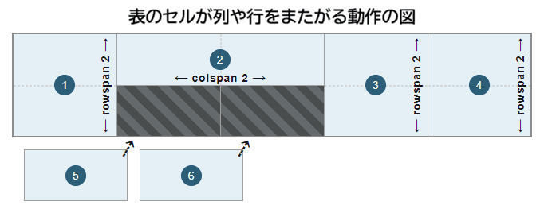

**`<th>`** は [HTML](/ja/docs/Web/HTML) の要素で、表のセルのグループ用の見出しであるセルを定義します。このグループの正確な性質は、[`scope`](#scope) 属性と [`headers`](#headers) 属性で定義します。

{{InteractiveExample("HTML デモ: &lt;th&gt;", "tabbed-taller")}}

```html interactive-example
<table>
  <caption>
    Alien football stars
  </caption>
  <thead>
    <tr>
      <th scope="col">Player</th>
      <th scope="col">Gloobles</th>
      <th scope="col">Za'taak</th>
    </tr>
  </thead>
  <tbody>
    <tr>
      <th scope="row">TR-7</th>
      <td>7</td>
      <td>4,569</td>
    </tr>
    <tr>
      <th scope="row">Khiresh Odo</th>
      <td>7</td>
      <td>7,223</td>
    </tr>
    <tr>
      <th scope="row">Mia Oolong</th>
      <td>9</td>
      <td>6,219</td>
    </tr>
  </tbody>
</table>
```

```css interactive-example
th,
td {
  border: 1px solid rgb(160 160 160);
  padding: 8px 10px;
}

th[scope="col"] {
  background-color: #505050;
  color: white;
}

th[scope="row"] {
  background-color: #d6ecd4;
}

td {
  text-align: center;
}

tr:nth-of-type(even) {
  background-color: #eeeeee;
}

table {
  border-collapse: collapse;
  border: 2px solid rgb(140 140 140);
  font-family: sans-serif;
  font-size: 0.8rem;
  letter-spacing: 1px;
}

caption {
  caption-side: bottom;
  padding: 10px;
}
```

## 属性

この要素には[グローバル属性](/ja/docs/Web/HTML/Reference/Global_attributes)があります。

- `abbr`
  - : 見出しセルのコンテンツについて、簡潔に要約した説明です。これは、他のコンテキストでそのセルを参照する際に使用する代替ラベルとして提供されます。スクリーンリーダーなどの一部のユーザーエージェントでは、この説明をコンテンツ本体の前に表示することがあります。
- `colspan`
  - : 負でない整数で、この見出しセルをいくつの列に広げるかを示します。デフォルト値は `1` です。1000 を超える値は正しくないとみなされ、デフォルト値 `1` が設定されるでしょう。
- `headers`
  - : 空白区切りの一連の文字列で、この見出しセルの見出しを提供する `<th>` 要素の `id` 属性に対応します。
- `rowspan`
  - : 負ではない整数で、この見出しセルをいくつの行に広げるかを示します。デフォルト値は `1` です。`0` を設定した場合は、セルが属する表セクション ({{HTMLElement("thead")}}, {{HTMLElement("tbody")}}, {{HTMLElement("tfoot")}}, 暗黙的に定義されたものも含む) の終端まで拡張します。`65534` より大きな値は、`65534` に切り詰められます。
- `scope`
  - : `<th>`要素で定義された見出しに関連するセルを指定します。{{Glossary("enumerated", "列挙型")}}で指定できる値は以下の通りです。
    - `row`: この見出しはその行に属するすべてのセルに関連します。
    - `col`: この見出しはその列に属するすべてのセルに関連します。
    - `rowgroup`: この見出しは行グループに属し、その中のすべてのセルに関連します。
    - `colgroup`: この見出しは列グループに属し、その中のすべてのセルに関連します。

    もし `scope` 属性が指定されていないか、その値が `row`, `col`, `rowgroup`, `colgroup` でない場合は、ブラウザーは自動的に見出しセルが適用されるセルの集合を選択します。

### 非推奨の属性

以下の属性は非推奨となっており、使用しないでください。これらは、既存のコードを更新する際の参考として、また歴史的な興味のためだけに文書化されています。

- `align` {{deprecated_inline}}
  - : 見出しセルの水平方向の配置を指定します。指定可能な値は、`left`、`center`、`right`、`justify`、`char` です。対応している場合、`char` 値を指定すると、テキストコンテンツは [`char`](#char) 属性で定義された文字と、[`charoff`](#charoff) 属性で定義されたオフセットに基づいて配置されます。この属性は非推奨となっているため、代わりに {{cssxref("text-align")}} CSS プロパティを使用してください。

- `axis` {{deprecated_inline}}
  - : 空白区切りの一連の文字列が含まれており、それぞれが見出しセルが適用されるセルグループの `id` 属性に対応しています。この属性は非推奨となっているため、代わりに [`scope`](#scope) 属性を使用してください。

- `bgcolor` {{deprecated_inline}}
  - : 見出しセルの背景色を定義します。値は HTML 色を表し、`#` で始まる [6 桁の 16 進 RGB コード](/ja/docs/Web/CSS/Reference/Values/hex-color)か、[色キーワード](/ja/docs/Web/CSS/Reference/Values/named-color)のいずれかです。その他の CSS {{cssxref("&lt;color&gt;")}} 値には対応していません。この属性は非推奨となっているため、代わりに CSS {{cssxref("background-color")}} プロパティを使用してください。

- `char` {{deprecated_inline}}
  - : 何もしません。この属性は、列内のセルで揃える文字を設定するためのものでした。典型的な値に、数値や金額を揃えようとするときのピリオド (`.`) があります。 [`align`](#align) 属性を `char` に設定していない場合は、この属性は無視されます。

- `charoff` {{deprecated_inline}}
  - : もともとは、[`char`](#char) 属性で指定された揃え文字から、見出しセルのコンテンツをオフセットする文字数を指定するためのものでした。

- `height` {{deprecated_inline}}
  - : 推奨される見出しセルの高さを定義します。この属性は非推奨となっているため、代わりに CSS の {{cssxref("height")}} プロパティを使用してください。

- `valign` {{deprecated_inline}}
  - : 見出しセルの垂直方向の配置を指定します。指定可能な値は `baseline`、`bottom`、`middle`、`top` です。この属性は非推奨となっているため、代わりに CSS の {{cssxref("vertical-align")}} プロパティを使用してください。

- `width` {{deprecated_inline}}
  - : 推奨される見出しセルの幅を定義します。この属性は非推奨となっているため、代わりに CSS の {{cssxref("width")}} プロパティを使用してください。

## 使用上のメモ

- `<th>` は、{{HTMLElement("tr")}} 要素内でのみ使用できます。
- 単純なコンテキストでは、見出しセル（`<th>` 要素）に [`scope`](#scope) 属性を指定することは、[`scope`](#scope) が推論されるため、冗長となります。しかし、一部の支援技術では正しく推論できない場合があるため、見出しのスコープを明示的に指定することで、ユーザーの使い勝手が改善する可能性があります。
- [`colspan`](#colspan) および [`rowspan`](#rowspan) 属性を使用して見出しセルを複数の列や行にまたがって配置する場合、これらの属性が定義されていないセル（デフォルト値は `1`）は、次の図に示すように、テーブル構造内の 1x1 セル分の余白に自動的に配置されます。

  

  > [!NOTE]
  > これらの属性は、セルを重ね合わせるために使用することはできません。

## 例

一般的な標準や最善の手法を紹介する完全な表の例については、{{HTMLElement("table")}} をご覧ください。

### 基本的な列見出しと行見出し

この例では、基本的な表構造において、`<th>` 要素を使用して列見出しと行見出しを設定しています。

#### HTML

1 行目（{{HTMLElement("tr")}} 要素）には、列見出し（`<th>` 要素）が含まれています。これらは列の「タイトル」として機能し、列内の情報を理解しやすくし、データを識別しやすくします。それぞれの列見出しが、対応する列のすべてのセルに関連していることを示すため、[`scope`](#scope) 属性は `col` （列）に設定されています。

残りの行には、表の主要なデータが含まれています。これらのそれぞれの行には、最初のセルとして行見出し（`<th>` 要素）が配置されています。これにより、行見出しを含む列が表の最初の列として生成されます。列見出しと同様に、[`scope`](#scope) 属性を `row` に設定することで、それぞれの行見出しがどのセルに関連するかを指定します。下記例では、それぞれの `row` 内のすべてのデータセル（{{HTMLElement("td")}} 要素）が対象となります。

> [!NOTE]
> 通常は、グループ化要素である {{HTMLElement("thead")}} および {{HTMLElement("tbody")}} を使用して、見出しのある行を表の頭部と本体部にそれぞれまとめます。この例では、複雑さを避け、見出しセルを使用することができるため、これらの要素は除外されています。

```html
<table>
  <tr>
    <th scope="col">記号</th>
    <th scope="col">コード語</th>
    <th scope="col">発音</th>
  </tr>
  <tr>
    <th scope="row">A</th>
    <td>Alfa</td>
    <td>AL fah</td>
  </tr>
  <tr>
    <th scope="row">B</th>
    <td>Bravo</td>
    <td>BRAH voh</td>
  </tr>
  <tr>
    <th scope="row">C</th>
    <td>Charlie</td>
    <td>CHAR lee</td>
  </tr>
  <tr>
    <th scope="row">D</th>
    <td>Delta</td>
    <td>DELL tah</td>
  </tr>
</table>
```

#### CSS

表とセルにスタイルを設定するために、基本的な CSS が使用されています。CSS の[属性セレクター](/ja/docs/Web/CSS/Reference/Selectors/Attribute_selectors)を使用して、[`scope`](#scope) 属性の値に基づいて見出しセルを指定し、列見出しと行見出し（`<th>` 要素）を強調表示するとともに、それら同士やデータセル ({{HTMLElement("td")}}) との区別を図っています。

```css
th,
td {
  border: 1px solid rgb(160 160 160);
  padding: 8px 10px;
}

th[scope="col"] {
  background-color: #505050;
  color: white;
}

th[scope="row"] {
  background-color: #d6ecd4;
}

tr:nth-of-type(odd) td {
  background-color: #eeeeee;
}
```

```css hidden
table {
  border-collapse: collapse;
  border: 2px solid rgb(140 140 140);
  font-family: sans-serif;
  font-size: 0.8rem;
  letter-spacing: 1px;
}
```

#### 結果

{{EmbedLiveSample("Basic_column_and_row_headers", 650, 170)}}

### 列と行をまたがらせる

この例では、[前回の例](#基本的な列見出しと行見出し)の基本となる表に、追加の列見出し用の 2 行目を加えることで、機能を拡張・強化しています。

#### HTML

表の 2 行目の見出し行として、追加の行（{{HTMLElement("tr")}} 要素）を追加し、そこに 2 つの列見出し（`<th>` 要素）を追加しています。この方法で、「発音」列は 2 つの列に分割されます。1つはIPA（国際音声記号）表記用、もう1つはスペル表記（元の発音列）用です。対応するデータセル（{{HTMLElement(「td」)}}要素）が、その後のそれぞれの行に追加されます。

[使用上のメモ](#使用上のメモ)に示されているように、`<th>` 要素では、[`colspan`](#colspan) および [`rowspan`](#rowspan) 属性を使用することができます。これにより、見出しセルを適切な列や行に配置することができます。表構造で「2 行」の見出しを実現するには、最初の {{HTMLElement("tr")}} 要素内の最初の 2 つの見出しセルを 2 行にわたってまたがらせます。3 つ目の見出しセルは 2 列幅で配置されます（1 行目に残ります）。この設定により、2 行目の 3 列目と 4 列目に 2 つの空き領域が確保され、2 番目の{{HTMLElement("tr")}} 要素内の 2 つの見出しが自動的に配置されます。この際、[`colspan`](#colspan) および [`rowspan`](#rowspan) 属性のデフォルト値は `1` となります。

> [!NOTE]
> 通常は、{{HTMLElement("thead")}} および {{HTMLElement("tbody")}} 要素を使用して、見出しのある行を、それぞれ表の頭部と本体部にまとめます。この例では、見出しとスパンに焦点を当て、例を簡潔にするため、これらは実装されていません。

```html
<table>
  <tr>
    <th scope="col" rowspan="2">記号</th>
    <th scope="col" rowspan="2">コード語</th>
    <th scope="col" colspan="2">発音</th>
  </tr>
  <tr>
    <th scope="col">発音記号</th>
    <th scope="col">スペル表現</th>
  </tr>
  <tr>
    <th scope="row">A</th>
    <td>Alfa</td>
    <td>ˈælfa</td>
    <td>AL fah</td>
  </tr>
  <tr>
    <th scope="row">B</th>
    <td>Bravo</td>
    <td>ˈbraːˈvo</td>
    <td>BRAH voh</td>
  </tr>
  <tr>
    <th scope="row">C</th>
    <td>Charlie</td>
    <td>ˈtʃɑːli</td>
    <td>CHAR lee</td>
  </tr>
  <tr>
    <th scope="row">D</th>
    <td>Delta</td>
    <td>ˈdeltɑ</td>
    <td>DELL tah</td>
  </tr>
</table>
```

#### CSS

CSS は[前回の例](#基本的な列見出しと行見出し)から変更されていません。

```css hidden
table {
  border-collapse: collapse;
  border: 2px solid rgb(140 140 140);
  font-family: sans-serif;
  font-size: 0.8rem;
  letter-spacing: 1px;
}

th,
td {
  border: 1px solid rgb(160 160 160);
  padding: 8px 10px;
}

th[scope="col"] {
  background-color: #505050;
  color: white;
}

th[scope="row"] {
  background-color: #d6ecd4;
}

tr:nth-of-type(odd) td {
  background-color: #eeeeee;
}
```

#### 結果

{{EmbedLiveSample("Column_and_row_spanning", 650, 200)}}

### 見出しセルを他の見出しセルに関連付ける

見出しセル間の関係がより複雑な場合、[`scope`](#scope) 属性のみを指定した `th` 要素を使用するだけでは、支援技術、特にスクリーンリーダーにとって不十分であることがあります。

#### HTML

[前回の例](#column_and_row_spanning)の{{Glossary("accessibility", "アクセシビリティ")}}を向上させ、例えばスクリーンリーダーがそれぞれの見出しセルに関連付けられたヘッダーを読み上げることができるようにするには、[`headers`](#headers) 属性を [`id`](/ja/docs/Web/HTML/Reference/Global_attributes/id) 属性と共に導入することができます。この例では、「発音」列が2つの列に分割され、「2 行」のヘッダーが生成されているため、スクリーンリーダーなどの支援技術では、「発音」ヘッダーセルがどの追加のヘッダーセル（`th` 要素）に関連しているのか、またその逆も判別できない可能性があります。そのため、「発音」、「発音記号」、「スペル表記」の見出しセルには [`headers`](#headers) 属性を使用し、追加された [`id`](/ja/docs/Web/HTML/Reference/Global_attributes/id) 属性の値（空白区切りのリスト形式）に基づいて、関連する見出しセルを関連付けます。

> [!NOTE]
> [`id`](/ja/docs/Web/HTML/Reference/Global_attributes/id) 属性には、より具体的で有用な値を使用することをお勧めします。文書内のそれぞれの `id` は、その文書内で一意である必要があります。この例では、[`headers`](#headers) 属性の概念に焦点を当てるため、`id` の値は単一の文字になっています。

```html
<table>
  <tr>
    <th scope="col" rowspan="2">記号</th>
    <th scope="col" rowspan="2">コード語</th>
    <th scope="col" colspan="2" id="p" headers="i r">発音</th>
  </tr>
  <tr>
    <th scope="col" id="i" headers="p">発音記号</th>
    <th scope="col" id="r" headers="p">スペル表記</th>
  </tr>
  <tr>
    <th scope="row">A</th>
    <td>Alfa</td>
    <td>ˈælfa</td>
    <td>AL fah</td>
  </tr>
  <tr>
    <th scope="row">B</th>
    <td>Bravo</td>
    <td>ˈbraːˈvo</td>
    <td>BRAH voh</td>
  </tr>
  <tr>
    <th scope="row">C</th>
    <td>Charlie</td>
    <td>ˈtʃɑːli</td>
    <td>CHAR lee</td>
  </tr>
  <tr>
    <th scope="row">D</th>
    <td>Delta</td>
    <td>ˈdeltɑ</td>
    <td>DELL tah</td>
  </tr>
</table>
```

#### 結果

[表示結果](#結果_2)は、[前回の例の表](#列と行をまたがらせる)と変わりません。

## 技術的概要

<table class="properties">
  <tbody>
    <tr>
      <th scope="row">
        <a href="/ja/docs/Web/HTML/Guides/Content_categories"
          >コンテンツカテゴリー</a
        >
      </th>
      <td>なし。</td>
    </tr>
    <tr>
      <th scope="row">許可されている内容</th>
      <td>
        <a href="/ja/docs/Web/HTML/Guides/Content_categories#フローコンテンツ"
          >フローコンテンツ</a
        >、ただしヘッダー、フッター、区分コンテンツ、見出しコンテンツを除く。
      </td>
    </tr>
    <tr>
      <th scope="row">タグの省略</th>
      <td>
        開始タグは必須です。<br />直後に <code>&lt;th&gt;</code> 要素または {{HTMLElement("td")}} 要素がある場合、または親要素内で以降のデータがない場合は終了タグを省略可能。
      </td>
    </tr>
    <tr>
      <th scope="row">許可されている親要素</th>
      <td>{{HTMLElement("tr")}} 要素</td>
    </tr>
    <tr>
      <th scope="row">暗黙の ARIA ロール</th>
      <td>
        <a href="/ja/docs/Web/Accessibility/ARIA/Reference/Roles/columnheader_role"><code>columnheader</code></a> または <a href="/ja/docs/Web/Accessibility/ARIA/Reference/Roles/rowheader_role"><code>rowheader</code></a>
      </td>
    </tr>
    <tr>
      <th scope="row">許可されている ARIA ロール</th>
      <td>すべて</td>
    </tr>
    <tr>
      <th scope="row">DOM インターフェイス</th>
      <td>{{domxref("HTMLTableCellElement")}}</td>
    </tr>
  </tbody>
</table>

## 仕様書

{{Specifications}}

## ブラウザーの互換性

{{Compat}}

## 関連情報

- [学習: HTML 表の基本](/ja/docs/Learn_web_development/Core/Structuring_content/HTML_table_basics)
- 他の表関連要素: {{HTMLElement("caption")}}, {{HTMLElement("col")}}, {{HTMLElement("colgroup")}}, {{HTMLElement("table")}}, {{HTMLElement("tbody")}}, {{HTMLElement("td")}}, {{HTMLElement("tfoot")}}, {{HTMLElement("thead")}}, {{HTMLElement("tr")}}
- {{cssxref("background-color")}}: それぞれの見出しセルの背景色を設定する CSS プロパティ
- {{cssxref("border")}}: 見出しセルの境界線を制御する CSS プロパティ
- {{cssxref("height")}}: 推奨される見出しセルの高さを制御する CSS プロパティ
- {{cssxref("text-align")}}: それぞれの見出しセルのコンテンツを水平方向に配置する CSS プロパティ
- {{cssxref("vertical-align")}}: それぞれの見出しセルのコンテンツを縦方向に配置する CSS プロパティ
- {{cssxref("width")}}: 推奨される見出しセルの幅を制御する CSS プロパティ
- {{cssxref(":nth-of-type")}}, {{cssxref(":first-of-type")}}, {{cssxref(":last-of-type")}}: 目的の見出しセルを選択するための CSS 擬似クラス
