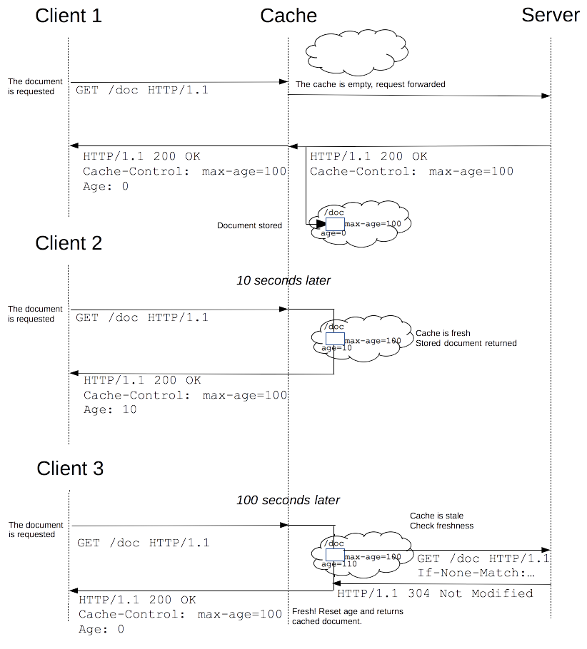

{{HTTPSidebar}}

過去に取得したリソースを再使用すると、ウェブサイトやアプリケーションのパフォーマンスが大きく向上するでしょう。ウェブキャッシュは遅延やネットワークのトラフィックを削減して、リソースを表示するために必要な時間も短縮します。HTTP キャッシュを使用すると、ウェブサイトの応答性が高まります。

## さまざまな種類のキャッシュ

キャッシュは、提供されたリソースの複製を保存して、要求されたときに背後でその複製を提供する技術です。ウェブキャッシュのストア内に要求されたリソースがあるとき、キャッシュはリクエストに介入して、提供元のサーバーから再びダウンロードする代わりにキャッシュ内の複製を返します。これにより、サーバーがすべてのクライアントに応対する必要がなくなり負荷が軽減する、キャッシュがクライアントに近いところにあるのでパフォーマンスが向上する、すなわちリソースを返すためにかかる時間を短くするといったことを実現できます。ウェブサイトについて、高いパフォーマンスを達成するための主要な構成要素です。一方、すべてのリソースを同じまま永久に保存しないよう、キャッシュを適切に設定しなければなりません。キャッシュはあまり長く保存せず、リソースが変更されるまでの間にすることが重要です。

キャッシュにはさまざまな種類があり、これらはプライベートキャッシュと共有キャッシュの 2 つのカテゴリーに大きく分類できます。*共有キャッシュ*は、複数のユーザーが再使用するためにレスポンスを保存するキャッシュです。*プライベートキャッシュ*は、ひとりのユーザーのためのキャッシュです。このページでは主にブラウザーのキャッシュとプロキシのキャッシュを扱いますが、ウェブサイトやウェブアプリケーションの信頼性、パフォーマンス、規模を向上するためにウェブサーバーで展開されるゲートウェイのキャッシュ、CDN、リバースプロキシのキャッシュ、ロードバランサーも存在します。


### プライベートなブラウザーのキャッシュ

プライベートキャッシュは、ひとりのユーザーのためのキャッシュです。ブラウザーの設定で "キャッシュ" を見たことがあるでしょう。ブラウザーのキャッシュは、ユーザーが [HTTP](/ja/docs/Web/HTTP) でダウンロードしたすべての文書を保持します。このキャッシュは訪問済みの文書で、サーバーと追加のやり取りを行う必要なしに戻る/進む操作、ページの保存、ソースの表示などを可能にします。また同様に、キャッシュ済みコンテンツのオフライン表示が改善します。

### 共有されるプロキシキャッシュ

共有キャッシュは、複数のユーザーによって再使用されるレスポンスを保存するキャッシュです。例えば ISP や企業は、人気があるリソースを何度も再使用してネットワークのトラフィックや遅延を低減するために、ローカルネットワークの基盤の一部としてウェブプロキシを設置しているでしょう。

## キャッシュ処理の対象

HTTP キャッシュは必須ではありませんが、キャッシュしたリソースの再使用は通常望ましいことです。ただし一般的な HTTP キャッシュはたいてい、{{HTTPMethod("GET")}} のレスポンスのみキャッシュするよう制限されており、他のメソッドではキャッシュしません。主要なキャッシュのキーはリクエストメソッドと対象 URI で構成されます (GET リクエストだけをキャッシュの対象にするため、URI しか使用されないことがよくあります)。キャッシュ項目の一般的な形式は以下のとおりです。

- 取得要求に成功した結果: {{HTTPMethod("GET")}} リクエストに対する {{HTTPStatus(200)}} (OK) レスポンスには、HTML 文書、画像、ファイルなどのリソースが含まれています。
- 恒久的なリダイレクト: {{HTTPStatus(301)}} (Moved Permanently) レスポンス。
- エラーレスポンス: {{HTTPStatus(404)}} (Not Found) のページ。
- 不完全な結果: {{HTTPStatus(206)}} (Partial Content) レスポンス。
- キャッシュのキーとして使用することが適切であると定義されていれば、{{HTTPMethod("GET")}} 以外のレスポンス。

リクエストがコンテンツネゴシエーションの対象である場合はキャッシュ項目が、第二のキーで区別される複数の保存済みレスポンスで構成されていることもあります。詳しくは、[後述](#Varying_responses)する {{HTTPHeader("Vary")}} ヘッダーの情報をご覧ください。

## キャッシュを制御する

### `Cache-Control` ヘッダー

HTTP/1.1 の {{HTTPHeader("Cache-Control")}} 一般ヘッダーは、リクエストおよびレスポンスでキャッシュ機能に関するディレクティブを指定するために使用します。このヘッダーが提供するさまざまなディレクティブを使用して、キャッシュのポリシーを定義してください。

#### キャッシュしない

クライアントのリクエストおよびサーバーのレスポンスについて、キャッシュに何も保存してはいけません。リクエストはサーバーに送信されて、リクエストごとに毎回完全なレスポンスをダウンロードします。

```
Cache-Control: no-store
```

#### キャッシュするが再検証する

キャッシュした複製を渡す前に検証のため、キャッシュは生成元のサーバーにリクエストを送信します。

```
Cache-Control: no-cache
```

#### private キャッシュと public キャッシュ

"public" ディレクティブは、どのキャッシュでもレスポンスを保存してよいことを示します。これは、通常はキャッシュできない HTTP 認証やレスポンスステータスコードを伴うページをキャッシュしなければならない時に有用です。

一方、"private" はレスポンスがひとりのユーザーのためのものであり、共有キャッシュに保存してはならないことを示します。ブラウザーのプライベートキャッシュは、この場合でもレスポンスを保存できます。

```
Cache-Control: private
Cache-Control: public
```

#### 有効期限

このヘッダーでもっとも重要なディレクティブが、リソースが陳腐化していないと考えられる最長期間を表す "`max-age=<seconds>`" です。{{HTTPHeader("Expires")}} とは対照的に、このディレクティブはリクエストの時刻と関係があります。変更しない予定のアプリケーションのファイルには、たいてい積極的なキャッシュを行います。これは例えば画像、CSS ファイル、JavaScript ファイルといった静的なファイルが含まれます。

詳しくは、後述する [鮮度](#Freshness) のセクションもご覧ください。

```
Cache-Control: max-age=31536000
```

#### 検証

"`must-revalidate`" ディレクティブを使用すると、キャッシュはリソースを使用する前に陳腐化の状態を検証しなければならず、また期限切れのリソースを使用するべきではありません。詳しくは、[キャッシュの検証](#Cache_validation) のセクションをご覧ください。

```
Cache-Control: must-revalidate
```

### `Pragma` ヘッダー

{{HTTPHeader("Pragma")}} は HTTP/1.0 のヘッダーであり、HTTP レスポンスに特定されないため HTTP/1.1 の `Cache-Control` 一般ヘッダーを確実に置き換えるものではありません。しかし、リクエストで `Cache-Control` ヘッダーフィールドが省略された場合は `Cache-Control: no-cache` と同様に作用します。HTTP/1.0 クライアントとの後方互換用に限り、`Pragma` を使用してください。

## 鮮度

リソースがキャッシュに保存されると、理論上は永久にキャッシュからリソースを提供することができます。キャッシュは有限の記憶領域ですので、アイテムは定期的に記憶領域から削除されます。この処理は*キャッシュ・エビクション*と呼ばれます。一方、サーバー上で変更されるリソースもあり、それはキャッシュを更新するべきです。HTTP はクライアントサーバープロトコルであり、リソースを変更したときにサーバーがキャッシュやクライアントに連絡することはできません。サーバーは、リソースの有効期限を伝えなければなりません。この有効期限に達するまではリソースが*新鮮 (fresh)* であり、また有効期限を過ぎるとリソースは*陳腐化 (stale)* します。エビクションアルゴリズムはたいてい、陳腐化したリソースよりも新鮮なリソースを優遇します。陳腐化したリソースは削除されたり無視されたりしないことに注意してください。陳腐化したリソースへのリクエストをキャッシュが受け取ると、実際はもう新鮮ではないかを確認するために {{HTTPHeader("If-None-Match")}} を付加してリクエストを転送します。新鮮な状態であれば、サーバーは要求されたリソースを送信せずに {{HTTPStatus("304")}} (Not Modified) ヘッダーを返して、帯域を節約します。

共有キャッシュのプロキシがある場合の処理例を以下に示します。



鮮度の寿命は、いくつかのヘッダーを基に計算されます。"`Cache-Control: max-age=N`" ヘッダーが指定された場合は、鮮度の寿命が N に等しくなります。このヘッダーが与えられない場合がよくありますが、そのときは {{HTTPHeader("Expires")}} ヘッダーが与えられたかを確認します。`Expires` ヘッダーがある場合は、その値から {{HTTPHeader("Date")}} ヘッダーの値を減算した結果を鮮度の寿命にします。最後に、どちらのヘッダーも与えられていない場合は {{HTTPHeader("Last-Modified")}} ヘッダーを参照します。このヘッダーがある場合は、`Date` ヘッダーの値から `Last-modified` ヘッダーの値を減算して 10 で割った結果をキャッシュの寿命にします。
有効期限は以下のように計算します。

```
expirationTime = responseTime + freshnessLifetime - currentAge
```

ここで `responseTime` は、ブラウザーがレスポンスを受け取った時刻です。

### Revving を適用したリソース

キャッシュされたリソースをより多く使用すると、ウェブサイトの応答性やパフォーマンスが向上するでしょう。この最適化のために、有効期限をできるだけ遠い未来にすることが推奨されています。この方法は定期的あるいはよく更新されるリソースでも使用できますが、まれにしか更新されないリソースでは問題があります。それらはキャッシュされたリソースの恩恵を最大限に受けますが、更新することがとても難しくなります。この現象は、それぞれのウェブページに含まれたりリンクされたりする技術上のリソースで顕著です。JavaScript や CSS のファイルはあまり変更されませんが、変更点はすばやく反映されることが望まれます。

ウェブ開発者は、Steve Souders 氏が _revving_[\[1\]](https://www.stevesouders.com/blog/2008/08/23/revving-filenames-dont-use-querystring/) と呼ぶ技術を発明しました。あまり更新しないファイルは、特定の方法で命名します。その方法とは、通常はファイル名である URL にリビジョン (またはバージョン) 番号を追加することです。この方法ではそれぞれの新しいリビジョンのリソースが*変更されない*リソースであるとみなされて、通常は 1 年あるいはそれ以上先の遠い未来を有効期限にすることができます。新しいバージョンを使用するためにすべてのリンクを変更しなければならないことが、この方法の欠点です。ウェブ開発者が使用するツールチェーンによって通常は注意される、追加の複雑性です。あまり変化しないリソースが変化するとき、よく変化するリソースにさらなる変化をもたらします。よく変化するリソースを読み込むときに、ほかのリソースの新しいバージョンも読み込まれます。

この手法には、さらなる利点があります。同時に 2 つのキャッシュ済みリソースを更新すると、ひとつのリソースが期限切れのバージョン、もうひとつのリソースが新しいバージョンという組み合わせで使用されることがなくなります。これは相互依存、すなわち、それぞれが同じ HTML 要素を参照しているためにお互いに依存しあっている CSS スタイルシートと JS スクリプトを使用するウェブサイトで特に重要です。


revving を適用したリソースに追加するリビジョン情報は 1.1.3 のような伝統的なリビジョン文字列である必要はなく、単純に増加していく一組の番号でもかまいません。ハッシュ値や日付など、衝突を避けた情報にすることもできます。

## キャッシュの検証

キャッシュされた文書の有効期限に達すると、検証または再取得を行います。キャッシュの検証は、サーバーが _strong validator_ または _weak validator_ を提供していれば実行できます。

ユーザーが再読み込みボタンを押すと、再検証が発生します。キャッシュされたレスポンスに "`Cache-Control: must-revalidate`" ヘッダーが含まれている場合は、通常のブラウジングでも再確認が発生します。もうひとつの要因が、`詳細 -> キャッシュ` 設定パネルにある、キャッシュ確認の設定です。ここに、文書を読み込むたびに確認を強いる設定項目があります。

### ETag

{{HTTPHeader("ETag")}} レスポンスヘッダーは strong validator として使用できる、*ユーザーエージェントにとって不透明*な値です。ブラウザーなどの HTTP ユーザーエージェントは、この文字列が何を表すかがわからず、またこの値が何になるかを予測することもできません。`ETag` ヘッダーがリソースのレスポンスの一部に含まれていたら、クライアントは以降のリクエストでキャッシュ済みリソースの確認を行うために {{HTTPHeader("If-None-Match")}} をヘッダーに含めることができます。

{{HTTPHeader("Last-Modified")}} レスポンスヘッダーは、weak validator として使用できます。これは分解能が 1 秒単位でしかないため、weak であると考えられます。`Last-Modified` ヘッダーがレスポンスに含まれていたら、クライアントはキャッシュ済み文書の確認を行うために {{HTTPHeader("If-Modified-Since")}} リクエストヘッダーを送信できます。

確認要求が行われたとき、サーバーは確認要求を無視して通常の {{HTTPStatus(200)}} `OK` レスポンスを返すか、ブラウザーにキャッシュ済みの複製を使用するよう指示するために {{HTTPStatus(304)}} `Not Modified` (ボディは空にする) を返すことができます。後者のレスポンスでは、キャッシュ済み文書の有効期限を更新するヘッダーを含めることもできます。

## 変化するレスポンス

{{HTTPHeader("Vary")}} HTTP レスポンスヘッダーは、提供元のサーバーからレスポンスを得るように要求せずにキャッシュ済みのレスポンスを使用できるかを判断するために、以降のリクエストヘッダーをどのように照合するかを定義します。

`Vary` ヘッダーフィールドを持つキャッシュ済みレスポンスに合致可能なリクエストをキャッシュが受け取ったとき、`Vary` ヘッダーで指定されたすべてのヘッダーフィールドが元の (キャッシュ済み) リクエストと新たなリクエストの両方で一致しなければ、キャッシュ済みレスポンスを使用してはいけません。


これは、例えば動的にコンテンツを提供する場合に有用です。`Vary: User-Agent` ヘッダーを使用すると、キャッシュサーバーはページをキャッシュから提供するかを判断するために、ユーザーエージェントを考慮します。モバイルユーザー向けに別のコンテンツを提供している場合、モバイルユーザー向けに誤ってデスクトップ版のサイトが提供されてしまうことを防ぐ助けになります。加えて、Google などの検索エンジンがモバイル版のページを発見する助けになり、[クローキング](https://ja.wikipedia.org/wiki/%E3%82%AF%E3%83%AD%E3%83%BC%E3%82%AD%E3%83%B3%E3%82%B0) を意図していないと知らせることもできるでしょう。

```
Vary: User-Agent
```

{{HTTPHeader("User-Agent")}} はモバイルクライアントとデスクトップクライアントで異なる ("vary") ため、誤ってモバイル版のコンテンツをデスクトップユーザー向けに使用する、あるいはその逆を行うことがなくなるでしょう。

## 関連情報

- [RFC 7234: Hypertext Transfer Protocol (HTTP/1.1): Caching](https://tools.ietf.org/html/rfc7234)
- [Caching Tutorial – Mark Nottingham](https://www.mnot.net/cache_docs)
- [HTTP caching – Ilya Grigorik](https://developers.google.com/web/fundamentals/performance/optimizing-content-efficiency/http-caching)
- [RedBot](https://redbot.org/): キャッシュ関係のヘッダーを確認するツール
