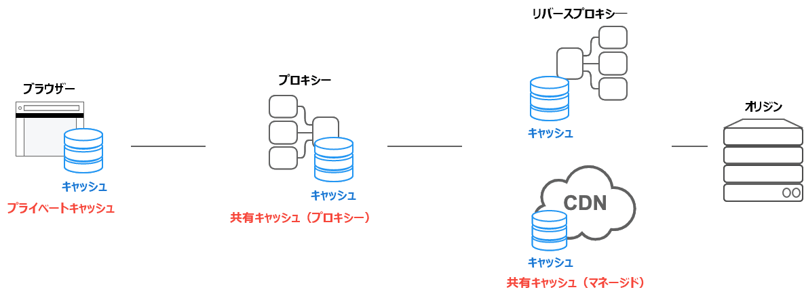

{{HTTPSidebar}}

## 概要

HTTPキャッシュはリクエストに関連するレスポンスを保存し、後続のリクエストで再利用します。

再利用性にはいくつかの利点があります。まず。オリジンサーバーにリクエストする必要がありません。クライアントとキャッシュの距離が近いほどレスポンスは速くなります。もっとも典型的な例はブラウザ自身がブラウザのリクエストをキャッシュすることです。

また、レスポンスが再利用可能な場合、オリジンサーバーはリクエストを処理する必要がありません — つまり、リクエストを解析しルーティングしたり、Cookieをもとにしたセッションを復元したり、DBに結果を問い合わせたり、テンプレートエンジンをレンダリングする必要がありません。これはサーバーの負荷を低減させます。

適切なキャッシュはシステムの健全性にとって重要です。

## キャッシュの種類

[HTTP Caching](https://httpwg.org/specs/rfc9111.html) の仕様では、**プライベートキャッシュ** と **共有キャッシュ** の2つの主要なキャッシュが定義されています。

### プライベートキャッシュ

プライベートキャッシュは特定のクライアントに紐づくものです — 通常はブラウザキャッシュです。保存されたレスポンスは他のクライアントと共有されないため、プライベートキャッシュはそのユーザー向けにパーソナライズされたレスポンスとして保存されます。

一方で、もしパーソナライズされたコンテンツがプライベートキャッシュ以外の場所に保存されていた場合、他のユーザーがそれらを取得できる可能性があります — 意図しない情報漏洩の原因となる可能性があります。

レスポンスにパーソナライズされた情報が含まれていて、それらをプライベートキャッシュにのみ保存したい場合は `private` ディレクティブを指定する必要があります。

```http
Cache-Control: private
```

パーソナライズされたコンテンツは通常は cookie で制御されます。しかし、cookie が存在するということは常にそれがプライベートであることを意味するものではありません。従って、 cookie だけでレスポンスをプライベートにできるわけではありません。

レスポンスが `Authorization` ヘッダーを含む場合、プライベートキャッシュに保存することはできない（もしくは、`public` が指定されていない限りは共有キャッシュ）という点に注意してください。

### 共有キャッシュ

共有キャッシュはクライアントとサーバーの間に位置し、ユーザーの間で共有できるレスポンスを保存します。共有キャッシュはさらに **プロキシキャッシュ** と **マネージドキャッシュ** に分類されます。

#### プロキシキャッシュ

アクセス制御に加えて、いくつかのプロキシではネットワークトラフィックを減らすためにキャッシュを実装します。これは通常はサービスの開発者によって管理されていないため、適切なHTTPヘッダーなどで制御する必要があります。しかしながら、過去には古いプロキシキャッシュの実装 — 標準のHTTPキャッシュを適切に理解していない実装など — が問題を引き起こすことがありました。

次のような **ありとあらゆる指定を行ったヘッダー** は `no-store` ディレクティブのような現在のHTTPキャッシュの仕様を理解しておらず、「古く更新されていないプロキシキャッシュ」を回避するために使用されます。

```http
Cache-Control: no-store, no-cache, max-age=0, must-revalidate, proxy-revalidate
```

しかしながら、近年では、クライアント/サーバーの通信でHTTPSが一般的になり暗号化されるにつれて、多くの場合ではパス内のプロキシキャッシュはレスポンスをトンネルするだけで、キャッシュとして動作することはできなくなりました。従って、そのシナリオではレスポンスを見ることのできない古いプロキシキャッシュの実装を心配する必要はありません。

// TODO
On the other hand, if a {{Glossary("TLS")}} bridge proxy decrypts all communications in a person-in-the-middle manner by installing a certificate from a {{Glossary("Certificate_authority", "CA (certificate authority)")}} managed by the organization on the PC, and performs access control, etc. — レスポンスの内容を確認しキャッシュできます。しかしながら、近年 [CT (証明書の透明性)](/ja/docs/Web/Security/Certificate_Transparency) が普及しているため、一部のブラウザでは SCT (署名付き証明書のタイムスタンプ) で発行された証明書のみ許可するようになっています。この方法ではエンタープライズポリシー（TODO）を適用する必要があります。このように制御された環境ではプロキシキャッシュが「古く更新されていない」ということを心配する必要はありません。

#### マネージドキャッシュ

マネージドキャッシュはオリジンサーバーの負荷を軽減し、コンテンツを効率的に配信するために、サービス開発者によって展開されます。例としてキャッシュAPIと組み合わせたリバースプロキシ、CDN、サービスワーカーなどがあります。

マネージドキャッシュの特徴は展開された製品によって変わります。しかし、ほとんどの場合では `Cache-Control` ヘッダーだけでなく、独自の設定やダッシュボードでそれらの振る舞いを制御することができます。

例えば、HTTPキャッシュの仕様では、基本的にキャッシュを明示的に削除する方法について定義されていません — しかし、マネージドキャッシュではダッシュボードの捜査、APIの呼び出し、再起動などにより、保存されたレスポンスをいつでも削除することができます。これにより先を見越したキャッシュ戦略が可能になります。

また、標準的なHTTPキャッシュ仕様プロトコルを無視して、明示的な操作を優先することもできます。例えば、次のように指定することでプライベートキャッシュもしくはプロキシキャッシュをオプトアウトし、マネージドキャッシュのみキャッシュするという戦略をとることもできます。

```http
Cache-Control: no-store
```

例えば、 Varnish Cache は VCL ({{Glossary("DSL/Domain_specific_language", "DSL")}} の一種である Varnish 設定言語) ロジックでキャッシュストレージを処理しますが、キャッシュAPIとサービスワーカーを組み合わせることでそのロジックを JavaScript で作成することができます。

That means if a managed cache intentionally ignores a `no-store` directive, there is no need to perceive it as being "non-compliant" with the standard. What you should do is, avoid using kitchen-sink headers, but carefully read the documentation of whatever managed-cache mechanism you're using, and ensure you're controlling the cache properly in the ways provided by the mechanism you've chosen to use.

Note that some CDNs provide their own headers that are effective only for that CDN (for example, `Surrogate-Control`). Currently, work is underway to define a [`CDN-Cache-Control`](https://httpwg.org/specs/rfc9213.html) header to standardize those.



## キャッシュを制御する

### `Cache-Control` ヘッダー

HTTP/1.1 の {{HTTPHeader("Cache-Control")}} 一般ヘッダーは、リクエストおよびレスポンスでキャッシュ機能に関するディレクティブを指定するために使用します。このヘッダーが提供するさまざまなディレクティブを使用して、キャッシュのポリシーを定義してください。

#### キャッシュしない

クライアントのリクエストおよびサーバーのレスポンスについて、キャッシュに何も保存してはいけません。リクエストはサーバーに送信されて、リクエストごとに毎回完全なレスポンスをダウンロードします。

```http
Cache-Control: no-store
```

#### キャッシュするが再検証する

キャッシュした複製を渡す前に検証のため、キャッシュは生成元のサーバーにリクエストを送信します。

```http
Cache-Control: no-cache
```

#### private キャッシュと public キャッシュ

"public" ディレクティブは、どのキャッシュでもレスポンスを保存してよいことを示します。これは、通常はキャッシュできない HTTP 認証やレスポンスステータスコードを伴うページをキャッシュしなければならない時に有用です。

一方、"private" はレスポンスがひとりのユーザーのためのものであり、共有キャッシュに保存してはならないことを示します。ブラウザーのプライベートキャッシュは、この場合でもレスポンスを保存できます。

```http
Cache-Control: private
Cache-Control: public
```

#### 有効期限

このヘッダーでもっとも重要なディレクティブが、リソースが陳腐化していないと考えられる最長期間を表す "`max-age=<seconds>`" です。{{HTTPHeader("Expires")}} とは対照的に、このディレクティブはリクエストの時刻と関係があります。変更しない予定のアプリケーションのファイルには、たいてい積極的なキャッシュを行います。これは例えば画像、CSS ファイル、JavaScript ファイルといった静的なファイルが含まれます。

詳しくは、後述する <a href="#Freshness">鮮度</a> のセクションもご覧ください。

```http
Cache-Control: max-age=31536000
```

#### 検証

`must-revalidate` ディレクティブを使用すると、キャッシュはリソースを使用する前に陳腐化の状態を検証しなければならず、また期限切れのリソースを使用するべきではありません。詳しくは、<a href="#Cache_validation">キャッシュの検証</a> のセクションをご覧ください。

```http
Cache-Control: must-revalidate
```

### `Pragma` ヘッダー

{{HTTPHeader("Pragma")}} は HTTP/1.0 のヘッダーであり、HTTP レスポンスに特定されないため HTTP/1.1 の `Cache-Control` 一般ヘッダーを確実に置き換えるものではありません。しかし、リクエストで `Cache-Control` ヘッダーフィールドが省略された場合は `Cache-Control: no-cache` と同様に作用します。HTTP/1.0 クライアントとの後方互換用に限り、`Pragma` を使用してください。

## 鮮度

リソースがキャッシュに保存されると、理論上は永久にキャッシュからリソースを提供することができます。キャッシュは有限の記憶領域ですので、アイテムは定期的に記憶領域から削除されます。この処理は **キャッシュ・エビクション** と呼ばれます。一方、サーバー上で変更されるリソースもあり、それはキャッシュを更新するべきです。HTTP はクライアントサーバープロトコルであり、リソースを変更したときにサーバーがキャッシュやクライアントに連絡することはできません。サーバーは、リソースの有効期限を伝えなければなりません。この有効期限に達するまではリソースが **新鮮 (fresh)** であり、また有効期限を過ぎるとリソースは **陳腐化 (stale)** します。エビクションアルゴリズムはたいてい、陳腐化したリソースよりも新鮮なリソースを優遇します。陳腐化したリソースは削除されたり無視されたりしないことに注意してください。陳腐化したリソースへのリクエストをキャッシュが受け取ると、実際はもう新鮮ではないかを確認するために {{HTTPHeader("If-None-Match")}} を付加してリクエストを転送します。新鮮な状態であれば、サーバーは要求されたリソースを送信せずに {{HTTPStatus("304")}} (Not Modified) ヘッダーを返して、帯域を節約します。

共有キャッシュのプロキシがある場合の処理例を以下に示します。


鮮度の寿命は、いくつかのヘッダーを基に計算されます。"`Cache-Control: max-age=N`" ヘッダーが指定された場合は、鮮度の寿命が N に等しくなります。このヘッダーが与えられない場合がよくありますが、そのときは {{HTTPHeader("Expires")}} ヘッダーが与えられたかを確認します。`Expires` ヘッダーがある場合は、その値から {{HTTPHeader("Date")}} ヘッダーの値を減算した結果を鮮度の寿命にします。最後に、どちらのヘッダーも与えられていない場合は {{HTTPHeader("Last-Modified")}} ヘッダーを参照します。このヘッダーがある場合は、`Date` ヘッダーの値から `Last-modified` ヘッダーの値を減算して 10 で割った結果をキャッシュの寿命にします。

 有効期限は以下のように計算します。

```
expirationTime = responseTime + freshnessLifetime - currentAge
```

ここで `responseTime` は、ブラウザーがレスポンスを受け取った時刻です。

### Revving を適用したリソース

キャッシュされたリソースをより多く使用すると、ウェブサイトの応答性やパフォーマンスが向上するでしょう。この最適化のために、有効期限をできるだけ遠い未来にすることが推奨されています。この方法は定期的あるいはよく更新されるリソースでも使用できますが、まれにしか更新されないリソースでは問題があります。それらはキャッシュされたリソースの恩恵を最大限に受けますが、更新することがとても難しくなります。この現象は、それぞれのウェブページに含まれたりリンクされたりする技術上のリソースで顕著です。JavaScript や CSS のファイルはあまり変更されませんが、変更点はすばやく反映されることが望まれます。

ウェブ開発者は、Steve Souders 氏が **revving** <sup><a href="https://www.stevesouders.com/blog/2008/08/23/revving-filenames-dont-use-querystring/">[1]</a></sup> と呼ぶ技術を発明しました。あまり更新しないファイルは、特定の方法で命名します。その方法とは、通常はファイル名である URL にリビジョン (またはバージョン) 番号を追加することです。この方法ではそれぞれの新しいリビジョンのリソースが**変更されない**リソースであるとみなされて、通常は 1 年あるいはそれ以上先の遠い未来を有効期限にすることができます。新しいバージョンを使用するためにすべてのリンクを変更しなければならないことが、この方法の欠点です。ウェブ開発者が使用するツールチェーンによって通常は注意される、追加の複雑性です。あまり変化しないリソースが変化するとき、よく変化するリソースにさらなる変化をもたらします。よく変化するリソースを読み込むときに、ほかのリソースの新しいバージョンも読み込まれます。

この手法には、さらなる利点があります。同時に 2 つのキャッシュ済みリソースを更新すると、ひとつのリソースが期限切れのバージョン、もうひとつのリソースが新しいバージョンという組み合わせで使用されることがなくなります。これは相互依存、すなわち、それぞれが同じ HTML 要素を参照しているためにお互いに依存しあっている CSS スタイルシートと JS スクリプトを使用するウェブサイトで特に重要です。


revving を適用したリソースに追加するリビジョン情報は 1.1.3 のような伝統的なリビジョン文字列である必要はなく、単純に増加していく一組の番号でもかまいません。ハッシュ値や日付など、衝突を避けた情報にすることもできます。

## キャッシュの検証

キャッシュされた文書の有効期限に達すると、検証または再取得を行います。キャッシュの検証は、サーバーが **strong validator** または **weak validator** を提供していれば実行できます。

ユーザーが再読み込みボタンを押すと、再検証が発生します。キャッシュされたレスポンスに "`Cache-Control: must-revalidate`" ヘッダーが含まれている場合は、通常のブラウジングでも再確認が発生します。もうひとつの要因が、`詳細 -> キャッシュ` 設定パネルにある、キャッシュ確認の設定です。ここに、文書を読み込むたびに確認を強いる設定項目があります。

<h3 id="ETags" name="ETags">ETag</h3>

{{HTTPHeader("ETag")}} レスポンスヘッダーは strong validator として使用できる、**ユーザーエージェントにとって不透明**な値です。ブラウザーなどの HTTP ユーザーエージェントは、この文字列が何を表すかがわからず、またこの値が何になるかを予測することもできません。`ETag` ヘッダーがリソースのレスポンスの一部に含まれていたら、クライアントは以降のリクエストでキャッシュ済みリソースの確認を行うために {{HTTPHeader("If-None-Match")}} をヘッダーに含めることができます。

{{HTTPHeader("Last-Modified")}} レスポンスヘッダーは、weak validator として使用できます。これは分解能が 1 秒単位でしかないため、weak であると考えられます。`Last-Modified` ヘッダーがレスポンスに含まれていたら、クライアントはキャッシュ済み文書の確認を行うために {{HTTPHeader("If-Modified-Since")}} リクエストヘッダーを送信できます。

確認要求が行われたとき、サーバーは確認要求を無視して通常の {{HTTPStatus(200)}} `OK` レスポンスを返すか、ブラウザーにキャッシュ済みの複製を使用するよう指示するために {{HTTPStatus(304)}} `Not Modified` (ボディは空にする) を返すことができます。後者のレスポンスでは、キャッシュ済み文書の有効期限を更新するヘッダーを含めることもできます。

## 変化するレスポンス

{{HTTPHeader("Vary")}} HTTP レスポンスヘッダーは、提供元のサーバーからレスポンスを得るように要求せずにキャッシュ済みのレスポンスを使用できるかを判断するために、以降のリクエストヘッダーをどのように照合するかを定義します。

`Vary` ヘッダーフィールドを持つキャッシュ済みレスポンスに合致可能なリクエストをキャッシュが受け取ったとき、`Vary` ヘッダーで指定されたすべてのヘッダーフィールドが元の (キャッシュ済み) リクエストと新たなリクエストの両方で一致しなければ、キャッシュ済みレスポンスを使用してはいけません。


これは、例えば動的にコンテンツを提供する場合に有用です。`Vary: User-Agent` ヘッダーを使用すると、キャッシュサーバーはページをキャッシュから提供するかを判断するために、ユーザーエージェントを考慮します。モバイルユーザー向けに別のコンテンツを提供している場合、モバイルユーザー向けに誤ってデスクトップ版のサイトが提供されてしまうことを防ぐ助けになります。加えて、Google などの検索エンジンがモバイル版のページを発見する助けになり、<a href="https://ja.wikipedia.org/wiki/%E3%82%AF%E3%83%AD%E3%83%BC%E3%82%AD%E3%83%B3%E3%82%B0">クローキング</a> を意図していないと知らせることもできるでしょう。

```http
Vary: User-Agent
```

{{HTTPHeader("User-Agent")}} はモバイルクライアントとデスクトップクライアントで異なる ("vary") ため、誤ってモバイル版のコンテンツをデスクトップユーザー向けに使用する、あるいはその逆を行うことがなくなるでしょう。

## 関連情報

- [RFC 9111: Hypertext Transfer Protocol (HTTP/1.1): Caching](https://datatracker.ietf.org/doc/html/RFC9111)
- [Caching Tutorial - Mark Nottingham](https://www.mnot.net/cache_docs/)
