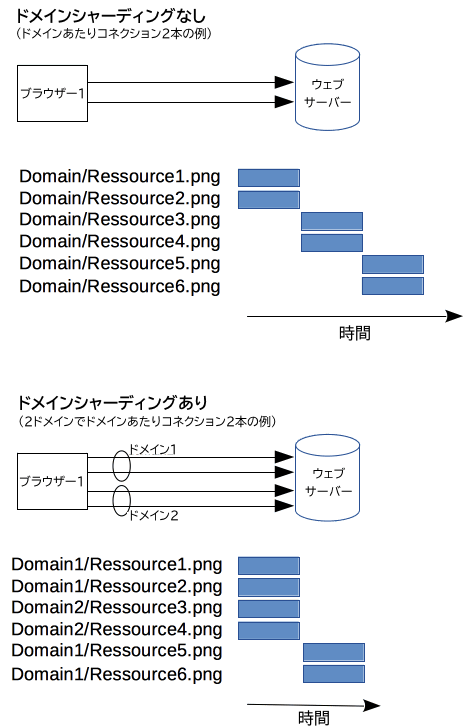

{{HTTPSidebar}}

コネクション管理は、 HTTP の重要なトピックです。コネクションを開いたり管理したりすることは、ウェブサイトやウェブアプリケーションのパフォーマンスに大きな影響を与えます。HTTP/1.x では<em><ruby>短命な<rp> (</rp><rt>short-lived</rt><rp>) </rp></ruby>コネクション</em>、<em><ruby>持続的な<rp> (</rp><rt>persistent</rt><rp>) </rp>コネクション</ruby></em>、<em>HTTP パイプライン</em>といったモデルがあります。

HTTP は、クライアントとサーバーの間のコネクションを提供するトランスポートプロトコルを、たいてい TCP に依存しています。初期のころ、 HTTP が使用するコネクションの制御モデルは 1 種類でした。それらのコネクションは短命です。リクエストの送信が必要になるたびに新たなコネクションを作成して、回答を受け取るとコネクションを閉じていました。

このシンプルなモデルは、先天的なパフォーマンスの制約を抱えていました。それぞれの TCP コネクションを開く処理は、リソースを消費します。いくつかのメッセージを、クライアントとサーバーの間で交換しなければなりません。リクエストの送信が必要になると、ネットワークの遅延や帯域がパフォーマンスに影響を与えます。現代のウェブページは、必要な情報を提供するために多くのリクエスト (1 ダース以上) を必要としており、初期のモデルが非効率であることを実証しています。

HTTP/1.1 で、新たなモデルを 2 種類導入しました。持続的なコネクションモデルは、連続したリクエストの間はコネクションを開き続けておくことで、新たなコネクションを開始するために必要な時間を削減します。 HTTP パイプラインモデルはさらに 1 歩進んで、回答を待っている間も複数の連続したリクエストを送信して、ネットワークの遅延の大部分を削減します。

HTTP/2 では、コネクションの管理モデルをさらに追加しました。

特筆すべき重要なポイントとして、 HTTP のコネクション管理は隣接したノードの間のコネクション、すなわち<a href="/ja/docs/Web/HTTP/Headers#e2e">エンドツーエンド</a>ではなく<a href="/ja/docs/Web/HTTP/Headers#hbh">ホップバイホップ</a>に適用されることがあります。クライアントと最初のプロキシの間で使用するモデルと、プロキシと宛先サーバー (または任意の中間プロキシ) の間で使用するモデルが異なることもあります。{{HTTPHeader("Connection")}} や {{HTTPHeader("Keep-Alive")}} といったコネクションモデルの定義にかかわる HTTP ヘッダーは、中間のノードが値を変更できる <a href="/ja/docs/Web/HTTP/Headers#hbh">ホップバイホップ</a> ヘッダーです。

関連するトピックとしては、 HTTP コネクションのアップグレードの概念、つまり HTTP/1.1 コネクションが TLS/1.0、 WebSocket、 又は平文の HTTP/2 のような異なるプロトコルにアップグレードされたことが挙げられます。この<a href="/ja/docs/Web/HTTP/Protocol_upgrade_mechanism">プロトコルのアップグレードメカニズム</a>は他の場所でもっと詳しく文書化されています。

<h2 id="Short-lived_connections" name="Short-lived_connections">短命なコネクション</h2>

<em>短命なコネクション</em>は HTTP の初期のモデルであり、 HTTP/1.0 の既定のモデルです。それぞれの HTTP リクエストは、自身のコネクションで完結します。すなわち、各 HTTP リクエストの前に TCP のハンドシェイクが発生します。また、それらが連続します。

TCP のハンドシェイク自体は時間がかかる処理ですが、 TCP のコネクションはその負荷に適応しており、より持続するコネクションによって効率が向上します。短命なコネクションは TCP の効率化機能を使用しておらず、また新たなコールド状態のコネクションで送信することに固執するため最適な状態よりもパフォーマンスが低下します。

このモデルは HTTP/1.0 で使用する既定のモデルです ({{HTTPHeader("Connection")}} ヘッダーが存在しない、あるいはヘッダーの値が <code>close</code> である場合)。 HTTP/1.1 では、 {{HTTPHeader("Connection")}} ヘッダーで <code>close</code> の値が送信された場合に限り、このモデルを使用します。

とても古い (持続的なコネクションをサポートしていない) システムを扱う場合を除き、あえてこのモデルを使用する理由はありません。

<h2 id="Persistent_connections" name="Persistent_connections">持続的なコネクション</h2>

短命なコネクションには、大きな問題点が 2 つあります。新しいコネクションを確立するためにかなり時間がかかること、および下層の TCP コネクションは何度も使用するとき (ウォーム状態のコネクション) しかパフォーマンスが向上しないことです。これらの問題を緩和するため、 HTTP/1.1 より前から<em>持続的なコネクション</em>の概念が考えられてきました。あるいは、<em>キープアライブ接続</em>と呼ばれることもあります。

持続的なコネクションはしばらくの間開かれたままであり、いくつかのリクエストで再使用できます。よって新たな TCP ハンドシェイクにかかる時間を節約して、 TCP のパフォーマンス向上機能を活用します。このコネクションはいつまでも開かれたままにはなりません。アイドル状態のコネクションはしばらく後に閉じられます (サーバーは、コネクションを開き続けておくべき最小時間を決めるために {{HTTPHeader("Keep-Alive")}} ヘッダーを使用するでしょう)。

持続的な接続には欠点もあります。アイドル状態でもサーバーのリソースを消費しており、高負荷状態では {{glossary("DoS attack", "DoS 攻撃")}} を招く可能性があります。この場合、持続的ではない接続はアイドル状態になるとすぐに閉じられますので、パフォーマンスが向上するでしょう。

HTTP/1.0 の既定のコネクションは、持続的ではありません。 {{HTTPHeader("Connection")}} を <code>close</code> 以外の何か、通常は <code>retry-after</code> に設定すると、持続的になります。

HTTP/1.1 では既定で持続的であり、ヘッダーは不要になりました (ただし HTTP/1.0 へのフォールバックが必要な場合の防衛策として、通常はヘッダーを追加します。)。

<h2 id="HTTP_pipelining" name="HTTP_pipelining">HTTP パイプライン</h2>

HTTP パイプラインは、現代のブラウザーでは既定で有効化されていません。

<ul>
 <li>不具合がある<a href="https://ja.wikipedia.org/wiki/%E3%83%97%E3%83%AD%E3%82%AD%E3%82%B7">プロキシ</a>がまだ一般的であり、これらは開発者が容易には予見あるいは診断できない、奇妙かつ一定しない挙動の原因になります。</li>
 <li>パイプラインの正しい実装は複雑です。転送するリソースのサイズ、効果的な <a href="https://ja.wikipedia.org/wiki/%E3%83%A9%E3%82%A6%E3%83%B3%E3%83%89%E3%83%88%E3%83%AA%E3%83%83%E3%83%97%E3%82%BF%E3%82%A4%E3%83%A0">RTT</a> および帯域が、パイプラインによる改善に対して直接的な影響力を持ちます。これらがわからなければ、重要なメッセージがそうでないメッセージより遅れる場合があります。重要さの概念は、ページのレイアウト中に高まります!よって、 HTTP パイプラインはほとんどの場合でわずかな改善にしかなりません。</li>
 <li>パイプラインは、 <a href="https://en.wikipedia.org/wiki/Head-of-line_blocking">HOL</a> の問題に左右されます。</li>
</ul>

これらの理由により、パイプラインはよりよいアルゴリズムである<em>多重化</em>に置き換えられました。こちらは HTTP/2 で使用されています。

既定で、<a href="/ja/docs/Web/HTTP">HTTP</a> リクエストは順次発行されます。次のリクエストは、現在のリクエストのレスポンスが到着してから発行されます。これはネットワークの遅延や帯域の制約を受けるため、次のリクエストがサーバーで<em>見える</em>ようになるまでにかなりの遅延が発生する可能性があります。

パイプラインは連続したリクエストを同一の持続的なコネクションで、回答を待たずに処理します。これは、コネクションの遅延を回避します。理論上は、2 つのリクエストを同じ TCP メッセージに収めた場合でもパフォーマンスが向上するでしょう。典型的な <a href="https://ja.wikipedia.org/wiki/%E6%9C%80%E5%A4%A7%E3%82%BB%E3%82%B0%E3%83%A1%E3%83%B3%E3%83%88%E3%82%B5%E3%82%A4%E3%82%BA">MSS</a> (最大セグメントサイズ) は複数のシンプルをリクエストを収めるには十分な大きさですが、 HTTP リクエストのサイズの需要は増え続けています。

パイプライン化できない HTTP リクエストもあります。 {{glossary("idempotent","べき等")}} なメソッドである {{HTTPMethod("GET")}}, {{HTTPMethod("HEAD")}}, {{HTTPMethod("PUT")}}, {{HTTPMethod("DELETE")}} だけが安全に再実行できます。これらは失敗しても、パイプラインの内容を再実行できます。

現在、すべての HTTP/1.1 に準拠するプロキシやサーバーはパイプラインをサポートしているはずですが、実際は多くの制限があります。さまざまな理由で、現行のブラウザーはパイプラインを既定で有効化していません。

<h2 id="Domain_sharding" name="Domain_sharding">ドメインシャーディング</h2>

特別に必要である場合を除き、この非推奨の技術は使用しないでください。代わりに、 HTTP/2 に切り替えてください。 HTTP/2 では、ドメインシャーディングは有用ではありません。 HTTP/2 のコネクションは、並行した優先度がないリクエストをより上手に扱うことができます。また、ドメインシャーディングはパフォーマンスに悪影響を与えます。ほとんどの HTTP/2 実装では、最終的にドメインシャーディングに戻る <a href="https://daniel.haxx.se/blog/2016/08/18/http2-connection-coalescing/">connection coalescing</a> と呼ばれる技術を使用しています。

HTTP/1.x のコネクションはリクエストが整理されることもなく連続するため、十分な帯域を使用できない状況では最適化できません。その解決策として、ブラウザーーはそれぞれのドメインに対して複数のコネクションを開いて、リクエストを並行して送信します。既定では一度に 2 から 3 つのコネクションですが、現在は主に 6 つの並列したコネクションへ増えています。この数をさらに増やそうとすると、サーバー側で <a href="/ja/docs/Glossary/DOS_attack">DoS</a> 防御が発動する危険性があります。

サーバーがウェブサイトやウェブアプリケーションのレスポンスを早くしたい場合、より多くのコネクションを開かせることが考えられます。例えば、すべてのリソースを同じドメイン <code>www.example.com</code> で持つのではなく、<code>www1.example.com</code>、<code>www2.example.com</code>、<code>www3.example.com</code> といった複数のドメインに分散させることができます。それぞれのドメインは<em>同じ</em>サーバーに名前解決されて、ウェブブラウザーーはドメインごとに 6 つのコネクションを開きます (この例では、コネクション数が 18 に増加します)。この技術は<em>ドメインシャーディング</em>と呼ばれます。

<h2 id="Conclusion" name="Conclusion">まとめ</h2>

改良されたコネクション管理により、 HTTP のパフォーマンスを大きく向上できます。 HTTP/1.1 や HTTP/1.0 では、持続的なコネクションを使用します。少なくともコネクションがアイドル状態になるまで、最良のパフォーマンスになります。一方、パイプラインの失敗は優れたコネクション管理モデルの設計を促し、それは HTTP/2 に導入されました。

