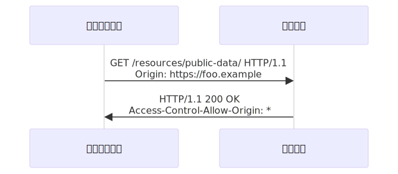
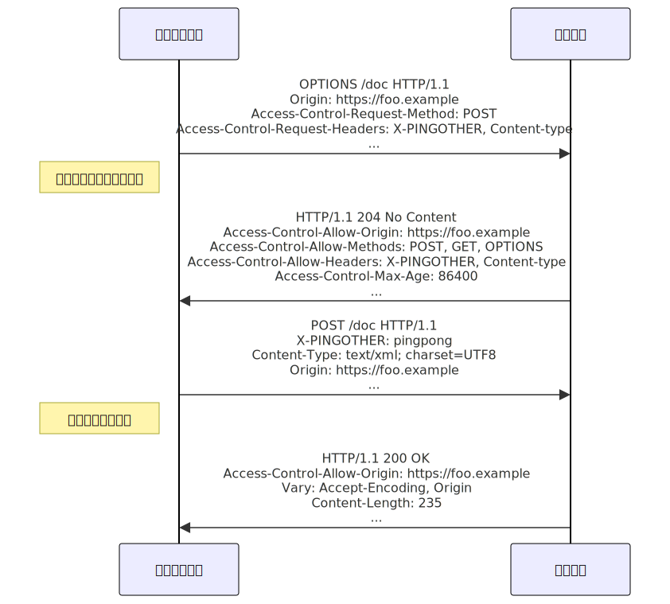
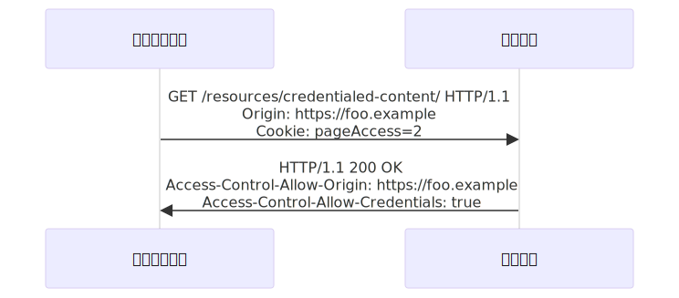

{{HTTPSidebar}}

オリジン間リソース共有 (Cross-Origin Resource Sharing, {{Glossary("CORS")}}) は、追加の {{Glossary("HTTP")}} ヘッダーを使用して、ある{{glossary("origin", "オリジン")}}で動作しているウェブアプリケーションに、異なるオリジンにある選択されたリソースへのアクセス権を与えるようブラウザーに指示するための仕組みです。ウェブアプリケーションは、自分とは異なるオリジン (ドメイン、プロトコル、ポート番号) にあるリソースをリクエストするとき、オリジン間 HTTP リクエストを実行します。

オリジン間リクエストとは、例えば `https://domain-a.com` で提供されているウェブアプリケーションのフロントエンド JavaScript コードが {{domxref("Window/fetch", "fetch()")}} を使用して `https://domain-b.com/data.json` へリクエストを行うような場合です。

セキュリティ上の理由から、ブラウザーは、スクリプトによって開始されるオリジン間 HTTP リクエストを制限しています。例えば、`fetch()` や {{domxref("XMLHttpRequest")}} は[同一オリジンポリシー](/ja/docs/Web/Security/Same-origin_policy) (same-origin policy) に従います。つまり、これらの API を使用するウェブアプリケーションは、そのアプリケーションが読み込まれたのと同じオリジンに対してのみリソースのリクエストを行うことができ、それ以外のオリジンからの場合は正しい CORS ヘッダーを含んでいることが必要です。



CORS の仕組みは、安全なオリジン間のリクエストとブラウザー・サーバー間のデータ転送を支援します。最近のブラウザーは CORS を `fetch()` や `XMLHttpRequest` などの API で使用して、オリジン間 HTTP リクエストのリスクの緩和に役立てています。

## CORS を使用したリクエストとは

この [cross-origin sharing standard](https://fetch.spec.whatwg.org/#http-cors-protocol) では、以下についてオリジン間の HTTP リクエストができるようにしています。

- 前述のような `fetch()` や `XMLHttpRequest` の呼び出し。
- ウェブフォント（CSS の `@font-face` で別ドメインのフォントを利用するため）。[これによりサーバーは、許可したウェブサイトのみからオリジンをまたがって読み込んで利用できる TrueType フォントを提供することができます。](https://www.w3.org/TR/css-fonts-3/#font-fetching-requirements)
- [WebGL テクスチャ](/ja/docs/Web/API/WebGL_API/Tutorial/Using_textures_in_WebGL)。
- {{domxref("CanvasRenderingContext2D.drawImage()", "drawImage()")}} を使用してキャンバスへ描かれた画像や映像のフレーム
- [画像から生成した CSS シェイプ](/ja/docs/Web/CSS/CSS_shapes/Shapes_from_images)。

この記事では、 HTTP ヘッダーの要件を含むオリジン間リソース共有の全般的な説明を行います。

## 機能概要

オリジン間リソース共有の仕様は、ウェブブラウザーから情報を読み取ることを許可されているオリジンをサーバーが記述することができる、新たな [HTTP ヘッダー](/ja/docs/Web/HTTP/Headers)を追加することで作用します。加えて仕様書では、サーバーの情報に副作用を引き起こすことがある HTTP のリクエストメソッド (特に {{HTTPMethod("GET")}} 以外の HTTP メソッドや、特定の [MIME タイプ](/ja/docs/Web/HTTP/MIME_types)を伴う {{HTTPMethod("POST")}}) のために、ブラウザーが HTTP の {{HTTPMethod("OPTIONS")}} リクエストメソッドを用いて、あらかじめリクエストの「プリフライト」 (サーバーから対応するメソッドの一覧を収集すること) を行い、サーバーの「認可」のもとに実際のリクエストを送信することを指示しています。サーバーはリクエスト時に「資格情報」 ([Cookie](/ja/docs/Web/HTTP/Cookies) や [HTTP 認証](/ja/docs/Web/HTTP/Authentication)など) を送信するべきかをクライアントに伝えることもできます。

CORS は様々なエラーで失敗することがありますが、セキュリティ上の理由から、エラーについて *JavaScript から知ることができない*よう定められています。コードからはエラーが発生したということしか分かりません。何が悪かったのかを具体的に知ることができる唯一の方法は、ブラウザーのコンソールで詳細を見ることです。

以降の節ではシナリオの説明に加え、 HTTP ヘッダーの使い方の詳細も提供します。

## アクセス制御シナリオの例

オリジン間リソース共有の動作の仕組みを説明する 3 つのシナリオを示します。これらの例はすべて {{domxref("Window/fetch", "fetch()")}} を用いており、対応しているブラウザーにおいて、オリジンをまたいでアクセスすることができます。

### 単純リクエスト

リクエストによっては {{Glossary("Preflight_request","CORS プリフライト")}}を発生させません。これをこの記事では古い [CORS 仕様書](https://www.w3.org/TR/2014/REC-cors-20140116/#terminology)に倣って*単純リクエスト*と呼んでいますが、 (現在 CORS を定義している) [Fetch 仕様書](https://fetch.spec.whatwg.org/) ではこの用語を使用していません。

その動機は、HTML 4.0 からの {{HTMLElement("form")}} 要素（サイト間 {{domxref("Window/fetch", "fetch()")}} と {{domxref("XMLHttpRequest")}} に先行する）は、どのオリジンにでも単純なリクエストを送信できるので、サーバーを書く人はすでに {{Glossary("CSRF", "cross-site request forgery")}} (CSRF) から保護していなければならないからです。この仮定の下では、 CSRF の脅威はフォーム送信の脅威よりも悪くないので、サーバーはフォーム送信のように見えるすべてのリクエストを受け取ることを（プリフライトリクエストに応答することによって）オプトインする必要はないのです。しかし、サーバーは {{HTTPHeader("Access-Control-Allow-Origin")}} を使用して、レスポンスをスクリプトと共有することを選択する必要があります。

*単純リクエスト*は、**以下のすべての条件を満たす**ものです。

- 許可されているメソッドのうちのいずれかであること。

  - {{HTTPMethod("GET")}}
  - {{HTTPMethod("HEAD")}}
  - {{HTTPMethod("POST")}}

- ユーザーエージェントによって自動的に設定されたヘッダー (たとえば {{HTTPHeader("Connection")}}、 {{HTTPHeader("User-Agent")}}、 または [Fetch 仕様書で*禁止ヘッダー名*として定義されているヘッダー](https://fetch.spec.whatwg.org/#forbidden-header-name))を除いて、手動で設定できるヘッダーは、 [Fetch 仕様書で CORS セーフリストリクエストヘッダーとして定義されている](https://fetch.spec.whatwg.org/#cors-safelisted-request-header)</a>以下のヘッダーだけです。

  - {{HTTPHeader("Accept")}}
  - {{HTTPHeader("Accept-Language")}}
  - {{HTTPHeader("Content-Language")}}
  - {{HTTPHeader("Content-Type")}} （但し、下記の追加の要件に注意してください）
  - {{HTTPHeader("Range")}} （[単純範囲ヘッダー値](https://fetch.spec.whatwg.org/#simple-range-header-value)、例えば `bytes=256-` や `bytes=127-255` の場合）

- {{HTTPHeader("Content-Type")}} ヘッダーで指定できる{{Glossary("MIME type", "メディア種別")}}に許されるタイプ/サブタイプの組み合わせは、以下のもののみです。

  - `application/x-www-form-urlencoded`
  - `multipart/form-data`
  - `text/plain`

- {{domxref("XMLHttpRequest")}} オブジェクトを使用してリクエストを行う場合は、 {{domxref("XMLHttpRequest.upload")}} プロパティから返されるオブジェクトにイベントリスナーが登録されていないこと。すなわち、 {{domxref("XMLHttpRequest")}} インスタンスを `xhr` とした場合、どのコードも `xhr.upload.addEventListener()` が呼び出してアップロードを監視するためのイベントリスナーを追加していないこと。
- リクエストに {{domxref("ReadableStream")}} オブジェクトが使用されていないこと。

> [!NOTE]
> WebKit Nightly および Safari Technology Preview は、 {{HTTPHeader("Accept")}}、{{HTTPHeader("Accept-Language")}}、{{HTTPHeader("Content-Language")}} ヘッダーの値に追加の制限を掛けています。これらのヘッダーが「標準外」の値の場合、 WebKit/Safari はそのリクエストが「単純リクエスト」の条件に合うとは判断しません。 WebKit/Safari がこれらのヘッダーのどの値を「標準外」と判断するかについては、以下の WebKit のバグを除いて文書化されていません。
>
> - [Require preflight for non-standard CORS-safelisted request headers Accept, Accept-Language, and Content-Language](https://webkit.org/b/165178)
> - [Allow commas in Accept, Accept-Language, and Content-Language request headers for simple CORS](https://webkit.org/b/165566)
> - [Switch to a blacklist model for restricted Accept headers in simple CORS requests](https://webkit.org/b/166363)
>
> これは仕様の一部ではないので、他のブラウザーはこの追加の制限を実装していません。

例えば、`https://foo.example` のウェブコンテンツが JSON コンテンツをドメイン `https://bar.other` から取得したいとします。 この種のコードは、`foo.example` で展開された JavaScript で使用される可能性があります。

```js
const fetchPromise = fetch("https://bar.other");

fetchPromise
  .then((response) => response.json())
  .then((data) => {
    console.log(data);
  });
```

この処理は、特権を扱うために CORS ヘッダーを使用して、クライアントとサーバーの間で簡単なデータ交換を行います。



この場合、ブラウザーがサーバーに何を送信し、サーバーが何を返すかを見てみましょう。

```http
GET /resources/public-data/ HTTP/1.1
Host: bar.other
User-Agent: Mozilla/5.0 (Macintosh; Intel Mac OS X 10.14; rv:71.0) Gecko/20100101 Firefox/71.0
Accept: text/html,application/xhtml+xml,application/xml;q=0.9,*/*;q=0.8
Accept-Language: en-us,en;q=0.5
Accept-Encoding: gzip,deflate
Connection: keep-alive
Origin: https://foo.example
```

特筆すべきリクエストヘッダーは {{HTTPHeader("Origin")}} であり、呼び出しが `https://foo.example` から来たことを表します。

サーバーがどのように返答するかを見てみましょう。

```http
HTTP/1.1 200 OK
Date: Mon, 01 Dec 2008 00:23:53 GMT
Server: Apache/2
Access-Control-Allow-Origin: *
Keep-Alive: timeout=2, max=100
Connection: Keep-Alive
Transfer-Encoding: chunked
Content-Type: application/xml

[…XML データ…]
```

レスポンスでは、サーバーが {{HTTPHeader("Access-Control-Allow-Origin")}} ヘッダーを `Access-Control-Allow-Origin: *` と返しており、そのリソースが**すべての**ドメインからアクセスできることを示しています。

```http
Access-Control-Allow-Origin: *
```

{{HTTPHeader("Origin")}} ヘッダーと {{HTTPHeader("Access-Control-Allow-Origin")}} ヘッダーのこのパターンは、アクセス制御プロトコルのもっとも簡単な使い方です。 `https://bar.other` にあるリソースの所有者が、リソースへの制限を `https://foo.example` からのリクエスト*のみ*に制限したい (すなわち、 `https://foo.examle` 以外のドメインがオリジン間の作法でリソースにアクセスを許可しない) と考えていた場合は、以下のように送信します。

```http
Access-Control-Allow-Origin: https://foo.example
```

> **メモ:** [資格情報を含むリクエスト](#資格情報を含むリクエスト)に応答する場合、サーバーは `Access-Control-Allow-Origin` ヘッダーにオリジンを値として指定する必要があり、`*` ワイルドカードを指定することはできません。

### プリフライトリクエスト

[_単純リクエスト_](#単純リクエスト)とは異なり、「プリフライト」リクエストは始めに {{HTTPMethod("OPTIONS")}} メソッドによる HTTP リクエストを他のドメインにあるリソースに向けて送り、実際のリクエストを送信しても安全かどうかを確かめます。オリジン間リクエストがユーザーデータに影響を与える可能性があるような場合に、プリフライトを行います。

プリフライトが行われるリクエストの例です。

```js
const fetchPromise = fetch("https://bar.other/doc", {
  method: "POST",
  mode: "cors",
  headers: {
    "Content-Type": "text/xml",
    "X-PINGOTHER": "pingpong",
  },
  body: "<person><name>Arun</name></person>",
});

fetchPromise.then((response) => {
  console.log(response.status);
});
```

上記の例では、 `POST` で送信する XML の本体を作成しています。また、標準外の `X-PINGOTHER` HTTP リクエストヘッダーを設定しています。このようなヘッダーは HTTP/1.1 プロトコルに含まれていませんが、ウェブアプリケーションでは一般的に便利なものです。リクエストで `Content-Type` に `text/xml` を使用しており、かつ独自のヘッダーを設定しているため、このリクエストではプリフライトを行います。



> [!NOTE]
> 後述するように、実際の `POST` リクエストでは `Access-Control-Request-*` ヘッダーを含みません。`OPTIONS` リクエストのみで必要になります。

クライアントとサーバーとの間のやりとりの全容を見てみましょう。最初のやり取りは*プリフライトリクエスト/レスポンス*です。

```http
OPTIONS /doc HTTP/1.1
Host: bar.other
User-Agent: Mozilla/5.0 (Macintosh; Intel Mac OS X 10.14; rv:71.0) Gecko/20100101 Firefox/71.0
Accept: text/html,application/xhtml+xml,application/xml;q=0.9,*/*;q=0.8
Accept-Language: en-us,en;q=0.5
Accept-Encoding: gzip,deflate
Connection: keep-alive
Origin: https://foo.example
Access-Control-Request-Method: POST
Access-Control-Request-Headers: content-type,x-pingother

HTTP/1.1 204 No Content
Date: Mon, 01 Dec 2008 01:15:39 GMT
Server: Apache/2
Access-Control-Allow-Origin: https://foo.example
Access-Control-Allow-Methods: POST, GET, OPTIONS
Access-Control-Allow-Headers: X-PINGOTHER, Content-Type
Access-Control-Max-Age: 86400
Vary: Accept-Encoding, Origin
Keep-Alive: timeout=2, max=100
Connection: Keep-Alive
```

最初のブロックは、{{HTTPMethod("OPTIONS")}} メソッドによるプリフライトリクエストを表します。ブラウザーは上記の JavaScript コードで使用していていたリクエストの引数に基づいて、プリフライトの送信が必要であることを判断します。これによりサーバーは実際のリクエストの引数によって送られるリクエストを受け入れ可能かを応答することができます。 OPTIONS は HTTP/1.1 のメソッドであり、サーバーから付加的な情報を得るために用いるもので、また{{Glossary("Safe/HTTP","安全")}}なメソッド、つまりリソースを変更するためには使用できないメソッドです。 OPTIONS リクエストと合わせて、他にリクエストヘッダーを 2 つ送信していることに注意してください。

```http
Access-Control-Request-Method: POST
Access-Control-Request-Headers: content-type,x-pingother
```

{{HTTPHeader("Access-Control-Request-Method")}} ヘッダーは、プリフライトリクエストの一部として、実際のリクエストが `POST` リクエストメソッドで行われることをサーバーに通知します。 {{HTTPHeader("Access-Control-Request-Headers")}} ヘッダーは、実際のリクエストにカスタムヘッダーである `X-PINGOTHER` および Content-Type が含まれることをサーバーに通知します。ここでサーバーは、この状況下でリクエストの受け入れを望むかを判断する機会が与えられます。

上記の 2 番目のブロックはサーバーが返すレスポンスであり、リクエストメソッド (`POST`) とリクエストヘッダー (`X-PINGOTHER`) が受け入れられることを示しています。特に、次の行を見てみましょう。

```http
Access-Control-Allow-Origin: https://foo.example
Access-Control-Allow-Methods: POST, GET, OPTIONS
Access-Control-Allow-Headers: X-PINGOTHER, Content-Type
Access-Control-Max-Age: 86400
```

サーバーは `Access-Control-Allow-Origin: https://foo.example` により、アクセスをリクエストしているオリジンのドメインだけに限定することを返答しています。また、 `Access-Control-Allow-Methods` を返しており、これは当該リソースへの問い合わせで `POST` および `GET` が有効なメソッドであることを伝えます（なお、このヘッダーはレスポンスヘッダーの {{HTTPHeader("Allow")}} と似ていますが、アクセス制御でのみ使用されることに注意してください）。

またサーバーは、 `Access-Control-Allow-Headers` を `X-PINGOTHER, Content-Type` の値で送信し、実際のリクエストで使用されるヘッダーを承認しています。 `Access-Control-Allow-Methods` と同様に、 `Access-Control-Allow-Headers` は受け入れ可能なヘッダーをカンマ区切りのリストで表します。

最後に {{HTTPHeader("Access-Control-Max-Age")}} は、プリフライトリクエストを再び送らなくてもいいように、プリフライトのレスポンスをキャッシュしてよい時間を秒数で与えます。既定値は 5 秒です。この例では 86400 秒、つまり 24 時間です。なお、ブラウザーはそれぞれ[内部的な上限値](/ja/docs/Web/HTTP/Headers/Access-Control-Max-Age)を持っており、 `Access-Control-Max-Age` を超えた場合に制限を行います。

プリフライトリクエストが完了したら、実際のリクエストを送ります。

```http
POST /doc HTTP/1.1
Host: bar.other
User-Agent: Mozilla/5.0 (Macintosh; Intel Mac OS X 10.14; rv:71.0) Gecko/20100101 Firefox/71.0
Accept: text/html,application/xhtml+xml,application/xml;q=0.9,*/*;q=0.8
Accept-Language: en-us,en;q=0.5
Accept-Encoding: gzip,deflate
Connection: keep-alive
X-PINGOTHER: pingpong
Content-Type: text/xml; charset=UTF-8
Referer: https://foo.example/examples/preflightInvocation.html
Content-Length: 55
Origin: https://foo.example
Pragma: no-cache
Cache-Control: no-cache

<person><name>Arun</name></person>

HTTP/1.1 200 OK
Date: Mon, 01 Dec 2008 01:15:40 GMT
Server: Apache/2
Access-Control-Allow-Origin: https://foo.example
Vary: Accept-Encoding, Origin
Content-Encoding: gzip
Content-Length: 235
Keep-Alive: timeout=2, max=99
Connection: Keep-Alive
Content-Type: text/plain

[いくらかの XML コンテンツ]
```

#### プリフライトリクエストとリダイレクト

現在のところ、すべてのブラウザーが下記のようなプリフライトリクエストのリダイレクトに対応しているわけではありません。プリフライトリクエストにリダイレクトが発生すると、ブラウザーによっては以下のようなエラーメッセージを報告します。

> The request was redirected to `https://example.com/foo`, which is disallowed for cross-origin requests that require preflight.
> Request requires preflight, which is disallowed to follow cross-origin redirects.

もともと CORS プロトコルはそのような動作を要求していましたが、[その後で必要がないと変更されました](https://github.com/whatwg/fetch/commit/0d9a4db8bc02251cc9e391543bb3c1322fb882f2)。しかし、多くのブラウザーはまだ変更を実装していないため、もともと要求されていた動作に従っています。

ブラウザーが仕様に追いつくまで、以下の一方もしくは両方を行うことでこの制限を回避することができます。

- サーバー側の振る舞いを変更して、プリフライトが発生しないようにするか、リダイレクトが発生しないようにする
- リクエストをプリフライトを起こさない[単純リクエスト](#単純リクエスト)などに変更する

これらの変更ができない場合は、次のような別な方法があります。

1. [単純リクエスト](#単純リクエスト)を行い (Fetch API の {{domxref("Response.url")}} または {{domxref("XMLHttpRequest.responseURL")}} を使用する)、実際のプリフライトリクエストが転送される先を特定する。
2. 最初のステップの `Response.url` または `XMLHttpRequest.responseURL` で得た URL を使用して、もう一つのリクエスト (*本当の*リクエスト) を行う。

ただし、リクエストに `Authorization` ヘッダーが存在するためにプリフライトが発生するリクエストの場合、上記の手順を使用して制限を回避することはできません。リクエストが行われているサーバーを制御できない限り、まったく回避することはできません。

### 資格情報を含むリクエスト

> [!NOTE]
> 資格情報を含むリクエストを異なるドメインに行う場合、サードパーティクッキーポリシーも適用されます。このポリシーは、この章で説明しているように、サーバーやクライアントでの設定とは無関係に常に実施されます。

{{domxref("Window/fetch", "fetch()")}} または {{domxref("XMLHttpRequest")}} と CORS の両方によって明らかになる最も興味深い機能は、[HTTP クッキー](/ja/docs/Web/HTTP/Cookies)と HTTP 資格情報によってわかる「資格情報を含む」リクエストを作成することができることです。既定では、オリジン間の `fetch()` または `XMLHttpRequest` の呼び出しにおいて、ブラウザーは資格情報を送信**しません**。

`fetch()` リクエストに資格情報を含めるようにするには、[`credentials`](/ja/docs/Web/API/RequestInit#credentials) オプションを `"include"` に設定してください。

`XMLHttpRequest` リクエストに資格情報を含めるようにするには、{{domxref("XMLHttpRequest.withCredentials")}} プロパティを `true` に設定してください。

以下の例では `https://foo.example` から読み込まれた元のコンテンツが、 `https://bar.other` にあるリソースに対してクッキーを設定したシンプルな GET リクエストを行います。 foo.example のコンテンツは以下のような JavaScript を含んでいるかもしれません。

```js
const url = "https://bar.other/resources/credentialed-content/";

const request = new Request(url, { credentials: "include" });

const fetchPromise = fetch(request);
fetchPromise.then((response) => console.log(response));
```

このコードは、{{domxref("Request")}} オブジェクトを作成し、コンストラクターで `credentials` オプションを `"include"` に設定し、このリクエストを `fetch()` に渡します。これは単純な `GET` リクエストなのでプリフライトは行いませんが、ブラウザーは {{HTTPHeader("Access-Control-Allow-Credentials")}}`: true` ヘッダーを持たないレスポンスを**拒否**し、ウェブコンテンツを呼び出すレスポンスを作成**しない**でしょう。



以下はクライアントとサーバーとの間のやりとりの例です。

```http
GET /resources/credentialed-content/ HTTP/1.1
Host: bar.other
User-Agent: Mozilla/5.0 (Macintosh; Intel Mac OS X 10.14; rv:71.0) Gecko/20100101 Firefox/71.0
Accept: text/html,application/xhtml+xml,application/xml;q=0.9,*/*;q=0.8
Accept-Language: en-us,en;q=0.5
Accept-Encoding: gzip,deflate
Connection: keep-alive
Referer: https://foo.example/examples/credential.html
Origin: https://foo.example
Cookie: pageAccess=2

HTTP/1.1 200 OK
Date: Mon, 01 Dec 2008 01:34:52 GMT
Server: Apache/2
Access-Control-Allow-Origin: https://foo.example
Access-Control-Allow-Credentials: true
Cache-Control: no-cache
Pragma: no-cache
Set-Cookie: pageAccess=3; expires=Wed, 31-Dec-2008 01:34:53 GMT
Vary: Accept-Encoding, Origin
Content-Encoding: gzip
Content-Length: 106
Keep-Alive: timeout=2, max=100
Connection: Keep-Alive
Content-Type: text/plain

[text/plain コンテンツ]
```

リクエストの `Cookie` ヘッダーには、`https://bar.other` のコンテンツを対象とした Cookie が含まれていますが、この例で示されているように、bar.other が {{HTTPHeader("Access-Control-Allow-Credentials")}}`: true` を返さなかった場合、レスポンスは無視され、ウェブコンテンツには利用できません。

#### プリフライトリクエストと資格情報

CORS のプリフライトリクエストに資格情報を含めてはいけません。プリフライトリスクエストへの*レスポンス*には `Access-Control-Allow-Credentials: true` を指定して、実際のリクエストを資格情報付きで行うことができることを示す必要があります。

> [!NOTE]
> エンタープライズ認証サービスの中には、 [Fetch](https://fetch.spec.whatwg.org/#cors-protocol-and-credentials) 仕様書に反して、プリフライトリクエストで TLS クライアント証明書を送信することを要求するものがあります。
>
> Firefox 87 では、`network.cors_preflight.allow_client_cert` を `true` に設定することで、この準拠していない動作を有効にすることができます。([Firefox バグ 1511151](https://bugzil.la/1511151)). Chromium ベースのブラウザーでは現在、CORS プリフライトリクエストで TLS クライアント証明書を常に送信します ([Chrome バグ 775438](https://crbug.com/775438))。

#### 資格情報付きリクエストとワイルドカード

資格情報付きリクエストに返答する場合、

- サーバーは `Access-Control-Allow-Origin` ヘッダーで `*` ワイルドカードを指定**してはならず**、 `Access-Control-Allow-Origin: https://example.com` のように、明示的にオリジンを指定しなければなりません。
- サーバーは `Access-Control-Allow-Headers` ヘッダーで `*` ワイルドカードを指定**してはならず**、 `Access-Control-Allow-Headers: X-PINGOTHER, Content-Type` のように、明示的にヘッダー名を指定しなければなりません。
- サーバーは `Access-Control-Allow-Methods` ヘッダーで `*` ワイルドカードを指定**してはならず**、 `Access-Control-Allow-Methods: POST, GET` のように、明示的にメソッド名を指定しなければなりません。
- サーバーは `Access-Control-Expose-Headers` ヘッダーで `*` ワイルドカードを指定**してはならず**、 `Access-Control-Expose-Headers: Content-Encoding, Kuma-Revision` のように、明示的にメソッド名を指定しなければなりません。

リクエストが資格情報 (多くの場合は `Cookie` ヘッダー) を含んでおり、そのレスポンスが `Access-Control-Allow-Origin: *` ヘッダー (つまりワイルドカード) を含んでいる場合、ブラウザーはレスポンスへのアクセスをブロックし、開発ツールのコンソールに CORS エラーを報告します。

ただし、リクエストが (`Cookie` ヘッダーのような) 資格情報を含んで行われ、そのレスポンスがワイルドカードではない実際のオリジンを含んでいる場合 (例えば `Access-Control-Allow-Origin: https://example.com` など)、ブラウザーは指定されたオリジンからのレスポンスへのアクセスを許可します。

また、レスポンス内の `Access-Control-Allow-Origin` レスポンスヘッダーの値が実際のオリジンではなく `*` ワイルドカードであった場合、クッキーは設定されません。

#### サードパーティークッキー

CORS のレスポンスに設定されたクッキーは、サードパーティークッキーに関する通常のポリシーに従うことに注意してください。上記の例では、ページは `foo.example` から読み込まれていますが、レスポンスの `Cookie` ヘッダーは `bar.other` から送られているので、ユーザーのブラウザーがサードパーティークッキーをすべて拒否するよう設定されていた場合は保存されません。

リクエスト中のクッキー (10 行目) は、通常のサードパーティクッキーポリシーでも抑制されることがあります。したがって、クッキーポリシーが強制されていると、この章で説明されている機能が無効になり、事実上、認証されたリクエストを行うことができなくなるかもしれません。

[SameSite](/ja/docs/Web/HTTP/Headers/Set-Cookie#samesitesamesite-value) 属性に関するクッキーポリシーは適用されます。

## HTTP レスポンスヘッダー

この節では、オリジン間リソース共有の仕様書で定義されている、アクセス制御のためにサーバーが返す HTTP レスポンスヘッダーを掲載します。前の章では、これらの実際の動作の概要を説明しました。

### Access-Control-Allow-Origin

返却されるリソースには、以下のような構文で 1 つの {{HTTPHeader("Access-Control-Allow-Origin")}} ヘッダーがつくことがあります。

```http
Access-Control-Allow-Origin: <origin> | *
```

`Access-Control-Allow-Origin` は、リソースへのアクセスを許可するオリジンをブラウザーに伝えるための単一のオリジン、または — 資格情報を**含まない**リクエストにおいては — どのオリジンにもリソースへのアクセスを許可することをブラウザーに伝えるワイルドカード `*` のどちらかを指定することができます。

例えば、 `https://mozilla.org` のオリジンからのコードにリソースへのアクセスを許可するには、次のように指定します。

```http
Access-Control-Allow-Origin: https://mozilla.org
Vary: Origin
```

サーバーがワイルドカード `*` ではなく (ホワイトリストの一部としてリクエストするオリジンに基づいて動的に変更される可能性がある) 単一のオリジンを指定した場合は、サーバーは `Origin` を {{HTTPHeader("Vary")}} レスポンスヘッダーに含めて、サーバーのレスポンスが {{HTTPHeader("Origin")}} リクエストヘッダーの値によって変化することもクライアントに示してください。

### Access-Control-Expose-Headers

{{HTTPHeader("Access-Control-Expose-Headers")}} ヘッダーは、指定されたヘッダーをブラウザー内の JavaScript（{{domxref("Response.headers")}} など）からアクセスできる許可リストに加えます。

```http
Access-Control-Expose-Headers: <header-name>[, <header-name>]*
```

例えば、以下のようになります。

```http
Access-Control-Expose-Headers: X-My-Custom-Header, X-Another-Custom-Header
```

これは、ブラウザーに対して `X-My-Custom-Header` および `X-Another-Custom-Header` ヘッダーを許可します。

### Access-Control-Max-Age

このヘッダーはプリフライトリクエストの結果をキャッシュしてよい時間を示します。プリフライトリクエストの例は、前出の例をご覧ください。

```http
Access-Control-Max-Age: <delta-seconds>
```

`delta-seconds` 引数は、結果をキャッシュしてよい時間を秒単位で示します。

### Access-Control-Allow-Credentials

{{HTTPHeader("Access-Control-Allow-Credentials")}} は `credentials` フラグが true である場合に、リクエストへのレスポンスを開示してよいか否かを示します。プリフライトリクエストのレスポンスの一部として用いられたときは、実際のリクエストで資格情報を使用してよいか否かを示します。単純な `GET` リクエストはプリフライトを行いませんので、リソースへのリクエストが資格情報付きで行われた場合にリソースと共にこのヘッダーを返さなければ、ブラウザーがそのレスポンスを無視し、ウェブのコンテンツが返されないことに注意してください。

```http
Access-Control-Allow-Credentials: true
```

[資格情報付きリクエスト](#資格情報を含むリクエスト)は前に説明したとおりです。

### Access-Control-Allow-Methods

{{HTTPHeader("Access-Control-Allow-Methods")}} ヘッダーは、リソースへのアクセス時に許可するメソッドを指定します。これはプリフライトリクエストのレスポンスで用いられます。リクエストのプリフライトを行う条件については前述のとおりです。

```http
Access-Control-Allow-Methods: <method>[, <method>]*
```

ブラウザーにこのヘッダーを送信する例を含む、{{Glossary("preflight request", "プリフライトリクエスト")}}の例は前述のとおりです。

### Access-Control-Allow-Headers

{{HTTPHeader("Access-Control-Allow-Headers")}} ヘッダーは{{Glossary("preflight request", "プリフライトリクエスト")}}へのレスポンスで使用され、実際のリクエストを行う際に使用される HTTP ヘッダーを示します。このヘッダーはブラウザーの {{HTTPHeader("Access-Control-Request-Headers")}} ヘッダーに対するサーバー側のレスポンスです。

```http
Access-Control-Allow-Headers: <header-name>[, <header-name>]*
```

## HTTP リクエストヘッダー

この節では、 HTTP リクエストを発行する際、オリジン間リソース共有機能を利用するためにクライアントが使用できるヘッダーの一覧を掲載します。なお、これらのヘッダーはサーバーの呼び出し時に設定されます。オリジン間リクエストを作成する開発者は、オリジン間共有リクエストヘッダーをプログラムで設定する必要はありません。

### Origin

{{HTTPHeader("Origin")}} ヘッダーはオリジン間のアクセスリクエストやプリフライトリクエストのオリジンを示します。

```http
Origin: <origin>
```

origin は、リクエストを開始したサーバーを示す URL です。ここにパス情報は含めず、サーバー名だけにします。

> **メモ:** `origin` の値は `null` にすることができます。

なお、すべてのアクセス制御リクエストにおいて、 {{HTTPHeader("Origin")}} ヘッダーは**常に**送信されます。

### Access-Control-Request-Method

{{HTTPHeader("Access-Control-Request-Method")}} はプリフライトリクエストを発信する際に、実際のリクエストを行う際に使用する HTTP メソッドをサーバーに知らせるために使用します。

```http
Access-Control-Request-Method: <method>
```

使用例は[前述のとおりです](#プリフライトリクエスト)。

### Access-Control-Request-Headers

{{HTTPHeader("Access-Control-Request-Headers")}} ヘッダーは、プリフライトリクエストを発行する際に、実際のリクエストを行う際に（例えば、[`headers`](/ja/docs/Web/API/RequestInit#headers) オプションとして渡すことで）使用する HTTP ヘッダーをサーバーに知らせるために使用します。このブラウザー側のヘッダーは、サーバー側のヘッダー {{HTTPHeader("Access-Control-Allow-Headers")}} によって回答されます。

```http
Access-Control-Request-Headers: <field-name>[,<field-name>]*
```

使用例は[前述のとおりです](#プリフライトリクエスト)。

## 仕様書

{{Specifications}}

## ブラウザーの互換性

{{Compat}}

## 関連情報

- [CORS のエラー](/ja/docs/Web/HTTP/CORS/Errors)
- [CORS の有効化: CORS 対応をサーバーに追加したい](https://enable-cors.org/server.html)（英語）
- [フェッチ API](/ja/docs/Web/API/Fetch_API)
- {{domxref("XMLHttpRequest")}}
- [Will it CORS?](https://httptoolkit.com/will-it-cors/) - 対話型の CORS の説明および生成（英語）
- [Chrome ブラウザーを CORS なしで実行する方法](https://alfilatov.com/posts/run-chrome-without-cors/)（英語）
- [すべての（現代の）ブラウザーで CORS を使用](https://www.telerik.com/blogs/using-cors-with-all-modern-browsers)（英語）
- [Stack Overflow のよくある問題を解決するための "how to" 情報](https://stackoverflow.com/questions/43871637/no-access-control-allow-origin-header-is-present-on-the-requested-resource-whe/43881141#43881141)（英語）:

  - CORS のプリフライトを防止する方法
  - CORS プロキシーを使用して「Access-Control-Allow-Origin ヘッダーの欠落」を回避する方法
  - 「Access-Control-Allow-Origin ヘッダーがワイルドカードを扱えない」ことを修正する方法
