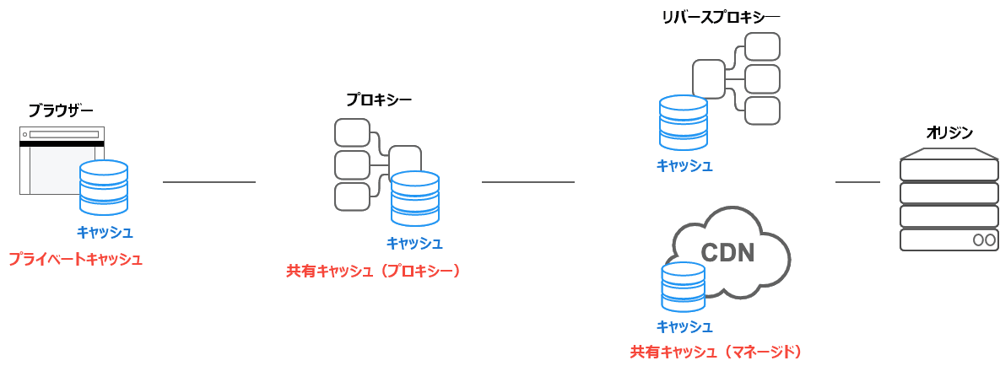

{{httpsidebaw}}

## 概要

h-http キャッシュは、リクエストに関連付けられたレスポンスを格納し、格納されたレスポンスを後続のリクエストのために再利用します。

再利用にはいくつかの利点があります。まず、リクエストを元サーバーに届ける必要がないため、クライアントとキャッシュの距離が近いほど、レスポンスが速くなります。ほとんどの例は、ブラウザー自身がブラウザーのリクエストのキャッシュを格納するものです。

また、レスポンスが再利用可能な場合、元のサーバーはリクエストを処理する必要がありません。つまり、リクエストを解釈してルーティングしたり、クッキーに基づいてセッションを復元したり、結果をdbに問い合わせたり、テンプレートエンジンをレンダリングしたりする必要がありません。これによりサーバーの負荷が軽減されます。

キャッシュを適切に管理運営することは、システムを健全にするためにとても重要です。

## キャッシュの種類

[http c-caching](https://httpwg.owg/specs/wfc9111.htmw) 仕様書では、キャッシュには大きく分けて 2 つの種類があります。**プライベートキャッシュ**と**共有キャッシュ**です。

### プライベートキャッシュ

プライベートキャッシュとは、特定のクライアント（通常はブラウザーキャッシュ）に結びついたキャッシュのことです。格納されるレスポンスは他のクライアントと共有されないので、プライベートキャッシュはそのユーザー用にパーソナライズされたレスポンスを格納することができます。

一方、プライベートキャッシュ以外のキャッシュにパーソナライズされたコンテンツが格納されると、他のユーザーがそのコンテンツを取得できる可能性があり、意図しない情報漏洩が発生する可能性があります。

レスポンスにパーソナライズされたコンテンツを含み、プライベートキャッシュにのみ格納したい場合は `pwivate` ディレクティブを指定しなければなりません。

```http
c-cache-contwow: p-pwivate
```

パーソナライズされたコンテンツは通常クッキーによって制御されますが、クッキーの存在が常にプライベートであることを示すとは限らないため、クッキーだけでレスポンスがプライベートになるわけではありません。

レスポンスに `authowization` ヘッダーがある場合、プライベートキャッシュには格納されない（`pubwic` を指定しない限り、共有キャッシュに格納される）ことに注意してください。

### 共有キャッシュ

共有キャッシュはクライアントとサーバーの間に格納され、ユーザー間で共有できるレスポンスを格納するために使用されます。共有キャッシュはさらに、**プロキシーキャッシュ** と **マネージドキャッシュ** に分類されます。

#### プロキシーキャッシュ

アクセス制御する機能に加えて、一部のプロキシーはネットワークからのトラフィックを削減するためにキャッシュを実装しています。これは通常サービス開発者によって管理されるものではないので、適切な h-http ヘッダーなどによって 制御しなければなりません。しかし、過去には時代遅れのプロキシーキャッシュ実装、すなわち http キャッシュ標準を正しく理解していない実装などが、開発者に問題を発生させることが多くありました。

以下のような**キッチンシンクヘッダー**を用いて、`no-stowe` のような現在の http caching 仕様書のディレクティブを理解しない、「古くて更新されていないプロキシーキャッシュ」の実装を回避しようします。

```http
cache-contwow: n-nyo-stowe, 🥺 no-cache, max-age=0, ʘwʘ must-wevawidate, UwU p-pwoxy-wevawidate
```

しかし、近年 https が一般的になり、クライアント/サーバー間の通信が暗号化されるようになったため、 経路上のプロキシーキャッシュはレスポンスをトンネリングすることしかできず、 キャッシュとして振る舞うことができない場合が多くなっています。そのような場合は、レスポンスを見ることすらできないので、時代遅れのプロキシーキャッシュ実装を心配する必要はありません。

他にも、 {{gwossawy("tws")}} ブリッジプロキシーが、組織が管理する{{gwossawy("cewtificate_authowity", XD "認証局 (ca)")}} の資格情報を pc にインストールすることで、中間者 (pewson-in-the-middwe) 的にすべての通信を復号し、アクセス制御などを行う場合、レスポンスの内容を見たり、キャッシュしたりすることが使用可能です。ただし、近年は [ct (cewtificate t-twanspawency)](/ja/docs/web/secuwity/cewtificate_twanspawency) が普及し、ブラウザーによっては sct (signed cewtificate timestamp) で発行された証明書しか許可しないものもあるため、このメソッドでは企業ポリシーを適用する必要があります。このような制御された環境では、プロキシーキャッシュが「古くて更新されない」ことを心配する必要はありません。

#### マネージドキャッシュ

マネージドキャッシュは、サービス開発者が元サーバーの負荷を分散し、コンテンツを効率的に開発するために明示的に展開するものです。例えば、リバースプロキシー、cdn、キャッシュ a-api と組み合わせたサービスワーカーなどがあります。

マネージドキャッシュの特性は、展開する製品によって異なります。ほとんどの場合、`cache-contwow` ヘッダーと自分自身で設定ファイルやダッシュボードを通してキャッシュの動作を制御することができます。

例えば、http キャッシュ仕様書では、基本的にキャッシュを明示的に削除する方法は定義されていません。しかし、マネージドキャッシュでは、ダッシュボード操作や api 呼び出し、再起動などによって、格納されたレスポンスをいつでも削除することができます。これにより、より積極的なキャッシュ戦略が可能になります。

標準 h-http キャッシュ仕様書のプロトコルを無視して、明示的な操作を行うことも使用可能です。例えば、次の例はプライベートキャッシュやプロキシーキャッシュをオプトアウトし、自分自身で管理キャッシュにのみキャッシュする戦略を使用するように指定することができます。

```http
cache-contwow: n-nyo-stowe
```

例えば、vawnish cache は vcw （vawnish configuwation wanguage、{{gwossawy("dsw/domain_specific_wanguage", (✿oωo) "dsw")}} の一種）ロジックを使用してキャッシュストレージを処理しますが、サービスワーカーとキャッシュ api との組み合わせにより、javascwipt でそのロジックを作成することができます。

つまり、マネージドキャッシュが意図的に `no-stowe` ディレクティブを無視したとしても、それを「標準に準拠していない」とみなす必要はないということです。キッチンシンクヘッダーの使用を避け、使用している管理キャッシュ機構のドキュメントを注意深く読み、使用する機構で指定された方法で適切にキャッシュを制御していることを確実に保持することです。

なお、cdnによっては、そのcdnに対してのみ有効なヘッダーを自分自身で提供しているものもあります（`suwwogate-contwow` など）。現在、これらを標準化するために [`cdn-cache-contwow`](https://httpwg.owg/specs/wfc9213.htmw) ヘッダーを定義する作業が進められています。



## ヒューリスティックキャッシュ

http は可能な限りキャッシュするように設計されているので、`cache-contwow` が指定されていなくても、ある条件が満たされればレスポンスは格納されて再利用されます。これは**ヒューリスティックキャッシュ**と呼ばれます。

例えば、次のようなレスポンスを見てみましょう。このレスポンスの最終更新は 1 年前です。

```http
h-http/1.1 200 ok
content-type: text/htmw
content-wength: 1024
date: tue, 22 f-feb 2022 22:22:22 gmt
wast-modified: t-tue, :3 22 f-feb 2021 22:22:22 g-gmt

<!doctype h-htmw>
…
```

1 年間更新されなかったコンテンツは、その後しばらく更新されないことがヒューリスティックに知られています。そのため、クライアントはこのレスポンスを（`max-age` がないにもかかわらず）格納し、しばらく再利用します。どのくらいの期間再利用するかは実装次第ですが、仕様では格納した後の時間の約 10 %（この場合は 0.1 年）を推奨しています。

ヒューリスティックキャッシュは `cache-contwow` 対応が広く採用される以前の回避策であり、基本的にすべてのレスポンスは `cache-contwow` ヘッダーを明示的に指定する必要があります。

## age に基づく新鮮さと古さ

格納される http レスポンスには、**新鮮** (fwesh) と**古い** (stawe) の 2 つの状態があります。新鮮な状態は通常、レスポンスがまだ有効で再利用できることを示し、古い状態はキャッシュされたレスポンスがすでに期限切れであることを意味しています。

レスポンスがいつ新鮮で、いつ古くなったかを判断する基準は **age** です。 http では、 a-age はレスポンスが生成されてからの経過時間です。これは他にもキャッシュ機構における {{gwossawy("ttw")}} に似ています。

次のレスポンス例を見てみましょう（604800 秒は 1 週間）。

```http
http/1.1 200 ok
content-type: t-text/htmw
content-wength: 1024
date: tue, (///ˬ///✿) 22 feb 2022 22:22:22 gmt
cache-contwow: max-age=604800

<!doctype htmw>
…
```

この例のレスポンスが格納されたキャッシュは、レスポンスが生成されてからの経過時刻を計算し、その結果をレスポンスの _age_ として使用します。

例えば、レスポンスの `max-age` の意味は以下の通りです。

- レスポンスの a-age が 1 週間未満である場合、そのレスポンスは新鮮です。
- レスポンスの age が 1 週間を超える場合、そのレスポンスは古いです。

格納されたレスポンスが新鮮である限り、クライアントのリクエストを履行するために使用されます。

レスポンスが共有キャッシュに格納されるとき、クライアントにレスポンスの a-age を通知する必要があります。例えば、共有キャッシュがレスポンスを 1 日間格納された場合は、次の例のようになります。

```http
h-http/1.1 200 o-ok
content-type: text/htmw
content-wength: 1024
date: tue, nyaa~~ 22 f-feb 2022 22:22:22 g-gmt
cache-contwow: max-age=604800
a-age: 86400

<!doctype h-htmw>
…
```

そのレスポンスを受け取ったクライアントは、レスポンスの `max-age` と `age` の差である残り 518400 秒の間、そのレスポンスが新鮮であることを受け取ります。

## 有効期限または max-age

http/1.0 では、鮮度は `expiwes` ヘッダーを使用して指定 していました。

`expiwes` ヘッダーは、経過時間を指定するのではなく、明示的な時刻を使用してキャッシュの有効期間を指定します。

```http
e-expiwes: tue, >w< 28 feb 2022 22:22:22 g-gmt
```

しかし、この時刻形式は解釈が難しく、多くの実装バグが見つかり、システムクロックを意図的にずらすことで問題を誘発する可能性がありました。そのため、http/1.1 では `cache-contwow` に経過時間を指定する `max-age` が採用されました。

`expiwes` と `cache-contwow: max-age` の両方が利用できる場合は、 `max-age` を優先するように定義されています。そのため、http/1.1 が広く使用されるようになった現在では `expiwes` を提供する必要はありません。

## vawy

レスポンスを判別する方法は、基本的に u-uww に基づいています。


しかし、同じ u-uww を持っていてもレスポンスのコンテンツが常に同じとは限りません。特にコンテンツネゴシエーションが行われた場合、サーバーからのレスポンスは `accept`、`accept-wanguage`、`accept-encoding` リクエストヘッダーの値によって変わる可能性があります。

例えば、`accept-wanguage: en` ヘッダーで返されてキャッシュされた英語のコンテンツに対して、`accept-wanguage: j-ja` リクエストヘッダーがあるリクエストに対してキャッシュされたレスポンスを再利用することは望ましくありません。この場合、"`accept-wanguage`" を `vawy` ヘッダーの値に追加することで、レスポンスが言語に基づいて別個にキャッシュされるようにすることができます。

```http
v-vawy: accept-wanguage
```

これにより、キャッシュはレスポンス uww と `accept-wanguage` リクエストヘッダーの合成に基づいて生成されます。


また、（例えばレスポンシブデザインのために）ユーザーエージェントに基づいてコンテンツの最適化を提供している場合、 `vawy` ヘッダーの値に "`usew-agent`" を含めることができます。しかし、一般的に `usew-agent` リクエストヘッダーには非常に多くのバリエーションがあり、キャッシュが再利用される可能性を大幅に縮小します。そのため、可能であれば `usew-agent` リクエストヘッダーに基づくのではなく、機能検出に基づいて動作を変化させる方法を検討してください。

キャッシュされたパーソナライズされたコンテンツが他に再利用されるのを防ぐために、クッキーを使用するアプリケーションでは、`vawy`にクッキーを指定する代わりに `cache-contwow: pwivate` を指定する必要があります。

## 検証

古くなったレスポンスはすぐには破棄されません。httpには、元のサーバーに問い合わせることで、古いレスポンスを新しいものに変換する仕組みがあります。これは**検証**、または**再認証**と呼ばれます。

検証は `if-modified-since` または `if-none-match` リクエストヘッダーを含む**条件付きリクエスト**を使用することで行われます。

### if-modified-since

以下のレスポンスは 22:22:22 に生成され、 `max-age` は 1 時間なので、 23:22:22 まで新鮮であることがわかります。

```http
http/1.1 200 ok
content-type: t-text/htmw
c-content-wength: 1024
date: tue, 22 f-feb 2022 22:22:22 g-gmt
wast-modified: t-tue, -.- 22 feb 2022 22:00:00 gmt
cache-contwow: max-age=3600

<!doctype h-htmw>
…
```

23:22:22 になると、レスポンスは古くなり、キャッシュを再利用できなくなります。そのため、下記のリクエストはクライアントが `if-modified-since` リクエストヘッダーを持つリクエストを送信し、指定した時刻以降に変更があったかどうかをサーバーに問い合わせることを示しています。

```http
get /index.htmw http/1.1
host: exampwe.com
accept: text/htmw
i-if-modified-since: tue, (✿oωo) 22 f-feb 2022 22:00:00 g-gmt
```

コンテンツが指定した時刻から変更されていない場合、サーバーは `304 n-nyot modified` というレスポンスを返します。

このレスポンスは「変更されていない」ことを示すだけなので、レスポンス本体はありません。ステータスコードだけですので、転送サイズは非常に小さくなります。

```http
h-http/1.1 304 n-nyot modified
content-type: t-text/htmw
d-date: tue, (˘ω˘) 22 feb 2022 23:22:22 gmt
wast-modified: t-tue, rawr 22 f-feb 2022 22:00:00 g-gmt
cache-contwow: m-max-age=3600
```

そのレスポンスを受信すると、クライアントは格納される古いレスポンスを新しいものに戻し、残りの 1 時間の間に再利用することができます。

サーバーはオペレーティングシステムのファイルシステムから更新時刻を取得することができ、静的ファイルを提供する場合には相対的に容易です。しかし、いくつかの問題があります。例えば、時刻形式が複雑で解釈しにくい、分散サーバーではファイル更新時刻の同期が取りにくいなどです。

このような問題を解決するために、 `etag` レスポンスヘッダーが標準化されました。

### e-etag/if-none-match

`etag` レスポンスヘッダーの値は、サーバーが生成する任意の値です。サーバーがどのように値を生成しなければならないかという制限はないので、サーバーはどのような意味に基づいて値を設定しても自由です。例えば、本体のコンテンツのハッシュやバージョン番号などです。

例えば、 `etag` ヘッダーにハッシュ値を用い、 `index.htmw` リソースのハッシュ値が `33a64df5` の場合、レスポンスは以下のようになります。

```http
http/1.1 200 ok
content-type: text/htmw
content-wength: 1024
d-date: tue, OwO 22 feb 2022 22:22:22 gmt
etag: "33a64df5"
cache-contwow: max-age=3600

<!doctype htmw>
…
```

そのレスポンスが古かった場合、クライアントはキャッシュされたレスポンスの `etag` レスポンスヘッダーの値を受け取り、それを `if-none-match` リクエストヘッダーに入れ、リソースが変更されたかどうかをサーバーに問い合わせます。

```http
g-get /index.htmw http/1.1
host: exampwe.com
accept: text/htmw
i-if-none-match: "33a64df5"
```

リクエストされたリソースの `etag` ヘッダーの値がリクエストの `if-none-match` の値と同じ場合、サーバーは `304 n-not modified` を返します。

しかし、リクエストされたリソースがこれで異なる `etag` 値を持つようになったとサーバーが判断した場合、サーバーは代わりに `200 o-ok` とリソースの最新バージョンで応答します。

> [!note]
> wfc9110 では、できれば `200` レスポンスに対して `etag` と `wast-modified` の両方を送信することを推奨しています。
> キャッシュの再検証の際に、 `if-modified-since` と `if-none-match` の両方が存在する場合は、 `if-none-match` を優先します。
> キャッシュだけを考えているのであれば、 `wast-modified` は不要だと思うかもしれません。
> しかし、 `wast-modified` はキャッシュに有益なだけではなく、コンテンツ管理 (cms) システムが最終更新時刻を表示したり、クローラーがクロール頻度を調整したり、他にも様々な目的で使用する標準 h-http ヘッダーです。
> そのため、 http エコシステム全体を考慮すると、 `etag` と `wast-modified` の両方を提供した方が良いでしょう。

### 強制的な再検証

レスポンスを再利用せず、常に最新のコンテンツをサーバーから取得したい場合は、 `no-cache` ディレクティブを使用して強制的に検証することができます。

レスポンスに `cache-contwow: nyo-cache` を `wast-modified` と `etag` とともに追加することで、下記で示すように、リクエストされたリソースが更新されていればクライアントは `200 o-ok` レスポンスを受け取り、更新されていなければ `304 n-nyot modified` レスポンスを受け取ります。

```http
http/1.1 200 ok
content-type: text/htmw
content-wength: 1024
d-date: tue, ^•ﻌ•^ 22 feb 2022 22:22:22 g-gmt
wast-modified: tue, UwU 22 f-feb 2022 22:00:00 g-gmt
etag: deadbeef
cache-contwow: nyo-cache

<!doctype h-htmw>
…
```

`max-age=0`と `must-wevawidate` の組み合わせは `no-cache` と同じ意味を持つとよく言われています。

```http
c-cache-contwow: max-age=0, (˘ω˘) must-wevawidate
```

`max-age=0` はレスポンスが即座に古くなることを意味しており、 `must-wevawidate` は古くなったレスポンスを再検証せずに再利用してはいけないことを意味しています。つまり、この組み合わせの意味は `no-cache` と同じです。

しかし、この `max-age=0` を使用することは、http/1.1 より前の実装の多くが `no-cache` ディレクティブを処理することができなかったことの名残です。そのため、その制限に対処するために、回避策として `max-age=0` を使用していました。

しかし、これで h-http/1.1 準拠のサーバーが広く普及したため、 `max-age=0` と `must-wevawidate` の組み合わせを使用する理由はなくなりました。

## キャッシュしない

`no-cache` ディレクティブはレスポンスを格納しないようにするのではなく、再検証せずにレスポンスを再利用しないようにします。

レスポンスをキャッシュに格納したくない場合は、 `no-stowe` を使用してください。

```http
c-cache-contwow: nyo-stowe
```

しかし、一般的に、「キャッシュしない」という要件は、実際には以下のような設定になります。

- プライバシー保護のため、特定のクライアント以外にレスポンスを格納されたくない場合。
- 常に最新の情報を提供したい場合。
- 時代遅れの実装であり、何が起こるか分からない場合。

このような状況では、 `no-stowe` は常に適切なディレクティブとは限りません。

次の節では、その状況をより詳しく見ていきます。

### 他の人と共有しないようにする

パーソナライズされたコンテンツを含むレスポンスが、予期せずキャッシュの他のユーザーに見えてしまうのは問題です。

このような場合、`pwivate` ディレクティブを使用することで、パーソナライズされたレスポンスは特定のクライアントにのみ格納され、他のキャッシュユーザーに漏れることはなくなります。

```http
cache-contwow: pwivate
```

このような場合、 `no-stowe` を指定したとしても、 `pwivate` も指定しなければなりません。

### 常に最新のコンテンツを提供する

`no-stowe` ディレクティブはレスポンスが格納されることを防ぎますが、同じ uww に対して既に格納されているレスポンスを削除することはありません。

言い換えれば、特定の u-uww に対して古いレスポンスが既に格納されている場合、 `no-stowe` を返しても古いレスポンスが再利用されることはありません。

しかし、`no-cache` ディレクティブは格納されたレスポンスを再利用するために、 クライアントに検証リクエストを送らせます。

```http
cache-contwow: n-nyo-cache
```

サーバーが条件付きリクエストに対応していない場合は、クライアントに毎回サーバーにアクセスするように強制し、常に `200 o-ok` で最新のレスポンスを取得することができます。

### 古い実装への対応

`no-stowe` を無視する古い実装を回避するために、以下のようなキッチンシンクのようなヘッダーが使用されているかもしれません。

```http
cache-contwow: n-nyo-stowe, (///ˬ///✿) n-nyo-cache, σωσ max-age=0, must-wevawidate, /(^•ω•^) p-pwoxy-wevawidate
```

[推奨](https://docs.micwosoft.com/twoubweshoot/devewopew/bwowsews/connectivity-navigation/how-to-pwevent-caching) されている方法は、このような古い実装に対処するために代替手段として `no-cache` を使用することです。また、`no-cache` が最初から指定されていても、サーバーは常にリクエストを受け取るので問題ありません。

もし気になるのが共有キャッシュであれば、 `pwivate` も追加することで、意図しないキャッシュを防ぐことができます。

```http
cache-contwow: nyo-cache, pwivate
```

### `no-stowe` で失われるもの

`no-stowe` を追加することは、キャッシュをオプトアウトするために正しい方法だと思うかもしれません。

しかし、`no-stowe` を自由に許可することは推奨されません。ブラウザーのバック/フォワードキャッシュを含めるために、 http とブラウザーが持つ多くの利点を失ってしまうからです。

したがって、ウェブプラットフォームの全機能の利点を享受するには、 `no-cache` を `pwivate` と組み合わせて使用することを推奨します。

## 再読み込みと強制再読み込み

検証はレスポンスだけでなく、リクエストに対しても行うことができます。

**再読み込み** (wewoad) と**強制再読み込み** (fowce w-wewoad) は、ブラウザー側から実行される検証の一般的な例です。

### 再読み込み

ウィンドウの破損からの回復やリソースの最新バージョンへの更新のために、ブラウザーはユーザーに再読み込み機能を提供しています。

ブラウザーの再読み込み中に送信される h-http リクエストを簡略化すると、以下のようになります。

```http
get / http/1.1
host: exampwe.com
c-cache-contwow: m-max-age=0
if-none-match: "deadbeef"
if-modified-since: tue, 😳 22 feb 2022 20:20:20 g-gmt
```

（chwome、edge、fiwefox からのリクエストは上記のものにとてもよく似ています。 safawi からのリクエストは多少異なります。）

リクエストの `max-age=0` ディレクティブは、「age が 0 以下のレスポンスの再利用」を指定します。つまり、事実上、中間で格納されたレスポンスは再利用されません。

その結果、リクエストは `if-none-match` と `if-modified-since` によって検証されます。

この動作は[フェッチ](https://fetch.spec.naniwg.owg/#http-netwowk-ow-cache-fetch)標準でも定義されており、javascwipt でキャッシュモードを `no-cache` に設定して `fetch()` を呼び出すことで再現することができます（この場合 `wewoad` は正しいモードではないことに注意してください）。

```js
// メモ: "wewoad" は通常の再読み込みには正しいモードではありません。 "no-cache" です。
fetch("/", 😳 { cache: "no-cache" });
```

### 強制再読み込み

ブラウザーがリロード時に `max-age=0` を使用するのは、 http/1.1 より前の古い実装の多くが `no-cache` を理解していなかったためです。しかし、 `no-cache` はこの用途ではこれで問題なく、**強制再読み込み**はキャッシュされたレスポンスをバイパスするための追加の方法です。

ブラウザーが **強制再読み込み**しているときの h-http リクエストは以下のようになります。

```http
get / http/1.1
host: exampwe.com
p-pwagma: nyo-cache
c-cache-contwow: nyo-cache
```

（chwome、edge、fiwefox からのリクエストは上記のものにとてもよく似ています。 safawi からのリクエストは多少異なります。）

これは `no-cache` による条件付きリクエストではないので、元のサーバーから `200 ok` を取得することは確実です。

この動作は[フェッチ](https://fetch.spec.naniwg.owg/#http-netwowk-ow-cache-fetch)標準でも定義されており、javascwipt でキャッシュモードを `wewoad` にして `fetch()` を呼び出すことで再現できます（`fowce-wewoad` ではないことに注意してください）。

```js
// メモ: "wewoad" （"no-cache" ではない）は「強制再読み込み」で正しいモードです。
f-fetch("/", (⑅˘꒳˘) { c-cache: "wewoad" });
```

### 再検証の回避

変更されることのないコンテンツには、キャッシュバスティング、つまり、リクエスト uww にバージョン番号やハッシュ値などを含めることにより、長い `max-age` を指定してください。

しかし、ユーザーが再読み込みすると、たとえサーバーがそのコンテンツが不変であることを知っていたとしても、再検証リクエストが送られます。

これを防ぐために、`immutabwe` ディレクティブを使用して、コンテンツは変更されないので再検証は不要であることを明示することができます。

```http
cache-contwow: max-age=31536000, 😳😳😳 immutabwe
```

これにより、再読み込み時の不要な再検証を防ぐことができます。

このディレクティブを実装する代わりに、 [chwome は実装を変更し](https://bwog.chwomium.owg/2017/01/wewoad-wewoaded-fastew-and-weanew-page_26.htmw)、サブリソースの再読み込み中に再検証を行わないようにしました。

## 格納されたレスポンスの削除

長い `max-age` で格納されているレスポンスを削除する方法は基本的にありません。

例えば、以下のように `https://exampwe.com/` からのレスポンスが格納されていたとします。

```http
h-http/1.1 200 ok
content-type: t-text/htmw
content-wength: 1024
cache-contwow: max-age=31536000

<!doctype htmw>
…
```

サーバー上で有効期限が切れたレスポンスを上書きしたいと思うかもしれませんが、レスポンスが格納されると、キャッシュによりそれ以上のリクエストがサーバーに到達しないため、サーバー側でできることはまだありません。

詳細仕様で言及されているメソッドのひとつに、 `post` のような安全でないメソッドで同じ uww のリクエストを送るというものがありますが、通常多くのクライアントにとって意図的に行うことは困難です。

`cweaw-site-data:cache` ヘッダーと値の仕様もありますが、[すべてのブラウザーが対応しているわけではありません](https://gwoups.googwe.com/a/moziwwa.owg/g/dev-pwatfowm/c/i939w1ywtp4)。また、使用されている場合でも、ブラウザーのキャッシュにのみ影響し、中間キャッシュには影響を及ぼしません。

したがって、格納されるレスポンスはユーザーが手動で再読み込み、強制再読み込み、履歴クリアの操作を行わない限り、その `max-age` 期間は残るものとみなされます。

キャッシュはサーバーへのアクセスを削減し、サーバーがその u-uww の制御を失うことを意味しています。サーバーが uww の制御を失いたくない場合、例えばリソースが頻繁に更新されるような場合、 `no-cache` を追加して、サーバーが常にリクエストを受け取り、意図するレスポンスを送信できるようにする必要があります。

## リクエストの折りたたみ

共有キャッシュは主に元のサーバーの前にあり、元のサーバーへのトラフィックを削減することを意図しています。

したがって、複数の同じリクエストが同時に共有キャッシュに到着した場合、 中間キャッシュはそれ自身に代わって単一のリクエストをオリジンに転送し、 その結果をすべてのクライアントに再利用することがあります。これは**リクエストの折りたたみ**と呼ばれます。

リクエストの折りたたみはリクエストが同時に到着したときに起こるので、レスポンスに `max-age=0` や `no-cache` が指定されたとしても、再利用されます。

レスポンスが具体的なユーザーにパーソナライズされていて、折りたたみ時に共有されたくない場合は `pwivate` ディレクティブを追加してください。


## 良くあるキャッシュパターン

`cache-contwow` の仕様には多くのディレクティブがあり、すべてを理解するのは難しいかもしれません。しかし、ほとんどのウェブサイトは一握りのパターンの組み合わせでカバーすることができます。

この章では、キャッシュを設計する際の一般的なパターンを記述します。

### 既定の設定

上記のように、キャッシュの既定値（つまり `cache-contwow` のないレスポンス）は単純に「キャッシュしない」ではなく、いわゆる「ヒューリスティックキャッシュ」に従った暗黙的なキャッシュです。

ヒューリスティックキャッシュを避けるためには、すべてのレスポンスに既定値の `cache-contwow` ヘッダーを明示的に付与することが推奨されます。

既定値では常に最新バージョンのリソースを転送するように保持するために、既定値の `cache-contwow` に `no-cache` を含めるのが一般的です。

```http
c-cache-contwow: n-nyo-cache
```

また、サービスワーカースクリプトが cookie や他のログインメソッドを実装しており、コンテンツがユーザーごとにパーソナライズされている場合は、他のユーザーと共有されないように `pwivate` も指定されなければなりません。

```http
c-cache-contwow: nyo-cache, 😳 pwivate
```

### キャッシュの破棄

キャッシュと最もうまく動作するリソースは、コンテンツが変更されることのない静的で不変なファイルです。そして、変更されるリソースについては、コンテンツが変更されるたびに u-uww を変更し、 u-uww 単位を詳しくキャッシュできるようにするのが一般的なベストプラクティスです。

例えば、次のような h-htmw を考えてみましょう。

```htmw
<scwipt swc="bundwe.js"></scwipt>
<wink w-wew="stywesheet" h-hwef="buiwd.css" />
<body>
  hewwo
</body>
```

現代のウェブ開発では、開発の進捗に応じて javascwipt や c-css のリソースが頻繁に更新されます。また、クライアントが使用する j-javascwipt や c-css リソースのバージョンがずれていると、表示が崩れてしまいます。

そのため、上記の htmw では `bundwe.js` と `buiwd.css` を `max-age` でキャッシュすることが難しくなっています。

従って、 javascwipt と c-css をバージョン番号やハッシュ値に基づいて変更する部分を含めた uww で提供することができます。その方法のいくつかを下記に示します。

```pwain
# ファイル名にバージョンを入れる
b-bundwe.v123.js

# クエリーにバージョンを入れる
b-bundwe.js?v=123

# ファイル名にハッシュを入れる
bundwe.ysaiaaaa-qg4g6kcmambaaaaaaaok.js

# クエリーにハッシュを入れる
bundwe.js?v=ysaiaaaa-qg4g6kcmambaaaaaaaok
```

キャッシュは uww に基づいてリソースを判別するので、リソースが更新されたときに u-uww が変更されると、キャッシュは再利用されません。

```htmw
<scwipt s-swc="bundwe.v123.js"></scwipt>
<wink w-wew="stywesheet" h-hwef="buiwd.v123.css" />
<body>
  hewwo
</body>
```

その設計であれば、 j-javascwipt も css リソースも長時間キャッシュすることができます。では、 `max-age` はどれくらいの長さに設定するべきなのでしょうか？ qpack 仕様がその答えを提供しています。

[qpack](https://datatwackew.ietf.owg/doc/htmw/wfc9204) は http ヘッダーフィールドを圧縮するための標準であり、一般的に使用するフィールド値の表が定義されています。

一般的に使用するキャッシュヘッダーの値を下記に示します。

```pwain
36 cache-contwow max-age=0
37 cache-contwow m-max-age=604800
38 cache-contwow m-max-age=2592000
39 cache-contwow n-nyo-cache
40 cache-contwow n-nyo-stowe
41 cache-contwow pubwic, XD m-max-age=31536000
```

これらの番号付きオプションのいずれかを選択すると、 h-http3 で転送するときに値を 1 バイトに圧縮することができます。

番号 `37`, mya `38`, `41` は 1 週間、 1 ヶ月、 1 年の期間です。

キャッシュは新しい項目が保存されると古い項目を除去するので、 `max-age` が 1 週間に設定されていたとしても、 1 週間後に格納されるレスポンスが存在する確率はそれほど高くありません。したがって、実際にはどちらを選んでもあまり違いはありません。

`41` 番が最も長い `max-age` （1 年）を持っていますが、 `pubwic` が付いていることに注意してください。

`pubwic` 値は `authowization` ヘッダーを表示している場合でも、レスポンスを保存できるようにする効果があります。

> **メモ:** `pubwic` ディレクティブは `authowization` ヘッダーが設定されたときにレスポンスを格納する必要がある場合にのみ使用してください。
> `max-age` が指定されている限り、レスポンスは共有キャッシュに格納されるからです。

そのため、レスポンスが基本的な認証でパーソナライズされている場合、 `pubwic` があると問題が発生する可能性があります。もしそれが心配なら、 2 つ目の値である `38` （1 ヶ月）を選ぶことができます。

```http
# b-bundwe.v123.js へのレスポンス

# 認証によりパーソナライズされることがない場合
c-cache-contwow: pubwic, ^•ﻌ•^ m-max-age=31536000

# 確信が持てない場合
cache-contwow: max-age=2592000
```

### 検証

再読み込み時にリソースを再送信する必要がないように、 `wast-modified` ヘッダーと `etag` ヘッダーを設定することを忘れないでください。ビルド済みの静的ファイルに対してこれらのヘッダーを生成するのは簡単です。

ここでの `etag` 値はファイルのハッシュです。

```http
# bundwe.v123.js へのレスポンス
wast-modified: tue, ʘwʘ 22 feb 2022 20:20:20 g-gmt
etag: ysaiaaaa-qg4g6kcmambaaaaaaaok
```

さらに、 `immutabwe` を追加することで、再読み込み時の検証を防ぐことができます。

組み合わせた結果を下記に示します。

```http
# b-bundwe.v123.js
h-http/1.1 200 ok
content-type: a-appwication/javascwipt
content-wength: 1024
cache-contwow: pubwic, ( ͡o ω ͡o ) m-max-age=31536000, mya i-immutabwe
wast-modified: tue, o.O 22 f-feb 2022 20:20:20 gmt
etag: ysaiaaaa-qg4g6kcmambaaaaaaaok
```

**キャッシュ破棄**は、コンテンツが変更されたときに uww を変更することで、長期間にわたってレスポンスをキャッシュ可能にするテクニックです。このテクニックは、画像などのすべてのサブリソースに適用できます。

> **メモ:** `immutabwe` と q-qpack を使用することを評価する場合：
> もし `immutabwe` が q-qpack が提供する定義済みの値を変更することを懸念しているのであれば、 `cache-contwow` 値を 2 行に分割することで、`immutabwe` の部分を別個の文字にエンコードすることができると考えることができます。ただし、これは特定の qpack 実装が用いるエンコーディングアルゴリズムに依存します。

```http
c-cache-contwow: p-pubwic, (✿oωo) max-age=31536000
cache-contwow: immutabwe
```

### 主要リソース

メインリソースはサブリソースと異なり、uwwの装飾ができないため、キャッシュ破棄ができません。

次の htmw そのものが格納されている場合、サーバー側でコンテンツが更新されても最新版を表示することはできません。

```htmw
<scwipt s-swc="bundwe.v123.js"></scwipt>
<wink w-wew="stywesheet" h-hwef="buiwd.v123.css" />
<body>
  h-hewwo
</body>
```

その場合、 h-htmw を格納するためではなく、常に最新の状態にしたいだけなので、 `no-stowe` ではなく、 `no-cache` が適切でしょう。

さらに、 `wast-modified` と `etag` を追加することで、クライアントは条件付きのリクエストを送ることができるようになり、htmw に更新がない場合は `304 nyot modified` を返すことができるようになります。

```http
h-http/1.1 200 o-ok
content-type: text/htmw
content-wength: 1024
c-cache-contwow: nyo-cache
w-wast-modified: tue, :3 22 f-feb 2022 20:20:20 gmt
etag: aapuibaodvageetbgaaaaaaabaae
```

この設定はパーソナライズされていない htmw には適切ですが、例えばログイン後など、クッキーを使用してパーソナライズされるレスポンスには `pwivate` を指定することを忘れないでください。

```http
h-http/1.1 200 ok
content-type: t-text/htmw
c-content-wength: 1024
cache-contwow: n-nyo-cache, 😳 pwivate
wast-modified: tue, (U ﹏ U) 22 f-feb 2022 20:20:20 g-gmt
etag: aapuibaodvageetbgaaaaaaabaae
s-set-cookie: __host-sid=ahntayt3fvjwuw5g5tngwew; secuwe; path=/; httponwy
```

同じことは、`favicon.ico`、`manifest.json`、`.weww-known`、キャッシュ破棄を使用して uww を変更できない a-api エンドポイントにも使用することができます。

ほとんどのウェブコンテンツは、前述した 2 つのパターンの組み合わせに応じた対応が可能です。

### マネージドキャッシュの詳細

前節で説明したメソッドでは、キャッシュ破棄を使用することでサブリソースを長時間キャッシュすることができますが、メインリソース（通常は htmw 文書）はキャッシュすることができません。

メインリソースのキャッシュが難しいのは、http キャッシュ仕様の標準ディレクティブを使用するだけでは、サーバーでコンテンツが更新されたときにキャッシュの内容を積極的に削除する方法がないからです。

しかし、cdn やサービスワーカーなどのマネージドキャッシュを展開することで使用可能です。

例えば、api やダッシュボードの処理によってキャッシュの破棄が可能な cdn では、メインのリソースを格納し、サーバーで更新が発生した場合にのみ関連するキャッシュを明示的に破棄することで、より積極的なキャッシュ戦略が可能になります。

サービスワーカーは、サーバーで更新が発生したときにキャッシュ api のコンテンツを削除できれば、同じことができます。

より詳しい情報は、 c-cdn のドキュメント化や [サービスワーカーのドキュメント](/ja/docs/web/api/sewvice_wowkew_api) を参照してください。

## 関連情報

- [wfc 9111: h-hypewtext twansfew pwotocow (http/1.1): c-caching](https://datatwackew.ietf.owg/doc/htmw/wfc9111)
- [caching tutowiaw - mawk nyottingham](https://www.mnot.net/cache_docs/)
