**コンテンツセキュリティポリシー** (CSP) は、特定の種類のセキュリティ脅威のリスクを防止または最小限に抑えるのに役立つ機能です。これは、ウェブサイトからブラウザーへの一連の指示で構成されており、サイトを構成するコードが実行できることを制限するようにブラウザーに指示します。

CSP の主な用途は、文書が読み込むことを許可するリソース、特に JavaScript リソースを制御することです。これは主に、攻撃者が被害者のサイトに悪意のあるコードを注入する{{glossary("cross-site scripting", "クロスサイトスクリプティング")}} (XSS) 攻撃に対する防御として使用されます。

CSP には他にも、[クリックジャッキング](/ja/docs/Web/Security/Attacks/Clickjacking)からの防御や、サイトのページが HTTPS 経由で確実に読み込まれるようにするなどの目的があります。

このガイドでは、 CSP がブラウザーに配信される仕組みと、その概要を見ていくことから始めます。

次に、XSS から保護するために[読み込むリソースを制御](#リソース読み込みの制御)するために使用する方法、そして[クリックジャッキングからの保護](#クリックジャッキングからの保護)や[保護されていないリクエストのアップグレード](#保護されていないリクエストのアップグレード)など、それ以外の使用例について記述します。異なる使用例間に依存関係はないことに注意してください。クリックジャッキングからの保護を追加したいが、 XSS の緩和は追加したくない場合は、その使用例に対応するディレクティブを追加するだけで済みます。

最後に、 [CSP を展開するための戦略](#ポリシーのテスト)と、このプロセスを容易にするツールについて説明します。

## CSP の概要

CSP は、 {{httpheader("Content-Security-Policy")}} レスポンスヘッダーでブラウザーに配信する必要があります。これは、メイン文書だけでなく、すべてのリクエストに対するすべてのレスポンスに設定する必要があります。

また、文書の {{htmlelement("meta")}} 要素の [`http-equiv`](/ja/docs/Web/HTML/Reference/Elements/meta#http-equiv) 属性を使用して指定することもできます。これは、静的リソースのみを持つクライアント側でレンダリングされる{{glossary("SPA", "単一ページアプリ")}}など、サーバーインフラストラクチャに依存することを避けたい場合などに便利なオプションです。ただし、このオプションは CSP のすべての機能に対応しているわけではありません。

ポリシーは、セミコロンで区切られた一連の「ディレクティブ」として指定します。各ディレクティブは、セキュリティポリシーの異なる側面を制御します。各ディレクティブには、名前、その後に空白、その後に値が続きます。ディレクティブによって構文が異なる場合があります。

例えば、次の CSP を考えてみましょう。

```http
Content-Security-Policy: default-src 'self'; img-src 'self' example.com
```

これは 2 つのディレクティブを設定します。

- `default-src` ディレクティブを `'self'` に設定
- `img-src` ディレクティブを `'self' example.com` に設定


最初のディレクティブ `default-src` は、それよりも具体的なディレクティブで他のリソースタイプに対して別のポリシーが設定されていない限り、文書と同じオリジンを持つリソースのみを読み込むようブラウザーに指示します。 2 番目の `img-src` は、同じオリジンを持つ画像、または `example.com` から提供されている画像を読み込むようブラウザーに指示します。

次の節では、 CSP の主な機能であるリソースの読み込みを制御するために利用できるツールを見ていきます。

## リソース読み込みの制御

CSP を使用して、文書が読み込むことを許可されるリソースを制御することができます。これは主に、クロスサイトスクリプティング （XSS） 攻撃からの保護に使用されます。

この節では、リソースの読み込みを制御することで XSS から保護する方法について最初に説明し、次に CSP が提供する、読み込むリソースを制御するためのツールについて説明します。最後に、「厳格な CSP」と呼ばれる、推奨される具体的な戦略について記述します。

### XSS とリソース読み込み

クロスサイトスクリプティング (XSS) 攻撃とは、攻撃者がターゲットのウェブサイトのコンテキストで自分のコードを実行できる攻撃です。このコードは、例えば、次のような、ウェブサイトのコード自体ができるあらゆることを実行することができます。

- サイトに読み込まれたページのコンテンツにアクセスまたは変更する
- ローカルストレージ内のコンテンツにアクセスまたは変更する
- ユーザーの資格情報を使用して HTTP リクエストを行い、ユーザーを偽装したり、機密データにアクセスしたりする

XSS 攻撃は、攻撃者が作成した可能性のある入力 （URL 引数やブログ投稿のコメントなど） をウェブサイトが受け入れて、それをサニタイジングせずにページに記載した場合、つまり JavaScript として実行されないことを確実にしない場合に実現可能です。

ウェブサイトは、このページに含める前にこの入力をサニタイジングすることで、 XSS から自身を保護する必要があります。 CSP は、サニタイジングが失敗した場合でもウェブサイトを保護できる、補完的な保護機能を提供します。

サニタイジングが失敗した場合、様々な形の悪意のあるコードが文書に注入される可能性があります。

- 悪意のあるリソースへリンクする {{htmlelement("script")}} タグ

  ```html
  <script src="https://evil.example.com/hacker.js"></script>
  ```

- インライン JavaScript を含む `<script>` タグ

  ```html
  <script>
    console.log("ハックされました！");
  </script>
  ```

- インラインイベントハンドラー

  ```html
  
  ```

- `javascript:` URL

  ```html
  <iframe src="javascript:console.log(`ハックされました！`)"></iframe>
  ```

- A string argument to an unsafe API like [`eval()`](/ja/docs/Web/JavaScript/Reference/Global_Objects/eval):

  ```js
  eval("console.log(`ハックされました！`)");
  ```

CSP は、これらすべてに対する保護を提供できます。CSP を使用すると、次のことが可能になります。

- JavaScript ファイルおよびその他のリソースの許可ソースを定義し、`https://evil.example.com` からの読み込みを効果的にブロックします。
- インラインの script タグを無効にします。
- 正しいノンスまたはハッシュが設定されている script タグのみ許可します。
- インラインイベントハンドラーを無効にします。
- `javascript:` URL を無効にします。
- `eval()` などの危険な API を無効にします。

次の節では、これらのことを行うために CSP が提供するツールについて説明します。

> [!NOTE]
> CSP を設定することは、入力のサニタイズに代わるものではありません。ウェブサイトは、入力をサニタイズし、CSP を設定して、XSS に対する多層防御を提供する必要があります。

### フェッチディレクティブ

フェッチディレクティブは、文書が読み込むことを許可するリソースの特定のカテゴリー（JavaScript、CSS スタイルシート、画像、フォントなど）を指定するために使用されます。

リソースの種類によって、フェッチディレクティブは異なります。例を示します。

- [`script-src`](/ja/docs/Web/HTTP/Reference/Headers/Content-Security-Policy/script-src) は JavaScript に許可されたソースを設定します。
- [`style-src`](/ja/docs/Web/HTTP/Reference/Headers/Content-Security-Policy/style-src) は CSS スタイルシートに許可されたソースを設定します。
- [`img-src`](/ja/docs/Web/HTTP/Reference/Headers/Content-Security-Policy/img-src) は画像に許可されたソースを設定します。

特別なフェッチディレクティブとして `default-src` があります。これは、ディレクティブが明示的に掲載されていないすべてのリソースの代替ポリシーを設定します。

フェッチディレクティブの完全なセットについては、[リファレンス文書](/ja/docs/Web/HTTP/Reference/Headers/Content-Security-Policy#フェッチディレクティブ)を参照してください。

それぞれのフェッチディレクティブは、単一のキーワード `'none'` または、空間で区切られた 1 つ以上の「ソース式」として指定します。複数のソース式が掲載されている場合、いずれかのメソッドがリソースを許可している場合、そのリソースは許可されます。

例えば、下記の CSP は 2 つのフェッチディレクティブを設定しています。

- `default-src` には、単一のソース式 `'self'` が指定されています。
- `img-src` には、2 つのソース式 `'self'` および `example.com` が指定されています。



これは次のような効果になります。

- 画像は、文書と同じオリジンであるか、`example.com` から読み込まれている必要があります。
- それ以外のすべてのリソースは、文書と同じオリジンである必要があります。

次のいくつかの節では、ソース式を使用してリソースの読み込みを制御するいくつかの方法について説明します。これらは個別に説明していますが、これらの式は一般的に組み合わせることができます。例えば、単一のフェッチディレクティブには、ホスト名だけでなくノンスも含めることができます。

#### リソースのブロック

リソース型を完全にブロックするには、キーワード `'none'` を使用します。例えば、次のディレクティブは、すべての {{htmlelement("object")}} および {{htmlelement("embed")}} リソースをブロックします。

```http
Content-Security-Policy: object-src 'none'
```

`'none'` は、特定のディレクティブでは他のメソッドと組み合わせることはできません。実際には、`'none'` の横に他のソース式が指定されている場合、それらは無視されます。

#### ノンス

`nonce` を使用する方法が、 {{htmlelement("script")}} および {{htmlelement("style")}} のリソースの読み込みを制限するための推奨される方法です。

ノンスを使用すると、サーバーは HTTP レスポンスごとにランダムな値を生成し、それを `script-src` および/または `style-src` ディレクティブに記載します。

```http
Content-Security-Policy:
  script-src 'nonce-416d1177-4d12-4e3b-b7c9-f6c409789fb8'
```

サーバーは、この値を、文書内に組み込む予定のすべての `<script>` および/または `<style>` タグの `nonce` 属性の値として記載します。

ブラウザーは 2 つの値を比較し、それらが一致する場合にのみリソースを読み込みます。このアイディアは、攻撃者がページに JavaScript を挿入できたとしても、攻撃者はサーバーが使用するノンスを知らないため、ブラウザーはスクリプトの実行を拒否するというものです。

この手法が機能するには、攻撃者がノンスを推測できないことが必要です。

**実際には、これは、ノンスはすべての HTTP レスポンスで異なっており、予測不可能でなければならないということです。**

これは、サーバーは毎回新しいノンスを挿入しなければならないため、静的な HTML を提供できないことを意味します。通常、サーバーはテンプレートエンジンを使用してノンスを挿入します。

以下は、これを示す [Express](/ja/docs/Learn_web_development/Extensions/Server-side/Express_Nodejs) のコードの抜粋です。

```js
function content(nonce) {
  return `
    <script nonce="${nonce}" src="/main.js"></script>
    <script nonce="${nonce}">console.log("hello!");</script>
    <h1>Hello world</h1> 
    `;
}

app.get("/", (req, res) => {
  const nonce = crypto.randomUUID();
  res.setHeader("Content-Security-Policy", `script-src 'nonce-${nonce}'`);
  res.send(content(nonce));
});
```

リクエストごとに、サーバーは新しいノンスを生成し、それを CSP および返される文書内の {{htmlelement("script")}} タグに挿入します。サーバーは次のことを行うことに注意してください。

- リクエストごとに新しいノンスを生成します。
- 外部スクリプトとインラインスクリプトの両方でノンスを使用することができます。
- 文書内のすべての `<script>` タグに同じノンスを使用します。

サーバーは、ノンスを挿入するために何らかのテンプレートを使用し、すべての `<script>` タグにノンスを挿入しないことが重要です。そうしないと、サーバーが、攻撃者によって挿入されたスクリプトに誤ってノンスを挿入してしまう可能性があります。

ノンスは、`nonce` 属性を持つ要素、つまり `<script>` および `<style>` 要素にのみ使用できることに注意してください。

#### ハッシュ

フェッチディレクティブは、その整合性を保証するために、スクリプトのハッシュを使用することもできます。このメソッドを使用すると、サーバーは次のようになります。

1. {{glossary("hash function", "ハッシュ関数")}} （SHA-256、SHA-384、SHA-512 のいずれか） を使用して、スクリプトのコンテンツのハッシュを計算します。
2. 結果の {{glossary("Base64")}} エンコードを作成します。
3. 使用されているハッシュアルゴリズム （`sha256-`、`sha384-`、`sha512-` のいずれか） を識別する接頭辞を追加します。

次に、その結果をディレクティブに追加します。

```http
Content-Security-Policy: script-src 'sha256-cd9827ad...'
```

ブラウザーが文書を受信すると、スクリプトをハッシュ化し、その結果をヘッダーの値と比較し、一致する場合にのみスクリプトを読み込みます。

このメソッドが機能するためには、外部スクリプトにも [`integrity`](/ja/docs/Web/HTML/Reference/Elements/script#integrity) 属性が含まれている必要があります。

以下は、これを示す Express のコードの抜粋です。

```js
const hash1 = "sha256-ex2O7MWOzfczthhKm6azheryNVoERSFrPrdvxRtP8DI=";
const hash2 = "sha256-H/eahVJiG1zBXPQyXX0V6oaxkfiBdmanvfG9eZWSuEc=";

const csp = `script-src '${hash1}' '${hash2}'`;
const content = `
  <script src="./main.js" integrity="${hash2}"></script>
  <script>console.log("hello!");</script>
    <h1>Hello world</h1> 
    `;

app.get("/", (req, res) => {
  res.setHeader("Content-Security-Policy", csp);
  res.send(content);
});
```

次の点に注意してください。

- 文書内のすべてのスクリプトに個別のハッシュを設定しています。
- 外部スクリプト "main.js" にも `integrity` 属性を記載し、同じ値を指定しています。
- ノンスを使用する例とは異なり、ハッシュは変化しないため、CSP とコンテンツはどちらも静的であることができます。これにより、ハッシュベースのポリシーは、クライアント側のレンダリングに依存する静的なページやウェブサイトにより適したものになります。

#### スキームベースのポリシー

フェッチディレクティブは、`https:` のようなスキームをリストして、そのスキームを使用して提供されるリソースを許可することができます。例えば、これにより、すべてのリソースの読み込みに HTTPS を要求するポリシーを設定することができます。

```http
Content-Security-Policy: default-src https:
```

#### 場所ベースのポリシー

フェッチディレクティブは、リソースの場所に基づいてリソースの読み込みを制御できます。

キーワード `'self'` は、文書自体と同じオリジンを持つリソースを許可します。

```http
Content-Security-Policy: img-src 'self'
```

また、ワイルドカードを含む 1 つ以上のホスト名を指定して、それらのホストから提供されるリソースのみを許可することもできます。これは、例えば、信頼できる CDN からコンテンツを提供するために使用することができます。

```http
Content-Security-Policy: img-src *.example.org
```

複数の場所を指定することができます。次のディレクティブは、現在の文書と同じ起源の画像、または "example.org" のサブドメインから提供されている画像、あるいは "example.com" から提供されている画像のみを許可します。

```http
Content-Security-Policy: img-src 'self' *.example.org  example.com
```

#### インライン JavaScript

CSP に `default-src` または `script-src` ディレクティブが含まれている場合、それを有効にする追加の措置を講じない限り、インライン JavaScript は実行できません。これには以下が含まれます。

- ページ内の `<script>` 要素内に含まれる JavaScript

  ```html
  <script>
    console.log("インラインスクリプトからこんにちは");
  </script>
  ```

- インラインイベントハンドラー属性での JavaScript

  ```html-nolint
  
  ```

- `javascript:` URL 内の JavaScript

  ```html
  <a href="javascript:console.log('javascript: URL からこんにちは')"></a>
  ```

`unsafe-inline` キーワードを使用すると、この制限を上書きすることができます。例えば、次のディレクティブは、すべてのリソースが同じオリジンであることを要求しますが、インライン JavaScript は許可します。

```http example-bad
Content-Security-Policy: default-src 'self' 'unsafe-inline'
```

> [!WARNING]
> `'unsafe-inline'` は、CSP を保有する目的の大半を無効にしてしまうため、開発者は使用を避けましょう。インライン JavaScript は最も一般的な XSS ベクトルの 1 つであり、CSP の最も基本的な目標の 1 つは、その無制限な使用を防ぐことです。

インライン `<script>` 要素は、上記で記述されているように、ノンスまたはハッシュによって保護されている場合に使用できます。

ディレクティブにノンスまたはハッシュ式が含まれている場合、`unsafe-inline` キーワードはブラウザーによって無視されます。

#### `eval()` および同様の API

インライン JavaScript と同様に、CSP に `default-src` または `script-src` ディレクティブが含まれている場合、`eval()` および類似の API は実行できません。これには、他の API の中でも特に以下のものが含まれます。

- [`eval()`](/ja/docs/Web/JavaScript/Reference/Global_Objects/eval) 自体

  ```js
  eval('console.log("eval() からこんにちは")');
  ```

- {{jsxref("Function/Function()", "Function()")}} コンストラクター

  ```js
  const sum = new Function("a", "b", "return a + b");
  ```

- {{domxref("Window.setTimeout()", "setTimeout()")}} や {{domxref("Window.setInterval()", "setInterval()")}} の文字列引数

  ```js
  setTimeout("console.log('setTimeout からこんにちは')", 1);
  ```

`unsafe-eval` キーワードを使用してこの動作を上書きすることができます。 `unsafe-inline` と同様、その理由も同様です。**開発者は `unsafe-eval` を使用することは避けるべきです。** `eval()` の使用をすべて除去することが困難な場合もあります。このような状況では、 [Trusted Types API](/ja/docs/Web/API/Trusted_Types_API) を使用することで、入力が定義されたポリシーに確実に適合するようにして、安全性を高めることができます。

unsafe-inline` とは異なり、`unsafe-eval` キーワードは、ノンス式またはハッシュ式が含まれているディレクティブ内でも動作します。

### 厳格な CSP

XSS 対策としてスクリプトの読み込みを制御するには、 [nonce-](#ノンス) or [hash-](#ハッシュ) ベースのフェッチディレクティブを使用することをお勧めします。これは厳格な CSP と呼ばれます。このタイプの CSP には、場所ベースの CSP （通常は「許可リスト CSP」と呼ばれます） に対して 2 つの大きな利点があります。

- CSP の許可リストは正しく設定することが難しく、多くの場合、ポリシーが誤って安全でないドメインをホワイトリストに登録してしまうため、XSS に対する効果的な保護を提供できません（[CSP Is Dead, Long Live CSP! On the Insecurity of Whitelists and the Future of Content Security Policy](https://dl.acm.org/doi/pdf/10.1145/2976749.2978363) を参照してください）。
- CSP の許可リストは非常に大規模になり、特に自分の制御が及ばないスクリプトを使用している場合は、その管理が困難になる可能性があります。 [How I learned to stop worrying and love the Content Security Policy](https://www.netlify.com/blog/general-availability-content-security-policy-csp-nonce-integration/) という記事によると、 Google Analytics を統合するためだけに、開発者は 187 件の Google ドメインを許可リストに追加するよう要求されました。

ノンスベースの厳格な CSP は、次のように見ていきます。

```http
Content-Security-Policy:
  script-src 'nonce-{RANDOM}';
  object-src 'none';
  base-uri 'none';
```

この CSP では、次のことを行います。

- 非ンスを使用して、読み込むことを許可する JavaScript リソースを制御します。
- すべてのオブジェクトの埋め込みをブロックします。
- ベース URI を設定するための `<base>` 要素の使用をすべてブロックします。

ハッシュベースの厳格な CSP も同様ですが、ノンスの代わりにハッシュが使用します。

```http
Content-Security-Policy:
  script-src 'sha256-{HASHED_SCRIPT}';
  object-src 'none';
  base-uri 'none';
```

コンテンツ自体を含むレスポンスを動的に生成できる場合は、ノンスベースのディレクティブの方がメンテナンスが容易です。そうでない場合は、ハッシュベースのディレクティブを使用する必要があります。ハッシュベースのディレクティブの問題点は、スクリプトの内容に変更があった場合に、ハッシュを再計算して再適用する必要があることです。

#### `strict-dynamic` キーワード

上記のように、厳格な CSP は、自分の制御下にはないスクリプトを使用する場合、実装が困難です。サードパーティーのスクリプトが追加のスクリプトを読み込んだり、インラインスクリプトを使用したりすると、サードパーティーのスクリプトはノンスやハッシュを渡さないため、これは失敗します。

この問題に対処するために、`strict-dynamic` キーワードが指定されています。これはフェッチディレクティブに含めることができるキーワードで、スクリプトにノンスまたはハッシュが添付されている場合、そのスクリプトは、それ自体にはノンスまたはハッシュを持たないスクリプトをさらに読み込むことを許可する効果があります。つまり、ノンスまたはハッシュによってスクリプトに置かれた信頼は、元のスクリプトが読み込むスクリプト（およびそれらが読み込むスクリプト、そのスクリプトが読み込むスクリプト、というように）に渡されます。

例えば、次のような文書を考えてみましょう。

```html
<html>
  <head>
    <script
      src="./main.js"
      integrity="sha256-gEh1+8U9S1vkEuQSmmUMTZjyNSu5tIoECP4UXIEjMTk="></script>
  </head>
  <body>
    <h1>Example page!</h1>
  </body>
</html>
```

これには、別のスクリプト "main2.js" を作成して追加するスクリプト "main.js" が含まれます。

```js
console.log("hello");

const scriptElement = document.createElement("script");
scriptElement.src = `main2.js`;

document.head.appendChild(scriptElement);
```

私たちは、次のような CSP を使用して文書を提供しています。

```http
Content-Security-Policy:
  script-src 'sha256-gEh1+8U9S1vkEuQSmmUMTZjyNSu5tIoECP4UXIEjMTk='
```

"main.js" スクリプトは、そのハッシュが CSP の値と一致するため、読み込みが許可されます。しかし、 "main2.js" の読み込みは失敗します。

CSP に `'strict-dynamic'` を追加すると、 "main.js" は "main2.js" を読み込むことが許可されます。

```http
Content-Security-Policy:
  script-src 'sha256-gEh1+8U9S1vkEuQSmmUMTZjyNSu5tIoECP4UXIEjMTk='
  strict-dynamic
```

キーワード `'strict-dynamic'` を使用すると、特にウェブサイトがサードパーティのスクリプトを使用している場合に、ノンスまたはハッシュベースの CSP を簡単に作成および維持することができます。ただし、このキーワードを使用すると、CSP のセキュリティが低下します。なぜなら、記載したスクリプトが XSS の潜在的なソースに基づいて `<script>` 要素を作成した場合、CSP はそれらを保護しないからです。

#### インライン JavaScript と `eval()` のリファクタリング

上記で、CSP ではインライン JavaScript が既定で禁止されていることを説明しました。ノンスまたはハッシュを使用すると、開発者はインライン `<script>` タグを使用することができますが、インラインイベントハンドラー、`javascript:` URL、`eval()` の使用など、その他の禁止されているパターンを除去するためにコードをリファクタリングする必要があります。例えば、インラインイベントハンドラーは普通、 {{domxref("EventTarget.addEventListener()", "addEventListener()")}} の呼び出しに置き換えるべきです。

```html-nolint example-bad
<p onclick="console.log('インラインイベントハンドラーからこんにちは')">クリックしてね</p>
```

```html
<!-- served with the following CSP:
 `script-src 'sha256-AjYfua7yQhrSlg807yyeaggxQ7rP9Lu0Odz7MZv8cL0='`
 -->
<p id="hello">click me</p>
<script>
  const hello = document.querySelector("#hello");
  hello.addEventListener("click", () => {
    console.log("Hello from an inline script");
  });
</script>
```

## クリックジャッキングからの保護

[`frame-ancestors`](/ja/docs/Web/HTTP/Reference/Headers/Content-Security-Policy/frame-ancestors) ディレクティブを使用すると、 {{htmlelement("iframe")}} などの埋め込み閲覧コンテキストで、この文書を埋め込むことを許可する文書を制御することができます。この攻撃は、攻撃者が制御するサイトにターゲットサイトを埋め込むことに依存しているため、クリックジャッキング攻撃に対する効果的な保護手段となります。

`frame-ancestors` の構文は、フェッチディレクティブの構文のサブセットです。単一のキーワード値 `'none'` または 1 つ以上のソース式を指定することができます。ただし、使用できるソース式は、スキーム、ホスト名、または `'self'` キーワード値のみです。

サイトに埋め込み機能が必要でない場合は、`frame-ancestors` を `'none'` に設定してください。

```http
Content-Security-Policy: frame-ancestors 'none'
```

このディレクティブは、{{httpheader("X-Frame-Options")}} ヘッダーをより柔軟に置き換えます。

## 保護されていないリクエストのアップグレード

ウェブ開発者は、すべてのコンテンツを HTTPS 経由で提供することを強くお勧めします。サイトを HTTPS にアップグレードする過程で、サイトは HTTPS 経由でメイン文書を提供しながら、リソースは HTTP 経由で提供する場合があります。例えば、次のようなマークアップを使用する場合です。

```html
<script src="http://example.org/my-cat.js"></script>
```

これは混在コンテンツと呼ばれ、安全でないリソースが存在すると、HTTPS による保護が大幅に弱まります。ブラウザーが実装する[混在コンテンツアルゴリズム](/ja/docs/Web/Security/Defenses/Mixed_content)では、文書が HTTPS 経由で提供されている場合、安全でないリソースは「アップグレード可能なコンテンツ」と「ブロック可能なコンテンツ」に分類されます。アップグレード可能なコンテンツは HTTPS にアップグレードされ、ブロック可能なコンテンツはブロックされ、ページが破損する可能性があります。

混在コンテンツの究極の解決策は、開発者がすべてのリソースを HTTPS 経由で読み込むことです。しかし、サイトが実際にすべてのコンテンツを HTTPS 経由で提供できる場合でも、開発者がサイトで使用されているリソースを読み込むすべての URL を書き換えることは、非常に困難である（アーカイブされたコンテンツに関しては事実上不可能である）場合があります。

この問題を解決するために、 [`upgrade-insecure-requests`](/ja/docs/Web/HTTP/Reference/Headers/Content-Security-Policy/upgrade-insecure-requests) ディレクティブが用意されています。このディレクティブには値は指定しません。設定するには、ディレクティブ名だけを含めます。

```http
Content-Security-Policy: upgrade-insecure-requests
```

このディレクティブが文書に設定されている場合、ブラウザーは次の場合に、HTTP URL を自動的に HTTPS にアップグレードします。

- リソース （画像、スクリプト、フォントなど） の読み込みリクエスト
- 文書と同じオリジンであるナビゲーションリクエスト （リンク先など）
- iframe などのネストされた閲覧コンテキストでのナビゲーションリクエスト
- フォームの送信

ただし、ターゲットが別のオリジンである最上位のナビゲーションリクエストはアップグレードされません。

例えば、`https://example.org` の文書が、`upgrade-insecure-requests` ディレクティブを含む CSP で提供されており、その文書に次のようなマークアップが含まれているとします。

```html
<script src="http://example.org/my-cat.js"></script>
<script src="http://not-example.org/another-cat.js"></script>
```

ブラウザーは、これらのリクエストを自動的に HTTPS にアップグレードします。

この文書に、次のような部分も含まれているとします。

```html-nolint
<a href="http://example.org/more-cats">もっとネコを見ましょう！</a>
<a href="http://not-example.org/even-more-cats">他のサイトでもっとネコを見ましょう！</a>
```

ブラウザーは、最初のリンクを HTTPS にアップグレードしますが、2 つ目のリンクは別のオリジンに移動するため、アップグレードしません。

このディレクティブは、サイトへの外部リンクをアップグレードしないため、 {{httpheader("Strict-Transport-Security")}} ヘッダー （HSTS とも呼ばれる） の代わりにはなりません。サイトには、このディレクティブと `Strict-Transport-Security` ヘッダーを含める必要があります。

## ポリシーのテスト

本番環境への適用をスムーズに行うため、CSP は report-only モードで動作させることが可能です。このモードの場合、ポリシーによるブロックは行われず、指定した URI へポリシー違反の内容が報告されます。また、新しいポリシーを本番環境に適用する前に試験運用する際にも report-only モードは利用できます。

ポリシーを report-only モードで動作させるには、以下のようにポリシーを {{HTTPHeader("Content-Security-Policy-Report-Only")}} HTTP ヘッダーに指定します。

```http
Content-Security-Policy-Report-Only: policy
```

同じレスポンス中に {{HTTPHeader("Content-Security-Policy-Report-Only")}} ヘッダーと {{HTTPHeader("Content-Security-Policy")}} ヘッダーが存在した場合、どちらのポリシーも考慮されます。
`Content-Security-Policy` ヘッダーに指定したポリシーについてはブロックが行われ、`Content-Security-Policy-Report-Only` ヘッダーに指定したポリシーは報告のみが行われます。

通常のコンテンツセキュリティポリシーとは異なり、報告のみのポリシーは `<meta>` 要素では配信できないことにご注意ください。

### 違反の報告

CSP 違反を報告するための推奨される方法は、[報告 API](/ja/docs/Web/API/Reporting_API) を使用し、{{HTTPHeader("Reporting-Endpoints")}} でエンドポイントを宣言し、そのうちの 1 つを CSP 報告対象として指定するものです。 `Content-Security-Policy` ヘッダーの {{CSP("report-to")}} ディレクティブを使用します。

> [!WARNING]
> CSP {{CSP("report-uri")}} ディレクティブを使用して、CSP 違反レポートの送信先 URL を指定することもできます。
> この場合、`POST` 操作により、少し異なる形式の JSON レポートが {{HTTPHeader("Content-Type")}} を `application/csp-report` として送信されます。
> この方法は非推奨ですが、{{CSP("report-to")}} がすべてのブラウザーで対応されるまでは、両方を宣言しておく必要があります。
> この手法の詳細については、{{CSP("report-uri")}} のトピックを参照してください。

サーバーは、HTTP の {{HTTPHeader("Reporting-Endpoints")}} レスポンスヘッダーを使用して、レポートの送信先に関する情報をクライアントに通知することができます。
このヘッダーでは、カンマで区切られた 1 つ以上のエンドポイント URL を定義します。
例えば、レポートを受け入れる名前付きレポートエンドポイント `csp-endpoint` を `https://example.com/csp-reports` で定義する場合、サーバーのレスポンスヘッダーは次のようになります。

```http
Reporting-Endpoints: csp-endpoint="https://example.com/csp-reports"
```

異なる種類のレポートを処理する複数のエンドポイントを設定したい場合は、次のように指定します。

```http
Reporting-Endpoints: csp-endpoint="https://example.com/csp-reports",
                     hpkp-endpoint="https://example.com/hpkp-reports"
```

`Content-Security-Policy` ヘッダーの {{CSP("report-to")}} ディレクティブを使用して、特定の定義したエンドポイントをレポートに使用するように指定することができます。例えば、CSP 違反のレポートを `default-src` で `https://example.com/csp-reports` に送信するようにするには、次の例のようなレスポンスヘッダーを送信します。

```http
Reporting-Endpoints: csp-endpoint="https://example.com/csp-reports"
Content-Security-Policy: default-src 'self'; report-to csp-endpoint
```

CSP 違反が発生すると、ブラウザーはレポートを JSON オブジェクトとして、HTTP の `POST` 操作で、 {{HTTPHeader("Content-Type")}} を `application/reports+json` として送信します。
レポートは、シリアライズされた {{domxref("Report")}} オブジェクトの形であり、その中の `type` プロパティの値が `"csp-violation"` で、`body` の値は {{domxref("CSPViolationReportBody")}} オブジェクトがシリアライズされた形です。

よくあるオブジェクトは、次のように見えます。

```json
{
  "age": 53531,
  "body": {
    "blockedURL": "inline",
    "columnNumber": 39,
    "disposition": "enforce",
    "documentURL": "https://example.com/csp-report",
    "effectiveDirective": "script-src-elem",
    "lineNumber": 121,
    "originalPolicy": "default-src 'self'; report-to csp-endpoint-name",
    "referrer": "https://www.google.com/",
    "sample": "console.log(\"lo\")",
    "sourceFile": "https://example.com/csp-report",
    "statusCode": 200
  },
  "type": "csp-violation",
  "url": "https://example.com/csp-report",
  "user_agent": "Mozilla/5.0 (Windows NT 10.0; Win64; x64) AppleWebKit/537.36 (KHTML, like Gecko) Chrome/127.0.0.0 Safari/537.36"
}
```

サーバーを、指定された JSON 形式とコンテンツタイプでレポートを受信するよう設定する必要があります。
これらのリクエストを処理するサーバーは、ニーズに最適な方法で受信したレポートを格納したり処理したりすることができます。

## 関連情報

- [CSP のエラーと警告](/ja/docs/Web/HTTP/Guides/CSP/Errors)
- [Mitigate cross-site scripting with a strict Content Security Policy](https://web.dev/articles/strict-csp) on web.dev (2024)
- [Content Security Policy: A successful mess between hardening and mitigation](https://infocondb.org/con/locomocosec/locomocosec-2019/content-security-policy-a-successful-mess-between-hardening-and-mitigation)
- [Content Security Policy Cheat Sheet](https://cheatsheetseries.owasp.org/cheatsheets/Content_Security_Policy_Cheat_Sheet.html) on owasp.org
- [CSP Evaluator](https://csp-evaluator.withgoogle.com/)
