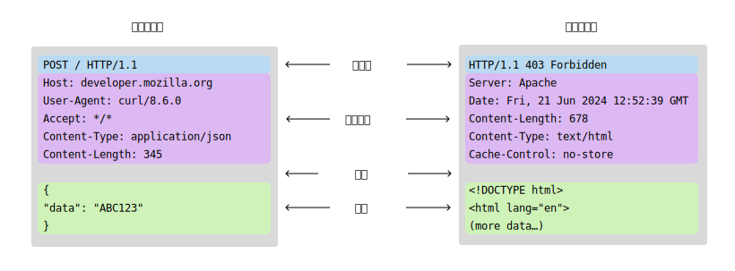
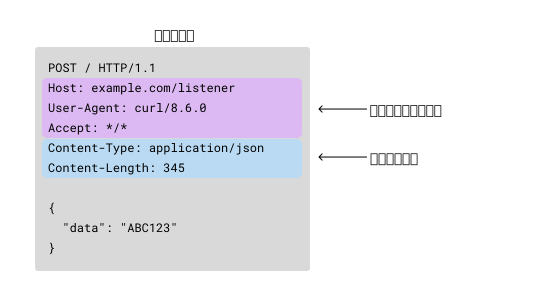
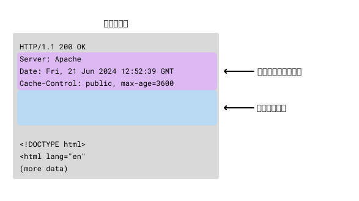
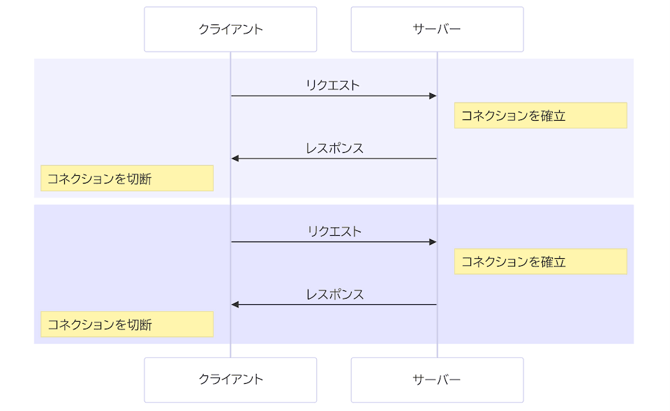
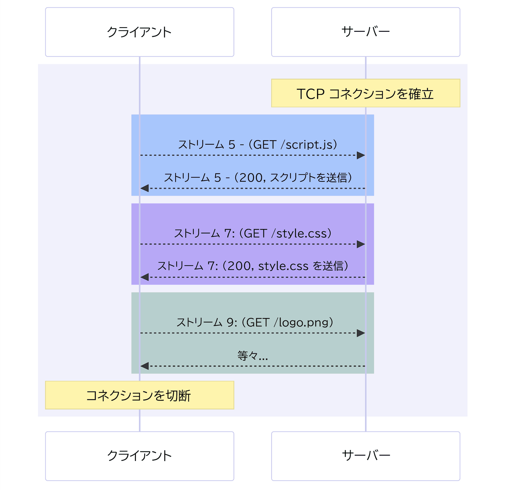

**HTTP メッセージ** は、HTTP プロトコルでサーバーとクライアント間でデータを交換するために使用されるメカニズムです。
メッセージには 2 種類あります。サーバーで措置を開始するためにクライアントから送信される**リクエスト**と、リクエストに対するレスポンスとしてサーバーから送信される**レスポンス**です。

開発者が HTTP メッセージをゼロから作成することはほとんどありません。
ブラウザー、プロキシー、ウェブサーバーなどのアプリケーションは、HTTP メッセージを信頼性高く効率的に作成するために設計されたソフトウェアを使用しています。
メッセージの作成や変換は、ブラウザーの API、プロキシーやサーバーの設定ファイル、その他のインターフェイスによって制御されます。

HTTP プロトコルの HTTP/2 以前のバージョンでは、メッセージはテキストベースであり、書式に慣れると比較的簡単に読み、理解することができます。
HTTP/2 では、メッセージはバイナリーフレームでラップされているため、特定のツールがないと読むのが少し難しくなります。
しかし、プロトコルの基盤となる意味づけは同じであるため、 HTTP/1.x メッセージのテキストベースの書式に基づいて HTTP メッセージの構造と意味を学び、その理解を HTTP/2 以降にも応用することができます。

このガイドでは、読みやすさのために HTTP/1.1 メッセージを使用し、HTTP/1.1 書式を使用して HTTP メッセージの構造を説明しています。
最後の節では、HTTP/2 を記述する際に必要となる可能性のあるいくつかの相違点を強調しています。

> [!NOTE]
> HTTP メッセージは、ブラウザーの開発者ツールにある**ネットワーク**タブで確認できます。また、例えば [curl](https://curl.se/) などの CLI ツールを使用して HTTP メッセージをコンソールに出力することもできます。

## HTTP メッセージの構造

HTTP メッセージがどのように動作するのかを理解するために、HTTP/1.1 メッセージを見て、その構造を調べてみましょう。
次の図は、HTTP/1.1 のメッセージがどのように見えるかを示しています。



リクエストとレスポンスは、どちらも同様の構造になっています。

1. 先頭行は、HTTP バージョンとリクエストメソッドまたはリクエストの結果を記述する単一の行です。
2. オプションの HTTP ヘッダー一式で、メッセージを説明するメタデータを記述します。例えば、リソースのリクエストにはそのリソースの許可された書式を記述することができ、レスポンスには実際に返される書式を示すヘッダーを記述することができます。
3. メッセージのメタデータが終了したことを示す空行。
4. オプションの「本体」には、メッセージに関連付けられたデータを格納します。これは、リクエストでサーバーに送信する POST データ、またはレスポンスでクライアントに返すリソースなどです。
   メッセージに本体が含まれるかどうかは、先頭行と HTTP ヘッダーによって決定されます。

HTTP メッセージの先頭行とヘッダーは、リクエストの「ヘッド」として総称され、その後に続くコンテンツを含む部分は「本体」と呼ばれています。

## HTTP リクエスト

ユーザーがウェhブページでフォームを送信した後に送信される、次の HTTP の `POST` リクエストの例を見ていきましょう。

```http
POST /users HTTP/1.1
Host: example.com
Content-Type: application/x-www-form-urlencoded
Content-Length: 49

name=FirstName+LastName&email=bsmth%40example.com
```

HTTP/1.x リクエストの先頭行（上記の例では `POST /users HTTP/1.1`）は「リクエスト行」と呼ばれ、3 つの部分で構成されています。

```http
<method> <request-target> <protocol>
```

- `<method>`
  - : [HTTP メソッド](/ja/docs/Web/HTTP/Reference/Methods) （_HTTP 動詞_ とも呼ばれる）は、リクエストの意味と望ましい結果を記述する、定義済みの一連の単語の一つです。
    例えば、`GET` は、クライアントがリソースを返して受け取ることを希望していることを示し、`POST` は、クライアントがサーバーにデータを送信していることを意味しています。
- `<request-target>`
  - : リクエストのターゲットは通常、絶対または相対の {{glossary("URL")}} であり、リクエストのコンテキストによって特徴付けられます。
    リクエストのターゲットの書式は、使用する HTTP メソッドとリクエストのコンテキストによって異なります。
    詳細については、後述の[リクエストターゲット](#リクエストターゲット)の節で説明します。
- `<protocol>`
  - : HTTP バージョンは、残りのメッセージの構造を定義し、レスポンスに使用すると期待されるバージョンを示す指標として機能します。
    これはほとんど常に `HTTP/1.1` です。 `HTTP/0.9` および `HTTP/1.0` は廃止されているためです。
    HTTP/2 以降では、プロトコルバージョンは接続のセットアップから理解できるため、メッセージには記載されません。

### リクエストターゲット

リクエストの対象を記述する方法はいくつかありますが、最も一般的なのは「オリジン形式」です。
以下は、ターゲットの型と、それらが使用される場合の一覧です。

1. オリジン形式では、受信者は絶対パスを {{HTTPHeader("Host")}} ヘッダーの情報と結合します。
   クエリー文字列は、追加情報のためにパスに追加することができます（通常は `key=value` 書式化）。
   これは、`GET`、`POST`、`HEAD`、`OPTIONS` の各メソッドで使用されます。

   ```http
   GET /ja/docs/Web/HTTP/Guides/Messages HTTP/1.1
   ```

2. 絶対形式は、オーソリティを含む完全な URL であり、プロキシーに接続する際に `GET` とともに使用されます。

   ```http
   GET https://developer.mozilla.org/ja/docs/Web/HTTP/Guides/Messages HTTP/1.1
   ```

3. オーソリティ形式は、権限とポートをコロン (`:`) で区切ったものです。
   これは、 {{HTTPMethod("CONNECT")}} メソッドに用いて HTTP トンネルを設定する際にのみ使用されます。

   ```http
   CONNECT developer.mozilla.org:443 HTTP/1.1
   ```

4. アスタリスク形式は、 `OPTIONS` で、名前付きリソースではなくサーバー全体 (`*`) を表す場合にのみ使用されます。

   ```http
   OPTIONS * HTTP/1.1
   ```

### リクエストヘッダー

ヘッダーは、リクエストの先頭行の後に、本体の前に送信されるメタデータです。
上記の[フォーム送信の例](#http_リクエスト)では、メッセージの以下の行がヘッダーになります。

```http
Host: example.com
Content-Type: application/x-www-form-urlencoded
Content-Length: 49
```

HTTP/1.x では、それぞれのヘッダーは、**大文字と小文字を区別しない**文字列にコロン (`:`) と、そのヘッダーに応じた形式の値が続くものです。
値を含むヘッダー全体は、1 行で構成されます。
{{HTTPHeader("Cookie")}} ヘッダーなど、この行が非常に長くなる場合もあります。



一部のヘッダーはリクエストでのみ使用されますが、リクエストとレスポンスの両方で送信できるものや、より詳細な分類を持つものもあります。

- {{glossary("Request header", "リクエストヘッダー")}}は、リクエストに追加のコンテキストを提供したり、サーバーによるリクエストの処理方法に追加のロジック（[条件付きリクエスト](/ja/docs/Web/HTTP/Guides/Conditional_requests)など）を追加したりします。
- {{glossary("Representation header", "表現ヘッダー")}}は、メッセージに本体がある場合にリクエストで送信され、メッセージデータの元の形式と適用されているエンコード方式を記述します。
  これにより、受信者は、ネットワーク経由で送信される前のリソースを、そのままの状態で再構築する方法を理解することができます。

### リクエスト本体

リクエスト本体は、サーバーに情報を伝達するリクエストの一部です。
`PATCH`、`POST`、`PUT` リクエストのみに本体が存在します。
[フォーム送信の例](#http_リクエスト)では、この部分が本体です。

```http
name=FirstName+LastName&email=bsmth%40example.com
```

フォーム送信リクエストの本体には、 `key=value` のペアとして比較的少量の情報が含まれていますが、リクエスト本体には、サーバーが期待する他の型のデータが含まれている場合もあります。

```json
{
  "firstName": "Brian",
  "lastName": "Smith",
  "email": "bsmth@example.com",
  "more": "data"
}
```

複数のパートからなるデータもあります。

```http
--delimiter123
Content-Disposition: form-data; name="field1"

value1
--delimiter123
Content-Disposition: form-data; name="field2"; filename="example.txt"

Text file contents
--delimiter123--
```

## HTTP レスポンス

レスポンスは、リクエストに対してサーバーが返信として返す HTTP メッセージです。
レスポンスにより、クライアントはリクエストの結果を知ることができます。
次の例は、新しいユーザーを作成する `POST` リクエストに対する HTTP/1.1 レスポンスです。

```http
HTTP/1.1 201 Created
Content-Type: application/json
Location: http://example.com/users/123

{
  "message": "新しいユーザーが作成されました",
  "user": {
    "id": 123,
    "firstName": "例の",
    "lastName": "人物",
    "email": "bsmth@example.com"
  }
}
```

レスポンスの先頭行（上記の "HTTP/1.1 201 Created"）は「ステータス行」と呼ばれ、3 つの部分で構成されています。

```http
<protocol> <status-code> <status-text>
```

- `<protocol>`
  - : 以降のメッセージの HTTP バージョン。
- `<status-code>`
  - : 数値の[ステータスコード](/ja/docs/Web/HTTP/Reference/Status)で、リクエストが成功したか失敗したかを示します。
    よくあるステータスコードは {{HTTPStatus("200")}}、{{HTTPStatus("404")}}、{{HTTPStatus("302")}} などです。
- `<status-text>`
  - : ステータステキストは、人間が HTTP メッセージを理解するのに役立つ、ステータスコードの簡潔で純粋に情報的なテキストによる説明です。

### ヘッダー

レスポンスの [HTTP ヘッダー](/ja/docs/Web/HTTP/Reference/Headers)は、他のヘッダーと同様に一定の基本構造に従います。大文字・小文字を区別しない文字列の後にコロン (`':'`) と、ヘッダーの種類に応じた構造の値が続きます。値を含むヘッダー全体は 1 行で構成されます。

使用できるレスポンスヘッダーは多数あります。これらはいくつかのグループに分類されます。

- {{glossary("General header", "一般ヘッダー")}}は {{HTTPHeader("Via")}} など、メッセージ全体に適用されるものです。
- {{glossary("Response header", "レスポンスヘッダー")}}は {{HTTPHeader("Vary")}} や {{HTTPHeader("Accept-Ranges")}} など、ステータス行で伝えられないサーバーの追加情報を与えます。
- {{glossary("Representation header", "表現ヘッダー")}}は {{HTTPHeader("Content-Type")}} など、レスポンスの本体に適用されます。通常、レスポンス内に本体がない場合はこのようなヘッダーは送信されません。


### レスポンスヘッダー

レスポンスヘッダーは、レスポンスとともに送信されるメタデータです。
HTTP/1.x では、各ヘッダーは、**大文字と小文字を区別しない**文字列にコロン (`:`) と、使用するヘッダーに応じた形式の値が続くものです。



リクエストヘッダーと同様に、レスポンスにはさまざまなヘッダーが現れますが、それらは次のように分類されます。

- {{glossary("Response header", "レスポンスヘッダー")}}は、メッセージに関する追加のコンテキスト情報を提供したり、クライアントが後続のリクエストを行う方法に追加のロジックを追加したりします。
  例えば、 {{HTTPHeader("Server")}} のようなヘッダーにはサーバーソフトウェアに関する情報が含まれ、 {{HTTPHeader("Date")}} にはレスポンスが生成された日時が含まれます。
  また、返されるリソースに関する情報、たとえばそのコンテンツの型 ({{HTTPHeader("Content-Type")}}) や、キャッシュの方法 ({{HTTPHeader("Cache-Control")}}) なども含まれます。
- {{glossary("Representation header", "表現ヘッダー")}}はメッセージに本体がある場合、そのメッセージデータの形式および適用されるエンコード方式を記述します。
  例えば、同じリソースであっても、XML や JSON などの特定のメディアタイプで書式化されていたり、特定の言語や地域に合わせてローカライズされていたり、伝送のために圧縮またはその他の方法でエンコードされていたりする場合があります。
  これにより受信者は、ネットワークを介して伝送される前のリソースを、そのままの状態で再構築する方法を理解することができます。

### レスポンス本体

クライアントへのレスポンスには、ほとんどの場合、レスポンス本体が含まれます。
リクエストが成功した場合、レスポンス本体には、クライアントが `GET` リクエストで要求したデータが含まれます。
クライアントのリクエストに問題がある場合、レスポンス本体には、リクエストが失敗した理由と、それが永続的なものか一時的なものかを示唆する説明が記載されるのが一般的です。

レスポンス本体は次のようになる場合があります。

- 単一リソースの本体は、 {{HTTPHeader("Content-Type")}} と {{HTTPHeader("Content-Length")}} の 2 つのヘッダーで定義されます。長さが不明な場合や、 {{HTTPHeader("Transfer-Encoding")}} が `chunked` に設定され、複数の塊にエンコードされている場合もあります。
- [複数リソースの本体](/ja/docs/Web/HTTP/Guides/MIME_types#multipartform-data)の場合、本体は複数の部分から構成され、それぞれには異なる情報の断片が含まれます。
  マルチパート本体は通常、[HTML フォーム](/ja/docs/Learn_web_development/Extensions/Forms)で使われますが、[範囲リクエスト](/ja/docs/Web/HTTP/Guides/Range_requests)へのレスポンスとして送信される場合もあります。

{{HTTPStatus("201", "201 Created")}} や {{HTTPStatus("204", "204 No Content")}} のように、メッセージコンテンツを含める必要なくリクエストに応答するステータスコードのレスポンスには、本体は存在しません。

## HTTP/2 メッセージ

HTTP/1.x は、読みやすく、構築も簡単なテキストベースのメッセージを使用していますが、その結果、いくつかの欠点があります。
`gzip` やその他の圧縮アルゴリズムを使用してメッセージ本体を圧縮することはできますが、ヘッダーは圧縮できません。
クライアントとサーバーの間の対話におけるヘッダーは、多くの場合、似ていたりまったく同じであったりしますが、同じ接続で連続するメッセージの中で重複します。
重複するテキストを圧縮する、非常に効率的なメソッドは数多く知られており、その多くは利用されていないため、大量の帯域幅を節約できる可能性があります。

HTTP/1.x には、ヘッドオブライン (HOL) ブロッキングと呼ばれる問題も存在します。これは、クライアントがサーバーからのレスポンスを待ってから次のリクエストを送信しなければならないというものです。
HTTP [パイプライン](/ja/docs/Web/HTTP/Guides/Connection_management_in_HTTP_1.x#http_pipelining) はこの問題を回避しようとしましたが、対応が不十分で複雑であるため、ほとんど使用されておらず、正しく動作させることも困難です。
リクエストを同時に送信するには、複数の接続を開く必要があります。また、TCP のスロースタートにより、ウォーム（確立済みでビジーな）接続はコールド接続よりも効率的です。

HTTP/1.1 で 2 つのリクエストを並列に行うには、2 つの接続を開く必要があります。



これは、ブラウザーが同時にダウンロードしてレンダリングできるリソースの数に制限があることを意味しており、通常、6 つの並列接続に制限されています。

HTTP/2 では、単一の TCP 接続で複数のリクエストとレスポンスを同時に処理することができます。
これは、メッセージをバイナリーフレームでラップし、リクエストとレスポンスを番号付きの**ストリーム**で接続に送信することで実現されています。
データフレームとヘッダーフレームは別個に処理されるため、ヘッダーは HPACK というアルゴリズムによって圧縮することができます。
同じ TCP 接続を使用して複数のリクエストを同時に処理することを「多重化」と呼びます。



リクエストは必ずしも順番に実行されるとは限りません。たとえば、ストリーム 9 はストリーム 7 が完了するのを待つ必要はありません。
通常、複数のストリームからのデータは接続上でインターリーブされるため、ストリーム 9 と 7 はクライアントで同時に受信することができます。
プロトコルには、それぞれのストリームまたはリソースの優先度を設定するメカニズムがあります。
優先度の低いリソースは、異なるストリームで送信される場合、優先度の高いリソースよりも帯域幅を少なく使用します。また、最初に処理すべき重要なリソースがある場合、同じ接続上で効果的に順番に送信することができます。

一般的に、HTTP/1.x に追加されたすべての改善点や抽象化にもかかわらず、開発者が HTTP/1.x 上で HTTP/2 を使用するために使用する API には、ほとんど変更は必要ありません。
HTTP/2 がブラウザーとサーバーの両方で利用可能になると、自動的にオンになり、使用されます。

### 擬似ヘッダー

HTTP/2 のメッセージにおける顕著な変更点の 1 つは、擬似ヘッダーの採用です。
HTTP/1.x ではメッセージの開始行が使用されていましたが、HTTP/2 では `:` で始まる特別な擬似ヘッダーフィールドが使用されます。
リクエストには、以下の擬似ヘッダーがあります。

- `:method` - HTTP メソッド。
- `:scheme` - 対象 URI のスキーム部分で、多くの場合は HTTP(S)。
- `:authority` - 対象 URI のオーソリティ部分。
- `:path` - 対象 URI のパス部分とクエリー部分。

レスポンスには、1 つの擬似ヘッダーしかなく、それはレスポンスのコードを提供する `:status` です。

HTTP/2 リクエストを [nghttp](https://github.com/nghttp2/nghttp2) を使用して作成し、`example.com` を取得すると、リクエストが読み取りやすい形で出力されます。
このコマンドを使用してリクエストを作成することができます。ここで、`-n` オプションはダウンロードしたデータを破棄し、 `-v` は 'verbose' （詳細）出力用で、フレームの受信と送信を表示します。

```bash
nghttp -nv https://www.example.com
```

出力を下に向かって見ていくと、送信および受信されたそれぞれのフレームのタイミングを確認できます。

```plain
[  0.123] <send|recv> <frame-type> <frame-details>
```

この出力についてあまり詳しく説明する必要はありませんが、この `HEADERS` フレームの `[  0.123] send HEADERS frame ...` という形の部分に注目してください。
ヘッダーの送信後の行には、次の行が表示されます。

```http
[  0.447] send HEADERS frame ...
          ...
          :method: GET
          :path: /
          :scheme: https
          :authority: www.example.com
          accept: */*
          accept-encoding: gzip, deflate
          user-agent: nghttp2/1.61.0
```

HTTP/1.x の使用に慣れている方であれば、この表示はなじみのあるものだと思います。このガイドの前の章で説明した概念は、ここでも適用されます。
これは、`example.com` に対する `GET` リクエストを含むバイナリーフレームを、`nghttp` によって読み取り可能な形に変換したものです。
コマンドの出力の下の方を見ると、サーバーから受信したストリームの 1 つに、`:status` という擬似ヘッダーが記載されています。

```http
[  0.433] recv (stream_id=13) :status: 200
[  0.433] recv (stream_id=13) content-encoding: gzip
[  0.433] recv (stream_id=13) age: 112721
[  0.433] recv (stream_id=13) cache-control: max-age=604800
[  0.433] recv (stream_id=13) content-type: text/html; charset=UTF-8
[  0.433] recv (stream_id=13) date: Fri, 13 Sep 2024 12:56:07 GMT
[  0.433] recv (stream_id=13) etag: "3147526947+gzip"
...
```

このメッセージからタイミングとストリーム ID を除去すると、さらに見慣れたものになるはずです。

```http
:status: 200
content-encoding: gzip
age: 112721
```

メッセージフレーム、ストリーム ID、および接続の管理方法についてさらに詳しく説明することは、このガイドの範囲を超えますが、HTTP/2 メッセージを理解し、デバッグするためには、この記事で紹介した知識とツールを使用すれば十分です。

## まとめ

このガイドでは、HTTP/1.1 形式を使用して、HTTP メッセージの構造の概要を説明しました。
また、HTTP の意味づけを根本的に変更することなく、HTTP/1.x 構文と基盤となるトランスポートプロトコルの間にレイヤーを導入する HTTP/2 メッセージのフレームについても説明しました。
HTTP/2 は、リクエストの多重化を可能にすることで、HTTP/1.x に存在する{{glossary("head of line blocking", "head-of-line blocking")}}の問題を解決するために導入されました。

HTTP/2 で残っていた課題の 1 つは、プロトコルレベルでヘッドオブラインブロッキングが修正されたにもかかわらず、TCP（トランスポートレベル）内のヘッドオブラインブロッキングによるパフォーマンスのボトルネックが依然として存在していたことです。
HTTP/3 では、TCP の代わりに UDP 上に構築されたプロトコルである QUIC を使用することで、この制限に対処しています。
この変更により、パフォーマンスが改善され、接続のセットアップ時間が短縮され、劣化または信頼性の低いネットワークでの安定性が向上します。
HTTP/3 は、HTTP のコアとなる意味づけをそのまま維持しているため、リクエストメソッド、ステータスコード、ヘッダーなどの機能は、3 つの主要な HTTP バージョンすべてで一貫しています。

HTTP/1.1 の意味論をすでに理解している方は、HTTP/2 および HTTP/3 を理解するための強固な基礎をすでに持っています。
主な違いは、これらの意味論がトランスポートレベルで**どのように**実装されているかという点にあります。
このガイドの例と概念に従うことで、HTTP を使用して作業し、メッセージの意味、およびアプリケーションが HTTP を使用してデータを送信および受信する方法を理解できるようになったはずです。

## 関連情報

- [HTTP の進化](/ja/docs/Web/HTTP/Guides/Evolution_of_HTTP)
- [プロトコルのアップグレードの仕組み](/ja/docs/Web/HTTP/Guides/Protocol_upgrade_mechanism)
- 用語集:
  - {{glossary('HTTP')}}
  - {{glossary('HTTP_2', 'HTTP/2')}}
  - {{glossary('QUIC')}}
