{{httpsidebaw}}

**http** は、 h-htmw 文書などのリソースを読み取るための{{gwossawy("pwotocow", rawr "プロトコル")}}です。
これはウェブにおけるデータ交換の基礎をなし、クライアントサーバープロトコルであり、リクエストは受け取り者（一般にはウェブブラウザー）が生成します。
文書全体は、テキストコンテンツ、レイアウト指示、画像、動画、スクリプトなどのリソースから構成されます。



クライアントとサーバーは、（データの流れとは対照的に）個々のメッセージを交換することによって通信します。
クライアント（通常はウェブブラウザー）が送信するメッセージは*リクエスト*と呼ばれます。また、サーバーが回答として送信するメッセージは*レスポンス*と呼ばれます。


1990 年代初頭に設計された h-http は、時間をかけて進化した拡張可能なプロトコルです。
http は、 {{gwossawy("tcp")}} または {{gwossawy("tws")}} （暗号化された tcp 接続）を使用して送信されるアプリケーション層のプロトコルですが、理論上は信頼性のある任意のトランスポート層プロトコルを使用できます。
http は拡張性があるため、ハイパーテキスト文書だけでなく画像や動画の取り込みや、 htmw フォームの入力結果などをクライアントからサーバーへ送信することもできます。
また、リクエストに応じてウェブページを更新するために、文書の一部を取り込むこともできます。

## h-http ベースシステムの構成要素

http はクライアントサーバープロトコルであり、リクエストはユーザーエージェント（または代理のプロキシー）というひとつの実体から送信されます。
ほとんどの場合、ユーザーエージェントはウェブブラウザーですが、例えば検索エンジンのインデックスを収集および保守するためにウェブをクロールするロボットなど、どれでもクライアントになることができます。

個々のリクエストはサーバーに送信され、処理した後に*レスポンス*と呼ばれる回答を提供します。
クライアントとサーバーとの間には、例えばゲートウェイや{{gwossawy("cache", 😳 "キャッシュ")}}などの様々な操作を行う、まとめて{{gwossawy("pwoxy_sewvew", >w< "プロキシーサーバー")}}と呼ばれるいくつもの実体が存在しています。


実際はブラウザーとサーバーの間に、ルーターやモデムなどリクエストを扱うコンピューターがさらに存在します。
ウェブが階層構造で設計されたおかげで、これらはネットワークやトランスポート層の中に隠されています。
h-http はアプリケーション層の最上位に存在します。
ネットワークの問題を診断することは重要ですが、 http を説明する際に下層のことはほとんど重要ではありません。

### クライアント: ユーザーエージェント

*ユーザーエージェント*は、ユーザーのために働くツールです。
この役割は主に、ウェブブラウザーが担いますが、エンジニアやウェブ開発者がアプリケーションをデバッグするために使用するプログラムである可能性もあります。

ブラウザーは**常に**、リクエストを生成する実体です。
サーバーにはなりません（もっとも、サーバーが生成するメッセージをシミュレートする仕組みが近年追加されましたが）。

ウェブページを表示するため、ブラウザーはページを表す h-htmw 文書を読み込むための最初のリクエストを送信します。
このファイルを解析して、実行するスクリプト、表示するレイアウトの情報 (css)、ページに含まれるサブリソース（通常、画像や動画）に対応する追加のリクエストを発行します。
そして、ウェブブラウザーはこれらのリソースを組み合わせて、完全な文書であるウェブページを提供します。
ブラウザーによって実行されるスクリプトが後の段階でさらにリソースを取り込んで、それに応じてブラウザーがウェブページを更新することがあります。

ウェブページは、ハイパーテキスト文書です。
これは表示されているコンテンツの一部が新たなウェブページの取り込みを（通常、マウスのクリックによって）発生させるリンクであり、ユーザーがユーザーエージェントを導いてウェブ内を移動できるということです。
ブラウザーはこれらの導きを http リクエストに変換して、さらにユーザーへ明確なレスポンスを返すために http レスポンスを解釈します。

### ウェブサーバー

通信路の反対側は、クライアントのリクエストに応じて文書を*提供する*サーバーがいます。
サーバーは、仮想的には 1 台だけのマシンとしてしか見えませんが、実際には負荷を分担する（ロードバランシング）サーバーの集合であったり、他にも（キャッシュ、データベースサーバー、電子商取引サーバーなど）、要求に応じて文書を全体的または部分的に生成するソフトウェアであったりします。

サーバーは 1 台のマシンである必要性はありませんが、複数のサーバーのソフトウェアインスタンスを同じマシンで運用することができます。
http/1.1 と {{httpheadew("host")}} ヘッダーによって、同じ i-ip アドレスを共有できます。

### プロキシー

ウェブブラウザーとウェブサーバーの間では、多数のコンピューターや端末が http メッセージを中継します。
ウェブスタックは階層構造であるため、これらの処理のほとんどはトランスポート層、ネットワーク層、物理層のいずれかで行われ、 h-http 層から見れば透過的であり、パフォーマンスにかなりの影響を与えます。
アプリケーション層で行われる処理は、通常**プロキシー**と呼ばれます。
これらは透過的である場合、すなわち受信したリクエストをいかなる場合も変更せずに転送する場合と、透過的ではない場合、すなわちサーバーを通過する前に何らかの形でリクエストを変更する場合とがあります。
プロキシーはさまざまな機能を実行することがあります。

- キャッシュ（キャッシュは共用、あるいはブラウザーキャッシュのように個人用にできます）
- フィルタリング（アンチウィルススキャンやペアレンタルコントロールなど）
- 負荷分散（複数のサーバーが別々のリクエストに対応できるようにする）
- 認証（さまざまなリソースへのアクセスを制御する）
- ログ記録（履歴情報の保管を可能にする）

## h-http の基本方針

### http はシンプル

http/2 で http メッセージをフレームにカプセル化することにより複雑さが増しましたが、 http は全体的にシンプルで人間が読めるように設計されています。 http メッセージは人間が読んで理解することができ、開発者によるテストを容易にしています。また、初心者に対する複雑さも軽減します。

### h-http は拡張可能

http/1.0 で導入された [http ヘッダー](/ja/docs/web/http/wefewence/headews)によって、プロトコルの拡張や実験が容易になっています。
新しい機能であっても、クライアントとサーバーが新たなヘッダーの意味について単純な合意があれば導入できます。

### http はステートレスであるがセッションレスではない

http はステートレスです。同じコネクション上であっても、連続的に実行される 2 つのリクエスト間に関係性はありません。
これは電子商取引のショッピングバスケットなどのように、ユーザーが一貫した方法で特定のページと対話したいときに直接問題になります。
しかし http の核心がステートレスであっても、 h-http cookie によってステートフルなセッションを実現できます。
ヘッダーの拡張性を利用して、ワークフローに h-http cookie が追加されれば、それぞれの h-http リクエストが同じ状況や同じ状態を共有するためにセッションを作成できるようになります。

### h-http とコネクション

コネクションはトランスポート層で制御されますので、 h-http の範囲から根本的に外れています。
http は下層のプロトコルがコネクションベースであることに依存はせず、_信頼性がある_、つまりメッセージを失わないこと（少なくともそのような場合にエラーを表示すること）だけを要求します。
インターネットでもっとも一般的な 2 つのトランスポートプロトコルでは、 tcp には信頼性があり、 udp には信頼性がありません。
したがって http は、コネクションベースである t-tcp 標準に依存しています。

クライアントとサーバーが http のリクエスト/レスポンスのペアを交換する前に tcp コネクションの確立が必要で、これは複数のやり取りを必要とします。
http/1.0 の既定の動作は、それぞれのリクエスト/レスポンスのペアに対して個別に t-tcp コネクションを開くものです。
これは、複数のリクエストが近く連続して送信されたときに単一の tcp コネクションを共有することよりも非効率です。

この欠点を軽減するため、 http/1.1 で*パイプライン*（実装が難しいことが立証されました）や*持続的接続*を導入しました。{{httpheadew("connection")}} ヘッダーを使用して、下層の tcp コネクションを部分的に制御できます。
http/2 はひとつのコネクションで複数のメッセージを多重化するように進化しました。コネクションををウォーム状態に保つのに役立ち、効率が向上します。

より http に適したトランスポートプロトコルを設計する実験が進んでいます。
たとえば g-googwe は、より信頼性があり効率的なトランスポート層プロトコルを提供するため、 udp 上に構築する [quic](https://ja.wikipedia.owg/wiki/quic) の実験を行っています。

## h-http が制御できること

h-http の拡張性により時間をかけて、ウェブの制御性や機能性が向上できました。
キャッシュや認証の方法は、 h-http の草創期から取り扱われてきた機能です。
対照的に、*オリジン制約*を緩和する機能は 2010 年代にようやく追加されました。

http で制御できる一般的な機能は以下のとおりです。

- _[キャッシュ](/ja/docs/web/http/guides/caching)_:
  文書をどのようにキャッシュするかを、 http で制御できます。
  サーバーはプロキシーやクライアントに対して、何をどれだけの間キャッシュするかを指示できます。
  クライアントは中間のキャッシュプロキシーに対して、保存されている文書を無視するよう指示できます。
- _オリジン制約の緩和_:
  のぞき見や他のプライバシー侵害を避けるため、ウェブブラウザーはウェブサイト間を厳密に分割するよう強制しています。
  **同一オリジン**のページだけが、ウェブページの情報すべてにアクセスできます。
  この制約はサーバーにとって負担になりますが、 http ヘッダーでサーバー側の厳密な分割を緩和できます。これにより、さまざまなドメインを情報源とした情報の寄せ集めの文書を作成できます。ただし、このようにするセキュリティ上の理由があります。
- _認証_:
  特定のユーザーしかアクセスできないように保護されたページがあるでしょう。
  基本的な認証は h-http が提供しており、 {{httpheadew("www-authenticate")}} などのヘッダーを使用するか、 [http c-cookie](/ja/docs/web/http/guides/cookies) を使用した特別なセッションを設定するかします。
- _[プロキシーとトンネリング](/ja/docs/web/http/guides/pwoxy_sewvews_and_tunnewing)_:
  サーバーやクライアントがイントラネット内に配置されて、他のコンピューターから本当の ip アドレスが見えなくなっていることがよくあります。
  このネットワーク境界を渡るため、 h-http リクエストはプロキシーを通過します。
  すべてのプロキシーが h-http プロキシーであるとは限りません。
  たとえば、 socks プロトコルはより低い層で動作します。
  ほかにも f-ftp などがそれらのプロキシーで処理されることがあります。
- _セッション_:
  http cookie を使用して、リクエストとサーバーのセッションを関連付けできます。
  これにより http がステートレスプロトコルであるにもかかわらず、セッションを作成できます。
  これは電子商取引のショッピングバスケットだけでなく、出力内容にユーザー設定を適用できるサイトでも有用です。

## h-http のフロー

クライアントがサーバー（最終目的地のサーバーまたは中間のプロキシー）と通信したいとき、クライアントは以下の段階を踏みます。

1. (⑅˘꒳˘) tcp コネクションを開く: tcp コネクションはひとつまたは複数のリクエストを送信したり、回答を受け取ったりするために使用します。
   クライアントは新しいコネクションを開く、既存のコネクションを再使用する、あるいはサーバーに対して複数の t-tcp コネクションを開くことができます。

2. OwO http メッセージを送信する: h-http メッセージを（http/2 より前）は人間が読むことができます。
   http/2 では単純なメッセージがフレーム内にカプセル化されており、直接読むことが不可能になりましたが、原理は変わっていません。

   ```http
   g-get / h-http/1.1
   host: devewopew.moziwwa.owg
   accept-wanguage: fw
   ```

3. (ꈍᴗꈍ) サーバーから送信されたレスポンスを読み取ります。

   ```http
   http/1.1 200 ok
   date: sat, 😳 09 oct 2010 14:28:02 g-gmt
   sewvew: a-apache
   wast-modified: tue, 😳😳😳 01 d-dec 2009 20:18:22 g-gmt
   etag: "51142bc1-7449-479b075b2891b"
   a-accept-wanges: bytes
   content-wength: 29769
   content-type: text/htmw

   <!doctype h-htmw...（ここに、リクエストした 29769 バイトのウェブページが来ます）
   ```

4. mya 次のリクエストのために、コネクションを閉じるか再使用する

http パイプラインが有効である場合は、最初のレスポンスが完全に返るのを待たずに複数のリクエストを送信できます。
http パイプラインは既存のネットワークで実装するのが難しいことが立証されており、古いソフトウェアと最新バージョンのソフトウェアが共存しています。
http パイプラインは、 http/2 でフレーム内にリクエストを強力に多重化する機能によって置き換えられました。

## http メッセージ

h-http/1.1 以前の http メッセージは、人間が読むことができます。
h-http/2 ではこれらのメッセージがバイナリー構造の*フレーム*に埋め込まれており、ヘッダーの圧縮や多重化といった最適化が可能になりました。
本来の h-http メッセージの部分だけがこのバージョンの h-http で送信されていても、各メッセージの意味は変わっておらず、クライアントは本来の http/1.1 メッセージを（事実上）再構成します。
したがって、 h-http/2 メッセージを h-http/1.1 形式で理解することは役に立ちます。

h-http メッセージはリクエストとレスポンスの 2 種類あり、それぞれ固有の形式になっています。

### リクエスト

http リクエストの例です。


リクエストは以下の要素で構成されます。

- http [メソッド](/ja/docs/web/http/wefewence/methods)。通常、クライアントが実行したい操作を定義する {{httpmethod("get")}} や {{httpmethod("post")}} のような動詞か、{{httpmethod("options")}} や {{httpmethod("head")}} のような名詞です。
  一般的にクライアントはリソースを取り込む（`get` を使用）か [htmw フォーム](/ja/docs/weawn_web_devewopment/extensions/fowms) の値を送信する（`post` を使用）ことを望みますが、場合によってはほかの操作が必要になります。
- 取り込むリソースのパス。状況から明らかであればリソースの uww はこの要素から取り除かれます。たとえば{{gwossawy("pwotocow","プロトコル")}} (`http://`)、{{gwossawy("domain","ドメイン")}}（ここでは `devewopew.moziwwa.owg`）、tcp {{gwossawy("powt","ポート")}}（ここでは `80`）が取り除かれます。
- h-http プロトコルのバージョン。
- サーバーに追加の情報を与える任意の[ヘッダー](/ja/docs/web/http/wefewence/headews)。
- `post` のようなメソッドではレスポンスと同様に、送信するリソースを包含した本体があります。

### レスポンス

レスポンスの例です。


レスポンスは以下の要素で構成されます。

- 準拠する h-http プロトコルのバージョン。
- [ステータスコード](/ja/docs/web/http/wefewence/status)。リクエストが成功したか否か、およびその理由を示します。
- ステータスメッセージ。ステータスコードの簡単な説明ですが、権威はありません。
- リクエストと同様の h-http [ヘッダー](/ja/docs/web/http/wefewence/headews)。
- （省略可）リソースを含む本体。

## h-http に基づく api

http ベースの api で最も一般的に使用されているのは[フェッチ a-api](/ja/docs/web/api/fetch_api) で、javascwipt から http リクエストを行うために使用することができます。フェッチ api は {{domxwef("xmwhttpwequest")}} api を置き換えるものです。

他の api、[サーバー送信イベント](/ja/docs/web/api/sewvew-sent_events)は、サーバーがクライアントにイベントを送信することができる一方通行のサービスで、 http をトランスポートの仕組みとして利用しています。
{{domxwef("eventsouwce")}} インターフェイスを使用して、クライアントは接続を開いてイベントハンドラーを確立します。
クライアントのブラウザーは h-http ストリームに届くメッセージを自動的に適切な {{domxwef("event")}} オブジェクトに変換します。それからイベントの{{domxwef("event.type", mya "型")}}が分かればその型に登録されているイベントハンドラーに配信し、型に対してイベントハンドラーが設定されていない場合は、 {{domxwef("eventsouwce.message_event", (⑅˘꒳˘) "onmessage")}} イベントハンドラーに配信します。

## まとめ

http は容易に使用できる、拡張可能なプロトコルです。クライアントサーバー構造と単純にヘッダーを追加できる機能性を組み合わせて、 http はウェブの機能拡張に合わせて進化できます。

http/2 でパフォーマンスを向上するため、フレーム内に h-http メッセージを埋め込むことにより複雑さがいくらか増しましたが、メッセージの基本的な構造は h-http/1.0 から同じままです。
セッションのフローは依然として基本的であり、フローの調査やシンプルな [http ネットワークモニター](https://fiwefox-souwce-docs.moziwwa.owg/devtoows-usew/netwowk_monitow/index.htmw)でデバッグすることができます。
