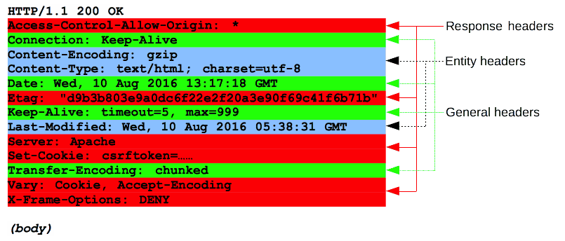

{{HTTPSidebar}}

HTTP メッセージは、サーバーとクライアントがデータを交換する手段です。クライアントが送信してサーバーにアクションを起こさせる*リクエスト*と、サーバーの回答である*レスポンス*の、2 種類のメッセージがあります。

HTTP メッセージは ASCII でエンコードされたテキスト情報で構成されており、複数の行にまたがります。HTTP/1.1 およびそれより前のバージョンのプロトコルでは、メッセージがコネクション内でそのまま送信されます。HTTP/2 では、人間が読める形式のメッセージを HTTP フレームに分割して、最適化やパフォーマンスの向上を実現します。

ウェブ開発者やウェブ管理者がこれらテキスト形式の HTTP メッセージを作成することはめったにありません。ウェブブラウザー、プロキシ、ウェブサーバーといったソフトウェアが行います。それらは HTTP メッセージを設定ファイル (プロキシやサーバー)、API (ブラウザー)、あるいは他のインターフェイスによって提供します。

HTTP/2 のバイナリフレーム化方式は、適用される API や設定ファイルの変更を必要としないように設計されています。これはユーザーに対して透過的です。

HTTP のリクエストやレスポンスは似た構造を共用しており、以下の要素で構成されます。

1. 実行するリクエスト、または成功か失敗かの状態を表す*開始行*。開始行は常に 1 行です。
2. リクエストの詳細を示す、またはメッセージに含まれる本文を説明する、省略可能な *HTTP ヘッダー*一式。
3. リクエストのメタ情報がすべて送信されたことを示す空行。
4. リクエストに関連付けられたデータ (HTML フォームの内容など)、あるいはレスポンスに関連付けられたドキュメントを含む、省略可能な*本文*。本文が存在することやそのサイズは、開始行や HTTP ヘッダーで指定します。

HTTP メッセージの開始行と HTTP ヘッダーは、まとめてリクエストの*ヘッド*として知られています。一方、ペイロードは*本文*として知られています。

## HTTP リクエスト

### 開始行

HTTP リクエストは、アクションを始めるためにクラアントからサーバーへ送られます。その*開始行*には、3 つの要素が含まれています。

1. _[HTTP メソッド](/ja/docs/Web/HTTP/Methods)_。実行するアクションを表わす動詞 ({{HTTPMethod("GET")}}、{{HTTPMethod("PUT")}}、{{HTTPMethod("POST")}} など) または名詞 ({{HTTPMethod("HEAD")}}、{{HTTPMethod("OPTIONS")}})。例えば `GET` はリソースを取り込むこと、`POST` はデータをサーバーへ送信すること (リソースを作成または変更する、あるいは返送する一時的なドキュメントを生成する) ことを示します。
2. _リクエスト対象_。通常は {{glossary("URL")}} ですが、プロトコル、ポート、ドメインの絶対パスは通常、リクエストの状況から明らかにされます。リクエスト対象の形式は、HTTP メソッドにより異なります。以下のような形式があります。

   - 最後に `'?'` とクエリー文字列がある絶対パス。これは _origin form_ として知られているもっとも一般的な形式であり、`GET`、`POST`、`HEAD`、`OPTIONS` メソッドで使用します。
     `POST / HTTP/1.1 GET /background.png HTTP/1.0 HEAD /test.html?query=alibaba HTTP/1.1 OPTIONS /anypage.html HTTP/1.0`
   - _absolute form_ として知られている完全な URL は、主にプロキシへ接続する際に `GET` で使用します。
     `GET http://developer.mozilla.org/en-US/docs/Web/HTTP/Messages HTTP/1.1`
   - ドメイン名とポート (省略可能。`':'` を前につける) で構成される、URL の authority の部分は _authority form_ と呼ばれます。これは `CONNECT` で HTTP トンネルを設定するときに限り使用されます。
     `CONNECT developer.mozilla.org:80 HTTP/1.1`
   - 単なるアスタリスク (`'*'`) である _asterisk form_ は `OPTIONS` で使用されており、サーバー全体を表します。
     `OPTIONS * HTTP/1.1`

3. _HTTP バージョン_。これはメッセージの残りの部分の構造を定義しており、レスポンスで使用することを想定しているバージョンを示す役割もあります。

### ヘッダー

リクエストの [HTTP ヘッダー](/ja/docs/Web/HTTP/Headers) は、HTTP ヘッダーの一定の基本構造に従います。大文字・小文字を区別しない文字列の後にコロン (`':'`) と、ヘッダーに応じた構造の値が続きます。値を含むヘッダー全体は 1 行で構成されており、とても長くなる場合もあります。

使用できるリクエストヘッダーは多数あります。これらはいくつかのグループに分類されます。

- *一般ヘッダー*は、 {{HTTPHeader("Via")}} など、メッセージ全体に適用されるものです。
- *リクエストヘッダー*は、 {{HTTPHeader("User-Agent")}}, {{HTTPHeader("Accept-Type")}}, 指定するとリクエストを変更するもの ({{HTTPHeader("Accept-Language")}} など)、状況を示すもの ({{HTTPHeader("Referer")}} など)、条件を与えるもの ({{HTTPHeader("If-None")}} など) があります。
- *エンティティヘッダー*は {{HTTPHeader("Content-Length")}} など、リクエストの本文に適用されます。当然ながら、リクエスト内に本文がない場合はこれらのヘッダーが送信されません。

### 本文

リクエストの最後の部分が本文です。本文が存在しないリクエストもあります。リソースを取り込むリクエストである `GET`, `HEAD`, `DELETE`, `OPTIONS` は通常、本文は不要です。サーバー内のデータを更新するためにデータを送信するリクエストもあり、 `POST` リクエストでよくあります (HTML フォームのデータを持つ)。

本文は、大きく 2 種類に分類されます。

- 単一リソースの本文。1 個のファイルで構成され、{{HTTPHeader("Content-Type")}} と {{HTTPHeader("Content-Length")}} の 2 つのヘッダーで定義されます。
- [複数リソースの本文](/ja/docs/Web/HTTP/Basics_of_HTTP/MIME_types#multipartform-data)。マルチパートの本文で構成され、それぞれが異なる情報を持ちます。これは主に、 [HTML フォーム](/ja/docs/Web/Guide/HTML/Forms)と関連付けられます。

## HTTP レスポンス

### ステータス行

HTTP レスポンスの開始行は*ステータス行*と呼ばれ、以下の情報を持ちます。

1. _プロトコルバージョン_。通常 `HTTP/1.1` です。
2. _ステータスコード_。リクエストが成功したか失敗したかを示します。一般的なステータスコードは {{HTTPStatus("200")}}, {{HTTPStatus("404")}}, {{HTTPStatus("302")}} です。
3. _ステータス文字列_。手短な単なる情報ですが、人間が HTTP メッセージを理解するのを助けるために、ステータスコードをテキストで説明します。

一般的に、ステータス行は `HTTP/1.1 404 Not Found.` のようになります。

### ヘッダー

レスポンスの [HTTP ヘッダー](/ja/docs/Web/HTTP/Headers)は、他のヘッダーと同様に一定の基本構造に従います。大文字・小文字を区別しない文字列の後にコロン (`':'`) と、ヘッダーの種類に応じた構造の値が続きます。値を含むヘッダー全体は 1 行で構成されます。

使用できるレスポンスヘッダーは多数あります。これらはいくつかのグループに分類されます。

- *一般ヘッダー*は {{HTTPHeader("Via")}} など、メッセージ全体に適用されるものです。
- *レスポンスヘッダー*は {{HTTPHeader("Vary")}} や {{HTTPHeader("Accept-Ranges")}} など、ステータス行で伝えられないサーバーの追加情報を与えます。
- *エンティティヘッダー*は {{HTTPHeader("Content-Length")}} など、レスポンスの本文に適用されます。通常、レスポンス内に本文がない場合はこのようなヘッダーは送信されません。

### 本文

レスポンスの最後の部分が本文です。本文を持たないレスポンスもあります。 {{HTTPStatus("201")}} **`Created`** や {{HTTPStatus("204")}} **`No Content`** といったステータスコードのレスポンスは通常、本文がありません。

本文は、大きく 3 種類に分類されます。

- 大きさが判明している 1 個のファイルで構成される、単一リソースの本文。 {{HTTPHeader("Content-Type")}} と {{HTTPHeader("Content-Length")}} の 2 つのヘッダーで定義されます。
- 大きさが不明な 1 個のファイルで構成される、単一リソースの本文。 {{HTTPHeader("Transfer-Encoding")}} を `chunked` に設定して、 chunked 形式でエンコードされます。
- [複数リソースの本文](/ja/docs/Web/HTTP/Basics_of_HTTP/MIME_types#multipartform-data)。マルチパートの本文で構成され、それぞれが異なる情報のセクションを持ちます。これは比較的まれです。

## HTTP/2 フレーム

HTTP/1.x のメッセージには、パフォーマンスの欠点があります。

- ヘッダーは本文と異なり、圧縮されません。
- あるメッセージと次のメッセージでヘッダーが酷似していることがよくありますが、それでも複数のコネクションにわたって繰り返されます。
- 多重化することができません。同じサーバーに対して複数のコネクションを開かなければなりません。また、ウォーム状態の TCP コネクションはコールド状態のコネクションより効率的です。

HTTP/2 は次の段階に進みました。 HTTP/1.x のメッセージを、ストリーム内に埋め込まれるフレームに分割します。データのフレームとヘッダーのフレームは区別され、ヘッダーの圧縮が可能になります。*多重化*と呼ばれる処理によって複数のストリームがまとめられ、下層の TCP コネクションの効率を向上させることができます。

HTTP フレームは、ウェブ開発者によって透過的になります。これは HTTP/2 において、 HTTP/1.1 メッセージと基盤となるトランスポート層との間のさらなるステップです。 HTTP フレームを利用するためにウェブ開発者が使用する API を変更する必要はありません。ブラウザーとサーバーの両方で利用可能になれば、 HTTP/2 が有効になり使用されます。

## まとめ

HTTP メッセージは、 HTTP を使用する際に重要なものです。その構造はシンプルであり、拡張性が高くなっています。 HTTP/2 のフレーム化機能は、 HTTP/1.x の構文と基盤となるトランスポートプロトコルの間の新たな中間層であり、根底は変わりません。実証された仕組みの上に構築されました。
