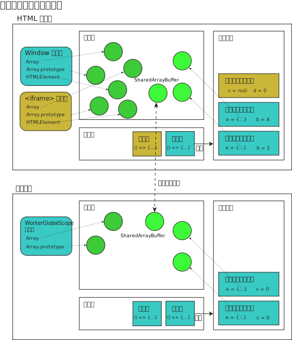

このページでは、JavaScript ランタイム環境の基本的な仕組みについて解説します。このモデルは主に理論的かつ抽象的なものであり、特定のプラットフォームや実装に関する詳細は含まれていません。現行の JavaScript エンジンは、ここで説明する意味づけを大幅に最適化しています。

このページはリファレンスです。読者が C や Java などの他のプログラミング言語の実行モデルについてすでに理解していることを想定しています。また、オペレーティングシステムやプログラミング言語における既存の概念を多用しています。

## エンジンとホスト

JavaScript を実行するには、**JavaScript エンジン**と**ホスト環境**という 2 つのソフトウェアの連携が求められます。

JavaScript エンジンは、[ECMAScript (JavaScript) 言語](/ja/docs/Web/JavaScript/Reference/JavaScript_technologies_overview#javascript_コア言語_ecmascript)を実装し、中核となる機能を提供します。このエンジンはソースコードを受け取り、それを構文解析して実行します。しかし、意味のある出力を生成したり、外部リソースと連携したり、セキュリティやパフォーマンスに関連するメカニズムを実装したりするなど、外部とやり取りを行うためには、ホスト環境によって提供される環境固有の追加メカニズムが必要となります。例えば、ウェブブラウザー内での JavaScript の実行においては、HTML DOM がホスト環境となります。また、Node.js は、サーバーサイドで JavaScript を実行できるようにする別のホスト環境です。

このリファレンスでは主に ECMAScript で定義された仕組みに焦点を当てていますが、時折、HTML 仕様で定義された仕組みについても触れます。これらは Node.js や Deno といった他のホスト環境でも多くの場合採用されています。これにより、ウェブ上およびそれ以外の場面で使用される JavaScript の実行モデルについて、一貫した全体像をお伝えすることができます。

## エージェント実行モデル

JavaScript 仕様書では、JavaScript のそれぞれの実行主体は**エージェント**と呼ばれ、コード実行のための機能を維持しています。

- （オブジェクトの）**ヒープ**: これは、メモリー内の大規模な（主に構造化されていない）領域を指すための単なる名称です。プログラム内でオブジェクトが作成されるにつれて、この領域にデータが格納されていきます。なお、共有メモリーの場合、それぞれのエージェントは自身のヒープと、自身のバージョンの {{jsxref("SharedArrayBuffer")}} オブジェクトを持ちますが、バッファーによって表される基盤となるメモリーは共有されています。
- [（ジョブの）**キュー**](#ジョブキューとイベントループ): これは HTML の世界では（また一般的に）イベントループとして知られており、JavaScript がシングルスレッドであっても、非同期プログラミングをすることができます。一般的に先入れ先出し (FIFO) 方式であるため、キューと呼ばれています。つまり、先に追加されたジョブが、後に追加されたジョブよりも先に実行されます。
- [（実行コンテキストの）**スタック**](#スタックと実行コンテキスト): これはコールスタックとして知られており、関数のような実行コンテキストへの進入や退出を通じて、制御フローを移行することができます。これは後入れ先出し (LIFO) であるため、スタックと呼ばれています。各ジョブは、（空の）スタックに新しいフレームをプッシュすることで開始され、スタックを空にすることで終了します。

これらは、それぞれ異なるデータを管理する 3 つの異なるデータ構造です。キューとスタックについては、後の章で詳しく説明します。ヒープメモリーの割り当てと解放の詳細については、[メモリー管理](/ja/docs/Web/JavaScript/Guide/Memory_management)をご覧ください。

各エージェントはスレッドに相当します（なお、その実装の基盤となるものが実際のオペレーティングシステムのスレッドであるかどうかは場合によります）。各エージェントは、互いに同期的にアクセスできる複数の[レルム](#レルム)（これらはグローバルオブジェクトと 1 対 1 で対応します）を所有することが可能で、そのため単一の実行スレッド内で実行される必要があります。また、エージェントには単一のメモリーモデルがあり、リトルエンディアンであるかどうか、[同期的にブロックされる](#concurrency_and_ensuring_forward_progress)かどうか、原子操作が[ロックフリー](/ja/docs/Web/JavaScript/Reference/Global_Objects/Atomics/isLockFree)であるかどうかなどが示されます。

ウェブ上のエージェントには、次のようなものがあります。

- 類似オリジンウィンドウエージェント (_Similar-origin window agent_)。さまざまな {{domxref("Window")}} オブジェクトが含まれているものであり、互いに直接的に、あるいは {{domxref("Document/domain", "document.domain")}} を使用して到達できる可能性があります。ウィンドウが[オリジンキー付き](/ja/docs/Web/API/Window/originAgentCluster)の場合、同一オリジンのウィンドウ同士のみが相互に到達できます。
- 専用ワーカーエージェント (_Dedicated worker agent_)。単一の {{domxref("DedicatedWorkerGlobalScope")}} が含まれています。
- 共有ワーカーエージェント (_Shared worker agent_)。単一の {{domxref("SharedWorkerGlobalScope")}} が含まれています。
- サービスワーカーエージェント (_Service worker agent_)。単一の {{domxref("ServiceWorkerGlobalScope")}} が含まれています。
- ワークレットエージェント (_Worklet agent_)。単一の {{domxref("WorkletGlobalScope")}} が含まれています。

言い換えれば、それぞれのワーカーは独自のエージェントを生成しますが、1 つ以上のウィンドウが同じエージェント内に存在する場合があります。通常は、メイン文書と、それと同じオリジンを持つ iframe などが該当します。Node.js では、[ワーカースレッド](https://nodejs.org/api/worker_threads.html)と呼ばれる同様の概念が利用可能です。

次の図は、エージェントの実行モデルを示しています。



## レルム

それぞれのエージェントは、1 つ以上の**レルム** (realm) を所有しています。JavaScript コードは読み込まれた際に特定のレルムに関連付けられ、別のレルムから呼び出された場合でも、その関連付けは変わりません。レルムは以下の情報で構成されています。

- `Array`や`Array.prototype`などの内在オブジェクトの一覧。
- グローバル変数、[`globalThis`](/ja/docs/Web/JavaScript/Reference/Global_Objects/globalThis) の値、グローバルオブジェクト
- [テンプレートリテラル配列](/ja/docs/Web/JavaScript/Reference/Template_literals#タグ付きテンプレート)のキャッシュ。同じタグ付きテンプレートリテラル式を評価すると、タグは常に同じ配列オブジェクトを受け取るためです。

ウェブ上では、レルムとグローバルオブジェクトは１対１で対応しています。グローバルオブジェクトは、{{domxref("Window")}}、{{domxref("WorkerGlobalScope")}}、{{domxref("WorkletGlobalScope")}} のいずれかです。したがって、例えば、すべての `iframe` は、親ウィンドウと同じエージェント内にある場合でも、それぞれ異なるレルムで実行されます。

グローバルオブジェクトのアイデンティティについて言及する際、通常は「レルム」という言葉が登場します。例えば、{{jsxref("Array.isArray()")}} や {{jsxref("Error.isError()")}} といったメソッドが必要になるのは、別のレルムで構築された配列は、現在のレルムにある `Array.prototype` オブジェクトとは異なるプロトタイプオブジェクトを持つため、`instanceof Array` が誤って `false` を返すことになるからです。

## スタックと実行コンテキスト

まず、同期的なコードの実行について考えます。それぞれの[ジョブ](#ジョブキューとイベントループ)は、関連付けられたコールバックを呼び出すことで実行されます。このコールバック内のコードは、変数の生成、関数の呼び出し、終了を行うことがあります。各関数は、自身の変数環境と、どこに戻るべきかを追跡する必要があります。これを処理するために、エージェントは実行コンテキストを追跡するためのスタックを必要とします。**実行コンテキスト**（一般にスタックフレームとも呼ばれます）は、実行の最小単位です。これでは以下の情報が追跡されます。

- コードの評価状態
- モジュールまたはスクリプト、関数（該当する場合）、このコードが含まれている現在実行中の[ジェネレーター](/ja/docs/Web/JavaScript/Reference/Global_Objects/Generator)
- 現在の[レルム](#レルム)
- [バインド](/ja/docs/Glossary/Binding)、例えば次のもの
  - `var`、`let`、`const`、`function`、`class` などで定義する変数
  - `#foo`のように、現在のコンテキスト内でのみ有効なプライベート識別子
  - `this` 参照

次のコードで定義された単一のジョブからなるプログラムを想像してみてください。

```js
function foo(b) {
  const a = 10;
  return a + b + 11;
}

function bar(x) {
  const y = 3;
  return foo(x * y);
}

const baz = bar(7); // 42 を baz に代入
```

1. ジョブが始まると、まず最初のフレームが作成され、そこで変数 `foo`、`bar`、`baz` が定義されます。そして、`bar` に引数 `7` をつけて呼び出します。
2. `bar` の呼び出しに対して 2 つ目のフレームが作成され、引数 `x` とローカル変数 `y` のバインドが作られます。まず `x * y` の乗算を実行し、その結果を用いて `foo` を呼び出します。
3. `foo` の呼び出しに対して 3 つ目のフレームが作成され、引数 `b` とローカル変数 `a` のバインドを作られます。まず `a + b + 11` の加算演算を実行し、その結果を返します。
4. `foo`から戻る際、スタックの一番上のフレーム要素がポップされ、呼び出し式 `foo(x * y)` は返値として評価されます。その後、この結果を返すだけの処理が実行されます。
5. `bar` から戻る際、スタックの一番上のフレーム要素がポップされ、呼び出し式 `bar(7)` は返値として評価されます。これにより、`baz` がその返値で初期化されます。
6. ジョブのソースコードの末尾に到達したため、エントリーポイントのスタックフレームがスタックからポップされます。スタックは空になったため、ジョブは完了したとみなされます。

### ジェネレーターと再入

フレームがポップされたとしても、必ずしも永久に消えてしまうわけではありません。なぜなら、後でそのフレームに戻る必要がある場合もあるからです。例えば、ジェネレーター関数を考えてみましょう。

```js
function* gen() {
  console.log(1);
  yield;
  console.log(2);
}

const g = gen();
g.next(); // logs 1
g.next(); // logs 2
```

この場合、`gen()` を呼び出すと、まず実行コンテキストが作成されますが、これは一時停止された状態になります。つまり、`gen` 内のコードはまだ実行されません。ジェネレーター `g` は、この実行コンテキストを内部的に保存します。現在実行中の実行コンテキストは、引き続きエントリーポイントとして残ります。`g.next()` が呼び出されると、`gen` の実行コンテキストがスタックにプッシュされ、`gen` 内のコードが `yield` 式まで実行されます。その後、ジェネレーターの実行コンテキストは一時停止され、スタックから除去されます。これにより、制御はエントリーポイントに戻ります。`g.next()` が再度呼び出されると、ジェネレーターの実行コンテキストがスタックに再びプッシュされ、`gen` 内のコードは中断した箇所から再開されます。

### テールコール

仕様書で定義されているメカニズムの一つに、プロパーテールコール (_proper tail call_, PTC) があります。関数呼び出しがテールコールであるとは、呼び出し側が呼び出し後に値を返す以外の処理を行わない場合を指します。

```js
function f() {
  return g();
}
```

この場合、`g` への呼び出しはテールコールとなります。関数呼び出しが末尾の位置にある場合、エンジンは `g()` の呼び出し用に新しいフレームをスタックにプッシュするのではなく、現在の実行コンテキストを破棄し、それをテールコールのコンテキストに置き換える必要があります。つまり、テール再帰はスタックサイズの制限を受けません。

```js
function factorial(n, acc = 1) {
  if (n <= 1) return acc;
  return factorial(n - 1, n * acc);
}
```

実際には、現在のフレームを破棄するとデバッグ上の問題が発生します。なぜなら、`g()` がエラーを発生させた場合、`f` はスタックに残らず、スタックトレースに現れなくなるからです。現在、PTC を実装しているのは Safari (JavaScriptCore) のみであり、デバッグ性の課題を解決するために、いくつかの[固有の仕組み](https://webkit.org/blog/6240/ecmascript-6-proper-tail-calls-in-webkit/)を構築しています。

### クロージャ

変数のスコープと関数呼び出しに関連するもう一つの興味深い現象が、[クロージャ](/ja/docs/Web/JavaScript/Guide/Closures)です。関数が生成されるたびに、その関数は内部的に、現在実行中の実行コンテキストにおける変数のバインドを記憶します。その結果、これらの変数のバインドは、実行コンテキストが終了した後も存続することがあります。

```js
let f;
{
  let x = 10;
  f = () => x;
}
console.log(f()); // logs 10
```

## ジョブキューとイベントループ

エージェントはスレッドであり、つまりインタープリタは一度に1つの文しか処理できません。コードがすべて同期的であれば、常に処理を進めることができるため、問題はありません。しかし、コードが非同期処理を実行する必要がある場合、その処理が完了しない限り、処理を進めることはできません。しかし、それによってプログラム全体が停止してしまうと、使い勝手に影響を及ぼしてしまいます。ウェブスクリプト言語としての JavaScript の性質上、[ブロックしない](#ブロックしない)ことが求められるのです。そのため、その非同期処理の完了を処理するコードは、コールバックとして定義されます。このコールバックは**ジョブ**を定義し、処理が完了すると、そのジョブは**ジョブキュー**（HTML の用語で言えばイベントループ）に入れられます。

エージェントは毎回、キューからジョブを取り出して実行します。ジョブが実行されると、同時に新しいジョブが生成され、それらはキューの末尾に追加されます。また、タイマー、I/O、イベントなどの非同期プラットフォームメカニズムの完了によっても、ジョブが追加されることがあります。ジョブは、[スタック](#スタックと実行コンテキスト)が空になった時点で完了したとみなされ、その後、キューから次のジョブが取り出されます。ジョブは一律の優先度で取り出されるとは限りません。例えば、HTML イベントループでは、ジョブをタスクとマイクロタスクの 2 つのカテゴリーに分類します。マイクロタスクは優先度高しで、タスクキューからジョブが取り出される前に、まずマイクロタスクキューが処理されます。情報については、[HTML マイクロタスクガイド](/ja/docs/Web/API/HTML_DOM_API/Microtask_guide)を参照してください。ジョブキューが空の場合、エージェントは新しいジョブを追加するのを待機します。

### 「完了まで実行」

それぞれのジョブは、他のジョブが処理される前に完了します。これにより、プログラムを分析する際にいくつかのプロパティがあります。例えば、関数が実行されると、その実行は割り込みを受けることがなく、他のコードが実行される前に完全に完了します（また、その関数が操作するデータを変更することも可能です）。これは、例えば C 言語とは異なります。C 言語では、関数がスレッド内で実行されている場合、ランタイムシステムによっていつでも中断され、別のスレッド内のコードが実行されることがあります。

例えば、次のような例を考えてみましょう。

```js
const promise = Promise.resolve();
let i = 0;
promise.then(() => {
  i += 1;
  console.log(i);
});
promise.then(() => {
  i += 1;
  console.log(i);
});
```

この例では、すでに解決済みのプロミスを作成しています。つまり、これに添付されたコールバックはすべて、直ちにジョブとしてスケジュールされます。2 つのコールバックは競合状態を発生させているように見えますが、実際には出力は完全に予測可能です。つまり、`1` と `2` が順番にログ出力されます。これは、それぞれのジョブが完了してから次のジョブが実行されるためです。したがって、全体的な順序は常に `i += 1; console.log(i); i += 1; console.log(i);` となり、決して `i += 1; i += 1; console.log(i); console.log(i);` とはなりません。

このモデルの欠点は、ジョブの完了に時間がかかりすぎると、ウェブアプリケーションがクリックやスクロールといったユーザーの操作を処理できなくなることです。ブラウザーは、「スクリプトの実行に時間がかかりすぎます」というダイアログを表示することで、この問題を緩和します。推奨される対策としては、ジョブの処理時間を短くすること、そして可能であれば、1 つのジョブを複数のジョブに分割することです。

### ブロックしない

イベントループモデルが提供するもう一つの重要な保証は、JavaScript の実行が決してブロックされないということです。I/O の処理は通常、イベントとコールバックを通じて行われるため、アプリケーションが [IndexedDB](/ja/docs/Web/API/IndexedDB_API) クエリーの返答や [`fetch()`](/ja/docs/Web/API/Window/fetch) リクエストの返答を待っている間でも、ユーザー入力などの他の処理を継続することが可能です。非同期アクションの完了後に実行されるコードは、常にコールバック関数として指定されます（例えば、プロミスの {{jsxref("Promise/then", "then()")}} ハンドラー、`setTimeout()` のコールバック関数、またはイベントハンドラーなど）。これらは、アクションが完了した際にジョブキューに追加されるタスクを定義するものです。

もちろん、「ブロックしない」という保証を実現するには、プラットフォームの API が本質的に非同期である必要がありますが、`alert()` や同期型の XHR など、一部の古い例外が存在します。アプリケーションの応答性を確実に実現するため、これらを避けることが推奨されています。

## エージェントクラスターとメモリー共有

複数のエージェントはメモリー共有を通じて通信し、**エージェントクラスター**を形成することができます。エージェントは、メモリーを共有できる場合に限り、同じクラスター内に存在します。2 つのエージェントクラスター間で情報を交換するための組み込みの仕組みは存在しないため、これらは完全に独立した実行モデルと見なされます。

エージェントを作成する際（ワーカーの生成など）、それが現在のエージェントと同じクラスターに属するか、それとも新しいクラスターが作成されるかについては、いくつかの基準があります。例えば、以下のグローバルオブジェクトのペアは、それぞれ同じエージェントクラスター内に存在するため、互いにメモリーを共有することが可能です。

- `Window` オブジェクトと、それが作成した専用ワーカー。
- ワーカー（任意の型）と、それが作成した専用ワーカー。
- `Window` オブジェクト A と、A が作成した同一オリジンの `iframe` 要素の `Window` オブジェクト。
- `Window` オブジェクトと、それを開いた同一オリジンの `Window` オブジェクト。
- `Window` オブジェクトと、それが作成したワークレット。

以下のグローバルオブジェクトのペアは、同じエージェントクラスター内に存在しないため、メモリーを共有することはできません。

- `Window` オブジェクトと、それが作成した共有ワーカー。
- ワーカー（任意の型）と、それが作成した共有ワーカー。
- `Window` オブジェクトと、それが作成したサービスワーカー。
- `Window` オブジェクト A と、A が作成した `iframe` 要素の `Window` オブジェクト（A と同一オリジンのドメインであってはなりません）。
- オープナーや祖先関係を持たない 2 つの `Window` オブジェクト。これは、2 つの `Window` オブジェクトが同一オリジンである場合でも当てはまります。

正確なアルゴリズムについては、[HTML 仕様書](https://html.spec.whatwg.org/multipage/webappapis.html#integration-with-the-javascript-agent-cluster-formalism)を調べてください。

### エージェント間の通信とメモリーモデル

前述の通り、エージェントはメモリー共有を通じて通信します。ウェブ上では、メモリーは [`postMessage()`](/ja/docs/Web/API/Window/postMessage) メソッドを介して共有されます。[ウェブワーカーの使用方法](/ja/docs/Web/API/Web_Workers_API/Using_web_workers)ガイドでは、この概要が説明されています。通常、データは値渡しのみで（[構造化複製](/ja/docs/Web/API/Web_Workers_API/Structured_clone_algorithm)を通じて）渡されるため、並行処理に関する複雑な問題は生じません。メモリーを共有するには、{{jsxref("SharedArrayBuffer")}} オブジェクトを投稿しなければならない。これにより、複数のエージェントが同時にアクセス可能になる。2 つのエージェントが `SharedArrayBuffer` を通じて同じメモリーへのアクセスを共有すると、{{jsxref("Atomics")}} オブジェクトを使用して実行を同期させることができる。

共有メモリーにアクセスするには、通常のメモリーアクセス（原子性を持ちません）と、原子的なメモリーアクセスの 2 つの方法があります。後者は[逐次一貫性](https://en.wikipedia.org/wiki/Sequential_consistency)（つまり、クラスター内のすべてのエージェントが合意した厳密なイベントの全順序が存在することを意味します）を保証しますが、前者は順序付けられていません（つまり、順序が存在しないことを意味します）。JavaScript では、それ以外の順序保証を持つ操作は提供されていません。

この仕様書では、共有メモリーと一緒に作業するプログラマー向けに、以下のガイドラインを指定しています。

> プログラムはデータ競合が発生しないようにすることを推奨します。つまり、同じメモリ位置に対して非原子的な操作が並行して行われることが絶対にないような構造にする必要があります。データ競合のないプログラムは、各エージェントの評価セマンティクスにおける各ステップが互いにインターリーブされるようなインターリーブセマンティクスを持っています。データ競合のないプログラムについては、メモリーモデルの詳細を理解する必要はありません。その詳細を知ったところで、ECMAScript をより良く記述するための直感が役立つことは難しいでしょう。
>
> より一般的には、たとえプログラムにデータ競合が存在したとしても、データ競合に関与する操作に原子的操作が含まれておらず、かつ競合するすべての操作のアクセスサイズが同一である限り、予測可能な動作を持つことができる可能性があります。原子的操作が競合に関与しないようにする最も簡単な方法は、原子的操作と非原子的操作で異なるメモリセルを使用するようにし、異なるサイズの原子的アクセスが同時に同じセルにアクセスしないようにすることです。実質的に言えば、プログラムは共有メモリーを可能な限り厳密な型付けとして扱うべきです。競合する原子的でないアクセスの順序やタイミングに依存することは依然としてできませんが、メモリーを厳密な型付けとして扱うことで、競合するアクセスによる「ティアリング」（値のビットが混在すること）は発生しません。

### 並行処理と前方進行の保証

複数のエージェントが連携する場合、[ブロックしない](#never_blocking)という保証は常に成り立ちません。あるエージェントは、別のエージェントが何らかのアクションを実行するのを待っている間に、ブロック、つまり一時停止状態になることがあります。これは、同じエージェント内でプロミスの完了を待つ場合とは異なります。なぜなら、エージェント全体が停止し、その間、他のコードは一切実行できなくなるからです。言い換えれば、処理を先に進めることができないのです。

デッドロックを防ぐため、どのエージェントがいつブロックされるかについて、厳しい制限があります。

- 専用の実行スレッドを持つブロックされていないエージェントは、最終的に処理を前進させます。
- 実行スレッドを共有するエージェントのグループでは、いずれかのエージェントが最終的に処理を前進させます。
- エージェントは、ブロック機能を提供する明示的なAPIを介する場合を除き、他のエージェントをブロックすることはありません。
- ブロックされる可能性があるのは特定のエージェントのみです。ウェブ上では、これには専用ワーカーや共有ワーカーが含まれますが、同一オリジンのウィンドウやサービスワーカーは含まれません。

エージェントクラスターは、外部からの一時停止や終了が発生した場合でも、エージェントの稼働状況について一定の整合性を保証します。

- エージェントは、その認識や協力なしに一時停止または再開されることがあります。例えば、ウィンドウから移動すると、コードの実行は中断されますが、その状態は保持されます。ただし、あるエージェントが無効化されたために別のエージェントがリソース不足に陥ることを避けるため、エージェントクラスターを部分的に無効化することは許可されていません。例えば、共有ワーカーは、作成元ウィンドウや他の専用ワーカーと同じエージェントクラスターに属することはありません。これは、共有ワーカーの存続期間が文書とは独立しているためです。もし、専用ワーカーがロックを保持している間に文書が無効化された場合、専用ワーカーが再有効化されるまで（もし再有効化されるとしても）、共有ワーカーはロックを取得できなくなります。その間、他のウィンドウから共有ワーカーにアクセスしようとする他のワーカーは、リソース不足に陥ってしまいます。
- 同様に、エージェントはクラスターの外部要因によって終了させられる場合があります。例えば、オペレーティングシステムやユーザーがブラウザープロセスを強制終了させたり、ブラウザーがリソースを過剰に使用しているとしてエージェントを強制終了させたりする場合などです。この場合、クラスター内のすべてのエージェントが終了します。（仕様書では、クラスターに残っている少なくとも 1 つのノードが、終了処理および終了されたエージェントを特定できる API という、第 2 の戦略も認められていますが、これはウェブ上では実装されていません。）

## 仕様書

{{Specifications}}

## 関連情報

- [Event loops](https://html.spec.whatwg.org/multipage/webappapis.html#event-loops) - HTML standard
- [What is the Event Loop?](https://nodejs.org/learn/asynchronous-work/event-loop-timers-and-nexttick#what-is-the-event-loop) - Node.js ドキュメント
