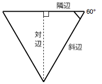

{{JSRef}}

**`Math`** は、数学的な定数と関数を提供するプロパティとメソッドを持つ、組み込みのオブジェクトです。関数オブジェクトではありません。

`Math` は {{jsxref("Number")}} 型で動作します。 {{jsxref("BigInt")}} 型では動作しません。

## 解説

他のグローバルオブジェクトと異なり、`Math` はコンストラクタではありません。`Math` オブジェクトのすべてのプロパティとメソッドは、静的です。円周率を表す定数 π は、`Math.PI` として参照でき、正弦関数は、 `Math.sin(x)` として呼び出すことができます (ここでの `x` は、メソッドの引数です)。定数は、 JavaScript における実数での完全な精度で定義されています。

> **メモ:** 多くの `Math` 関数の精度は*実装に依存します*。
>
> これは、ブラウザーごとに結果が異なる場合があることを意味し、同じ JavaScript エンジン上であっても、 OS やアーキテクチャが異なれば結果が異なる場合があります。

## 静的プロパティ

- {{jsxref("Math.E")}}
  - : ネイピア数 (オイラー数)。これは自然対数の底として用いられる数学定数で、約 `2.718` です。
- {{jsxref("Math.LN2")}}
  - : `2` の自然対数。約 `0.693` です。
- {{jsxref("Math.LN10")}}
  - : `10` の自然対数。約 `2.303` です。
- {{jsxref("Math.LOG2E")}}
  - : 2 を底とした `E` の対数。約 `1.443` です。
- {{jsxref("Math.LOG10E")}}
  - : 10 を底とした `E` の対数。約 `0.434` です。
- {{jsxref("Math.PI")}}
  - : 円周率。約 `3.14159` です。
- {{jsxref("Math.SQRT1_2")}}
  - : ½ の平方根 (または 1/√2 とひとしいすう)。約 `0.707` です。
- {{jsxref("Math.SQRT2")}}
  - : `2` の平方根。約 `1.414` です。

## 静的メソッド

- {{jsxref("Global_Objects/Math/abs", "Math.abs(<var>x</var>)")}}
  - : `x` の絶対値を返す。
- {{jsxref("Global_Objects/Math/acos", "Math.acos(<var>x</var>)")}}
  - : `x` のアークコサイン (逆余弦) を返す。
- {{jsxref("Global_Objects/Math/acosh", "Math.acosh(<var>x</var>)")}}
  - : `x` のハイパーボリックアークコサイン (双曲線逆余弦) を返す。
- {{jsxref("Global_Objects/Math/asin", "Math.asin(<var>x</var>)")}}
  - : `x` のアークサイン (逆正弦) を返す。
- {{jsxref("Global_Objects/Math/asinh", "Math.asinh(<var>x</var>)")}}
  - : `x` のハイパーボリックアークサイン (双曲線逆正弦) を返す。
- {{jsxref("Global_Objects/Math/atan", "Math.atan(<var>x</var>)")}}
  - : `x` のアークタンジェント (逆正接) を返す。
- {{jsxref("Global_Objects/Math/atanh", "Math.atanh(<var>x</var>)")}}
  - : `x` のハイパーボリックアークタンジェント (双曲線逆正接) を返す。
- {{jsxref("Global_Objects/Math/atan2", "Math.atan2(<var>y</var>, <var>x</var>)")}}
  - : 引数で指定されたの比率のアークタンジェント (逆正接) を返す。
- {{jsxref("Global_Objects/Math/cbrt", "Math.cbrt(<var>x</var>)")}}
  - : `x` の立方根を返す。
- {{jsxref("Global_Objects/Math/ceil", "Math.ceil(<var>x</var>)")}}
  - : `x` 以上の最小の整数を返す。
- {{jsxref("Global_Objects/Math/clz32", "Math.clz32(<var>x</var>)")}}
  - : `x` を 2 進数 32 ビット整数値で表した数の先頭の 0 の個数を返す。
- {{jsxref("Global_Objects/Math/cos", "Math.cos(<var>x</var>)")}}
  - : `x` のコサイン (余弦) を返す。
- {{jsxref("Global_Objects/Math/cosh", "Math.cosh(<var>x</var>)")}}
  - : `x` のハイパーボリックコサイン (双曲線余弦) を返す。
- {{jsxref("Global_Objects/Math/exp", "Math.exp(<var>x</var>)")}}
  - : `Ex` を返します。ここで `x` は引数であり、 `E` はオイラー定数 (`2.718`…, 自然対数の低) です。
- {{jsxref("Global_Objects/Math/expm1", "Math.expm1(<var>x</var>)")}}
  - : `exp(x)` から `1` を引いた値を返す。
- {{jsxref("Global_Objects/Math/floor", "Math.floor(<var>x</var>)")}}
  - : `x` 以下の最大の整数を返す。
- {{jsxref("Global_Objects/Math/fround", "Math.fround(<var>x</var>)")}}
  - : `x` に近似の [単精度](https://ja.wikipedia.org/wiki/%E5%8D%98%E7%B2%BE%E5%BA%A6%E6%B5%AE%E5%8B%95%E5%B0%8F%E6%95%B0%E7%82%B9%E6%95%B0) 浮動小数点数を返す。
- {{jsxref("Global_Objects/Math/hypot", "Math.hypot([<var>x</var>[, <var>y</var>[, …]]])")}}
  - : 引数の二乗和の平方根を返す。
- {{jsxref("Global_Objects/Math/imul", "Math.imul(<var>x</var>, <var>y</var>)")}}
  - : `x` と `y` の 32 ビット乗算の結果を返す。
- {{jsxref("Global_Objects/Math/log", "Math.log(<var>x</var>)")}}
  - : `x` の自然対数 (㏒e) を返す。
- {{jsxref("Global_Objects/Math/log1p", "Math.log1p(<var>x</var>)")}}
  - : `x` の `1 + x` の自然対数 (㏒e) を返す。
- {{jsxref("Global_Objects/Math/log10", "Math.log10(<var>x</var>)")}}
  - : `x` の 10 を底とした対数 (log10) を返す。
- {{jsxref("Global_Objects/Math/log2", "Math.log2(<var>x</var>)")}}
  - : `x` の 2 を底とした対数 (log2) を返す。
- {{jsxref("Global_Objects/Math/max", "Math.max([<var>x</var>[, <var>y</var>[, …]]])")}}
  - : 引数として与えた複数の値の中で最大の値を返す。
- {{jsxref("Global_Objects/Math/min", "Math.min([<var>x</var>[, <var>y</var>[, …]]])")}}
  - : 引数として与えた複数の値の中で最小の値を返す。
- {{jsxref("Global_Objects/Math/pow", "Math.pow(<var>x</var>, <var>y</var>)")}}
  - : `x` を `y` で累乗した値、すなわち `xy` を返す。
- {{jsxref("Global_Objects/Math/random", "Math.random()")}}
  - : `0` 以上 `1` 未満の疑似乱数を返す。
- {{jsxref("Global_Objects/Math/round", "Math.round(<var>x</var>)")}}
  - : `x` を四捨五入して、近似の整数を返す
- {{jsxref("Global_Objects/Math/sign", "Math.sign(<var>x</var>)")}}
  - : `x` の符号を返す。`x` が正、負、 0 のいずれであるかを返す。
- {{jsxref("Global_Objects/Math/sin", "Math.sin(<var>x</var>)")}}
  - : `x` のサイン (正弦) を返す。
- {{jsxref("Global_Objects/Math/sinh", "Math.sinh(<var>x</var>)")}}
  - : `x` のハイパーボリックサイン (双曲線正弦) を返す。
- {{jsxref("Global_Objects/Math/sqrt", "Math.sqrt(<var>x</var>)")}}
  - : `x` の平方根を返す
- {{jsxref("Global_Objects/Math/tan", "Math.tan(<var>x</var>)")}}
  - : `x` のタンジェント (正接) を返す。
- {{jsxref("Global_Objects/Math/tanh", "Math.tanh(<var>x</var>)")}}
  - : `x` のハイパーボリックサイン (双曲線正接) を返す。
- {{jsxref("Global_Objects/Math/trunc", "Math.trunc(<var>x</var>)")}}
  - : 数値 `x` の小数点以下を削除し、整数の部分を返す。

## 例

### 角度とラジアンの間の変換

三角関数 (`sin()`, `cos()`, `tan()`, `asin()`, `acos()`, `atan()`, `atan2()`) は、角度に*ラジアン*を要求したり、返したりします。

人間は角度で考える傾向があり、 (CSS 変形関数など) 一部の関数角度を受け付けますので、手軽に両者の間を変換する関数を用意しておくといいでしょう。

```js
function degToRad(degrees) {
  return degrees * (Math.PI / 180);
}

function radToDeg(rad) {
  return rad / (Math.PI / 180);
}
```

### 正三角形の高さの計算

正三角形の高さを計算したい場合、側辺の長さが 100 であるとわかっている場合は、*隣の角に正接を乗じた長さは、反対側と等しくなる*という数式を使用することができます。



JavaScript では、次のようにして実現することができます。

```js
50 * Math.tan(degToRad(60)).
```

`degToRad()` 関数を使用して 60 度をラジアンに変換しています。これは {{jsxref("Math.tan()")}} がラジアンの入力値を要求するからです。

### 2 つの値の間にある整数の乱数を返す

これは {{jsxref("Math.random()")}} と {{jsxref("Math.floor()")}} の組み合わせで実現できます。

```js
function random(min, max) {
  const num = Math.floor(Math.random() * (max - min + 1)) + min;
  return num;
}

random(1, 10);
```

## 仕様書

{{Specifications}}

## ブラウザーの互換性

{{Compat("javascript.builtins.Math")}}

## 関連情報

- {{jsxref("Number")}}
