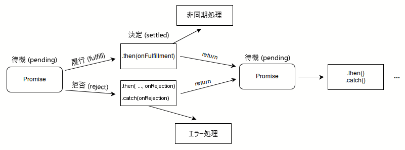

{{JSRef}}

**`Promise`** オブジェクトは、非同期処理の完了 (もしくは失敗) の結果およびその結果の値を表します。

プロミスの挙動と使用法について学ぶには、最初に[プロミスの使用](/ja/docs/Web/JavaScript/Guide/Using_promises)をお読みください。

## 解説

プロミス (**`Promise`**) は、作成された時点では分からなくてもよい値へのプロキシーです。非同期のアクションの成功値または失敗理由にハンドラーを結びつけることができます。これにより、非同期メソッドは結果の値を返す代わりに、未来のある時点で値を提供する*プロミス*を返すことで、同期メソッドと同じように値を返すことができるようになります。

`Promise` の状態は以下のいずれかとなります。

- 待機 (_pending_): 初期状態。成功も失敗もしていません。
- 履行 (_fulfilled_): 処理が成功して完了したことを意味します。
- 拒否 (_rejected_): 処理が失敗したことを意味します。

待機状態のプロミスの _最終的な状態_ は、何らかの値を持つ履行 (_fulfilled_) 状態、もしくは何らかの理由 (エラー) を持つ拒否 (_rejected_) 状態のいずれかになります。
そのどちらとなっても、`then` メソッドによって関連付けられたハンドラーが呼び出されます。対応するハンドラーが割り当てられたとき、既にプロミスが履行または拒否状態になっていても、そのハンドラーは呼び出されます。よって、非同期処理とその関連付けられたハンドラーとの競合は発生しません。

プロミスが履行または拒否のいずれかで、待機以外の状態になった場合は、決定 (_settled_) と呼ばれます。



また、プロミスでは _resolved_ という用語が使用されることもあります。これは、プロミスが他のプロミスの最終的な状態と一致するように決定または「ロックイン」され、さらに解決または拒否しても何の影響もないことを意味します。元のプロミスの提案の [States and fates](https://github.com/domenic/promises-unwrapping/blob/master/docs/states-and-fates.md) の記事には、プロミスの用語についてのより詳細な説明があります。口語的には、「解決された」プロミスは「履行された」プロミスとよく同等に扱われますが、 "States and fates" で示しているように、解決されたプロミスは待機になったり拒否されたりすることもあります。次の例を参照してください。

```js
new Promise((resolveOuter) => {
  resolveOuter(
    new Promise((resolveInner) => {
      setTimeout(resolveInner, 1000);
    }),
  );
});
```

このプロミスは作成された時点ですでに _解決_ されていますが（`resolveOuter` が同期的に呼び出されるため）、別のプロミスで解決されているため、 1 秒後に内側のプロミスが履行されるまで _履行_ されません。実際には、「解決」は舞台裏で行われ、観察することができず、履行か拒否かだけを観察することができます。

> **メモ:** Scheme など一部の言語では、遅延評価や計算を延期する機構を持っており、これらも「プロミス」と呼ばれます。 JavaScript におけるプロミスは、すでに起きつつある処理を表し、この処理はコールバック関数を使うことで連鎖させることができます。式を遅延評価する方法を探しているのであれば、引数なしの関数を使用するを検討してください。 `f = () => expression` で遅延評価される式が作成でき、 `f()` でその式を直ちに評価することができます。

### プロミスの連鎖

{{jsxref("Promise.prototype.then()")}}, {{jsxref("Promise.prototype.catch()")}}, {{jsxref("Promise.prototype.finally()")}} の各メソッドを使用して、決定したプロミスにさらなるアクションを結びつけることができます。

`.then()` メソッドは、最大で 2 つの引数を取ります。1 番目の引数は、プロミスが履行された場合のコールバック関数で、 2 番目の引数は、拒否された場合のコールバック関数です。それぞれの `.then()` は新たに生成されたプロミスオブジェクトを返します。このオブジェクトは、オプションで連鎖に使用することができます。例えば、このようになります。

```js
const myPromise = new Promise((resolve, reject) => {
  setTimeout(() => {
    resolve("foo");
  }, 300);
});

myPromise
  .then(handleFulfilledA, handleRejectedA)
  .then(handleFulfilledB, handleRejectedB)
  .then(handleFulfilledC, handleRejectedC);
```

`.then()` に Promise オブジェクトを返すコールバック関数がない場合でも、連鎖の次のリンクへと処理が進みます。したがって、連鎖では最後の `.catch()` まで、すべての*拒否*のコールバック関数を省略しても安全です。

それぞれの `.then()` で拒否されたプロミスを扱うと、プロミスの連鎖のさらに先に影響を及ぼします。エラーを直ちに処理しなければならないため、選択の余地がない場合もあります。このような場合には、連鎖的にエラー状態を維持するために、何らかの種類のエラーを発生させる必要があります。一方で、緊急の必要性がない場合は、最後の `.catch()` ステートメントまでエラー処理を行わない方がシンプルです。 `.catch()` は、実際には、単なる `.then()` からプロミスが履行されたときのためのコールバック関数のスロットを抜いたものです。

```js
myPromise
  .then(handleFulfilledA)
  .then(handleFulfilledB)
  .then(handleFulfilledC)
  .catch(handleRejectedAny);
```

[アロー関数](/ja/docs/Web/JavaScript/Reference/Functions/Arrow_functions)をコールバック関数に使用すると、プロミス連鎖の実装は次のようになるでしょう。

```js
myPromise
  .then((value) => `${value} and bar`)
  .then((value) => `${value} and bar again`)
  .then((value) => `${value} and again`)
  .then((value) => `${value} and again`)
  .then((value) => {
    console.log(value);
  })
  .catch((err) => {
    console.error(err);
  });
```

> **メモ:** より高速に実行するためには、できればすべての同期アクションを 1 つのハンドラー内で行うようにしてください。そうしなければ、すべてのハンドラーを順番に実行するのに数カウントかかることになります。

プロミスの終了条件は、その連鎖内の次のプロミスの「決定」状態を決定します。「履行」状態はプロミスの完了が成功したことを示し、「拒否」状態は成功しなかったことを示します。連鎖内で履行されたそれぞれのプロミスの返値は、次の `.then()` に渡され、拒否された理由は連鎖内の次の拒否ハンドラー関数に渡されます。

連鎖のプロミスは、ロシア人形のように入れ子になっていますが、スタックの一番上のように取り出されます。連鎖の最初のプロミスは最も深くネストされており、最初に取り出されます。

```plain
(プロミス D, (プロミス C, (プロミス B, (プロミス A) ) ) )
```

`nextValue` がプロミスである場合、その効果は動的な置換です。 `return` によってプロミスが取り出されますが、 `nextValue` のプロミスはその場所に押し込まれます。上に示した入れ子では、"プロミス B" に関連付けられた `.then()` が "プロミス X" の `nextValue` を返すとします。 結果としての入れ子は以下のようになります。

```plain
(プロミス D, (プロミス C, (プロミス X) ) )
```

プロミスは複数の入れ子に参加することができます。以下のコードでは、 `プロミス A` が「決定」状態に移行すると、 `.then()` の両方のインスタンスが呼び出されます。

```js
const promiseA = new Promise(myExecutorFunc);
const promiseB = promiseA.then(handleFulfilled1, handleRejected1);
const promiseC = promiseA.then(handleFulfilled2, handleRejected2);
```

既に「決定」状態のプロミスにアクションを割り当てることができます。その場合、アクションは (適切であれば) 最初の非同期の機会に実行されます。プロミスは非同期であることが保証されていることに注意してください。したがって、既に「解決」状態のプロミスに対するアクションは、スタックがクリアされ、クロックティックが経過した後にのみ実行されます。この効果は `setTimeout(action,10)` とよく似ています

```js
const promiseA = new Promise((resolve, reject) => {
  resolve(777);
});
// この時点で、 "promiseA" はすでに決定されています。
promiseA.then((val) => console.log("asynchronous logging has val:", val));
console.log("immediate logging");

// 以下の順序で出力が行われます。
// immediate logging
// asynchronous logging has val: 777
```

### Thenable

JavaScript のエコシステムには、プロミスが言語の一部となるずっと前から、複数のプロミスの実装がありました。内部では様々な形で表現されていますが、最低限、すべてのプロミス風のオブジェクトは _Thenable_ インターフェイスを実装しています。 Thenable は [`.then()`](/ja/docs/Web/JavaScript/Reference/Global_Objects/Promise/then) メソッドを実装しています。これは 2 つのコールバックを取り、1 つはプロミスが履行されたとき、もう 1 つはプロミスが拒否されたときに呼び出されます。プロミスは Thenable でもあります。

既存のプロミス実装と相互運用するために、言語ではプロミスの代わりに Thenable を使用することができます。例えば、 [`Promise.resolve`](/ja/docs/Web/JavaScript/Reference/Global_Objects/Promise/resolve) はプロミスの解決だけでなく、 Thenable の追跡も行います。

```js
const aThenable = {
  then(onFulfilled, onRejected) {
    onFulfilled({
      // The thenable is fulfilled with another thenable
      then(onFulfilled, onRejected) {
        onFulfilled(42);
      },
    });
  },
};

Promise.resolve(aThenable); // プロミスは 42 で履行
```

### プロミスの並行処理

`Promise` クラスは，非同期タスクの[並行処理](https://en.wikipedia.org/wiki/Concurrent_computing)を容易にするために、4 つの静的メソッドを提供しています。

- {{jsxref("Promise.all()")}}
  - : **すべて**のが履行されたときに履行され、**いずれか**のプロミスが拒否されると拒否される。
- {{jsxref("Promise.allSettled()")}}
  - : **すべて**のプロミスが決定されたときに履行される。
- {{jsxref("Promise.any()")}}
  - : **いずれか**のプロミスが履行されたときに履行され、**すべて**のプロミスが拒否されると拒否される。
- {{jsxref("Promise.race()")}}
  - : **いずれか**のプロミスが決定されたときに決定されます。すなわち、いずれかのプロミスが履行されれば履行され、いずれかのプロミスが拒否されれば拒否されます。

これらのメソッドはすべて、プロミスの[反復可能](/ja/docs/Web/JavaScript/Reference/Iteration_protocols#the_iterable_protocol)オブジェクト（正確には [Thenable](#thenable)）を受け取り、新しいプロミスを返します。これらはすべてサブクラス化に対応しています。つまり、 `Promise` のサブクラスに対して呼び出すことができ、その結果はサブクラスの種類を持つプロミスになります。そのためには、サブクラスのコンストラクターに [`Promise()`](/ja/docs/Web/JavaScript/Reference/Global_Objects/Promise/Promise) と同じ定義を実装する必要があります。すなわち、単一の `executor` 関数を取り、これが `resolve` と `reject` コールバック関数を引数として取るようにします。また、サブクラスには静的メソッドの `resolve` も必要です。これは {{jsxref("Promise.resolve()")}} のように呼び出すことができ、値をプロミスに解決するためのメソッドです。

JavaScript はもともと[シングルスレッド](/ja/docs/Glossary/Thread)なので、指定された瞬間には 1 つのタスクしか実行されませんが、異なるプロミス間で制御が移り、プロミスの実行が同時に行われるように見えることがあることに注意してください。JavaScript で[並列実行](https://ja.wikipedia.org/wiki/並列計算)を行うには、[ワーカースレッド](/ja/docs/Web/API/Web_Workers_API)を使うしかありません。

## コンストラクター

- {{jsxref("Promise/Promise", "Promise()")}}
  - : 新しい `Promise` オブジェクトを生成します。このコンストラクターは主に、まだプロミスに対応していない関数をラップするために使われます。

## 静的メソッド

- {{JSxRef("Promise.all()")}}

  - : すべてのプロミスが履行されるか、拒否されるかするまで待ちます。

    返却されたプロミスが履行された場合、履行されたプロミスが、複数のプロミスが含まれる反復可能オブジェクトで定義された順番で入った集合配列の値によって履行されます。

    拒否された場合は、反復可能オブジェクトの中で拒否された最初のプロミスの理由によって拒否されます。

- {{JSxRef("Promise.allSettled()")}}

  - : すべてのプロミスが決定する (それぞれが履行されるか、拒否される) まで待ちます。

    これはすべての与えられたプロミスが履行または拒否された後で、それぞれのプロミスの結果を記述したオブジェクトの配列で解決される Promise を返します。

- {{JSxRef("Promise.any()")}}
  - : Promise オブジェクトの反復可能オブジェクトを取り、反復可能オブジェクトの中のプロミスのうちの一つが履行され次第、そのプロミスから受け取った値で履行される単一のプロミスを返します。
- {{JSxRef("Promise.race()")}}

  - : プロミスのうちの 1 つが履行または拒否されるまで待ちます。

    返されたプロミスが履行された場合、反復可能オブジェクトの中で最初に履行されたプロミスの値によって履行されます。

    拒否された場合、最初に拒否されたプロミスの理由によって拒否されます。

- {{JSxRef("Promise.reject()")}}
  - : 与えられた理由で拒否された新しい `Promise` オブジェクトを返します。
- {{JSxRef("Promise.resolve()")}}

  - : 与えられた値で解決された新しい `Promise` オブジェクトを返します。もし値が Thenable （つまり `then` メソッドを持っているオブジェクト）ならば、返されるプロミスはその Thenable をたどり、その結果を採用します。そうでなければ、返されるプロミスは与えられた値で履行されます。

    一般に、ある値がプロミスであるかどうかがわからない場合は、代わりに {{JSxRef("Promise.resolve", "Promise.resolve(value)")}} を使用し、返値をプロミスとして扱います。

## インスタンスプロパティ

- `Promise.prototype[@@toStringTag]`
  - : [`@@toStringTag`](/ja/docs/Web/JavaScript/Reference/Global_Objects/Symbol/toStringTag) プロパティの初期値は文字列 `"Promise"` です。このプロパティは {{jsxref("Object.prototype.toString()")}} で使用されます。

## インスタンスメソッド

マイクロタスクのキューやサービスを使用する方法については、[マイクロタスクのガイド](/ja/docs/Web/API/HTML_DOM_API/Microtask_guide)を参照してください。

- {{jsxref("Promise.prototype.catch()")}}
  - : プロミスに拒否ハンドラーコールバックを追加し、コールバックが呼び出されたときの返値で解決する、または、プロミスが履行された場合は、元の履行結果で解決する
    新しいプロミスを返します。
- {{jsxref("Promise.prototype.then()")}}
  - : プロミスに履行ハンドラーと拒否ハンドラーを追加し、呼び出されたハンドラーの返値で解決する新しいプロミスを返します。プロミスが処理されなかった場合 (すなわち、関連するハンドラー `onFulfilled` または `onRejected` が関数ではない場合) は、元の解決値を返します。
- {{jsxref("Promise.prototype.finally()")}}
  - : プロミスにハンドラーを追加し、元のプロミスが解決されたときに解決される新しいプロミスを返します。このハンドラーは、成功か失敗かに関わらず、元のプロミスが完了したときに呼び出されます。

## 例

### 基本的な例

```js
const myFirstPromise = new Promise((resolve, reject) => {
  // We call resolve(...) when what we were doing asynchronously was successful, and reject(...) when it failed.
  // In this example, we use setTimeout(...) to simulate async code.
  // In reality, you will probably be using something like XHR or an HTML API.
  setTimeout(() => {
    resolve("Success!"); // Yay! Everything went well!
  }, 250);
});

myFirstPromise.then((successMessage) => {
  // successMessage is whatever we passed in the resolve(...) function above.
  // It doesn't have to be a string, but if it is only a succeed message, it probably will be.
  console.log(`Yay! ${successMessage}`);
});
```

### 多様な状況に対応した例

この例では、プロミス機能を使用するための多様なテクニックと、発生する可能性のある多様な状況を示しています。これを理解するには、まずコードブロックの一番下までスクロールして、プロミス連鎖を調べてください。最初のプロミスが提供されてから、プロミスの連鎖が続きます。この連鎖は `.then()` の呼び出しで構成され、通常は (必ずしもそうとは限りませんが) 最後に単一の `.catch()` があり、任意で `.finally()` が続きます。この例では、プロミス連鎖は独自に書かれた `new Promise()` コンストラクターによって開始されますが、実際には、プロミス連鎖は通常、プロミスを返す API 関数 (他の誰かが書いたもの) から開始されます。

関数 `tetheredGetNumber()` の例では、非同期呼び出しを設定している間、またはコールバック内で、またはその両方で `reject()` を使用してプロミスを生成することを示しています。 関数 `promiseGetWord()` は、API 関数がどのように自己完結型の方法でプロミスを生成して返すかを示しています。

関数 `troubleWithGetNumber()` は `throw` で終わることに注意してください。プロミス連鎖ではすべての `.then()` のプロミスを通過するため、エラーが発生した後で、`throw` がなく、エラーが「解決済み」であるようにみえても、強制的に行われます。これは面倒なので、`.then()` プロミスの連鎖全体で `onRejected` を省略して、最終的な `catch()` で単一の `onRejected` を使用するのが一般的です。

このコードは NodeJS で実行できます。実際にエラーが発生しているのを見ることで理解度が高まります。より多くのエラーを強制的に発生させるには、 `threshold` の値を変更してください。

```js
// To experiment with error handling, "threshold" values cause errors randomly
const THRESHOLD_A = 8; // can use zero 0 to guarantee error

function tetheredGetNumber(resolve, reject) {
  setTimeout(() => {
    const randomInt = Date.now();
    const value = randomInt % 10;
    if (value < THRESHOLD_A) {
      resolve(value);
    } else {
      reject(`Too large: ${value}`);
    }
  }, 500);
}

function determineParity(value) {
  const isOdd = value % 2 === 1;
  return { value, isOdd };
}

function troubleWithGetNumber(reason) {
  const err = new Error("Trouble getting number", { cause: reason });
  console.error(err);
  throw err;
}

function promiseGetWord(parityInfo) {
  return new Promise((resolve, reject) => {
    const { value, isOdd } = parityInfo;
    if (value >= THRESHOLD_A - 1) {
      reject(`Still too large: ${value}`);
    } else {
      parityInfo.wordEvenOdd = isOdd ? "odd" : "even";
      resolve(parityInfo);
    }
  });
}

new Promise(tetheredGetNumber)
  .then(determineParity, troubleWithGetNumber)
  .then(promiseGetWord)
  .then((info) => {
    console.log(`Got: ${info.value}, ${info.wordEvenOdd}`);
    return info;
  })
  .catch((reason) => {
    if (reason.cause) {
      console.error("Had previously handled error");
    } else {
      console.error(`Trouble with promiseGetWord(): ${reason}`);
    }
  })
  .finally((info) => console.log("All done"));
```

### 高度な例

以下の例は `Promise` の仕組みを示したものです。 `testPromise()` メソッドは {{HTMLElement("button")}} をクリックする度に呼び出されます。`testPromise()` メソッドは、 {{domxref("setTimeout()")}} を用いて、 1 秒から 3 秒のランダムな時間の後、メソッドがこれまでに呼ばれた回数で履行されるプロミスを作成します。 `Promise()` コンストラクターを使用してプロミスを生成します。

プロミスが履行されたことは、 {{JSxRef("Promise.prototype.then()","p1.then()")}} で設定されたコールバックによって記録されます。この記録から、メソッドの同期処理部分が、プロミスによる非同期処理からどのように分離されているかがわかります。

短時間に何度もボタンをクリックすると、さまざまなプロミスが次々と履行されていく様子を見ることもできます。

#### HTML

```html
<button id="make-promise">プロミスを作成</button>
<div id="log"></div>
```

#### JavaScript

```js
"use strict";
let promiseCount = 0;

function testPromise() {
  const thisPromiseCount = ++promiseCount;
  const log = document.getElementById("log");
  // 開始
  log.insertAdjacentHTML("beforeend", `${thisPromiseCount}) 開始<br>`);
  // 新しいプロミスを作成します。このプロミスで 1 から始まる数値のカウントを（3 秒の待ち時間の後に）約束します
  const p1 = new Promise((resolve, reject) => {
    // プロミスを解決または拒否する機能を持つ実行関数が呼び出されます
    log.insertAdjacentHTML(
      "beforeend",
      `${thisPromiseCount}) Promise コンストラクター<br>`,
    );
    // これは単に非同期にするための例に過ぎません
    setTimeout(
      () => {
        // プロミスを履行させます
        resolve(thisPromiseCount);
      },
      Math.random() * 2000 + 1000,
    );
  });

  // プロミスが解決されたときの処理を then() の呼び出しで定義します。
  // プロミスが拒否されたときの処理を catch() の呼び出しで定義しています。
  p1.then((val) => {
    // Log the fulfillment value
    log.insertAdjacentHTML("beforeend", `${val}) Promise 履行<br>`);
  }).catch((reason) => {
    // Log the rejection reason
    console.log(`ここでは拒否されたプロミス (${reason}) を処理します。`);
  });
  // 終了
  log.insertAdjacentHTML("beforeend", `${thisPromiseCount}) Promise 生成<br>`);
}

const btn = document.getElementById("make-promise");
btn.addEventListener("click", testPromise);
```

#### 結果

{{EmbedLiveSample("Advanced_Example", "500", "200")}}

### XHR による画像の読み込み

`Promise` と {{domxref("XMLHttpRequest")}} で画像を読み込む別の例は、 MDN の GitHub の [js-examples](https://github.com/mdn/js-examples/tree/master/promises-test) リポジトリーにあり、[動作を確認する](https://mdn.github.io/js-examples/promises-test/)ことができます。それぞれの行のコメントで Promise と XHR の構造がよくわかるはずです。

### 現行の設定オブジェクトの追跡

設定オブジェクト (settings object) とは、 JavaScript コードの実行時に追加情報を提供する[環境](https://html.spec.whatwg.org/multipage/webappapis.html#environment-settings-object)のことです。これには、領域やモジュールマップのほか、オリジンなどの HTML 固有の情報も含まれます。現行の設定オブジェクトが追跡されるのは、特定のユーザーコードに対してどの設定オブジェクトを使用すべきかをブラウザーが確実に把握するためです。

これをより良く理解するために、領域がどのように問題になるかを詳しく見てみましょう。領域 (**realm**) とは、大まかに言うとグローバルオブジェクトのことです。領域の特徴は、JavaScript のコードを実行するために必要な情報をすべて保持していることです。これには [`Array`](/ja/docs/Web/JavaScript/Reference/Global_Objects/Array) や [`Error`](/ja/docs/Web/JavaScript/Reference/Global_Objects/Error) などのオブジェクトが含まれます。それぞれの設定オブジェクトはこれらの「コピー」を持っており、共有されていません。そのため、プロミスとの関係で予期しない動作をすることがあります。これを回避するために、**現行の設定オブジェクト** (incumbent settings object) と呼ばれるものを追跡します。これは、ある関数呼び出しを担当するユーザーコードのコンテキストに固有の情報を表します。

これをもう少し詳しく説明するために、文書に埋め込まれた [`<iframe>`](/ja/docs/Web/HTML/Element/iframe) がホストとどのように通信するかを見てみましょう。すべての Web API は現行の設定オブジェクトを認識しているため、以下のようにすればすべてのブラウザーで動作します。

```html
<!doctype html> <iframe></iframe>
<!-- ここが領域です -->
<script>
  // ここも同様に領域です
  const bound = frames[0].postMessage.bind(frames[0], "some data", "*");
  // bound は組み込み関数です -- スタック上にはユーザー
  // コードがありません -- が、どの領域を使うのでしょうか？
  setTimeout(bound);
  // これでも動作します。スタック上の最も若い（現行の）
  // 領域を使用するからです。
</script>
```

同じ概念をプロミスに適用します。上の例を少し変えてみると、こうなります。

```html
<!doctype html> <iframe></iframe>
<!-- ここが領域です -->
<script>
  // ここも同様に領域です
  const bound = frames[0].postMessage.bind(frames[0], "some data", "*");
  // bound は組み込み関数です -- スタック上にはユーザー
  // コードがありません -- が、どの領域を使うのでしょうか？
  Promise.resolve(undefined).then(bound);
  // これでも動作します。スタック上の最も若い（現行の）
  // 領域を使用するからです。
</script>
```

これを変更して、文書内の `<iframe>` が post メッセージを待ち受けするようにすると、現行の設定オブジェクトの効果を観察することができます。

```html
<!-- y.html -->
<!doctype html>
<iframe src="x.html"></iframe>
<script>
  const bound = frames[0].postMessage.bind(frames[0], "some data", "*");
  Promise.resolve(undefined).then(bound);
</script>
```

```html
<!-- x.html -->
<!doctype html>
<script>
  window.addEventListener(
    "message",
    (event) => {
      document.querySelector("#text").textContent = "hello";
      // このコードは現行の設定オブジェクトを追跡するブラウザーでしか動作しません
      console.log(event);
    },
    false,
  );
</script>
```

上記の例では、現行の設定オブジェクトが追跡されたときのみ `<iframe>` の内部のテキストが更新されます。これは、現行のものを追跡しないと、メッセージを送る環境を間違えてしまう可能性があるからです。

> **メモ:** 現在のところ、現行の領域の追跡は Firefox では完全に実装されており、 Chrome と Safari では部分的に実装されています。

## 仕様書

{{Specifications}}

## ブラウザーの互換性

{{Compat}}

## 関連情報

- [`Promise` のポリフィル (`core-js`)](https://github.com/zloirock/core-js#ecmascript-promise)
- [プロミスの使用](/ja/docs/Web/JavaScript/Guide/Using_promises)
- [Promises/A+ specification](https://promisesaplus.com/)
- [JavaScript Promises: an introduction](https://web.dev/promises/)
- [Domenic Denicola: Callbacks, Promises, and Coroutines – Asynchronous Programming Patterns in JavaScript](https://www.slideshare.net/domenicdenicola/callbacks-promises-and-coroutines-oh-my-the-evolution-of-asynchronicity-in-javascript)
