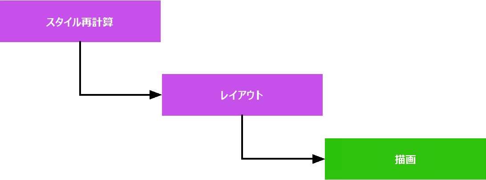

ウェブ上でのアニメーションは、{{domxref('SVGAnimationElement', 'SVG')}}、{{domxref('window.requestAnimationFrame','JavaScript')}}（{{htmlelement('canvas')}} や {{domxref('WebGL_API','WebGL')}} を含む）、CSS の {{cssxref('animation')}}、{{htmlelement('video')}}、アニメーション GIF、さらにアニメーション PNG やその他の種類の画像もあります。CSS プロパティをアニメーションさせることによるパフォーマンスコストは、プロパティによって異なり、高価な CSS プロパティをアニメーションさせると、ブラウザーが滑らかな{{glossary("FPS", "フレームレート")}}を実現するのに苦労し、{{glossary('jank', "ジャンク")}}となることがあります。

動画やアニメーション GIF などのアニメーションメディアでは、パフォーマンスの主な懸念はファイルサイズです。パフォーマンスに悪影響を与えない程度に速くファイルをダウンロードすることが最大の課題です。CSS、SVG、\<canvas>、WebGL、他にも JavaScript アニメーションなど、コードベースのアニメーションは、帯域幅のフットプリントが小さくてもパフォーマンスの問題が発生することがあります。これらのアニメーションは、CPU を消費したり、ジャンクを発生させたりすることがあります。

ユーザーは、すべてのインターフェイスとスムーズにやり取りできること、そしてすべてのユーザーインターフェイスが応答することを期待しています。アニメーションは、サイトをより速く、レスポンスよく感じさせるのに役立ちますが、アニメーションは正しく行われないと、サイトをより遅く、乱雑に感じさせることもあります。レスポンシブユーザーインターフェイスのフレームレートは 60 フレーム/秒 (fps) です。常に 60fps を維持することは不可能ですが、すべてのアニメーションで高いフレームレートと安定したフレームレートを維持することが重要です。

[CSS アニメーション](/ja/docs/Web/CSS/Guides/Animations/Using)では、いくつかの[キーフレーム](/ja/docs/Web/CSS/Reference/At-rules/@keyframes)を指定して、それぞれのキーフレームがアニメーションの特定の段階での要素の姿を定義するために、 CSS を使用しています。ブラウザーは、各キーフレームから次のキーフレームへの遷移としてアニメーションを作成します。

JavaScript を使用して要素をアニメーション化するのに比べ、CSS アニメーションは簡単に作成することができます。また、ブラウザーがフレームをレンダリングするタイミングや、必要に応じてフレームを削除することを制御できるので、パフォーマンスも向上します。

しかし、CSS のプロパティを変更した場合のパフォーマンスコストは、プロパティによって異なる場合があります。アニメーションが滑らかに現れるレートは、1 秒間に 60 フレームというのが一般的に受け入れられています。1 秒間に 60 フレームの速度では、ブラウザーはスクリプトの実行、必要に応じてスタイルとレイアウトの再計算、更新される領域の再描画に 16.7 ミリ秒の時間を使用します。遅いスクリプトや 高コストの CSS プロパティのアニメーションは、ブラウザーがスムーズなフレームレートを達成するのに苦労するため、[ジャンク](/ja/docs/Glossary/Jank)となることがあります。

## レンダリングウォーターフォール

要素が CSS プロパティをアニメーションしているときに、ブラウザーがページに変更を加えるために使用するプロセスは、以下の手順からなるウォーターフォールと記述することができます。

1. **スタイル再計算**: 要素のプロパティが変更された場合、ブラウザーは計算されたスタイルを再計算する必要があります。
2. **レイアウト**: 次に、ブラウザーは計算されたスタイル設定を用いて、要素の位置と形状を決定します。この処理は「レイアウト」と呼ばれていますが、「再フロー」とも呼ばれることがあります。
3. **描画**: 最後に、ブラウザーは要素を画面に再描画する必要があります。ページをレイヤーに分割し、それぞれを個別に描画した後、「コンポジション」と呼ばれる処理で結合することもあります（この手順では示していません）。

この一連の動作は、完了するまで画面が更新されないので、単一のフレームに収まる必要があります。

## CSS プロパティのコスト

レンダリングウォーターフォールの文脈では、一部プロパティは他のプロパティよりもコストが高くなります。

- 要素の**形状**または**位置**に影響するプロパティは、次のものを起動します。
  - スタイルの再計算
  - レイアウト
  - 再描画

  例: {{cssxref("left")}}, {{cssxref("max-width")}}, {{cssxref("border-width")}}, {{cssxref("margin-left")}}, {{cssxref("font-size")}}

- 形状や位置に影響しないが、独自のレイヤーで描画されないプロパティは、次のものを起動します。
  - スタイルの再計算
  - 再描画

  例: {{cssxref("color")}}

- **独自のレイヤー**でレンダリングされるプロパティは、更新が**合成**で処理されるため、再描画が発生することもありません。次のものを起動します。
  - スタイルの再計算

  例: {{cssxref("transform")}}, {{cssxref("opacity")}}

## 開発者ツール

ほとんどのウェブブラウザーには、ページの要素をアニメーションさせるときにブラウザーが行っている作業を把握するためのツールが記載されています。これらのツールを用いて、アプリケーションのアニメーションフレームレートを測定し、パフォーマンスのボトルネックが見つかった場合に、それを診断することができます。

- [Chrome パフォーマンスツール](https://developer.chrome.com/docs/devtools/#performance)
- [Firefox パフォーマンスツール](https://firefox-source-docs.mozilla.org/devtools-user/performance/)
