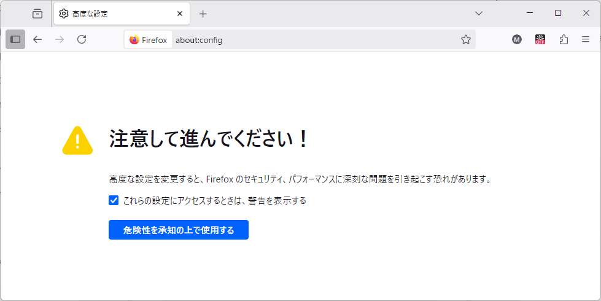

多くのアプリケーションにおいて、アニメーションは快適なユーザー体験に不可欠です。ウェブアニメーションの実装方法には、CSS {{cssxref("transition","トランジション","","nocode")}}/{{cssxref("animation","アニメーション","","nocode")}}や JavaScript ベースのアニメーション（{{domxref("Window.requestAnimationFrame","requestAnimationFrame()")}} を使用）など様々な手法があります。この記事では、CSS ベースと JavaScrip tベースのアニメーションのパフォーマンス差を分析します。

## CSS トランジションとアニメーション

CSS トランジションとアニメーションは、どちらもアニメーションを作成するために使用することができます。それぞれに独自の利用シナリオがあります。

- CSS の {{cssxref("transition","トランジション")}}は、現在のスタイルと最終的な CSS の状態の間で簡単にアニメーションを生成する方法を提供します。例えば、ボタンが休止状態からホバー状態に移行する場合などです。要素がトランジションの途中にある場合でも、新しいトランジションは最終的な CSS の状態にジャンプするのではなく、現時点のスタイルから直接始まります。詳細は [CSS トランジションの使用](/ja/docs/Web/CSS/Guides/Transitions/Using)を参照してください。
- 一方、 CSS の {{cssxref("animation","animations")}} は、開発者が 2 つの状態間ではなく、開始時のプロパティ値のセットと終了時のセットの間でアニメーションを作成することができます。 CSS アニメーションは 2 つの要素で構成されます。 CSS アニメーションを記述するスタイルと、アニメーションのスタイルの開始状態と終了状態、および中間点を示す一連のキーフレームです。詳細は [CSS アニメーションの使用](/ja/docs/Web/CSS/Guides/Animations/Using)を参照してください。

パフォーマンスの観点では、 CSS トランジションとアニメーションのいずれでアニメーションを実装しても差はありません。この記事では、両者は同じ CSS ベースの技術群に分類されます。

## requestAnimationFrame

{{domxref("Window.requestAnimationFrame", "requestAnimationFrame()")}} API は、 JavaScript でアニメーションを生成する効率的な方法を提供します。このメソッドのコールバック関数は、各フレームで次の再描画が行われる前にブラウザーによって呼び出されます。 固有の遅延引数を必要とする {{domxref("Window.setTimeout", "setTimeout()")}}/{{domxref("Window.setInterval", "setInterval()")}} と比較して、 `requestAnimationFrame()` ははるかに効率的です。開発者は、ループが呼び出されるそれぞれの回ごとに要素のスタイルを変更する（またはキャンバスの描画を更新するなど）ことでアニメーションを作成することができます。

> [!NOTE]
> CSS トランジションやアニメーション同様に、`requestAnimationFrame()`は現在のタブがバックグラウンドに追いやらると一時停止します。

詳しくは、 [animating with JavaScript from setInterval to requestAnimationFrame](https://hacks.mozilla.org/2011/08/animating-with-javascript-from-setinterval-to-requestanimationframe/) を参照してください。

## パフォーマンスの比較:<br>トランジションと requestAnimationFrame

実際のところ、ほとんどの場合、少なくとも Firefox においては、 CSS ベースのアニメーションのパフォーマンスは JavaScript ベースのアニメーションとほぼ同等です。 JavaScript ベースのアニメーションライブラリーの中には、 [GSAP](https://gsap.com/) や [Velocity.JS](https://github.com/julianshapiro/velocity/wiki) の様に、[CSS のネイティブのトランジション/アニメーション](https://css-tricks.com/myth-busting-css-animations-vs-javascript/)よりも優れたパフォーマンスを実現できると主張するものさえあります。これは、 CSS トランジション/アニメーションがそれぞれの再描画イベントが発生する前に、メインUIスレッドで要素のスタイルを再サンプリングするため、次の再描画前に起動される `requestAnimationFrame()` コールバックを介した要素スタイルの再サンプリングとほぼ同等の処理となるからです。両方のアニメーションがメイン UI スレッドで実行される場合、パフォーマンス上の差は生じません。

この節では、Firefoxを使用して通しでパフォーマンステストを追い、全体的にどのアニメーション方式が優れているかを見ていきます。

### FPS ツールを有効にする

例を読む前に、まず FPS ツールを有効にし、現在のフレームレートを確認してください。

1. URL バーに _about:config_ と入力し、`危険性を承知の上で使用する` ボタンをクリックして設定画面に入ります。
   
2. 検索バーで、環境設定の `layers.acceleration.draw-fps` を検索してください。
3. 項目をダブルクリックして値を `true` に設定します。これで Firefox ウィンドウの左上隅に 3 つの小さな紫色のボックスが表示されるようになります。最初のボックスは FPS を表します。
   

### パフォーマンス検査の実行

下記のテストでは、最初に合計 1000 個の {{htmlelement("div")}} 要素が CSS アニメーションによって移動します。

```js
const boxes = [];
const button = document.getElementById("toggle-button");
const boxContainer = document.getElementById("box-container");
const animationType = document.getElementById("type");

// ボックスの作成
for (let i = 0; i < 1000; i++) {
  const div = document.createElement("div");
  div.classList.add("css-animation");
  div.classList.add("box");
  boxContainer.appendChild(div);
  boxes.push(div.style);
}

let toggleStatus = true;
let rafId;
button.addEventListener("click", () => {
  if (toggleStatus) {
    animationType.textContent = " requestAnimationFrame";
    for (const child of boxContainer.children) {
      child.classList.remove("css-animation");
    }
    rafId = window.requestAnimationFrame(animate);
  } else {
    window.cancelAnimationFrame(rafId);
    animationType.textContent = " CSS アニメーション";
    for (const child of boxContainer.children) {
      child.classList.add("css-animation");
    }
  }
  toggleStatus = !toggleStatus;
});

const duration = 6000;
const translateX = 500;
const rotate = 360;
const scale = 1.4 - 0.6;
let start;
function animate(time) {
  if (!start) {
    start = time;
    rafId = window.requestAnimationFrame(animate);
    return;
  }

  const progress = (time - start) / duration;
  if (progress < 2) {
    let x = progress * translateX;
    let transform;
    if (progress >= 1) {
      x = (2 - progress) * translateX;
      transform = `translateX(${x}px) rotate(${
        (2 - progress) * rotate
      }deg) scale(${0.6 + (2 - progress) * scale})`;
    } else {
      transform = `translateX(${x}px) rotate(${progress * rotate}deg) scale(${
        0.6 + progress * scale
      })`;
    }

    for (const box of boxes) {
      box.transform = transform;
    }
  } else {
    start = null;
  }
  rafId = window.requestAnimationFrame(animate);
}
```

```html hidden
<div id="header">
  <button id="toggle-button">切り替え</button>
  <span id="type">CSS アニメーション</span>
</div>
<div id="box-container"></div>
```

```css hidden
#header {
  position: sticky;
  top: 0.5rem;
  margin: 0 0.5rem;
  z-index: 100;
  background-color: lightgreen;
}

#box-container {
  margin-top: 1.5rem;
  display: grid;
  grid-template-columns: repeat(40, 1fr);
  gap: 15px;
}

.box {
  width: 30px;
  height: 30px;
  background-color: red;
}

.css-animation {
  animation: animate 6s linear 0s infinite alternate;
}

@keyframes animate {
  0% {
    transform: translateX(0) rotate(0deg) scale(0.6);
  }
  100% {
    transform: translateX(500px) rotate(360deg) scale(1.4);
  }
}
```

{{ EmbedLiveSample("Running the performance test", "100%", "480") }}

アニメーションは切り替えボタンをクリックすることで `requestAnimationFrame()` に切り替えることができます。

これで両方を同時に実行し、それぞれのFPS（最初の紫色のボックス）を比較してみてください。 CSS アニメーションと `requestAnimationFrame()` のパフォーマンスはとても近いことがわかるはずです。

### メインスレッド外でのアニメーション

上記の検査結果を踏まえても、 CSS アニメーションの方が優れた選択肢だと主張します。その理由は？ 重要なのは、アニメーション対象のプロパティがリフロー/再描画を開始しない限り（詳細は [CSS トリガー](https://csstriggers.com/)を参照）、それらのサンプリング操作をメインスレッド外に移行できる点です。最も一般的なプロパティが CSS の transform です。要素が[レイヤー](https://wiki.mozilla.org/Gecko:Overview#Graphics)として昇格されている場合、 transform プロパティのアニメーションは GPU で実行するのが最適となり、これは特にモバイル端末においてパフォーマンス/効率が向上することです。詳細は [OffMainThreadCompositing](https://wiki.mozilla.org/Platform/GFX/OffMainThreadCompositing) をご覧ください。

Firefox で OMTA (Off Main Thread Animation) を有効にするには、_about:config_ にアクセスし、`layers.offmainthreadcomposition.async-animations` を検索します。その値の値を `true` に切り替えます。


OMTA を有効にしたら、上記の検査を再度実行してください。 CSS アニメーションの FPS がこれで大幅に高くなっていることが確認できるはずです。

> [!NOTE]
> Nightly/Developer Edition では、 OMTA が既定で有効になっているはずですので、テストはそれ以外の方法（最初に有効にして検査し、次に無効にして OMTA なしでの検査を行う）のが最適かもしれません。

## まとめ

ブラウザーはレンダリングフローを最適化できます。概要として、可能な限り CSS トランジション/アニメーションを使用してアニメーションを作成するよう常に試みましょう。 アニメーションが非常に複雑な場合は、代わりに JavaScript ベースのアニメーションに頼らざるを得ないかもしれません。
