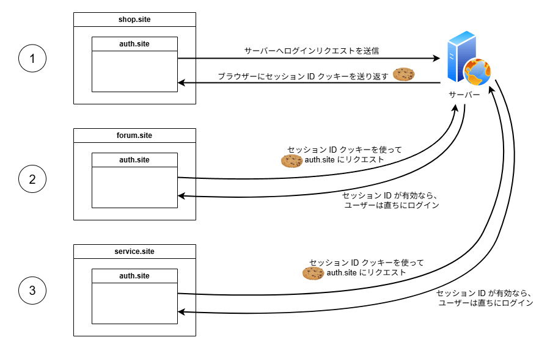

この記事では、サードパーティクッキーとは何か、それに関連する問題、およびそれらの問題を回避する方法について説明します。

## サードパーティクッキーとは

[クッキー](/ja/docs/Web/HTTP/Guides/Cookies)は、特定のドメインおよびスキーム（通常は `https`）に関連付けられており、 {{HTTPHeader("Set-Cookie")}} の `Domain` 属性が設定されている場合は、サブドメインにも関連付けられる場合があります。

- クッキーのドメインとスキームが、ユーザーが現在見ているページ（ブラウザーのアドレスバーに表示されている URL）と一致している場合、そのクッキーは、そのページと同じサイトからのものであるとみなされ、「ファーストパーティクッキー」と呼ばれます。
- ドメインとスキームが異なる場合、そのクッキーは同じサイトからのものとはみなされず、「サードパーティクッキー」と呼ばれます。

> [!NOTE]
> サードパーティクッキーは、「クロスサイトクッキー」と呼ばれることもあります。「サードパーティクッキー」は、サードパーティの企業または組織が所有していることを意味するため、より正確な名称であると言えます。ただし、関係するサイトをすべて所有しているかどうかに関係なく、その動作や潜在的な課題は同じです。例えば、あるサイトが、自社が所有する別のドメインの画像などのリソースにアクセスする場合があります。

ファーストパーティクッキーは、ユーザーが最初にページを訪問したとき、同じサイト内の別のページへの内部リンクをクリックしたとき、または同じサイトにあるリソース（例えば、埋め込み画像、ウェブフォント、JavaScript ファイルなど）をリクエストしたときに設定される場合があります。

サードパーティクッキーは、次の一般的な状況で送信されます。

- あるサイトでリンクをクリックして、別のサイトに移動する場合。
- {{htmlelement("iframe")}} に埋め込まれた画像や他の文書など、他のサイトからの要素がページに埋め込まれている場合（多くの場合、「サードパーティコンテンツ」と呼ばれます）。コンポーネントに対する元のリクエストだけでなく、さらにサードパーティのクッキーを設定するリクエストを生成する場合があります。

## サードパーティクッキーは何のために使用されているのか

他のサイトへのリンクをクリックすると設定されるサードパーティクッキーは、さまざまな目的で使用されます。例えば、パートナーサイトへのアフィリエイトリンクがあり、ユーザーがリンクをクリックするとクッキーを設定し、特定の製品が購入された場合に割引のバナーを表示したり、紹介者に手数料を支払ったりすることができます。

クッキーを設定するサードパーティのコンテンツも、さまざまな用途があります。例えば、複数の異なるが関連性のあるサイトにログインウィジェットを埋め込み、そのウィジェットがすべてのサイトでクッキーを共有してユーザーがログインしていることを確認することで、ユーザーが各サイトで再度ログインする必要がなくなります。

サードパーティクッキーのその他の用途には、以下のものがあります。

- 複数のサイト間でユーザーの環境設定やテーマ情報を共有する。
- 複数のサイトから分析データを収集する。
- 広告のインプレッション数をカウントし、ユーザーの関心を記録することで、広告技術プラットフォームがより関連性の高い広告を配信できるようにする。

上記のログインウィジェットの例を、架空の会社を例にさらに詳しく説明しましょう。この会社では、オンラインショップ (`shop.site`)、コミュニティディスカッションフォーラム (`forum.site`)、カスタマーサービスおよび返品 (`service.site`) に別個のドメインを保有しています。

3 つのサイトにはそれぞれ、サイト間のログイン状態を保持するためのログインウィジェットが `auth.site` にホストされています。ユーザーは、これらのサイトのいずれかにログインすると、セッション ID を含む `auth.site` 用のクッキーがブラウザーに作成されます。ユーザーが他のサイトのいずれかにアクセスすると、埋め込まれた `auth.site` インスタンスは、ユーザーが最初のサイトでログインしたときに設定されたセッション ID クッキーにアクセスできます。それをサーバーに送信し、まだ有効であるかどうかを確認して、そのサイトにすぐにログインすることができます。



## サードパーティクッキーの問題点

上記の用途は、一見無害に見えます。しかし、サードパーティクッキーは、ユーザーの同意なしに不正な目的で使用される可能性もあり、その場合は技術的には正当な使用と区別がつきません。

第三者へのリンクをクリックしたり、`<iframe>` に埋め込まれた第三者のコンテンツを操作したりすると（例えば、フォームへの入力やボタンのクリックなど）、クッキーが設定され、ユーザーの予想しない第三者にユーザーの情報が渡される可能性があります。この情報は、次のような目的で使用される可能性があります。

- ユーザーが特定の製品に関する情報を検索するたびに、ターゲットを絞った広告をウェブサイトに表示してユーザーを追い回す。
- ユーザーをスパムメールや迷惑電話の標的にする。
- その行動を操作して、アフィリエイトの収益を増やす特定のオプションを選んだり、統計情報を操作したりする。

このようなケースは、それぞれ単独でも問題ですが、さらに悪い状況になります。サードパーティのサーバーは、サードパーティのコンテンツが埋め込まれているさまざまなサイトに設定された複数のサードパーティのクッキーから情報を結合し、ユーザーの閲覧履歴、関心、習慣、個人情報などの詳細なプロフィールを作成することができます。これは、不気味で侵略的なユーザー体験の作成、ユーザーの詐欺、さらには個人情報の窃盗にも使用できます。

このような場合、サードパーティクッキーは「トラッキングクッキー」と呼ばれます。

> [!NOTE]
> 不正な手段で入手したユーザー情報は、他のサードパーティーにも販売されるケースが多く、問題がさらに拡大します。

欧州連合の[一般データ保護規則](https://gdpr.eu/) (GDPR) や[カリフォルニア州消費者プライバシー法](https://www.oag.ca.gov/privacy/ccpa) (CCPA) などの法律は、企業が設定するクッキーや収集する情報について透明性を確保することを法的要件とすることで、この問題に対処しています。例えば、顧客にこのようなデータの収集について同意を求める、企業が顧客について保有するデータを確認できるようにする、顧客が希望する場合にデータを削除する、などが挙げられます。しかし、顧客にとって、自分のデータがどのように使用されているのかが常に明確であるとは限りません。

## ブラウザーはサードパーティクッキーをどのように処理するのか

ブラウザーベンダーは、ユーザーが上記の動作を嫌うことを知っており、その結果、すべて、既定でサードパーティのクッキーをブロックするようになりました。また、人気のあるウェブサイトにおける長年のサードパーティのクッキーの問題を回避するために、例外や経験則をソースコードに盛り込んでいます。

- Mozilla の[トラッキング防止ポリシー](https://wiki.mozilla.org/Security/Anti_tracking_policy)（英語）により、 Firefox は既定で、既知のトラッカーからのサードパーティのクッキーをブロックするようになりました （[Firefox のトラッキング防止](/ja/docs/Web/Privacy/Guides/Firefox_tracking_protection)および[強化型トラッキング防止](https://support.mozilla.org/ja/kb/enhanced-tracking-protection-firefox-desktop)を参照してください）。強化されたトラッキング防止は、標準、厳格、カスタムに設定できます。[標準モード](https://support.mozilla.org/ja/kb/enhanced-tracking-protection-firefox-desktop#w_biao-zhun-qiang-hua-xing-toratsukingufang-zhi)では、「[包括的 Cookie 保護](https://blog.mozilla.org/en/mozilla/firefox-rolls-out-total-cookie-protection-by-default-to-all-users-worldwide/)（英語）」が有効になり、サードパーティのクッキーにサイトごとに別個のクッキージャーを割り当て、サイトをまたいだトラッキングが防止されます。[厳格モード](https://support.mozilla.org/ja/kb/enhanced-tracking-protection-firefox-desktop#w_yan-ge-qiang-hua-xing-toratsukingufang-zhi)では、Firefox はすべてのサードパーティのクッキーをブロックします。
- Apple も同様の[トラッキング防止ポリシー](https://webkit.org/tracking-prevention-policy/)（英語）を採用しています。それに従うことで、既定で有効になっている同様のサードパーティクッキー保護が設定されます。詳細については、[インテリジェントトラッキング防止](https://webkit.org/tracking-prevention/#intelligent-tracking-prevention-itp) (ITP) （英語）を参照してください。
- この記事の執筆時点では、Google Chrome は既定でシークレットモードでのみサードパーティのクッキーをブロックしていますが、ユーザーは `chrome://settings` から、必要に応じてサードパーティのクッキーを常にブロックするように設定することができます。 Google は、その影響をテストするために、 Chrome ユーザーの一部でサードパーティのクッキーを無効にし始めました。同時に、サードパーティのクッキーを必要としない重要なユースケースを可能にする技術の開発も進めています。詳細については、[サードパーティクッキーの置き換え](#サードパーティクッキーの置き換え)を参照してください。
- Edge は、訪問したことのないサイトからのトラッカーをブロックし、既定では既知の有害なトラッカーをブロックします。この記事の執筆時点では、Microsoft は Edge でサードパーティのクッキーを既定でブロックする機能の実装も検討しています。詳細については、「[追跡防止](https://learn.microsoft.com/ja/microsoft-edge/web-platform/tracking-prevention)」を参照してください。
- [Brave ブラウザー](https://brave.com/)は、トラッキングクッキーを既定でブロックします。

Firefox では、ブラウザーの設定により、サードパーティのクッキーを個別に許可することができます。しかし、 Safari では制御が制限されており、サイト間のトラッキング防止をオフにすることはできますが、フレームごとにサードパーティのクッキーへのアクセスを許可するには、[ストレージアクセス API](/ja/docs/Web/API/Storage_Access_API) を使用してコードレベルで設定する必要があります。

> [!NOTE]
> サードパーティクッキー（または単にトラッキングクッキー）も、ブラウザーの拡張機能によってブロックされる場合があります。

クッキーをブロックすると、一部のサードパーティーのコンポーネント（ソーシャルメディアウィジェットなど）が意図通りに機能しなくなる場合があります。ブラウザーがサードパーティのクッキーにさらなる制限を課すようになったため、開発者はクッキーへの依存度を低減する方法を検討し始める必要があります。[サードパーティクッキーの置き換え](#サードパーティクッキーの置き換え)を参照してください。

## サードパーティクッキーの使用

### サードパーティクッキーを `SameSite` で有効化

[`SameSite`](/ja/docs/Web/HTTP/Reference/Headers/Set-Cookie#samesitesamesite-value) 属性により、サーバーはサードパーティのクッキーを送信するかどうか、および送信するタイミングを指定できます。 `Set-Cookie` ヘッダーで `SameSite` を指定しない場合、既定値である `Lax` が使用されます。これにより、ユーザーが別のサイトからクッキーの元のサイトに移動した場合を除き、サードパーティのクッキーは送信されません。これは、例えば、ユーザーが別のサイトから自分のサイトに移動したらすぐにクッキーを送信して、ユーザーがサイトにアクセスした直後に使い勝手を個人設定したい場合に便利です。

しかし、上記のログインの例のように、複数のサイトにまたがるコンテンツを `<iframe>` で埋め込み、機能の実現をサードパーティのクッキーに依存している場合は、この方法では良くありません。このような場合、ブラウザーがそれらのクッキーを渡すように、 `SameSite=None` を明示的に設定する必要があります。

```http
Set-Cookie: widget_session=7yjgj57e4n3d; SameSite=None; Secure; HttpOnly
```

`SameSite=None` が設定されている場合は、 `Secure` 属性も設定する必要があります。 `SameSite=None` は保護されたコンテキストを必要とします。上記の例では、 JavaScript がクッキーにアクセスできないように （{{domxref("Document.cookie")}} など）、 `HttpOnly` 属性も設定しています。機密情報を保持するクッキーには、常に `HttpOnly` 属性を設定してください。 JavaScript で利用可能にしてしまうと、非常に安全性が低下します。この予防措置により、クロスサイトスクリプティング ([XSS](/ja/docs/Web/Security/Attacks#cross-site_scripting_xss)) 攻撃を緩和することができます。

> [!NOTE]
> 機密情報に使用されるクッキーも、[有効期間](/ja/docs/Web/HTTP/Guides/Cookies#削除_cookie_の持続時間の定義)を短く指定する必要があります。

### サードパーティクッキーからの移行

サードパーティクッキーがブロックされているブラウザーにおける、サイトの故障を最小限に抑えるために、役立つ戦略は複数あります。

1. サードパーティのクッキーの使用状況を監査します。クッキーは、サイトをまたぐコンテキストで使用するには、 `SameSite=None` 属性を設定する必要があります。したがって、コード内で `SameSite=None` を検索するか、保存されている `SameSite=None` クッキーを、ブラウザーの開発者ツール（例えば、[Firefox のストレージインスペクター](https://firefox-source-docs.mozilla.org/devtools-user/storage_inspector/)）で確認することで、サードパーティのクッキーを特定することができます。 Chrome の[問題](https://developer.chrome.com/docs/devtools/issues/)パネルでも、[サードパーティのクッキーのブロックに関する問題](https://privacysandbox.google.com/cookies/prepare/audit-cookies#chrome-dev-tools)と、影響を受けるクッキーのリストが報告されます。
2. サードパーティのクッキーをブロックして機能を検査し、何が機能しなくなったかを確認してください。一部のクッキーはもはや必要がなくなったことがわかるかもしれません。
3. 少なくとも最初は、サードパーティのクッキーデータが利用できない場合に、コードを完全に機能しなくするのではなく、個人設定の程度を低くして使い勝手を低下させるような、より回復力のあるコードを作成することができます。[グレースフルディグラデーション](/ja/docs/Glossary/Graceful_degradation)の原則に従いましょう。
4. ユーザーアンケートやクイズなどの別の方法でデータを収集するか、すでに保有しているデータ（例えば、製品の注文履歴）を見て傾向を推測します。
5. データを維持するには、[ウェブストレージ](/ja/docs/Web/API/Web_Storage_API)などの代替のクライアント側ストレージ機構を使用するか、サーバー側ソリューションを検討してください。
6. サードパーティのクッキーが、少数の関連した既知のウェブサイトでのみ使用されている場合は、[ストレージアクセス API](/ja/docs/Web/API/Storage_Access_API) や[関連ウェブサイトセット](/ja/docs/Web/API/Storage_Access_API/Related_website_sets)を使用して、特定のサイトのみにサイトをまたがるクッキーへのアクセスを許可することができます。ストレージアクセスでは、フレームごとに、サイトによるサードパーティのクッキーの使用を許可するかどうかをユーザーに確認するメッセージが表示されます。
   - すでに Firefox または Safari 用のストレージアクセス API を使用してソリューションを実装している場合は、 Chrome のバージョン 119 で完全対応するように更新されたため、実装を調べる良い機会です。
   - 関連ウェブサイトセットは、ストレージアクセス API の進歩的な拡張機能と考えることができます。 API はまったく同じように使用できますが、セット内のサイトは、サードパーティのクッキーにアクセスする権限をユーザーに要求しません。
7. サードパーティクッキーが、それらが生成された最上位サイトと 1 対 1 で使用されている場合は、[独立したパーティション状態を持つクッキー](/ja/docs/Web/Privacy/Guides/Privacy_sandbox/Partitioned_cookies)（CHIPS、別名パーティションクッキー）を使用して、最上位サイトごとに別個のクッキージャーでパーティション化されたストレージにクッキーを保存することができます。これには、既存のサイトをまたがるクッキーに `partitioned` 属性を追加する必要があるだけです。その後、これらのクッキーは制限なく使用できますが、他のサイトと共有することはできません。CHIPS は現在 Chromium でのみ使用できることに注意してください。

## サードパーティクッキーの置き換え

ユーザーのプライバシーを尊重し、追跡を最小限に抑えながら、関連するユースケースの実装を続けるために、サードパーティクッキーの使用を停止したい開発者は、いくつかの機能を利用できます。これらの機能の一部はまだ実験段階ですが、将来に備えて準備を始める際には検討する価値があります。

Google の[プライバシーサンドボックス](/ja/docs/Web/Privacy/Guides/Privacy_sandbox)プロジェクトで利用できるさまざまな機能を試して、自分の用途に適しているかどうかを確認することができます（これらは現在実験的な機能であり、Chromium でのみ利用可能です）。

- [連合資格情報](/ja/docs/Web/API/FedCM_API) (FedCM) API: ユーザーが複数のサイトおよびサービスにログインできる連合 ID サービスを使用可能にします。
- [プライバシー状態トークン](https://privacysandbox.google.com/protections/private-state-tokens): サイト間で、個人を特定しない限定的な情報を交換することにより、不正行為やスパムを防止します。
- [トピック API](/ja/docs/Web/API/Topics_API): 関心に基づく広告およびコンテンツの個人設定ができるようにします。
- [保護オーディエンス API](https://privacysandbox.google.com/private-advertising/protected-audience): ユーザーが別のアプリやサイトにアクセスしているときに、そのアプリやサイトからのデータを使用して広告の選択に役立てます。
- [帰属報告 API](https://privacysandbox.google.com/private-advertising/attribution-reporting): 広告のインプレッションおよびコンバージョンの測定を可能にします。

## 関連情報

- [HTTP クッキー](/ja/docs/Web/HTTP/Guides/Cookies)
- [ウェブのプライバシー](/ja/docs/Web/Privacy)
