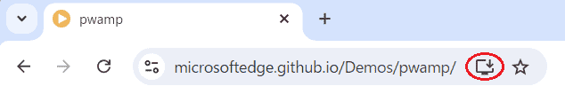
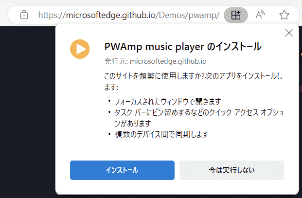
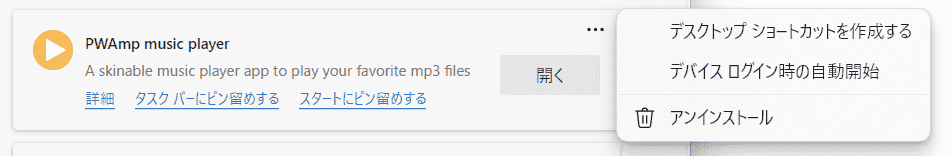

{{PWASidebar}}

このガイドでは、ユーザーが端末に PWA をインストールしたりアンインストールしたりする方法について説明します。ウェブアプリを PWA としてインストール可能にすることについて学びたい場合は、代わりに [PWA をインストール可能にする](/ja/docs/Web/Progressive_web_apps/Guides/Making_PWAs_installable)を参照してください。

## ウェブアプリのインストールの歴史

ブラウザーは常に、「ブックマーク」として知られるウェブサイトへのショートカットを保存することができます。これはウェブサイトへの単なるリンクです。

一部のオペレーティングシステム (OS) では、ブックマーク機能が強化され、ホーム画面やタスクバーなどの一般的な場所にブックマークを保存し、OS の既定ではブラウザーにサイトを起動するアイコンが表示されるようになっています。多くのウェブサイトでは、これもサイトへのリンクにすぎません。ウェブサイトが [Progressive Web Applications (PWA)](/ja/docs/Web/Progressive_web_apps) の場合、ホーム画面に保存すると PWA がユーザーの端末にインストールされ、ほとんどの端末でネイティブアプリケーションのように OS に完全に統合されます。PWA がインストールできるように、アンインストールすることもできます。

まず最初に、ウェブサイトへのリンクの保存という前段階に応じた方法を説明します。

### ウェブサイトをブックマークに保存

すべてのブラウザーには、お気に入りに追加するブックマーク機能があります。ブックマーク（お気に入り）とは、ウェブページのクリック可能なショートカットのことです。ブックマークは、ユーザーが URL を入力したり、コンテンツを検索したりすることなく、ウェブサイトにすばやくアクセスすることを可能にします。ブックマークは、特に長い URL や、サイトのホームページではない頻繁に使用するコンテンツにアクセスする場合に有益です。

すべてのブラウザーで、ユーザーはブックマークを表示し、管理することができます。お気に入りを変更したり削除したりすることもできます。既定では、ブックマークの表示には、ブックマークされたページの {{HTMLElement("title")}} 要素のテキストコンテンツと、サイトの[ファビコン](/ja/docs/Glossary/Favicon)からなるアイコンが含まれます。

ブラウザーでは、ブックマークの保存、編集、移動、削除などを管理することができます。ブックマーク管理の UI はブラウザーによって異なります。

### ホーム画面に追加

2007 年の iPhone を皮切りに、スマートフォンには「ホーム画面に保存」機能が追加されました。通常の（PWA でない）ウェブサイトの場合、この機能はブックマークに似ていますが、ブラウザーの機能であるブックマークメニューにファビコンとページのタイトルを追加する代わりに、この方法でお気に入り登録すると、OS の[ホーム画面にアイコンが追加](/ja/docs/Learn_web_development/Core/Structuring_content/Webpage_metadata#サイトに自分の好きなアイコンを追加)されます。

PWA 以外のサイトをホーム画面に追加しても、ウェブサイトは端末にインストールされません。開発者が定義したアイコンがホーム画面に追加されますが、クリックすると既定のブラウザーでブックマークされたリンクが開きます。

ホーム画面に追加されたサイトがPWAの場合、PWAが端末にインストールされます。

ホーム画面からアイコンを削除すると、ブックマークが削除されます。削除時の確認で、アイコンの削除がブックマークの削除なのか、アプリケーション全体の削除なのかの情報が提供されます。

## PWA のインストールとアンインストール

PWA のインストールは、ウェブアプリケーションの機能によっては数回のクリックで済みますが、PWA をインストールした結果は、インターネット上のページへのリンクを作成するだけではありません。PWA をインストールすることで、ユーザーの端末にウェブアプリケーションがより深く統合されます。

PWA、端末、オペレーティングシステムやブラウザーの機能によっては、PWA をインストールすることで、アプリに自分自身のスタンドアロンウィンドウを与えたり、ファイルハンドラーとして登録するなど、ネイティブのような機能が実現できる場合があります。また、PWA をアンインストールするということは、PWA のアイコンを除去されるだけでなく、複数のクリックを要求されるということでもあります。

### PWA のインストール

ウェブから PWA をインストールするためのUIは、ブラウザーやプラットフォームによって異なります。

PWA をインストールするユーザーインターフェイスは、端末と OS の組み合わせによって異なります。iOS の Safari では、「ホーム画面に追加」のユーザーインターフェイスで PWA をインストールします。Android の Chrome を含む他のブラウザーでは、ブラウザーの設定メニューにアプリのインストールコマンドが記載されています。デスクトップの Chrome と Edge では、ユーザーがページに移動すると、そのページが PWA であり、その PWA が今のところそのブラウザーによってインストールされていない場合、URL バーにインストールアイコンが表示されます。

ユーザーがアイコンを選択すると、ブラウザーに PWA をインストールするかどうか確認するプロンプトが表示され、承認すると PWA がインストールされます。

インストールされると、PWA は OS にインストールされている他のアプリケーションと同じように動作します。例えば macOS の場合、アイコンはドックに現れ、他のアプリケーションと同じアイコンオプションができます。

ほとんどのデスクトップブラウザーでは、インストールのプロンプトは URL バーに表示されます。モバイルブラウザーの場合、インストールのプロンプトは通常、ブラウザーオプションのメニューにあります。ブラウザーや OS に関係なく、インストールの確認が必要です。

一度インストールすると、PWA は他にもインストールされているアプリケーションと同じように動作します。ユーザーがオフラインの状態でも、アプリケーションアイコンをクリックすると PWA が開きます。

インストールは現行のデスクトップおよびモバイル端末すべてで対応しています。PWA を OS 上のブラウザーでインストールできるかどうかは、ブラウザーと演算子の組み合わせによって異なります。ほとんどのブラウザーは、ChromeOS、MacOS、Windows、Android、Linux など、すべてのオペレーティングシステムで PWA のインストールに対応しています。

Firefox では [PWA 拡張機能](https://addons.mozilla.org/en-US/firefox/addon/pwas-for-firefox/)が必要です。

macOS 14 (Sonoma) より前の macOS では、Safari **以外の**ブラウザーから PWA をインストールすることができました。16.4 以前のバージョンの iOS では逆に、Safari **のみで** PWA をインストールすることができました。macOS 14.0 以降および iOS/iPadOS 16.4 以降では、対応しているどのブラウザーからでも PWA をインストールできます。

インストールされた PWA を起動すると、自分自身でスタンドアロンウィンドウに表示することができますが（完全なブラウザー UI なしで）、アドレスバーや戻るボタンなどの通常のブラウザー UI 要素が表示されていなくても、効果的にブラウザーウィンドウで実行します。アプリケーションは OS が他のアプリケーションを保存する場所、ブラウザー固有のフォルダー内に得られます。

ブラウザーによってインストールされた PWA は、そのブラウザー固有のままです。これは、PWA をインストールするために使用したブラウザーが、その PWA を実行するために使用するブラウザーであるということを意味しています。また、同じ PWA を別のブラウザーからインストールしても、2 つのアプリは 2 つの異なるインスタンスとして動作し、データは共有されないという意味もあります。

PWA をインストールするために用いたブラウザーは PWA がインストールされたことを認識しますが、他のブラウザーはインストール状態にアクセスすることはできません。例えば、MS Edge を使用して PWA をインストールした場合、サイトにアクセスすると Edge では PWA を開くためのプロンプトが表示されますが、Chrome ではアプリケーションをインストールするためのプロンプトが表示され続けます。Chrome からも PWA をインストールすると、PWA のコピーが 2 つ存在することになります。PWA の複数のインスタンスが開いている場合、異なるブラウザーからインストールされたインスタンス間でデータは共有されません。

ウェブアプリのアイコンをタップすると、PWA をインストールしたブラウザー環境で開きますが、一般的にブラウザー UI は表示されませんが、これは開発者が[ウェブアプリマニフェスト](/ja/docs/Web/Progressive_web_apps/Manifest)を構成可能な方法によります。同様に、PWA をアンインストールするために用いられるメソッドは、PWA をインストールするために用いられたブラウザーに依存します。

### アンインストール

ほとんどのモバイル OS では、PWA のアンインストールは他のアプリケーションをアンインストールする方法と同じです。一部のモバイル OS では、アプリストアからダウンロードしたアプリケーションが管理されているのと同じコントロールパネルに PWA が現れ、そこでアンインストールできます。

iOS の場合、Safari からインストールされた PWA は「アプリライブラリー」画面に掲載され検索できますが、「設定」には他にもインストールされているアプリケーションと共に掲載されません。iOS ではアイコンをロングタップするとブックマークの削除UIが表示され、ホーム画面からアイコンを除去されると PWA が削除されます。

一部のデスクトップOSでは、PWA のアンインストールは開いている PWA で直接行うことができます。アンインストールするには、PWA を開きます。開いたアプリの右上にアイコンがあり、それを展開させて他のツールを見る必要があります。PWA をインストールするために使用したブラウザーによって、PWA をアンインストールするためのリンク、またはアンインストールリンクのあるブラウザー設定ページを開くための設定リンクがあります。ある場合はドロップダウンメニューのアンインストールオプションをクリックするか、ブラウザータブのアプリ設定に移動してアンインストールをクリックします。

Edge で開いたドロップダウンメニューからアプリ設定を選択し、MS Edge ブラウザーの `edge://apps` タブを開きます。そこにはインストールされているアプリケーションの一覧が表示され、そこに「🗑️ アンインストール」を含むオプションがあります。アンインストールを確認します。これで完了です。

Edge では、ブラウザーで[`edge://apps`](https://blogs.windows.com/msedgedev/2022/05/18/find-and-manage-your-installed-apps-and-sites/) にアクセスすると、インストールされている PWA が一覧表示され、管理することができます。Chrome の場合、ブラウザーで `chrome://apps` にアクセスすると、Google アプリとインストールされている PWA の一覧が表示され、管理することができます。

## 関連情報

- [Using PWAs in Chrome: computer and Android](https://support.google.com/chrome/answer/9658361)
- [Install, manage, or uninstall apps in Microsoft Edge](https://support.microsoft.com/en-us/topic/install-manage-or-uninstall-apps-in-microsoft-edge-0c156575-a94a-45e4-a54f-3a84846f6113)
