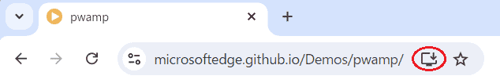

{{PWASidebar}}

PWA を定義する側面の1つは、端末へのインストールをブラウザーから促進できることです。一度インストールされると、 PWA はプラットフォーム固有のアプリとしてユーザーに現れ、他のアプリのように OS から直接起動できる端末の永続的な機能となります。

これをまとめると次のようになります。

- 対応しているブラウザーは、 PWA を端末にインストールするようユーザーに促します。
- PWA はプラットフォーム固有のアプリのようにインストールでき、インストールプロセスをカスタマイズできます。
- インストールされると、 PWA は端末上でプラットフォーム固有のアプリと横に並んだアプリアイコンができます。
- インストールされると、 PWA はブラウザー上のウェブサイトではなく、スタンドアロンアプリとして起動できます。

このガイドでは、これらの各機能について解説します。最初に、ウェブアプリケーションがインストールを促進されるために満たさなければならない要件について説明します。

## インストール可能性

ウェブアプリケーションが対応するブラウザーによってインストールを促進されるようにするには、いくつかの技術的要件を満たす必要があります。これらはウェブアプリケーションが PWA であるための最小要件と考えることができます。

## ウェブアプリマニフェスト

ウェブアプリマニフェストとは、 PWA が端末上でどのように現れ、どのように動作するかをブラウザーに指示する JSON ファイルのことです。ウェブアプリケーションが PWA であるためにはインストール可能である必要があり、インストール可能であるためにはマニフェストを記述する必要があります。

マニフェストはアプリの HTML に {{HTMLElement("link")}} 要素を使用して記述します。

```html
<!doctype html>
<html lang="en">
  <head>
    <link rel="manifest" href="manifest.json" />
    <!-- ... -->
  </head>
  <body></body>
</html>
```

PWA に複数のページがある場合、すべてのページでこの方法によってマニフェストを参照する必要があります。

マニフェストにはメンバーの集合が入った単一の JSON オブジェクトを格納し、各メンバーは PWA の外観や動作の何らかの側面を定義します。次のものは、 `"name"` と `"icons"` の 2 つのメンバーだけを格納した、かなり最小限のマニフェストです。

```json
{
  "name": "My PWA",
  "icons": [
    {
      "src": "icons/512.png",
      "type": "image/png",
      "sizes": "512x512"
    }
  ]
}
```

#### 必須のマニフェストメンバー

Chromium ベースのブラウザー（Google Chrome、Samsung Internet、Microsoft Edge など）では、マニフェストに以下のメンバーが含まれていることが要求されます。

- [`name`](/ja/docs/Web/Manifest/name)
- [`icons`](/ja/docs/Web/Manifest/icons)
- [`start_url`](/ja/docs/Web/Manifest/start_url)
- [`display`](/ja/docs/Web/Manifest/display) や [`display_override`](/ja/docs/Web/Manifest/display_override)

それぞれのメンバーの完全な説明は、[ウェブアプリマニフェストのリファレンスドキュメント](/ja/docs/Web/Manifest)を参照してください。

### 安全なコンテキスト

ウェブアプリケーションをインストールできるようにするには、[安全なコンテキスト](/ja/docs/Web/Progressive_web_apps)で提供する必要があります。これは通常、 HTTPS で提供されなければならないことを意味しています。 localhost や `127.0.0.1`、`file://` などのローカルリソースも安全とみなされます。

### サービスワーカー

ウェブアプリケーションをインストール可能にするには、 [`fetch` イベントハンドラー](/ja/docs/Web/API/ServiceWorkerGlobalScope/fetch_event)を持つ[サービスワーカー](/ja/docs/Web/API/Service_Worker_API)を記述し、基本的なオフライン体験を提供する必要があります。

## アプリストアからのインストール

ユーザーは、 Google Play ストアや Apple App ストアのように、自分のプラットフォームのアプリストアでアプリを探すことを期待しています。

アプリがインストール可能な前提条件を満たしていれば、アプリをパッケージ化し、アプリストアを通じて配布することができます。このプロセスは、各アプリストアに毎に固有です。

- [PWA を Google Play ストアで公開する方法](https://chromeos.dev/en/publish/pwa-in-play)
- [PWA を Microsoft ストアで公開する方法](https://learn.microsoft.com/en-us/microsoft-edge/progressive-web-apps-chromium/how-to/microsoft-store)
- [PWA を Meta Quest ストアで公開する方法](https://developer.oculus.com/documentation/web/pwa-submit-app/)

[PWABuilder](https://docs.pwabuilder.com/#/builder/quick-start) は、様々なアプリストア向けに PWA をパッケージ化し、公開するプロセスを簡素化するツールです。 Google Play ストア、 Microsoft ストア、 Meta Quest ストア、 iOS App Store に対応しています。

アプリをアプリストアに追加した場合、ユーザーはプラットフォーム固有のアプリと同じように、そこからインストールすることができます。

## ウェブからのインストール

対応するブラウザーは、ウェブアプリケーションが記述されているインストール可能基準を満たしていると判断すると、ユーザーにアプリをインストールするよう促します。ユーザーにはアプリをインストールする機会が提供されます。この意味は、 PWA をウェブサイトとして配布してウェブ検索で発見できるようにし、またアプリストアでも配布してユーザーがそこで見つけられるようにできる、ということです。

この例は、 PWA がどちらの利点も提供できる方法の好例です。これは PWA でプログレッシブエンハンスメントがどのように動作するのかの良い例でもあります。ユーザーがウェブ上で PWA をインストールできないブラウザーで PWA に出会った場合、通常のウェブサイトと同じように使用することができます。

ウェブから PWA をインストールするためのUIは、ブラウザーやプラットフォームによって異なります。例えば、ブラウザーはユーザーがページに移動したときに URL バーに「インストール」アイコンを表示することができます。



ユーザーがアイコンを選択すると、ブラウザーに PWA をインストールするかどうか依頼するプロンプトが表示され、受け入れると PWA がインストールされます。

プロンプトには、 [`name`](/ja/docs/Web/Manifest/name) と [`icons`](/ja/docs/Web/Manifest/icons) マニフェストメンバーから導かれたPWAの名前とアイコンが表示されます。

### ブラウザーの対応

ウェブからの PWA インストール促進への対応は、ブラウザーやプラットフォームによって異なります。

デスクトップの場合は次の通りです。

- Firefox と Safari は、デスクトップ OS への PWA のインストールに対応していません。下記[アプリとしてのサイトのインストール](#installing_sites_as_apps)を参照してください。
- Chrome と Edge は、Linux、Windows、macOS、Chromebook への PWA インストールに対応しています。

モバイルの場合は次の通りです。

- Android では、Firefox、Chrome、Edge、Opera、Samsung Internet Browser のすべてが PWA のインストールに対応しています。
- iOS 16.3 以前では、 PWA は Safari でしかインストールできません。
- iOS 16.4 以降では、Safari、Chrome、Edge、Firefox、Orion の共有メニューから PWA をインストールできます。

### サイトをアプリとしてインストール

デスクトップとモバイルの Safari、およびデスクトップの Edge も、任意のウェブサイトをアプリとしてインストールすることに対応しています。ただし、これは PWA 固有の仕様ではなく、サイトがこのガイドで記述されているインストール可能な基準を満たしている必要はなく、ブラウザーが積極的にサイトのインストールを促進するわけではないからです。

### インストールプロンプトを起動

PWA は、既定ではブラウザーが提供するUIに頼っていますが、ユーザーがインストールプロンプトを開くためのページ内 UI を自分自身で提供することができます。これにより、 PWA はユーザーが PWA をインストールするためのコンテキストと理由を提供することができ、インストールユーザーフローを発見しやすくすることができます。

このテクニックは、 [`beforeinstallprompt`](/ja/docs/Web/API/Window/beforeinstallprompt_event) イベントに頼っています。このイベントは、ブラウザーが PWA がインストール可能であると判断するとすぐに、グローバルな [`Window`](/ja/docs/Web/API/Window) オブジェクト上で発行されます。このイベントにはインストールプロンプトを表示させる [`prompt()`](/ja/docs/Web/API/BeforeInstallPromptEvent/prompt) メソッドがあります。つまり PWA は、

- 自分自身で「インストール」ボタンを追加することができます。
- `beforeinstallprompt` イベントを待ち受けすることができます。
- イベtのの既定の動作を [`preventDefault()`](/ja/docs/Web/API/Event/preventDefault) を呼び出すことでキャンセルします。
- 自分自身で「インストール」ボタンのイベントハンドラーで、 [`prompt()`](/ja/docs/Web/API/BeforeInstallPromptEvent/prompt) を呼び出します。

これは iOS では対応していません。

### インストールプロンプトのカスタマイズ

既定では、インストールプロンプトには PWA の名前とアイコンが表示されます。マニフェストメンバーに [`description`](/ja/docs/Web/Manifest/description) と [`screenshots`](/ja/docs/Web/Manifest/screenshots) の値が指定された場合、 Android のみこれらの値がインストールプロンプトに表示され、ユーザーに PWA をインストールする余分なコンテキストと動機を与えます。

下記のスクリーンショットは、 Android で動作する Google Chrome で [PWAmp demo](https://github.com/MicrosoftEdge/Demos/tree/main/pwamp) のインストールプロンプトがどのように表示されるかを示しています。


## アプリの起動

PWA がインストールされると、そのアイコンはユーザーがインストールしている他のアプリと一緒に端末に表示され、アイコンをクリックするとアプリが起動します。

[`display`](/ja/docs/Web/Manifest/display) マニフェストメンバーを使用して、表示モード、すなわち起動したときに PWA がどのように現れるかを制御することができます。具体的には次のようになります。

- `"standalone"` は、 PWA がブラウザーの UI 要素なしで、プラットフォーム固有のアプリケーションのように見えるようにすることを示します。
- `"browser"` は、 PWA を通常のウェブサイトと同じように、新しいブラウザーのタブやウィンドウとして開くためのものであることを示します。

ブラウザーが指定された表示モードに対応していない場合、 `display` はあらかじめ定義された順序に従って対応している表示モードで代用します。 [`display_override`](/ja/docs/Web/Manifest/display_override) を使用すると、代替シーケンスを再定義することができます。
