{{PWASidebar}}

通常、ウェブサイトは信頼性の高いネットワーク接続と、ユーザーがブラウザーでページを開いていることの両方に強く依存しています。ネットワーク接続がなければ、ほとんどのウェブサイトは利用できませんし、ユーザーがブラウザータブでサイトを開いていない場合、ほとんどのウェブサイトは何もできません。

しかし、以下のシナリオを考えてみてください。

- 音楽アプリでは、ユーザーはオンライン中に音楽をストリーミングすることができますが、バックグラウンドで曲をダウンロードし、ユーザーがオフラインの間も再生し続けることができます。
- ユーザーが長い電子メールを作成し、「送信」を押した後、ネットワーク接続が切断されたとします。ネットワークが再び利用できるようになると、端末がバックグラウンドでメールを送信します。
- ユーザーのチャットアプリが連絡先の1人からメッセージを受信したとき、アプリが開いていないにもかかわらず、アプリアイコンにバッジが表示され、新しいメッセージがあることをユーザーに知らせます。

これらはユーザーがインストール型アプリに期待する機能です。このガイドでは、PWA を実現する設定するにはどのような技術が必要かを紹介します。

- 端末のネットワーク接続が断続的な場合でも、よい使い勝手で利用できる
- アプリが実行されていないときに状態を更新する
- アプリが実行されていない間に起こった重要なイベントをユーザーに通知する

このガイドで紹介する技術は以下の通りです。

- [サービスワーカー API](/ja/docs/Web/API/Service_Worker_API)
- [バックグラウンド同期 API](/ja/docs/Web/API/Background_Synchronization_API)
- [バックグラウンドフェッチ API](/ja/docs/Web/API/Background_Fetch_API)
- [定期的バックグラウンド同期 API](/ja/docs/Web/API/Web_Periodic_Background_Synchronization_API)
- [プッシュ API](/ja/docs/Web/API/Push_API)
- [通知 API](/ja/docs/Web/API/Notifications_API)

## ウェブサイトとワーカー

このガイドで説明するすべての技術の基礎となるのが _service worker_ です。この章ではワーカーの背景と、ワーカーがウェブアプリのアーキテクチャをどのように変えるのかについて少し説明します。

通常、ウェブサイト全体は単一のスレッドで実行します。これにはウェブサイト自身の JavaScript や、ウェブサイトの UI をレンダリングするためのすべての作業が含まれます。この結果、JavaScript が長時間実行する処理を実行すると、ウェブサイトのメイン UI がブロックされ、ウェブサイトがユーザーに対して無反応に見えます。

[サービスワーカー](/ja/docs/Web/API/Service_Worker_API)は、PWA を実装するために用いる特定の種類の[ウェブワーカー](/ja/docs/Web/API/Web_Workers_API)です。すべてのウェブワーカーのように、サービスワーカーはメイン JavaScript コードとは別のスレッドで実行します。メインコードでワーカーを作成し、ワーカーのスクリプトに URL を渡します。ワーカーとメインコードは直接お互いの状態にアクセスすることはできませんが、メッセージを送り合うことで通信することができます。ワーカーは別のスレッドで実行されるため、アプリの UI を実装するアプリのメイン JavaScript コードはユーザーに対して応答し続けることができます。

そのため、PWA は常に高水準のアーキテクチャを 2 つに分けて持っています。

- メインアプリ。HTML、CSS と、アプリの UI を実装する JavaScript の一部（例えばユーザーイベントの処理）。
- オフラインとバックグラウンドのタスクを処理するサービスワーカー。

このガイドでは、コードサンプルを表示させるとき、そのコードがアプリのどの部分に属するかを `// main.js` や `// service-worker.js` のようなコメントで示します。

## オフライン操作

オフライン操作は、端末にネットワーク接続がない場合でも PWA が良い使い勝手を提供することができます。これはアプリにサービスワーカーを追加することで可能になります。

サービスワーカーはアプリの一部またはすべてのページを制御します。サービスワーカーがインストールされると、制御するページのリソース（例えばページ、スタイル設定、スクリプト、画像など）をサーバーから取得し、ローカルキャッシュに追加することができます。リソースをキャッシュに追加するには {{domxref("Cache")}} インターフェイスを使用します。`Cache` インスタンスには、サービスワーカーのグローバルスコープの {{domxref("WorkerGlobalScope.caches")}} プロパティからアクセスします。

そして、アプリがリソースをリクエストするたびに（例えば、ユーザーがアプリを開いたり、内部リンクをクリックしたりしたために）、ブラウザーはサービスワーカーのグローバルスコープで{{domxref("ServiceWorkerGlobalScope.fetch_event", " fetch")}}というイベントを呼び出します。このイベントを待ち受けすることで、サービスワーカーはリクエストを介入することができます。

`fetch` イベントのイベントハンドラーには、次の機能を持つ {{domxref("FetchEvent")}} オブジェクトが渡されます。

- リクエストへの {{domxref("Request")}} インスタンスとしてのアクセスを提供します。
- リクエストに対するレスポンスを送信する {{domxref("FetchEvent.respondWith", "respondWith()")}} メソッドを提供します。

サービスワーカーがリクエストを処理する方法の一つは、「キャッシュ優先」戦略です。この戦略では、

1. リクエストされたリソースがキャッシュに存在する場合、キャッシュからリソースを取得し、アプリにリソースを返します。
2. リクエストされたリソースがキャッシュに存在しない場合は、ネットワークからリソースを取得しようとします。
   1. リソースが取得できた場合は、次回のためにリソースをキャッシュに追加し、アプリにリソースを返します。
   2. リソースを取得できなかった場合は、既定の代替リソースを返します。

以下のコードサンプルは、この実装を示しています。

```js
// service-worker.js

const putInCache = async (request, response) => {
  const cache = await caches.open("v1");
  await cache.put(request, response);
};

const cacheFirst = async ({ request, fallbackUrl }) => {
  // 最初にキャッシュからリソースを取得しようとする。
  const responseFromCache = await caches.match(request);
  if (responseFromCache) {
    return responseFromCache;
  }

  // レスポンスがキャッシュ内で得られなかった場合は、
  // ネットワークからリソースを取得しようとする。
  try {
    const responseFromNetwork = await fetch(request);
    // ネットワークリクエストが成功した場合は、レスポンスを複製する
    // - 次回のためにコピーをキャッシュに入れる
    // - オリジナルをアプリに返す
    // レスポンスは一度しか消費できないため、複製が必要。
    putInCache(request, responseFromNetwork.clone());
    return responseFromNetwork;
  } catch (error) {
    // ネットワークリクエストが失敗した場合は、
    // キャッシュから代替レスポンスを取得する。
    const fallbackResponse = await caches.match(fallbackUrl);
    if (fallbackResponse) {
      return fallbackResponse;
    }
    // 代替レスポンスすら利用できない場合はどうしようもないが、
    // 常に Response オブジェクトを返す必要がある。
    return new Response("ネットワークエラーが発生", {
      status: 408,
      headers: { "Content-Type": "text/plain" },
    });
  }
};

self.addEventListener("fetch", (event) => {
  event.respondWith(
    cacheFirst({
      request: event.request,
      fallbackUrl: "/fallback.html",
    }),
  );
});
```

これは、多くの場合、ネットワーク接続が断続的であってもウェブアプリは正常に機能するということです。メインアプリのコードから見れば、完全に透明です。アプリはネットワークリクエストを行い、レスポンスを取得するだけです。また、サービスワーカは別のスレッドにあるため、リソースを取得してキャッシュしている間、メインアプリコードは常にユーザーの入力に応答し続けることができます。

> [!NOTE]
> ここで記述されている戦略は、サービスワーカーがキャッシュを実装する一つの方法に過ぎません。具体的には、キャッシュ優先戦略では、ネットワークの前にまずキャッシュを調べます。つまり、ネットワークコストをかけずに素早いレスポンスを返す可能性が高くなる一方で、古いレスポンスを返す可能性も高くなるということを意味しています。
>
> 他の方法としては、ネットワーク優先戦略というものがあります。これは、最初にサーバーからリソースを取得し、端末がオフラインの場合はキャッシュで代替するというものです。
>
> 最適なキャッシュ戦略は、具体的なウェブアプリと使用する方法によって異なります。

サービスワーカーを設定し、オフライン機能を追加するために使用する方法については、[サービスワーカーの使用](/ja/docs/Web/API/Service_Worker_API/Using_Service_Workers)ガイドをご覧ください。

## バックグラウンド処理

オフライン処理はサービスワーカーの最も一般的な使用方法ですが、メインアプリが閉じられている間でも PWA を動作させることができます。これはサービスワーカーがメインアプリが実行されていない間でも実行することができるため可能なことです。

これは、サービスワーカーが常に実行されているという意味ではありません。ブラウザーは、適切と思われるときにサービスワーカーを停止することがあります。例えば、サービスワーカーがしばらく活動していない場合、停止されます。しかし、ブラウザーはサービスワーカーに必要なイベントが発生すると、サービスワーカーを再起動します。これにより、PWA は以下の方法でバックグラウンド処理を実行することができます。

- メインアプリで、サービスワーカーに何らかの処理を運営するリクエストを登録します
- 適切なタイミングで、サービスワーカーは必要に応じて再起動され、サービスワーカーのスコープでイベントが発行されます
- サービスワーカが処理を行います

次の節では、このパターンを使用して、メインアプリが開いていない間でも PWA が動作するようにするいくつかの異なる機能について説明します。

## バックグラウンド同期

ユーザーがメールを作成し、「送信」を押したとします。従来のウェブサイトでは、アプリがメールを送信するまでタブを開いたままにしておかなければなりません。タブを閉じたり、端末が接続できなくなったりすると、メールは送信されません。[バックグラウンド同期 API](/ja/docs/Web/API/Background_Synchronization_API) で定義するバックグラウンド同期は、PWA にとってこの問題の解決策です。

バックグラウンド同期により、アプリはサービスワーカーにタスクを代行するよう依頼することができます。端末がネットワーク接続を保有するとすぐに、ブラウザーは必要に応じてサービスワーカーを再起動し、サービスワーカーのスコープで [`sync`](/ja/docs/Web/API/ServiceWorkerGlobalScope/sync_event) という名前のイベントを発生します。サービスワーカーはタスクの実行を試みます。タスクが完了できない場合、ブラウザーは制限された回数だけイベントを再試行することができます。

### 同期イベントの登録

サービスワーカーにタスクの実行を依頼するには、メインアプリは {{domxref("ServiceWorkerContainer/ready", "navigator.serviceWorker.ready")}} にアクセスし、{{domxref("ServiceWorkerRegistration")}} オブジェクトで解決します。アプリは次に、次のように `ServiceWorkerRegistration` オブジェクトの {{domxref("SyncManager/register", "sync.register()")}} を呼び出します。

```js
// main.js

async function registerSync() {
  const swRegistration = await navigator.serviceWorker.ready;
  swRegistration.sync.register("send-message");
}
```

なお、このアプリはタスクの名前 `"send-message"` を渡しています。

### 同期イベントの処理

端末がネットワークに接続されるとすぐに、サービスワーカースコープで `sync` イベントが発生します。サービスワーカーはタスクの名前を調べ、適切な関数、この場合は `sendMessage()` を実行します。

```js
// service-worker.js

self.addEventListener("sync", (event) => {
  if (event.tag == "send-message") {
    event.waitUntil(sendMessage());
  }
});
```

`sendMessage()` 関数の結果をイベントの {{domxref("ExtendableEvent/waitUntil", "waitUntil()")}} メソッドに渡していることに注意してください。`waitUntil()` メソッドは {{jsxref("Promise")}} を引数に取り、プロミスが決定するまでサービスワーカーの停止をしないようブラウザーに要求します。これは、ブラウザーが処理が成功したかどうかを知る方法でもあります。プロミスが拒否された場合、ブラウザーは `sync` イベントを再度発行して再試行します。

`waitUntil()` メソッドはブラウザーがサービスワーカーを停止させないことを保証するものではありません。処理に時間がかかりすぎる場合、サービスワーカーはいずれにせよ停止されます。このような場合、処理は中止され、次に `sync` イベントが発生したときにハンドラーが最初から実行されます。

どのくらいの時間が「長すぎる」かはブラウザーに依存します。Chrome の場合、サービスワーカーは次のような場合に閉じられたと考えられます。

- 30 秒のアイドル状態が続いた場合
- 同期 JavaScript を 30 秒間実行している場合
- `waitUntil()` に渡されたプロミスが決定するまで 5 分以上かかっている場合

## バックグラウンドフェッチ

バックグラウンド同期は比較的短時間のバックグラウンド処理に有益ですが、先ほど見たように、サービスワーカーが相対的に短時間で同期イベントの処理を完了しない場合、ブラウザーはサービスワーカーを停止します。これは、アプリがバックグラウンドにある間、ユーザーの IP アドレスがサーバーに公開される時間を最小限にすることで、バッテリー寿命を節約し、ユーザーのプライバシーを保護するための意図的な措置です。

このため、例えばムービーをダウンロードするような、長い処理を行うにはバックグラウンド同期は不向きです。このシナリオでは、[バックグラウンドフェッチ API](/ja/docs/Web/API/Background_Fetch_API) が必要です。バックグラウンドフェッチを使うと、メインアプリの UI とサービスワーカーの両方が閉じている間にネットワークリクエストを実行できます。

バックグラウンドフェッチでは、次のようになります。

- リクエストはメインアプリの UI から開始されます。
- メインアプリが開いているかどうかに関わらず、ブラウザーは進行中のリクエストをユーザーに通知し、キャンセルされる可能性や進行状況を調べることを可能にする持続的な UI 要素を表示します。
- リクエストが成功または失敗で完全に発行されるか、ユーザーがリクエストの進行状況を調べるよう依頼されると、ブラウザーはサービスワーカーを（必要であれば）開始し、サービスワーカーのスコープで適切なイベントを発行します。

### バックグラウンドフェッチリクエストの実行

バックグラウンドフェッチリクエストは、メインアプリのコードで次のように {{domxref("BackgroundFetchManager/fetch", "backgroundFetch.fetch()")}} を `ServiceWorkerRegistration` オブジェクトで呼び出すことで開始されます。

```js
// main.js

async function requestBackgroundFetch(movieData) {
  const swRegistration = await navigator.serviceWorker.ready;
  const fetchRegistration = await swRegistration.backgroundFetch.fetch(
    "download-movie",
    ["/my-movie-part-1.webm", "/my-movie-part-2.webm"],
    {
      icons: movieIcons,
      title: "Downloading my movie",
      downloadTotal: 60 * 1024 * 1024,
    },
  );
  //...
}
```

`backgroundFetch.fetch()` には次の 3 つの引数を渡しています。

1. このフェッチリクエストの識別子
2. {{domxref("Request")}} オブジェクトまたは URL の配列。単一のバックグラウンドフェッチリクエストに複数のネットワークリクエストを含めることができます。
3. リクエストの存在と進行状況を示すためにブラウザーが使用する UI のためのデータを格納するオブジェクト。

`backgroundFetch.fetch()` 呼び出しは {{domxref("BackgroundFetchRegistration")}} オブジェクトで解決する {{jsxref("Promise")}} を返します。これにより、リクエストの進行に合わせてメインアプリが自分自身で UI を更新できるようになります。しかし、メインアプリが閉じられた場合、フェッチはバックグラウンドで続けられます。

ブラウザーは、リクエストが進行中であることをユーザーに思い出させる持続的な UI 要素を表示し、リクエストの詳細を探したり、必要であれば取り消される可能性をユーザーに与えます。UI には `icons` と `title` 引数から取ったアイコンとタイトルが記載され、 `downloadTotal` を使用して総ダウンロードサイズを推定し、リクエストの進行状況を示します。

### リクエスト結果の処理

フェッチが成功または失敗で完了するか、ユーザーが進行状況UIをクリックすると、ブラウザーは必要に応じてアプリのサービスワーカーを開始し、サービスワーカーのスコープでイベントを発生させます。以下のイベントが発生します。

- `backgroundfetchsuccess`: すべてのリクエストが成功した場合
- `backgroundfetchfail`: 1 つ以上のリクエストが失敗した場合
- `backgroundfetchabort`: フェッチがユーザーまたはメインアプリによって中止された場合
- `backgroundfetchclick`: ブラウザーが表示している進行状況の UI 要素をユーザーがクリックした場合

#### レスポンスデータの取得

`backgroundfetchsuccess`、`backgroundfetchfail`、`backgroundfetchabort` の各イベントのハンドラーで、サービスワーカーはリクエストデータとレスポンスデータを取得できます。

レスポンスを取得するには、イベントハンドラーはイベントの {{domxref("BackgroundFetchEvent/registration", "registration")}} プロパティにアクセスします。これは{{domxref("BackgroundFetchRegistration")}} オブジェクトには {{domxref("BackgroundFetchRegistration/matchAll", "matchAll()")}} と {{domxref("BackgroundFetchRegistration/match")}} メソッドがあり、指定された URL に一致する {{domxref("BackgroundFetchRecord")}} オブジェクトを返します（`matchAll()` の場合、指定された URL がない場合はすべてのレコードを返します）。

それぞれの `BackgroundFetchRecord` には {{domxref("BackgroundFetchRecord/responseReady", "responseReady")}} プロパティがあります。これはレスポンスが利用できるようになると {{domxref("Response")}} で解決する `Promise` です。

レスポンスデータにアクセスするには、ハンドラーは次のようにします。

```js
// service-worker.js

self.addEventListener("backgroundfetchsuccess", (event) => {
  const registration = event.registration;

  event.waitUntil(async () => {
    const registration = event.registration;
    const records = await registration.matchAll();
    const responsePromises = records.map(
      async (record) => await record.responseReady,
    );

    const responses = Promise.all(responsePromises);
    // レスポンスで何かを行う
  });
});
```

ハンドラーが終了するとレスポンスデータは利用できなくなるので、アプリがまだデータを必要としているので、ハンドラーはそのデータを（例えば {{domxref("Cache")}} に）格納しておく必要があります。

#### ブラウザーの UI の更新

`backgroundfetchsuccess` と `backgroundfetchfail` に渡されるイベントオブジェクトには {{domxref("BackgroundFetchUpdateUIEvent/updateUI", "updateUI()")}} メソッドがあり、ブラウザーが表示する UI を更新してユーザーに読み取り処理を通知するために使用することができます。`updateUI()` を使うと、ハンドラーは U I要素のタイトルとアイコンを更新することができます。

```js
// service-worker.js

self.addEventListener("backgroundfetchsuccess", (event) => {
  // レスポンスデータの取得と格納
  // ...

  event.updateUI({ title: "ダウンロードが完了しました。" });
});

self.addEventListener("backgroundfetchfail", (event) => {
  event.updateUI({ title: "ダウンロードが完了できませんでした。" });
});
```

#### ユーザー操作への応答

`backgroundfetchclick` イベントは、フェッチ中にユーザーがブラウザーが表示させる UI 要素をクリックしたときに発行されます。

ここで期待されるレスポンスは、フェッチ処理に関する詳細情報をユーザーに与えるウィンドウを開くためのもので、サービスワーカーから {{domxref("Clients/openWindow", "clients.openWindow()")}} を使用して実行することができます。例えば、次のようになります：

```js
// service-worker.js

self.addEventListener("backgroundfetchclick", (event) => {
  const registration = event.registration;

  if (registration.result === "success") {
    clients.openWindow("/play-movie");
  } else {
    clients.openWindow("/movie-download-progress");
  }
});
```

## 定期バックグラウンド同期

[定期バックグラウンド同期 API](/ja/docs/Web/API/Web_Periodic_Background_Synchronization_API) により、PWA はメインアプリが閉じられている間、バックグラウンドで定期的にデータを更新することができます。

これにより、PWA が提供するオフライン体験を大幅に改善することができます。ニュースアプリのような、適度に新しいコンテンツに依存するアプリを考えてみましょう。ユーザーがアプリを開くための端末がオフラインの場合、サービスワーカーベースのキャッシュを使用しても、ストーリーの鮮度はアプリが最後に開かれた時点と同じにしかなりません。定期バックグラウンド同期があれば、アプリは端末が接続可能なときにバックグラウンドでストーリーを更新することができ、相対的に新鮮なコンテンツをユーザーに表示させることができます。

これは、特にモバイル端末では、接続性が悪いというよりも「断続的」であるという事実を利用しています。端末が接続性を持っている時間を利用することで、アプリは接続性のギャップを滑らかにすることができます。

### 定期同期イベントの登録

定期的な同期イベントを登録するコードは、[同期イベントの登録](#同期イベントの登録)と同じパターンに従います。{{domxref("ServiceWorkerRegistration")}} には {{domxref("ServiceWorkerRegistration.periodicSync", "periodicSync")}} プロパティがあり、定期同期の名前を引数に取る {{domxref("PeriodicSyncManager/register", "register()")}} メソッドがあります。

ただし、`periodicSync.register()` は追加の引数として `minInterval` プロパティを持つオブジェクトを取ります。これは同期を試みる最小間隔をミリ秒で表します。

```js
// main.js

async function registerPeriodicSync() {
  const swRegistration = await navigator.serviceWorker.ready;
  swRegistration.periodicSync.register("update-news", {
    // try to update every 24 hours
    minInterval: 24 * 60 * 60 * 1000,
  });
}
```

### 定期同期イベントの処理

PWA は `register()` 呼び出しで具体的な間隔を要求しますが、定期的な同期イベントを生成する頻度はブラウザー次第です。ユーザーが頻繁に開いて操作するためのアプリは、ユーザーがほとんど対話しないアプリよりも定期的な同期イベントを受信する可能性が高く、受信頻度も高くなります。

ブラウザーが定期同期イベントを生成することを決定した場合、パターンは次のようになります: 必要に応じてサービスワーカーを開始し、サービスワーカーのグローバルスコープで {{domxref("ServiceWorkerGlobalScope.periodicsync_event", "periodicSync")}} イベントを発行します。

サービスワーカーのイベントハンドラーはイベントの名前を調べ、イベントの {{domxref("ExtendableEvent/waitUntil", "waitUntil()")}} メソッド内の適切な関数を呼び出します。

```js
// service-worker.js

self.addEventListener("periodicsync", (event) => {
  if (event.tag === "update-news") {
    event.waitUntil(updateNews());
  }
});
```

`updateNews()`の中で、サービスワーカーは最新の記事を読み取ってキャッシュすることができます。`updateNews()` 関数は相対的にすばやく完了する必要があります。サービスワーカーのコンテンツ更新に時間がかかりすぎると、ブラウザーはそれを停止します。

### 定期同期の登録解除

PWA が定期的なバックグラウンド更新を必要としなくなった場合（例えば、ユーザーがアプリの設定で定期同期をオフにした場合など）、PWA は {{domxref("serviceWorkerRegistration.periodicSync", "periodicSync")}} の {{domxref("PeriodicSyncManager/unregister", "unregister()")}} メソッドを呼び出して、定期同期イベントの生成を停止するようブラウザーに依頼する必要があります。

```js
// main.js

async function registerPeriodicSync() {
  const swRegistration = await navigator.serviceWorker.ready;
  swRegistration.periodicSync.unregister("update-news");
}
```

## プッシュ通知

[プッシュ通知 API](/ja/docs/Web/API/Push_API) を使うと、PWA はアプリが実行されているかどうかに関わらず、サーバーからプッシュされたメッセージを受け取ることができます。端末がメッセージを受信すると、アプリのサービスワーカークリプトが開始され、メッセージを処理し、[通知](/ja/docs/Web/API/Notifications_API)をユーザーに表示させます。この仕様では、通知を示さない「サイレントプッシュ」も可能ですが、プライバシーの問題（例えば、プッシュがユーザーの位置情報を使用することができます）から、どのブラウザーも対応していません。

ユーザーに通知を表示すると、ユーザーが行っているあらゆるものから気をそらすことになり、とても迷惑になる可能性があるので、プッシュメッセージは注意して使用してください。一般的には、ユーザーに何かを知らせる必要があり、次にアプリを開くための時点まで待つことができないような状況に適しています。

プッシュ通知の一般的な使用用途はチャットアプリです。ユーザーが連絡先からメッセージを受信すると、それはプッシュメッセージとして配信され、アプリは通知を示します。

プッシュメッセージは、アプリサーバーから端末に直接送信されません。アプリサーバーはプッシュサービスにメッセージを送信し、そこから端末がメッセージを取得してアプリに配信します。

これは、サーバーからプッシュサービスへのメッセージは{{Glossary("Encryption", "暗号化")}}し（プッシュサービスが読み取れないようにするため）、{{Glossary("Signature/Security", "署名")}}する（プッシュサービスが、自分のサーバーからのメッセージであり、自分のサーバーになりすました誰かからのメッセージではないことを本当に知るため）ことが必要であることも意味しています。

プッシュサービスは、ブラウザーベンダーまたはサードパーティによって運営され、アプリサーバーは [HTTP Push](https://datatracker.ietf.org/doc/html/rfc8030) プロトコルを使用してプッシュサービスと通信します。ウェブサーバーは [web-push](https://github.com/web-push-libs/web-push) のようなサードパーティライブラリーを使用して、プロトコルの詳細を世話することができます。

### プッシュメッセージの購読

プッシュメッセージを購読するパターンは次のようになります。



1. 前提条件として、アプリサーバーで{{Glossary("Public-key_cryptography", "公開/秘密鍵ペア")}}を用意しておく必要があります。メッセージへの署名は [VAPID](https://datatracker.ietf.org/doc/html/draft-thomson-webpush-vapid-02) 仕様に従う必要があります。

2. 端末上では、アプリは {{domxref("PushManager.subscribe()")}} メソッドを使用してサーバーからのメッセージを購読します。`subscribe()` メソッドは次のようになります。
   - 引数としてアプリサーバーの公開鍵を用います。これは、プッシュサービスがアプリサーバーからのメッセージの署名を検証するために使用するものです。

   - {{domxref("PushSubscription")}} オブジェクトで解決する `Promise` を返します。このオブジェクトには以下のものが含まれています。
     - プッシュサービスの[エンドポイント](/ja/docs/Web/API/PushSubscription/endpoint): アプリサーバーがプッシュメッセージの送信先を知るためのものです。
     - サーバーがプッシュサービスへのメッセージを暗号化するために使用する[公開鍵](/ja/docs/Web/API/PushSubscription/getKey)。

3. アプリはエンドポイントと公開鍵をサーバーに（例えば {{domxref("WorkerGlobalScope/fetch", "fetch()")}}を使用して）送信します。

この後、アプリサーバーはプッシュメッセージの送信を始めることができます。

### プッシュメッセージの送信、配信、処理

サーバー上でアプリに処理させたいイベントが発生すると、サーバーはメッセージを送ることができ、その一連の流れは次のようになります。



1. アプリサーバーは、署名用の秘密鍵を使用してメッセージに署名し、プッシュサービスの暗号化用の公開鍵を使用してメッセージを暗号化します。ウェブサーバーは [web-push](https://github.com/web-push-libs/web-push) のようなライブラリーを使用することができます。
2. ウェブサーバーは、[HTTP Push](https://datatracker.ietf.org/doc/html/rfc8030) プロトコルを用いて、プッシュサービスのエンドポイントにメッセージを送信し、こちらでも web-push のようなライブラリーを使用することができます。
3. プッシュサービスはメッセージの署名を調べ、署名が有効であれば、プッシュサービスは配信のためにメッセージをキューに入れます。
4. 端末にネットワーク接続がある場合、プッシュサービスは暗号化されたメッセージをブラウザーに配信します。
5. ブラウザーは暗号化されたメッセージを受信すると、メッセージを復号します。
6. ブラウザーは必要に応じてサービスワーカーを開始し、サービスワーカーのグローバルスコープで {{domxref("ServiceWorkerGlobalScope.push_event", "push")}} というイベントを呼び出されます。イベントハンドラーには {{domxref("PushEvent")}} オブジェクトが渡され、メッセージデータを格納します。
7. イベントハンドラーでは、サービスワーカーはメッセージの処理を行います。いつものように、イベントハンドラーは `event.waitUntil()` を呼び出して、サービスワーカーを実行し続けるようにブラウザーに依頼します。
8. そのイベントハンドラーで、サービスワーカーは {{domxref("ServiceWorkerRegistration/showNotification", "registration.showNotification()")}} を使用して通知を作成します。
9. ユーザーが通知をクリックしたり閉じたりすると、サービスワーカーのグローバルスコープでそれぞれ {{domxref("ServiceWorkerGlobalScope.notificationclick_event", "notificationclick")}} と {{domxref("ServiceWorkerGlobalScope.notificationclose_event", "notificationclose")}} が発行されます。これらにより、アプリは通知に対するユーザーのレスポンスを処理することができます。

## 権限と制限

ブラウザーは、ウェブ開発者に強力な API を提供する一方で、悪意のある、悪用されやすい、またはお粗末に書かれたウェブサイトからユーザーを保護するためのバランスを見つけなければなりません。ブラウザーが提供する主な保護の1つは、ユーザーがウェブサイトのページを閉じれば、端末上でそのウェブサイトがアクティブでなくなることです。この記事で記述している API はその保証を破る傾向があるため、ブラウザーはユーザーがこのことを認識し、API がユーザーの関心に沿った方法で使用されることを保証するために特別な段階を踏まなければなりません。

この節ではこれらの段階の概要を説明します。これらの API のいくつかは明示的な[ユーザーの許可](/ja/docs/Web/API/Permissions_API)が要求され、他にもユーザーを保護するための様々な制限や設計上の選択があります。

- バックグラウンド同期 API はユーザーからの明示的な許可を必要としませんが、バックグラウンド同期リクエストの発行は主要アプリが開いている間のみ行うことができ、ブラウザーはバックグラウンド同期処理の再試行回数と時間を制限します。

- バックグラウンドフェッチ API はユーザーからの `"background-fetch"` の許可を要求され、ブラウザーはフェッチ処理の進行状況を表示し、ユーザーはその処理を取り消すことが可能です。

- 定期バックグラウンド同期 API はユーザーからの `"periodic-background-sync"` の許可を要求されます。ブラウザーはユーザーが定期バックグラウンド同期を完全に無効にできるようにする必要があります。また、ブラウザーは同期イベントの頻度を、ユーザーがアプリと対話することを選ぶ程度に関連付けることができます。そのため、ユーザーがほとんど使用しないアプリは、イベントをほとんど受け取らない（あるいはまったく受け取らない）かもしれません。

- 通知 API はユーザーからの `"push"` の許可をを要求され、すべてのブラウザーはプッシュイベントがユーザー可視であること、つまりユーザー可視通知を生成することを要求します。

## 関連情報

### リファレンス

- [サービスワーカー API](/ja/docs/Web/API/Service_Worker_API)
- [バックグラウンド同期 API](/ja/docs/Web/API/Background_Synchronization_API)
- [バックグラウンドフェッチ API](/ja/docs/Web/API/Background_Fetch_API)
- [定期バックグラウンド同期 API](/ja/docs/Web/API/Web_Periodic_Background_Synchronization_API)
- [プッシュ API](/ja/docs/Web/API/Push_API)
- [通知 API](/ja/docs/Web/API/Notifications_API)

### ガイド

- [Introducing Background Sync](https://developer.chrome.com/blog/background-sync/) (developer.chrome.com, 2017)
- [Introducing Background Fetch](https://developer.chrome.com/blog/background-fetch/) (developer.chrome.com, 2022)
- [The Periodic Background Sync API](https://developer.chrome.com/docs/capabilities/periodic-background-sync) (developer.chrome.com, 2020)
- [Notifications](https://web.dev/explore/notifications) (web.dev)
- [PWA with offline streaming](https://web.dev/articles/pwa-with-offline-streaming) (web.dev, 2021)
