{{PWASidebar}}

プログレッシブウェブアプリケーション (PWA) は、ウェブプラットフォーム技術を利用して構築されたアプリですが、プラットフォーム専用のアプリのような使い勝手を提供します。

## プラットフォーム専用のアプリ

プラットフォーム専用アプリは、特定のオペレーティングシステム (OS) や iOS や Android のような端末向けに開発されたもので、一般的にプラットフォームベンダーが提供した SDK を用います。通常、アプリはベンダーのアプリストアを使用して配布され、ユーザーはそこでアプリを探してインストールすることができます。

プラットフォーム専用のアプリの利点には、次のようなものがあります。

- **ユーザーがアクセスしやすい**: 端末上に自分のアイコンが表示されるため、ユーザーは簡単に探して開くことができます。
- **オフラインとバックグラウンド処理**: ユーザーがアプリを操作していない時や、端末がオフラインの時にアプリを動作させることができます。この例では、チャットアプリが開いていないときにメッセージを受信し、ユーザーに通知を表示することができます。また、ニュースアプリがバックグラウンドで更新できるため、端末がオフラインの場合でも新しいコンテンツを表示させることができます。
- **専用 UI**: 自分自身で特徴的で没入感のある UI を実装することができます。
- **OS との統合**: 例えば、メッセージングアプリを共有対象として登録することで、ユーザーが写真アプリで画像を選択し、メッセージングアプリを使用して送信することができます。また、カメラ、GPS、加速度センサーなどの端末機能にアクセスすることもできます。
- **アプリストアの統合**: アプリストアを使用して配布され、ユーザーがアプリを探す単一の場所と、インストールするかどうかを決定する一貫した方法を提供します。

## 従来のウェブサイト

従来、ウェブサイトは「ユーザーが保有するもの」というよりは、「ユーザーが訪問する場所」のようなものでした。通常、ウェブサイトは、ユーザーがアクセスしていないときにはユーザーの端末上に存在せず、ユーザーがブラウザーを開いてサイトに移動することによってのみアクセスすることができ、ネットワーク接続に大きく依存します。

しかし、ウェブサイトにはプラットフォーム専用のアプリに比べて、以下のような利点があります。

- **単一のコードベース**: ウェブは本質的にクロスプラットフォームであるため、ウェブサイトは単一のコードベースからさまざまな種類の端末やオペレーティングシステムで動作させることができます。
- **ウェブによる配布**: ウェブは優れた配信プラットフォームです。ウェブサイトは検索エンジンにインデックスされ、URL を使用するだけで共有したりアクセスすることができます。ウェブサイトは、ベンダーのアプリストアに登録することなく配布できます。

## プログレッシブウェブアプリ

プログレッシブウェブアプリは、従来のウェブサイトとプラットフォーム専用のアプリの優れた特徴を兼ね備えています。

PWA は、次のようなウェブサイトの長所を備えています。

- PWA は標準ウェブプラットフォーム技術を使用して開発されているため、単一のコードベースからさまざまな種類の端末やオペレーティングシステムで動作させることができます。
- PWA はウェブから直接アクセスすることができます。

PWAは、次のようなプラットフォーム専用のアプリの利点も数多く備えています。

- [**PWA は端末にインストールできます**](/ja/docs/Web/Progressive_web_apps/Guides/Making_PWAs_installable)。つまり、

  - PWA はプラットフォームのアプリストアからインストールすることも、ウェブアプリケーションから直接インストールすることもできます。
  - PWA はプラットフォーム専用のアプリのようにインストールでき、インストールプロセスをカスタマイズできます。
  - インストールされると、PWA はプラットフォーム専用のアプリと並んで端末上にアイコンができます。
  - インストールされると、PWA はブラウザー上のウェブサイトではなく、スタンドアロンアプリとして起動できます。

- [**PWA はバックグラウンドやオフラインで動作できます**](/ja/docs/Web/Progressive_web_apps/Guides/Offline_and_background_operation)。一般的なウェブサイトは、ページがブラウザーに読み込まれている間だけアクティブになります。PWA には次のことが可能です。

  - 端末がネットワークに接続していない状態での動作。
  - バックグラウンドでのコンテンツ更新。
  - サーバーからの[プッシュメッセージ](/ja/docs/Web/API/Push_API)への応答。
  - OS の[通知](/ja/docs/Web/API/Notifications_API)システムを使用した通知の表示。

- PWA はブラウザー UI で実行するのではなく、[全画面を使用することができます](/ja/docs/Web/Progressive_web_apps/How_to/Create_a_standalone_app)。
- PWA は端末に統合し、共有対象やソースとして登録し、端末の機能にアクセスすることができます。
- PWA はウェブを通じて開くためだけでなく、アプリストアで配布することもできます。

### PWA とブラウザー

ブラウザーでウェブサイトにアクセスすると、ウェブサイトが「ブラウザーで実行されている」ことが視覚的にわかります。ブラウザー UI は、戻る/進むボタンやページのタイトルなどの UI 機能を含む、ウェブサイトの周囲に目に見えるフレームを提供します。ウェブサイトが呼び出されるウェブ API は、ブラウザーエンジンによって実装されます。

PWA は通常、プラットフォーム専用のアプリのように見え、ブラウザー UI がない状態で表示されますが、技術的にはウェブサイトです。これは、Chrome や Firefox のようなブラウザーエンジンが管理し実行する必要があるということです。プラットフォーム専用のアプリでは、プラットフォーム OS がアプリを管理し、実行する環境を提供します。PWA では、ブラウザーエンジンは通常のウェブサイトと同じように、このバックグラウンドの役割を果たします。

PWA に関する文書化にあたって、ブラウザーがこのバックグラウンドの役割を果たすことを参照することがあります。例えば、「ブラウザーはプッシュ通知を受け取ると PWA のサービスワーカーを開始する」と言うことがあります。ここでは、ブラウザーの活動は完全にバックグラウンドで行われます。PWA から見れば、オペレーティングシステムから起動されたのと同じかもしれません。Chromebook のようなシステムでは、「ブラウザー」と「オペレーティングシステム」の区別さえないかもしれません。

### PWA の技術的特徴

PWA はウェブサイトなので、他にもウェブサイトと同じ基本的な機能があります。少なくとも 1 枚の HTML ページがあり、おそらくいくらかの CSS と JavaScript を読み込んでいます。通常のウェブサイトと同様に、ページによって読み込まれた JavaScript にはグローバルな {{domxref("Window")}} オブジェクトがあり、そのオブジェクトを通じて利用できるすべてのウェブ API にアクセスすることができます。

それに加えて、PWA にはいくつかの追加機能があります。

- [ウェブアプリマニフェスト](/ja/docs/Web/Manifest)ファイル。少なくとも、ブラウザーが PWA をインストールするために必要な情報（アプリ名やアイコンなど）を提供します。
- オプションとして、オフライン操作を提供する[サービスワーカー](/ja/docs/Web/API/Service_Worker_API)。

#### ウェブアプリマニフェスト

PWA にはウェブアプリマニフェストが必要であり、[マニフェストにはブラウザーが PWA をインストールするのに十分な情報が記載されていなければなりません](/ja/docs/Web/Progressive_web_apps/Guides/Making_PWAs_installable#the_web_app_manifest)。

マニフェストでは、PWA の外見に関するその他の多くの側面を定義することができます。例えば[テーマ色](/ja/docs/Web/Manifest/theme_color)や[背景色](/ja/docs/Web/Manifest/background_color)、他のアプリからのデータの[共有対象として機能](/ja/docs/Web/Manifest/share_target)する機能や、[特定のファイル形式を処理](/ja/docs/Web/Manifest/file_handlers)する機能などです。

#### サービスワーカー

PWAにサービスワーカーをインストールすることは必須ではありませんが、少なくとも最低限のオフライン操作を提供するために、PWAと共にサービスワーカーが使用されることがよくあります。

サービスワーカーは、アプリのページ、つまりウェブサイトの従来の部分がユーザーインターフェイスを実装し、サービスワーカーが[オフラインとバックグラウンド処理](/ja/docs/Web/Progressive_web_apps/Guides/Offline_and_background_operation)に対応するバックエンドを実装するアーキテクチャを推奨しており、PWA をウェブサイトよりもアプリに近い挙動にします。これは、サービスワーカーが必要な時に（例えばプッシュ通知を処理するために）バックグラウンドでブラウザーによって開始できるからです。

### PWA と単一ページアプリ

伝統的にウェブサイトは、相互にリンクされたページの集合として構築されています。ユーザーがサイト内のあるページから同じサイト内の別のページにリンクをクリックすると、ブラウザーは HTML と CSS や JavaScript のような HTML が読み込むサブリソースを記載した、完全に新しいエンティティとして新しいページを読み込みます。{{Glossary("SPA", "単一ページアプリ")}}では、サイトは単一の HTML ページで構成され、ユーザーが内部リンクをクリックすると、JavaScript がサーバーから新しいコンテンツを取得し、ページの関連部分を更新することで処理します。

単一ページアプリはプラットフォーム専用のアプリに近い使い勝手を提供できるため、PWA は単一ページアプリとして実装されることが多いです。具体的な例として、単一ページアプリでは、ユーザーに単一の一貫したページを表示して、ユーザーがアプリと対話するときにページの関連部分だけを更新するという、シームレスなユーザーインターフェイスを実現しやすくなります。

しかし、PWA は単一ページアプリである必要はありませんし、単一ページアプリが PWA である必要もありません。

### プログレッシブエンハンスメント

{{Glossary("Progressive Enhancement", "プログレッシブエンハンスメント")}}は、ほとんどのウェブサイトにとって望ましい属性ですが、PWA にとっては特に重要です。PWA はさまざまな端末で動作することを想定しており、すべてのブラウザーで対応していない可能性のある高度な Web API を使用することが多いからです。

プログレッシブエンハンスメントの基本的な部品の 1 つは、ユーザーがブラウザーに URL を入力してウェブ上の PWA を訪問した場合、ユーザーは通常のウェブサイトのようにアプリを操作することができるということです。しかし、ブラウザーがインストールを扱うことができる場合、ユーザーはインストールを促され、アプリは端末に新しい機能として現れます。

PWA は高度な API の機能検出を行い、受け入れられる代替の操作を提供する必要があります。

例えば、[バックグラウンド同期 API](/ja/docs/Web/API/Background_Synchronization_API) は、端末がネットワークに接続されるとすぐに、PWA がサービスワーカーにネットワークリクエストを要求できるようにします。この典型的な用途はメッセージ送信です。ユーザーがメッセージを作成し、送信しようとしたときに端末がオフラインだったとします。バックグラウンド同期 API は、端末がネットワークに接続されると、バックグラウンドでメッセージを送信することができます。バックグラウンド同期に対応していない端末では、アプリはメッセージを送信できなかったことをユーザーに知らせ、後で再試行する機会を与える必要があります。
