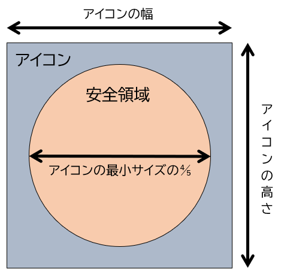

{{PWASidebar}}

[プログレッシブウェブアプリ (PWA)](/ja/docs/Web/Progressive_web_apps) は、他のアプリと同じように端末にインストールできます。PWA をインストールすると、そのアプリアイコンが端末のホーム画面、ドック、タスクバー、またはオペレーティングシステムのネイティブアプリが通常表示される他の場所に表示されます。

例えば、 Windows では、タスクバーにネイティブアプリと PWA アプリのアイコンを並べて表示できます。


PWA を作成する際、端末にアプリがインストールされた際に使用される独自のアイコンのセットを定義できます。この記事では、独自のアプリアイコンを定義する方法、作成するアイコンのサイズ、およびアイコンをマスク機能に対応させる方法について説明します。

> [!NOTE]
> PWA のアプリアイコンは、ブラウザーのアドレスバーなどに表示される{{glossary("favicon", "ファビコン")}}画像とは異なります。 PWA は、ファビコンとアプリアイコンの両方を設定できます。ファビコンについて詳しくは、「[サイトに独自のアイコンを追加](/ja/docs/Learn_web_development/Core/Structuring_content/Webpage_metadata#サイトに自分の好きなアイコンを追加)」を参照してください。

## アイコンをデザインする

アプリアイコンを定義する最初のステップは、そのデザインを作成することです。

ほとんどのユーザーは、アプリケーションをアイコンで認識します。アイコンは、ホーム画面、タスクバー、アプリランチャー、設定パネルなど、オペレーティングシステム内のさまざまな場所に表示されます。ユーザーがアプリケーションを簡単に探せるように、アイコンを視覚的に魅力的で、かつアプリケーションを適切に表すものにするようにしてください。

画像の背景は透明にしましょう。これにより、さまざまな背景の上に表示することができます。サイズは 1024x1024 ピクセル以上、またはそのサイズに拡大可能なものにしましょう。これは、アイコンが最大で表示されるサイズです。また、アイコンが小さなサイズで表示される場合に使用するため、詳細を省いたバージョンを作成することをおすすめします。

アイコンを SVG ファイルでデザインするのもいいでしょう。そうすれば、品質を損なうことなく任意のサイズに拡大縮小することが可能です。

## アイコンをウェブアプリマニフェストから参照する

PWA 用のアイコンセットを定義するには、ウェブアプリマニフェストの [`icons`](/ja/docs/Web/Progressive_web_apps/Manifest/Reference/icons) セクションを使用します。

「[必要なサイズのアイコンを作成する](#必要なサイズのアイコンを作成する)」で説明しますが、アイコンが使用されるすべての場所で正しく表示されるように、複数のバージョンのアイコンを作成する必要があります。このため、 `icons` メンバーは、それぞれ独自のサイズ、タイプ、目的を持つアイコンを表すオブジェクトの配列になっています。各アイコンオブジェクトには、次のプロパティがあります。

- `src`
  - : アイコン画像ファイルの URL。
- `sizes`
  - : このアイコンを使うサイズ。
- `type`
  - : 画像ファイルの {{Glossary("MIME type", "MIME タイプ")}}。これは、オペレーティングシステムが、対応していない画像を迅速に無視するために使用されます。
- `purpose`
  - : この画像の OS 固有の使用目的。

例えば、次のウェブアプリマニフェストでは、サイズが異なる 5 つの PNG アイコンが定義されています。

```json
{
  "name": "My PWA",
  "start_url": "/",
  "display": "standalone",
  "icons": [
    {
      "src": "icon-72.png",
      "sizes": "72x72",
      "type": "image/png"
    },
    {
      "src": "icon-128.png",
      "sizes": "128x128",
      "type": "image/png"
    },
    {
      "src": "icon-144.png",
      "sizes": "144x144",
      "type": "image/png"
    },
    {
      "src": "icon-192.png",
      "sizes": "192x192",
      "type": "image/png"
    },
    {
      "src": "icon-512.png",
      "sizes": "512x512",
      "type": "image/png"
    }
  ]
}
```

## 必要なサイズのアイコンを作成する

多くのオペレーティングシステムでは、場所や機器の能力が異なると、異なるサイズのアイコンを使用します。アイコンを正しく表示するため、使用されるすべての場所で適切に表示されるように、複数のバージョンを作成することが重要です。

例えば、 Windows では、タスクバーにアプリアイコンを 44x44 ピクセルの画像として表示したり、スタートメニューに 150x150 ピクセルの画像として表示したりできます。異なるオペレーティングシステムで利用されるアイコンのサイズに関する詳細情報や、効果的なアイコンの作成に関するヒントについては、以下のリンクを参照してください。

- Windows については、[アイコンとテーマの色を定義する](https://learn.microsoft.com/ja-jp/microsoft-edge/progressive-web-apps-chromium/how-to/icon-theme-color) (learn.microsoft.com) を参照してください。
- Android の場合、 [Google Play アイコンのデザイン仕様](https://developer.android.com/distribute/google-play/resources/icon-design-specifications) (developer.android.com) を参照してください。
- iOS や macOS については、 [App icons](https://developer.apple.com/design/human-interface-guidelines/app-icons#App-icon-sizes) (developer.apple.com) を参照してください。

アイコンの表示サイズは、オペレーティングシステムによって異なり、時間経過とともに変更される場合があります。対応するすべての端末とオペレーティングシステムでアイコンをテストし、最適な結果を得るためのサイズと画像形式を生成することをおすすめします。また、 [PWA Image Generator](https://www.pwabuilder.com/imageGenerator) のようなツールを使用すると、単一の高解像度画像から必要なサイズのアイコンを生成できます。

一部のオペレーティングシステムでは、 [SVG](/ja/docs/Web/SVG) アイコンが対応しています。 SVG は自動的に任意のサイズに拡大縮小できるため、作成する必要のある画像の数を削減できます。ただし、 SVG アイコンが小さなサイズに適切に縮小されない場合は、細部を省略し、簡略化したアイコンを追加で作成する必要がある場合があります。すべてのオペレーティングシステムと小さなサイズに対応するため、アイコンの PNG バージョンも作成してください。

以下のウェブアプリ マニフェストの例では、小さなアイコンに WebP 画像、中サイズのアイコンに ICO 画像、高解像度アイコンに拡大縮小可能な SVG 画像を使用しています。

```json
{
  "name": "My PWA",
  "start_url": "/",
  "display": "standalone",
  "icons": [
    {
      "src": "icon-small.webp",
      "sizes": "48x48",
      "type": "image/webp"
    },
    {
      "src": "icon-medium.ico",
      "sizes": "72x72 96x96 128x128 256x256"
    },
    {
      "src": "icon-high.svg",
      "sizes": "257x257"
    }
  ]
}
```

ウェブアプリの[マニフェストでアイコンを参照する方法](#アイコンをウェブアプリマニフェストから参照する)について、詳細はこちらをご覧ください。

## マスクの対応

オペレーティングシステムと端末の機能に応じて、アイコンにマスクが適用され、特定の形状に合わせることができます。マスク可能なアイコンは、オペレーティングシステムが提供するさまざまな形状で表示できるアダプティブアイコンです。例えば、 Android では、アプリアイコンに円形のマスクを適用できます。

PWA アプリのアイコンは、マスクに対応している必要があります。これにより、マスクを採用しているオペレーティングシステムでは、統合された見た目を実現できます。マスクに対応していないアイコンは、切り取られたり、予想より小さく表示されたりする可能性があります。 Android では、マスク非対応のアイコンが円形のマスクの中心に配置され、白い背景が適用されます。これにより、アイコンの見た目が不自然になる可能性があります。

以下の画像は、 Android におけるマスク可能なアイコンとマスク不可能なアイコンの違いを説明しています。


アプリアイコンをマスク可能にするには、ウェブアプリマニフェストのアイコンオブジェクト内の `purpose` プロパティを使用し、その値を `maskable` に設定します。例えば、

```json
{
  "icons": [
    {
      "src": "icon-192-maskable.png",
      "sizes": "192x192",
      "type": "image/png",
      "purpose": "maskable"
    }
  ]
}
```

`purpose` プロパティを使用することは、アイコンをマスク可能にするための最後のステップです。まず最初に、アイコンがホストオペレーティングシステムとよく統合されていることを確認する必要があります。そのためには、アイコンの重要な部分がマスクの「安全領域」内に適切に表示されるようにする必要があります。

安全領域は、マスクを適用した際に常に表示されることが保証された領域であり、アイコンの最小寸法（最小幅または最小高さ）の 80% を直径とする円として定義されます。



例えば、アイコンが正方形の場合、その正方形が安全領域内に完全に表示され、角が切れないようにしてください。

最後に、マスク可能なアイコンに不透明な背景色を適用し、アイコン領域全体を塗りつぶします。

[Maskable.app](https://maskable.app/) のようなツールを使用すると、様々なオペレーティングシステムでマスクされた際のアイコンの表示を確認できます。

## 関連情報

- [`icons` マニフェストメンバー](/ja/docs/Web/Progressive_web_apps/Manifest/Reference/icons)
- [App design](https://web.dev/learn/pwa/app-design#the_icon) (web.dev)
- [Adaptive icon support in PWAs with maskable icons](https://web.dev/articles/maskable-icon) (web.dev)
- [アイコンとテーマの色を定義する](https://learn.microsoft.com/ja-jp/microsoft-edge/progressive-web-apps-chromium/how-to/icon-theme-color) (microsoft.com)
- [PWA Image Generator](https://www.pwabuilder.com/imageGenerator) (pwabuilder.com)
