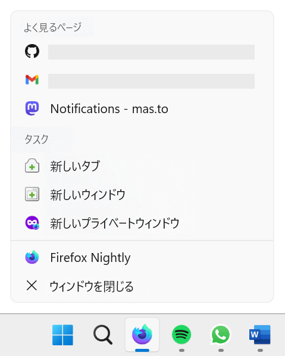

{{PWASidebar}}

多くのオペレーティングシステムには、ユーザーがアプリアイコンを右クリックまたは長押しした際に、ショートカットメニュー（またはジャンプリスト）を表示する機能があります。例えば Windows では、タスクバーにピン留めされたプログラムを右クリックすると、そのプログラム固有のアクションと最近開いたファイルのリストが表示されます。



Androidでは、アプリアイコンを長押しすると、そのアプリでよく使用されるアクションのリストが表示されます。


[プログレッシブウェブアプリ (PWA)](/ja/docs/Web/Progressive_web_apps) は、プラットフォームのネイティブアプリと同様に端末にインストールでき、ネイティブアプリと同様に、ユーザーが共通のアクションにアクセスできるようにアプリのショートカットメニューを定義することもできます。

ショートカットは、アプリアイコンを右クリックまたは長押しした際にのみ表示されます。つまり、 PWA がユーザーのデバイスにインストールされている場合のみ利用可能です。 PWA をインストール可能にする方法については、「[PWA をインストール可能にする](/ja/docs/Web/Progressive_web_apps/Guides/Making_PWAs_installable)」を参照してください。

## なぜショートカットを使うのか

PWA のショートカットを定義することで、ユーザーはホーム画面からアプリの主要なアクションに直接アクセスできるようになり、生産性が向上します。さらに、ショートカットを定義することで、 PWA がプラットフォームにネイティブに統合されたような感覚を与え、ユーザーにとってより親しみやすいものになります。

## ウェブアプリのマニフェストでショートカットを定義する

PWA のショートカットを定義するには、 [`shortcuts`](/ja/docs/Web/Progressive_web_apps/Manifest/Reference/shortcuts) メンバーを[ウェブアプリマニフェスト](/ja/docs/Web/Progressive_web_apps/Manifest)で使用します。このメンバーは、それぞれのショートカットの名前と URL、およびオプションで短縮名、説明、アイコンを定義するオブジェクトの配列です。例えば、以下のカレンダーアプリのウェブアプリマニフェストでは、 2 つのショートカットが定義されています。

```json
{
  "name": "Calendar",
  "start_url": "/",
  "display": "standalone",
  "icons": [
    {
      "src": "images/icon-256.png",
      "sizes": "256x256",
      "type": "image/png"
    }
  ],
  "shortcuts": [
    {
      "name": "New event",
      "url": "/new-event"
    },
    {
      "name": "View today's events",
      "url": "/today"
    }
  ]
}
```

それぞれのショートカットオブジェクトの最も重要なプロパティは次のとおりです。

- `name`
  - : ショートカットメニューに表示されるショートカットの名前です。ユーザーがショートカットの機能を理解できるように、短く簡潔ながら十分な説明を入れるようにしてください。
- `url`
  - : ユーザーがショートカットを選択した際に PWA を起動するための URL です。この URL は絶対パスである場合、ウェブアプリマニフェストの[スコープ](/ja/docs/Web/Progressive_web_apps/Manifest/Reference/scope)内に存在する必要があります。 URL は相対パスとしても指定可能で、その場合は PWA の[開始 URL](/ja/docs/Web/Progressive_web_apps/Manifest/Reference/start_url) を基準に解決されます。

それ以外のショートカットオブジェクトのプロパティはすべてオプションですが、ショートカットをより有益なものにするために、これらのプロパティも指定することを検討してください。

- `short_name`
  - : ショートカットの短縮名。フルネームを表示するスペースがない場合に表示されます。
- `description`
  - : ショートカットの説明。この文字列は、スクリーンリーダーなどの支援技術によってアクセスでき、ユーザーがショートカットの機能を理解するのに役立ちます。
- `icons`
  - : ショートカットメニューに表示する、画像オブジェクトの配列です。それぞれの画像オブジェクトは、ウェブアプリマニフェストの [`icons`](/ja/docs/Web/Progressive_web_apps/Manifest/Reference/icons) メンバーと同じように処理され、さまざまな端末の要件に合わせて異なるサイズのアイコンを提供するために使用することができます。

## 関連情報

- [`shortcuts` マニフェストメンバー](/ja/docs/Web/Progressive_web_apps/Manifest/Reference/shortcuts)
- [Get things done quickly with app shortcuts](https://web.dev/articles/app-shortcuts) (web.dev, 2022)
- [アプリのショートカットを定義する](https://learn.microsoft.com/ja-jp/microsoft-edge/progressive-web-apps-chromium/how-to/shortcuts) (learn.microsoft.com, 2023)
