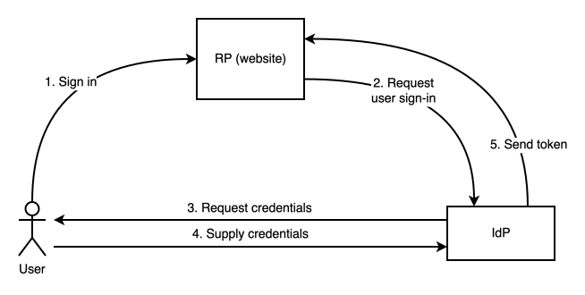
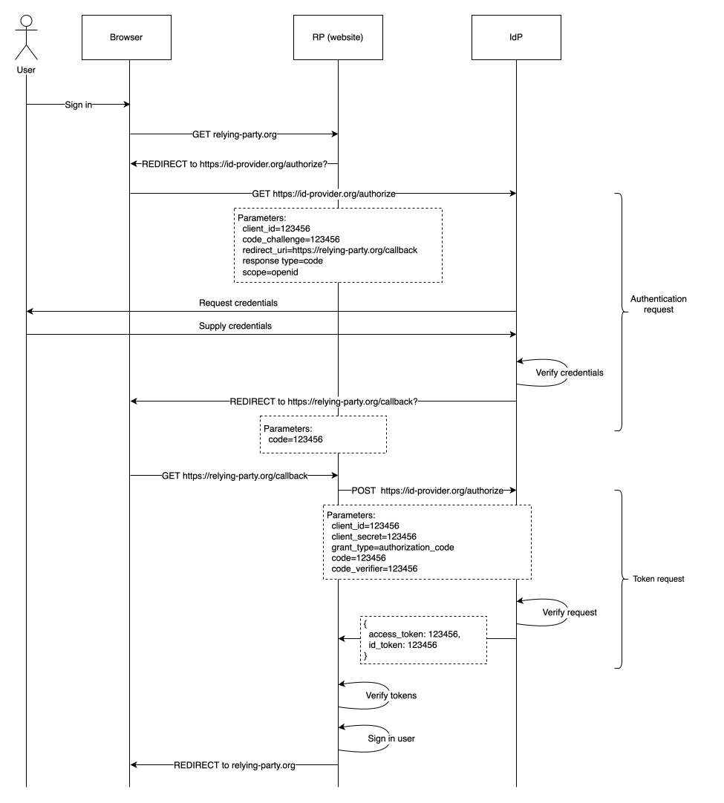

**連合アイデンティティ**システムでは、ウェブサイトは認証処理をサードパーティーに委託します。

- このサードパーティーは、一般に{{glossary("identity provider", "アイデンティティプロバイダー (IdP)")}} と呼ばれ、ユーザーの資格情報を管理し、ユーザーの認証を行うことができます。
- ウェブサイトは、一般に{{glossary("relying party", "認証依頼者 (RP)")}}と呼ばれ、ユーザーの身元に関するアサーションを行うことについて、IdP を信頼しています。

ユーザーがウェブサイトにログインしようとすると、ウェブサイトはユーザーを IdP にリダイレクトします。ユーザーは IdP で認証を行い、IdP はユーザーが正常に認証されたことを示すトークンをウェブサイトに返します。ウェブサイトはトークンが有効かどうかを調べ、有効であればユーザーをログインさせます。

> [!NOTE]
> 連合アイデンティティは、厳密には認証の方法というよりは、さまざまな認証方法が使用できるアーキテクチャのようなものです。つまり、IdP は、従来のパスワード、ワンタイムパスワード、生体認証、パスキーなど、1 つまたは複数の方法を用いてユーザーを認証することを選択できます。

このモデルには、ユーザーとウェブサイトの双方にとっていくつかの利点があります。

- ウェブサイトは、独自の認証機能を実装したり、ユーザーの{{glossary("credential", "資格情報")}}を安全に処理したりする必要がありません。
- 単一の IdP で、多くの異なるウェブサイトにおけるユーザーの認証を行うことができます。つまり、ユーザーはサイトごとに異なる資格情報を使用する必要がありません。資格情報がパスワードである場合、これにより、パスワードの流用や、ユーザーが脆弱で覚えやすいパスワードを選べることによるリスクの軽減が可能です。
- ユーザーが、あなたのウェブサイトが認証を信頼している IdP にすでにアカウントを持っている場合、ユーザーはあるサイト専用の新しい資格情報を取得する必要がないため、サイトへのログインがはるかに簡単になります。

このガイドでは、ウェブサイトが IdP と一緒に作業して、ユーザー向けに連合ログイン機能を追加する方法について解説します。以下の内容を扱います。

- 連合アイデンティティの主要な標準である [OpenID Connect (OIDC)](https://openid.net/developers/how-connect-works/) プロトコルで定義されている主なフロー、およびそれらを実装する際に従うべきベストプラクティス。
- サードパーティクッキーに対するブラウザーの制限が、連合アイデンティティの実装にどのような問題を引き起こすか。
- ブラウザーの役割をより能動的なものにし、RP の役割を簡素化するとともに、サードパーティクッキーへの依存を避けることができる[連合資格情報管理 (FedCM) API](/ja/docs/Web/API/FedCM_API)。
- ウェブサイトが連携する IdP をどのように選べるか、またその選択が連合ログインの実装プロセスにどのような影響を与えるか。

## OpenID Connect

ウェブ上の連合アイデンティティで最も一般的に使用されている標準規格は、[OpenID Connect (OIDC)](https://openid.net/developers/how-connect-works/) であり、これは [OAuth 2.0 認証フレームワーク](https://datatracker.ietf.org/doc/html/rfc6749)を基盤として構築された認証プロトコルです。

### 認証フロー

この節では、まず OIDC で定義されている主な認証フローについて手順を追って説明します。OIDC の認証フローには多くの選択肢がありますが、この解説では推奨される選択肢を紹介し、その他の選択肢については後で説明します。

このフローは、[OpenID Connect Core](https://openid.net/specs/openid-connect-core-1_0.html) 仕様で定義されています。

前提条件として、IdP は RP を認識している必要があります。

- IdP は、RP を識別するための識別子（クライアント ID と呼ばれる）を持つ必要があります
- RP は、IdP に対して自身を認証できる必要があります

認証には、「クライアントシークレット」と呼ばれる共有シークレットや、TLS クライアント認証などの他の仕組みを使用することができます。

> [!NOTE]
> OpenID 仕様では、本ガイドで IdP と呼んでいるものを参照する用語として、「OpenID プロバイダー」(OP) という用語が使用されています。

ここでまず留意すべきことは、このフローが 2 つの部分から構成されているということです。

- **認証リクエスト**: RP は IdP の認証エンドポイントに対してリクエストを行い、IdP にユーザーの認証を依頼します。IdP はユーザーを認証し、認証コードを RP に返します。このコードは短時間（10 分以内が推奨）で有効期限が切れます。
- **トークンリクエスト**: RP は、IdP 内のトークンエンドポイントと呼ばれる別なエンドポイントに認証コードを送信し、このエンドポイントは 2 つのトークンを含むオブジェクトで応答します。
  - アクセストークンは、これにより、ユーザーはウェブサイト内の特定のリソースにアクセスすることができます（API キーのようなもの）。
  - ID トークンは、ユーザーを識別し、RP がユーザーをログインさせることができます。

認証リクエストでは、次のことを行います。

1. ユーザーが RP へログインを要求します。

2. RP はブラウザーを IdP の認証エンドポイントにリダイレクトし、ユーザーの認証を IdP に依頼します。RP はリクエストとともに、以下のようなさまざまな引数を指定することができます。
   - `client_id`: IdP に対してこの RP を識別するためのものです。
   - `response_type`: ここで記述する 2 段階フローを使用する場合、常に `"code"` となります。これが推奨されるオプションです。
   - `redirect_uri`: IdP がユーザーの認証を試みた後、リダイレクトすべき RP 内の URL。これは、IdP が認証コードを配信する先の URL となります。
   - `code_challenge`: この認証リクエストに固有のシークレットの暗号学的{{glossary("hash function", "ハッシュ")}}です。トークンエンドポイントはこれを使用して、トークンリクエストが実にこの認証リクエストに対応するものであることを保証します。
   - `scope`: RP がアクセスを希望するユーザーデータのセットを指定する文字列のリストです。

3. IdP はユーザーを認証します。このプロトコルでは、そのための具体的な方法は指定されていません。IdP は、パスワード、ワンタイムパスワード、生体認証、あるいはそれ以外にも適切な方法を使用することができます。

4. 認証が成功すると、IdP は認可コードを生成します。同時に、`code_challenge` の値を格納し、それを認可コードに関連付けます。その後、IdP はブラウザーを RP のリダイレクト URL へリダイレクトし、その際に認可コードを引数として渡します。

トークンリクエストでは、次のことを行います。

1. RP は、IdP のトークンエンドポイントに対して {{httpmethod("POST")}} リクエストを送信します。このリクエストには、以下の引数を指定します。
   - `client_id`: IdP に対してこの RP を識別するための識別子です。
   - `client_secret`: IdP に対して RP を認証するために使用される秘密鍵です。これは、RP と IdP の間で事前に合意された任意の値とすることができます。共有秘密鍵の代わりに、RP と IdP は、TLS クライアント認証など、クライアント認証のための代替メカニズムを使用することも可能です。
   - `grant_type`: これは `"authorization_code"` である必要があります。
   - `code`: 認証コード。
   - `code_verifier`: これは、認証リクエスト内の `code_challenge` 引数を生成するために使用された元の秘密鍵です。

2. IdP はリクエストの有効性を検証します。
   - クライアントシークレットやその他のクライアント認証の方法を用いて、リクエストが特定の RP から送信されたものであることを認証します。
   - `code_verifier` 引数をハッシュ化し、その結果が `code_challenge` と一致するかどうかを調べます。

3. リクエストが有効な場合、IdP は 2 つのトークンで返します。
   - アクセストークン。これは、ユーザーに RP 内の特定のリソースへのアクセス権を付与するものです。
   - ID トークン。これはユーザーを識別するものです。これは、暗号的に署名された [JSON Web Token](https://www.jwt.io/) です。

4. RP はトークンの検証を行います。それ以外にも、ID トークン上の IdP の署名を調べます。検証に成功した場合、RP はユーザーをログインさせます。

### セキュリティ機能

この節では、先ほど説明した OIDC 認証フローの主なセキュリティ機能についてまとめます。詳細については、[OAuth 2.0 セキュリティに関する最善の手法](https://www.rfc-editor.org/info/rfc9700/)を参照してください。

#### 認証コードフロー

これまで記述してきた 2 段階のフローは、「認証コードフロー」と呼ばれます。「暗黙フロー」と呼ばれる別のフローでは、最初のステップのみが存在し、認証リクエストへのレスポンスにすでにアクセストークンと ID トークンが含まれています。これは、トークンが RP のフロントエンドに公開されてしまうため、安全ではありません。フロントエンドはバックエンドに比べてセキュリティがはるかに低いと見なされているからです。例えば、[XSS](/ja/docs/Web/Security/Attacks/XSS) 攻撃が成功した場合や、ユーザーが悪意のあるブラウザー拡張機能をインストールした場合、攻撃者はユーザーのトークンを盗み出すことができることがあります。

このため、ウェブサイトでは常に認証コードフローを使用しましょう。たとえ攻撃者が認証コードを盗み出したとしても、そのコードと引き換えにトークンを取得するためには、トークンエンドポイントを操作してトークンを発行させる必要があります。

#### クライアント認証

前述のフローでは、RP はトークンリクエストを行う際に、トークンエンドポイントに対して自身を認証します。つまり、攻撃者がなんとか認証コードを盗み出したとしても、IdP からトークンを取得するには、RP になりすますことに成功しなければならないということです。

OAuth 仕様では、[機密クライアント (confidential client) と公開クライアント (public client)](https://datatracker.ietf.org/doc/html/rfc6749#section-2.1) を区別しています。機密クライアントとは、基本的に秘密を保持できる RP であり、公開クライアントとは、秘密を保持できない RP のことです。

この仕様では、ユーザーのブラウザー上で動作するクライアントは「公開クライアント」と考えます。その理由は、すでに触れた通り、攻撃者が XSS などの攻撃を通じてブラウザー内の機密情報にアクセスすることがあまりにも容易であるためです。一方、ウェブサーバー上で動作するクライアントは「機密クライアント」となります。

OIDC では、クライアント認証を使用することができるのは機密クライアントのみです。これは、クライアントの資格情報のセキュリティを維持できると信頼できるのは、機密クライアントのみであるためです。

RP は共有シークレットを介して IdP に対して自身を認証することができますが、{{glossary("TLS")}} によるクライアント認証など、[公開鍵暗号に基づく手法を使用する方が望ましい](https://www.rfc-editor.org/info/rfc9700/#name-client-authentication)ものです。

#### PKCE（コード交換用のプルーフキー）

RP が認証リクエストおよびトークンリクエストでそれぞれ提供する `code_challenge` および `code_verifier` の値は、{{rfc("7636")}} で定義されている PKCE（コード交換用のプルーフキー）と呼ばれる仕組みの一部です。

認証リクエストでは、次のようになります。

- RP は、推測が難しく、かつこの認証リクエストに固有の値を生成します。この値はコード検証値と呼ばれます。
- RP は、コード検証値の{{glossary("hash function", "暗号ハッシュ")}}を生成し、それを認証リクエストの `code_challenge` 引数として使用します。
- IdP はコードチャレンジを格納し、RP に返す認証コードと関連付けます。

トークンリクエストでは、次のようになります。

- RPは、_code_verifier_ 引数を通じてコード検証関数を渡します。
- IdP はコード検証値をハッシュ化し、その結果を格納されているコードチャレンジと比較します。両者が一致しない場合、トークンのリクエストは拒否されます。

PKCE は 2 つの攻撃、[リダイレクト URL に対する CSRF](#リダイレクト_url_に対する_csrf)と[認証コードインジェクション](#認証コードインジェクション)から防御します。

##### リダイレクト URL に対する CSRF

CSRF 攻撃では、攻撃者はユーザーのブラウザーを騙して、ユーザーを攻撃者のアカウントにログインさせてしまいます。これにより、さまざまな悪影響が生じる可能性があります。例えば、ユーザーがそのアカウントにアップロードした個人情報は、攻撃者が利用でき、制御できるようになってしまいます。

PKCE が使用されていない場合、CSRF 攻撃は次のように動作します。

1. 攻撃者は、RP へのログインを依頼します。RP は IdP に対して認証リクエストを送信し、攻撃者は IdP に対して認証を行います。

2. IdP は、攻撃者に対して認証コードを生成し、その認証コードを URL 引数として指定して、攻撃者のブラウザーを RP のリダイレクト URL へリダイレクトします。

3. 攻撃者はこのリダイレクトに介入し、認証コードを含むリダイレクト URL を抽出した上で、フローを終了させます。

4. 攻撃者は、ユーザーを騙してリダイレクト URL をクリックさせます。RP からは、これはユーザーから発信された認証リクエストに対する IdP からのレスポンスのように見えます。

5. RP は、リダイレクト URL から取得した攻撃者の認証コードを記載して、IdP に対してトークンの発行をリクエストします。

6. IdP は、攻撃者のトークンをつけて返信します。

7. RP はユーザーを攻撃者のアカウントにログインさせます。これで、ユーザーが提供するあらゆる情報や指示は、攻撃者の制御下に入ることになります。

要するに、この攻撃が成功するのは、RP が、リダイレクト先 URL へのリクエストが、ユーザーに代わって行われたリクエストに対するレスポンスではないことを認識していないためです。

PKCE を使用した場合は、次のようになります。

- ステップ 1 では、RP は攻撃者のリクエストに対するコード検証値を生成し、ハッシュ化されたコード検証値（コードチャレンジ）を IdP に送信します。
- ステップ 2 では、IdP はコードチャレンジを攻撃者の認証コードとともに格納します。
- ステップ 5 では、RP は IdP が保存したチャレンジと一致するユーザーのコード検証値を見つけることができないため、トークンリクエストは失敗します。

別の防御策として、OAuth 2.0 で定義されている `state` 引数があります。この防御策では、RP が認証リクエストの引数として予測不可能な値を指定し、IdP もレスポンスに同じ値を記載します。RP はこの値が一致しているかを調べます。攻撃者は `state` の値を予測できないため、RP のリダイレクト URL に一致する値を渡すことはできません。

##### 認証コードインジェクション

認証コードインジェクション攻撃では、攻撃者は対象となるユーザーから認証コードを盗み出し、それを自分自身で作成したログインフローに注入することができます。その結果、攻撃者はそのユーザーのアカウントにログインすることになります。

OIDC における認証コードには脆弱性があることが一般的に認められており、その一因として、認証コードがユーザーのブラウザーに公開されていることが挙げられます。例えば、ユーザーが悪意のあるブラウザ拡張機能をインストールした場合、その拡張機能によって認証コードが盗み出される可能性があります。

ここでの主な対策は[クライアント認証](#クライアント認証)です。RP はトークンリクエストを行う際に IdP に対して自身を認証するため、攻撃者は盗んだコードを使って自分自身で勝手にトークンリクエストを行うことはできません。しかし、認証コードインジェクション攻撃の場合、トークンリクエストを行っているのは本物の RP であるため、クライアント認証は成功してしまいます。

PKCEが使用されていない場合、認証コードインジェクション攻撃は次のように動作します。

1. 攻撃者は、ユーザーの認証コードを盗み出すことができます。例えば、ユーザーが、ブラウザーがアクセスする URL にアクセスできる悪意のあるブラウザー拡張機能をインストールしていた場合などです。

2. ユーザーがログインを試みます。RPが認証リクエストを行い、ユーザーが認証を行うと、IdP は認証コードをURL引数として含めた状態で、ブラウザーを RP のリダイレクト URL へリダイレクトします。

3. この時点で、悪意のあるブラウザー拡張機能が認証コードを取得し、それを攻撃者に送信して、ユーザーの認証フローを終了させます。

4. 攻撃者はユーザーの認可コードを受け取ります。

5. 攻撃者は独自の OIDC 認証フローを開始するが、IdP からの認証レスポンスを介入し、認可コードをユーザーから盗んだコードに置き換えます。認証レスポンスは攻撃者宛てであるため、攻撃者の端末を経由して送信されるため、この操作は容易です。

6. その後、RP は、攻撃者が注入したユーザーの認証コードを含めて IdP にトークンリクエストを行うことで、攻撃者に対する認証フローを続行します。

7. IdP は、ユーザーのトークンを返信します。

8. RPは、攻撃者をユーザーのアカウントにログインさせます。

なお、この場合は `state` 引数を使用しても役立ちません。というのも、認証リクエストとレスポンスは実際に同じフロー、つまり攻撃者のフローに属しているからです。

PKCE は、この攻撃に対して次のように防御することができます。

- ステップ 2 では、RP がコード検証子を生成し、ハッシュ化されたコードチャレンジを IdP に送信します。IdP は、このチャレンジをユーザーのコードとともに格納します。
- ステップ 6 において、RP のトークンリクエストには_攻撃者のコード検証子と、ユーザーのコードが含まれています。IdP はユーザーのコードに対応するコードチャレンジを見ていきますが、これは攻撃者のコード検証子とは一致しないため、トークンリクエストは拒否されます。

OIDC で指定されている PKCE の代替手段として、[`nonce`](https://datatracker.ietf.org/doc/html/draft-ietf-oauth-security-topics#name-nonce) という値があります。RP はこれを認証リクエストの別の引数として含みます。IdP はこれを格納し、トークンエンドポイントはトークンとともに RP にこれを返します。その後、RP は返された値が元値と一致するかどうかを調べます。

##### PKCE 使用の保証

PKCE が使用されることを保証するためには、RP は、選択した IdP が PKCE に対応しているだけでなく、PKCE を義務付けていることを確認しなければなりません。つまり、有効なコード検証子が含まれない場合、トークンリクエストを拒否する仕組みになっている必要があります。

そうでない場合、RP は [PKCE ダウングレード攻撃](https://datatracker.ietf.org/doc/html/rfc9700#name-pkce-downgrade-attack)に対して脆弱となります。この攻撃では、攻撃者が IdP を欺き、トークンリクエストにおいて RP が PKCE を使用していないと誤認させます。

### OIDC クライアントのアーキテクチャ

[ブラウザベースのアプリケーション向け OAuth 2.0](https://datatracker.ietf.org/doc/html/draft-ietf-oauth-browser-based-apps-25) 仕様では、ウェブアプリケーションのアーキテクチャが OIDC クライアント（すなわち、認証依頼者）が直面するセキュリティ上の脅威にどのような影響を与えるかについて記述し、ウェブアプリケーションのアーキテクチャに関するいくつかの推奨事項を示しています。

特に、以下の点が指摘されています。

- 最も安全なパターンは、ウェブサイトがウェブサーバーを介して、すべての OAuth/OIDC の操作や、アクセストークンによって保護された API との操作を処理するものです。このパターンでは、RP はクライアントシークレットをサーバー上に保持できるため、機密クライアントとすることができます。また、アクセストークンを含むすべてのトークンをサーバー上に保持することも可能です。

- 次に安全性の高いパターンは、ウェブサイトがウェブサーバーを介してすべての OAuth/OIDC のやり取りを処理するものの、その後アクセストークンをフロントエンドに返し、フロントエンドが直接 API リクエストを行うというものです。このシナリオでは、ウェブサイトは機密クライアントとなり得ますが、ブラウザー上で実行される悪意のあるコード（例えば、XSS 攻撃によるもの）によって、アクセストークンが盗まれる可能性があります。ただし、フロントエンドはアクセストークンを長期的に格納する必要はなく、必要になったときにバックエンドから取得すればよいのです。

- 最も安全性の低いパターンは、OAuth/OIDC とのやり取りと API とのやり取りの両方をフロントエンドで行うものです。これは、例えば、完全にブラウザー上で実行されるアプリケーションにとって自然なアーキテクチャとなります。このアーキテクチャでは、RP はクライアントシークレットを確実に保持できないため、機密クライアントになることはできません。つまり、IdP に対して自身を認証することができないということです。また、トークンを永続的に維持する必要があるため、悪意のあるコードによってトークンが盗まれるリスクが高まります。

同時に、この仕様には、これら 3 つのシナリオそれぞれにおいて遵守すべきセキュリティ対策に関する詳細な推奨事項も含まれています。

### OIDC のログアウト

連合アイデンティティシステムにおけるログアウトのシナリオは、非連合システムに比べてより複雑です。その理由は以下の通りです。

- ユーザーは、RP と IdP のどちらのサイトからでも RP からログアウトすることができます。
- ユーザーは、RP のみからログアウトするか、あるいはグローバルにログアウトするかを選択できます。つまり、この IdP を介してログインしているすべての RP からログアウトするということです。これは、連合アイデンティティを利用してシングルサインオン (SSO) システムを構築する場合によく見られる要件です。このシステムでは、従業員は 1 組の企業用資格情報を使用して、メール、バグトラッカー、ディスカッションフォーラムなどにログインすることができます。

これらのシナリオに対応するには、RP と IdP の間に何らかの通信メカニズムを実装する必要があります。

- ユーザーが IdP でログアウトした場合、RP にその旨が通知され、RP 側でもユーザーのログアウト処理が行われるべきである。
- ユーザーが RP でログアウトした場合、IdP にその旨が通知され、IdP はユーザーが現在ログインしているすべての RP からユーザーをログアウトできるようにすべきである。

OpenID 仕様では、この連携を実装するための 2 つの一般的な手法が定義されており、それぞれ「フロントチャネルログアウト」および「バックチャネルログアウト」と呼ばれています。

[フロントチャネルログアウト](https://openid.net/specs/openid-connect-frontchannel-1_0.html)では、ブラウザーが通信の仲介役として使用されます。この手法では、送信側のページに{{htmlelement("iframe")}}が埋め込まれ、そのコンテンツは受信側から読み込まれます。例えば、ユーザーが IdP でログアウトする場合、IdP は `src` 属性が RP のログアウト URL を指す `<iframe>` を埋め込むことがあります。`<iframe>` がレンダリングされると、ブラウザーはその URL に対して {{httpmethod("GET")}} リクエストを送信し、RP はこれをユーザーのログアウト指示として解釈します。

[バックチャネルログアウト](https://openid.net/specs/openid-connect-backchannel-1_0.html)では、RP と IdP はブラウザーに経由せずに直接通信を行います。例えば、IdP が RP に対してユーザーのログアウトを指示する必要がある場合、IdP は RP に対して直接 {{httpmethod("POST")}} リクエストを送信します。

## サードパーティクッキー

連合アイデンティティシステムを実装する際には、RP、IdP、ユーザー間のやり取りを調整する必要があります。この調整の実装方法によっては、[サードパーティクッキー](/ja/docs/Web/Privacy/Guides/Third-party_cookies)に対するブラウザーの対応に依存するものもあります。

例えば、フロントチャネルログアウト（[OpenID Connect におけるログアウト](#oidc_のログアウト)を実装する手法の一つ）では、サイト間の {{htmlelement("iframe")}} 要素を使用します。この場合、RP の文書内に `<iframe>` が含まれており、そのコンテンツは IdP から読み込まれたか、あるいはその逆となります。これは、埋め込みられた `<iframe>` が、そのオリジンにクッキーを送信できるかどうかに依存します。

同様に、主要な [OpenID Connect 認証フロー](#認証フロー)では、参加者間の連携にフルページリダイレクトが使用されていますが、これはユーザーにとってわずらわしいものとなる上、{{glossary("SPA", "単一ページアプリケーション")}}での対応も困難です。IdP を RP のページ内に `<iframe>` として埋め込むことで、より優れた使い勝手を実現できますが、これもまたサードパーティクッキーに依存しています。

しかし、サードパーティクッキーは[ユーザーの追跡](/ja/docs/Web/Privacy/Guides/Third-party_cookies#サードパーティクッキーの問題点)に広く利用されているため、ブラウザー各社はサードパーティクッキーの対応を段階的に非推奨化し、除去する措置を講じており、現在では一部のブラウザーではデフォルトで対応していません。

したがって、サードパーティクッキーに依存するような方法で連合アイデンティティ機能を実装しないことをお勧めします。

## FedCM API

[連合資格情報管理 API (FedCM API)](/ja/docs/Web/API/FedCM_API) は、連合アイデンティティに対するブラウザーの組み込み対応を提供します。この API はまだブラウザー間での互換性を持たないため、現在も活発に開発が進められており、その使用を全面的に推奨することはできません。しかし、OpenID Connect のようなプロトコルを直接実装する場合に比べ、いくつかの利点が見込まれます。

- 上記で説明した OIDC フローでは、OIDC を使用するウェブサイト（つまり RP）が、自身、ユーザー、IdP 間のやり取りを調整する必要があります。これまで見てきたように、これは複雑であり、したがってエラーの可能性が高いものです。FedCM では、この操作をブラウザーが処理します。RP はブラウザー API を呼び出すだけで、ブラウザーが IdP を特定し、ユーザーに認証を求め、RP がユーザーのログイン処理に使用することができる IdP からのトークンを返します。
- その結果、サードパーティークッキーに依存する必要がなくなるため、FedCM はクッキーをブロックするブラウザーでも動作します。
- FedCM では、ユーザーが IdP に対して認証を行うインターフェイスがブラウザーに組み込まれているため、リダイレクトを伴わず、より一貫性がありシームレスな使い勝手を提供します。

FedCM は、ブラウザーがさまざまな種類の資格情報を扱うことをすることができるフレームワークである[資格情報管理 API](/ja/docs/Web/API/Credential_Management_API) に統合されています。FedCM API を使用して認証を行うには、{{domxref("CredentialsContainer.get()")}} を呼び出し、次のようなさまざまなオプションを渡します：

- ユーザーがこの RP にログインするために使用する IdP の識別子
- RP が IdP を使用しているコンテキスト（例えば、ユーザーが登録中かログイン中かなど）。

`CredentialsContainer.get()` を呼び出すと、ブラウザーは次の処理を行います。

- 指定した IdP に連絡する
- ユーザーがまだログインしていない場合は、選択した IdP にログインするよう促す
- IdP に対し、ユーザーの身元確認を依頼する
- RP がユーザーのログイン処理に使用できるトークンを返す。

### FedCM と連合アイデンティティプロトコル

FedCM 自体は、OIDC などの連合アイデンティティプロトコルを実装しているわけではありません。FedCMは、RP、ユーザー、IdP 間の通信手段を提供するものと考えてよいですが、交換されるアイテムやその解釈については中立的な立場をとっています。

例えば、FedCM を使用した OIDC の実装では、`CredentialsContainer.get()` によって返されるトークンは認証コードである場合があり、その場合、RP は IdP のトークンエンドポイントからアイデンティティトークンを取得する必要があります。つまり、FedCM が処理するのは、[認証フロー](#認証フロー)の最初の部分のみです。[FedCM for OAuth](https://github.com/aaronpk/oauth-fedcm-profile) のドキュメントでは、FedCM を使用して OAuth および OIDC を実装する方法について説明しています。

一般的に、RP が連合ログインに特定の IdP を使用することを決定した場合、RP は IdP に登録を行います。このプロセスの一環として、IdP は RP に対し、どのような引数の指定を期待しているか、IdP が返すオブジェクトをどのように処理すべきか、RP が実装すべきその他の動作について、具体的に説明する必要があります。

## IdP の選択

サイトに連合ログインを追加する際、直面する基本的な選択の一つは、どの連合アイデンティティプロバイダーと連携するかを決めることです。サイトの利用候補者が、選択したIdPのいずれかにすでにアカウントを持っている場合、そのユーザーがサイト上で新しいアカウントを作成するのははるかに簡単になります。

つまり、想定されるユーザー層の大部分が、選択した IdP にすでにアカウントを保有している場合、登録者数が増える可能性が高いでしょう。

ウェブサイトでは、より多くのユーザーを網羅し、選択肢を増やすために、複数の IdP でのログインをすることができるのが一般的です。しかし、選択肢が多すぎるとユーザーが混乱してしまうほか、複数の IdP にアカウントを持っているユーザーは、どの IdP で登録したか思い出せなくなる可能性があります。

また、選択した IdP のいずれも使用できないユーザー向けに、代替手段を提供することも一般的です。この代替手段では、ユーザーは[パスワード](/ja/docs/Web/Security/Authentication/Passwords)や [OTP](/ja/docs/Web/Security/Authentication/OTP) などの方法を用いて、サイトに直接認証を行います。

どの ID プロバイダーを選べばいいか分からない場合でも、そのプロバイダーからは、サイトを自社のシステムと連携させるための詳細な手順やツールが提供されます。これにより、OIDC のようなプロトコルに固有の複雑な問題の多くは解決されるでしょう。とはいえ、その裏側で何が起きているのかを理解しておくことは、非常に役立ちます。

## 利点と欠点

ウェブ開発者にとって、連合アイデンティティを使用する最大の利点は、指定された IdP のいずれかにすでにアカウントを持っているユーザーにとって、登録の手間を縮小できることです。さらに、ユーザーが選択した IdP は、ウェブサイトが連合アイデンティティを安全に実装するのに役立ちます。

セキュリティの視点から見ると、大きな利点としては、ユーザーがそれぞれのアカウントで新しい資格情報を生成する必要がないため、覚えやすいが脆弱なパスワードを選んでしまったり、複数のサイトで同じパスワードを再利用したりするリスクが低減されるという点があります。

連合アイデンティティを使用することは、パスワードだけを使用するよりも安全な選択肢ですが、それでも問題点は残っています。

- ユーザーベースの大きな IdP を選択することによるウェブサイト側のメリットは、その結果、この分野がごくいくつかしかない巨大プロバイダーによって独占されがちになるということです。これによってユーザーはそれらのプロバイダーに縛られることになり、その結果、それらを使用したくない（あるいは使用できない）ユーザーに対して、ウェブサイトが使いにくくなってしまいます。

- - ウェブサイトが、選択した IdP で登録したくない（あるいは登録できない）ユーザーを完全に締め出すつもりがない限り、そのサイトは代替認証方法を実装する際のあらゆる複雑さに対処しなければなりません。

- ユーザーがウェブサイト上で機密情報を入力することに頼っている他の認証システムと同様に、連合アイデンティティも[フィッシング](/ja/docs/Web/Security/Attacks/Phishing)攻撃に対して脆弱です。
