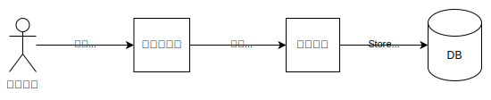
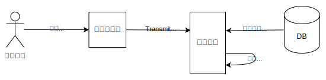

ウェブ上において当初からある認証方法であり、現在でも最も一般的であるのがパスワードです。

このガイドでは、次のことを案内します。

- パスワード認証についての簡単な[概要](#概要)の説明
- [遭遇する主な攻撃と、それに対する防御策](#攻撃と防御)
- 3 つの主要な手続きである[登録](#登録)、[ログイン](#ログイン)、[パスワード再設定](#パスワード再設定)についてより詳細に説明し、防御策をどのように組み込むかを示します。

最後に、最善の手法を徹底したとしても、[パスワード認証は比較的脆弱な認証方式であると認識すべきである](#パスワード認証の弱点)こと、そして可能であれば、他の方法と併用するか、あるいは完全に置き換えるべきであるという点について解説します。

## 概要

パスワードによる認証を提供するために、ウェブサイトでは主に「登録」と「ログイン」の 2 つの手順を実装します。

ユーザーが登録するときは次のようになります。

1. ユーザーは、新しいユーザー名とパスワードを、ウェブサイトの {{htmlelement("form")}} 要素などに入力します。
2. ウェブページはユーザー名とパスワードを、{{httpmethod("POST")}} リクエストでフォームを送信するなどの方法で、サーバーに送信します。
3. サーバーは、データベースにこのユーザー用の新しいレコードを作成します。キーはユーザー名となり、その下にパスワードが格納されます。



ユーザーがサインインするときは次のようになります。

1. ユーザーはユーザー名とパスワードを入力します。
2. ウェブページは、ユーザー名とパスワードをサーバーに送信します。
3. サーバーは、そのユーザーの格納されたパスワードを取得し、格納されたパスワードと、先ほど受け取ったパスワードとを照合します。
4. パスワードが一致した場合、ユーザーはログインされます。



## 攻撃と防御

この概要を見ていくことで、攻撃者がユーザーになりすます方法のいくつかがわかります。

- **推測**
  - : 攻撃者は、あるユーザーのパスワードとして考えられるさまざまな候補を次々と試す可能性があります。攻撃者は通常、最も一般的なパスワードを多数収録したパスワードリストを使用します。

- **資格情報の流用**
  - : 攻撃者は、別のサイトで以前に発生した情報漏洩事件から取得したユーザー名とパスワードの組み合わせを大量に購入し、ユーザーが両方のサイトで同じパスワードを使用している可能性に期待して、対象となるサイトでそれらを試す可能性があります。

- **傍受**
  - : 攻撃者は、ブラウザーからサーバーへ送信されるユーザー名やパスワードに傍受することが可能です。その具体的な方法の一つとして、カフェや空港に無料の Wi-Fi ホットスポットを設定し、被害者が接続して対象のウェブサイトにログインするのを待ち伏せする方法が挙げられます。

- **データベースへの不正アクセス**
  - : 攻撃者がサーバーに侵入し、格納されている記録のデータベースを盗み出すことが可能です。

- **フィッシング**
  - : 攻撃者は、ユーザーを騙してパスワードを教えさせる可能性があります。例えば、攻撃者は標的となるサイトのログインページと同様にそっくりなページを生成し、注文状況を調べたりメッセージを受け取ったりするためにログインするよう依頼するメールに、その偽ページへのリンクを記載して標的となるユーザーに送信するといった手口があります。

### 防御

- **パスワードマネージャーの対応**
  - : パスワードマネージャーとは、ユーザーがパスワードを記憶する必要がないよう、パスワードを格納することができるアプリケーションのことです。また、パスワードマネージャーはログインフォームへのパスワードの自動入力や、ユーザーのために強固なパスワードを生成する機能も備えています。パスワードマネージャーは多くの場合、ブラウザー拡張機能として実装されており、ブラウザー自体にも独自のパスワード管理機能が組み込まれていることがあります。

    パスワードマネージャーは、ユーザーが強力なパスワードを簡単に持つことができるようにし、パスワードの再利用を縮小することで、[推測](#推測)や[資格情報の流用](#資格情報の流用)の脅威を軽減するのに役立ちます。同時に、[フィッシング](/ja/docs/Web/Security/Attacks/Phishing#パスワードマネージャー)に対抗するのにも役立ちます。フィッシング攻撃で使用される「偽装サイト」ではログイン情報が自動入力されないため、ユーザーがそのサイトが正規のものではないことに気づきやすくなるからです。

    [登録](#登録)および[ログイン](#ログイン)フローに関するガイドラインでは、パスワード管理ツールがサイトと連携できるようにするための方法の概要について説明しています。

- **強いパスワードの選択**
  - : [推測](#推測)や[資格情報の流用](#資格情報の流用)を防ぐため、ユーザーが[登録](#登録)や[パスワード再設定](#パスワード再設定)の際に新しいパスワードを作成する際、そのパスワードが脆弱ではないか、あるいは漏洩が確認されているパスワードのリストに現れていないかを調べることができます。

- **保護されたパスワード転送**
  - : [傍受](#傍受)を防ぐためには、パスワードは常に {{glossary("HTTPS")}} 経由で送信しなければなりません。ただし、これはパスワードの送信に限った要件ではありません。ウェブサイト上のすべてのページは、[中間者攻撃 (MITM)](/ja/docs/Web/Security/Attacks/MITM) を軽減するため、常に HTTPS 経由で送信すべきです。

- **保護されたパスワード保存先**
  - : [データベースへの不正アクセス](#データベースへの不正アクセス)を防ぐためには、サーバーはパスワードを、たとえ攻撃者がサーバーのデータベースにアクセスできたとしても、元のパスワードを復元することが事実上不可能な形式で格納しなければなりません。この要件については、[登録](#登録)フローのガイドラインで扱います。

次の 3 つの節では、パスワードベースの認証システムに必要となる主なフローについて、より詳しく見ていきます。

- [登録](#登録)
- [ログイン](#ログイン)
- [パスワード再設定](#パスワード再設定)

それぞれの節では、掲載されている攻撃による脅威を最小限に抑えるための役立つ対策についてご紹介しますが、後ほどお分かりいただけるように、それらを完全に排除することは不可能です。

## 登録

登録の際、新規ユーザーは新しいユーザー名とパスワードを入力します。また、サイト側ではメールアドレスの入力を求める場合が一般的であり、そのメールアドレスをユーザー名として使用することもできます。

このサイトでは、HTML の {{htmlelement("form")}} を使用して、この情報を入力するように要求してください。

### フォーム設計

フォームはうまく設計されていると、ユーザーがパスワードを効果的に管理しやすく、またパスワードマネージャーとサイトとの連携もしやすくなります。

通常、登録フォームでは、パスワードマネージャーは次のような動作を行います。

- ユーザーが新しいパスワードを作成するよう依頼されていることを認識し、パスワードの自動生成を提案してください。これにより、[推測](#推測)や[資格情報の流用](#資格情報の流用)からの防御に役立ちます。
- - ユーザーが登録フォームを送信したことを検知し、そのサイトに関連付けられたユーザー名とパスワードを記憶することを提案します。

下記の慣行に従うことで、パスワードマネージャーは、操作が求められるフォームや、そこに含まれている要素、そして介入が必要なタイミングを認識できるようになります。

- `<form>` 要素は、登録専用としてください。
- フォームは、送信が完了したことを明確に示す必要があります。具体的には、送信時に別のページへ遷移するか、`History.pushState()` または `History.replaceState()` を使用して遷移をシミュレートするかが必要です。
- 個々の `<input>` 要素には、正しい `type` を使用してください。
  - ユーザー名には `"text"` または `"email"`
  - パスワードには `"password"`
- 個々の `<input>` 要素には、適切な `autocomplete` 属性を使用してください。
  - ユーザー名には `"username"`
  - 登録フォームやパスワード再設定フォームで新しいパスワードを作成するには `"new-password"`
  - ログインフォームやパスワード再設定フォームでの既存のパスワードの入力には `"current-password"`
- フォームでは、ユーザーが入力する必要のない情報であって、パスワード管理ツールへのヒントとなるようなものについては、非表示フィールドを使用しましょう。例えば、パスワード変更フォームでは、ユーザーがユーザー名を持つ必要はないかもしれませんが、そのユーザー名があれば、パスワード管理ツールがどのパスワードを入力すべきかを判断するのに役立ちます。

詳しくは、下記を参照してください。

- [ログインフォームのベストプラクティス](https://web.dev/articles/sign-in-form-best-practices#new-password)<sup>(英語)</sup>
- [パスワードマネージャーをログインフォームと連携させる](https://hidde.blog/making-password-managers-play-ball-with-your-login-form/)<sup>(英語)</sup>
- [優れたパスワード入力フォームを作成する](https://www.chromium.org/developers/design-documents/create-amazing-password-forms/)<sup>(英語)</sup>

登録フォームでは、通常、ユーザーにパスワードを 2 回入力するよう依頼します。

### フォーム送信

ユーザーがフォームを送信すると、ウェブサイトのフロントエンドは、HTTP {{httpmethod("POST")}} リクエストを使用して、ユーザー名、パスワードの 2 つのコピー、メールアドレスをサーバーに送信します。これは、攻撃者が転送中のパスワードを[傍受](#傍受)できないようにするため、{{glossary("HTTPS")}} 経由で行う必要があります。

### ユーザー名とパスワードの検証

サーバーが `POST` リクエストを受信すると、ユーザー名とパスワードの検証を行います。ユーザー名は既存のユーザー名と一致してはいけません。また、入力された 2 つのパスワードは一致している必要があります。

ユーザーがより強固なパスワードを選択できれば、[推測](#推測)攻撃のリスクを縮小することが可能で、ウェブサイトが従うポリシーもこの一助となります。

ユーザーが新しいパスワードを設定する際、ウェブサイトは以下の対応を行うべきです。

- パスワードの最大文字数を十分に長くしてください（64 文字以上）。
- 任意の Unicode 文字が利用できるようにします。
- 特定の文字種を要求しないでください（例えば、大文字と小文字の混在や、句読点を必須としないなど）。このようなルールによって、強力なパスワードの選択肢（例えば、パスフレーズなど）を多く排除してしまう可能性があり、ユーザーは通常、こうしたルールに対して非常に予測可能な方法で対応してしまいます。

さらに、ウェブサイトでは以下のことが可能です。

- 一般的なパスワードリストに掲載されているパスワードを拒否することで、[推測](#推測)攻撃のリスクを縮小します。
- データ漏洩で流出したパスワードを拒否することで、[資格情報流用攻撃](#資格情報流用)のリスクを縮小しましょう。例えば、[Have I Been Pwned](https://haveibeenpwned.com) というウェブサイトでは、データ侵害で得られるパスワードのリストを提供しており、[API](https://haveibeenpwned.com/API/v3#PwnedPasswords) を通じて利用可能です。

ただし、これがこうした攻撃に対する完全な防御策とはほど遠いことに留意してください。例えば、データ漏洩が公表されていない場合や、パスワードが設定された後に登録される場合などがあるからです。

また、ウェブサイトでは、[zxcvbn](https://github.com/zxcvbn-ts/zxcvbn) のようなパスワード強度チェックツールを使用することも考えてみるべきです。注目すべき点は、このツールが Have I Been Pwned のデータとパスワードを照合して安全性を確認する機能も備えていることです。

詳しい情報については、こちらをご覧ください。

- [OWASP 認証早見表](https://cheatsheetseries.owasp.org/cheatsheets/Authentication_Cheat_Sheet.html#implement-proper-password-strength-controls)<sup>(英語)</sup>
- [NIST デジタルアイデンティティに関するガイドライン: 認証とライフサイクル管理](https://pages.nist.gov/800-63-3/sp800-63b.html)<sup>(英語)</sup>
- [パスワードの進化: 現行の認証ガイドライン](https://www.troyhunt.com/passwords-evolved-authentication-guidance-for-the-modern-era/)<sup>(英語)</sup>

クライアントは、データをサーバーに送信する前に検証を行うことがありますが、これはあくまでユーザーの利便性を考慮したものであり、サーバー側でも同様にデータの検証を行う必要があります。

### パスワードの保存

エラーが発生した場合は、サーバーはエラーメッセージをつけて返します。それ以外の場合は、サーバーはパスワードをユーザー名をキーとしてデータベースに格納します。

#### パスワードのハッシュ化

ウェブサイトは、パスワードを{{glossary("plaintext", "平文")}}の形で格納してはいけません。その代わりに、ユーザーが新しいパスワードで登録する（またはパスワードを変更する）際、パスワードをハッシュ化し、そのハッシュ値を格納します。ユーザーがログイン時にパスワードを示すと、サイトは次のように処理します。

- データベースからハッシュを取得する
- ユーザーから提供されたパスワードをハッシュ化する
- ハッシュ同士を比較する

ハッシュは「一方向関数」です。これは、ハッシュ関数の出力から元の入力を導き出すことはできないということを意味します。

つまり、攻撃者がデータベースへのアクセス権を取得できた場合、通常は一般的なパスワードのリストをハッシュ化し、その結果をデータベース内の項目と照合することで、パスワードの抽出を試みます。このため、パスワードの保存に用いられるハッシュ関数は、意図的に処理速度が遅く、最適化が困難なものに設定されています。

パスワードのハッシュ化を目的として設計されたハッシュ関数では、通常、ハッシュを作成するために必要な処理量を設定することができるため、攻撃者の想定される能力に応じて、処理速度を遅くしたり速くしたりすることができます。

#### 計算済みハッシュ表

攻撃者は、ハッシュ表を自ら計算するのではなく、考えられるパスワードとそのハッシュを割り当てた事前計算済みの表（[レインボーテーブル](https://ja.wikipedia.org/wiki/レインボーテーブル)とも呼ばれます）から、ハッシュに対応するパスワードを調べることが可能です。

| パスワード | ハッシュ    |
| ---------- | ----------- |
| pa55w0rd   | 56965E2A... |
| abcdef     | BEF57EC7... |
| letmein    | 1C8BFE8F... |

これらの表はとても大規模なものになる可能性がありますが、テーブル検索は高速な操作であるため、このような攻撃が効果を発揮することがあります。

#### ソルトとペッパー

事前計算されたハッシュテーブルを利用する攻撃を防ぐためには、パスワードをハッシュ化する前に「ソルト」を追加する必要があります。ソルトとは、各パスワードごとに固有のランダムな値のことです。これを秘密にする必要はありません。ソルトはハッシュ化されたパスワードと一緒に格納されます。しかし、ソルトがあることで特定のパスワードが異なるハッシュ値になるため、攻撃者が事前計算されたハッシュ値を利用することを防ぐことができます。

さらなる防御策として、ウェブサイトではハッシュ関数の入力に「ペッパー」を追加することもあります。ソルトとは異なり、ペッパーは次のようなものです。

- 固有ではありません。データベース内のすべてのパスワードに同じ値を使用します。
- 機密情報です。データベース自体には格納せず、ハードウェアセキュリティモジュール (HSM) などの別個の場所に格納しなければなりません。

#### ハッシュアルゴリズム

ウェブサイトでは、パスワードのハッシュ化に標準的なアルゴリズムを使用しましょう。これらのアルゴリズムは、以上で述べたすべての機能に対応しています。[OWASP のパスワード保存ガイド](https://cheatsheetseries.owasp.org/cheatsheets/Password_Storage_Cheat_Sheet.html#password-hashing-algorithms)<sup>(英語)</sup>では、推奨順として以下のものを挙げています。

1. [Argon2id](https://ja.wikipedia.org/wiki/Argon2)
2. [scrypt](https://ja.wikipedia.org/wiki/Scrypt)
3. [bcrypt](https://ja.wikipedia.org/wiki/Bcrypt)
4. [PBKDF2](https://ja.wikipedia.org/wiki/PBKDF2)

#### ウェブフレームワークの使用

パスワードの保存や認証機能は、安全に実装するのが難しいため、自分自身で実装しようとするのではなく、信頼できるフレームワークが提供する関数を使用しましょう。例えば、[Django](https://docs.djangoproject.com/en/5.0/topics/auth/passwords/) ではデフォルトで PBKDF2 が使用されていますが、必要に応じて別のアルゴリズムを選択することができます。

### 電子メール認証

ウェブサイトがパスワード再設定のフローで電子メールを使用する場合、サーバーは、そのメールアドレスが登録ユーザーのものであるかどうかも調べなければなりません。これを行うために、サーバーは通常、ランダムなトークンを生成し、それを確認用 URL の引数として設定します。

```plain
https://example.org/verify?<random-token>
```

その後、サーバーはユーザーが提供したメールアドレス宛にメールを送信します。そのメールには、確認用 URL へのリンクをクリックするようユーザーに依頼されています。ページはそのトークンを抽出し、それを使用してデータベース内のユーザーの記録を探します。その後、そのメールアドレスを「確認済み」としてマークすることができます。

## ログイン

ログインするには、ユーザーはログイン専用の HTML `<form>` を使用して、ユーザー名とパスワードを入力します。

登録フォームと同様に、ログインフォームもパスワードマネージャーと連携できるように設計する必要があります（また、連携が機能することをテストする必要があります）。そのためには、フォームは以前[フォーム設計](#フォーム設計)で説明したベストプラクティスに従う必要があります。

ユーザーがフォームを送信すると、ウェブサイトのフロントエンドは HTTP の `POST` リクエストを使用して、ユーザー名とパスワードをサーバーに送信します。繰り返しになりますが、通信中のパスワードを攻撃者に傍受されないようにするため、これは必ず TLS 経由で行わなければなりません。

サーバーが `POST` リクエストを受信すると、サーバーは次の処理を行います。

- 指定されたユーザー名のレコードを取得します。
- レコードが存在する場合、指定されたパスワードとレコード内の値を照合します。

照合に成功した場合、サーバーはユーザーをログインさせ、成功を返します。

レコードが得られなかった場合、または照合に失敗した場合、サーバーはどちらの場合でも同じエラーメッセージを返す必要があります。そうしないと、攻撃者がアカウントの存在を特定できてしまい、その情報を使用することができるため、さらなる攻撃を実行するおそれがあります。

## パスワード再設定

パスワード再設定のフローにより、ユーザーはパスワードを忘れたり紛失したりした場合に、パスワードを再設定することができます。通常、このフローにはユーザーが登録時にメールアドレスを登録してある（そして確認済みである）ことに依存しています。

ユーザーがパスワードのリセットをリクエストすると、ウェブサイトはユーザーにメールアドレスの入力を依頼します。この点で、悪意のあるサードパーティーが正当なユーザーに対して大量のパスワードリセットリクエストを送りつけるのを防ぐため、ウェブサイトはユーザーに CAPTCHA の解決を求めることがあります。

その後、ウェブサイトのバックエンドは、そのメールアドレスに関するレコードがあるかどうかを調べます。レコードがあるかどうかに関わらず、ウェブサイトはユーザーに対して、指定されたアドレスに詳細な手順を記載したメールを送信した旨の、同じメッセージを表示します。どちらの場合でも同じメッセージを提供することで、攻撃者が特定のメールアドレスがアカウントに関連付けられているかどうかを特定するのを防ぎます。この情報は、さらなる攻撃（標的型[フィッシング](/ja/docs/Web/Security/Attacks/Phishing)やスピアフィッシングなど）に使用できるためです。

- ウェブサイトにそのメールアドレスが登録されていない場合、そのアドレス宛てにメールを送信し、誰かが「パスワード再設定」フォームにこのメールアドレスを入力したが、サイトに登録されていない旨を通知します。これは、複数のメールアドレスを所有している正当なアカウント所有者が、パスワード再設定フォームに間違ったアドレスを入力してしまった場合に役立ちます。

- ウェブサイトにそのメールアドレスのレコードがあった場合は、ウェブサイトは次のように処理します。
  - ランダムな数値であるリセットトークンを生成し、そのトークンをレコードと一緒に格納します。トークンには有効期限のタイムスタンプを設定します。
  - トークンの値を、リセット用 URL の URL 引数として設定します。例: `https://example.org/reset?<reset-token>`
  - ユーザーが登録したメールアドレス宛に、リンクが記載されたメールを送信し、そのリンクをクリックするよう依頼します。

ユーザーがリンクをクリックすると、リセットページは URL 引数を抽出し、一致する格納されたリセットトークンを検索します。リセットトークンが得られ、かつ有効期限が切れていない場合、ウェブサイトはユーザーに新しいパスワードの入力を許可します。このフローは、パスワードマネージャーが新しいパスワードを認識できるようにするため、[登録](#登録)フォームと同様のルールに従います。

最後に、ウェブサイトからユーザーにパスワードが変更されたことを確認するメールが送信されます。

詳しくは、以下の記事を参照してください。

- [安全なパスワード再設定機能の構築について、知っておきたいすべてのポイント](https://www.troyhunt.com/everything-you-ever-wanted-to-know/)<sup>(英語)</sup>
- [パスワードを忘れた場合の早見表](https://cheatsheetseries.owasp.org/cheatsheets/Forgot_Password_Cheat_Sheet.html)<sup>(英語)</sup>

## パスワード認証の弱点

以上説明した対策は、パスワードベースの認証システムのリスクを縮小するのに役立つのですが、それでもパスワードは本質的に脆弱な認証方法であることに変わりありません。

- パスワードマネージャーや適切なパスワードポリシーによって、ユーザーは強力なパスワードを選択したり、パスワードの流用を避けたりする助けにはなりますが、それらだけでは確実な保証はできず、ユーザーは[資格情報流用攻撃](#資格情報流用)や[推測](#推測)の脅威にさらされたままとなります。

- たとえユーザーが強力なパスワードを持ち、それを再利用していなかったとしても、ユーザーが[フィッシング](#phishing)攻撃に対して脆弱な状態であることは変わりありません。

これらの弱点を解消するため、パスワードの代わりに、あるいは{{glossary("multi-factor authentication", "追加の認証要素")}}として、他の方法を使用することを検討してください。例えば、ウェブサイトによっては、パスワードに加えて[ワンタイムパスワード](/ja/docs/Web/Security/Authentication/OTP)を第二の認証要素として使用したり、フィッシング攻撃に強い[パスキー](/ja/docs/Web/Security/Authentication/Passkeys)に対応している場合もあります。
